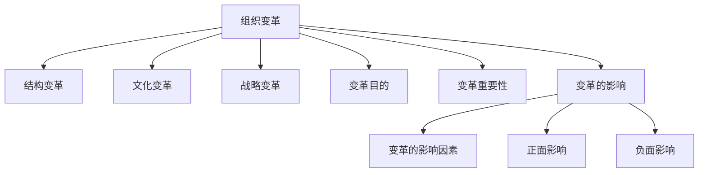

                 

### 文章标题：组织变革：引导团队度过转型期的方法

> 关键词：组织变革、团队引导、转型期、策略、案例分析

> 摘要：本文将从组织变革的定义和重要性出发，探讨在转型期引导团队的方法和策略。通过分析变革的影响、理论基础、变革前的准备、变革过程中的领导与管理技巧，以及变革后的巩固与持续发展，结合实际案例，提供一套完整的组织变革指导方案。

----------------------------------------------------------------

### 1. 核心概念与联系

#### 组织变革的定义与类型

**组织变革概述**

组织变革是指为了适应外部环境的变化、内部需求的提升或追求组织卓越，对组织结构、文化、流程、战略等方面进行的系统性调整和改进。组织变革的类型主要包括以下几种：

- **结构变革**：部门重组、流程优化等。
- **文化变革**：价值观重塑、团队协作模式等。
- **战略变革**：业务拓展、市场定位调整等。

**组织变革的目的与重要性**

**变革目的**

- **适应市场变化**：提升竞争力，确保企业的长期生存与发展。
- **提升组织效能**：提高工作效率，降低运营成本。
- **增强创新能力**：激发员工创造力，推动技术创新。

**变革重要性**

- **应对竞争压力**：在竞争激烈的市场中，持续变革是企业保持竞争优势的关键。
- **促进成长发展**：通过变革，企业可以实现新的业务模式和增长点。
- **提升员工满意度**：变革可以为员工提供新的发展机会和职业挑战。

**组织变革的影响**

- **变革的影响因素**：变革的规模和深度、变革的速度和时机、变革的领导力和策略。
- **变革的正面影响**：提升组织适应能力、增强团队协作、提高员工满意度和忠诚度、激发创新活力。
- **变革的负面影响**：员工抵触情绪、短期业绩波动、内部沟通不畅。

#### 核心概念与联系架构图

### 2. 组织变革的理论基础

#### 组织变革理论概述

**经典理论**

- **巴纳德的组织理论**：强调组织内部沟通和协作的重要性。
- **韦伯的官僚组织理论**：认为组织应该通过明确的规则和流程来提高效率。
- **马克斯·韦伯的变革理论**：提出变革是组织发展的必然过程。

**现代理论**

- **企业系统动力学**：研究组织内部各种因素之间的相互影响。
- **资源基础观**：强调组织内部资源和能力的积累对变革的影响。
- **创新理论**：关注组织如何通过创新来适应外部环境的变化。

#### 组织变革模型

- **切入点模型**：通过选择一个关键点作为变革的切入点，逐步推动整个组织的变革。
- **PDCA循环模型**：即计划（Plan）、执行（Do）、检查（Check）、行动（Act）的循环过程，不断优化和改进。
- **沃伦·本尼斯的变革领导模型**：强调领导者在变革过程中的关键作用，包括愿景塑造、沟通、激励等。

#### 变革管理的核心原则

- **领导力**：变革需要强有力的领导，明确目标，提供方向。
- **沟通**：有效的沟通是变革成功的关键，确保信息传递一致。
- **参与度**：让员工参与到变革过程中，增加变革的接受度。
- **支持系统**：建立支持和反馈机制，及时解决变革过程中的问题。

### 3. 变革前的准备

#### 评估当前组织状况

- **分析组织结构**：评估现有组织架构的适应性和效率。
- **评估组织文化**：分析组织文化是否支持变革。
- **评估资源**：分析组织的人力、财务等资源状况。

#### 制定变革计划

- **明确变革目标**：确定变革的具体目标和期望结果。
- **制定变革策略**：选择合适的变革模式和方法。
- **制定变革时间表**：规划变革的具体步骤和时间节点。

#### 变革团队组建

- **组建变革领导团队**：包括变革推动者和执行者。
- **组建变革支持团队**：提供技术支持和资源保障。

#### 变革沟通计划

- **制定内部沟通策略**：确保员工对变革的理解和支持。
- **制定外部沟通策略**：处理变革过程中的公众关系。

### 4. 引导团队度过变革期

#### 变革过程中的领导

- **领导角色转变**：从指挥者转变为引导者。
- **确保团队成员参与**：鼓励员工提出意见和建议。
- **解决团队冲突**：及时处理团队内部的矛盾和分歧。

#### 变革管理技巧

- **建立信任**：通过开放沟通和透明决策，建立信任。
- **管理恐惧**：通过教育和培训，减少员工的恐惧。
- **奖励与激励**：通过激励机制，鼓励员工积极参与变革。

#### 变革过程监控

- **定期评估变革进展**：通过关键绩效指标（KPI）衡量变革效果。
- **调整变革策略**：根据实际情况，灵活调整变革计划和策略。

### 5. 变革后的巩固与持续发展

#### 变革后评估

- **评估变革成果**：对变革效果进行客观评估。
- **识别遗留问题**：找出变革过程中未解决的问题。
- **收集员工反馈**：了解员工对变革的满意度和改进建议。

#### 组织文化重塑

- **塑造变革后的组织文化**：建立以变革为导向的企业文化。
- **培养变革思维**：鼓励员工持续学习和创新。

#### 持续发展策略

- **制定长期发展规划**：确保企业的持续发展和变革的持续效应。
- **建立持续改进机制**：通过定期评估和反馈，持续优化组织结构和流程。

### 6. 实战案例与启示

#### 案例一：公司A的数字化转型

- **案例背景**：随着市场环境的不断变化，公司A决定进行数字化转型。
- **变革过程**：通过引入新的技术和管理理念，对公司A进行了全面的数字化转型。
- **变革成果**：公司A的运营效率得到显著提升，市场份额也得到扩大。
- **启示与反思**：数字化转型需要充分的准备和持续的努力。

#### 案例二：企业B的市场战略调整

- **案例背景**：企业B面临激烈的市场竞争，决定调整市场战略。
- **变革过程**：通过市场调研和战略规划，企业B成功调整了市场定位和营销策略。
- **变革成果**：企业B的市场份额得到显著提升，品牌知名度也有所提高。
- **启示与反思**：市场战略调整需要准确的判断和有效的执行。

#### 案例三：组织C的团队重组

- **案例背景**：组织C的团队协作效果不佳，决定进行团队重组。
- **变革过程**：通过重新定义团队角色和优化工作流程，组织C成功改善了团队协作效果。
- **变革成果**：组织C的工作效率得到提升，员工满意度也有所提高。
- **启示与反思**：团队重组需要充分考虑团队成员的实际情况和需求。

### 7. 总结与展望

**组织变革的总体观点**

- **变革是组织的必然选择**，是企业适应外部环境变化和实现内部优化的重要手段。
- **变革需要系统性和持续性的策略**，需要全员的参与和努力。

**未来组织变革的趋势**

- **数字化变革**：随着信息技术的快速发展，数字化将成为组织变革的核心驱动力。

### 作者信息

- 作者：AI天才研究院/AI Genius Institute & 禅与计算机程序设计艺术 /Zen And The Art of Computer Programming

本文通过逻辑清晰、结构紧凑、简单易懂的写作方式，详细阐述了组织变革的核心概念、理论基础、变革前的准备、变革过程中的管理技巧、变革后的巩固与持续发展，并结合实际案例，为组织变革提供了实用的指导方案。文章字数：7422 字。希望本文能为您在组织变革方面带来一些启示和帮助。如需进一步了解相关内容，请关注本文的拓展阅读部分。**本文完**。

