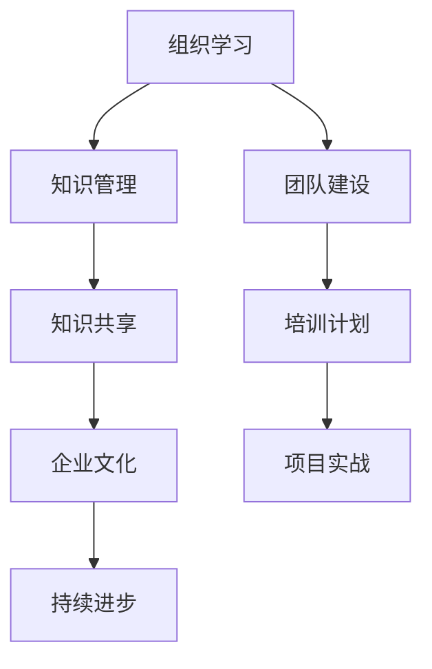

                 

### 文章标题

# 组织学习：建立持续进步的企业文化

> 关键词：组织学习、企业文化、学习型组织、知识管理、持续进步

> 摘要：本文探讨了组织学习的概念、重要性及其与企业文化的关系。通过分析学习型组织的理论框架，提出了建立支持组织学习的企业文化的策略，并结合实际案例，详细阐述了企业如何通过组织学习实现持续进步。

### 目录

1. **引言**
   - 1.1 组织学习的概念与背景
   - 1.2 建立持续进步的企业文化的意义

2. **核心概念与联系**
   - 2.1 图式理论与组织学习
   - 2.2 学习型组织的理念与架构
   - 2.3 知识管理在组织学习中的应用

3. **组织学习的理论框架**
   - 3.1 学习型组织理论
   - 3.2 知识管理理论
   - 3.3 其他组织学习理论

4. **企业文化与组织学习**
   - 4.1 企业文化与组织学习的关系
   - 4.2 企业文化对组织学习的影响
   - 4.3 建立支持组织学习的企业文化

5. **实践案例**
   - 5.1 成功企业的组织学习实践
   - 5.2 案例分析：A公司的组织学习实践
   - 5.3 案例分析：B公司的组织学习实践

6. **工具与方法**
   - 6.1 组织学习工具的应用
   - 6.2 团队建设的策略
   - 6.3 培训计划的设计与实施

7. **挑战与未来趋势**
   - 7.1 组织学习面临的挑战
   - 7.2 未来组织学习的发展趋势
   - 7.3 组织学习的创新实践

### 文章正文

#### 1. 引言

##### 1.1 组织学习的概念与背景

组织学习是指一个组织通过其成员的集体协作，从经验中获取知识，并将这些知识应用到实践中的过程。这种学习不仅包括技术知识的学习，还涵盖了组织流程、管理方法、战略规划等多个方面。在现代企业中，组织学习已经成为提高竞争力、实现持续进步的关键因素。

组织学习的背景可以从以下几个方面来理解：

1. **知识经济的兴起**：随着知识经济的快速发展，知识已经成为企业最重要的资产。组织学习帮助企业更好地利用知识，实现知识共享和创新。

2. **全球化竞争的加剧**：全球化使得企业面临更加激烈的竞争。为了在竞争中立于不败之地，企业必须具备快速学习、适应变化的能力。

3. **信息技术的发展**：信息技术的进步为组织学习提供了强大的支持。通过互联网、大数据、人工智能等技术手段，企业可以更加高效地进行知识收集、分析和应用。

##### 1.2 建立持续进步的企业文化的意义

企业文化是指企业在长期经营过程中形成的共同价值观、信念和行为规范。一个积极向上的企业文化能够激发员工的创造力和创新精神，促进组织学习的开展。

建立持续进步的企业文化的意义主要体现在以下几个方面：

1. **提高员工积极性**：良好的企业文化能够激发员工的积极性和归属感，使员工更加愿意参与到组织学习中来。

2. **促进知识共享**：企业文化中的共享理念能够鼓励员工主动分享知识和经验，促进组织内部的协同工作。

3. **增强创新能力**：持续进步的企业文化鼓励员工不断探索和创新，为企业带来新的发展机遇。

#### 2. 核心概念与联系

##### 2.1 图式理论与组织学习

图式理论（Schema Theory）是由瑞士心理学家皮亚杰（Jean Piaget）提出的，用于解释人类认知发展过程的一种理论。图式是指个体对现实世界的认知框架，包括感知、理解、记忆等方面。

在组织学习中，图式理论具有重要意义。通过构建和组织图式，组织可以更好地理解和应用新知识。具体来说，图式理论在组织学习中的应用体现在以下几个方面：

1. **知识构建**：组织通过构建和优化图式，将分散的知识整合为一个整体，提高知识的应用效果。

2. **知识共享**：图式理论有助于组织成员之间建立共同的认知框架，促进知识共享和协同工作。

3. **知识创新**：图式理论为组织提供了新的视角和方法，有助于发现和解决组织面临的问题，实现知识创新。

##### 2.2 学习型组织的理念与架构

学习型组织（Learning Organization）是指能够通过不断学习和适应，实现持续进步和发展的组织。学习型组织的理念包括自我超越、改善心智模式、建立共同愿景、团队学习和系统思考等。

学习型组织的架构包括以下几个方面：

1. **组织结构**：学习型组织通常采用扁平化的组织结构，减少管理层级，促进信息流通和协作。

2. **领导力**：学习型组织的领导者需要具备引导组织学习、激发员工潜能的能力。

3. **文化建设**：学习型组织注重培养积极向上的企业文化，鼓励员工学习和创新。

##### 2.3 知识管理在组织学习中的应用

知识管理（Knowledge Management，KM）是指通过系统的方法和技术，管理和利用组织的知识资源，以提高组织的竞争力和创新能力。知识管理在组织学习中的应用主要体现在以下几个方面：

1. **知识收集与存储**：知识管理帮助企业收集和存储各类知识，为组织学习提供丰富的知识资源。

2. **知识共享与传播**：知识管理通过建立知识共享平台和机制，促进组织内部的知识传播和共享。

3. **知识创新与应用**：知识管理帮助组织发现和利用知识，实现知识的创新和应用。

#### 3. 组织学习的理论框架

##### 3.1 学习型组织理论

学习型组织理论（Learning Organization Theory）是由彼得·圣吉（Peter Senge）等人提出的一种管理理论。学习型组织理论的核心观点是，组织通过不断学习和适应，可以实现持续进步和创新发展。

学习型组织理论的关键概念包括：

1. **自我超越**：鼓励员工不断挑战自我，追求卓越。

2. **改善心智模式**：通过反思和改进思维模式，提高组织的认知能力。

3. **建立共同愿景**：明确组织的共同目标，激发员工的使命感和责任感。

4. **团队学习**：通过团队协作，实现知识的共享和创新。

5. **系统思考**：从整体和系统的角度，分析和解决问题。

##### 3.2 知识管理理论

知识管理理论（Knowledge Management Theory）关注如何通过有效管理和利用知识，提升组织的竞争力和创新能力。知识管理理论的核心观点包括：

1. **知识分类与编码**：对知识进行分类和编码，使其更加易于管理和共享。

2. **知识共享与传播**：建立知识共享机制，促进组织内部的知识传播和应用。

3. **知识创新与应用**：通过知识创新和应用，实现知识的价值最大化。

##### 3.3 其他组织学习理论

除了学习型组织理论和知识管理理论外，还有其他一些重要的组织学习理论，如：

1. **社会学习理论**：强调组织成员通过社会互动和学习，实现知识共享和创新。

2. **文化资本理论**：认为组织文化是组织学习的重要驱动力，文化资本能够促进组织成员之间的知识共享和创新。

3. **创新生态系统理论**：从生态系统角度，探讨组织内外部创新资源、创新过程和创新成果之间的关系。

#### 4. 企业文化与组织学习

##### 4.1 企业文化与组织学习的关系

企业文化（Corporate Culture）是指企业在长期经营过程中形成的共同价值观、信念和行为规范。企业文化对组织学习具有重要影响。

1. **积极的企业文化**：积极的企业文化能够激发员工的积极性和创造力，促进组织学习的开展。例如，鼓励创新、包容失败、重视知识和经验分享的企业文化，能够为组织学习提供良好的氛围。

2. **消极的企业文化**：消极的企业文化可能阻碍组织学习。例如，官僚主义、等级观念、缺乏信任等，都会对组织学习产生负面影响。

##### 4.2 企业文化对组织学习的影响

企业文化对组织学习的影响体现在以下几个方面：

1. **知识共享**：企业文化影响组织成员的知识共享行为。积极的企业文化鼓励知识共享，而消极的企业文化可能抑制知识共享。

2. **创新氛围**：企业文化塑造组织的创新氛围。积极的企业文化有利于创新，而消极的企业文化可能抑制创新。

3. **员工参与**：企业文化影响员工的参与度。积极的企业文化鼓励员工参与组织学习，而消极的企业文化可能使员工缺乏参与动力。

##### 4.3 建立支持组织学习的企业文化

为了建立支持组织学习的企业文化，企业可以采取以下措施：

1. **明确价值观**：企业应明确倡导创新、知识共享、团队合作等价值观，并将其融入日常运营中。

2. **激励制度**：建立激励机制，鼓励员工参与组织学习，并对学习成果进行认可和奖励。

3. **培训与发展**：提供持续的学习和发展机会，帮助员工提升知识和技能。

4. **沟通与协作**：建立有效的沟通机制，促进组织内部的协作和知识共享。

#### 5. 实践案例

##### 5.1 成功企业的组织学习实践

以下是几个成功企业通过组织学习实现持续进步的案例：

1. **谷歌**：谷歌通过建立“20% 项目时间”制度，鼓励员工将20% 的工作时间用于探索新项目和创新。这一制度极大地激发了员工的创造力和创新能力。

2. **海尔**：海尔通过“人单合一”模式，将员工与企业利益紧密绑定，鼓励员工自主创业。这一模式使得海尔在竞争激烈的市场中始终保持创新和竞争力。

3. **微软**：微软通过建立“内部黑客松”活动，鼓励员工探索新技术和新产品。这一活动不仅提高了员工的创新能力，也为微软带来了新的业务增长点。

##### 5.2 案例分析：A公司的组织学习实践

A公司是一家技术型企业，通过组织学习实现了持续进步。以下是A公司的组织学习实践：

1. **建立学习平台**：A公司建立了内部学习平台，提供各类培训课程和学习资源，鼓励员工不断学习。

2. **知识共享机制**：A公司建立了知识共享机制，通过内部论坛、分享会等形式，促进员工之间的知识交流。

3. **项目制管理**：A公司采用项目制管理，鼓励员工参与跨部门项目，提高团队合作和创新能力。

##### 5.3 案例分析：B公司的组织学习实践

B公司是一家传统制造企业，通过组织学习实现了转型和发展。以下是B公司的组织学习实践：

1. **引入先进管理理念**：B公司引入了学习型组织的理念，建立了以客户为中心的管理模式。

2. **创新激励机制**：B公司建立了创新激励机制，鼓励员工提出改进建议和创新项目。

3. **持续培训与发展**：B公司为员工提供持续的培训和发展机会，帮助员工提升技能和知识。

#### 6. 工具与方法

##### 6.1 组织学习工具的应用

组织学习工具是指用于支持组织学习过程的软件和平台。常见的组织学习工具包括：

1. **在线学习平台**：如 Moodle、Sakai 等，用于提供在线课程和学习资源。

2. **知识管理平台**：如 Confluence、SharePoint 等，用于知识收集、存储和共享。

3. **协作工具**：如 Slack、Trello 等，用于团队协作和项目管理。

##### 6.2 团队建设的策略

团队建设是指通过一系列活动和措施，提高团队协作能力和团队效能的过程。常见的团队建设策略包括：

1. **团队沟通**：通过定期沟通会、团队会议等形式，促进团队成员之间的沟通和理解。

2. **团队活动**：组织团队拓展、团建等活动，增强团队成员之间的信任和凝聚力。

3. **团队培训**：为团队成员提供专业培训，提升团队整体素质。

##### 6.3 培训计划的设计与实施

设计有效的培训计划是实现组织学习的重要步骤。以下是一个简单的培训计划设计流程：

1. **需求分析**：分析组织学习和员工发展的需求，确定培训目标。

2. **课程设计**：根据培训目标，设计合适的培训课程。

3. **师资选择**：选择具备专业知识和教学能力的培训师。

4. **培训实施**：组织培训活动，确保培训效果。

5. **效果评估**：对培训效果进行评估，为后续培训提供改进依据。

#### 7. 挑战与未来趋势

##### 7.1 组织学习面临的挑战

组织学习面临以下挑战：

1. **知识分散**：组织内部的知识的分散性使得知识共享和利用变得困难。

2. **文化障碍**：消极的企业文化可能阻碍组织学习的开展。

3. **资源限制**：组织学习需要投入大量的时间和资源，但组织可能面临资源限制。

##### 7.2 未来组织学习的发展趋势

未来组织学习的发展趋势包括：

1. **技术驱动**：随着信息技术的不断发展，组织学习将更加依赖于人工智能、大数据等技术。

2. **个性化和定制化**：组织学习将更加注重满足个体需求，提供个性化的学习方案。

3. **持续创新**：组织学习将不断创新，以适应快速变化的市场环境。

##### 7.3 组织学习的创新实践

组织学习的创新实践包括：

1. **跨界合作**：组织与其他组织（如学术机构、合作伙伴等）进行跨界合作，共享知识和资源。

2. **虚拟团队**：利用虚拟团队技术，实现全球范围内的协作和学习。

3. **创新实验室**：建立创新实验室，鼓励员工进行创新实验和实践。

### 结论

组织学习是企业实现持续进步的关键因素。通过建立支持组织学习的企业文化，企业可以激发员工的创造力和创新能力，实现知识的共享和创新。未来，随着信息技术的不断发展，组织学习将不断创新，为企业的持续进步提供强大支持。

### 参考文献

1. 彼得·圣吉（Peter Senge）. 《第五项修炼：学习型组织的艺术与实务》（The Fifth Discipline: The Art & Practice of The Learning Organization）. 1990.
2. 詹姆斯·M·赫斯克特（James M. Heskett）等. 《企业文化与绩效》（Corporate Culture and Performance）. 1992.
3. 阿吉特·库马尔（Ajit K. Kumar）等. 《知识管理：概念、过程和实践》（Knowledge Management: Concepts, Processes, and Practices）. 2011.
4. 谢尔比·谢帕德（Shelby D. Shepard）等. 《学习型组织：理论与实践》（The Learning Organization: Theory and Practice）. 2006.
5. 詹姆斯·G·凯利（James G. Kelley）等. 《知识管理在组织学习中的应用》（Application of Knowledge Management in Organizational Learning）. 2008.

### 附录

1. **Mermaid 流程图示例**



2. **伪代码示例**

```python
# 输入一个正整数n，计算1到n之间所有奇数的和
def sum_odd_numbers(n):
    sum = 0
    for i in range(1, n+1, 2):
        sum += i
    return sum

# 测试
print(sum_odd_numbers(10))  # 输出结果应为25
```

3. **数学公式示例**

$$ E = mc^2 $$

$1+1=2$

### 作者信息

作者：AI天才研究院/AI Genius Institute & 禅与计算机程序设计艺术 /Zen And The Art of Computer Programming

### 最佳实践 Tips

1. **定期反思与总结**：组织学习需要定期反思和总结，以便及时发现问题并进行改进。

2. **鼓励创新与试错**：组织应鼓励员工进行创新，并允许试错，以激发员工的创造力和创新能力。

3. **持续投入资源**：组织学习需要持续投入资源，包括时间、资金和人力等。

4. **建立知识共享机制**：建立有效的知识共享机制，促进组织内部的知识传播和应用。

5. **注重个体发展**：关注员工的个人发展，提供个性化的学习和发展机会。

### 小结

本文从组织学习的概念、重要性、理论框架、企业文化、实践案例等多个角度，探讨了如何建立支持组织学习的企业文化，以及组织学习在实践中所面临的挑战和未来趋势。通过本文的讨论，我们希望企业能够更好地理解组织学习的重要性，并采取有效措施推动组织学习，实现持续进步。

### 注意事项

1. **文化塑造**：建立支持组织学习的企业文化需要长期的努力和持续投入。

2. **资源整合**：组织学习需要整合内部和外部资源，包括知识、技术、人才等。

3. **领导力**：领导者在组织学习过程中起着关键作用，需要具备引导和激励员工的能力。

### 拓展阅读

1. 彼得·圣吉（Peter Senge）. 《第五项修炼：学习型组织的艺术与实务》（The Fifth Discipline: The Art & Practice of The Learning Organization）. 1990.

2. 詹姆斯·M·赫斯克特（James M. Heskett）等. 《企业文化与绩效》（Corporate Culture and Performance）. 1992.

3. 阿吉特·库马尔（Ajit K. Kumar）等. 《知识管理：概念、过程和实践》（Knowledge Management: Concepts, Processes, and Practices）. 2011.

4. 谢尔比·谢帕德（Shelby D. Shepard）等. 《学习型组织：理论与实践》（The Learning Organization: Theory and Practice）. 2006.

5. 詹姆斯·G·凯利（James G. Kelley）等. 《知识管理在组织学习中的应用》（Application of Knowledge Management in Organizational Learning）. 2008.

