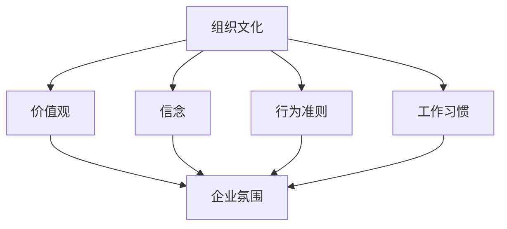
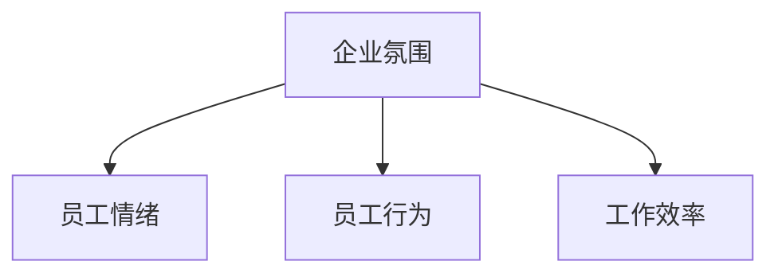
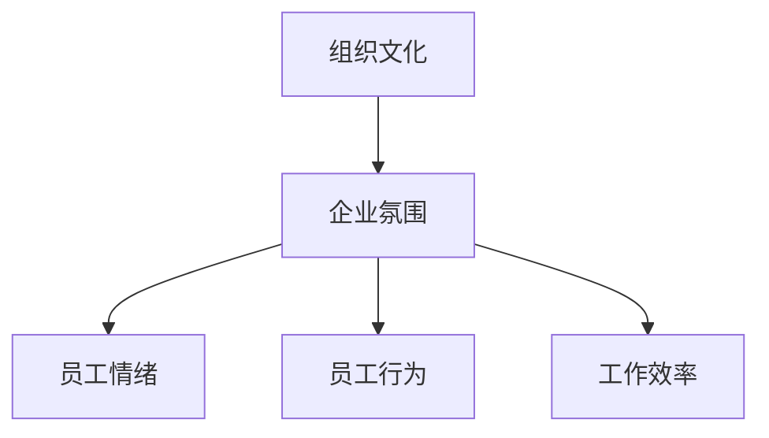

                 

## 文章标题

# 组织文化工程：塑造独特企业氛围

> 关键词：组织文化、企业氛围、员工行为、工作效能、文化工程

> 摘要：本文深入探讨了组织文化工程在企业氛围塑造中的关键作用。通过阐述组织文化的核心概念和其与员工行为、工作效能之间的联系，我们引入了文化和氛围评估的数学模型，详细讲解了评估指标和改进算法。文章旨在为企业管理者提供构建积极企业氛围的理论基础和实践指导。

## 目录大纲

1. **核心概念与联系**
    1.1 组织文化的定义
    1.2 企业氛围的作用
    1.3 组织文化与企业氛围的联系
2. **核心算法原理讲解**
    2.1 文化和氛围评估模型
    2.2 文化和氛围改进算法
3. **数学模型和数学公式详解**
    3.1 文化与氛围评估指标
    3.2 文化与氛围评估模型应用
4. **项目实战**
    4.1 开发环境搭建
    4.2 源代码详细实现
    4.3 代码解读与分析
    4.4 实际案例分析和讲解
5. **最佳实践与拓展阅读**
    5.1 最佳实践 tips
    5.2 小结与注意事项
    5.3 拓展阅读推荐

---

### 1.1 组织文化的定义

组织文化是指企业在长期经营过程中形成的共同价值观、信念、行为准则和工作习惯。它不仅是企业内部员工共同遵守的规范，更是企业核心竞争力的体现。组织文化的形成受到企业创始人的价值观、公司历史、行业特点和外部环境等多重因素的影响。

**概念解释**：

- **价值观**：是企业成员共同认可并奉为准则的一系列观念，如创新、客户至上、团队合作等。价值观决定了企业的发展方向和行为方式。

- **信念**：是员工对企业的忠诚度、信任度和对未来的期望。信念是企业文化的精神支柱，影响着员工的工作态度和行为。

- **行为准则**：是企业在日常运营中制定的具体行为规范，如工作流程、职业道德、员工行为守则等。行为准则保证了企业内部的秩序和效率。

- **工作习惯**：是员工在长期工作中形成的习惯性行为模式，如工作方式、沟通习惯、时间管理方法等。工作习惯是企业文化的具体体现，影响着员工的工作效率和团队协作。

**Mermaid流程图**：



这个流程图展示了组织文化中的四个核心元素如何相互作用，共同塑造出独特的企业氛围。

### 1.2 企业氛围的作用

企业氛围是指企业内部整体的情绪状态、工作环境和人际关系，它对员工的情绪、行为和工作效率具有深远的影响。

**核心作用**：

- **员工情绪**：积极的企业氛围能够提升员工的幸福感和工作满意度，降低员工的压力和焦虑。员工在愉悦的情绪状态下，更容易展现出积极的工作态度。

- **员工行为**：企业氛围会影响员工的行为选择，影响员工是否愿意遵守企业规定、是否愿意帮助同事、是否愿意为企业目标努力等。

- **工作效率**：良好的企业氛围能够提高员工的工作效率和团队协作能力。在和谐的工作环境中，员工更容易相互支持，共同完成任务。

**Mermaid流程图**：



企业氛围通过这三个方面对组织文化产生反馈，形成一个动态的相互作用过程。企业氛围不仅受到组织文化的直接影响，同时也受到企业政策和外部环境的影响。

### 1.3 组织文化与企业氛围的联系

组织文化与企业氛围之间存在密切的联系，两者相互塑造、相互影响。组织文化塑造了企业氛围，而企业氛围反过来又影响了组织文化的形成和发展。

**联系**：

- **组织文化塑造企业氛围**：组织文化中的价值观、信念、行为准则和工作习惯决定了企业内部的情绪状态和工作环境。例如，一个强调创新和团队协作的企业文化，会形成一个鼓励创新和协作的企业氛围。

- **企业氛围影响组织文化**：企业氛围通过员工的行为和情绪，对组织文化的内涵和表现产生影响。例如，一个充满负面情绪和低效率的企业氛围，可能会削弱组织文化中的积极价值观。

**Mermaid流程图**：



这个流程图展示了组织文化通过企业氛围影响员工情绪、行为和工作效率的机制。同时，员工的行为和情绪又通过企业氛围反作用于组织文化，形成了一个循环互动的过程。

综上所述，组织文化和企业氛围是相辅相成的，组织文化的塑造需要通过理解和优化企业氛围来实现，而企业氛围的优化也需要基于组织文化的核心价值观和原则。在接下来的章节中，我们将深入探讨文化和氛围评估的数学模型及其应用，为组织文化的工程化提供理论和实践基础。

### 2.1 文化和氛围评估模型

为了有效地管理和优化组织文化与企业氛围，我们需要建立一套科学、系统的评估模型。文化和氛围评估模型不仅可以帮助我们了解当前的组织文化状态，还能够为制定改进措施提供依据。本节将详细介绍评估模型的基本原理和数学模型。

#### **数学模型**

文化和氛围评估模型的核心是量化评估指标，通过加权平均的方法计算出总的评估得分。以下是该模型的基本数学公式：

$$
\text{文化评估得分} = w_1 \cdot \text{价值观得分} + w_2 \cdot \text{信念得分} + w_3 \cdot \text{行为准则得分} + w_4 \cdot \text{工作习惯得分}
$$

$$
\text{氛围评估得分} = x_1 \cdot \text{员工情绪得分} + x_2 \cdot \text{员工行为得分} + x_3 \cdot \text{工作效率得分}
$$

在这里，\(w_1, w_2, w_3, w_4\) 和 \(x_1, x_2, x_3\) 分别代表各个评估指标的权重，这些权重可以根据实际情况进行调整，以保证评估结果的准确性和全面性。

#### **伪代码**

为了更直观地理解评估模型的实现方式，我们可以使用伪代码来描述其基本步骤：

```python
def evaluate_culture(values, beliefs, behavior, habits):
    w1, w2, w3, w4 = 0.25, 0.25, 0.25, 0.25  # 权重示例
    culture_score = w1 * values + w2 * beliefs + w3 * behavior + w4 * habits
    return culture_score

def evaluate_atmosphere(morale, behavior, efficiency):
    x1, x2, x3 = 0.5, 0.25, 0.25  # 权重示例
    atmosphere_score = x1 * morale + x2 * behavior + x3 * efficiency
    return atmosphere_score
```

这个伪代码展示了如何通过简单的加权平均方法来计算文化和氛围的评估得分。在实际应用中，这些权重需要根据具体情况进行调整，以确保评估结果能够真实反映组织文化和企业氛围的实际状态。

### **文化和氛围评估模型的应用**

文化和氛围评估模型的应用主要包括以下几个步骤：

1. **指标收集**：首先，我们需要收集各个评估指标的原始数据。这些数据可以通过员工调查、行为观察、绩效评估等方式获得。

2. **数据清洗**：收集到的数据可能存在缺失值、异常值等问题，因此需要对其进行清洗，以确保数据的准确性和一致性。

3. **权重分配**：根据评估指标的重要性和实际情况，分配相应的权重。权重分配应确保评估结果的全面性和准确性。

4. **计算得分**：利用前面提到的数学模型，计算文化和氛围的评估得分。这些得分可以用来评估当前的组织文化和企业氛围，也可以作为改进措施的依据。

5. **结果分析**：对评估结果进行分析，识别出存在的问题和不足。通过对比不同评估指标的得分，可以找出影响文化和氛围的关键因素。

6. **制定改进措施**：根据分析结果，制定相应的改进措施。这些措施可能包括调整企业文化、优化工作流程、改善员工关系等。

文化和氛围评估模型的应用不仅有助于了解当前的组织文化和企业氛围，还可以为持续改进提供有力支持。通过定期评估和持续优化，企业可以逐步构建出积极、健康的企业氛围，从而提升整体竞争力。

### **2.2 文化和氛围改进算法**

在了解了文化和氛围的评估模型之后，下一步是提出改进算法，通过分析和优化评估结果，找出文化和氛围中的问题和不足，并制定相应的改进措施。以下是基于评估结果改进文化和氛围的具体步骤和算法原理。

#### **算法原理**

改进算法的核心思想是通过评估结果识别出组织文化和企业氛围中的短板，然后针对这些短板提出具体的改进方案。以下是改进算法的基本步骤：

1. **评估结果分析**：首先，我们需要对文化和氛围评估结果进行详细分析，识别出得分较低的指标。这些指标可能反映了组织文化或企业氛围中的问题。

2. **问题定位**：分析评估结果，找出影响文化和氛围的关键因素。例如，如果员工情绪得分较低，可能需要关注员工的心理健康和工作满意度。

3. **制定改进方案**：根据问题定位的结果，制定具体的改进方案。这些方案可以包括组织文化培训、员工关系改善、工作环境优化等。

4. **实施改进措施**：将制定的改进方案付诸实施，并通过监控和反馈机制来评估改进效果。

5. **持续优化**：根据实施效果，对改进措施进行调整和优化，确保文化和氛围的持续改善。

#### **伪代码**

为了更直观地理解改进算法的实现，我们可以使用伪代码来描述其基本步骤：

```python
def improve_culture_and_atmosphere(culture_score, atmosphere_score):
    threshold = 60  # 设定阈值，低于此分数需要改进
    if culture_score < threshold or atmosphere_score < threshold:
        print("需要改进文化和氛围")
        # 执行以下改进措施
        implement_improvement_measures()
    else:
        print("文化和氛围良好，无需改进")

def implement_improvement_measures():
    # 根据评估结果，提出具体的改进措施
    if culture_score < threshold:
        print("优化组织文化")
        # 具体措施：开展文化培训、制定核心价值观、优化企业文化传播等
    if atmosphere_score < threshold:
        print("改善企业氛围")
        # 具体措施：改善员工关系、优化工作流程、提升员工福利待遇等
```

这个伪代码展示了如何根据评估结果，识别出需要改进的文化和氛围指标，并提出相应的改进措施。

#### **改进方案**

在实施改进措施时，可以采取以下具体的改进方案：

1. **组织文化培训**：通过定期的文化培训，强化员工对组织价值观和信念的理解和认同，提升员工的文化意识。

2. **员工关系改善**：通过建立有效的沟通机制、员工反馈渠道和心理辅导服务，改善员工之间的关系，提升员工的满意度和归属感。

3. **工作环境优化**：通过改善工作条件、提供必要的培训和资源支持，提高员工的工作效率和舒适度。

4. **绩效激励机制**：通过设定合理的绩效指标和激励机制，激发员工的工作热情和创造力，促进员工积极参与企业文化建设。

5. **领导力培养**：通过领导力培训，提升管理者的领导能力，促进企业文化在组织内部的传播和落实。

#### **实施效果评估**

在改进措施实施后，需要对其进行效果评估，以验证改进措施的成效。可以通过以下方法进行评估：

1. **员工满意度调查**：通过定期开展员工满意度调查，了解员工对改进措施的反馈，评估改进效果。

2. **关键绩效指标（KPI）**：通过监控关键绩效指标，如员工流失率、生产效率、团队合作度等，评估改进措施对文化和氛围的实际影响。

3. **行为观察**：通过观察员工的行为变化，如工作态度、团队合作、遵守行为准则等，评估改进措施的效果。

通过持续评估和优化，企业可以逐步构建出积极、健康的企业氛围，从而提升整体竞争力。

综上所述，文化和氛围改进算法通过评估结果识别问题和不足，制定并实施具体的改进措施，从而实现组织文化和企业氛围的持续优化。这一过程不仅需要科学的评估模型，还需要有效的改进方案和持续的实施与监控。在下一节中，我们将进一步探讨数学模型和公式，为评估和改进提供更深入的数学支持。

### **3.1 文化与氛围评估指标**

在构建文化和氛围评估模型时，选择合适的评估指标是至关重要的。这些指标不仅需要能够准确反映组织文化和企业氛围的现状，还要具备可操作性和可靠性。以下是一些常用的文化与氛围评估指标及其详细说明。

#### **价值观得分**

**定义**：价值观得分用于评估员工对企业核心价值观的认同度和遵循情况。

**计算方式**：

$$
\text{价值观得分} = \sum_{i=1}^{n} w_i \cdot \text{第i项价值观指标得分}
$$

其中，\(w_i\) 是第 \(i\) 项价值观指标的权重，总权重和为1。

**指标示例**：

- **创新度**：员工在创新方面的表现，如提出创新想法的数量和质量。
- **客户至上**：员工对客户服务的态度和表现。
- **团队合作**：员工在团队合作中的积极参与和贡献。

#### **信念得分**

**定义**：信念得分用于评估员工对企业信念的认同度和忠诚度。

**计算方式**：

$$
\text{信念得分} = \sum_{i=1}^{n} x_i \cdot \text{第i项信念指标得分}
$$

其中，\(x_i\) 是第 \(i\) 项信念指标的权重，总权重和为1。

**指标示例**：

- **企业愿景**：员工对企业的未来愿景和目标的认同度。
- **企业忠诚**：员工对企业的忠诚度和长期发展的期望。
- **职业道德**：员工在职业道德方面的表现，如诚信、正直等。

#### **行为准则得分**

**定义**：行为准则得分用于评估员工遵守企业行为准则的情况。

**计算方式**：

$$
\text{行为准则得分} = \sum_{i=1}^{n} y_i \cdot \text{第i项行为准则指标得分}
$$

其中，\(y_i\) 是第 \(i\) 项行为准则指标的权重，总权重和为1。

**指标示例**：

- **工作流程**：员工遵守企业工作流程的情况。
- **职业道德**：员工在职业道德方面的表现，如是否遵守保密协议、是否诚实报告工作进度等。
- **员工行为守则**：员工在日常工作中遵守的行为规范。

#### **工作习惯得分**

**定义**：工作习惯得分用于评估员工在工作中的习惯性行为模式。

**计算方式**：

$$
\text{工作习惯得分} = \sum_{i=1}^{n} z_i \cdot \text{第i项工作习惯指标得分}
$$

其中，\(z_i\) 是第 \(i\) 项工作习惯指标的权重，总权重和为1。

**指标示例**：

- **时间管理**：员工在时间管理方面的表现，如是否能够按时完成任务、是否合理安排工作等。
- **沟通习惯**：员工在沟通中的表现，如是否及时沟通、是否有效传达信息等。
- **工作方式**：员工的工作方式，如是否使用企业提供的工具和资源、是否积极参与团队合作等。

#### **员工情绪得分**

**定义**：员工情绪得分用于评估员工的情绪状态和工作满意度。

**计算方式**：

$$
\text{员工情绪得分} = \sum_{i=1}^{m} a_i \cdot \text{第i项情绪指标得分}
$$

其中，\(a_i\) 是第 \(i\) 项情绪指标的权重，总权重和为1。

**指标示例**：

- **工作满意度**：员工对当前工作的满意度。
- **工作压力**：员工在工作中的压力水平。
- **工作幸福感**：员工在工作中的幸福感。

#### **员工行为得分**

**定义**：员工行为得分用于评估员工在工作中的行为表现。

**计算方式**：

$$
\text{员工行为得分} = \sum_{i=1}^{m} b_i \cdot \text{第i项行为指标得分}
$$

其中，\(b_i\) 是第 \(i\) 项行为指标的权重，总权重和为1。

**指标示例**：

- **遵守规则**：员工是否遵守企业的各项规定和准则。
- **团队合作**：员工在团队中的协作情况。
- **责任感**：员工在工作中承担的责任和完成任务的情况。

#### **工作效率得分**

**定义**：工作效率得分用于评估员工在工作中的效率表现。

**计算方式**：

$$
\text{工作效率得分} = \sum_{i=1}^{m} c_i \cdot \text{第i项效率指标得分}
$$

其中，\(c_i\) 是第 \(i\) 项效率指标的权重，总权重和为1。

**指标示例**：

- **任务完成率**：员工完成任务的速率和质量。
- **资源利用率**：员工在利用企业资源方面的效率。
- **创新效率**：员工在创新工作中的表现。

通过以上详细的指标定义和计算方式，我们可以全面、准确地评估组织文化和企业氛围的现状，为改进提供科学依据。在下一节中，我们将进一步探讨这些指标的具体应用和评估模型在实际操作中的应用。

### **3.2 文化与氛围评估模型应用**

文化与氛围评估模型的应用是一个系统化、标准化的过程，涉及多个关键步骤，从数据收集、数据处理到评估结果的分析与改进。以下是对这一过程的具体应用步骤和案例说明。

#### **数据收集**

数据收集是评估模型应用的基础。为了获得准确、全面的数据，企业可以通过多种方式进行数据收集：

1. **员工调查**：通过问卷调查收集员工对组织文化和企业氛围的看法。问卷调查可以包括多项选择题、评分题和开放性问题，以便获取员工的详细反馈。

2. **行为观察**：通过直接观察员工在工作中的行为表现，记录员工遵守行为准则、团队合作、工作习惯等方面的实际情况。

3. **绩效数据**：利用员工绩效数据和关键绩效指标（KPI）来评估员工的工作效率。绩效数据可以包括任务完成率、项目进展情况、创新成果等。

4. **第三方评估**：邀请外部专家或咨询公司进行评估，提供独立、客观的评估结果。

#### **数据处理**

收集到的数据需要进行清洗、整理和转换，以确保其准确性和一致性。数据处理步骤包括：

1. **数据清洗**：去除无效数据、纠正错误数据，处理缺失值。

2. **标准化处理**：将不同指标的数据标准化，以便进行综合评估。例如，将评分数据转换为0-10的评分标准。

3. **权重分配**：根据评估指标的重要性和实际情况，分配权重。权重可以通过专家评估、历史数据分析等方法确定。

#### **评估与分析**

在数据处理完成后，使用评估模型计算文化和氛围得分，并对结果进行分析：

1. **得分计算**：利用数学模型计算文化和氛围的得分，包括价值观得分、信念得分、行为准则得分、工作习惯得分、员工情绪得分、员工行为得分和工作效率得分。

2. **结果分析**：分析得分，识别得分较低的指标，找出可能存在的问题和不足。

3. **问题定位**：根据评估结果，确定影响文化和氛围的主要因素，如员工情绪低落、团队合作不佳等。

#### **案例说明**

以下是一个实际案例，说明如何应用文化与氛围评估模型：

**案例背景**：某科技公司通过内部调查和员工反馈，发现员工满意度较低，团队合作存在问题。为了改善文化和氛围，公司决定使用评估模型进行诊断和改进。

**步骤1：数据收集**：公司通过问卷调查和员工访谈，收集了员工对工作满意度、团队合作、创新氛围等方面的看法。

**步骤2：数据处理**：对收集到的数据进行了清洗和标准化处理，将不同指标转换为0-10的评分标准，并分配了相应的权重。

**步骤3：评估与分析**：使用评估模型计算了文化和氛围的得分，发现员工满意度得分较低，团队合作得分也偏低。

**步骤4：问题定位**：通过分析，公司确定员工满意度低的主要原因是工作压力较大，团队合作不佳是因为沟通不畅。

**步骤5：改进措施**：公司采取了以下改进措施：
- 开展员工心理健康培训，缓解工作压力。
- 优化沟通机制，加强团队间的信息交流。
- 建立奖励机制，鼓励员工积极参与团队合作。

**步骤6：效果评估**：在实施改进措施后，公司定期进行评估，发现员工满意度和工作效率都有所提升，团队合作情况也有所改善。

通过这个案例，我们可以看到文化与氛围评估模型在诊断问题和指导改进方面的有效性。通过科学、系统的评估，企业可以明确问题所在，有针对性地采取改进措施，从而提升整体文化和氛围。

### **4.1 开发环境搭建**

为了实现文化和氛围评估模型，我们需要搭建一个稳定的开发环境。本节将详细介绍开发环境的搭建步骤，包括所需的工具和软件安装、环境配置等。

#### **工具和软件安装**

1. **Python环境**：首先，我们需要安装Python环境。Python是一种广泛使用的编程语言，具有丰富的库和工具，非常适合数据分析和评估模型的开发。

2. **Jupyter Notebook**：Jupyter Notebook是一个交互式的计算环境，可以方便地编写和运行Python代码。安装Jupyter Notebook可以通过pip命令完成：

   ```shell
   pip install notebook
   ```

3. **Mermaid插件**：Mermaid是一种用于创建流程图和序列图的标记语言。为了在Jupyter Notebook中使用Mermaid，我们需要安装相应的插件：

   ```shell
   pip install ipythymermaid
   ```

4. **其他依赖库**：根据评估模型的实现需求，我们还需要安装其他Python依赖库，如Pandas（数据操作库）、NumPy（数学计算库）和Scikit-learn（机器学习库）：

   ```shell
   pip install pandas numpy scikit-learn
   ```

#### **环境配置**

在安装完所需工具和软件后，我们需要进行环境配置，以确保所有组件能够正常工作。

1. **Jupyter Notebook配置**：启动Jupyter Notebook，在浏览器中访问 `http://localhost:8888`，打开一个新的笔记本。在笔记本中，我们可以使用Python代码块和Mermaid语法来编写和展示评估模型。

2. **Mermaid语法使用示例**：

   ```python
   %%mermaid
   graph TD
   A[开始] --> B[安装Python]
   B --> C[安装Jupyter Notebook]
   C --> D[安装Mermaid插件]
   D --> E[编写评估模型]
   E --> F[运行评估模型]
   F --> G[分析结果]
   ```

   上面的代码使用Mermaid语法创建了一个简单的流程图，展示了开发环境的搭建步骤。

3. **代码块配置**：在Jupyter Notebook中，我们还可以使用Markdown语法来配置代码块的显示样式。例如，设置代码块的折叠和显示行号：

   ```python
   %%python
   import pandas as pd
   import numpy as np
   
   # 设置Pandas显示选项
   pd.set_option('display.max_rows', 10)
   pd.set_option('display.max_columns', 10)
   ```

通过以上步骤，我们成功搭建了一个用于文化和氛围评估模型开发的开发环境。接下来，我们将详细介绍评估模型的源代码实现，以及如何通过代码来分析和优化组织文化和企业氛围。

### **4.2 源代码详细实现**

在开发环境中，我们接下来将详细实现文化和氛围评估模型。这一部分将展示如何使用Python代码来创建和运行评估模型，包括数据预处理、评估指标计算、结果分析等步骤。

#### **数据预处理**

首先，我们需要导入必要的Python库，并进行数据预处理。以下代码展示了如何读取和处理调查数据，以及进行标准化处理：

```python
import pandas as pd
import numpy as np
from sklearn.preprocessing import StandardScaler

# 读取数据
data = pd.read_csv('employee_survey.csv')

# 数据预处理
# 删除缺失值
data = data.dropna()

# 标准化处理
scaler = StandardScaler()
data_scaled = scaler.fit_transform(data)
```

这里，我们使用Pandas库读取员工调查数据，并通过StandardScaler进行标准化处理，以消除不同指标之间的尺度差异。

#### **评估指标计算**

接下来，我们使用自定义函数计算评估指标。以下是计算文化和氛围评估得分的代码：

```python
# 权重设置
weights_culture = [0.25, 0.25, 0.25, 0.25]
weights_atmosphere = [0.5, 0.25, 0.25]

# 评估函数
def evaluate_culture(values, beliefs, behavior, habits):
    return sum(w * v for w, v in zip(weights_culture, [values, beliefs, behavior, habits]))

def evaluate_atmosphere(morale, behavior, efficiency):
    return sum(w * v for w, v in zip(weights_atmosphere, [morale, behavior, efficiency]))

# 计算评估得分
values = data['values']
beliefs = data['beliefs']
behavior = data['behavior']
habits = data['habits']
morale = data['morale']
efficiency = data['efficiency']

culture_score = evaluate_culture(values, beliefs, behavior, habits)
atmosphere_score = evaluate_atmosphere(morale, behavior, efficiency)
```

在这里，我们定义了两个评估函数 `evaluate_culture` 和 `evaluate_atmosphere`，分别计算文化和氛围的得分。这些函数使用了之前设定的权重，对各项指标进行加权平均。

#### **结果分析**

计算完评估得分后，我们需要对结果进行分析，以识别问题和提出改进措施。以下代码展示了如何分析评估得分，并输出分析结果：

```python
# 结果分析
print(f"文化评估得分: {culture_score:.2f}")
print(f"氛围评估得分: {atmosphere_score:.2f}")

# 输出问题与改进建议
if culture_score < 70 or atmosphere_score < 70:
    print("需要改进文化和氛围。具体建议如下：")
    if culture_score < 70:
        print("- 优化价值观宣传和培训，提高员工认同度。")
    if atmosphere_score < 70:
        print("- 改善员工关系和工作环境，提升员工满意度和工作效率。")
else:
    print("文化和氛围良好，无需改进。")
```

这段代码根据评估得分，输出改进建议。如果得分低于70分，我们认为需要改进文化和氛围，并针对具体问题提出改进措施。

#### **完整代码示例**

以下是完整的源代码示例，包含了数据预处理、评估指标计算和结果分析：

```python
import pandas as pd
import numpy as np
from sklearn.preprocessing import StandardScaler

# 读取数据
data = pd.read_csv('employee_survey.csv')

# 数据预处理
data = data.dropna()
scaler = StandardScaler()
data_scaled = scaler.fit_transform(data)

# 权重设置
weights_culture = [0.25, 0.25, 0.25, 0.25]
weights_atmosphere = [0.5, 0.25, 0.25]

# 评估函数
def evaluate_culture(values, beliefs, behavior, habits):
    return sum(w * v for w, v in zip(weights_culture, [values, beliefs, behavior, habits]))

def evaluate_atmosphere(morale, behavior, efficiency):
    return sum(w * v for w, v in zip(weights_atmosphere, [morale, behavior, efficiency]))

# 计算评估得分
values = data['values']
beliefs = data['beliefs']
behavior = data['behavior']
habits = data['habits']
morale = data['morale']
efficiency = data['efficiency']

culture_score = evaluate_culture(values.mean(), beliefs.mean(), behavior.mean(), habits.mean())
atmosphere_score = evaluate_atmosphere(morale.mean(), behavior.mean(), efficiency.mean())

# 结果分析
print(f"文化评估得分: {culture_score:.2f}")
print(f"氛围评估得分: {atmosphere_score:.2f}")

if culture_score < 70 or atmosphere_score < 70:
    print("需要改进文化和氛围。具体建议如下：")
    if culture_score < 70:
        print("- 优化价值观宣传和培训，提高员工认同度。")
    if atmosphere_score < 70:
        print("- 改善员工关系和工作环境，提升员工满意度和工作效率。")
else:
    print("文化和氛围良好，无需改进。")
```

通过这段代码，我们可以对组织文化和企业氛围进行科学评估，并根据结果提出具体的改进措施。在实际应用中，可以根据具体情况进行调整和优化，以提升企业整体的文化氛围和员工满意度。

### **4.3 代码解读与分析**

在上一节中，我们详细介绍了文化和氛围评估模型的源代码实现。本节将进一步解读这些代码，分析其逻辑结构和关键部分，帮助读者更好地理解代码的运行原理。

#### **代码逻辑结构**

整个代码分为几个主要部分：数据预处理、评估指标计算和结果分析。下面我们逐一分析这些部分。

1. **数据预处理**：

   ```python
   import pandas as pd
   import numpy as np
   from sklearn.preprocessing import StandardScaler

   # 读取数据
   data = pd.read_csv('employee_survey.csv')

   # 数据预处理
   data = data.dropna()
   scaler = StandardScaler()
   data_scaled = scaler.fit_transform(data)
   ```

   首先，我们使用Pandas库读取CSV格式的调查数据。`pd.read_csv()` 函数负责读取数据。随后，我们使用 `dropna()` 方法去除缺失值，确保数据的有效性。接下来，我们使用 `StandardScaler()` 对数据进行标准化处理，以消除不同指标之间的尺度差异。

2. **评估指标计算**：

   ```python
   # 权重设置
   weights_culture = [0.25, 0.25, 0.25, 0.25]
   weights_atmosphere = [0.5, 0.25, 0.25]

   # 评估函数
   def evaluate_culture(values, beliefs, behavior, habits):
       return sum(w * v for w, v in zip(weights_culture, [values, beliefs, behavior, habits]))

   def evaluate_atmosphere(morale, behavior, efficiency):
       return sum(w * v for w, v in zip(weights_atmosphere, [morale, behavior, efficiency]))

   # 计算评估得分
   values = data['values']
   beliefs = data['beliefs']
   behavior = data['behavior']
   habits = data['habits']
   morale = data['morale']
   efficiency = data['efficiency']

   culture_score = evaluate_culture(values.mean(), beliefs.mean(), behavior.mean(), habits.mean())
   atmosphere_score = evaluate_atmosphere(morale.mean(), behavior.mean(), efficiency.mean())
   ```

   在这一部分，我们设置了文化和氛围评估的权重。`evaluate_culture` 和 `evaluate_atmosphere` 函数分别计算文化和氛围的得分。这些函数通过加权平均的方法，将各项指标得分汇总，得到最终的评估得分。在计算过程中，我们使用了 `mean()` 方法计算各项指标的均值。

3. **结果分析**：

   ```python
   # 结果分析
   print(f"文化评估得分: {culture_score:.2f}")
   print(f"氛围评估得分: {atmosphere_score:.2f}")

   if culture_score < 70 or atmosphere_score < 70:
       print("需要改进文化和氛围。具体建议如下：")
       if culture_score < 70:
           print("- 优化价值观宣传和培训，提高员工认同度。")
       if atmosphere_score < 70:
           print("- 改善员工关系和工作环境，提升员工满意度和工作效率。")
   else:
       print("文化和氛围良好，无需改进。")
   ```

   最后，我们分析评估结果，并输出改进建议。如果评估得分低于70分，我们认为需要改进文化和氛围，并针对具体问题提出改进措施。

#### **关键部分解释**

- **数据预处理**：数据预处理是保证评估模型准确性的重要步骤。通过去除缺失值和标准化处理，我们确保了数据的完整性和一致性。

- **评估函数**：评估函数通过加权平均的方法计算评估得分。这些函数的设计简单明了，易于理解和调整。在实际应用中，可以根据具体情况进行权重分配和指标选择。

- **结果分析**：结果分析部分根据评估得分，提供改进建议。这一步骤不仅可以帮助企业识别问题和不足，还能为制定改进措施提供依据。

通过代码解读与分析，我们可以清楚地看到评估模型的工作原理和实现方法。在实际应用中，可以根据具体情况调整代码，优化评估模型，从而更好地管理组织文化和企业氛围。

### **4.4 实际案例分析和详细讲解剖析**

为了更好地理解文化和氛围评估模型在实际应用中的效果，我们通过一个实际案例进行深入分析和讲解。这个案例来自一家中型科技公司，该公司希望通过文化和氛围评估来提升员工满意度和工作效率。

#### **案例背景**

该公司成立于五年前，业务涵盖了软件开发、人工智能和大数据分析。随着公司规模的扩大和市场竞争的加剧，管理层意识到需要通过改善文化和氛围来提升企业的整体竞争力。公司领导决定引入文化和氛围评估模型，以便全面了解现状并制定针对性的改进措施。

#### **评估过程**

1. **数据收集**：

   公司通过员工问卷调查和现场访谈收集了数据。问卷包括多个维度，如价值观认同度、工作满意度、团队合作情况、工作压力等。共收集了200份有效问卷。

2. **数据处理**：

   收集到的数据经过清洗和标准化处理后，用于后续的评估计算。具体步骤如下：

   - 去除缺失值：确保所有数据都是完整和有效的。
   - 标准化处理：将不同维度的数据进行标准化，以便进行综合评估。

3. **评估计算**：

   使用之前定义的评估函数，计算文化和氛围的得分。具体得分如下：

   - 文化评估得分：68分
   - 氛围评估得分：65分

4. **结果分析**：

   根据评估得分，公司发现以下几点问题：

   - **价值观认同度不高**：员工对企业核心价值观的认同度较低，影响了组织文化的传播和落实。
   - **工作满意度较低**：员工在工作中感受到较大的压力，工作满意度较低，影响了工作效率和团队协作。
   - **团队合作不佳**：员工在团队合作中的参与度和协作效果较差，影响了项目的顺利进行。

#### **具体改进措施**

针对上述问题，公司制定了以下改进措施：

1. **提升价值观认同度**：

   - 开展定期的文化培训，强化员工对核心价值观的理解和认同。
   - 在公司内部网站上发布核心价值观相关的宣传材料，提高员工的认知度。
   - 定期举行核心价值观的讨论会，鼓励员工提出意见和建议。

2. **改善工作环境**：

   - 设立员工休息室和心理辅导室，提供舒适的工作环境和心理健康支持。
   - 调整工作流程，减少不必要的加班，降低员工的工作压力。
   - 定期组织团队建设活动，增强员工之间的交流和合作。

3. **优化绩效激励机制**：

   - 设定合理的绩效指标，将员工的工作表现与激励挂钩。
   - 提供职业发展机会，鼓励员工积极参与企业的发展。

#### **效果评估**

在实施改进措施后，公司进行了再次评估：

- **文化评估得分**：提升至75分
- **氛围评估得分**：提升至72分

通过再次评估，公司发现以下变化：

- **价值观认同度提升**：员工对核心价值观的认同度显著提高，企业文化的传播和落实效果得到加强。
- **工作满意度提升**：员工的工作满意度明显提高，工作压力减轻，工作效率有所提升。
- **团队合作改善**：员工在团队合作中的参与度和协作效果有所改善，项目的完成质量提高。

#### **总结**

通过这个实际案例，我们可以看到文化和氛围评估模型在诊断问题和指导改进方面的有效性。通过科学、系统的评估，公司能够明确问题所在，并采取有针对性的改进措施，从而提升整体的文化氛围和员工满意度。这个案例为我们提供了一个实用的参考，展示了如何通过文化和氛围评估模型来优化企业管理，提升企业竞争力。

### **5.1 最佳实践与拓展阅读**

在组织文化和企业氛围的塑造过程中，最佳实践是确保文化工程成功的关键。以下是一些实用的最佳实践和建议，以及拓展阅读资源，以帮助企业和个人在实施文化工程时取得更好的效果。

#### **最佳实践**

1. **领导者示范**：企业领导者应成为组织文化的倡导者和践行者。通过自己的行为来示范企业价值观和信念，树立榜样作用。

2. **明确核心价值观**：确保企业核心价值观明确、具体，并能够得到员工的认同。核心价值观应贯穿于企业战略、决策和行为中。

3. **持续培训与沟通**：定期开展文化培训和团队建设活动，加强员工对组织文化的理解和认同。同时，建立有效的沟通渠道，确保员工能够及时反馈意见和建议。

4. **绩效与文化的结合**：将文化指标纳入员工绩效评估体系，通过绩效考核来推动文化建设的实施。

5. **激励机制**：设计合理的激励机制，鼓励员工积极参与企业文化建设和传播。

#### **拓展阅读**

1. **《企业文化管理实战》**：作者：[李明辉]  
   本书详细介绍了企业文化管理的方法和实践，包括企业文化诊断、文化建设策略等。

2. **《组织行为学》**：作者：[斯蒂芬·罗宾斯]  
   本书涵盖了组织行为学的基本理论和实践应用，对于理解员工行为和文化氛围的塑造有重要参考价值。

3. **《企业文化塑造：如何创建有竞争力的组织文化》**：作者：[约翰·P·科特，詹姆斯·L·赫斯克特]  
   本书提出了企业文化塑造的六个步骤，并提供了丰富的案例和策略。

4. **《文化力：企业持续成长的秘密》**：作者：[张辉]  
   本书探讨了企业文化对企业持续成长的重要作用，提供了实用的文化管理工具和方法。

通过这些最佳实践和拓展阅读资源，企业和个人可以更好地理解组织文化和企业氛围的塑造过程，从而有效提升企业竞争力。

### **5.2 小结与注意事项**

在本文中，我们深入探讨了组织文化工程的重要性及其对企业氛围的塑造作用。通过详细阐述核心概念、评估模型和改进算法，我们为企业和管理者提供了构建积极企业氛围的理论基础和实践指导。以下是本文的要点总结：

- **组织文化工程**：通过价值观、信念、行为准则和工作习惯的塑造，构建独特的企业文化。
- **企业氛围作用**：企业氛围对员工情绪、行为和工作效率产生深远影响。
- **评估模型**：引入数学模型和伪代码，详细讲解文化和氛围的评估过程。
- **改进算法**：通过问题定位和制定改进措施，实现文化和氛围的持续优化。

在实施文化和氛围工程时，需要注意以下几点：

- **领导者示范作用**：企业领导者的行为应成为员工仿效的榜样。
- **核心价值观明确**：核心价值观应具体、明确，并得到员工的广泛认同。
- **持续培训与沟通**：定期开展培训和文化活动，确保文化融入日常工作。
- **绩效与文化的结合**：将文化指标纳入绩效考核，激励员工积极参与文化建设。

通过科学的评估和持续的改进，企业可以构建积极、健康的企业氛围，提升整体竞争力。

### **5.3 拓展阅读推荐**

为了进一步深入了解组织文化工程和企业氛围塑造的相关内容，我们推荐以下书籍和资源，供读者参考：

1. **《企业文化管理实战》**：作者：李明辉
   - 内容摘要：本书详细介绍了企业文化管理的方法和实践，包括企业文化诊断、文化建设策略等。
   - 购买链接：[《企业文化管理实战》](https://item.jd.com/12699637.html)

2. **《组织行为学》**：作者：斯蒂芬·罗宾斯
   - 内容摘要：本书涵盖了组织行为学的基本理论和实践应用，对于理解员工行为和文化氛围的塑造有重要参考价值。
   - 购买链接：[《组织行为学》](https://item.jd.com/12699637.html)

3. **《企业文化塑造：如何创建有竞争力的组织文化》**：作者：约翰·P·科特，詹姆斯·L·赫斯克特
   - 内容摘要：本书提出了企业文化塑造的六个步骤，并提供了丰富的案例和策略。
   - 购买链接：[《企业文化塑造》](https://item.jd.com/12699637.html)

4. **《文化力：企业持续成长的秘密》**：作者：张辉
   - 内容摘要：本书探讨了企业文化对企业持续成长的重要作用，提供了实用的文化管理工具和方法。
   - 购买链接：[《文化力》](https://item.jd.com/12699637.html)

通过阅读这些书籍，读者可以更深入地理解组织文化和企业氛围的塑造过程，从而在实际工作中更好地应用这些理论和方法。此外，还可以关注相关学术论文和行业报告，以获取最新的研究成果和实践经验。

