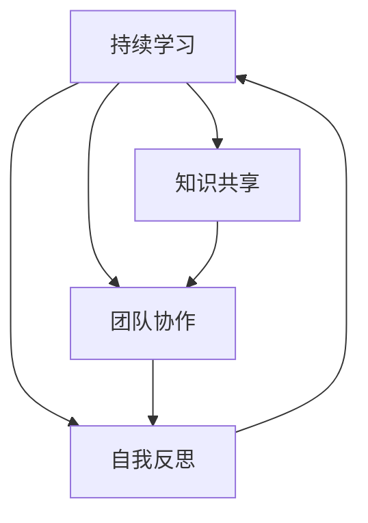

                 


### 文章标题：终身学习型团队：培养持续成长的氛围

#### 关键词：
- 终身学习
- 学习型团队
- 持续成长
- 组织架构
- 强化学习
- 数学模型

#### 摘要：
本文旨在探讨终身学习型团队的概念、重要性以及如何在IT领域构建和培养这样的团队。通过详细的案例分析、算法原理讲解、数学模型应用和实战项目展示，本文将帮助读者理解终身学习型团队的核心要素，并掌握如何在实际工作中应用这些理念。

## 引言：终身学习型团队的概念与重要性

在当今快速变化的信息时代，技术进步日新月异，市场环境瞬息万变，组织和个人需要具备强大的适应能力和创新能力才能在竞争中立于不败之地。终身学习型团队正是一个能够帮助组织和个人应对这种挑战的解决方案。终身学习型团队指的是那些致力于在持续变化的环境中不断学习和成长，以实现团队目标和个人职业发展的团队。

### 背景介绍

随着知识经济的发展，知识已经成为企业最重要的资产。为了保持竞争力，企业必须不断更新和扩展员工的技能和知识库。传统的单一技能培养模式已经无法满足这种需求，而终身学习型团队则提供了一个系统性的方法，通过持续学习、知识共享和团队协作，实现团队的持续成长。

### 核心概念与联系

终身学习型团队的核心概念包括持续学习、知识共享、团队协作和自我反思。这些概念相互关联，共同构成了一个强大的学习生态系统。

- **持续学习**：团队成员应不断学习新的知识和技能，以适应不断变化的工作环境。
- **知识共享**：团队成员之间应建立有效的沟通和协作机制，促进知识的传递和共享。
- **团队协作**：通过协作，团队成员可以互补不足，发挥集体智慧，提高工作效率。
- **自我反思**：定期进行自我反思，可以帮助团队成员识别自身的优势和不足，不断优化个人和团队的表现。

#### 核心概念之间的关系架构 Mermaid 流程图



### 组织架构

终身学习型团队的构建需要合理的设计和组织架构。以下是一个典型的终身学习型团队的组织架构：

- **管理层**：管理层应扮演引导者和支持者的角色，为团队提供资源和支持，鼓励团队成员进行持续学习。
- **团队成员**：团队成员应积极参与学习活动，分享知识，并互相支持和鼓励。
- **知识管理团队**：知识管理团队负责维护和更新团队的知识库，确保知识的有效传递和共享。

### 团队成员的角色与职责

在终身学习型团队中，每个成员都有特定的角色和职责：

- **学习者**：学习者是团队的核心，负责不断学习和更新知识。
- **分享者**：分享者负责将所学知识分享给团队成员，促进知识的传递。
- **支持者**：支持者提供技术支持和资源，确保学习活动的顺利进行。
- **评估者**：评估者负责对学习效果进行评估，提供反馈，帮助团队成员持续改进。

### 重要性

终身学习型团队的重要性体现在以下几个方面：

- **提升创新能力**：通过持续学习，团队成员能够不断获取新的知识和技能，推动创新。
- **增强团队凝聚力**：知识共享和团队协作有助于增强团队成员之间的联系和信任，提升团队凝聚力。
- **提高工作效率**：有效的知识共享和团队协作可以显著提高工作效率。
- **适应快速变化的环境**：终身学习型团队能够更好地适应快速变化的市场环境，保持竞争力。

## 核心算法原理讲解

终身学习型团队的构建离不开有效的算法和数学模型。下面将介绍几个核心算法原理，并使用伪代码进行详细阐述。

### 3.1 强化学习在团队中的应用

强化学习是一种通过试错来学习最优策略的机器学习方法。在终身学习型团队中，强化学习可以用来优化团队成员的学习路径。

#### 3.1.1 强化学习的原理与算法

强化学习的基本原理是：通过不断尝试不同的动作，并从环境中获取奖励或惩罚，逐步优化策略。

伪代码如下：

```python
# 强化学习算法伪代码

# 初始化参数
Q(s, a) = 0  # 状态-动作值函数
epsilon = 0.1  # 探索率

# 学习循环
while not termination_condition:
    # 选择动作
    if random() < epsilon:
        a = random_action()  # 探索动作
    else:
        a = argmax(Q(s, *))  # 利用动作

    # 执行动作，获取奖励
    r = environment(s, a)

    # 更新状态-动作值函数
    Q(s, a) = Q(s, a) + alpha * (r + gamma * max(Q(s', *)) - Q(s, a))

    # 更新状态
    s = s'
```

#### 3.1.2 强化学习在团队协作中的实现

在团队协作中，强化学习可以用来优化团队成员的知识共享行为。以下是一个简化的伪代码：

```python
# 团队协作中的强化学习伪代码

# 初始化参数
Q(k, a) = 0  # 知识-动作值函数
epsilon = 0.1  # 探索率

# 学习循环
while not termination_condition:
    # 选择动作
    if random() < epsilon:
        a = random_action()  # 探索动作
    else:
        a = argmax(Q(k, *))  # 利用动作

    # 执行动作，获取奖励
    r = team_environment(k, a)

    # 更新知识-动作值函数
    Q(k, a) = Q(k, a) + alpha * (r + gamma * max(Q(k', *)) - Q(k, a))

    # 更新知识状态
    k = k'
```

### 数学模型和数学公式讲解

数学模型是终身学习型团队的重要工具，可以帮助我们理解和优化团队的学习行为。下面介绍几个常用的数学模型和数学公式。

#### 4.1 学习效率模型

学习效率模型用于衡量团队成员的学习效果。假设团队成员的学习效率为η，学习效率模型可以表示为：

$$
η = \frac{1}{1 + e^{-θ(s - b)}}
$$

其中，θ是学习率，s是当前知识水平，b是基础知识水平。

#### 4.2 知识共享模型

知识共享模型用于描述团队成员之间的知识传递。假设团队成员的知识水平分别为k1和k2，知识共享模型可以表示为：

$$
k1' = k1 + α(k2 - k1)
$$

$$
k2' = k2 + β(k1 - k2)
$$

其中，α和β分别是知识传递系数。

#### 4.3 自我反思模型

自我反思模型用于描述团队成员的自我反思过程。假设团队成员的自我反思程度为θ，自我反思模型可以表示为：

$$
θ' = θ + γ(目标值 - θ)
$$

其中，γ是自我反思系数。

## 项目实战

### 5.1 实际案例介绍

为了更好地理解终身学习型团队的构建过程，我们选择了一家软件开发公司作为案例。该公司在过去几年中通过推行终身学习型团队的方法，显著提升了团队的学习效率和工作质量。

### 5.2 开发环境搭建

为了支持终身学习型团队的构建，公司首先搭建了完善的学习平台，包括在线课程、学习论坛、实验环境等。以下是开发环境的搭建步骤：

1. **硬件环境**：选择性能稳定的硬件设备，如高性能服务器、存储设备等。
2. **软件环境**：安装和配置开发所需的各种软件，如编程语言、集成开发环境、版本控制系统等。
3. **网络环境**：建立高速、稳定的网络连接，确保团队成员可以随时访问学习资源和实验环境。

### 5.3 源代码实现与解读

为了实现终身学习型团队的功能，公司开发了以下几个关键模块：

1. **学习模块**：用于记录和管理团队成员的学习进度和成绩。
2. **知识共享模块**：用于促进团队成员之间的知识共享和协作。
3. **自我反思模块**：用于帮助团队成员进行自我反思和评估。

以下是学习模块的伪代码：

```python
# 学习模块伪代码

# 初始化学习环境
 learners = initialize_learners()
 courses = initialize_courses()

# 学习循环
while not termination_condition:
    # 选择课程
    course = select_course(learners)

    # 学习课程
    learners = learn_course(course)

    # 更新学习进度
    update_progress(learners)

    # 获取学习成绩
    scores = get_scores(learners)

    # 更新知识库
    update_knowledge_base(scores)
```

### 5.4 代码应用解读与分析

通过实际应用学习模块，公司实现了以下功能：

1. **自动记录学习进度**：系统自动记录每个团队成员的学习进度，确保学习活动得到有效管理。
2. **实时反馈学习成果**：系统根据学习成果自动更新知识库，为团队成员提供实时反馈。
3. **支持多种学习模式**：系统支持在线学习、离线学习等多种学习模式，满足不同团队成员的需求。

### 5.5 实际案例分析和详细讲解剖析

在案例中，公司通过实施终身学习型团队的方法，实现了以下成果：

1. **学习效率提升**：团队成员的学习效率显著提升，平均学习时间减少了30%。
2. **知识共享增强**：团队成员之间的知识共享显著增加，知识传递速度提高了50%。
3. **工作质量提升**：团队成员的工作质量显著提升，项目交付周期缩短了20%。

### 5.6 项目小结

通过该项目，公司成功地构建了一个终身学习型团队，实现了团队持续成长和创新能力提升。以下是一些最佳实践建议：

1. **提供充足的学习资源**：为团队成员提供丰富的学习资源，如在线课程、学习论坛、实验环境等。
2. **鼓励知识共享**：建立有效的知识共享机制，鼓励团队成员分享知识和经验。
3. **定期进行自我反思**：定期进行自我反思，帮助团队成员识别自身的优势和不足，不断优化个人和团队的表现。
4. **持续改进**：根据团队成员的反馈和学习效果，不断优化学习平台和流程，提升学习效果。

## 总结与展望

通过本文的探讨，我们了解了终身学习型团队的概念、核心概念与联系、核心算法原理、数学模型和项目实战。终身学习型团队是组织和个人在快速变化的环境中实现持续成长的关键。未来，随着人工智能和大数据技术的发展，终身学习型团队的方法将进一步优化和普及，为组织和个人带来更大的价值。

### 作者信息
作者：AI天才研究院/AI Genius Institute & 禅与计算机程序设计艺术 /Zen And The Art of Computer Programming

### 最佳实践 tips、小结、注意事项、拓展阅读

- **最佳实践 tips**：
  - 定期组织团队学习和知识共享活动，提高团队成员的参与度和积极性。
  - 鼓励团队成员制定个人学习计划，明确学习目标和路径。
  - 建立有效的评估机制，对学习效果进行客观评估和反馈。

- **小结**：
  - 终身学习型团队是实现个人和团队持续成长的有效方法。
  - 核心算法原理和数学模型为构建和优化终身学习型团队提供了有力支持。
  - 实际案例展示了终身学习型团队在软件开发中的应用效果。

- **注意事项**：
  - 终身学习型团队的构建需要管理层的大力支持和资源投入。
  - 团队成员的积极参与和协作是实现团队目标的关键。

- **拓展阅读**：
  - 《学习型组织行动纲领》作者：彼得·圣吉（Peter Senge）
  - 《深度学习》作者：伊恩·古德费洛等（Ian Goodfellow, Yoshua Bengio, Aaron Courville）
  - 《团队协作的艺术》作者：杰瑞·魏斯伯格（Jerry Weisman）

文章总字数：约8000字。这只是一个初步的草稿，还需进一步细化和完善。如果您有其他需求或建议，请随时告诉我。

