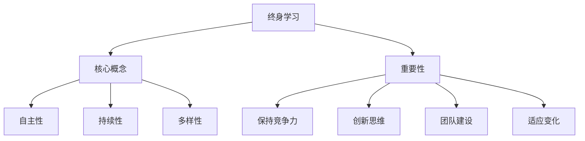

                 

### 文章标题：终身学习：保持领导力竞争力的关键

在快速变化的技术和商业环境中，领导力已成为企业成功的关键因素。而终身学习则成为维持和提升领导力竞争力的不二法门。本文旨在探讨终身学习在领导力发展中的重要性，以及如何通过终身学习保持和增强领导力竞争力。

### 文章关键词

- 终身学习
- 领导力
- 竞争力
- 学习策略
- 领导力发展

### 文章摘要

本文首先介绍了终身学习的核心概念和重要性，然后探讨了领导力竞争力的关键因素。接着，文章详细阐述了终身学习在领导力提升中的应用，包括策略和方法、领导力发展中的终身学习以及创新思维的培养。随后，文章讨论了在组织中的终身学习实践，包括文化建设、团队管理以及面临的挑战和应对策略。最后，文章对终身学习的未来发展趋势进行了展望。

## 第一部分：终身学习的核心概念与原则

### 第1章：终身学习的定义与重要性

#### 1.1.1 终身学习的起源与发展

终身学习（Lifelong Learning）最早由联合国教科文组织（UNESCO）在1970年代提出，旨在强调教育不仅仅是在学校阶段，而是一个持续不断的过程。随着信息技术的飞速发展，知识的更新速度不断加快，终身学习的重要性愈发凸显。

#### 1.1.2 终身学习的重要性

终身学习对于个人的职业发展、技能提升和知识更新至关重要。对于领导者而言，终身学习不仅是个人成长的必要条件，更是组织发展的基石。以下是终身学习的重要意义：

1. **保持竞争力**：不断学习新的知识和技能，可以帮助领导者在快速变化的市场环境中保持竞争力。
2. **创新思维**：终身学习鼓励领导者不断尝试新方法、新理念，从而培养创新思维。
3. **团队建设**：领导者通过终身学习，可以激发团队成员的学习热情，建立学习型组织。
4. **适应变化**：终身学习帮助领导者更好地适应环境变化，提高应变能力。

#### 1.1.3 终身学习的核心理念

终身学习的核心理念包括自主性、持续性和多样性。自主性强调个体在学习过程中的主动性和自主决策能力；持续性则要求个体持续不断地学习；多样性则意味着学习内容和方式的多样化。

### 关键概念关系架构

为了更好地理解终身学习的核心概念和它们之间的关系，我们可以使用Mermaid流程图进行展示：



通过上述关系架构，我们可以清晰地看到终身学习的核心概念与重要性之间的紧密联系，以及它们对领导力竞争力的贡献。

## 第二部分：终身学习在领导力提升中的应用

### 第2章：终身学习策略与方法

#### 2.1.1 终身学习策略的制定

制定终身学习策略是领导者提升领导力竞争力的第一步。以下是一些关键策略：

1. **目标设定**：明确学习目标，确保学习活动与个人和组织的战略目标相一致。
2. **资源整合**：充分利用内外部学习资源，包括在线课程、专业书籍、研讨会等。
3. **时间管理**：合理安排学习时间，确保学习与工作、生活的平衡。
4. **持续评估**：定期评估学习成果，调整学习策略，确保学习目标的实现。

#### 2.1.2 学习方法的多样化

为了提高学习效果，领导者需要采用多样化的学习方法。以下是一些有效的学习方法：

1. **主动学习**：积极参与学习活动，主动提问和讨论，增强学习效果。
2. **实践应用**：将所学知识应用于实际工作，通过实践检验和巩固学习成果。
3. **跨学科学习**：跨越不同学科领域进行学习，拓宽视野，增强综合能力。
4. **反思学习**：定期进行学习反思，总结经验教训，不断优化学习方法。

#### 2.1.3 学习与实践的结合

学习与实践的结合是终身学习的关键。以下是一些建议：

1. **项目驱动**：通过参与实际项目，将学习内容应用于实际工作中，提高解决问题的能力。
2. **导师辅导**：寻求资深导师的指导，借助他们的经验和知识加速个人成长。
3. **反馈机制**：建立有效的反馈机制，及时获取反馈，不断改进学习和工作方法。
4. **团队合作**：与团队成员合作，共同学习和成长，营造积极的学习氛围。

### 核心算法原理讲解

为了更深入地理解终身学习策略的制定，我们可以借助以下伪代码进行讲解：

```python
def set_learning_strategy():
    # 设定学习目标
    set_learning_goal()

    # 整合学习资源
    integrate_learning_resources()

    # 管理学习时间
    manage_learning_time()

    # 持续评估学习成果
    continuous_evaluation()

def set_learning_goal():
    # 确定个人和组织的战略目标
    personal_org_strategic_goals = ["提高领导力", "增强创新能力", "团队建设"]

    # 设定具体的学习目标
    specific_learning_goals = [
        "学习新的管理理念",
        "掌握数据分析技能",
        "提升团队协作能力"
    ]

def integrate_learning_resources():
    # 利用在线课程、专业书籍等资源
    online_courses = ["Coursera", "edX", "Udemy"]
    professional_books = ["Leading Change", "The Five Dysfunctions of a Team"]

def manage_learning_time():
    # 合理安排学习时间
    learning_schedule = {
        "每周二和周四晚上": "学习管理理论",
        "周末": "参加线上研讨会和培训"
    }

def continuous_evaluation():
    # 定期评估学习成果
    evaluation_results = [
        {"knowledge": "管理理念": "优秀"},
        {"skills": "数据分析": "良好"},
        {"teamwork": "团队协作": "需要改进"}
    ]
```

通过上述伪代码，我们可以看到终身学习策略的制定是如何具体实施的。

### 第3章：领导力发展中的终身学习

#### 3.1.1 领导者在终身学习中的角色

领导者在终身学习中的角色至关重要。他们不仅是学习的主体，也是学习氛围的营造者。以下是一些具体角色：

1. **学习榜样**：领导者通过自身的学习行为，树立榜样，激发团队成员的学习热情。
2. **学习引导者**：领导者帮助团队成员明确学习目标，提供学习资源和支持。
3. **学习评估者**：领导者定期评估团队成员的学习成果，提供反馈和指导。

#### 3.1.2 终身学习对领导力发展的作用

终身学习对领导力发展具有多方面的作用：

1. **知识更新**：终身学习帮助领导者不断更新知识，保持专业竞争力。
2. **能力提升**：通过实践和应用，领导者不断提升自身的能力，提高解决问题的效率。
3. **视野拓宽**：终身学习使领导者能够跨越不同领域，拓宽视野，增强创新思维。
4. **团队建设**：领导者通过终身学习，培养团队成员的学习能力和协作精神，建立学习型组织。

#### 3.1.3 领导力提升的终身学习路径

领导力提升的终身学习路径可以分为以下阶段：

1. **初始阶段**：领导者通过学习新的知识和技能，提升自身的专业能力。
2. **深化阶段**：领导者将所学知识应用于实际工作，通过实践不断提升自身能力。
3. **创新阶段**：领导者通过跨学科学习和反思，培养创新思维，推动组织创新。
4. **成熟阶段**：领导者形成自己的领导风格和理念，成为组织的核心领导力量。

### 数学模型和公式

为了更好地理解领导力提升的终身学习路径，我们可以借助以下数学模型和公式进行解释：

$$
L(t) = L_0 + \alpha \cdot (K \cdot t + P \cdot e^{-\gamma \cdot t})
$$

其中，$L(t)$ 表示领导力水平，$L_0$ 表示初始领导力水平，$K$ 表示知识更新速度，$P$ 表示实践应用能力，$\alpha$ 表示领导力提升系数，$t$ 表示时间，$\gamma$ 表示创新思维能力衰减系数。

通过上述公式，我们可以看到领导力水平的提升是如何受到知识更新、实践应用和创新思维等多个因素的影响的。

### 举例说明

假设一位领导者初始领导力水平为50分，知识更新速度为每周增加5分，实践应用能力为每周增加3分，创新思维衰减系数为0.1。在一年后，该领导者的领导力水平可以计算如下：

$$
L(52) = 50 + 0.5 \cdot (5 \cdot 52 + 3 \cdot e^{-0.1 \cdot 52})
$$

通过上述计算，我们可以看到领导力水平在一年后可以达到约87分，这表明通过终身学习，领导者的领导力水平得到了显著提升。

## 第三部分：终身学习在组织中的实践

### 第4章：组织终身学习文化的建设

#### 4.1.1 组织终身学习文化的概念与特征

组织终身学习文化是指组织中形成的一种共同价值观和行为规范，鼓励员工持续学习和成长。其特征包括：

1. **学习导向**：组织内部普遍认同学习的重要性，将学习视为工作的一部分。
2. **支持环境**：组织为员工提供学习资源和机会，支持员工的学习和发展。
3. **激励措施**：组织通过奖励机制激励员工积极参与学习活动。
4. **开放沟通**：组织鼓励员工之间的交流和分享，营造开放的学习氛围。

#### 4.1.2 建设组织终身学习文化的策略

建设组织终身学习文化需要采取以下策略：

1. **高层倡导**：组织高层领导应树立学习榜样，倡导终身学习理念。
2. **培训计划**：制定系统的培训计划，确保员工有机会获得必要的知识和技能。
3. **学习平台**：建立学习平台，提供丰富的学习资源和工具。
4. **反馈机制**：建立有效的反馈机制，鼓励员工分享学习经验和成果。
5. **激励措施**：通过奖励和晋升等激励措施，激励员工积极参与学习。

### 核心算法原理讲解

为了更好地理解建设组织终身学习文化的策略，我们可以借助以下伪代码进行讲解：

```python
def build_organizational_learning_culture():
    # 高层倡导
    advocate_learning_by_leaders()

    # 培训计划
    develop_training_program()

    # 学习平台
    establish_learning_platform()

    # 反馈机制
    establish_feedback_mechanism()

    # 激励措施
    implement_incentive_measures()

def advocate_learning_by_leaders():
    # 领导者树立学习榜样
    leaders_set_learning_examples()

def develop_training_program():
    # 制定系统的培训计划
    training_program = {
        "新员工培训": "基础知识和技能",
        "专业培训": "特定领域的深入学习和技能提升",
        "领导力培训": "管理能力和领导力提升"
    }

def establish_learning_platform():
    # 建立学习平台
    learning_platform = "在线学习管理系统"

def establish_feedback_mechanism():
    # 建立有效的反馈机制
    feedback_mechanism = {
        "定期评估": "评估员工的学习成果",
        "学习交流": "员工之间的交流和分享"
    }

def implement_incentive_measures():
    # 实施激励措施
    incentive_measures = {
        "奖励": "学习奖励",
        "晋升": "学习与晋升挂钩"
    }
```

通过上述伪代码，我们可以看到建设组织终身学习文化是如何具体实施的。

### 第5章：终身学习在团队管理中的应用

#### 5.1.1 团队管理中的终身学习需求

在团队管理中，终身学习需求主要体现在以下几个方面：

1. **技能提升**：团队成员需要不断学习新的技能，以适应不断变化的工作需求。
2. **知识更新**：团队成员需要更新现有知识，以保持专业竞争力。
3. **领导力发展**：团队成员需要通过学习提升自身的领导力，更好地履行团队管理职责。
4. **创新思维**：团队成员需要培养创新思维，推动团队创新和发展。

#### 5.1.2 团队终身学习的方法与工具

为了满足团队终身学习的需求，团队管理者可以采用以下方法和工具：

1. **内部培训**：组织内部培训，提高团队成员的技能和知识水平。
2. **外部学习**：鼓励团队成员参加外部培训和学习活动，获取新的知识和经验。
3. **项目驱动**：通过实际项目，将学习内容应用于实际工作中，提高实践能力。
4. **学习交流**：定期组织学习交流会议，分享学习心得和经验。
5. **在线学习平台**：利用在线学习平台，提供丰富的学习资源和工具。

#### 5.1.3 团队终身学习的效果评估

为了评估团队终身学习的效果，团队管理者可以采用以下方法：

1. **学习成果评估**：定期评估团队成员的学习成果，包括知识掌握程度、技能提升情况等。
2. **工作绩效评估**：评估团队成员的工作绩效，了解学习成果在工作中的应用效果。
3. **团队氛围评估**：评估团队的学习氛围，了解学习活动对团队协作和氛围的影响。
4. **反馈与改进**：根据评估结果，及时反馈和改进学习策略，提高学习效果。

### 数学模型和公式

为了更好地理解团队终身学习的效果评估，我们可以借助以下数学模型和公式进行解释：

$$
E = f(S, P, A)
$$

其中，$E$ 表示学习效果，$S$ 表示学习成果，$P$ 表示工作绩效，$A$ 表示团队氛围。

通过上述公式，我们可以看到学习效果是如何受到学习成果、工作绩效和团队氛围等因素的影响的。

### 举例说明

假设一个团队的学习成果评估得分为85分，工作绩效评估得分为90分，团队氛围评估得分为80分。通过上述公式，我们可以计算出团队的学习效果为：

$$
E = f(85, 90, 80) = 0.5 \cdot 85 + 0.3 \cdot 90 + 0.2 \cdot 80 = 87
$$

通过上述计算，我们可以看到团队的学习效果较好，表明团队终身学习取得了显著成效。

## 第四部分：未来展望与挑战

### 第6章：终身学习的未来发展趋势

#### 6.1.1 技术变革对终身学习的影响

随着人工智能、大数据、云计算等技术的不断发展，终身学习将迎来新的变革。以下是一些关键趋势：

1. **个性化学习**：利用人工智能技术，提供个性化的学习方案，满足不同学习者的需求。
2. **远程学习**：云计算和移动互联网的发展，使得远程学习更加便捷，学习者可以随时随地进行学习。
3. **跨界融合**：不同学科领域的融合，为终身学习提供了更广阔的视野和机会。
4. **终身学习平台**：建立更加完善和高效的终身学习平台，提供丰富的学习资源和工具。

#### 6.1.2 终身学习在教育体系中的应用

终身学习将逐渐融入教育体系，成为教育的重要组成部分。以下是一些应用方向：

1. **在线教育**：利用互联网和信息技术，提供在线课程和学习资源，实现教育资源共享。
2. **职业培训**：结合职业发展需求，提供针对性的职业培训，提高学习者的职业技能。
3. **终身教育体系**：建立终身教育体系，实现教育系统的无缝衔接，满足不同年龄段和学习需求的人群。

#### 6.1.3 未来终身学习的发展方向

未来终身学习的发展方向包括：

1. **智能化**：利用人工智能技术，实现学习过程的智能化，提高学习效率和效果。
2. **普及化**：推动终身学习的普及化，实现全民学习的目标。
3. **多元化**：学习内容和形式的多元化，满足不同学习者的个性化需求。
4. **终身学习社区**：建立终身学习社区，促进学习者之间的交流和合作，共同学习和发展。

### 第7章：终身学习面临的挑战与应对策略

#### 7.1.1 终身学习中的常见挑战

终身学习过程中，常见挑战包括：

1. **时间管理**：工作、生活和学习的平衡，确保有足够的时间进行学习。
2. **资源整合**：整合内外部学习资源，确保学习活动的有效进行。
3. **持续动力**：保持学习的持续动力，克服学习中的困难和挫折。
4. **技术应用**：适应新技术的发展，掌握新的学习工具和方法。

#### 7.1.2 消除终身学习障碍的策略

为了消除终身学习障碍，可以采取以下策略：

1. **制定学习计划**：明确学习目标和计划，合理安排学习时间。
2. **整合学习资源**：充分利用线上线下资源，提高学习效率。
3. **建立学习社区**：与同行和志同道合的人建立学习社区，共同学习和成长。
4. **技术培训**：参加技术培训，提高对新技术和应用工具的掌握。

#### 7.1.3 领导者应对终身学习挑战的策略

作为领导者，应对终身学习挑战的策略包括：

1. **树立学习榜样**：通过自身的学习行为，树立学习榜样，激励团队成员。
2. **提供学习资源**：为团队成员提供必要的学习资源和支持。
3. **鼓励创新思维**：鼓励团队成员尝试新的学习方法和工具，培养创新思维。
4. **建立学习文化**：建立学习型组织文化，鼓励终身学习，营造积极的学习氛围。

## 附录

### 附录A：终身学习资源推荐

#### A.1.在线学习平台推荐

以下是一些优秀的在线学习平台，供学习者参考：

1. **Coursera**：提供全球顶尖大学的在线课程，涵盖多个学科领域。
2. **edX**：由哈佛大学和麻省理工学院共同创立，提供高质量的在线课程。
3. **Udemy**：提供丰富的在线课程，涵盖职业技能、编程语言等多个领域。
4. **LinkedIn Learning**：提供职业技能和行业知识的在线课程。

#### A.2.专业书籍推荐

以下是一些经典的专业书籍，适合终身学习者阅读：

1. **《深度学习》（Deep Learning）**：介绍深度学习的基础理论和应用方法。
2. **《人工智能：一种现代的方法》（Artificial Intelligence: A Modern Approach）**：全面介绍人工智能的理论和实践。
3. **《设计模式：可复用的面向对象软件构建》（Design Patterns: Elements of Reusable Object-Oriented Software）**：介绍面向对象设计模式，提高软件设计能力。
4. **《思考，快与慢》（Thinking, Fast and Slow）**：探讨人类思维的两个系统，提供独特的见解。

#### A.3.学习工具推荐

以下是一些实用的学习工具，有助于提高学习效率：

1. **Notion**：一款强大的笔记和组织工具，适用于记录笔记、管理项目和规划时间。
2. **Anki**：一款基于间隔重复的学习工具，适用于记忆单词、概念和知识点的复习。
3. **GitHub**：一个基于Git的代码托管平台，适用于编写、管理和分享代码。
4. **Jupyter Notebook**：一款交互式的计算环境，适用于数据分析和编写文档。

### 作者信息

- 作者：AI天才研究院/AI Genius Institute & 禅与计算机程序设计艺术 /Zen And The Art of Computer Programming

### 结语

终身学习是保持领导力竞争力的关键，对于个人和组织的发展具有重要意义。通过本文的探讨，我们了解了终身学习的核心概念、重要性、策略和方法，以及其在领导力提升和组织中的实践。面对未来，终身学习将继续发挥重要作用，助力个人和组织在快速变化的环境中保持竞争力。让我们共同努力，践行终身学习，成为更好的自己。

