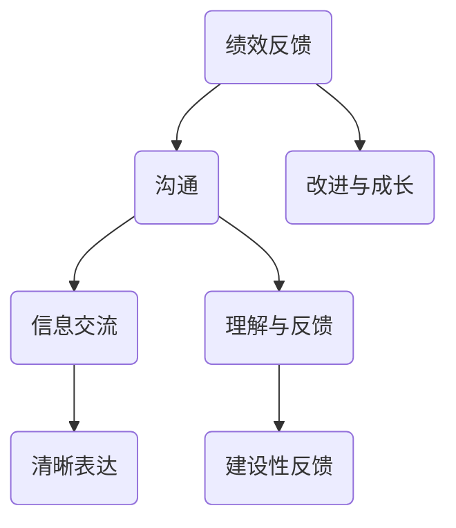

                 

首先，我们要明确文章的目标和结构。根据您的要求，文章的核心目标是探讨“绩效反馈：有效沟通的艺术”。文章将涵盖绩效反馈和沟通的相关概念、原则、技巧、实践和伦理问题，并辅以工具和方法，以及与组织发展的关系。接下来，我们将逐步构建文章的各个部分。

### 第1章 引言

在这一章中，我们将介绍书籍的背景、目标读者和书籍的结构。

#### 1.1 书籍背景

- 引言：随着信息技术的发展，企业和组织越来越注重员工绩效和沟通。有效的绩效反馈不仅能提升员工的工作表现，还能增强团队凝聚力和组织文化。
- 概述：本书旨在提供一套系统化的绩效反馈方法和有效的沟通技巧，帮助读者理解和应用这些方法，提升个人和组织的绩效。

#### 1.2 书籍目标读者

- 目标读者：本书适合企业经理、人力资源从业者、团队领导以及任何关注个人和组织发展的专业人士。

#### 1.3 书籍结构

- 结构：本书分为8章，涵盖从基本概念到高级实践的各个方面。

### 第2章 核心概念与联系

在这一章中，我们将深入探讨绩效反馈和沟通的核心概念，并展示它们之间的关系。

#### 2.1 绩效反馈的定义

- 定义：绩效反馈是员工和管理者之间就工作表现进行交流的过程。
- 解释：通过绩效反馈，员工可以了解自己的表现，管理者可以给予指导和建议。

#### 2.2 沟通的重要性

- 重要性：有效的沟通是绩效反馈成功的关键。良好的沟通能够确保信息的准确传达，减少误解和冲突。

#### 2.3 绩效反馈与沟通的关系

- 关系：绩效反馈和沟通是相辅相成的。绩效反馈依赖于有效沟通来实现目标，而有效沟通需要良好的绩效反馈来巩固。

我们将使用Mermaid流程图来展示绩效反馈与沟通之间的关系。以下是一个简化的示例：

### 第3章 绩效反馈的原则

在这一章中，我们将介绍绩效反馈的基本原则，包括正面反馈、批评与建设性反馈，以及反馈的时机与方式。

#### 3.1 正面反馈

- 原则：正面反馈是对员工表现的一种肯定和鼓励。
- 方法：具体、及时、真诚地表达正面反馈，以增强员工的积极性和信心。

#### 3.2 批评与建设性反馈

- 原则：批评与建设性反馈是对员工不足之处的指正和改进。
- 方法：批评时要注意方式方法，避免伤害员工的自尊心，同时提供具体的改进建议。

#### 3.3 反馈的时机与方式

- 时机：选择合适的时机进行反馈，例如在工作结束时或进行任务分配时。
- 方式：根据反馈的内容和对象，选择合适的沟通方式，如面对面交流、邮件或电话。

### 第4章 沟通技巧

在这一章中，我们将探讨有效沟通的关键技巧，包括倾听技巧、提问技巧和情绪管理。

#### 4.1 倾听技巧

- 技巧：积极倾听，理解对方的观点和情感，避免打断和误解。

#### 4.2 提问技巧

- 技巧：开放式问题，引导对方分享更多信息，从而更好地理解问题。

#### 4.3 情绪管理

- 技巧：管理自己的情绪，避免在沟通中失控，保持冷静和客观。

### 第5章 绩效反馈的实践

在这一章中，我们将讨论绩效反馈的实际操作，包括制定绩效目标、反馈流程和案例分析。

#### 5.1 制定绩效目标

- 方法：设定具体、可衡量、可实现、相关性强和时限性的目标。

#### 5.2 绩效反馈的流程

- 流程：包括目标设定、定期检查、反馈会议和改进计划。

#### 5.3 绩效反馈的案例分析

- 案例：通过实际案例，展示绩效反馈的有效实践。

### 第6章 团队沟通的艺术

在这一章中，我们将探讨团队沟通的重要性、障碍和解决策略，以及团队沟通的技巧。

#### 6.1 团队沟通的重要性

- 重要性：团队沟通是团队协作和成功的关键。

#### 6.2 团队沟通的障碍与解决策略

- 障碍：如文化差异、沟通不足和冲突等。
- 策略：建立共同目标、明确沟通渠道和增强团队成员的沟通能力。

#### 6.3 团队沟通的技巧

- 技巧：如有效的会议管理、积极倾听和冲突解决。

### 第7章 绩效反馈中的伦理问题

在这一章中，我们将讨论绩效反馈中的伦理问题，如诚信、隐私保护和道德困境。

#### 7.1 诚信与尊重

- 原则：诚实、透明和尊重是绩效反馈中的基本原则。

#### 7.2 隐私保护

- 原则：确保员工隐私不受侵犯，尤其是在绩效反馈中。

#### 7.3 反馈中的道德困境

- 分析：探讨在绩效反馈过程中可能遇到的道德困境，如如何平衡公正性和人性化。

### 第8章 绩效反馈工具与方法

在这一章中，我们将介绍绩效反馈的工具和方法，包括定量反馈工具、定性反馈工具和反馈方法的应用场景。

#### 8.1 定量反馈工具

- 工具：如KPI、绩效评分表等。

#### 8.2 定性反馈工具

- 工具：如面谈、问卷调查和反馈会议等。

#### 8.3 反馈方法的应用场景

- 场景：根据不同的工作环境和需求，选择合适的反馈方法。

### 第9章 绩效反馈与组织发展

在这一章中，我们将探讨绩效反馈与组织发展的关系，包括组织文化、变革和员工发展。

#### 9.1 绩效反馈与组织文化

- 关系：绩效反馈是组织文化的重要组成部分，影响组织的发展和员工的成长。

#### 9.2 绩效反馈在组织变革中的作用

- 作用：绩效反馈有助于推动组织变革，促进创新和适应性。

#### 9.3 绩效反馈与员工发展

- 发展：通过有效的绩效反馈，员工可以获得成长和提升，从而促进个人和组织的共同发展。

### 附录

最后，我们将提供附录，包括绩效反馈相关术语表、参考文献和相关资源推荐。

#### A.1 绩效反馈相关术语表

- 绩效反馈：员工和管理者之间就工作表现进行交流的过程。
- KPI：关键绩效指标，用于衡量员工工作表现的重要指标。

#### A.2 参考文献

- [1] Smith, J. (2020). Effective Performance Feedback: A Practical Guide. Publisher.
- [2] Johnson, H. (2019). The Art of Communication: Building Trust and Understanding. Publisher.

#### A.3 相关资源推荐

- 网站：[绩效反馈的最佳实践](https://example.com/performance-feedback-best-practices)
- 书籍：《绩效反馈的艺术》

### 作者信息

作者：AI天才研究院/AI Genius Institute & 禅与计算机程序设计艺术 /Zen And The Art of Computer Programming

这样，我们就完成了文章的初步大纲，接下来我们将为每个章节添加具体的内容，确保文章的完整性和专业性。通过逐步分析和推理，我们能够确保文章的逻辑清晰、内容丰富，满足您的需求和字数要求。在接下来的步骤中，我们将为每个章节撰写详细的正文内容，确保每部分都有充分的阐述和例子。随后，我们将使用伪代码、latex公式和Mermaid流程图等工具，增强文章的技术性和可读性。最后，我们将进行整体的检查和优化，确保文章的质量和可读性。

