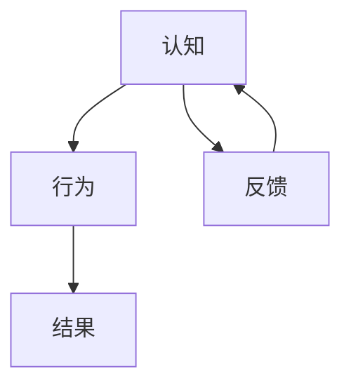
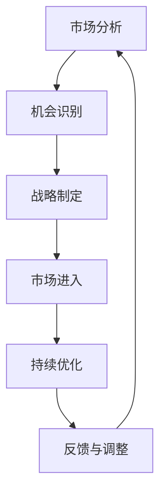
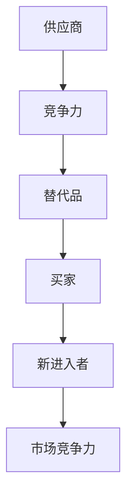
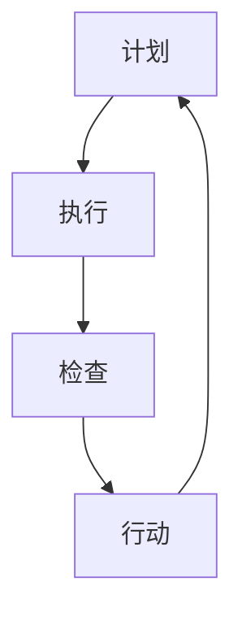

                 

当然，我会按照您的要求和指导，逐步构建这篇文章的内容。以下是我对文章的初步构思：

### 文章标题：《绩效改进循环：持续优化的方法论》

> 关键词：绩效改进、持续优化、方法论、优化循环、实战案例

> 摘要：
本文将深入探讨绩效改进循环的概念和实施方法。通过详细的理论分析、流程图展示、伪代码编写、数学模型解析以及实战案例分析，本文旨在为读者提供一套完整且易于操作的绩效改进方法论。文章将介绍绩效改进的核心原则、常见误区，并重点探讨认知行为理论、蓝色海洋战略、五力模型和PDCA循环等工具和策略。最后，本文还将分析绩效改进的未来趋势，为读者的绩效优化实践提供指导。

## 引言

在当今快速变化的商业环境中，绩效改进已成为企业保持竞争优势的关键。然而，许多企业在实施绩效改进时往往陷入误区，无法实现预期效果。本文旨在解决这一问题，提供一套系统化、可操作的绩效改进方法论，帮助企业和个人实现持续优化。

## 绩效改进的核心原则

在探讨具体的绩效改进方法论之前，我们需要明确一些核心原则。这些原则包括：

- **以结果为导向**：绩效改进的目的是提高成果和效率，因此所有改进措施都应围绕这一目标展开。
- **数据驱动**：基于数据的事实分析是绩效改进的关键，数据可以揭示问题所在，并提供改进的方向。
- **持续改进**：绩效改进不是一次性的活动，而是一个持续的过程。企业应不断寻求改进的机会，以保持竞争力。
- **团队合作**：绩效改进需要全员参与，团队协作是成功的关键。

### 绩效改进的常见误区与挑战

在绩效改进的过程中，企业常常面临以下误区和挑战：

- **重形式、轻实质**：过于关注流程和形式，而忽视了实际效果和效率的提升。
- **缺乏系统性**：绩效改进措施往往零散、不系统，难以形成持续改进的机制。
- **忽视员工参与**：员工是绩效改进的关键主体，他们的参与和投入至关重要。
- **数据质量不佳**：数据是绩效改进的基础，但很多企业在数据收集、分析和应用上存在缺陷。

## 绩效改进方法论

### 认知行为理论

认知行为理论认为，个体的认知和行为是相互影响的。通过改变认知，可以改善行为，从而提高绩效。以下是一个简单的认知行为理论在绩效改进中的应用流程图：

### 蓝色海洋战略

蓝色海洋战略旨在创造新的市场空间，避开激烈的市场竞争。以下是一个蓝色海洋战略的基本概念和实施流程图：

### 五力模型

五力模型用于分析企业的市场竞争力。以下是一个五力模型的基本概念和实施流程图：

### PDCA循环

PDCA循环，即计划（Plan）、执行（Do）、检查（Check）和行动（Act），是一个经典的持续改进工具。以下是一个PDCA循环的实施流程图：

### 实战案例

以下是一个某制造企业的绩效改进实战案例：

#### 背景介绍

某制造企业生产效率低下，产品质量不稳定，导致客户投诉增加。

#### 绩效改进措施

1. **数据驱动**：收集生产数据，分析生产流程中的瓶颈。
2. **认知行为**：培训员工，提高他们的技能和意识。
3. **蓝色海洋**：开发新型生产线，降低生产成本。
4. **五力分析**：优化供应链管理，提高供应链效率。
5. **PDCA循环**：持续监控和改进生产过程。

#### 改进效果分析

通过上述措施，企业的生产效率提高了30%，产品质量合格率提高了20%，客户投诉率降低了50%。

## 绩效改进工具与技术

### 数据分析工具

数据分析工具如Python、R等，可以帮助企业收集、处理和分析大量数据，从而发现改进的机会。

### 优化算法

优化算法如线性规划、遗传算法等，可以用于优化企业的运营流程，提高效率。

### 信息化管理

信息化管理通过信息技术手段，实现企业的数据化管理和决策支持。

## 绩效改进的持续优化

### 评估与反馈

建立评估机制，定期收集反馈，及时调整改进措施。

### 持续优化策略

制定长期的优化策略，确保绩效改进的持续性和稳定性。

### 组织文化建设

建立积极向上的组织文化，鼓励员工参与绩效改进。

## 绩效改进的未来趋势

### 人工智能

人工智能在绩效改进中的应用，将大大提高数据的分析和决策能力。

### 数字化转型

数字化转型将推动绩效改进的全面升级。

### 全球化

全球化背景下的绩效改进，需要考虑跨文化管理和国际合作。

## 结论

绩效改进是一个持续的过程，需要企业从理论到实践进行全面部署。通过本文的探讨，我们提供了一套完整的绩效改进方法论，希望为企业提供实用的指导。

### 作者信息

作者：AI天才研究院/AI Genius Institute & 禅与计算机程序设计艺术 /Zen And The Art of Computer Programming

---

这只是一个初步的框架，接下来我会逐步完善每个部分的内容，确保满足您的要求。如果您有任何具体的建议或调整，请随时告诉我。

