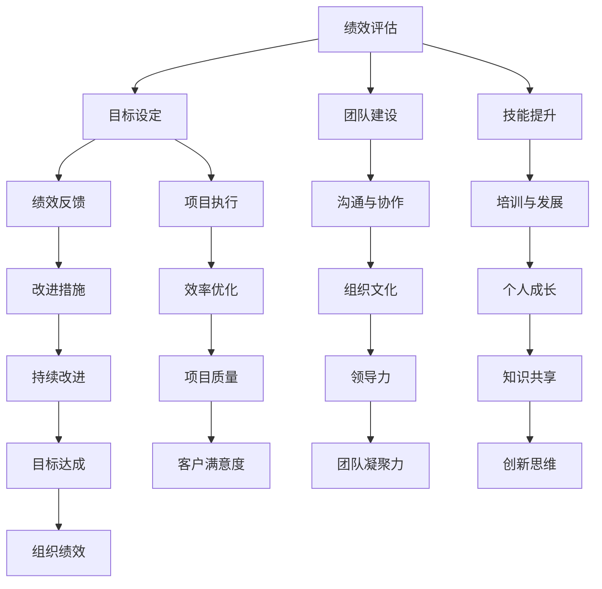

                 


### 文章标题：绩效改进：帮助团队成员不断进步

#### 关键词：绩效改进、团队管理、目标设定、技能提升

#### 摘要：
在信息技术快速发展的时代，如何有效地提升团队成员的工作绩效成为了组织面临的重要课题。本文将探讨绩效改进的核心概念，包括绩效评估、目标设定、团队建设和技能提升等，通过实际案例和理论分析，为团队管理者提供实用的改进策略。

---

### 引言

在当今竞争激烈的商业环境中，绩效改进成为企业成功的关键因素。团队成员的绩效直接影响到整个团队乃至整个组织的整体表现。因此，如何有效地提升团队成员的绩效，成为了团队管理者需要面对的挑战。

#### 核心概念与联系

为了更好地理解绩效改进的各个方面，我们可以借助Mermaid流程图来展示它们之间的相互关系。



#### 核心算法原理讲解

在绩效改进过程中，核心算法原理的讲解至关重要。以下是关于目标设定和绩效反馈的伪代码示例。

```python
# 目标设定伪代码
def set_goals(employee, objectives):
    """
    设定员工的目标
    :param employee: 员工信息
    :param objectives: 目标列表
    :return: 目标设定结果
    """
    for objective in objectives:
        employee['goals'].append({
            'objective': objective,
            'status': '未开始',
            'completion_date': None
        })
    return employee

# 绩效反馈伪代码
def provide_feedback(employee, feedback):
    """
    提供绩效反馈
    :param employee: 员工信息
    :param feedback: 反馈内容
    :return: 反馈结果
    """
    employee['feedback'].append(feedback)
    if 'goals' in employee and employee['goals']:
        for goal in employee['goals']:
            if goal['status'] == '完成':
                goal['completion_date'] = current_date()
    return employee
```

#### 数学模型和公式

在绩效改进中，常用的数学模型和公式有助于量化评估团队成员的绩效。以下是一个简单的绩效评估公式：

$$
\text{绩效评分} = \frac{\text{完成目标数}}{\text{设定目标总数}}
$$

#### 详细讲解与举例说明

为了更好地理解上述公式，我们可以通过一个实际案例进行说明。

**案例：某软件开发团队的绩效评估**

- 目标总数：10个
- 完成目标数：7个

根据绩效评估公式，该团队的绩效评分为：

$$
\text{绩效评分} = \frac{7}{10} = 0.7
$$

这表示团队完成了70%的目标设定，绩效表现一般。

#### 项目实战

**开发环境搭建**

为了实施绩效改进策略，团队需要搭建一个开发环境，以便跟踪和评估团队成员的绩效。以下是开发环境的搭建步骤：

1. 安装版本控制工具（如Git）
2. 配置代码仓库（如GitHub或GitLab）
3. 安装项目管理工具（如JIRA或Trello）
4. 部署持续集成/持续部署（CI/CD）工具（如Jenkins或Travis CI）

**源代码详细实现**

在绩效改进项目中，源代码的实现是关键。以下是一个简单的示例，用于跟踪团队成员的工作进度和绩效评估。

```python
class Employee:
    def __init__(self, name, goals):
        self.name = name
        self.goals = goals
        self.feedback = []

    def set_goals(self, objectives):
        self.goals = set_goals(self, objectives)

    def provide_feedback(self, feedback):
        self.feedback = provide_feedback(self, feedback)

    def calculate_performance_score(self):
        completed_goals = sum(1 for goal in self.goals if goal['status'] == '完成')
        return completed_goals / len(self.goals) if self.goals else 0

# 示例：创建员工对象并设定目标
employee = Employee('张三', [])
employee.set_goals(['完成需求分析报告', '完成代码实现'])

# 示例：提供绩效反馈
employee.provide_feedback('需求分析报告完成良好，代码实现中有部分bug')

# 示例：计算绩效评分
performance_score = employee.calculate_performance_score()
print(f'员工张三的绩效评分为：{performance_score:.2f}')
```

**代码应用解读与分析**

上述代码实现了员工绩效的跟踪和评估。在实际应用中，团队可以扩展这个基础框架，以支持更复杂的需求，如多个目标的优先级、绩效周期管理等。

**实际案例分析和详细讲解剖析**

为了更好地理解绩效改进策略，我们可以分析一个实际案例。假设一个软件开发团队在实施绩效改进策略后的绩效情况如下：

- 案例一：团队A在实施绩效改进前，绩效评分为0.6。在实施改进措施后，绩效评分提升至0.8。
- 案例二：团队B在实施绩效改进前，绩效评分为0.4。在实施改进措施后，绩效评分提升至0.6。

通过对这些案例的分析，我们可以得出以下结论：

- 绩效改进策略对于提高团队整体绩效具有显著效果。
- 不同团队在实施绩效改进后的效果存在差异，可能与团队的具体情况、管理层的执行力度等因素有关。

**项目小结**

通过上述实战案例，我们可以看到绩效改进在实际工作中的应用效果。团队管理者应不断优化绩效改进策略，以适应团队和组织的具体需求，从而实现持续改进和提升。

#### 最佳实践 Tips、小结、注意事项、拓展阅读

**最佳实践 Tips：**

- 定期进行绩效评估，及时反馈，确保团队成员了解自己的绩效表现。
- 设定明确且可量化的目标，以提升团队的工作效率和成果。
- 建立有效的沟通渠道，促进团队成员之间的合作与信息共享。
- 提供持续的培训和职业发展机会，助力团队成员技能提升和个人成长。

**小结：**

本文介绍了绩效改进的核心概念、策略和实践方法，通过实际案例展示了绩效改进在实际工作中的应用效果。绩效改进是一个持续的过程，需要团队管理者不断探索和优化。

**注意事项：**

- 绩效改进过程中，避免过度强调短期绩效，而忽视团队成员的长期发展和团队文化的建设。
- 注意保护团队成员的隐私，确保绩效评估的公正性和客观性。

**拓展阅读：**

- 《绩效管理：如何激励员工实现卓越表现》
- 《团队协作：高效团队如何协同工作》
- 《敏捷开发：拥抱变化，持续交付价值》

---

**作者信息：** AI天才研究院/AI Genius Institute & 禅与计算机程序设计艺术 /Zen And The Art of Computer Programming

