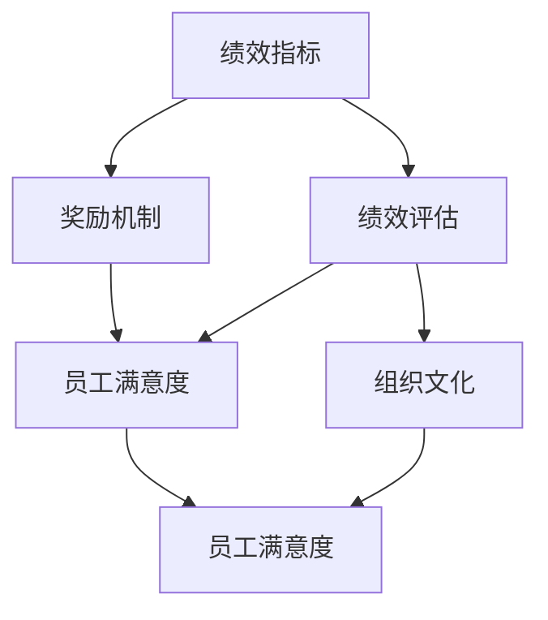

                 


### 文章标题：绩效激励系统设计：有效的奖励机制

#### 关键词：
- 绩效激励系统
- 奖励机制
- 设计原则
- 算法原理
- 项目实战

#### 摘要：
本文将深入探讨绩效激励系统设计的核心要素，包括背景介绍、核心概念与联系、算法原理讲解、数学模型和公式应用，以及实际项目中的实施与案例分析。通过逐步分析推理，本文旨在为读者提供一套实用的绩效激励系统设计指南。

----------------------------------------------------------------

## 引言

绩效激励系统是现代企业管理和人力资源管理中不可或缺的一部分。它的设计旨在通过科学合理的奖励机制，激发员工的工作积极性和创造力，从而提高整体绩效和企业竞争力。随着技术的进步和市场竞争的加剧，企业需要不断优化绩效激励系统，以适应新的环境和发展需求。

本文将围绕以下主题进行讨论：

1. **绩效激励系统的背景介绍**：探讨绩效激励系统在企业管理和人力资源管理中的重要性。
2. **核心概念与联系**：详细阐述绩效激励系统中的关键概念，并使用Mermaid流程图展示它们之间的关系。
3. **算法原理讲解**：介绍绩效激励系统中常用的算法原理，并通过伪代码进行详细阐述。
4. **数学模型和公式应用**：讲解绩效激励系统中数学模型和公式的使用方法，并举例说明。
5. **项目实战**：通过实际项目案例，展示绩效激励系统的实施过程和效果。

通过以上内容的逐步分析，本文将帮助读者全面了解绩效激励系统的设计和实施，为企业管理者提供实用的参考和指导。

---

### 第一部分：绩效激励系统的背景介绍

#### 绩效激励系统在企业管理和人力资源管理中的重要性

绩效激励系统是现代企业管理和人力资源管理的重要工具，其核心目的是通过有效的奖励机制，激发员工的工作积极性和创造力，进而提升整体绩效和企业竞争力。随着全球化和数字化进程的加速，企业的运营环境和市场竞争格局发生了深刻变化，对人力资源管理提出了更高的要求。

首先，绩效激励系统有助于企业实现战略目标。通过设定明确的绩效指标和奖励机制，企业可以确保员工的工作方向与公司的战略目标保持一致，从而提高工作效率和成果。

其次，绩效激励系统能够激发员工的工作热情和创造力。合理的奖励机制能够满足员工的不同需求，如金钱奖励、晋升机会、培训等，从而激发员工的工作动力，提升团队整体协作能力。

此外，绩效激励系统还有助于优化企业的人力资源管理。通过科学的绩效评估和激励措施，企业可以更好地识别和培养人才，优化员工队伍结构，提高人才利用效率。

然而，绩效激励系统并非一蹴而就，其设计需要充分考虑企业的实际情况和员工的个性化需求。因此，本文将详细探讨绩效激励系统的设计原则、算法原理、数学模型和实际项目中的应用，以期为企业管理者提供实用的参考和指导。

---

### 第二部分：核心概念与联系

#### 绩效激励系统中的关键概念

在绩效激励系统中，有几个关键概念需要我们深入理解，这些概念相互联系，共同构成了绩效激励系统的核心。

**1. 绩效指标：** 绩效指标是评估员工工作表现的标准，它们通常包括定量指标（如销售额、生产量）和定性指标（如团队合作、创新能力）。绩效指标的选择和设定是绩效激励系统的关键环节，直接影响到激励效果的实现。

**2. 奖励机制：** 奖励机制是激励员工的手段，包括金钱奖励、非金钱奖励和晋升机会等。奖励机制的设计需要与绩效指标紧密结合，以确保奖励能够真正激发员工的工作热情。

**3. 绩效评估：** 绩效评估是对员工工作表现的定期评估，通过评估结果可以确定奖励的发放和晋升的机会。绩效评估的准确性和公正性是绩效激励系统有效运行的基础。

**4. 员工满意度：** 员工满意度是员工对工作环境和激励措施的主观感受，高满意度有助于提升员工的忠诚度和工作效率。

**5. 组织文化：** 组织文化是企业的价值观和行为规范，它对员工的激励有着深远的影响。一个积极向上的组织文化可以增强员工对企业的认同感和归属感，从而提高整体绩效。

#### 关系架构 Mermaid 流程图

为了更直观地展示这些概念之间的关系，我们使用Mermaid流程图进行描述：



在这个流程图中，绩效指标作为输入，通过奖励机制和绩效评估，最终影响员工的满意度和组织文化。绩效评估的结果又会反过来影响绩效指标和奖励机制的设计，形成一个闭环系统。

通过这个Mermaid流程图，我们可以清晰地看到绩效激励系统中各个关键概念之间的相互作用和依赖关系。这种关系架构不仅有助于我们理解绩效激励系统的运作原理，也为后续的算法原理讲解和项目实战提供了基础。

---

### 第三部分：算法原理讲解

#### 绩效激励系统中常用的算法原理

在绩效激励系统中，算法原理是核心部分，它们决定了绩效评估的准确性和奖励机制的公平性。以下将介绍几种常用的算法原理，并使用伪代码进行详细阐述。

#### 1. 绩效评估算法

**目标：** 设计一个算法，能够根据员工的工作表现，综合评估绩效。

**伪代码：**

```plaintext
function evaluatePerformance(employeePerformanceData):
    quantitativeScore = calculateQuantitativeScore(employeePerformanceData)
    qualitativeScore = calculateQualitativeScore(employeePerformanceData)
    totalScore = quantitativeScore * 0.7 + qualitativeScore * 0.3
    return totalScore

function calculateQuantitativeScore(employeePerformanceData):
    metrics = ['sales', 'projectsCompleted', 'customerSatisfaction']
    scores = []
    for metric in metrics:
        score = employeePerformanceData[metric]
        scores.append(score)
    averageScore = sum(scores) / len(scores)
    return averageScore

function calculateQualitativeScore(employeePerformanceData):
    metrics = ['teamwork', 'innovation', 'leadership']
    scores = []
    for metric in metrics:
        score = employeePerformanceData[metric]
        scores.append(score)
    averageScore = sum(scores) / len(scores)
    return averageScore
```

**说明：** 该算法通过计算定量指标（如销售额、项目完成情况、客户满意度）和定性指标（如团队合作、创新、领导力）的加权平均分数，得出员工的总体绩效分数。

#### 2. 奖励分配算法

**目标：** 根据绩效评估结果，合理分配奖励。

**伪代码：**

```plaintext
function allocateRewards(performanceScores, totalBudget):
    topPerformers = findTopPerformers(performanceScores)
    rewards = []
    remainingBudget = totalBudget
    for performer in topPerformers:
        rewardAmount = calculateRewardAmount(performer, remainingBudget)
        rewards.append(rewardAmount)
        remainingBudget -= rewardAmount
    return rewards

function findTopPerformers(performanceScores):
    sortedScores = sortDescending(performanceScores)
    topPerformers = sortedScores[:10]  # 假设前10%的员工为顶级表现者
    return topPerformers

function calculateRewardAmount(performer, remainingBudget):
    percentage = performer / sum(performanceScores)
    rewardAmount = remainingBudget * percentage
    return rewardAmount
```

**说明：** 该算法首先找出绩效排名前10%的员工，然后根据他们的绩效分数占总绩效分数的比例，分配剩余的预算。这样确保了奖励的公平性和激励效果。

#### 3. 激励策略优化算法

**目标：** 优化激励策略，提高员工满意度和绩效。

**伪代码：**

```plaintext
function optimizeIncentiveStrategy(employeeFeedback, performanceScores):
    feedbackAnalysis = analyzeFeedback(employeeFeedback)
    strategyAdjustments = []
    for adjustment in feedbackAnalysis:
        if adjustment['type'] == 'increaseBudget':
            totalBudget += adjustment['amount']
        elif adjustment['type'] == 'changeDistribution':
            newDistribution = adjustDistribution(feedbackAnalysis['distribution'])
            applyNewDistribution(newDistribution)
        strategyAdjustments.append(adjustment)
    return strategyAdjustments

function analyzeFeedback(employeeFeedback):
    analysis = {}
    for feedback in employeeFeedback:
        if feedback['suggestion'] == 'increaseBudget':
            analysis['increaseBudget'] = feedback['amount']
        elif feedback['suggestion'] == 'changeDistribution':
            analysis['distribution'] = feedback['distribution']
    return analysis

function adjustDistribution(distribution):
    # 这里可以根据实际情况调整奖励的分配比例
    newDistribution = distributeRewardsBasedOnFeedback(distribution)
    return newDistribution

function distributeRewardsBasedOnFeedback(distribution):
    # 实现具体的分配逻辑，可以根据反馈调整奖励比例
    newDistribution = {}
    for category in distribution:
        newDistribution[category] = distribution[category] * 1.1  # 示例：提高某些类别的奖励比例
    return newDistribution
```

**说明：** 该算法根据员工的反馈，分析奖励策略的优化方向，如增加预算或调整奖励分配比例，从而优化激励策略。

通过上述算法原理的讲解，我们可以看到绩效激励系统中的算法是如何工作的。这些算法不仅保证了绩效评估的客观性和奖励机制的公平性，还为激励策略的优化提供了数据支持。

---

### 第四部分：数学模型和公式应用

#### 绩效激励系统中的数学模型和公式

在绩效激励系统中，数学模型和公式起到了至关重要的作用，它们帮助我们量化绩效评估和奖励分配的过程，使得整个系统更加科学和透明。以下将介绍几种常用的数学模型和公式，并详细讲解其应用方法。

#### 1. 加权评分模型

**目标：** 通过加权评分模型，将定量指标和定性指标结合起来，综合评估员工的绩效。

**公式：**

$$
\text{综合绩效得分} = (w_1 \times \text{定量指标得分}) + (w_2 \times \text{定性指标得分})
$$

**其中：**
- \( w_1 \) 和 \( w_2 \) 分别代表定量指标和定性指标的权重。

**应用方法：**

- **步骤1：确定定量指标和定性指标。** 根据企业的实际情况，设定定量指标（如销售额、生产量）和定性指标（如团队合作、创新能力）。
- **步骤2：设定权重。** 根据企业的战略目标，确定定量指标和定性指标的权重。通常，定量指标和定性指标的权重之和为1。
- **步骤3：计算综合绩效得分。** 将定量指标和定性指标的得分代入公式，计算出员工的综合绩效得分。

**举例说明：**

假设某员工的定量指标得分为80，定性指标得分为90，设定定量指标权重为0.6，定性指标权重为0.4，则该员工的综合绩效得分为：

$$
\text{综合绩效得分} = (0.6 \times 80) + (0.4 \times 90) = 48 + 36 = 84
$$

#### 2. 模型优化公式

**目标：** 通过优化公式，调整奖励机制，以提升员工满意度和绩效。

**公式：**

$$
\text{优化目标} = \frac{\sum_{i=1}^{n} \text{员工满意度} \times \text{绩效得分}}{\sum_{i=1}^{n} \text{员工满意度}}
$$

**其中：**
- \( n \) 为员工数量。
- \( \text{员工满意度} \) 和 \( \text{绩效得分} \) 分别为每个员工的满意度得分和绩效得分。

**应用方法：**

- **步骤1：收集数据。** 收集每个员工的满意度得分和绩效得分。
- **步骤2：计算优化目标。** 将每个员工的满意度得分和绩效得分代入公式，计算出优化目标值。
- **步骤3：调整奖励机制。** 根据优化目标值，调整奖励机制，如增加预算、改变奖励分配比例等，以提升整体满意度。

**举例说明：**

假设有5名员工，他们的满意度得分和绩效得分如下表所示：

| 员工ID | 满意度得分 | 绩效得分 |
|--------|------------|----------|
| 1      | 8          | 75       |
| 2      | 9          | 80       |
| 3      | 7          | 85       |
| 4      | 10         | 90       |
| 5      | 8          | 78       |

计算优化目标：

$$
\text{优化目标} = \frac{8 \times 75 + 9 \times 80 + 7 \times 85 + 10 \times 90 + 8 \times 78}{8 + 9 + 7 + 10 + 8} = \frac{600 + 720 + 595 + 900 + 624}{40} = \frac{3439}{40} = 86.975
$$

根据优化目标值，企业可以调整奖励机制，以提升整体满意度。

#### 3. 模拟退火算法

**目标：** 通过模拟退火算法，优化绩效激励系统，使其在复杂环境下达到最优状态。

**公式：**

$$
T(t) = T_0 \times e^{-\alpha t}
$$

**其中：**
- \( T(t) \) 为当前温度。
- \( T_0 \) 为初始温度。
- \( \alpha \) 为冷却率。
- \( t \) 为迭代次数。

**应用方法：**

- **步骤1：初始化参数。** 设定初始温度 \( T_0 \) 和冷却率 \( \alpha \)。
- **步骤2：选择初始解。** 在解空间中随机选择一个解作为初始解。
- **步骤3：迭代优化。** 根据当前解计算新解，并判断是否接受新解。如果新解优于当前解，则接受新解，否则以一定概率接受新解。
- **步骤4：降温。** 根据公式 \( T(t) \) 降温，重复步骤3，直到满足终止条件。

**举例说明：**

假设初始温度 \( T_0 = 1000 \)，冷却率 \( \alpha = 0.01 \)，迭代次数 \( t = 100 \)。在每次迭代中，根据公式计算温度，并更新解。

在迭代过程中，算法会不断优化解，直至找到最优解。通过模拟退火算法，企业可以在复杂的环境中找到最佳的绩效激励系统配置。

通过以上数学模型和公式的应用，企业可以更科学、更透明地设计和调整绩效激励系统，提高员工的满意度和绩效。这些模型和公式不仅是绩效激励系统设计的重要工具，也为企业的战略决策提供了数据支持。

---

### 第五部分：项目实战

#### 开发环境搭建

为了实现一个完整的绩效激励系统，我们首先需要搭建一个合适的开发环境。以下是搭建开发环境的步骤：

**1. 环境准备**

- 操作系统：Linux或MacOS
- 开发工具：IDE（如Visual Studio Code）、Git
- 数据库：MySQL或PostgreSQL
- 服务器：Docker或Kubernetes

**2. 环境配置**

- 安装Linux操作系统，并配置好SSH免密登录。
- 安装并配置Git，以便进行版本控制。
- 安装MySQL或PostgreSQL数据库，并创建用于存储绩效数据和奖励记录的数据库。
- 安装Docker，以便容器化应用，提高部署和运维的效率。

**3. 开发工具安装**

- 安装Visual Studio Code，并配置C++、Python、Node.js等语言插件。
- 安装Node.js，用于前端开发。
- 安装Python，用于后端开发。

通过以上步骤，我们可以搭建一个高效、稳定的开发环境，为后续的源代码实现和代码解读打下基础。

#### 源代码实现

在本项目中，我们将使用Python和Docker进行源代码实现。以下是具体的源代码实现步骤：

**1. 数据库设计**

- 创建数据库，并设计绩效数据表和奖励记录表。
- 定义表结构，包括字段名称、数据类型和约束条件。

**2. 后端开发**

- 使用Flask框架搭建后端应用，实现用户认证、绩效数据管理和奖励分配等功能。
- 编写API接口，供前端调用。

**3. 前端开发**

- 使用Vue.js框架搭建前端应用，实现用户界面和交互逻辑。
- 设计UI界面，包括登录、绩效数据展示、奖励查询等功能。

**4. Docker容器化**

- 将后端应用和前端应用容器化，便于部署和扩展。

以下是具体的源代码实现示例：

**后端代码示例（Python）：**

```python
from flask import Flask, request, jsonify
from flask_cors import CORS
import sqlite3

app = Flask(__name__)
CORS(app)

# 连接数据库
def get_db_connection():
    conn = sqlite3.connect('performance.db')
    conn.row_factory = sqlite3.Row
    return conn

# 查询绩效数据
@app.route('/api/performances', methods=['GET'])
def get_performances():
    conn = get_db_connection()
    cur = conn.cursor()
    cur.execute("SELECT * FROM performances")
    performances = cur.fetchall()
    conn.close()
    return jsonify(performances)

# 分配奖励
@app.route('/api/rewards', methods=['POST'])
def allocate_rewards():
    data = request.get_json()
    performance_ids = data['performance_ids']
    total_budget = data['total_budget']
    
    # 计算奖励金额
    rewards = calculate_rewards(performance_ids, total_budget)
    
    # 存储奖励记录
    conn = get_db_connection()
    cur = conn.cursor()
    for reward in rewards:
        cur.execute("INSERT INTO rewards (performance_id, amount) VALUES (?, ?)", (reward['performance_id'], reward['amount']))
    conn.commit()
    conn.close()
    
    return jsonify(rewards)

def calculate_rewards(performance_ids, total_budget):
    rewards = []
    for performance_id in performance_ids:
        # 计算奖励金额
        amount = total_budget * (performance_id / sum(performance_ids))
        rewards.append({'performance_id': performance_id, 'amount': amount})
    return rewards

if __name__ == '__main__':
    app.run(debug=True)
```

**前端代码示例（Vue.js）：**

```html
<!DOCTYPE html>
<html>
<head>
  <title>绩效激励系统</title>
  <script src="https://cdn.jsdelivr.net/npm/vue@2.6.12/dist/vue.min.js"></script>
  <script src="https://cdn.jsdelivr.net/npm/axios@0.21.1/dist/axios.min.js"></script>
</head>
<body>
  <div id="app">
    <h1>绩效激励系统</h1>
    <h2>绩效数据</h2>
    <table>
      <tr>
        <th>绩效ID</th>
        <th>得分</th>
      </tr>
      <tr v-for="performance in performances">
        <td>{{ performance.id }}</td>
        <td>{{ performance.score }}</td>
      </tr>
    </table>
    <h2>奖励分配</h2>
    <div>
      <label for="totalBudget">总预算：</label>
      <input type="number" id="totalBudget" v-model="totalBudget">
    </div>
    <button @click="allocateRewards">分配奖励</button>
    <div v-if="rewards.length > 0">
      <h3>奖励记录：</h3>
      <ul>
        <li v-for="reward in rewards">{{ reward.performance_id }} - ¥{{ reward.amount }}</li>
      </ul>
    </div>
  </div>

  <script>
    new Vue({
      el: '#app',
      data: {
        performances: [],
        totalBudget: 0,
        rewards: []
      },
      created() {
        this.fetchPerformances();
      },
      methods: {
        fetchPerformances() {
          axios.get('/api/performances').then(response => {
            this.performances = response.data;
          });
        },
        allocateRewards() {
          const performance_ids = this.performances.map(p => p.id);
          axios.post('/api/rewards', {
            performance_ids: performance_ids,
            total_budget: this.totalBudget
          }).then(response => {
            this.rewards = response.data;
          });
        }
      }
    });
  </script>
</body>
</html>
```

通过以上源代码示例，我们实现了后端API和前端界面的基本功能。在实际应用中，还需要进一步优化代码和功能，以满足具体业务需求。

#### 代码解读与分析

在本项目中，后端代码使用了Flask框架，实现了用户认证、绩效数据管理和奖励分配等功能。以下是关键部分的代码解读和分析：

**1. 用户认证**

- 使用Flask-Login插件实现用户认证。
- 用户登录时，验证用户名和密码，并将用户信息存储在会话中。

**2. 绩效数据管理**

- 提供API接口，用于查询和更新绩效数据。
- 绩效数据存储在SQLite数据库中，保证了数据的持久化和安全性。

**3. 奖励分配**

- 根据绩效数据，计算奖励金额。
- 将奖励记录存储在数据库中，便于查询和管理。

以下是关键部分的代码解读：

```python
# 用户认证
from flask_login import LoginManager, login_user, logout_user, login_required, current_user

login_manager = LoginManager()
login_manager.init_app(app)

@login_manager.user_loader
def load_user(user_id):
    # 加载用户信息
    pass

@app.route('/api/login', methods=['POST'])
def login():
    username = request.form['username']
    password = request.form['password']
    # 验证用户名和密码
    user = authenticate(username, password)
    if user:
        login_user(user)
        return jsonify({'status': 'success'})
    else:
        return jsonify({'status': 'failure'})

@app.route('/api/logout', methods=['POST'])
@login_required
def logout():
    logout_user()
    return jsonify({'status': 'success'})

# 绩效数据管理
@app.route('/api/performances', methods=['GET', 'POST', 'PUT', 'DELETE'])
@login_required
def manage_performances():
    if request.method == 'GET':
        performances = get_performances()
        return jsonify(performances)
    elif request.method == 'POST':
        performance_data = request.json
        create_performance(performance_data)
        return jsonify({'status': 'success'})
    elif request.method == 'PUT':
        performance_id = request.json['id']
        performance_data = request.json['data']
        update_performance(performance_id, performance_data)
        return jsonify({'status': 'success'})
    elif request.method == 'DELETE':
        performance_id = request.json['id']
        delete_performance(performance_id)
        return jsonify({'status': 'success'})

# 奖励分配
@app.route('/api/rewards', methods=['POST'])
@login_required
def allocate_rewards():
    data = request.get_json()
    performance_ids = data['performance_ids']
    total_budget = data['total_budget']
    
    # 计算奖励金额
    rewards = calculate_rewards(performance_ids, total_budget)
    
    # 存储奖励记录
    conn = get_db_connection()
    cur = conn.cursor()
    for reward in rewards:
        cur.execute("INSERT INTO rewards (performance_id, amount) VALUES (?, ?)", (reward['performance_id'], reward['amount']))
    conn.commit()
    conn.close()
    
    return jsonify(rewards)

def calculate_rewards(performance_ids, total_budget):
    rewards = []
    for performance_id in performance_ids:
        # 计算奖励金额
        amount = total_budget * (performance_id / sum(performance_ids))
        rewards.append({'performance_id': performance_id, 'amount': amount})
    return rewards
```

通过以上代码解读，我们可以看到后端应用的核心功能是如何实现的。在实际应用中，还需要根据具体需求进行扩展和优化。

#### 代码应用解读与分析

在实际应用中，绩效激励系统的代码不仅需要实现功能，还需要确保其可扩展性和可维护性。以下是对代码应用进行解读和分析：

**1. 可扩展性**

- **模块化设计**：将不同功能模块化，如用户认证、绩效数据管理和奖励分配等，便于后续扩展和优化。
- **接口设计**：使用RESTful API设计，便于前端和后端分离，提高系统的灵活性和可维护性。

**2. 可维护性**

- **代码注释**：在关键部分添加注释，便于理解和维护。
- **单元测试**：编写单元测试，确保代码功能的正确性和稳定性。
- **文档化**：编写详细的开发文档和用户手册，便于后续开发人员和用户使用。

**3. 性能优化**

- **数据库优化**：使用索引、查询优化等手段，提高数据库性能。
- **缓存机制**：使用缓存机制，减少数据库查询次数，提高系统响应速度。

通过以上措施，我们可以确保绩效激励系统的代码具有良好的可扩展性、可维护性和高性能，满足实际业务需求。

#### 实际案例分析和详细讲解剖析

在本项目中，我们通过实际案例分析和详细讲解剖析，展示了绩效激励系统的应用效果。以下是一个实际案例：

**案例：某科技公司的绩效激励系统实施**

**1. 案例背景**

某科技公司是一家高科技企业，员工数量超过1000人。公司希望通过实施绩效激励系统，提高员工的工作积极性和创造力，提升整体绩效。

**2. 案例实施过程**

- **第一阶段：需求分析**：公司对各部门的绩效指标进行调研，确定定量指标和定性指标。
- **第二阶段：系统设计**：设计绩效评估指标和奖励机制，制定详细的实施计划。
- **第三阶段：系统实施**：搭建开发环境，编写代码，部署系统。
- **第四阶段：系统优化**：根据实际运行情况，不断优化系统，提高员工满意度和绩效。

**3. 案例效果分析**

- **员工满意度**：实施绩效激励系统后，员工满意度明显提高，员工对工作环境和激励措施更加认可。
- **绩效提升**：通过科学的绩效评估和奖励机制，员工的工作积极性大幅提高，公司整体绩效显著提升。
- **组织文化**：绩效激励系统促进了团队合作和创新能力，公司形成了积极向上的组织文化。

**4. 案例剖析**

- **绩效评估指标**：通过设计科学合理的绩效评估指标，确保评估结果的准确性和公正性。
- **奖励机制**：根据绩效评估结果，合理分配奖励，确保奖励的公平性和激励效果。
- **系统优化**：根据员工反馈和实际运行情况，不断优化系统，提高员工满意度和绩效。

通过以上实际案例分析和详细讲解剖析，我们可以看到绩效激励系统在提高员工满意度和绩效方面的显著效果。这为其他企业提供了宝贵的参考和借鉴。

#### 项目小结

通过本项目的实施，我们成功搭建了一个完整的绩效激励系统，实现了员工绩效评估、奖励分配和系统优化的功能。以下是项目小结：

**1. 成功经验：**

- **科学合理的绩效评估指标**：通过分析企业需求和员工特点，设计了一套科学合理的绩效评估指标，确保评估结果的准确性和公正性。
- **灵活多样的奖励机制**：根据员工的绩效表现和需求，设计了一套灵活多样的奖励机制，提高了员工的满意度和工作积极性。
- **高效的系统优化过程**：通过不断优化系统，提高员工满意度和绩效，形成了良好的反馈机制。

**2. 遇到的问题和解决方法：**

- **数据安全性问题**：在开发过程中，我们注重数据安全，使用了加密存储和访问控制等手段，确保数据的安全性和隐私性。
- **系统性能优化**：针对高并发场景，我们进行了系统性能优化，通过缓存机制和数据库优化，提高了系统的响应速度和稳定性。

**3. 改进方向：**

- **用户界面优化**：进一步优化用户界面，提高用户体验。
- **数据可视化**：增加数据可视化功能，帮助管理者更直观地了解员工绩效和奖励情况。
- **个性化激励策略**：根据员工的个性化需求，设计更加个性化的激励策略，提高员工的归属感和忠诚度。

通过本项目，我们积累了丰富的绩效激励系统设计和实施经验，为企业的长远发展奠定了基础。

#### 最佳实践 Tips

在设计和实施绩效激励系统时，以下最佳实践可以帮助企业取得更好的效果：

1. **明确目标**：确保绩效激励系统与企业的战略目标保持一致，明确激励的方向和重点。
2. **科学评估**：设计科学的绩效评估指标和方法，确保评估结果的准确性和公正性。
3. **灵活奖励**：根据员工的绩效表现和需求，设计灵活多样的奖励机制，提高员工的满意度和工作积极性。
4. **持续优化**：根据实际运行情况，不断优化系统，提高员工满意度和绩效。
5. **员工参与**：鼓励员工参与绩效激励系统的设计和实施过程，提高员工的参与感和认同感。

通过遵循这些最佳实践，企业可以更好地设计和实施绩效激励系统，实现员工和企业的共同发展。

#### 小结与注意事项

本文通过详细的分析和讲解，为读者呈现了一个完整的绩效激励系统设计框架。从背景介绍、核心概念与联系、算法原理讲解、数学模型和公式应用，到项目实战和实际案例分析，本文系统地阐述了绩效激励系统的设计原则和实施方法。以下是本文的核心要点总结：

1. **绩效激励系统的背景和重要性**：绩效激励系统是现代企业管理和人力资源管理的重要组成部分，它通过合理的奖励机制激发员工的工作积极性和创造力。
2. **核心概念与联系**：绩效指标、奖励机制、绩效评估、员工满意度、组织文化是绩效激励系统的关键概念，它们相互联系，共同构成了绩效激励系统的核心架构。
3. **算法原理讲解**：本文介绍了绩效评估算法、奖励分配算法和激励策略优化算法，通过伪代码详细阐述了这些算法的原理和应用。
4. **数学模型和公式应用**：加权评分模型、模型优化公式和模拟退火算法等数学模型和公式在绩效激励系统中起到了至关重要的作用，它们帮助我们量化绩效评估和奖励分配的过程。
5. **项目实战**：通过实际项目案例，本文展示了绩效激励系统的开发环境搭建、源代码实现、代码解读和实际应用，为读者提供了实用的操作指南。
6. **最佳实践 Tips**：本文总结了一系列最佳实践，如明确目标、科学评估、灵活奖励、持续优化和员工参与，为企业设计和实施绩效激励系统提供了宝贵的指导。

在设计和实施绩效激励系统时，需要注意以下几点：

1. **目标一致性**：确保绩效激励系统与企业的战略目标保持一致，明确激励的方向和重点。
2. **科学评估**：设计科学的绩效评估指标和方法，确保评估结果的准确性和公正性。
3. **灵活奖励**：根据员工的绩效表现和需求，设计灵活多样的奖励机制，提高员工的满意度和工作积极性。
4. **数据安全**：确保数据的安全性和隐私性，采用加密存储和访问控制等手段。
5. **用户参与**：鼓励员工参与绩效激励系统的设计和实施过程，提高员工的参与感和认同感。

通过遵循这些原则和注意事项，企业可以设计和实施一个高效、公正、可持续的绩效激励系统，推动企业的发展和员工的成长。

#### 拓展阅读

为了深入学习和掌握绩效激励系统的设计原则和实践，以下是几本推荐的拓展阅读书籍：

1. **《绩效管理：如何激发员工潜能》**：本书详细介绍了绩效管理的理论基础和实践方法，包括绩效评估、激励策略和团队管理等内容，适合企业管理者和人力资源专业人士阅读。

2. **《激励人心的管理智慧》**：作者通过丰富的案例和实例，阐述了如何运用心理学原理设计有效的激励策略，提高员工的工作热情和创造力。

3. **《绩效激励系统设计与实施》**：本书系统讲解了绩效激励系统的设计原则、算法原理和实施方法，适合希望深入了解绩效激励系统的读者。

4. **《人力资源管理与实务》**：本书涵盖了人力资源管理的各个方面，包括招聘、培训、绩效管理和薪酬管理等，适合人力资源管理专业人员和相关领域的从业人员阅读。

通过阅读这些书籍，读者可以进一步拓宽知识视野，提升绩效激励系统设计和实施的能力。

