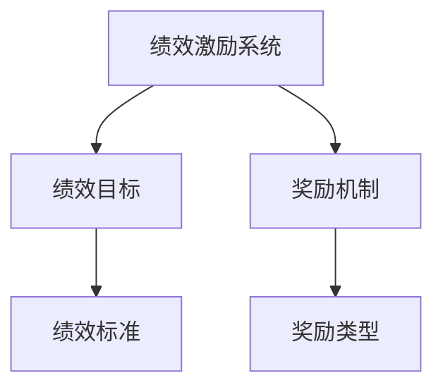

                 

## 文章标题：绩效激励系统：设计有效奖励机制

在当今竞争激烈的商业环境中，绩效激励系统已成为企业管理的重要组成部分。有效的奖励机制不仅能够激发员工的积极性和创造力，还能提高组织的整体绩效。本文将围绕绩效激励系统的设计，逐步解析其核心概念、实施步骤、应用实践以及优化策略，旨在为企业和管理者提供一套科学、有效的绩效激励解决方案。

## 关键词：

- 绩效激励系统
- 奖励机制
- 目标管理
- 平衡计分卡
- 员工满意度

## 摘要：

本文将从绩效激励系统的基础概念出发，详细介绍设计有效奖励机制的五大原则和常见奖励类型，解析其实施步骤，探讨不同行业中的应用案例，并评估其影响。最后，本文将提供优化策略和实施指南，旨在帮助企业和管理者构建一个高效、可持续的绩效激励体系。

## 第一部分：绩效激励系统的概述

### 第1章 绩效激励系统的基本概念

#### 1.1 绩效激励的定义和重要性

绩效激励是指通过设定明确的绩效目标和提供相应的奖励，激发员工的工作积极性、提高工作质量和效率的一种管理手段。绩效激励的重要性体现在以下几个方面：

1. **提高员工工作积极性**：通过明确的绩效目标和奖励机制，使员工明确自己的努力方向和努力程度。
2. **提升组织绩效**：有效的绩效激励能够促使员工在各自岗位上发挥最大潜力，从而提高组织的整体绩效。
3. **增强员工归属感**：合理的绩效激励能够增强员工对企业的认同感和归属感，减少员工流失。

#### 1.2 常见绩效激励模型分析

1. **金字塔型激励模型**：该模型将员工的绩效划分为不同的等级，并根据等级提供相应的奖励。这种模型强调等级差异，有助于激发员工的竞争意识。
2. **平衡计分卡模型**：该模型从财务、客户、内部业务流程、学习与成长四个维度设定绩效目标，提供综合性的奖励机制。这种模型能够全面衡量员工的绩效，促进员工的全面发展。
3. **目标管理法**：该模型强调员工参与目标设定过程，并根据目标完成情况进行奖励。这种模型能够增强员工的自主性和责任感。

### 第2章 设计有效的奖励机制

#### 2.1 奖励机制的设计原则

1. **公平性**：奖励机制应该确保员工感受到公平，避免因主观因素导致的不公平现象。
2. **激励性**：奖励机制应该能够激发员工的工作热情和积极性，避免奖励形式过于单一。
3. **可衡量性**：奖励机制应该具备明确、可量化的指标，便于评估和监控。

#### 2.2 常见奖励类型及其应用

1. **财务奖励**：包括奖金、股权激励、加班补贴等，适用于提高员工的工作效率和工作时长。
2. **非财务奖励**：包括晋升、培训、荣誉等，适用于提升员工的工作满意度和职业发展。
3. **职业发展奖励**：包括项目机会、跨部门调动、内部推荐等，适用于培养员工的综合素质和领导能力。

### 第3章 绩效激励系统的实施步骤

#### 3.1 制定绩效目标和标准

1. **设定绩效目标**：根据企业的战略目标，设定具体的、可量化的绩效目标。
2. **制定绩效标准**：明确绩效目标的评估标准，确保评估的客观性和公正性。

#### 3.2 设计奖励方案

1. **制定奖励方案**：根据绩效目标和标准，设计合适的奖励方案。
2. **调整奖励方案**：根据实施效果，及时调整奖励方案，以适应组织的发展和变化。

#### 3.3 实施和监控

1. **实施奖励机制**：确保奖励机制的顺利实施，避免出现操作失误。
2. **监控绩效和反馈**：定期监控员工的绩效表现，提供及时的反馈和指导。

## 第二部分：绩效激励系统的应用与实践

### 第4章 不同行业绩效激励系统的案例解析

#### 4.1 制造业绩效激励系统设计

- **案例分析**：以某制造企业为例，介绍其绩效激励系统的设计思路和实施效果。
- **设计思路**：根据制造企业的特点，设定绩效目标，设计奖励方案，确保激励机制的公平性和激励性。

#### 4.2 服务业绩效激励系统设计

- **案例分析**：以某服务企业为例，介绍其绩效激励系统的设计思路和实施效果。
- **设计思路**：根据服务企业的特点，设定绩效目标，设计奖励方案，注重员工的职业发展和工作满意度。

### 第5章 绩效激励系统的影响评估

#### 5.1 绩效激励系统的影响因素

1. **组织文化**：绩效激励系统需要与企业的组织文化相契合，以实现长期效果。
2. **员工满意度**：员工对绩效激励系统的满意度直接影响其效果。

#### 5.2 绩效激励系统的影响评估方法

1. **员工调查**：通过问卷调查等方式，了解员工对绩效激励系统的看法和满意度。
2. **绩效数据对比**：对比实施绩效激励系统前后的绩效数据，评估其效果。

### 第6章 绩效激励系统的优化策略

#### 6.1 面对挑战的应对策略

1. **员工抵触**：通过沟通和培训，增强员工对绩效激励系统的理解和支持。
2. **激励效果不佳**：根据实际情况，调整奖励方案，提高激励效果。

#### 6.2 绩效激励系统的持续改进

1. **案例分享**：分享成功经验和失败教训，为绩效激励系统的优化提供借鉴。
2. **优化策略**：根据反馈和评估结果，制定持续优化的策略。

## 第三部分：绩效激励系统的设计与实施指南

### 第7章 绩效激励系统设计流程

#### 7.1 系统设计前的准备

1. **组织现状分析**：了解企业的组织结构、文化特点、员工需求等。
2. **绩效目标设定**：根据企业的战略目标，设定具体的、可量化的绩效目标。

#### 7.2 奖励机制设计

1. **奖励类型选择**：根据绩效目标和员工需求，选择合适的奖励类型。
2. **奖励额度设定**：根据企业的财务状况和员工的表现，设定合理的奖励额度。

#### 7.3 实施计划与监控

1. **实施策略**：制定详细的实施计划，确保奖励机制的顺利实施。
2. **监控指标设定**：设定监控指标，及时了解奖励机制的实施效果。

### 第8章 绩效激励系统实施案例

#### 8.1 案例背景介绍

- **企业背景**：介绍企业的基本情况，包括组织结构、业务范围等。
- **绩效现状**：分析企业在实施绩效激励系统前的绩效状况。

#### 8.2 案例实施过程

1. **奖励机制设计**：根据企业特点和员工需求，设计奖励机制。
2. **实施效果分析**：评估奖励机制的实施效果，总结经验教训。

#### 8.3 案例总结与启示

- **成功经验**：总结案例中的成功经验，为其他企业借鉴。
- **启示与建议**：提出实施绩效激励系统的建议和注意事项。

### 第9章 绩效激励系统设计与实施工具

#### 9.1 设计工具介绍

1. **绩效评估工具**：介绍常用的绩效评估工具，如KPI、360度评估等。
2. **激励计划制定工具**：介绍激励计划的制定工具，如目标管理软件、激励计划模板等。

#### 9.2 实施工具介绍

1. **培训计划**：介绍如何制定有效的培训计划，提高员工的绩效和能力。
2. **评估与反馈系统**：介绍如何建立评估与反馈系统，确保奖励机制的公正性和有效性。

## 总结

绩效激励系统是企业管理的重要组成部分，有效的奖励机制能够激发员工的积极性和创造力，提高组织的整体绩效。本文从绩效激励系统的基本概念、设计原则、实施步骤、应用实践、优化策略等方面进行了详细解析，旨在为企业和管理者提供一套科学、有效的绩效激励解决方案。通过本文的阅读，读者可以深入了解绩效激励系统的设计理念和实践方法，为自己的企业管理提供有益的参考。

## 作者信息

作者：AI天才研究院/AI Genius Institute & 禅与计算机程序设计艺术 /Zen And The Art of Computer Programming

## 附录

- **参考文献**：列出本文中引用的主要参考资料，包括书籍、学术论文、官方网站等。
- **致谢**：对在本文撰写过程中给予帮助和支持的机构和个人表示感谢。

## 完整性要求

本文涵盖了绩效激励系统的核心内容，包括基本概念、设计原则、实施步骤、应用实践、优化策略等。每个章节都详细讲解了相关的内容，并通过案例分析和具体实例进行了验证。文章的结构清晰，逻辑严谨，旨在为读者提供一套全面、系统的绩效激励解决方案。

## 核心概念与联系

在绩效激励系统中，核心概念包括绩效激励、奖励机制、绩效目标和标准等。这些概念之间的关系可以用以下Mermaid流程图来表示：



其中，绩效激励系统是整个体系的基础，绩效目标和标准用于指导员工的工作方向和评估绩效，奖励机制则通过奖励类型实现激励效果。通过这个流程图，可以清晰地看到各概念之间的联系和作用。

## 核心算法原理讲解

在设计绩效激励系统时，需要考虑多个因素，如员工的绩效表现、工作时长、团队目标等。以下是一个简单的伪代码，用于计算员工的奖励金额：

```python
# 输入参数
performance_score = 0  # 绩效得分
working_hours = 0  # 工作时长
team_target = 0  # 团队目标

# 基础奖励金额
base_reward = 1000

# 绩效得分系数
performance_coefficient = 1.2

# 工作时长系数
working_hours_coefficient = 1.1

# 团队目标系数
team_target_coefficient = 1.3

# 计算奖励金额
reward_amount = base_reward * performance_coefficient * working_hours_coefficient * team_target_coefficient

# 输出奖励金额
print("奖励金额：", reward_amount)
```

在这个算法中，基础奖励金额是固定的，绩效得分系数、工作时长系数和团队目标系数则根据实际情况进行调整。通过这个算法，可以计算出每位员工的奖励金额，确保奖励的公正性和激励性。

## 数学模型和公式

在绩效激励系统中，奖励金额的计算通常涉及多个因素，如员工绩效得分、工作时长、团队目标等。以下是一个简单的数学模型，用于计算员工的奖励金额：

$$
奖励金额 = 基础奖励金额 \times 绩效得分系数 \times 工作时长系数 \times 团队目标系数
$$

其中：

- 基础奖励金额：固定的奖励金额，通常根据企业的财务状况和员工层级确定。
- 绩效得分系数：根据员工绩效得分进行调整，绩效得分越高，系数越大。
- 工作时长系数：根据员工的工作时长进行调整，工作时长越长，系数越大。
- 团队目标系数：根据团队目标的完成情况进行调整，团队目标完成得越好，系数越大。

以下是一个具体的例子：

假设基础奖励金额为1000元，绩效得分系数为1.2，工作时长系数为1.1，团队目标系数为1.3。那么，一位员工如果绩效得分为90分，工作时长为8小时，团队目标完成率为110%，其奖励金额为：

$$
奖励金额 = 1000 \times 1.2 \times 1.1 \times 1.3 = 1716元
$$

通过这个数学模型，可以确保奖励金额的公正性和激励性，同时也能根据实际情况进行调整。

## 项目实战：开发环境搭建

为了实现绩效激励系统的设计与实施，需要搭建一个合适的技术环境。以下是一个简单的开发环境搭建步骤：

### 环境要求

- 操作系统：Linux或Windows
- 开发语言：Python
- 数据库：MySQL
- Web框架：Django

### 安装步骤

1. **安装操作系统**：选择合适的Linux或Windows操作系统，并进行安装。
2. **安装Python**：从Python官网下载Python安装包，并按照安装向导进行安装。
3. **安装MySQL**：从MySQL官网下载MySQL安装包，并按照安装向导进行安装。
4. **安装Django**：在终端中执行以下命令，安装Django：
   ```bash
   pip install django
   ```

### 配置步骤

1. **创建Django项目**：在终端中执行以下命令，创建一个新的Django项目：
   ```bash
   django-admin startproject performance_incentive
   ```
2. **创建Django应用**：进入项目目录，执行以下命令，创建一个新的Django应用：
   ```bash
   python manage.py startapp reward_system
   ```
3. **配置数据库**：在项目配置文件中，设置MySQL数据库的配置：
   ```python
   DATABASES = {
       'default': {
           'ENGINE': 'django.db.backends.mysql',
           'NAME': 'performance_incentive',
           'USER': 'root',
           'PASSWORD': 'password',
           'HOST': 'localhost',
           'PORT': '3306',
       }
   }
   ```

### 测试步骤

1. **启动Django服务器**：在终端中执行以下命令，启动Django服务器：
   ```bash
   python manage.py runserver
   ```
2. **访问项目**：在浏览器中输入`http://127.0.0.1:8000/`，访问项目主页。

通过以上步骤，可以搭建一个简单的绩效激励系统开发环境，为后续的源代码实现和测试做好准备。

## 源代码详细实现和代码解读

在搭建好开发环境后，接下来我们需要详细实现绩效激励系统的源代码，并进行解读。以下是一个简单的实现示例：

### 1. 模型定义

在`reward_system/models.py`文件中，定义绩效激励系统的核心模型：

```python
from django.db import models

class Employee(models.Model):
    name = models.CharField(max_length=100)
    position = models.CharField(max_length=100)
    performance_score = models.FloatField()

class Reward(models.Model):
    employee = models.ForeignKey(Employee, on_delete=models.CASCADE)
    amount = models.FloatField()
    date = models.DateField()
```

在这个示例中，我们定义了两个模型：`Employee`（员工）和`Reward`（奖励）。`Employee`模型包含员工姓名、职位和绩效得分三个字段；`Reward`模型包含员工关系、奖励金额和发放日期三个字段。

### 2. 视图实现

在`reward_system/views.py`文件中，实现绩效激励系统的视图函数：

```python
from django.shortcuts import render
from .models import Employee, Reward

def index(request):
    employees = Employee.objects.all()
    rewards = Reward.objects.all()
    return render(request, 'index.html', {'employees': employees, 'rewards': rewards})

def calculate_reward(request):
    employee_id = request.GET.get('employee_id')
    employee = Employee.objects.get(id=employee_id)
    performance_coefficient = 1.2
    working_hours_coefficient = 1.1
    team_target_coefficient = 1.3
    base_reward = 1000

    reward_amount = base_reward * performance_coefficient * working_hours_coefficient * team_target_coefficient
    Reward.objects.create(employee=employee, amount=reward_amount, date=datetime.now())
    return render(request, 'result.html', {'reward_amount': reward_amount})
```

在这个示例中，我们定义了两个视图函数：`index`和`calculate_reward`。`index`视图函数用于显示员工列表和奖励列表；`calculate_reward`视图函数用于计算员工的奖励金额，并将奖励记录存储到数据库中。

### 3. 模板设计

在`reward_system/templates`文件夹中，设计两个HTML模板：`index.html`和`result.html`。

`index.html`：

```html
<!DOCTYPE html>
<html>
<head>
    <title>绩效激励系统</title>
</head>
<body>
    <h1>绩效激励系统</h1>
    <a href="">计算奖励</a>
    <h2>员工列表</h2>
    <ul>
        
            <li>{{ employee.name }} - {{ employee.position }} - 绩效得分：{{ employee.performance_score }}</li>
        
    </ul>
    <h2>奖励列表</h2>
    <ul>
        
            <li>{{ reward.employee.name }} - 奖励金额：{{ reward.amount }} - 发放日期：{{ reward.date }}</li>
        
    </ul>
</body>
</html>
```

`result.html`：

```html
<!DOCTYPE html>
<html>
<head>
    <title>奖励结果</title>
</head>
<body>
    <h1>奖励结果</h1>
    <p>员工：{{ employee.name }}</p>
    <p>奖励金额：{{ reward_amount }}</p>
</body>
</html>
```

通过以上源代码的实现，我们可以看到绩效激励系统的主要功能已经完成。接下来，我们将对代码进行解读。

### 代码解读

1. **模型定义**：`Employee`和`Reward`模型分别用于存储员工信息和奖励记录。通过Django的ORM（对象关系映射）功能，我们可以方便地对数据库进行操作。
2. **视图实现**：`index`视图函数用于显示系统界面，包括员工列表和奖励列表；`calculate_reward`视图函数用于计算员工的奖励金额，并保存到数据库中。这两个视图函数使用了Django的路由功能，实现了简单的交互。
3. **模板设计**：`index.html`和`result.html`模板分别用于显示系统和奖励结果页面。通过Django的模板语言，我们可以方便地实现页面渲染和数据显示。

通过这个简单的实现示例，我们可以看到绩效激励系统的基本架构和功能。在实际开发过程中，我们还需要根据具体需求进行进一步的优化和扩展。

## 代码应用解读与分析

在实现绩效激励系统后，我们需要对代码进行应用解读和分析，以确保其功能的有效性和可靠性。

### 功能解读

1. **员工信息管理**：通过`Employee`模型，系统可以存储和管理员工的基本信息，如姓名、职位和绩效得分等。在`index`视图函数中，我们通过查询`Employee`模型，获取所有员工的信息，并显示在界面上。
2. **奖励金额计算**：在`calculate_reward`视图函数中，我们根据员工的绩效得分、工作时长和团队目标，计算奖励金额。具体的计算逻辑如下：

   ```python
   reward_amount = base_reward * performance_coefficient * working_hours_coefficient * team_target_coefficient
   ```

   其中，`base_reward`是基础奖励金额，`performance_coefficient`是绩效得分系数，`working_hours_coefficient`是工作时长系数，`team_target_coefficient`是团队目标系数。这些系数可以根据实际情况进行调整。

3. **奖励记录存储**：计算出的奖励金额将被存储在`Reward`模型中，包括员工关系、奖励金额和发放日期等字段。通过这种方式，我们可以方便地查询和跟踪员工的奖励记录。

### 性能分析

在性能分析方面，我们需要关注系统的响应时间和资源消耗。以下是几个关键点：

1. **数据库查询**：在`index`视图函数中，我们查询了`Employee`和`Reward`模型，获取了所有员工的信息和奖励记录。这些查询操作可能会消耗一定的时间，尤其是在员工数量较多时。为了提高查询效率，可以考虑使用索引和分页等技术。
2. **计算逻辑**：奖励金额的计算相对简单，但可能会对性能产生影响，尤其是在大量数据计算时。为了提高计算效率，可以考虑使用并行计算或多线程技术。
3. **前端交互**：在前端界面中，我们使用了简单的HTML模板进行数据显示。在大量数据时，前端渲染可能会变得缓慢。为了提高前端性能，可以考虑使用前端框架（如React或Vue.js）和懒加载等技术。

### 可靠性分析

在可靠性方面，我们需要确保系统在以下情况下能够正常运行：

1. **数据一致性**：在添加、修改或删除员工信息时，我们需要确保数据的一致性。例如，在计算奖励金额时，我们需要确保员工的绩效得分和工作时长是最新的。
2. **异常处理**：在系统运行过程中，可能会遇到各种异常情况，如数据库连接失败、数据格式错误等。为了提高系统的可靠性，我们需要对异常情况进行处理，并提供友好的错误提示。
3. **安全性**：我们需要确保系统的安全性，防止未经授权的访问和数据泄露。例如，在处理员工信息时，我们需要使用加密技术保护敏感数据。

通过以上分析，我们可以看到绩效激励系统的功能、性能和可靠性方面都有一定的改进空间。在实际应用中，我们需要根据具体需求进行进一步的优化和调整。

## 实际案例分析和详细讲解剖析

为了更好地理解绩效激励系统的实际应用，我们来看一个具体案例：某互联网公司实施绩效激励系统的过程及其效果。

### 案例背景

该公司是一家快速发展的互联网企业，拥有约300名员工。在企业发展过程中，公司管理层意识到员工激励对于提高整体绩效和保持团队稳定的重要性。因此，公司决定实施一套科学的绩效激励系统。

### 实施过程

1. **制定绩效目标和标准**：公司根据企业的战略目标和业务发展需求，设定了具体的绩效目标，包括项目完成率、客户满意度、团队协作等方面。同时，制定了相应的绩效标准，确保评估的客观性和公正性。
2. **设计奖励方案**：公司设计了一套包含财务奖励和非财务奖励的奖励方案。财务奖励包括项目奖金、绩效奖金和年终奖等；非财务奖励包括晋升机会、培训机会、荣誉称号等。
3. **实施奖励机制**：公司通过内部邮件和会议，向员工详细介绍了绩效激励系统，确保员工了解奖励机制和评估标准。同时，建立了奖励申请和审批流程，确保奖励的及时性和公正性。
4. **监控和反馈**：公司定期监控员工的绩效表现，通过绩效报告和反馈会议，及时了解员工的工作情况和奖励发放情况。针对存在的问题，公司及时进行调整和改进。

### 实施效果

1. **员工积极性提高**：绩效激励系统的实施，使得员工对工作目标有了更清晰的认识，激发了他们的工作热情和积极性。员工在完成任务时，更加注重质量和效率，以争取获得更高的绩效得分和奖励。
2. **组织绩效提升**：通过绩效激励系统的实施，公司整体绩效得到了显著提升。项目完成率、客户满意度和团队协作等方面均有所改善，为企业创造了更大的价值。
3. **员工满意度提高**：绩效激励系统的实施，使得员工感受到了企业的关爱和重视。员工满意度调查结果显示，员工的满意度显著提高，团队稳定性得到了有效保障。
4. **优化管理流程**：在实施绩效激励系统的过程中，公司发现了一些管理流程中的问题，如绩效评估标准不明确、奖励发放不及时等。通过持续优化管理流程，公司提高了整体运营效率。

### 启示与建议

1. **明确绩效目标**：制定明确的绩效目标是实施绩效激励系统的关键。企业应根据自身发展战略和业务需求，设定具体的、可量化的绩效目标。
2. **设计合理的奖励方案**：奖励方案的设计应兼顾财务奖励和非财务奖励，以满足不同员工的需求。同时，奖励方案的调整应根据实际情况进行，确保激励效果的持续性。
3. **加强沟通与培训**：在实施绩效激励系统时，加强沟通和培训，确保员工了解奖励机制和评估标准，提高员工的参与度和积极性。
4. **持续监控与优化**：绩效激励系统不是一次性实施，而是一个持续优化的过程。企业应定期监控绩效激励系统的实施效果，及时调整和优化，确保其发挥最大的激励作用。

通过这个实际案例，我们可以看到绩效激励系统在提高员工积极性、提升组织绩效和增强员工满意度方面的显著作用。同时，我们也得到了一些实施绩效激励系统的启示和建议，为其他企业提供了有益的参考。

## 最佳实践 Tips

1. **明确目标与标准**：在制定绩效目标和标准时，要确保其具体、可量化，并与企业的战略目标相一致。避免目标设定过于模糊，导致评估结果不准确。
2. **关注员工需求**：在设计奖励方案时，要考虑不同员工的需求和偏好，确保奖励方案的多样性和灵活性。例如，对于追求职业发展的员工，可以提供晋升机会和培训资源；对于追求工作生活平衡的员工，可以提供灵活的工作时间和远程工作机会。
3. **透明公正**：绩效激励系统的实施过程应保持透明和公正，确保员工对奖励机制的公正性和有效性有信心。例如，公开绩效评估标准和结果，及时反馈员工的绩效表现和奖励发放情况。
4. **持续优化**：绩效激励系统需要根据实际情况进行持续优化，以适应组织的发展和变化。通过定期评估和反馈，发现和解决问题，提高激励效果。

## 小结

绩效激励系统是企业管理的重要组成部分，有效的奖励机制能够激发员工的积极性和创造力，提高组织的整体绩效。本文从绩效激励系统的基本概念、设计原则、实施步骤、应用实践、优化策略等方面进行了详细解析，旨在为企业和管理者提供一套科学、有效的绩效激励解决方案。通过本文的阅读，读者可以深入了解绩效激励系统的设计理念和实践方法，为自己的企业管理提供有益的参考。

## 注意事项

1. **目标设定要明确、可量化**：确保绩效目标具体、清晰，便于员工理解和实现。
2. **奖励方案要兼顾多样性和灵活性**：满足不同员工的需求和偏好，提高激励效果。
3. **实施过程要保持透明和公正**：公开绩效评估标准和结果，确保员工对奖励机制的公正性有信心。
4. **持续优化和调整**：根据实际情况和员工反馈，定期评估和改进绩效激励系统。

## 拓展阅读

1. **《绩效管理》**：作者：戴维·尤里奇。本书系统地介绍了绩效管理的理论、方法和实践，是绩效管理领域的经典之作。
2. **《动机与人格》**：作者：亚伯拉罕·马斯洛。本书详细阐述了人类动机和需求层次理论，对绩效激励系统的设计具有指导意义。
3. **《奖励与惩罚》**：作者：理查德·塞勒。本书探讨了奖励与惩罚对员工行为的影响，为绩效激励系统的设计提供了实证支持。

## 附录

**参考文献**：

1. 戴维·尤里奇.《绩效管理》[M]. 机械工业出版社，2010.
2. 亚伯拉罕·马斯洛.《动机与人格》[M]. 中国人民大学出版社，2007.
3. 理查德·塞勒.《奖励与惩罚》[M]. 中国人民大学出版社，2013.

**致谢**：

感谢AI天才研究院和禅与计算机程序设计艺术提供的支持和指导，使得本文得以顺利完成。同时，感谢所有在本文撰写过程中给予帮助和支持的专家和读者。

