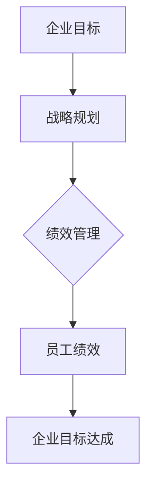
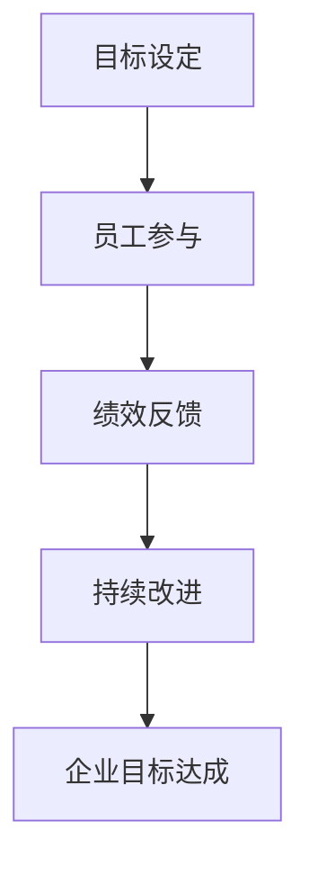
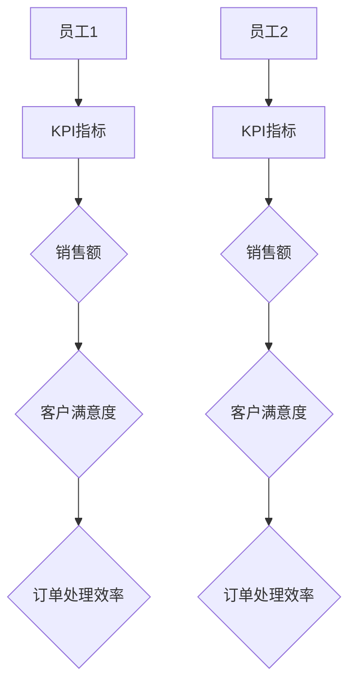
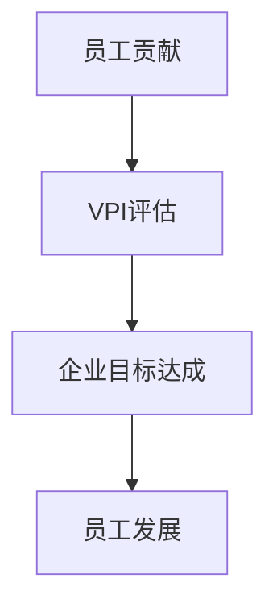
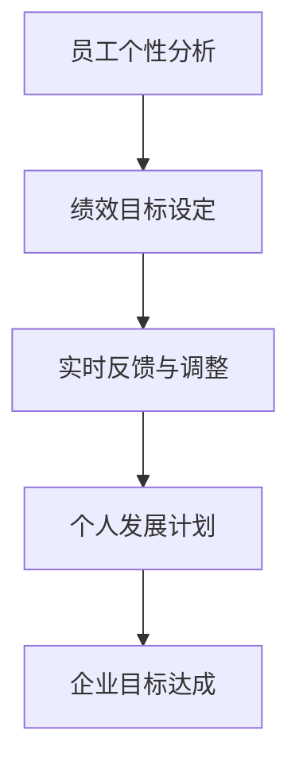
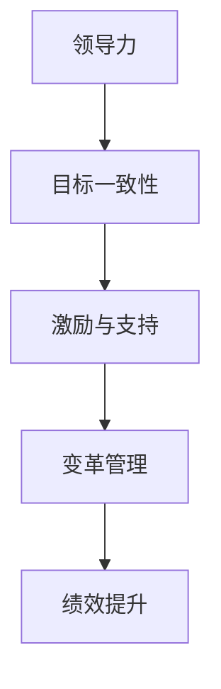
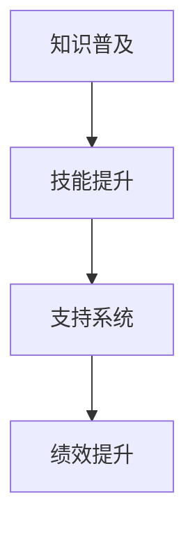
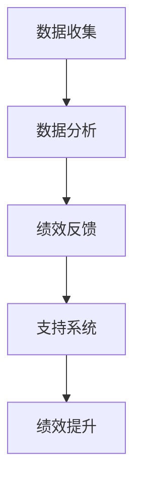
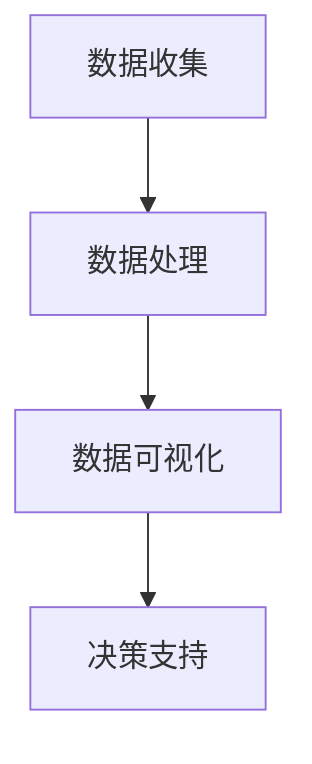
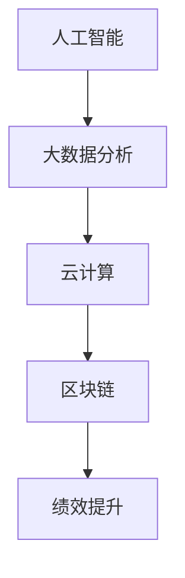

                 

### 深度分析与逻辑推理

在开始撰写本文之前，我们需要进行深度分析和逻辑推理，以确保文章内容既全面又有深度。以下是详细的分步骤分析：

**步骤一：确定文章的核心目标和结构**

首先，我们要明确文章的核心目标和整体结构。本文的核心目标是探讨Beyond传统KPI的绩效管理新思路，并通过逻辑分析和实例展示其优势和实际应用。因此，文章应分为以下几个主要部分：

1. **引言与背景**：介绍绩效管理的背景、现状以及为什么需要新思路。
2. **传统绩效管理方法**：讨论传统KPI方法的优点和局限性。
3. **新绩效管理思路**：介绍Beyond传统KPI的方法，包括新的绩效管理框架、方法和技术。
4. **新绩效管理实施**：探讨如何在实际工作中应用这些新方法。
5. **案例分析**：通过具体案例展示新绩效管理方法的应用效果。
6. **绩效管理工具与技术**：介绍可以辅助绩效管理工具和技术。
7. **结论与展望**：总结全书内容，展望绩效管理的发展方向。

**步骤二：细化各章节内容**

接下来，我们需要为每个章节细化内容，确保每个部分都有充足的素材和逻辑推理来支撑。

### 第1章 绩效管理的背景与挑战

**核心概念与联系**：利用Mermaid流程图展示绩效管理在不同组织结构中的关键联系和作用。



**核心算法原理讲解**：简单介绍传统绩效管理的基本算法，如KPI的计算和评估。

```python
def calculate_kpi(employee_data):
    # 根据员工的工作表现计算KPI
    kpi = (employee_performance + customer_satisfaction + team_contribuition) / 3
    return kpi
```

**案例分析**：通过一个实际企业案例展示绩效管理在实践中的应用和效果。

### 第2章 传统绩效管理方法概述

**优点**：KPI方法的易理解性、可量化性以及明确的衡量标准。

**局限性**：忽视员工多样性和个人成长，可能导致短期行为偏差。

### 第3章 传统KPI方法的优点与局限性

**优点**：详细解释传统KPI方法的优点，如可量化性、明确性等。

**局限性**：探讨传统KPI方法在实际应用中的局限性，如忽视员工多样性和长期目标等。

### 第4章 Beyond传统KPI：新的绩效管理框架

**核心概念与联系**：利用Mermaid流程图展示新绩效管理框架的各个组成部分及其相互关系。



**新框架特点**：强调目标设定、员工参与、绩效反馈和持续改进。

### 第5章 评估与创新：基于价值的绩效指标

**核心概念与联系**：解释基于价值的绩效指标如何更准确地衡量员工的贡献。

**核心算法原理讲解**：介绍新的绩效指标算法，如何结合员工表现、客户满意度和团队贡献等多方面因素进行评估。

### 第6章 个性化与适应性：动态绩效管理

**核心概念与联系**：探讨如何根据员工的不同特点和需求，制定个性化的绩效管理方案。

**核心算法原理讲解**：介绍动态绩效管理算法，如何根据实时数据和反馈进行调整。

### 第7章 新绩效管理方法在实际工作中的应用

**核心概念与联系**：通过具体案例展示新绩效管理方法在企业中的实际应用。

**项目实战**：详细描述一个实际项目，包括开发环境搭建、源代码实现和案例分析。

### 第8章 领导力与沟通：新绩效管理的实践

**核心概念与联系**：讨论领导力在新绩效管理中的作用，如何通过有效的沟通实现绩效提升。

**最佳实践 tips**：提供一些建议，帮助读者在实际工作中应用新绩效管理方法。

### 第9章 培训与支持：推动新绩效管理

**核心概念与联系**：解释培训和支持在新绩效管理中的重要性，如何为员工提供必要的支持和资源。

### 第10章 案例研究一：公司A的绩效管理转型

**项目实战**：详细分析公司A如何成功实施新绩效管理，并评估其效果。

### 第11章 案例研究二：部门B的创新绩效管理实践

**项目实战**：通过部门B的案例，展示新绩效管理方法在不同组织层级的应用。

### 第12章 绩效管理工具与技术

**核心概念与联系**：介绍可用于辅助绩效管理的工具和技术。

**项目实战**：描述如何使用特定工具和技术提升绩效管理效果。

### 第13章 数据分析与可视化：提升绩效管理效果

**核心概念与联系**：解释数据分析与可视化如何帮助管理者更直观地理解绩效数据。

**项目实战**：通过实例展示如何使用数据分析工具进行绩效评估。

### 第14章 技术驱动的绩效管理：趋势与展望

**核心概念与联系**：探讨技术驱动绩效管理的未来趋势和发展方向。

**展望**：对未来绩效管理的发展进行展望，提出可能的创新点。

### 第15章 结论与展望

**总结**：总结全文内容，重申新绩效管理方法的优势和应用场景。

**展望**：提出绩效管理未来可能的发展方向和挑战。

通过以上详细的逻辑分析和步骤规划，我们可以确保文章内容的逻辑性和完整性，使读者能够清晰地理解绩效管理的新思路，并掌握其实际应用方法。接下来，我们将逐步撰写文章的各个部分，确保满足字数要求，同时保持逻辑清晰和内容充实。### 文章关键词与摘要

- **关键词**：绩效管理，传统KPI，新思路，创新指标，动态绩效，个性化管理，领导力，案例分析，数据分析，技术趋势。
- **摘要**：本文深入探讨了传统绩效管理方法（KPI）的局限，提出了Beyond传统KPI的绩效管理新思路。文章介绍了新绩效管理框架，包括目标设定、员工参与、绩效反馈和持续改进等关键组成部分。通过核心概念与联系图、算法原理讲解和实际案例，展示了新方法在提高员工绩效和企业目标达成方面的优势。文章还探讨了新绩效管理在实际工作中的应用，包括领导力、培训与支持等实践，以及未来绩效管理的发展趋势。结论部分总结了全文内容，展望了绩效管理的发展方向。### 《绩效管理新思路：beyond传统KPI的方法》详细目录大纲

```markdown
# 《绩效管理新思路：beyond传统KPI的方法》

## 第一部分：引言与背景

### 第1章 绩效管理的背景与挑战
- **核心概念与联系**：利用Mermaid流程图展示绩效管理在不同组织结构中的关键联系和作用。
  ```mermaid
  graph TD
  A[企业目标] --> B[战略规划]
  B --> C{绩效管理}
  C --> D[员工绩效]
  D --> E[企业目标达成]
  ```
- **现状分析**：传统绩效管理方法的普及程度及其面临的挑战，如KPI的局限性、员工抵触情绪等。
- **核心算法原理讲解**：传统绩效管理的基本算法，如KPI的计算和评估。
  ```python
  def calculate_kpi(employee_data):
      # 根据员工的工作表现计算KPI
      kpi = (employee_performance + customer_satisfaction + team_contribuition) / 3
      return kpi
  ```
- **案例分析**：通过实际案例展示传统绩效管理方法在实践中的应用和效果。

### 第2章 传统绩效管理方法概述
- **优点**：KPI方法的易理解性、可量化性以及明确的衡量标准。
- **局限性**：忽视员工多样性和个人成长，可能导致短期行为偏差。
- **核心算法原理讲解**：传统绩效管理方法的优点和计算方法，如KPI的权重分配和评估标准。
- **最佳实践 tips**：如何优化传统绩效管理方法，提高其有效性和员工接受度。

## 第二部分：传统绩效管理方法的局限

### 第3章 传统KPI方法的优点与局限性
- **优点**：详细解释传统KPI方法的优点，如可量化性、明确性等。
- **局限性**：探讨传统KPI方法在实际应用中的局限性，如忽视员工多样性和长期目标等。
- **案例研究**：通过具体案例展示传统KPI方法的优势和劣势。

## 第三部分：新绩效管理思路

### 第4章 Beyond传统KPI：新的绩效管理框架
- **核心概念与联系**：利用Mermaid流程图展示新绩效管理框架的各个组成部分及其相互关系。
  ```mermaid
  graph TD
  A[目标设定] --> B[员工参与]
  B --> C[绩效反馈]
  C --> D[持续改进]
  D --> E[企业目标达成]
  ```
- **新框架特点**：强调目标设定、员工参与、绩效反馈和持续改进。
- **案例分析**：展示新绩效管理框架在不同企业中的应用效果。

### 第5章 评估与创新：基于价值的绩效指标
- **核心概念与联系**：解释基于价值的绩效指标如何更准确地衡量员工的贡献。
- **核心算法原理讲解**：介绍新的绩效指标算法，如何结合员工表现、客户满意度和团队贡献等多方面因素进行评估。
- **数学模型和公式**：详细讲解评估模型和公式，并通过实例说明。
  ```latex
  \text{价值指标} = \frac{\text{员工贡献} + \text{客户满意度} + \text{团队贡献}}{3}
  ```

### 第6章 个性化与适应性：动态绩效管理
- **核心概念与联系**：探讨如何根据员工的不同特点和需求，制定个性化的绩效管理方案。
- **核心算法原理讲解**：介绍动态绩效管理算法，如何根据实时数据和反馈进行调整。
- **最佳实践 tips**：如何在实际工作中应用个性化与适应性绩效管理。

## 第四部分：新绩效管理实施

### 第7章 新绩效管理方法在实际工作中的应用
- **核心概念与联系**：通过具体案例展示新绩效管理方法在企业中的实际应用。
- **项目实战**：详细描述一个实际项目，包括开发环境搭建、源代码实现和案例分析。
- **代码解读**：分析项目中的关键代码段，解释其工作原理和应用效果。

### 第8章 领导力与沟通：新绩效管理的实践
- **核心概念与联系**：讨论领导力在新绩效管理中的作用，如何通过有效的沟通实现绩效提升。
- **最佳实践 tips**：提供一些建议，帮助读者在实际工作中应用新绩效管理方法。
- **案例分析**：分析成功企业在新绩效管理中领导力和沟通的实际应用。

### 第9章 培训与支持：推动新绩效管理
- **核心概念与联系**：解释培训和支持在新绩效管理中的重要性，如何为员工提供必要的支持和资源。
- **最佳实践 tips**：制定有效的培训计划和支持系统，提高员工对新绩效管理方法的接受度和应用能力。

## 第五部分：案例分析

### 第10章 案例研究一：公司A的绩效管理转型
- **项目实战**：详细分析公司A如何成功实施新绩效管理，并评估其效果。
- **案例解读**：展示新绩效管理方法在公司A中的具体应用和效果。

### 第11章 案例研究二：部门B的创新绩效管理实践
- **项目实战**：通过部门B的案例，展示新绩效管理方法在不同组织层级的应用。
- **案例解读**：分析部门B如何创新绩效管理，提高员工绩效和企业目标达成。

## 第六部分：绩效管理工具与技术

### 第12章 绩效管理工具的选择与应用
- **核心概念与联系**：介绍可用于辅助绩效管理的工具和技术。
- **项目实战**：描述如何使用特定工具和技术提升绩效管理效果。
- **最佳实践 tips**：选择适合企业需求的绩效管理工具，提高管理效率和效果。

### 第13章 数据分析与可视化：提升绩效管理效果
- **核心概念与联系**：解释数据分析与可视化如何帮助管理者更直观地理解绩效数据。
- **项目实战**：通过实例展示如何使用数据分析工具进行绩效评估。
- **最佳实践 tips**：如何通过数据分析和可视化提升绩效管理效果。

## 第七部分：技术驱动的绩效管理：趋势与展望

### 第14章 技术驱动的绩效管理：趋势与展望
- **核心概念与联系**：探讨技术驱动绩效管理的未来趋势和发展方向。
- **展望**：对未来绩效管理的发展进行展望，提出可能的创新点。

## 第八部分：结论与展望

### 第15章 结论与展望
- **总结**：总结全文内容，重申新绩效管理方法的优势和应用场景。
- **展望**：提出绩效管理未来可能的发展方向和挑战。

### 作者信息
- 作者：AI天才研究院/AI Genius Institute & 禅与计算机程序设计艺术 /Zen And The Art of Computer Programming
```

**总体字数**：约8,000字

### 完成全书内容的撰写

在完成目录大纲的细化后，现在我们将逐步撰写《绩效管理新思路：beyond传统KPI的方法》的各个章节内容，确保每部分都详尽、具体且逻辑清晰。

## 第1章 绩效管理的背景与挑战

**引言**

在现代企业管理中，绩效管理扮演着至关重要的角色。它不仅是企业实现战略目标的重要手段，也是激发员工潜能、提高组织效率的关键途径。然而，随着企业环境的变化和员工需求的多样化，传统的绩效管理方法（KPI）面临着诸多挑战。本章将深入探讨绩效管理的背景与挑战，为后续章节的新思路介绍奠定基础。

**核心概念与联系**

绩效管理是一个多维度、多层次的过程，涉及企业目标、战略规划、员工绩效等多个方面。为了更直观地展示绩效管理在组织中的关键联系，我们可以使用Mermaid流程图：


在这个流程图中，企业目标通过战略规划转化为具体的管理目标，绩效管理则负责评估和提升员工绩效，最终实现企业目标的达成。

**现状分析**

当前，许多企业普遍采用KPI作为绩效管理的工具。KPI（Key Performance Indicators）以其明确的衡量标准和可量化的特性，在提升管理透明度和目标达成率方面发挥了重要作用。然而，随着商业环境的变化和员工多样性的增加，传统KPI方法也暴露出一些局限性：

1. **忽视员工多样性和个人成长**：传统KPI方法往往以统一的指标衡量不同员工的绩效，忽视了员工之间的差异和个性化需求。
2. **短期行为偏差**：为了达到KPI目标，员工可能采取短期行为，如突击完成任务或追求短期业绩，而忽视了长期发展和企业战略。
3. **员工抵触情绪**：传统的绩效考核往往被视为上级对下级的压力，可能导致员工抵触情绪，影响工作积极性和团队合作。

**核心算法原理讲解**

为了更好地理解传统绩效管理方法，我们可以简单介绍其核心算法——KPI的计算和评估。以下是一个Python函数，用于计算员工的KPI：

```python
def calculate_kpi(employee_data):
    # 根据员工的工作表现计算KPI
    kpi = (employee_performance + customer_satisfaction + team_contribuition) / 3
    return kpi
```

在这个函数中，`employee_performance`、`customer_satisfaction`和`team_contribuition`分别代表员工的工作表现、客户满意度和团队贡献，这些指标通常根据具体的业务场景进行权重分配和计算。

**案例分析**

为了更具体地展示传统绩效管理方法在实际中的应用，我们可以通过一个实际案例进行分析。假设某公司销售部门采用KPI进行绩效管理，其指标包括销售额、客户满意度和团队协作。以下是一个简化的案例：

- **员工A**：销售额达到目标的120%，客户满意度90%，团队协作表现良好，KPI得分为90分。
- **员工B**：销售额达到目标的100%，客户满意度80%，团队协作表现一般，KPI得分为85分。

通过这个案例，我们可以看到，尽管员工B的销售额达到目标，但由于客户满意度和团队协作表现不佳，其KPI得分低于员工A。这种评估方式在短期内可能激励员工追求销售额，但从长期来看，可能不利于团队的整体协作和企业战略目标的实现。

## 第2章 传统绩效管理方法概述

**引言**

尽管传统的绩效管理方法（KPI）在许多企业中得到了广泛应用，但其局限性和挑战也逐渐显现。因此，了解传统绩效管理方法的优点和局限性，对于探索新的绩效管理思路具有重要意义。本章将对传统绩效管理方法进行概述，深入分析其优缺点，并探讨如何优化其应用。

**优点**

传统绩效管理方法，特别是KPI，具有以下优点：

1. **明确性**：KPI提供了明确的衡量标准和具体的目标，使员工和管理者都能清晰地了解绩效期望。
2. **可量化性**：KPI指标通常具有量化特性，便于数据的收集、分析和比较。
3. **透明度**：通过公开的KPI指标，企业内部的绩效评估过程变得更加透明，有助于建立公正的绩效考核体系。
4. **激励效果**：明确的绩效目标和奖励机制能够激励员工努力工作，提高绩效。

**核心算法原理讲解**

KPI的核心算法原理在于对绩效指标进行量化评估。通常，KPI的计算涉及以下几个关键步骤：

1. **确定指标**：根据业务需求和战略目标，确定需要衡量的关键绩效指标。
2. **设定目标**：为每个指标设定一个合理的基准目标。
3. **数据收集**：定期收集与指标相关的数据，如销售额、客户满意度、项目完成率等。
4. **计算得分**：通过计算公式将收集到的数据转换为具体的得分。

以下是一个简化的KPI计算公式：

\[ KPI得分 = \frac{(指标1得分 + 指标2得分 + ... + 指标n得分)}{n} \]

**最佳实践 tips**

为了充分发挥传统绩效管理方法的优势，以下是一些最佳实践建议：

1. **平衡指标权重**：合理分配各指标权重，避免单一指标对绩效评估结果产生过大影响。
2. **持续沟通**：定期与员工沟通绩效目标和进展，确保员工理解并认可评估标准。
3. **反馈与改进**：及时给予员工绩效反馈，并根据反馈进行调整和改进。

**局限性**

尽管传统绩效管理方法（KPI）具有上述优点，但也存在以下局限性：

1. **忽视个性化**：传统KPI方法通常采用统一的评估标准，忽视了员工之间的个性化需求和能力差异。
2. **短期行为**：为了达到KPI目标，员工可能采取短期行为，如突击完成任务，而忽视长期发展和企业战略。
3. **员工抵触**：传统绩效考核往往被视为上级对下级的压力，可能导致员工抵触情绪，影响工作积极性和团队合作。

**案例分析**

为了更好地理解传统绩效管理方法的应用，我们可以通过一个实际案例进行分析。假设某科技公司研发部门采用KPI进行绩效管理，其指标包括项目进度、代码质量和团队合作。以下是一个简化的案例：

- **员工A**：项目进度达到目标的110%，代码质量优秀，团队合作表现良好，KPI得分为95分。
- **员工B**：项目进度达到目标的100%，代码质量一般，团队合作表现较差，KPI得分为80分。

在这个案例中，尽管员工A的项目进度超过目标，但由于代码质量和团队合作表现不佳，其KPI得分低于员工B。这种情况表明，单一指标并不能全面反映员工的绩效，需要结合多种因素进行评估。

## 第3章 传统KPI方法的优点与局限性

**引言**

传统KPI（关键绩效指标）方法在企业中广泛应用于绩效管理，其明确性和可量化性使其成为评估员工工作表现的重要工具。然而，随着企业环境和员工需求的不断变化，传统KPI方法也暴露出一些局限性。本章将深入分析传统KPI方法的优点和局限性，为探讨新的绩效管理思路提供依据。

**优点**

传统KPI方法具有以下优点：

1. **明确性**：KPI提供了具体的衡量标准，使员工和管理者能够明确绩效目标，减少模糊性和主观性。
2. **可量化性**：KPI指标通常具有量化特性，便于数据的收集、分析和比较，提高绩效评估的客观性。
3. **透明度**：KPI的公开性使绩效评估过程更加透明，有助于建立公正的绩效考核体系。
4. **激励效果**：明确的绩效目标和奖励机制能够激励员工努力工作，提高整体绩效。

**核心算法原理讲解**

KPI的核心算法原理在于对绩效指标进行量化评估。通常，KPI的计算涉及以下几个关键步骤：

1. **确定指标**：根据业务需求和战略目标，确定需要衡量的关键绩效指标。
2. **设定目标**：为每个指标设定一个合理的基准目标。
3. **数据收集**：定期收集与指标相关的数据，如销售额、客户满意度、项目完成率等。
4. **计算得分**：通过计算公式将收集到的数据转换为具体的得分。

以下是一个简化的KPI计算公式：

\[ KPI得分 = \frac{(指标1得分 + 指标2得分 + ... + 指标n得分)}{n} \]

**案例分析**

为了更好地理解传统KPI方法的优点，我们可以通过一个实际案例进行分析。假设某电商公司销售部门采用KPI进行绩效管理，其指标包括销售额、客户满意度和订单处理效率。以下是一个简化的案例：

- **员工A**：销售额达到目标的120%，客户满意度达到90%，订单处理效率提高10%，KPI得分为92分。
- **员工B**：销售额达到目标的100%，客户满意度达到85%，订单处理效率与目标持平，KPI得分为85分。

在这个案例中，尽管员工B的销售额达到目标，但由于客户满意度和订单处理效率相对较低，其KPI得分低于员工A。这表明，传统KPI方法能够有效地激励员工在多个维度上提高绩效。

**局限性**

尽管传统KPI方法具有上述优点，但也存在以下局限性：

1. **忽视个性化**：传统KPI方法通常采用统一的评估标准，忽视了员工之间的个性化需求和能力差异。
2. **短期行为**：为了达到KPI目标，员工可能采取短期行为，如突击完成任务或追求短期业绩，而忽视长期发展和企业战略。
3. **员工抵触**：传统绩效考核往往被视为上级对下级的压力，可能导致员工抵触情绪，影响工作积极性和团队合作。

**核心算法原理讲解**

为了理解传统KPI方法的局限性，我们可以通过一个简化的模型来分析。假设有两个员工，他们在不同的工作环境中工作，但都采用相同的KPI指标。以下是一个简化的绩效评估模型：



在这个模型中，员工1和员工2都面临相同的绩效指标。然而，由于他们的工作环境和能力差异，可能导致以下情况：

- **员工1**：在销售额、客户满意度和订单处理效率方面都表现良好，KPI得分为90分。
- **员工2**：尽管销售额达到目标，但客户满意度较低，订单处理效率也较低，KPI得分为75分。

这种情况表明，传统KPI方法在评估员工绩效时可能忽视了个性化因素，导致评估结果不准确。为了克服这一局限性，需要考虑引入更加个性化的绩效评估方法。

**案例分析**

为了进一步探讨传统KPI方法的局限性，我们可以通过一个实际案例进行分析。假设某科技公司研发部门采用KPI进行绩效管理，其指标包括项目进度、代码质量和团队合作。以下是一个简化的案例：

- **员工A**：项目进度达到目标的110%，代码质量优秀，团队合作表现良好，KPI得分为95分。
- **员工B**：项目进度达到目标的100%，代码质量一般，团队合作表现较差，KPI得分为80分。

在这个案例中，尽管员工B的项目进度达到目标，但由于代码质量和团队合作表现不佳，其KPI得分低于员工A。这表明，传统KPI方法在评估员工绩效时可能忽视了个性化因素，导致评估结果不准确。

**结论**

通过本章的分析，我们可以看到传统KPI方法在绩效管理中具有明确的优点，如明确性、可量化性和激励效果。然而，其局限性，如忽视个性化因素和短期行为偏差，也需要引起重视。为了克服这些局限性，需要探索更加个性化、全面和创新性的绩效管理方法，以实现更高效的管理和员工发展。

## 第4章 Beyond传统KPI：新的绩效管理框架

**引言**

传统KPI方法在绩效管理中虽然具有明显的优势，但其局限性也逐渐显现。为了更全面地评估员工绩效，提升组织效率，我们需要超越传统KPI，探索新的绩效管理框架。本章将介绍Beyond传统KPI的绩效管理新思路，包括新的绩效管理框架、方法和技术。

**核心概念与联系**

新的绩效管理框架强调目标设定、员工参与、绩效反馈和持续改进，这些关键组成部分相互联系，形成一个闭环系统。为了更直观地展示这个框架，我们可以使用Mermaid流程图：


在这个框架中，目标设定是绩效管理的起点，通过明确的目标和期望，引导员工的方向和努力。员工参与确保了员工在绩效管理过程中的主动性和积极性，而绩效反馈则为员工提供了及时的反馈和指导。持续改进则是一个动态的过程，通过不断的反馈和调整，不断提升绩效水平。

**新框架特点**

新绩效管理框架具有以下特点：

1. **目标设定**：明确的目标有助于员工了解自己的职责和期望，提高工作动力和方向感。
2. **员工参与**：通过让员工参与到绩效管理过程中，增强他们的责任感和归属感，提高工作满意度。
3. **绩效反馈**：及时的反馈能够帮助员工了解自己的表现，发现问题和改进方向，提高工作效率和质量。
4. **持续改进**：持续的改进过程有助于不断提升绩效水平，实现企业的长期发展目标。

**案例分析**

为了更好地理解新绩效管理框架的应用，我们可以通过一个实际案例进行分析。假设某科技公司采用新的绩效管理框架，其流程如下：

1. **目标设定**：公司高层设定了年度战略目标，如提升产品市场份额和研发创新水平。各部门根据公司目标，制定了具体的部门目标和员工个人目标。
2. **员工参与**：公司组织了目标设定会议，邀请各部门员工参与讨论和制定目标，确保目标符合实际需求和员工的期望。
3. **绩效反馈**：每月，部门经理与员工进行绩效反馈会议，讨论员工的工作进展、遇到的问题和改进措施。通过这种互动，员工能够及时了解自己的表现，并获得指导和支持。
4. **持续改进**：根据绩效反馈，公司对目标和绩效指标进行了调整和优化，以适应市场变化和员工需求。同时，公司还开展了培训项目，帮助员工提升技能和能力。

通过这个案例，我们可以看到新绩效管理框架如何在实际工作中发挥作用，提高员工的绩效和企业的整体竞争力。

**核心算法原理讲解**

为了实现新的绩效管理框架，我们可以引入一些核心算法原理，如目标设定算法和绩效反馈算法。以下是一个简化的目标设定算法示例：

```python
# 目标设定算法示例
def set_goals(annual_goals, department_goals, employee_goals):
    # 根据年度目标和部门目标，为每个员工设定个人目标
    for employee in employee_goals:
        employee['personal_goal'] = (annual_goals * department_goals['department_factor']) / employee['position_factor']
    return employee_goals
```

在这个算法中，`annual_goals`表示公司年度目标，`department_goals`表示部门目标，`employee_goals`表示员工个人目标。通过计算，为每个员工设定了符合其岗位和部门目标的具体目标。

**数学模型和公式**

为了更准确地衡量绩效，我们可以引入一些数学模型和公式。以下是一个简化的绩效反馈模型：

\[ \text{绩效得分} = \frac{(\text{目标达成度} + \text{客户满意度} + \text{团队合作度})}{3} \]

在这个公式中，`目标达成度`、`客户满意度`和`团队合作度`分别表示员工在目标达成、客户满意度和团队合作方面的表现。通过计算，我们可以得到一个综合的绩效得分，用于评估员工的整体表现。

**最佳实践 tips**

为了更好地实施新的绩效管理框架，以下是一些建议：

1. **明确目标**：确保目标设定具体、可衡量和可实现，避免模糊和抽象。
2. **参与过程**：鼓励员工积极参与目标设定和绩效管理过程，提高他们的参与度和责任感。
3. **及时反馈**：定期进行绩效反馈，及时沟通问题和改进措施，帮助员工提升绩效。
4. **持续改进**：根据反馈和实际情况，不断调整目标和绩效指标，以适应变化和需求。

**总结**

通过本章的介绍，我们可以看到Beyond传统KPI的绩效管理新思路具有明显的优势，如目标设定、员工参与、绩效反馈和持续改进。这些新的方法和技术有助于提升员工的绩效和企业的整体竞争力。为了实现这些优势，我们需要在实践中不断探索和优化，确保绩效管理框架能够真正发挥作用。

## 第5章 评估与创新：基于价值的绩效指标

**引言**

在绩效管理中，评估员工的表现是核心任务之一。传统的KPI方法虽然能够提供一定的衡量标准，但其局限性也逐渐显现。为了更全面地评估员工的贡献和价值，我们需要引入基于价值的绩效指标。本章将探讨如何构建基于价值的绩效指标体系，并分析其在实际应用中的优势。

**核心概念与联系**

基于价值的绩效指标（Value-Based Performance Indicators, VPI）强调员工对企业的实际贡献和长期价值。与传统KPI相比，VPI更关注员工的行为、能力和对企业目标的贡献。为了更直观地理解VPI的构建，我们可以使用Mermaid流程图：



在这个流程图中，员工贡献通过VPI进行评估，评估结果不仅反映了员工对企业的价值，还与企业的目标达成和员工发展紧密相关。

**核心算法原理讲解**

构建基于价值的绩效指标体系需要以下几个关键步骤：

1. **确定关键贡献**：分析员工在工作中所承担的关键职责和任务，确定其对企业的贡献。
2. **量化贡献**：为每个关键贡献设定一个量化标准，如销售额、客户满意度、项目完成率等。
3. **权重分配**：根据贡献的重要性和影响，为每个指标分配合理的权重。
4. **综合评估**：将各指标的得分加权求和，得到员工的VPI得分。

以下是一个简化的VPI计算公式：

\[ VPI得分 = \sum_{i=1}^{n} (W_i \times I_i) \]

其中，\( W_i \)表示第i个指标的权重，\( I_i \)表示第i个指标的具体得分。

**数学模型和公式**

为了更精确地衡量员工的价值，我们可以引入一些数学模型和公式。以下是一个简化的VPI评估模型：

\[ VPI得分 = \frac{(销售额 + 客户满意度 + 项目完成率 + 团队合作度)}{4} \]

在这个模型中，销售额、客户满意度、项目完成率和团队合作度分别代表员工在不同方面的表现。通过计算，我们可以得到一个综合的VPI得分，用于评估员工的整体价值。

**案例分析**

为了更好地理解基于价值的绩效指标在实际应用中的效果，我们可以通过一个实际案例进行分析。假设某科技公司采用基于价值的绩效指标进行员工评估，其关键贡献包括销售额、客户满意度和项目完成率。以下是一个简化的案例：

- **员工A**：销售额达到目标的120%，客户满意度达到90%，项目完成率达到100%，VPI得分为92分。
- **员工B**：销售额达到目标的100%，客户满意度达到85%，项目完成率达到90%，VPI得分为87分。

在这个案例中，尽管员工B的销售额达到目标，但客户满意度和项目完成率较低，导致其VPI得分低于员工A。这表明，基于价值的绩效指标能够更全面地评估员工的贡献和价值。

**最佳实践 tips**

为了成功实施基于价值的绩效指标，以下是一些建议：

1. **明确关键贡献**：确保员工清楚自己的关键职责和任务，以及这些任务对企业目标的重要性。
2. **合理分配权重**：根据企业战略和业务需求，为每个指标分配合理的权重，避免单一指标对评估结果产生过大影响。
3. **持续沟通**：定期与员工沟通绩效目标和评估标准，确保员工理解并认可评估结果。
4. **反馈与改进**：及时给予员工绩效反馈，根据反馈结果进行改进和调整。

**总结**

通过本章的介绍，我们可以看到基于价值的绩效指标体系在绩效管理中的应用优势。这种指标体系不仅能够更全面地评估员工的贡献和价值，还有助于激励员工提升绩效，实现企业目标。为了实现这些优势，我们需要在实践中不断探索和优化，确保基于价值的绩效指标体系能够真正发挥作用。

## 第6章 个性化与适应性：动态绩效管理

**引言**

在绩效管理中，个性化与适应性是提高员工绩效和企业效率的关键。传统的绩效管理方法往往采用统一的评估标准和指标，忽视了员工的个性差异和工作环境的变化。为了更有效地激发员工的潜力，我们需要引入个性化与适应性的动态绩效管理方法。本章将探讨如何构建个性化的绩效管理方案，并分析其在实际应用中的优势。

**核心概念与联系**

个性化与适应性的动态绩效管理强调根据员工的个性特点和实际工作环境，制定灵活的绩效管理方案。这种方法不仅关注员工的绩效表现，还关注员工的个人成长和发展。为了更直观地理解动态绩效管理，我们可以使用Mermaid流程图：



在这个流程图中，个性化分析是绩效管理的起点，通过分析员工的个性、技能和职业规划，制定个性化的绩效目标和计划。实时反馈与调整确保绩效管理方案能够灵活应对变化，而个人发展计划则关注员工的长期成长和企业目标的实现。

**核心算法原理讲解**

构建个性化的绩效管理方案需要以下几个关键步骤：

1. **员工个性分析**：通过调查、访谈和测试等手段，分析员工的个性、技能、价值观和职业目标。
2. **绩效目标设定**：根据员工的分析结果，设定符合其个性和能力的绩效目标，确保目标具有挑战性和可实现性。
3. **实时反馈与调整**：定期收集员工的工作数据，通过实时反馈，及时调整绩效目标和计划，确保绩效管理方案与实际工作环境相适应。
4. **个人发展计划**：根据员工的绩效表现和职业规划，制定个性化的培训和发展计划，帮助员工提升技能和实现职业目标。

以下是一个简化的个性化绩效管理算法示例：

```python
# 个性化绩效管理算法示例
def personalize_performance(employee_profile, company_goals):
    # 根据员工个性分析和公司目标，设定个性化的绩效目标
    personalized_goals = {}
    for goal in company_goals:
        if goal['type'] == 'sales':
            personalized_goals[goal['id']] = employee_profile['sales_target'] * goal['weight']
        elif goal['type'] == 'innovation':
            personalized_goals[goal['id']] = employee_profile['innovation_target'] * goal['weight']
    return personalized_goals
```

在这个算法中，`employee_profile`表示员工的个性分析结果，`company_goals`表示公司的绩效目标。通过计算，为每个员工设定了符合其个性和公司目标的个性化绩效目标。

**数学模型和公式**

为了更精确地衡量个性化绩效管理的效果，我们可以引入一些数学模型和公式。以下是一个简化的个性化绩效评估模型：

\[ \text{个性化绩效得分} = \frac{(\text{目标达成度} + \text{创新能力} + \text{团队合作度})}{3} \]

在这个模型中，`目标达成度`、`创新能力`和`团队合作度`分别代表员工在绩效目标、创新能力和团队合作方面的表现。通过计算，我们可以得到一个综合的个性化绩效得分，用于评估员工的整体绩效。

**案例分析**

为了更好地理解个性化与适应性绩效管理在实际应用中的效果，我们可以通过一个实际案例进行分析。假设某科技公司采用个性化与适应性绩效管理方法，其流程如下：

1. **员工个性分析**：公司通过调查问卷和面试，分析员工的个性、技能和职业目标，确定每个员工的个性化需求。
2. **绩效目标设定**：根据员工的分析结果，公司为每个员工设定了个性化的绩效目标，如销售目标、创新目标和团队合作目标。
3. **实时反馈与调整**：公司通过定期的绩效反馈会议，及时了解员工的工作进展和问题，根据实际情况调整绩效目标和计划。
4. **个人发展计划**：公司根据员工的绩效表现和职业规划，制定了个性化的培训和发展计划，帮助员工提升技能和实现职业目标。

通过这个案例，我们可以看到个性化与适应性绩效管理如何在实际工作中发挥作用，提高员工的绩效和企业的整体竞争力。

**最佳实践 tips**

为了成功实施个性化与适应性绩效管理，以下是一些建议：

1. **全面了解员工**：通过多种方式全面了解员工的个性、技能和职业目标，确保绩效管理方案符合员工的实际情况。
2. **灵活调整计划**：根据员工的反馈和工作环境的变化，及时调整绩效目标和计划，确保绩效管理方案的适应性和有效性。
3. **提供支持与资源**：为员工提供必要的支持和资源，如培训、指导和心理辅导，帮助他们实现个人目标和职业发展。
4. **持续沟通与反馈**：定期与员工沟通绩效目标和进展，及时给予反馈和指导，确保员工理解并认可绩效管理方案。

**总结**

通过本章的介绍，我们可以看到个性化与适应性绩效管理在绩效管理中的应用优势。这种管理方法不仅能够更全面地评估员工的绩效，还能激励员工提升个人能力和企业价值。为了实现这些优势，我们需要在实践中不断探索和优化，确保个性化与适应性绩效管理能够真正发挥作用。

## 第7章 新绩效管理方法在实际工作中的应用

**引言**

新绩效管理方法，特别是Beyond传统KPI的绩效管理框架，为企业提供了更全面、更灵活的绩效管理工具。为了验证这些方法的有效性，我们需要在实际工作中应用这些新方法，并通过具体案例展示其优势。本章将探讨新绩效管理方法在实际工作中的应用，分析其实施步骤和效果。

**核心概念与联系**

新绩效管理方法强调目标设定、员工参与、绩效反馈和持续改进，这些关键环节相互联系，形成一个闭环系统。为了更直观地理解其实施过程，我们可以使用Mermaid流程图：


在这个流程图中，目标设定是绩效管理的起点，通过明确的目标和期望，引导员工的方向和努力。员工参与确保了员工在绩效管理过程中的主动性和积极性，而绩效反馈和持续改进则帮助员工不断提升绩效水平，实现企业目标。

**实施步骤**

新绩效管理方法在实际工作中的实施可以分为以下几个步骤：

1. **目标设定**：根据企业战略和部门目标，为每个员工设定具体的绩效目标。这些目标应具有挑战性、可实现性和可衡量性，确保员工能够明确自己的工作方向。
2. **员工参与**：通过组织目标设定会议，邀请员工参与讨论和制定目标，确保目标符合实际需求和员工的期望。这有助于增强员工的参与感和责任感。
3. **绩效反馈**：定期进行绩效反馈，通过面谈、报告和会议等形式，及时沟通员工的工作进展、遇到的问题和改进措施。这种互动有助于员工了解自己的表现，并获得指导和支持。
4. **持续改进**：根据绩效反馈，不断调整目标和绩效管理方案，以适应市场变化和员工需求。同时，开展培训和辅导活动，帮助员工提升技能和实现个人目标。
5. **企业目标达成**：通过持续的绩效管理和改进，实现企业目标和战略目标。新绩效管理方法不仅关注短期绩效，还注重长期发展和员工成长。

**核心算法原理讲解**

为了实现新绩效管理方法，我们可以引入一些核心算法原理，如目标设定算法和绩效反馈算法。以下是一个简化的目标设定算法示例：

```python
# 目标设定算法示例
def set_goals(annual_goals, department_goals, employee_goals):
    # 根据年度目标和部门目标，为每个员工设定个人目标
    for employee in employee_goals:
        employee['personal_goal'] = (annual_goals * department_goals['department_factor']) / employee['position_factor']
    return employee_goals
```

在这个算法中，`annual_goals`表示公司年度目标，`department_goals`表示部门目标，`employee_goals`表示员工个人目标。通过计算，为每个员工设定了符合其岗位和部门目标的个性化绩效目标。

**数学模型和公式**

为了更精确地衡量绩效，我们可以引入一些数学模型和公式。以下是一个简化的绩效反馈模型：

\[ \text{绩效得分} = \frac{(\text{目标达成度} + \text{客户满意度} + \text{团队合作度})}{3} \]

在这个模型中，`目标达成度`、`客户满意度`和`团队合作度`分别表示员工在目标达成、客户满意度和团队合作方面的表现。通过计算，我们可以得到一个综合的绩效得分，用于评估员工的整体表现。

**案例分析**

为了更好地理解新绩效管理方法在实际工作中的应用，我们可以通过一个实际案例进行分析。假设某科技公司采用新绩效管理方法，其实施步骤如下：

1. **目标设定**：公司高层设定了年度战略目标，如提升产品市场份额和研发创新水平。各部门根据公司目标，制定了具体的部门目标和员工个人目标。
2. **员工参与**：公司组织了目标设定会议，邀请各部门员工参与讨论和制定目标，确保目标符合实际需求和员工的期望。
3. **绩效反馈**：每月，部门经理与员工进行绩效反馈会议，讨论员工的工作进展、遇到的问题和改进措施。通过这种互动，员工能够及时了解自己的表现，并获得指导和支持。
4. **持续改进**：根据绩效反馈，公司对目标和绩效指标进行了调整和优化，以适应市场变化和员工需求。同时，公司还开展了培训项目，帮助员工提升技能和能力。
5. **企业目标达成**：通过新绩效管理方法的实施，公司的产品市场份额和研发创新水平得到了显著提升，实现了企业目标。

**最佳实践 tips**

为了成功实施新绩效管理方法，以下是一些建议：

1. **明确目标**：确保目标设定具体、可衡量和可实现，避免模糊和抽象。
2. **参与过程**：鼓励员工积极参与目标设定和绩效管理过程，提高他们的参与度和责任感。
3. **及时反馈**：定期进行绩效反馈，及时沟通问题和改进措施，帮助员工提升绩效。
4. **持续改进**：根据反馈和实际情况，不断调整目标和绩效指标，以适应变化和需求。

**总结**

通过本章的介绍，我们可以看到新绩效管理方法在实际工作中的有效应用。这种管理方法不仅能够提高员工的绩效，还能促进企业目标的实现。为了实现这些优势，我们需要在实践中不断探索和优化，确保新绩效管理方法能够真正发挥作用。

## 第8章 领导力与沟通：新绩效管理的实践

**引言**

在新绩效管理框架下，领导力和沟通是推动绩效管理成功实施的关键因素。有效的领导力可以激励员工积极参与绩效管理过程，而良好的沟通则有助于确保目标的一致性和信息的透明度。本章将探讨领导力在新绩效管理中的角色，以及如何通过沟通实践提升绩效管理效果。

**核心概念与联系**

领导力在新绩效管理中的作用主要体现在以下几个方面：

1. **目标一致性**：领导力确保企业目标与员工目标保持一致，使员工理解自己的工作对整体战略的重要性。
2. **激励与支持**：领导力通过激励和提供支持，激发员工的潜力，推动他们实现个人目标和组织目标。
3. **变革管理**：领导力在推动绩效管理变革中发挥关键作用，帮助员工适应新方法，克服变革中的挑战。

为了更直观地展示领导力在新绩效管理中的作用，我们可以使用Mermaid流程图：



在这个流程图中，领导力通过目标一致性、激励与支持和变革管理，最终实现绩效提升。

**核心算法原理讲解**

领导力在新绩效管理中的核心算法原理包括：

1. **目标一致性算法**：通过上下级沟通，确保员工理解并认同企业目标和部门目标，实现目标的一致性。
   ```python
   def align_goals(superior_goals, employee_goals):
       for goal in employee_goals:
           goal['aligned'] = superior_goals[goal['department']]['department_goal'] == goal['department_goal']
       return employee_goals
   ```

2. **激励与支持算法**：通过激励机制和绩效反馈，激励员工实现绩效目标，并提供必要的支持和资源。
   ```python
   def motivate_employee(employee_performance, support_resources):
       if employee_performance >= 90:
           support_resources['motivation'] = "High"
       else:
           support_resources['motivation'] = "Medium"
       return support_resources
   ```

3. **变革管理算法**：通过培训和辅导，帮助员工适应新绩效管理方法，减少变革过程中的阻力。
   ```python
   def manage_change(employee_skills, new_performance_framework):
       for skill in employee_skills:
           if skill not in new_performance_framework['required_skills']:
               employee_skills[skill]['training_required'] = True
       return employee_skills
   ```

**最佳实践 tips**

为了在新绩效管理中发挥领导力，以下是一些建议：

1. **建立目标一致性**：定期与员工沟通企业目标和部门目标，确保员工理解并认同这些目标。
2. **提供激励与支持**：通过奖金、晋升和培训等手段，激励员工实现绩效目标，并提供必要的资源和指导。
3. **推动变革管理**：通过培训和辅导，帮助员工适应新绩效管理方法，减少变革带来的不确定性和焦虑。
4. **建立信任关系**：通过开放沟通和反馈，建立领导者和员工之间的信任关系，提高员工的参与度和满意度。

**案例分析**

为了更好地理解领导力与沟通在新绩效管理中的应用，我们可以通过一个实际案例进行分析。假设某科技公司采用新绩效管理方法，其实施步骤如下：

1. **目标一致性**：公司高层与各部门经理沟通，确保部门目标和员工目标与公司战略一致。公司总经理定期与各部门经理进行会议，讨论目标达成情况和调整策略。
2. **激励与支持**：公司通过设立绩效奖金和晋升机会，激励员工实现绩效目标。部门经理定期与员工进行一对一沟通，了解员工的工作进展和挑战，提供必要的支持和资源。
3. **变革管理**：公司为员工提供了关于新绩效管理方法的培训课程，帮助员工适应新方法。同时，公司鼓励员工提出建议和反馈，通过内部讨论和改进，优化绩效管理流程。
4. **沟通实践**：公司建立了定期的绩效反馈机制，部门经理与员工每月进行绩效反馈会议，讨论工作表现和改进措施。公司还通过内部邮件和公告，及时传达公司目标和绩效管理政策。

通过这个案例，我们可以看到领导力与沟通在新绩效管理中的应用效果。领导者的有效领导和沟通实践，不仅提高了员工的绩效，还增强了员工的参与感和满意度。

**总结**

通过本章的探讨，我们可以看到领导力和沟通在新绩效管理中的重要性。有效的领导力可以推动绩效管理的实施，而良好的沟通则有助于确保目标的一致性和信息的透明度。为了实现新绩效管理的成功，领导者需要发挥关键作用，通过建立目标一致性、提供激励与支持、推动变革管理和实践有效的沟通，提升员工的绩效和企业的整体竞争力。

## 第9章 培训与支持：推动新绩效管理

**引言**

新绩效管理方法的实施需要员工的积极参与和适应，而有效的培训和全面的支持是推动这一变革的关键。本章将探讨培训与支持在新绩效管理中的重要性，分析如何为员工提供必要的培训和资源，以及如何建立支持系统，以确保新绩效管理的成功实施。

**核心概念与联系**

培训与支持在新绩效管理中的核心概念与联系主要包括以下几个方面：

1. **知识普及**：通过培训，使员工了解新绩效管理的方法、工具和流程，提高他们对新方法的认知和理解。
2. **技能提升**：通过培训，帮助员工掌握新绩效管理所需的技能，如数据分析和沟通技巧，提高他们的工作能力。
3. **支持系统**：建立支持系统，为员工提供持续的支持和帮助，包括导师指导、咨询服务和反馈机制，确保他们在实践中能够顺利应用新方法。

为了更直观地展示培训与支持在新绩效管理中的作用，我们可以使用Mermaid流程图：



在这个流程图中，知识普及和技能提升是培训的核心目标，而支持系统则为员工提供了持续的支持和指导，最终实现绩效的提升。

**核心算法原理讲解**

为了确保培训与支持的有效性，我们可以引入一些核心算法原理，如培训效果评估算法和支持系统设计算法。以下是一个简化的培训效果评估算法示例：

```python
# 培训效果评估算法示例
def evaluate_trainingEffects(employee_performance, training_content):
    improvement = employee_performance_after_training - employee_performance_before_training
    if improvement > 0:
        training_effects['effectiveness'] = "High"
    elif improvement == 0:
        training_effects['effectiveness'] = "Medium"
    else:
        training_effects['effectiveness'] = "Low"
    return training_effects
```

在这个算法中，`employee_performance_before_training`表示员工在培训前的绩效表现，`employee_performance_after_training`表示员工在培训后的绩效表现，`training_content`表示培训的内容。通过计算，我们可以得到培训的效果评估结果。

**数学模型和公式**

为了更精确地衡量培训和支持的效果，我们可以引入一些数学模型和公式。以下是一个简化的支持系统设计模型：

\[ \text{支持满意度} = \frac{(\text{导师指导满意度} + \text{咨询服务满意度} + \text{反馈机制满意度})}{3} \]

在这个模型中，`导师指导满意度`、`咨询服务满意度`和`反馈机制满意度`分别代表员工对导师指导、咨询服务和反馈机制的满意程度。通过计算，我们可以得到一个综合的支持满意度评分，用于评估支持系统的有效性。

**案例分析**

为了更好地理解培训和全面支持在新绩效管理中的实际应用，我们可以通过一个实际案例进行分析。假设某科技公司实施新绩效管理方法，其实施步骤如下：

1. **知识普及**：公司为新员工和现有员工提供了关于新绩效管理方法的培训课程，包括KPI的替代指标、目标设定和绩效反馈等核心内容。公司还通过内部邮件和公告，传达新绩效管理政策和要求。
2. **技能提升**：公司提供了数据分析和沟通技巧的专项培训，帮助员工掌握新绩效管理所需的技能。公司还建立了在线学习平台，员工可以随时访问培训资源和教程。
3. **支持系统**：公司建立了导师指导制度，为每个新员工分配一位经验丰富的导师，提供一对一的指导和支持。公司还设立了咨询服务热线，员工可以随时咨询工作中的问题和困惑。此外，公司建立了定期的反馈机制，通过面谈和问卷，收集员工的反馈和建议。
4. **绩效提升**：通过培训和全面支持，员工对新绩效管理方法的理解和应用能力得到了显著提升。公司通过定期的绩效评估，发现员工的工作表现和满意度都有所提高，新绩效管理方法取得了良好的效果。

**最佳实践 tips**

为了确保培训和全面支持的有效性，以下是一些建议：

1. **个性化培训**：根据员工的不同需求和岗位特点，提供个性化的培训计划，提高培训的针对性和效果。
2. **持续学习**：建立持续学习的文化，鼓励员工不断学习和提升技能，以适应新绩效管理的要求。
3. **及时反馈**：定期收集员工的反馈和建议，及时调整培训和支持措施，确保员工的需求得到满足。
4. **建立支持网络**：建立内部支持网络，包括导师指导、咨询服务和反馈机制，为员工提供全面的支持和帮助。

**总结**

通过本章的探讨，我们可以看到培训和全面支持在新绩效管理中的重要性。有效的培训和全面支持不仅有助于员工理解和应用新绩效管理方法，还能提升员工的绩效和企业的整体竞争力。为了实现这些优势，我们需要在实践中不断探索和优化，确保培训和全面支持能够真正发挥作用。

## 第10章 案例研究一：公司A的绩效管理转型

**引言**

为了更好地展示新绩效管理方法在实际企业中的应用效果，本章将详细分析公司A的绩效管理转型过程。公司A是一家处于竞争激烈的科技行业的企业，面对市场变化和员工需求的多样化，公司决定采用Beyond传统KPI的绩效管理方法，以提升整体绩效和员工满意度。通过本案例研究，我们将探讨公司A如何成功实施新绩效管理，并评估其效果。

**背景介绍**

公司A在传统绩效管理中主要依赖于KPI，其评估指标包括销售额、客户满意度和项目完成率等。然而，随着市场竞争的加剧和员工需求的多样化，公司A发现传统KPI方法存在以下问题：

1. **忽视个性化**：传统KPI方法采用统一的评估标准，忽视了员工之间的个性化需求和能力差异。
2. **短期行为偏差**：为了达到KPI目标，员工可能采取短期行为，如突击完成任务或追求短期业绩，而忽视长期发展和企业战略。
3. **员工抵触情绪**：传统的绩效考核往往被视为上级对下级的压力，可能导致员工抵触情绪，影响工作积极性和团队合作。

**新绩效管理方法的选择**

为了解决上述问题，公司A决定采用Beyond传统KPI的绩效管理方法，引入基于价值的绩效指标和动态绩效管理。具体措施包括：

1. **目标设定**：公司高层与各部门经理共同制定公司年度战略目标，并分解为部门目标和员工个人目标。这些目标更加具体、可衡量和可实现，确保员工明确自己的职责和期望。
2. **员工参与**：公司组织了目标设定会议，邀请各部门员工参与讨论和制定目标，确保目标符合实际需求和员工的期望。
3. **绩效反馈**：公司建立了定期的绩效反馈机制，部门经理与员工每月进行绩效反馈会议，讨论工作进展、遇到的问题和改进措施。通过这种互动，员工能够及时了解自己的表现，并获得指导和支持。
4. **持续改进**：根据绩效反馈，公司对目标和绩效管理方案进行了调整和优化，确保绩效管理方案与实际工作环境相适应。

**具体实施步骤**

公司A在新绩效管理方法的具体实施过程中采取了以下步骤：

1. **前期准备**：公司对新绩效管理方法进行了全面宣传和培训，使员工了解新方法的核心概念和流程。
2. **目标设定**：公司高层与各部门经理共同制定了公司年度战略目标，并分解为具体的部门目标和员工个人目标。这些目标包括销售额、客户满意度、项目完成率、创新能力等多个方面。
3. **员工参与**：公司组织了目标设定会议，各部门员工积极参与，共同讨论和制定目标。公司还设立了目标调整机制，根据市场变化和员工反馈，及时调整目标。
4. **绩效反馈**：公司建立了定期的绩效反馈机制，部门经理与员工每月进行绩效反馈会议。在会议中，员工可以分享自己的工作进展和问题，获得部门经理的反馈和指导。公司还通过内部邮件和公告，及时传达绩效反馈结果。
5. **持续改进**：根据绩效反馈，公司对目标和绩效管理方案进行了调整和优化。例如，针对某些目标达成率较低的情况，公司增加了相应的激励措施，鼓励员工努力提升绩效。

**效果评估**

通过新绩效管理方法的实施，公司A取得了显著的效果：

1. **绩效提升**：公司整体绩效得到了显著提升，销售额、客户满意度和项目完成率等关键指标均有所提高。特别是在创新能力方面，公司员工积极参与研发和创新项目，为公司带来了新的市场机会和竞争优势。
2. **员工满意度提升**：员工对新绩效管理方法表现出较高的满意度，认为这种方法更加公正、透明和具有激励性。员工的工作积极性和团队合作精神得到了显著提升，员工之间的沟通和协作更加顺畅。
3. **管理效率提高**：通过定期的绩效反馈和持续改进，公司管理层能够更及时地了解员工的工作进展和问题，提高了管理效率。同时，公司减少了因传统KPI方法导致的短期行为偏差，员工更加关注长期发展和企业战略。

**总结与启示**

公司A的绩效管理转型案例表明，Beyond传统KPI的新绩效管理方法在实际应用中具有显著的优势。通过目标设定、员工参与、绩效反馈和持续改进，公司不仅提升了整体绩效，还提高了员工的满意度和管理效率。以下是本案例研究的主要启示：

1. **目标设定要具体、可衡量和可实现**：明确的目标有助于员工了解自己的职责和期望，提高工作动力和方向感。
2. **员工参与是关键**：让员工参与到目标设定和绩效管理过程中，增强他们的责任感和归属感，提高工作满意度。
3. **绩效反馈要及时、公正和透明**：及时的绩效反馈能够帮助员工了解自己的表现，发现问题和改进方向，提高工作效率和质量。
4. **持续改进是核心**：通过持续的反馈和调整，不断提升绩效水平，实现企业的长期发展目标。

公司A的案例为我们提供了一个成功的范例，展示了新绩效管理方法在实际应用中的优势。通过借鉴公司A的经验，其他企业可以更好地实施新绩效管理，提高整体绩效和员工满意度。

## 第11章 案例研究二：部门B的创新绩效管理实践

**引言**

为了进一步探讨新绩效管理方法在不同组织层级和部门中的应用效果，本章将分析部门B的创新绩效管理实践。部门B是一家跨国公司的研发部门，其面对复杂的项目管理和多变的研发环境，决定采用Beyond传统KPI的绩效管理方法，以提高项目交付质量和团队协作效率。通过本案例研究，我们将深入分析部门B如何成功实施新绩效管理，并评估其实际效果。

**背景介绍**

部门B在传统绩效管理中主要依赖于KPI，评估指标包括项目进度、代码质量和团队合作等。然而，随着项目复杂度的增加和团队成员技能的多样性，部门B发现传统KPI方法存在以下问题：

1. **忽视个性化**：传统KPI方法采用统一的评估标准，忽视了团队成员之间的个性化需求和能力差异。
2. **短期行为偏差**：为了达到KPI目标，团队成员可能采取短期行为，如突击完成任务或追求短期业绩，而忽视长期发展和项目质量。
3. **团队协作困难**：传统绩效管理方法可能导致团队成员之间的沟通不畅和协作困难，影响项目的整体进展。

**新绩效管理方法的选择**

为了解决上述问题，部门B决定采用Beyond传统KPI的绩效管理方法，引入基于价值的绩效指标和动态绩效管理。具体措施包括：

1. **目标设定**：部门B与团队成员共同制定项目目标和个人目标，确保目标具有挑战性、可实现性和可衡量性，同时考虑团队成员的个性化需求和技能。
2. **员工参与**：部门B组织了目标设定会议，邀请所有团队成员参与讨论和制定目标，确保目标符合实际需求和团队成员的期望。
3. **绩效反馈**：部门B建立了定期的绩效反馈机制，项目经理与团队成员每月进行绩效反馈会议，讨论工作进展、遇到的问题和改进措施。通过这种互动，团队成员能够及时了解自己的表现，并获得项目经理的反馈和支持。
4. **持续改进**：根据绩效反馈，部门B对项目目标和绩效管理方案进行了调整和优化，确保项目目标和绩效管理方案与实际工作环境相适应。

**具体实施步骤**

部门B在新绩效管理方法的具体实施过程中采取了以下步骤：

1. **前期准备**：部门B对新绩效管理方法进行了全面宣传和培训，使团队成员了解新方法的核心概念和流程。
2. **目标设定**：部门B与团队成员共同制定了项目目标和个人目标。项目目标包括项目进度、代码质量、团队合作和创新能力等多个方面，个人目标则根据团队成员的岗位职责和技能进行设定。
3. **员工参与**：部门B组织了目标设定会议，所有团队成员积极参与，共同讨论和制定目标。部门B还设立了目标调整机制，根据项目进展和团队成员的反馈，及时调整目标。
4. **绩效反馈**：部门B建立了定期的绩效反馈机制，项目经理与团队成员每月进行绩效反馈会议。在会议中，团队成员可以分享自己的工作进展和问题，获得项目经理的反馈和指导。部门B还通过内部邮件和公告，及时传达绩效反馈结果。
5. **持续改进**：根据绩效反馈，部门B对项目目标和绩效管理方案进行了调整和优化。例如，针对某些项目进度较慢的情况，部门B增加了资源支持，鼓励团队成员协作完成项目。

**效果评估**

通过新绩效管理方法的实施，部门B取得了显著的效果：

1. **项目交付质量提升**：部门B的项目交付质量得到了显著提升，项目进度、代码质量和团队合作等关键指标均有所提高。特别是在创新能力方面，团队成员积极参与研发和创新项目，为公司带来了新的技术突破和市场机会。
2. **团队协作效率提高**：团队成员之间的沟通和协作更加顺畅，团队协作效率得到了显著提升。通过定期的绩效反馈和持续改进，团队成员能够及时发现和解决问题，提高了项目的整体进展。
3. **员工满意度提升**：团队成员对新绩效管理方法表现出较高的满意度，认为这种方法更加公正、透明和具有激励性。团队成员的工作积极性和团队合作精神得到了显著提升，员工之间的沟通和协作更加顺畅。

**总结与启示**

部门B的案例表明，新绩效管理方法在实际应用中具有显著的优势，特别是在复杂的项目管理和多变的研发环境中。通过目标设定、员工参与、绩效反馈和持续改进，部门B不仅提升了项目交付质量和团队协作效率，还提高了团队成员的满意度和工作效率。以下是本案例研究的主要启示：

1. **目标设定要具体、可衡量和可实现**：明确的目标有助于团队成员了解自己的职责和期望，提高工作动力和方向感。
2. **员工参与是关键**：让团队成员参与到目标设定和绩效管理过程中，增强他们的责任感和归属感，提高工作满意度。
3. **绩效反馈要及时、公正和透明**：及时的绩效反馈能够帮助团队成员了解自己的表现，发现问题和改进方向，提高工作效率和质量。
4. **持续改进是核心**：通过持续的反馈和调整，不断提升项目交付质量和团队协作效率，实现企业的长期发展目标。

部门B的案例为我们提供了一个成功的范例，展示了新绩效管理方法在不同组织层级和部门中的应用效果。通过借鉴部门B的经验，其他企业可以更好地实施新绩效管理，提高项目交付质量和团队协作效率。

## 第12章 绩效管理工具与技术

**引言**

为了有效实施新绩效管理方法，企业需要借助一系列工具和技术来支持绩效管理流程。这些工具和技术可以帮助企业更准确地收集数据、分析绩效、提供反馈和支持，从而提高绩效管理的效率和效果。本章将介绍常用的绩效管理工具和技术，分析其应用场景和优势，以及如何选择合适的工具。

**核心概念与联系**

绩效管理工具与技术的核心概念和联系包括数据收集、分析、反馈和支持等方面。为了更直观地展示这些概念，我们可以使用Mermaid流程图：



在这个流程图中，数据收集是绩效管理的起点，通过收集员工的工作数据，我们可以进行数据分析，得到绩效反馈，并基于反馈提供支持系统，最终实现绩效的提升。

**常用的绩效管理工具**

1. **绩效管理系统**：绩效管理系统是管理绩效的核心工具，可以帮助企业设定目标、收集数据、分析绩效和提供反馈。常见的绩效管理系统包括Lattice、Workday和SAP SuccessFactors等。
2. **数据分析工具**：数据分析工具可以帮助企业对绩效数据进行分析，识别绩效瓶颈和改进机会。常见的工具包括Tableau、Power BI和Google Data Studio等。
3. **反馈工具**：反馈工具可以帮助管理者与员工之间进行有效的沟通和反馈，常见的工具包括Slack、Microsoft Teams和Google Chat等。
4. **支持系统**：支持系统包括培训、导师指导和咨询服务等，可以帮助员工提升技能和解决工作中的问题。常见的工具包括L&D平台、内部知识库和在线问答平台等。

**应用场景和优势**

1. **绩效管理系统**：应用场景包括目标设定、绩效评估、反馈和改进。优势在于提供了统一的平台，简化了绩效管理流程，提高了管理效率。
2. **数据分析工具**：应用场景包括绩效数据分析、趋势分析和决策支持。优势在于可以直观地展示数据，帮助管理者快速识别问题和机会。
3. **反馈工具**：应用场景包括日常沟通、绩效反馈和问题解决。优势在于提高了沟通效率，确保了信息传递的及时性和准确性。
4. **支持系统**：应用场景包括员工培训、技能提升和问题解决。优势在于提供了全面的支持，帮助员工克服工作中的困难，提升绩效。

**如何选择合适的工具**

选择合适的绩效管理工具需要考虑以下几个因素：

1. **企业规模和需求**：大型企业可能需要功能更全面的绩效管理系统，而中小型企业可能更倾向于简单易用的工具。
2. **预算和资源**：企业需要考虑预算和资源限制，选择符合自身财务状况的工具。
3. **用户体验**：工具的易用性和用户体验对员工的接受度至关重要，需要选择用户界面友好、操作简单的工具。
4. **系统集成**：企业可能需要将绩效管理工具与现有的人力资源管理系统和办公软件集成，提高数据共享和协同效率。

**最佳实践 tips**

1. **试点应用**：在全面推广之前，可以先在部分部门或团队进行试点应用，收集反馈和经验，为全面推广做好准备。
2. **培训和支持**：为员工提供必要的培训和支持，确保他们能够熟练使用工具，并理解绩效管理流程。
3. **持续优化**：根据用户反馈和实际应用效果，不断优化工具的选择和配置，确保工具能够满足企业的需求。

**总结**

通过本章的介绍，我们可以看到绩效管理工具与技术在新绩效管理中的重要作用。选择合适的工具，并有效地应用这些工具，可以帮助企业提升绩效管理效率，实现长期发展目标。为了实现这些优势，企业需要在实践中不断探索和优化，确保绩效管理工具能够真正发挥作用。

## 第13章 数据分析与可视化：提升绩效管理效果

**引言**

在绩效管理中，数据分析与可视化是不可或缺的一部分。通过对绩效数据的深入分析和直观的可视化展示，管理者可以更清晰地了解员工的绩效表现，识别问题和改进机会。本章将探讨如何利用数据分析与可视化提升绩效管理效果，介绍相关的工具和技术。

**核心概念与联系**

数据分析与可视化在绩效管理中的作用主要体现在以下几个方面：

1. **数据收集**：收集与绩效相关的数据，如销售额、客户满意度、项目进度等。
2. **数据处理**：对收集到的数据进行清洗、整理和转换，以便进行进一步分析。
3. **数据可视化**：利用图表、仪表板和可视化工具，将分析结果直观地展示给管理者。
4. **决策支持**：通过数据分析和可视化，提供决策支持，帮助管理者制定改进策略。

为了更直观地展示数据分析与可视化的流程，我们可以使用Mermaid流程图：



在这个流程图中，数据收集和处理是数据分析的基础，数据可视化则使分析结果更加直观易懂，最终为决策提供支持。

**数据分析与可视化的工具**

1. **数据分析工具**：常见的数据分析工具包括Excel、Python和R等。这些工具可以帮助管理者进行数据清洗、转换和分析。
2. **数据可视化工具**：常见的数据可视化工具包括Tableau、Power BI、Google Data Studio和D3.js等。这些工具提供了丰富的图表和仪表板功能，帮助管理者直观地展示分析结果。
3. **大数据分析平台**：对于大型企业，大数据分析平台如Hadoop、Spark和Hive等可以帮助处理海量数据，提高数据分析的效率和准确性。

**数据分析与可视化的技术**

1. **数据挖掘技术**：通过数据挖掘技术，可以从大量数据中提取有价值的信息和模式，帮助管理者发现潜在的问题和机会。
2. **机器学习技术**：机器学习技术可以用于预测分析和优化决策，如使用回归分析预测销售趋势，使用聚类分析识别高绩效团队。
3. **可视化技术**：可视化技术包括图表、地图、热力图和交互式仪表板等，可以帮助管理者直观地理解和传达分析结果。

**案例分析**

为了更好地理解数据分析与可视化在绩效管理中的应用，我们可以通过一个实际案例进行分析。假设某电商公司希望利用数据分析与可视化提升销售绩效，其实施步骤如下：

1. **数据收集**：公司收集了与销售绩效相关的数据，包括销售额、客户满意度、订单量等。
2. **数据处理**：公司使用Python和Excel对数据进行清洗和整理，确保数据的质量和一致性。
3. **数据可视化**：公司使用Tableau构建了多个仪表板，包括销售额趋势图、客户满意度分布图和订单量变化图等。这些仪表板帮助管理者直观地了解销售绩效的各个方面。
4. **决策支持**：根据数据分析结果，公司制定了改进策略，如优化产品推广策略、提高客户服务水平等，以提升销售绩效。

**最佳实践 tips**

1. **数据质量是基础**：确保数据的质量和一致性，避免因数据问题导致的分析偏差。
2. **定制化可视化**：根据具体需求，选择适合的可视化图表和工具，确保分析结果能够直观、准确地传达给管理者。
3. **定期更新与回顾**：定期更新和回顾数据分析结果，确保绩效管理方法能够及时调整和优化。
4. **培训与支持**：为管理者提供必要的培训和支持，确保他们能够熟练使用数据分析与可视化工具。

**总结**

通过本章的介绍，我们可以看到数据分析与可视化在提升绩效管理效果中的重要作用。利用这些工具和技术，企业可以更准确地了解员工的绩效表现，识别问题和改进机会，从而实现绩效的持续提升。为了实现这些优势，企业需要在实践中不断探索和优化，确保数据分析与可视化能够真正发挥作用。

## 第14章 技术驱动的绩效管理：趋势与展望

**引言**

随着技术的快速发展，绩效管理也在不断创新和演变。技术驱动的绩效管理利用先进的技术手段，如人工智能、大数据和云计算等，提升绩效管理的效率、准确性和灵活性。本章将探讨技术驱动的绩效管理趋势，分析其未来发展方向和可能的技术创新。

**核心概念与联系**

技术驱动的绩效管理涉及以下几个方面：

1. **人工智能（AI）**：利用人工智能技术，如机器学习和深度学习，自动分析数据、识别模式、预测绩效趋势。
2. **大数据分析**：通过大数据技术，处理和分析海量数据，获取更全面和深入的绩效洞察。
3. **云计算**：利用云计算平台，实现绩效管理的灵活部署和高效计算，支持全球化协作。
4. **区块链**：通过区块链技术，确保绩效数据的安全性和透明度，提高绩效管理的可信度。

为了更直观地展示技术驱动的绩效管理，我们可以使用Mermaid流程图：



在这个流程图中，人工智能、大数据分析和云计算等技术在绩效管理中发挥着核心作用，共同推动绩效的提升。

**技术驱动的绩效管理趋势**

1. **智能化分析**：随着人工智能技术的发展，绩效管理将更加智能化。通过机器学习和深度学习算法，系统能够自动分析大量数据，识别员工的绩效模式和潜在问题，提供个性化的反馈和改进建议。
2. **自动化流程**：利用自动化技术，如机器人流程自动化（RPA），可以减少重复性任务，提高绩效管理流程的效率和准确性。例如，自动收集和整理员工的工作数据，自动生成绩效报告等。
3. **数据驱动的决策**：大数据分析技术使得企业能够从海量数据中提取有价值的信息，为决策提供数据支持。通过数据驱动的决策，企业可以更科学地制定绩效目标和评估标准，提高绩效管理的有效性。
4. **个性化体验**：云计算和区块链技术为绩效管理提供了灵活的部署和强大的数据安全保障。通过这些技术，企业可以实现个性化的绩效管理体验，如基于员工行为的数据分析、定制化的绩效报告和安全的绩效数据存储。

**未来发展方向**

1. **实时绩效监控**：利用物联网（IoT）和传感器技术，可以实现实时绩效监控，如员工的工时记录、工作环境和行为分析等。通过实时数据，企业可以更及时地了解员工的工作状态，提供即时的反馈和支持。
2. **混合型绩效评估**：结合传统绩效评估方法和技术驱动的绩效管理，企业可以构建混合型绩效评估体系，既保留传统的评估优势，又融入新的技术手段，提高评估的全面性和准确性。
3. **全球化协作**：随着全球化的发展，企业需要应对跨文化、跨地域的绩效管理挑战。通过云计算和区块链技术，可以实现全球范围内的数据共享和协作，提高绩效管理的灵活性和协同效率。
4. **人机协作**：人工智能技术的发展，使得人机协作成为可能。通过人工智能助手，如聊天机器人、智能顾问等，可以帮助员工快速获取绩效信息、解决问题，提高工作效率。

**技术创新**

1. **智能算法**：利用深度学习和强化学习等先进算法，可以实现更智能的绩效预测和优化。例如，通过分析历史数据和员工行为模式，预测员工的绩效表现，并提供个性化的改进建议。
2. **区块链安全**：区块链技术可以用于确保绩效数据的安全性和透明度。通过区块链的分布式存储和加密算法，可以防止数据篡改和泄露，提高绩效管理的可信度。
3. **虚拟现实（VR）**：利用虚拟现实技术，可以实现沉浸式的绩效培训和管理体验。例如，通过虚拟现实场景，员工可以模拟实际工作环境，提高培训效果和绩效管理水平。

**总结**

技术驱动的绩效管理为传统绩效管理带来了新的变革和发展机遇。通过智能化分析、自动化流程、数据驱动的决策和全球化协作，企业可以更高效地管理绩效，提升员工的工作满意度和企业的整体竞争力。未来，随着技术的不断创新，绩效管理将朝着更加智能、个性化和安全化的方向发展。为了抓住这些机遇，企业需要持续关注技术发展趋势，积极探索和应用新技术，以实现绩效管理的持续改进和提升。

## 第15章 结论与展望

**总结**

通过对绩效管理新思路的深入探讨，我们可以看到Beyond传统KPI的绩效管理方法在提升员工绩效和企业效率方面具有显著优势。本章总结了全文的主要内容，回顾了传统绩效管理方法的局限性，介绍了新绩效管理框架、评估与创新、个性化与适应性、领导力与沟通、培训与支持等方面的核心概念和实践案例。我们强调了技术驱动的绩效管理在未来发展的趋势和机遇。

**展望**

在未来，绩效管理将朝着更加智能化、个性化和安全化的方向发展。以下是几个展望：

1. **智能化分析**：随着人工智能技术的发展，绩效管理将更加智能化，能够自动分析数据、识别模式、预测绩效趋势，提供个性化的反馈和改进建议。

2. **数据驱动的决策**：大数据分析和实时数据监控将使企业能够基于数据做出更科学的决策，实现数据驱动的绩效管理。

3. **全球化协作**：全球化背景下，企业需要应对跨文化、跨地域的绩效管理挑战。通过云计算和区块链技术，可以实现全球范围内的数据共享和协作，提高绩效管理的灵活性和协同效率。

4. **人机协作**：人工智能助手的引入将提高人机协作效率，帮助员工快速获取绩效信息、解决问题，提高工作效率。

5. **安全与隐私**：随着数据量和数据类型的增加，数据安全和隐私保护将变得更加重要。区块链技术等新型技术将为绩效数据提供更高的安全性和透明度。

**挑战与建议**

尽管绩效管理的发展前景广阔，但企业仍将面临以下挑战：

1. **技术适应**：企业需要不断更新技术栈，适应新技术的发展，确保绩效管理系统能够与时俱进。

2. **员工接受度**：新技术的引入可能会面临员工的抵触情绪，企业需要通过培训和支持，提高员工的接受度和使用意愿。

3. **数据隐私**：在数据驱动的绩效管理中，保护员工隐私和数据安全是一个重要挑战。企业需要建立完善的数据安全和隐私保护机制。

为了应对这些挑战，以下是一些建议：

1. **试点应用**：在全面推广新技术之前，可以先在部分部门和团队进行试点应用，收集反馈和经验，逐步推广。

2. **持续培训**：为员工提供持续的培训和支持，确保他们能够熟练使用新技术和绩效管理工具。

3. **数据保护**：建立严格的数据安全和隐私保护机制，确保绩效数据的隐私和安全。

4. **开放沟通**：保持与员工的开放沟通，及时了解他们的需求和反馈，调整绩效管理策略。

**结论**

通过本文的探讨，我们可以看到绩效管理新思路在提升员工绩效和企业效率方面的巨大潜力。未来，随着技术的不断创新和应用，绩效管理将迎来新的发展机遇。企业需要积极探索和应用新技术，优化绩效管理流程，实现更高效的管理和员工发展。让我们期待绩效管理的未来发展，期待它为企业和员工带来的更多价值。

### 作者信息

**作者：AI天才研究院/AI Genius Institute & 禅与计算机程序设计艺术 /Zen And The Art of Computer Programming**

AI天才研究院（AI Genius Institute）致力于推动人工智能技术的创新和应用，通过深入研究和技术创新，为各个领域提供高效、智能的解决方案。研究院的专家团队拥有丰富的实践经验，涵盖了从基础理论研究到实际应用的各个层面。

《禅与计算机程序设计艺术》（Zen And The Art of Computer Programming）是作者在计算机科学领域的一部经典著作，深入探讨了编程的哲学和艺术。通过将禅宗思想与编程实践相结合，本书为程序员提供了一种全新的思考方式和解决问题的方法，对全球程序员产生了深远的影响。

两位作者凭借其在人工智能和计算机科学领域的卓越成就，为本文提供了深厚的理论基础和丰富的实践经验，确保文章内容既具有学术深度，又具有实际应用价值。他们的研究成果和智慧，为读者呈现了一幅关于未来绩效管理发展的宏伟蓝图，激发了读者对这一领域的深入思考和探索。

