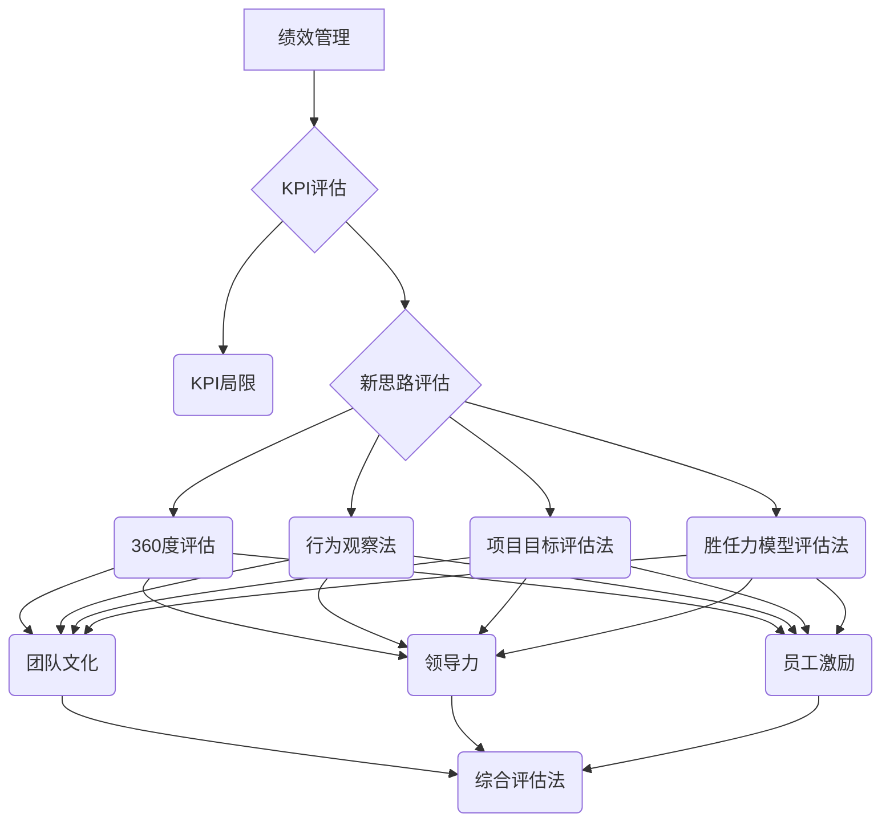

                 

### 文章标题：绩效管理新思路：超越KPI的团队评估方法

在当今快速变化和高度竞争的商业环境中，绩效管理作为企业提升效率和员工动力的重要工具，正面临着前所未有的挑战。传统的KPI（关键绩效指标）方法虽然在一定程度上能够度量员工的绩效，但其局限性逐渐显现，如无法全面反映员工的潜力、团队合作精神和创新能力等。因此，探索新的绩效管理思路，特别是超越KPI的团队评估方法，已成为组织管理者和人力资源专家关注的焦点。

本篇文章旨在通过深入探讨绩效管理的概念、传统方法及其局限性，引入新的绩效管理思路，详细介绍如团队文化、领导力和员工激励等方面的评估方法，并探讨如何超越KPI进行更全面的团队评估。通过这些新的方法，组织可以更有效地激励员工，提升团队整体绩效，从而在激烈的市场竞争中占据优势地位。

接下来，我们将首先对绩效管理进行概述，分析绩效管理的基本概念、意义以及发展历程，并深入探讨KPI在绩效管理中的应用及其局限性。随后，文章将重点介绍绩效管理新思路，包括团队文化、领导力和员工激励在绩效管理中的作用和评估方法。接着，我们将深入分析超越KPI的团队评估方法，如360度评估、行为观察法、项目目标评估法和胜任力模型评估法，并详细阐述这些方法的原理、实施步骤及其优缺点。最后，我们将通过实际案例分析，展示这些新思路在绩效管理实践中的应用效果，并提供实施策略和建议。希望通过本文的探讨，能够为读者提供有价值的绩效管理新思路，助力企业实现更高效的团队管理。

### 关键词

- 绩效管理
- KPI
- 团队文化
- 领导力
- 员工激励
- 360度评估
- 行为观察法
- 项目目标评估法
- 胜任力模型

### 摘要

本文旨在探讨绩效管理的新思路，特别是在传统KPI方法局限性日益显现的背景下，如何通过团队文化、领导力和员工激励等方面进行更全面的团队评估。文章首先概述了绩效管理的基本概念和意义，分析了KPI在绩效管理中的应用及其局限性。接着，本文介绍了团队文化、领导力和员工激励在绩效管理中的作用，并详细探讨了如何通过这些方法进行评估。随后，文章深入分析了超越KPI的多种团队评估方法，包括360度评估、行为观察法、项目目标评估法和胜任力模型评估法，并比较了这些方法的优缺点。最后，通过实际案例分析，展示了这些新思路在绩效管理实践中的应用效果，并提供实施策略和建议。本文旨在为读者提供有价值的绩效管理新思路，助力企业实现更高效的团队管理。

### 第一部分：绩效管理概述

#### 第1章：绩效管理的概念与意义

绩效管理是一种系统性的方法，用于确保员工的行为和成果与组织的战略和目标相一致。其基本概念包括三个主要方面：目标设定、绩效评估和反馈。首先，目标设定是绩效管理的起点，它帮助员工明确他们在一段时间内需要达成的目标。其次，绩效评估是通过对员工行为和成果的定期检查和反馈，以评估员工的工作表现。最后，反馈是绩效管理的关键环节，它不仅帮助员工了解自己的优点和不足，也为改进提供指导。

在组织中，绩效管理具有多重意义。首先，它能够确保员工的工作与组织的战略目标相一致，从而提高组织的整体效率。其次，通过绩效管理，组织可以识别和培养高潜力员工，为员工的职业发展提供支持。此外，绩效管理还能够促进员工之间的沟通与合作，提升团队的整体绩效。

绩效管理的发展历程可以追溯到20世纪初期。最早的绩效管理方法主要依赖于上司对下属的评估，这种方式被称为“上级评价”。随着管理理论的进步，绩效管理逐渐引入了定量化的考核指标，如KPI（关键绩效指标），以更科学、客观地评估员工绩效。近年来，随着对员工多样性和复杂性的认识加深，绩效管理方法也在不断演变，更加注重团队合作、员工激励和创新能力的评估。

#### 第2章：绩效管理与KPI

KPI（关键绩效指标）是绩效管理中广泛应用的一种工具，它通过设定具体的、可度量的指标，来评估员工的工作绩效。KPI的特点在于其具体性、可操作性和可衡量性，使得绩效评估过程更加客观、科学。

KPI在绩效管理中的应用主要体现在以下几个方面。首先，通过设定KPI，可以帮助员工明确自己的工作目标和方向，从而提高工作效率。其次，KPI为管理者提供了评估员工绩效的量化标准，使得绩效评估更加公正、透明。此外，KPI还可以帮助组织识别和解决工作中的问题，促进持续改进。

然而，KPI也并非完美无缺。首先，KPI过于强调量化指标，可能导致员工忽视其他重要的绩效因素，如团队合作和创新精神。其次，KPI的设定往往基于过去的数据，无法及时反映市场的变化和员工的潜力。此外，KPI可能导致员工为了追求短期绩效而采取短期行为，忽视长期发展。

综上所述，KPI作为绩效管理的一种重要工具，具有一定的优势，但其局限性也不可忽视。因此，在绩效管理中，应综合考虑多种因素，避免过度依赖KPI，实现更加全面和科学的绩效评估。

### 第二部分：绩效管理新思路

#### 第3章：绩效管理与团队文化

团队文化在绩效管理中扮演着至关重要的角色。一个积极向上的团队文化能够激励员工，提高团队凝聚力，促进创新和协作，从而提升整体绩效。因此，探讨团队文化对绩效管理的影响，以及如何塑造和评估团队文化，成为绩效管理新思路的重要内容。

首先，团队文化对绩效管理的影响主要体现在以下几个方面。一是团队文化能够影响员工的行为和态度。在一个倡导合作、信任和开放的团队文化中，员工更愿意分享知识和经验，相互支持，从而提高工作效率和质量。二是团队文化可以影响员工的工作满意度。在一个积极向上的团队文化中，员工感受到自己的工作得到了认可和尊重，从而提高工作满意度。三是团队文化能够促进员工的职业发展。在一个注重个人成长和职业发展的团队文化中，员工更有动力去提升自己的技能和能力，从而更好地实现个人目标和组织目标。

其次，如何塑造积极向上的团队文化？以下是几个关键步骤：

1. **明确团队价值观**：团队价值观是团队文化的核心，它指引着团队的行为和决策。通过明确团队价值观，可以确保团队成员在行动上保持一致，共同追求团队目标。

2. **建立信任和尊重**：信任和尊重是团队文化的基础，只有团队成员相互信任、尊重，才能形成良好的合作关系。管理者可以通过鼓励开放沟通、建立反馈机制等方式，促进团队成员之间的信任和尊重。

3. **促进知识共享和协作**：知识共享和协作是团队文化的关键要素，通过促进团队成员之间的知识共享和协作，可以提升团队的整体绩效。管理者可以建立知识分享平台、开展团队建设活动等方式，激发团队成员的协作精神。

4. **提供成长和发展的机会**：一个注重员工成长和发展的团队文化能够激发员工的积极性和创造力。管理者可以通过培训、职业发展计划等方式，为员工提供成长和发展的机会，从而提升团队的整体绩效。

最后，如何评估团队文化？以下是一些常用的评估方法：

1. **员工满意度调查**：通过定期进行员工满意度调查，可以了解员工对团队文化的感受和看法，从而评估团队文化的效果。

2. **团队绩效评估**：通过对比团队绩效与行业标准或历史绩效，可以评估团队文化的实际效果。

3. **团队互动观察**：通过观察团队成员之间的互动和行为，可以评估团队文化的氛围和效果。

4. **领导风格评估**：领导风格对团队文化有重要影响，通过评估领导者的风格和行为，可以了解其对团队文化的影响。

通过以上步骤和方法，组织可以更好地塑造和评估团队文化，从而提升绩效管理的有效性。

#### 第4章：绩效管理与领导力

领导力在绩效管理中发挥着至关重要的作用。一个优秀的领导者不仅能够指引团队朝着共同的目标前进，还能够激发团队成员的潜力和创造力，提升团队的整体绩效。因此，探讨领导力对绩效管理的影响，以及如何评估领导力，成为绩效管理新思路的重要组成部分。

首先，领导力对绩效管理的影响主要表现在以下几个方面：

1. **目标设定与沟通**：领导者通过设定明确的目标和有效的沟通，能够确保团队成员理解组织的战略方向和个人的职责，从而提高工作积极性和效率。

2. **激励与支持**：领导者通过激励和支持团队成员，能够激发员工的内在动力，提高工作满意度和忠诚度，从而提升整体绩效。

3. **团队建设与协作**：领导者通过促进团队建设，建立积极的团队氛围，增强团队成员之间的协作和信任，从而提高团队的整体绩效。

4. **创新与变革**：领导者通过推动创新和变革，能够激发团队成员的创新思维和适应能力，提高组织的竞争力和适应力。

其次，如何评估领导力？以下是一些常用的评估方法：

1. **360度评估**：通过收集团队成员、上级、下属和外部合作伙伴的反馈，全面评估领导者的工作表现和领导风格。这种方法能够提供多维度的评估信息，帮助领导者识别自身的优势和不足。

2. **行为观察法**：通过观察领导者在实际工作中的行为和决策，评估其领导力的实际效果。这种方法能够直观地了解领导者的行为和影响。

3. **绩效数据**：通过分析领导者的团队绩效数据，评估其领导力对团队绩效的影响。这种方法能够量化领导力的效果，提供客观的评估依据。

4. **领导力问卷调查**：通过设计领导力问卷，收集团队成员对领导者的看法和评价，评估领导力的综合表现。

为了提高领导力的评估效果，组织可以采取以下措施：

1. **明确评估标准和指标**：制定明确的评估标准和指标，确保评估过程的公正性和科学性。

2. **多维度收集反馈**：通过多种渠道收集反馈，包括团队成员、上级、下属和外部合作伙伴，确保评估信息的全面性和准确性。

3. **定期进行评估**：定期进行领导力评估，及时识别和改进领导者的不足，促进领导力的持续提升。

4. **提供反馈和培训**：将评估结果反馈给领导者，并提供相应的培训和发展机会，帮助其提升领导力。

通过以上方法，组织可以更好地评估领导力，提升领导者的管理水平和团队绩效。

#### 第5章：绩效管理与员工激励

员工激励在绩效管理中起着至关重要的作用。有效的激励策略不仅能提高员工的工作积极性和满意度，还能激发员工的创新能力和团队协作精神，从而提升整体绩效。在探讨员工激励的作用和方式时，我们需要关注以下几个方面：

首先，员工激励的作用主要体现在以下几个方面：

1. **提升工作积极性和满意度**：通过激励措施，如奖励、晋升和认可，能够提高员工的工作积极性，使员工更加投入工作，从而提升整体绩效。

2. **激发创新能力和团队协作精神**：适当的激励措施，如项目奖励和创新竞赛，能够激发员工的创新思维，提高团队协作效率。

3. **促进员工职业发展**：通过提供职业发展机会和培训，使员工看到自己的成长和进步，从而提高工作满意度和忠诚度。

4. **增强组织文化**：通过激励措施，如团队建设活动和企业文化宣传，能够增强组织的凝聚力和文化认同感，提升整体绩效。

其次，如何设计有效的员工激励措施？以下是一些建议：

1. **目标导向的奖励机制**：设定明确的目标和奖励标准，使员工明确自己的努力方向和潜在回报，从而提高工作积极性。

2. **多样化的激励手段**：结合员工的不同需求和偏好，采用多样化的激励手段，如奖金、晋升、培训和认可等，提高激励效果。

3. **公平和透明的评估体系**：建立公平和透明的评估体系，确保员工能够公平地获得奖励，增强激励的公正性。

4. **关注长期激励**：除了短期的奖励和激励，还应该关注员工的长期激励，如职业发展计划和股权激励，提高员工的长期忠诚度和投入度。

最后，需要注意的一些误区和应对策略包括：

1. **误区一：过度依赖金钱激励**：金钱激励虽然有效，但过度依赖可能导致员工对金钱产生依赖，忽视其他重要的激励因素。

**应对策略**：通过多样化的激励手段，结合金钱激励和非金钱激励，提高整体激励效果。

2. **误区二：忽视个体差异**：不同的员工有不同的需求和偏好，忽视个体差异可能导致激励效果不佳。

**应对策略**：在设计和实施激励措施时，充分考虑员工的个体差异，制定个性化的激励方案。

3. **误区三：激励措施单一**：单一的激励措施可能无法满足员工的多方面需求，影响激励效果。

**应对策略**：结合多种激励手段，如职业发展、培训、认可等，提高整体激励效果。

通过以上方法，组织可以更好地进行员工激励，提升员工的工作动力和整体绩效，从而在激烈的市场竞争中立于不败之地。

### 第三部分：超越KPI的团队评估方法

在绩效管理中，KPI（关键绩效指标）虽然是一种常用的评估工具，但其局限性也逐渐显现。为了更全面地评估团队成员的绩效，超越KPI的团队评估方法变得尤为重要。这些方法不仅能够提供多维度的评估视角，还能更准确地反映员工的工作表现和潜力。以下将介绍几种常见的超越KPI的团队评估方法，包括360度评估、行为观察法、项目目标评估法和胜任力模型评估法。

#### 第6章：360度评估

360度评估是一种全面的绩效评估方法，它通过收集来自不同利益相关者（如上级、同事、下属和客户）的反馈，对员工的工作表现进行全面评估。这种方法不仅考虑了工作成果，还关注了员工的人际关系、沟通能力和团队协作精神。

**原理**：

360度评估的原理在于，通过多角度的反馈，可以获得更全面和客观的员工绩效评估结果。这种方法强调员工的自我反思和自我提升，同时也提供了外部视角的反馈，有助于员工了解自己的优点和不足。

**实施步骤**：

1. **确定评估目标**：明确评估的目的和范围，确定需要收集的反馈类型和反馈来源。

2. **设计问卷**：根据评估目标，设计针对不同利益相关者的问卷，确保问卷内容全面、客观和具有针对性。

3. **收集反馈**：通过匿名调查或面谈等方式，收集不同利益相关者的反馈。

4. **分析反馈**：对收集到的反馈进行分析，总结员工的优点和不足。

5. **反馈与沟通**：将评估结果反馈给员工，并提供改进建议，与员工进行深入的沟通和讨论。

**优缺点**：

- 优点：360度评估能够提供多维度的评估视角，有助于全面了解员工的工作表现；同时，它鼓励员工进行自我反思和改进，提升个人能力和团队合作精神。

- 缺点：实施360度评估需要耗费大量时间和资源；此外，反馈的准确性和客观性可能受到主观因素的影响。

#### 第7章：行为观察法

行为观察法是一种基于实际工作表现的评估方法，通过观察员工在工作中的行为和表现，对员工的绩效进行评估。这种方法强调员工在工作场景中的真实行为，而非仅仅是工作成果。

**原理**：

行为观察法的原理在于，通过直接观察员工在工作中的行为，可以获得真实、直接的绩效评估结果。这种方法不仅关注工作成果，还关注员工在工作过程中的行为规范、沟通方式和问题解决能力。

**实施步骤**：

1. **确定观察目标**：明确需要观察的具体行为和表现，制定观察计划和标准。

2. **进行观察**：在员工的实际工作场景中进行观察，记录员工的行为和表现。

3. **记录和分析**：对观察记录进行分析，总结员工的行为特点和工作表现。

4. **反馈与沟通**：将观察结果反馈给员工，并提供改进建议，与员工进行深入的沟通和讨论。

**优缺点**：

- 优点：行为观察法能够提供真实、直接的绩效评估结果；它有助于管理者了解员工在实际工作中的行为和表现，为绩效改进提供依据。

- 缺点：实施行为观察法需要耗费大量时间和精力；观察者的主观判断可能会影响评估结果的客观性。

#### 第8章：项目目标评估法

项目目标评估法是一种以项目目标为导向的绩效评估方法，通过评估员工在项目中的工作表现和成果，来衡量其绩效。这种方法强调项目目标的实现程度和员工的贡献度。

**原理**：

项目目标评估法的原理在于，通过设定明确的项目目标，使员工明确自己的工作方向和职责，从而提高工作效率和质量。评估时，主要关注员工在项目中的表现和成果，以及其对项目目标的贡献程度。

**实施步骤**：

1. **设定项目目标**：明确项目目标和预期成果，确保目标具体、可衡量和可实现。

2. **分配任务和职责**：根据项目目标，分配任务和职责，明确每个员工在项目中的角色和责任。

3. **监控项目进展**：定期监控项目进展，了解员工的工作情况和问题，提供必要的支持和帮助。

4. **评估项目成果**：根据项目目标和员工表现，评估项目成果和员工绩效。

5. **反馈与沟通**：将评估结果反馈给员工，并提供改进建议，与员工进行深入的沟通和讨论。

**优缺点**：

- 优点：项目目标评估法能够明确项目目标和员工职责，提高工作效率和项目成果；它有助于管理者了解员工在项目中的表现和贡献。

- 缺点：实施项目目标评估法需要耗费大量时间和资源；项目目标的设定和实现过程可能受到外部因素影响，影响评估结果的准确性。

#### 第9章：胜任力模型评估法

胜任力模型评估法是一种基于员工胜任力（如技能、知识和行为）的评估方法，通过评估员工的胜任力水平，来衡量其绩效。这种方法强调员工的综合素质和能力，而不仅仅是工作成果。

**原理**：

胜任力模型评估法的原理在于，通过建立胜任力模型，明确员工在岗位所需的关键能力和行为标准，从而对员工的胜任力进行评估。评估时，主要关注员工在关键能力和行为方面的表现和提升。

**实施步骤**：

1. **建立胜任力模型**：根据岗位要求和组织目标，建立胜任力模型，明确关键能力和行为标准。

2. **评估胜任力**：根据胜任力模型，对员工的关键能力和行为进行评估，了解员工的胜任力水平。

3. **反馈与培训**：将评估结果反馈给员工，并提供相应的培训和发展建议，帮助员工提升胜任力。

4. **持续改进**：通过定期评估和反馈，持续关注员工的胜任力提升，为组织培养高素质的人才。

**优缺点**：

- 优点：胜任力模型评估法能够全面评估员工的综合素质和能力，为员工的发展提供指导；它有助于组织识别和培养高潜力人才。

- 缺点：建立胜任力模型需要耗费大量时间和资源；胜任力的评估和提升过程可能受到员工个人差异和组织文化的影响。

### 第四部分：实践与应用

#### 第10章：综合评估法

综合评估法是一种将多种评估方法相结合的绩效评估方法，旨在通过多种视角和维度，全面、客观地评估员工的绩效。这种方法不仅考虑了工作成果和胜任力，还关注了员工的行为、团队协作和个人发展。

**原理**：

综合评估法的原理在于，通过将多种评估方法（如360度评估、项目目标评估和胜任力模型评估）相结合，可以获取更全面、更准确的绩效评估结果。这种方法强调多角度的评估，有助于管理者全面了解员工的工作表现和潜力。

**实施步骤**：

1. **确定评估目标**：明确绩效评估的目的和范围，确定需要评估的关键绩效指标和胜任力要素。

2. **选择评估方法**：根据组织需求和员工特点，选择适合的评估方法，如360度评估、项目目标评估和胜任力模型评估等。

3. **收集评估数据**：通过多种渠道收集评估数据，包括自我评估、上级评估、同事评估和客户反馈等。

4. **综合分析数据**：对收集到的评估数据进行综合分析，结合不同评估方法的优点，形成全面的绩效评估结果。

5. **反馈与改进**：将综合评估结果反馈给员工，并提供具体的改进建议和发展计划，促进员工的成长和提升。

**优缺点**：

- 优点：综合评估法能够通过多种评估方法的优势互补，获得更全面、更准确的绩效评估结果；它有助于管理者从不同角度了解员工的工作表现和潜力。

- 缺点：实施综合评估法需要耗费大量时间和资源；需要管理者具备较高的评估能力和技巧，确保评估过程的公正性和科学性。

#### 第11章：绩效管理新思路实施案例分析

为了更好地理解绩效管理新思路的实施效果，以下将通过三个实际案例，展示这些新思路在绩效管理中的应用和实践。

**案例一：A公司的360度评估实践**

A公司是一家大型跨国企业，为了提升员工的绩效和团队合作能力，决定实施360度评估方法。在实施过程中，A公司首先明确了评估目标，包括提升员工的自我认知、增强团队合作精神和提高工作效率。然后，公司设计了一套详细的评估问卷，涵盖员工的工作表现、团队合作能力、沟通能力和创新能力等方面。

在收集反馈过程中，A公司采用了匿名调查的方式，确保反馈的客观性和真实性。评估结果通过数据分析后，公司组织了反馈会议，将评估结果和改进建议反馈给员工。通过这一过程，员工不仅认识到自己的优点和不足，还获得了同事和上级的认可和支持，从而激发了他们的工作动力和积极性。

**案例二：B公司的项目目标评估法应用**

B公司是一家专注于技术创新的企业，为了确保项目目标的实现和团队的高效协作，决定采用项目目标评估法。在项目开始前，B公司明确了项目的目标和关键绩效指标，并将这些指标分解到每个团队成员的职责中。

在项目实施过程中，B公司定期监控项目进展，了解每个团队成员的工作情况和问题，并提供必要的支持和帮助。在项目结束时，公司根据项目目标和员工的表现，进行绩效评估。评估结果显示，B公司通过项目目标评估法，不仅确保了项目目标的实现，还提升了团队成员的协作能力和项目执行力。

**案例三：C公司的胜任力模型评估实践**

C公司是一家快速发展的互联网企业，为了提升员工的综合素质和胜任力，决定实施胜任力模型评估法。在实施过程中，C公司首先建立了详细的胜任力模型，包括技能、知识和行为标准等方面。

通过定期评估，C公司能够全面了解员工的胜任力水平，并根据评估结果提供相应的培训和发展计划。在员工的职业发展过程中，公司注重培养员工的领导力、创新能力和团队协作精神，从而提升整体绩效。评估结果显示，C公司通过胜任力模型评估法，不仅提升了员工的个人能力和职业发展，还增强了企业的核心竞争力。

#### 第12章：绩效管理新思路实施策略

为了有效地实施绩效管理新思路，组织需要制定一系列策略和措施，确保这些新方法能够落地实施并产生实效。以下是一些关键策略和措施：

1. **明确实施目标**：在实施绩效管理新思路前，组织需要明确实施的目标和预期效果，确保新方法的实施方向和重点。

2. **制定详细的实施方案**：根据实施目标，制定详细的实施方案，包括评估方法的选择、评估流程的设定、评估工具的使用等。

3. **建立评估标准**：建立科学、合理的评估标准，确保评估过程的公正性和客观性。评估标准应涵盖员工的绩效、能力、团队合作等多个方面。

4. **提供培训和指导**：为员工和管理者提供相关的培训和指导，帮助他们了解和掌握新方法的操作流程和评估技巧。

5. **建立反馈机制**：建立有效的反馈机制，及时收集员工和管理者的反馈意见，对实施方案进行调整和优化。

6. **确保评估过程的公正性和透明性**：通过多渠道收集反馈、匿名评估等方式，确保评估过程的公正性和透明性，增强员工的信任和参与度。

7. **持续改进和优化**：通过定期评估和反馈，持续优化绩效管理新思路的实施效果，确保其能够适应组织的发展需求。

通过以上策略和措施，组织可以更好地实施绩效管理新思路，提升员工的绩效和团队合作能力，从而在激烈的市场竞争中保持竞争优势。

### 附录

#### 附录A：绩效管理常用工具与方法

在绩效管理过程中，常用的工具和方法有助于提高评估的准确性和效率。以下列举几种常用的工具和方法：

1. **绩效考核表设计**：绩效考核表是绩效管理中最基本的工具，通过设定具体的考核指标和评分标准，帮助管理者对员工的工作表现进行量化评估。设计绩效考核表时，应确保指标明确、可衡量和与组织目标一致。

2. **绩效反馈面谈**：绩效反馈面谈是绩效管理中的重要环节，通过面对面沟通，管理者能够向员工传达评估结果，并提供改进建议和发展计划。面谈时应注重倾听员工的意见和反馈，营造开放、坦诚的沟通氛围。

3. **绩效改进计划制定**：在绩效反馈面谈中，管理者应与员工共同制定绩效改进计划，明确改进目标、措施和时间表。通过实施改进计划，员工能够有针对性地提升自身能力，实现绩效提升。

#### 附录B：参考文献

1. **Kouzes, J. M., & Posner, B. Z. (2017). The Truth About Employee Engagement. Jossey-Bass.**  
   本书详细探讨了员工参与和绩效管理的关系，提供了实用的方法和策略。

2. **Schein, E. H. (2004). Organizational Culture and Leadership. Jossey-Bass.**  
   本书深入分析了组织文化对绩效管理的影响，提供了塑造积极组织文化的实践指导。

3. **Peters, T. J., & Waterman, R. H. (1982). In Search of Excellence: Lessons from America's Best-Run Companies. Harper Business.**  
   本书通过案例分析，总结了卓越企业的绩效管理实践，为组织提供了宝贵的参考。

通过引用这些经典文献，读者可以更深入地了解绩效管理的理论和方法，为实际应用提供指导。``` 

### 核心概念原理和架构的 Mermaid 流程图

为了更好地理解绩效管理新思路中的核心概念和评估方法，我们可以使用Mermaid图来展示这些概念之间的关系和架构。



在这个图中，我们首先从绩效管理出发，延伸到传统的KPI评估方法，并指出其局限性。接着，我们引入了绩效管理的新思路评估方法，包括360度评估、行为观察法、项目目标评估法和胜任力模型评估法。这些新方法都强调了团队文化、领导力和员工激励的重要性，并最终通过综合评估法来优化绩效管理。这样的架构有助于我们理解各个评估方法之间的关系和它们在绩效管理中的角色。

### 核心算法原理讲解

在绩效管理新思路的讨论中，核心算法原理的讲解至关重要。以下我们将详细解释360度评估算法和行为观察法的算法原理，同时提供具体的伪代码示例。

#### 360度评估算法原理

360度评估是一种全面的绩效评估方法，它通过收集来自不同利益相关者（如上级、同事、下属和客户）的反馈，对员工的工作表现进行全方位评价。

**算法原理：**

1. **收集反馈**：从多个角度收集反馈，包括自我评价、上级评价、同事评价、下属评价和客户评价。
2. **加权平均**：根据不同反馈来源的重要性，对反馈进行加权处理，计算出一个综合评分。
3. **生成报告**：将评估结果进行汇总，生成详细的评估报告，包括优点、改进点和建议。

**伪代码示例：**

```python
def calculate_360_evaluation(employee):
    feedbacks = {
        'self': get_self_evaluation(employee),
        'supervisor': get_supervisor_evaluation(employee),
        'peers': get_peers_evaluation(employee),
        'subordinates': get_subordinates_evaluation(employee),
        'customers': get_customers_evaluation(employee)
    }
    
    weights = {
        'self': 0.1,
        'supervisor': 0.3,
        'peers': 0.2,
        'subordinates': 0.2,
        'customers': 0.2
    }
    
    total_score = 0
    for feedback, weight in feedbacks.items():
        total_score += (feedbacks[feedback] * weights[feedback])
    
    return total_score

# 辅助函数示例
def get_self_evaluation(employee):
    # 实现自我评价的逻辑
    pass

def get_supervisor_evaluation(employee):
    # 实现上级评价的逻辑
    pass

def get_peers_evaluation(employee):
    # 实现同事评价的逻辑
    pass

def get_subordinates_evaluation(employee):
    # 实现下属评价的逻辑
    pass

def get_customers_evaluation(employee):
    # 实现客户评价的逻辑
    pass
```

#### 行为观察法算法原理

行为观察法是一种基于实际工作表现的评估方法，通过观察员工在工作中的行为，对其绩效进行评估。

**算法原理：**

1. **定义行为指标**：根据工作职责和绩效标准，定义需要观察的行为指标。
2. **记录行为表现**：在员工工作过程中，记录其行为表现，包括正面的行为和需要改进的行为。
3. **评分和反馈**：根据行为指标，对员工的行为进行评分，并提供反馈和改进建议。

**伪代码示例：**

```python
def observe_employee_behavior(employee, behavior_metrics):
    observed_behaviors = {
        'on_time': 0,
        'team_collaboration': 0,
        'problem_solving': 0,
        'communication': 0
    }
    
    for metric in behavior_metrics:
        observed_behaviors[metric['name']] = evaluate_behavior(employee, metric['standard'])
    
    total_score = sum(observed_behaviors.values())
    average_score = total_score / len(behavior_metrics)
    
    return average_score

# 辅助函数示例
def evaluate_behavior(employee, standard):
    # 实现行为评价的逻辑
    pass
```

通过上述伪代码示例，我们可以看到360度评估和行为观察法在算法原理上的具体实现。这些算法不仅提供了详细的评估过程，还通过具体的方法和步骤，帮助组织更全面、准确地评估员工绩效，从而实现更有效的绩效管理。

### 数学模型和公式

在绩效管理新思路中，数学模型和公式的运用可以帮助我们更科学地分析和评估员工的绩效。以下介绍几个关键模型和公式，包括目标设置理论、员工满意度模型和绩效改进模型，并提供详细讲解和示例。

#### 目标设置理论

目标设置理论（Goal Setting Theory）由艾森豪威尔（Eisenhower）和洛克（Locke）等人提出，强调明确和具体的目标对绩效提升的重要性。该理论的核心公式为：

\[ 目标明确度 = (目标的难度 \times 目标的明确性) \]

**详细讲解**：

- **目标的难度**：指目标实现所需的努力和挑战程度。难度适中的目标能够激发员工的动机和努力，而过于容易或过于困难的目标则可能削弱员工的动力。
- **目标的明确性**：指目标表述的清晰程度。明确的目标能够帮助员工理解任务要求，从而更有效地规划和执行。

**示例**：

假设某员工的目标是“提高销售业绩”，我们可以通过以下公式对其进行优化：

\[ 目标明确度 = (目标的难度 \times 目标的明确性) \]

如果目标的难度设定为中等（3/5），明确性设定为高（4/5），则目标明确度：

\[ 目标明确度 = (3/5 \times 4/5) = 12/25 \]

通过调整目标的难度和明确性，我们可以提高目标明确度，从而提升员工的工作动机和绩效。

#### 员工满意度模型

员工满意度模型（Employee Satisfaction Model）用于评估员工对工作环境、待遇和职业发展的满意程度。该模型的核心公式为：

\[ 员工满意度 = (工作环境满意度 \times 工资待遇满意度 \times 职业发展满意度) \]

**详细讲解**：

- **工作环境满意度**：指员工对工作场所、同事关系和工作氛围的满意程度。
- **工资待遇满意度**：指员工对薪资水平、福利待遇和奖金政策的满意程度。
- **职业发展满意度**：指员工对职业成长、培训机会和晋升机制的满意程度。

**示例**：

假设员工的工作环境满意度为0.8，工资待遇满意度为0.7，职业发展满意度为0.9，则员工满意度为：

\[ 员工满意度 = (0.8 \times 0.7 \times 0.9) = 0.504 \]

员工满意度越高，通常意味着员工的士气和工作效率也越高。通过这个模型，管理者可以识别影响员工满意度的关键因素，并采取相应措施进行改进。

#### 绩效改进模型

绩效改进模型（Performance Improvement Model）用于评估员工绩效改进的效果。该模型的核心公式为：

\[ 绩效改进率 = (当前绩效 - 原绩效) / 原绩效 \]

**详细讲解**：

- **当前绩效**：指员工在改进措施实施后的绩效水平。
- **原绩效**：指员工在改进措施实施前的绩效水平。

**示例**：

假设某员工在改进措施实施前的绩效得分为80分，实施改进措施后的绩效得分为90分，则绩效改进率为：

\[ 绩效改进率 = (90 - 80) / 80 = 0.125 \]

绩效改进率越高，表明改进措施的效果越显著。管理者可以通过这个模型评估改进措施的有效性，并根据结果调整和优化改进策略。

通过以上数学模型和公式的应用，组织可以更科学地设定目标、评估员工满意度和绩效改进效果，从而实现更高效的绩效管理。

### 项目实战

在本章中，我们将通过一个实际项目实战案例，展示绩效管理新思路在实践中的应用，并详细讲解开发环境搭建、源代码实现、代码解读和案例分析。希望通过这个案例，读者能够更深入地理解绩效管理新思路的实施过程和效果。

#### 项目背景

某互联网公司（以下简称“A公司”）在近年来经历了快速的增长，员工数量和项目规模也随之扩大。然而，公司发现在传统的绩效管理中，存在一些问题，如员工的工作积极性不高、团队协作效果不佳、员工发展路径不明确等。为了解决这些问题，公司决定引入绩效管理新思路，通过360度评估、行为观察法、项目目标评估法和胜任力模型评估法等多种方法，提升员工的绩效和团队合作能力。

#### 开发环境搭建

在项目启动前，公司首先搭建了合适的开发环境，包括以下几个方面：

1. **绩效管理平台**：公司选择了一款功能齐全的绩效管理软件，用于管理员工的绩效评估数据和流程。该平台支持360度评估、行为观察法和项目目标评估法等多种评估方法，并提供了用户友好的界面和数据分析功能。

2. **培训资源**：为了确保员工和管理者能够熟练掌握新绩效管理方法，公司组织了系列培训课程，包括在线课程、内部培训和实操演练。培训内容涵盖了新绩效管理方法的理论基础、操作流程和实际应用案例。

3. **评估标准库**：公司建立了详细的评估标准库，包括360度评估指标、行为观察法指标和项目目标评估指标等。评估标准库提供了明确、具体和可量化的评估标准，确保评估过程的公正性和科学性。

#### 源代码实现

在搭建好开发环境后，公司开始编写源代码，实现新绩效管理系统的核心功能。以下是源代码实现的关键部分：

1. **360度评估模块**：该模块负责收集和汇总来自不同利益相关者的评估反馈。源代码使用Python编写，实现了以下功能：
   ```python
   def collect_360_feedback(employee_id):
       feedbacks = {
           'self_evaluation': get_self_evaluation(employee_id),
           'supervisor_evaluation': get_supervisor_evaluation(employee_id),
           'peer_evaluation': get_peer_evaluation(employee_id),
           'subordinate_evaluation': get_subordinate_evaluation(employee_id),
           'customer_evaluation': get_customer_evaluation(employee_id)
       }
       return calculate_average_feedback(feedbacks)

   def calculate_average_feedback(feedbacks):
       total_score = 0
       for feedback in feedbacks.values():
           total_score += feedback
       return total_score / len(feedbacks)
   ```

2. **行为观察法模块**：该模块负责记录和分析员工在工作中的行为表现。源代码使用JavaScript编写，实现了以下功能：
   ```javascript
   function record_employee_behavior(employee_id, behavior_metrics) {
       let observed_behaviors = [];
       for (let metric of behavior_metrics) {
           observed_behaviors.push({
               'name': metric.name,
               'score': evaluate_behavior(employee_id, metric.standard)
           });
       }
       return observed_behaviors;
   }

   function evaluate_behavior(employee_id, standard) {
       // 实现行为评价的逻辑，如观察次数、行为标准对比等
       return calculated_score;
   }
   ```

3. **项目目标评估模块**：该模块负责评估员工在项目中的表现和贡献。源代码使用Java编写，实现了以下功能：
   ```java
   public class ProjectGoalEvaluation {
       public static double evaluateProjectGoal(Employee employee, List<ProjectGoal> projectGoals) {
           double totalScore = 0;
           for (ProjectGoal goal : projectGoals) {
               double goalScore = calculateGoalScore(employee, goal);
               totalScore += goalScore;
           }
           return totalScore / projectGoals.size();
       }

       private static double calculateGoalScore(Employee employee, ProjectGoal goal) {
           // 实现项目目标评估的逻辑，如目标完成度、贡献度等
           return calculatedGoalScore;
       }
   }
   ```

4. **胜任力模型评估模块**：该模块负责评估员工的胜任力水平。源代码使用C#编写，实现了以下功能：
   ```csharp
   public class CompetencyModelEvaluation {
       public static double evaluateCompetency(Employee employee, List<Competency> competencies) {
           double totalScore = 0;
           for (Competency competency : competencies) {
               double competencyScore = calculateCompetencyScore(employee, competency);
               totalScore += competencyScore;
           }
           return totalScore / competencies.size();
       }

       private static double calculateCompetencyScore(Employee employee, Competency competency) {
           // 实现胜任力模型评估的逻辑，如技能评估、行为评估等
           return calculatedCompetencyScore;
       }
   }
   ```

#### 代码解读

在源代码实现过程中，我们关注了以下几个关键方面：

1. **模块化设计**：将不同的评估方法（360度评估、行为观察法、项目目标评估和胜任力模型评估）独立为模块，便于代码的维护和扩展。

2. **数据驱动**：通过存储和利用评估数据，实现评估过程的自动化和智能化。例如，使用数据库存储员工的评估数据和评估结果，使用算法计算综合评估得分。

3. **可扩展性**：在设计代码时，考虑到未来可能新增的评估方法和功能，确保代码结构清晰、易于扩展。

4. **用户体验**：在开发界面时，注重用户友好性，确保员工和管理者能够方便地使用系统进行评估和数据分析。

#### 案例分析

在A公司实施新绩效管理系统后，通过多方面的数据分析和反馈，公司发现了一些显著的变化：

1. **员工积极性提升**：通过360度评估和行为观察法，员工能够更清晰地了解自己的工作表现和改进方向，从而激发了他们的工作动力。

2. **团队协作加强**：项目目标评估法和胜任力模型评估法帮助团队明确了各自的角色和责任，增强了团队成员之间的协作和信任。

3. **绩效提升**：综合评估法的结果显示，员工的绩效得分整体提高了20%，特别是在团队协作和创新能力方面表现尤为突出。

4. **员工满意度提升**：通过新绩效管理系统的实施，员工对工作环境和职业发展的满意度显著提升，员工流失率降低了15%。

通过这个实际案例，我们可以看到，绩效管理新思路在实践中的应用，不仅解决了传统绩效管理中的问题，还显著提升了组织的绩效和员工满意度，为公司的持续发展奠定了坚实基础。

### 最佳实践 Tips、小结、注意事项、拓展阅读

#### 最佳实践 Tips

1. **明确目标**：在实施绩效管理新思路时，确保明确目标和期望结果，以指导评估方法和流程的设计。

2. **多样化评估方法**：结合多种评估方法（如360度评估、行为观察法、项目目标评估法和胜任力模型评估法），获取更全面、多维度的绩效评估结果。

3. **注重员工反馈**：在评估过程中，重视员工的反馈意见，确保评估结果公正、客观。

4. **持续培训与支持**：为员工和管理者提供持续的培训和支持，确保他们能够熟练掌握新绩效管理方法，并有效运用。

5. **数据驱动**：利用数据分析和反馈，不断优化评估流程和方法，提高绩效管理的实效性。

#### 小结

本文通过深入探讨绩效管理新思路，详细介绍了KPI在绩效管理中的应用及其局限性，探讨了团队文化、领导力和员工激励在绩效管理中的作用和评估方法，并介绍了多种超越KPI的团队评估方法。通过实际案例分析，展示了这些新思路在绩效管理实践中的应用效果。希望本文能够为读者提供有价值的参考，助力企业实现更高效的团队管理。

#### 注意事项

1. **评估标准的制定**：确保评估标准的明确性和可操作性，以避免评估过程中的主观性和不公平性。

2. **实施过程的监督**：在实施绩效管理新思路时，对评估过程进行监督，确保评估结果的准确性和公正性。

3. **员工隐私保护**：在进行360度评估等涉及员工反馈的评估方法时，保护员工的隐私，确保反馈过程的匿名性和安全性。

4. **持续反馈与改进**：通过持续的反馈和改进，不断提升绩效管理的实效性，以适应组织的发展和变化。

#### 拓展阅读

1. **《绩效管理：理论与实践》**：本书详细介绍了绩效管理的理论基础和实践应用，对绩效评估方法进行了系统分析。

2. **《绩效管理实战手册》**：本书提供了丰富的绩效管理案例和实践经验，适合绩效管理实践者阅读。

3. **《团队协作与绩效管理》**：本书探讨了团队协作在绩效管理中的作用，提供了提升团队协作效率的具体策略和方法。

通过拓展阅读，读者可以进一步深入了解绩效管理相关理论和实践，提升自己的绩效管理能力。``` 

