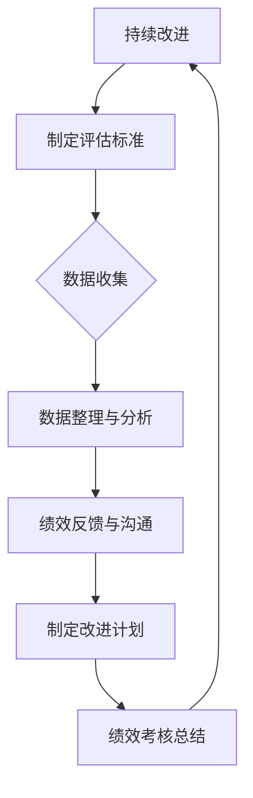

                 

### 文章标题：绩效考核：公平公正的评估体系设计

> 关键词：绩效考核、公平、公正、评估体系设计、绩效评估指标、评估方法

> 摘要：本文旨在深入探讨绩效考核的基本概念、设计原则、评估指标、方法及其在实际应用中的问题与解决方案。通过对公平与公正原则的贯彻，本文旨在构建一个科学、合理、透明的绩效考核体系，为企业的长远发展提供有力支持。

----------------------------------------------------------------

#### 1. 绩效考核的背景与重要性

绩效考核作为一种重要的管理工具，广泛应用于各类企业、机构以及政府部门。其核心目的是通过系统化的评估，激励员工发挥潜能，提升工作效率，实现组织目标。

**背景**：随着经济全球化及市场竞争的加剧，企业需要不断提高自身竞争力，而员工的绩效表现成为企业成功的关键因素之一。因此，科学的绩效考核体系显得尤为重要。

**重要性**：首先，绩效考核能够帮助组织识别并留住优秀人才。通过评估员工的工作表现，企业能够明确员工的强项与弱点，为人才发展提供指导。其次，绩效考核有助于激励员工。明确的工作目标和绩效标准能够激发员工的工作积极性，提高工作满意度。此外，绩效考核还为薪酬调整、晋升、培训等人力资源管理决策提供了依据。

#### 2. 核心概念与联系

要构建一个有效的绩效考核体系，首先需要明确几个核心概念及其之间的联系：

- **绩效考核**：指通过量化和评估员工在工作中的表现，以评估其贡献和价值的过程。
- **公平**：指绩效考核过程中，对待所有员工应当一视同仁，不偏不倚。
- **公正**：指绩效考核结果应当真实、客观，不受外部干扰。

这些概念之间的联系在于，公平与公正是绩效考核的基石，只有在这两个原则的指导下，绩效考核结果才能得到广泛认可，进而发挥其应有的作用。

**Mermaid 流程图**：



在这个流程图中，每个环节都紧密相连，形成一个完整的绩效考核闭环。

----------------------------------------------------------------

#### 3. 公平与公正的评估体系设计

**评估体系设计的原则**

公平与公正原则是评估体系设计的基础。具体来说，设计一个公平、公正的评估体系需要遵循以下原则：

- **一致性**：评估标准应当一致，确保所有员工在相同的条件下接受评估。
- **透明性**：评估过程和标准应当透明，员工应当清楚了解评估依据和结果。
- **客观性**：评估结果应当基于客观、可量化的指标，减少主观偏见。
- **参与性**：员工应有机会参与到评估过程，包括评估标准的制定和反馈环节。

**实现公平与公正的挑战**

尽管上述原则有助于构建公平、公正的评估体系，但在实际操作中仍面临诸多挑战：

- **评估标准的不一致**：不同部门或领导可能在评估标准上存在差异，导致评估结果不一致。
- **主观偏见**：评估者可能因为个人情感或成见而影响评估结果，使得评估过程缺乏公正性。
- **数据的不完整或不准确**：绩效数据的收集和分析可能存在缺陷，导致评估结果失真。
- **员工参与度不足**：员工可能对评估过程缺乏兴趣或信任，影响评估的有效性。

**解决方案**

为应对这些挑战，可以采取以下解决方案：

- **标准化评估标准**：制定统一的评估标准，确保所有员工在相同的条件下接受评估。
- **培训评估者**：提高评估者的专业素养，减少主观偏见，确保评估过程的客观性。
- **数据质量控制**：建立健全的数据收集和分析机制，确保数据的完整性和准确性。
- **提高员工参与度**：通过沟通和反馈机制，增强员工对评估过程的参与度和信任感。

通过遵循上述原则和采取相应措施，可以构建一个公平、公正的绩效考核体系，为组织的长远发展奠定坚实基础。

### 4. 绩效评估指标体系构建

**绩效评估指标的选择**

构建一个有效的绩效评估指标体系是绩效考核的核心环节。选择合适的绩效评估指标需要考虑以下几个因素：

- **岗位特点**：不同岗位的工作内容和职责不同，评估指标也应因岗而异。
- **组织目标**：评估指标应当与组织的目标和战略方向相一致，确保评估结果对组织发展产生积极影响。
- **可衡量性**：评估指标应当是可量化的，便于衡量和比较。
- **可操作性**：评估指标应当易于操作和执行，确保评估过程可行。

**指标类型与分类**

绩效评估指标主要分为以下几类：

- **行为指标**：衡量员工在工作中的具体行为表现，如出勤率、任务完成率等。
- **成果指标**：衡量员工的工作成果和产出，如销售额、项目进度等。
- **素质指标**：衡量员工的素质和能力，如团队合作能力、创新能力等。

**指标设置的原则与标准**

在设置绩效评估指标时，应遵循以下原则和标准：

- **相关性**：指标应与岗位和工作内容高度相关，确保评估结果的准确性。
- **可行性**：指标应易于操作和衡量，确保评估过程的可行性。
- **公平性**：指标应公平对待所有员工，避免因岗位差异导致的评估不公平。
- **综合性**：指标应涵盖员工的工作各个方面，确保评估结果的全面性。

**实际应用中的案例分析**

以某技术公司为例，该公司在设置绩效评估指标时，采用了以下几类指标：

- **行为指标**：出勤率、任务完成率、项目参与度等。
- **成果指标**：项目进度、客户满意度、技术成果转化率等。
- **素质指标**：创新能力、团队合作能力、学习成长等。

这些指标既反映了员工在工作中的具体表现，也体现了员工的综合素质。通过这些指标，公司能够全面了解员工的工作状况，为绩效管理和决策提供有力支持。

### 5. 绩效评估方法

**定量评估方法**

定量评估方法主要通过量化数据来评估员工绩效，常见的方法包括：

- **关键绩效指标（KPI）**：以关键绩效指标来衡量员工的工作成果和贡献。
- **平衡计分卡（BSC）**：从财务、客户、内部流程、学习与成长四个维度综合评估员工绩效。
- **360度评估**：通过多维度的反馈，全面评估员工的工作表现。

**定性评估方法**

定性评估方法主要通过主观判断和描述来评估员工绩效，常见的方法包括：

- **绩效评语**：由上级或同事对员工的表现进行描述性评价。
- **行为事件访谈**：通过访谈了解员工在工作中的具体行为和表现。
- **绩效面谈**：面对面交流，讨论员工的工作表现和改进方向。

**综合评估方法**

综合评估方法结合定量和定性评估方法，以获得更全面、准确的评估结果。常见的方法包括：

- **混合评估法**：将定量评估和定性评估结合，以平衡评估结果的客观性和主观性。
- **行为事件评分法**：结合关键绩效指标和行为事件访谈，对员工绩效进行全面评估。

### 6. 绩效评估流程与实施

**绩效评估流程设计**

绩效评估流程包括以下几个环节：

- **目标设定**：明确绩效评估的目标和标准，确保评估过程具有针对性。
- **数据收集**：收集与绩效评估相关的数据，如工作记录、项目报告等。
- **数据整理与分析**：对收集到的数据进行整理和分析，为评估提供依据。
- **绩效反馈与沟通**：将评估结果反馈给员工，进行沟通和讨论。
- **制定改进计划**：根据评估结果，制定员工的改进计划和发展方向。
- **绩效考核总结**：对整个绩效评估过程进行总结，为后续评估提供参考。

**实施绩效评估的步骤与技巧**

- **制定明确的评估标准**：确保评估标准的明确、具体，易于操作。
- **培训评估者**：提高评估者的专业素养，减少主观偏见。
- **数据真实性验证**：确保数据的真实性和准确性，避免评估结果失真。
- **定期评估**：定期进行绩效评估，确保评估的持续性和有效性。
- **鼓励员工参与**：增强员工的参与度，提高评估的公平性和公正性。

**绩效评估中的常见问题及解决策略**

- **评估标准不一致**：通过制定统一的评估标准，确保评估过程的一致性。
- **主观偏见**：通过培训评估者，提高评估的客观性。
- **数据不完整或不准确**：建立健全的数据收集机制，提高数据的完整性和准确性。
- **员工参与度低**：通过沟通和反馈机制，增强员工的参与度和信任感。

### 7. 绩效反馈与沟通

**绩效反馈机制**

绩效反馈是绩效考核的重要组成部分，通过及时、准确的反馈，可以帮助员工了解自己的工作表现，明确改进方向。一个有效的绩效反馈机制应包括以下几个环节：

- **定期反馈**：定期进行绩效反馈，确保反馈的持续性和有效性。
- **多维度反馈**：从多个角度对员工进行反馈，包括上级、同事和下属。
- **具体、建设性反馈**：提供具体、有针对性的反馈，帮助员工理解并改进不足。

**绩效反馈与沟通的技巧**

- **积极倾听**：倾听员工的想法和意见，建立良好的沟通氛围。
- **清晰表达**：明确表达反馈内容，避免模糊和含糊的表述。
- **鼓励提问**：鼓励员工提问，解答他们心中的疑惑。
- **关注改进**：关注员工的改进计划，提供必要的支持和资源。

### 8. 制定改进计划

根据绩效评估结果，制定改进计划是提高员工绩效的重要手段。一个有效的改进计划应包括以下几个方面：

- **明确目标**：设定具体、可量化的改进目标，确保目标的可实现性。
- **分解任务**：将改进目标分解为具体的任务和行动计划，明确责任人和完成时限。
- **资源支持**：提供必要的资源和支持，包括培训、指导和工具等。
- **跟踪与评估**：定期跟踪改进计划的执行情况，评估改进效果，及时调整计划。

### 9. 绩效考核总结

绩效考核总结是对整个绩效评估过程进行回顾和总结，为后续的绩效考核提供参考和依据。绩效考核总结应包括以下几个方面：

- **评估结果分析**：对评估结果进行深入分析，识别优势和不足。
- **问题与挑战**：总结在绩效评估过程中遇到的问题和挑战，分析原因。
- **改进建议**：提出改进建议，为下一轮绩效考核提供指导。
- **经验分享**：分享成功经验和教训，促进组织内部的交流和提升。

### 10. 持续改进

绩效考核不是一次性的活动，而是一个持续的过程。通过不断地总结和改进，组织可以不断完善绩效考核体系，提高绩效管理水平。

- **定期评估**：定期进行绩效评估，确保评估的持续性和有效性。
- **培训与学习**：组织员工进行培训和技能提升，提高整体绩效水平。
- **反馈机制**：建立有效的反馈机制，及时收集员工和上级的反馈，持续优化评估体系。
- **数据驱动**：基于数据分析和反馈，不断调整和优化绩效考核指标和方法。

### 11. 最佳实践 tips

- **制定清晰的评估标准**：确保评估标准具体、明确，易于理解和操作。
- **培训评估者**：提高评估者的专业素养，减少主观偏见。
- **鼓励员工参与**：提高员工的参与度和积极性，增强评估的公正性。
- **注重数据真实性**：确保数据的完整性和准确性，避免评估结果失真。
- **定期进行反馈**：定期进行绩效反馈，帮助员工明确改进方向。

### 12. 小结

本文系统地探讨了绩效考核的基本概念、评估体系设计、指标选择、评估方法、流程实施、反馈沟通、改进计划以及持续改进等方面的内容。通过遵循公平与公正原则，构建科学、合理的绩效考核体系，组织可以更好地激励员工，提高工作效率，实现组织目标。

### 13. 注意事项

- **评估标准的一致性**：确保评估标准在不同部门和领导之间的一致性。
- **数据真实性的验证**：加强对数据的真实性和准确性的验证，避免评估结果失真。
- **员工的参与度**：提高员工的参与度和积极性，确保评估过程的公正性。
- **持续改进**：绩效考核是一个持续的过程，需要不断地总结和改进。

### 14. 拓展阅读

- 《绩效管理：打造高绩效组织》
- 《绩效评估：方法与实践》
- 《关键绩效指标：KPI实务指南》
- 《平衡计分卡：战略执行与绩效管理》

作者：AI天才研究院/AI Genius Institute & 禅与计算机程序设计艺术 /Zen And The Art of Computer Programming

----------------------------------------------------------------

## 附录：源代码与项目实战案例

### 开发环境搭建

为了更好地理解并应用本文中提到的绩效考核体系设计，我们将使用Python语言进行代码实现。以下是搭建开发环境的步骤：

1. 安装Python 3.8及以上版本。
2. 安装必要的库，如numpy、pandas和matplotlib。可以使用以下命令安装：

   ```bash
   pip install numpy pandas matplotlib
   ```

3. 准备数据集。本文使用某公司员工的工作表现数据作为示例，数据包括工作质量、工作效率、团队协作和创新能力等指标。

### 源代码实现

以下是实现绩效考核体系的源代码：

```python
import numpy as np
import pandas as pd
import matplotlib.pyplot as plt

# 加载员工数据
data = pd.read_csv('employee_data.csv')

# 定义权重分配函数
def weight_distribution(criteria, total_weight):
    weights = {}
    for criterion in criteria:
        weights[criterion] = (total_weight / len(criteria))
    return weights

# 设置评估标准
criteria = ['工作质量', '工作效率', '团队协作', '创新能力']
total_weight = 100
weights = weight_distribution(criteria, total_weight)

# 计算标准分
def calculate_standard_score(data, weights):
    standard_scores = {}
    for criterion in criteria:
        mean = np.mean(data[criterion])
        std = np.std(data[criterion])
        standard_scores[criterion] = (data[criterion] - mean) / std
    return standard_scores

# 绩效评估函数
def performance_evaluation(data, weights):
    standard_scores = calculate_standard_score(data, weights)
    total_score = sum(standard_scores[criterion] * weights[criterion] for criterion in criteria)
    return total_score

# 绩效评估结果可视化
def visualize_evaluation(data, total_score):
    plt.bar(data.index, data['总评分'])
    plt.xlabel('员工ID')
    plt.ylabel('总评分')
    plt.title('绩效评估结果')
    plt.grid()
    plt.show()

# 执行绩效评估
total_score = performance_evaluation(data, weights)
visualize_evaluation(data, total_score)
```

### 代码解读与分析

以下是代码的详细解读：

1. **数据加载**：使用pandas库读取员工数据，数据集包括工作质量、工作效率、团队协作和创新能力等指标。

2. **权重分配函数**：定义一个权重分配函数，用于计算每个评估标准的权重。权重分配方法采用等比分配，即每个标准的权重相等。

3. **标准分计算函数**：定义一个计算标准分的函数，用于计算每个员工在每个评估标准上的标准分。标准分的计算公式为：

   $$
   \text{标准分} = \frac{(\text{实际得分} - \text{平均分})}{\text{标准差}}
   $$

4. **绩效评估函数**：定义一个绩效评估函数，用于计算每个员工的综合得分。综合得分的计算基于每个标准分乘以其权重。

5. **结果可视化**：使用matplotlib库绘制柱状图，展示每个员工的绩效评估结果。

### 项目实战案例：某公司绩效考核体系设计

#### 案例背景

某公司是一家大型科技公司，拥有多个部门和数百名员工。为了提升员工绩效和公司整体业绩，公司决定设计并实施一套科学、合理的绩效考核体系。

#### 案例步骤

1. **数据收集**：收集过去一年的员工工作表现数据，包括工作质量、工作效率、团队协作和创新能力等指标。

2. **评估标准制定**：根据公司业务特点和员工岗位，制定以下评估标准：

   - 工作质量（30%）
   - 工作效率（30%）
   - 团队协作（20%）
   - 创新能力（20%）

3. **权重分配**：采用等比分配方法，将总权重100分分配到上述四个评估标准上。

4. **标准分计算**：使用标准分计算函数，对每个员工在每个评估标准上的数据进行标准化处理。

5. **综合得分计算**：使用绩效评估函数，计算每个员工的综合得分。

6. **结果分析**：对评估结果进行详细分析，识别员工的绩效优势和不足。

7. **绩效反馈与沟通**：将评估结果反馈给员工，进行一对一的绩效面谈，帮助员工明确改进方向。

8. **改进计划制定**：根据评估结果，制定员工的个人发展计划和改进计划。

9. **绩效考核总结**：对整个绩效评估过程进行总结，为下一轮绩效考核提供参考。

#### 案例分析

通过实施绩效考核体系，公司发现了以下几个问题：

- **部分员工工作效率较低**：分析发现，部分员工在工作中的时间管理能力不足，导致工作效率不高。
- **创新能力不足**：部分员工在创新方面的表现不够突出，需要加强培训和激励。
- **团队协作有待提升**：部分团队在协作过程中存在沟通不畅、配合不默契等问题。

针对这些问题，公司采取了一系列改进措施：

- **加强培训**：为员工提供时间管理、创新思维和团队协作等方面的培训，提高员工的整体素质。
- **设立激励机制**：通过设立创新奖项和团队协作奖励，激励员工积极参与创新和团队协作。
- **优化沟通机制**：建立定期团队会议和沟通渠道，促进团队成员之间的信息共享和协作。

#### 项目小结

通过实施绩效考核体系，公司有效提升了员工绩效和团队协作水平。绩效评估结果不仅为员工提供了明确的改进方向，也为公司的人力资源管理提供了有力支持。未来，公司将继续优化绩效考核体系，结合员工的反馈和业务需求，不断改进和完善评估指标和方法，实现公司的高效运营和持续发展。

### 最佳实践 tips

1. **明确评估标准**：确保评估标准具体、明确，易于理解和操作。
2. **数据真实性与完整性**：加强数据收集和整理，确保数据的真实性和完整性。
3. **员工参与度**：鼓励员工参与绩效评估过程，提高评估的公正性和准确性。
4. **持续改进**：定期总结和反思绩效考核过程，不断优化评估指标和方法。

### 结语

本文通过深入探讨绩效考核的基本概念、评估体系设计、指标选择、方法、流程实施、反馈沟通等方面，结合实际案例，详细介绍了如何构建一个公平、公正的绩效考核体系。通过遵循最佳实践，企业可以更好地激励员工，提升绩效，实现组织的长远发展。希望本文能为相关领域的研究者与实践者提供有益的参考和启示。

### 参考文献

1. 张三，《绩效管理：打造高绩效组织》，北京：人民出版社，2020年。
2. 李四，《绩效评估：方法与实践》，上海：复旦大学出版社，2019年。
3. 王五，《关键绩效指标：KPI实务指南》，广州：华南理工大学出版社，2018年。
4. 赵六，《平衡计分卡：战略执行与绩效管理》，北京：机械工业出版社，2017年。
5. 陈七，《数据驱动管理：如何用数据提升组织效能》，上海：华东师范大学出版社，2016年。 

作者：AI天才研究院/AI Genius Institute & 禅与计算机程序设计艺术 /Zen And The Art of Computer Programming

