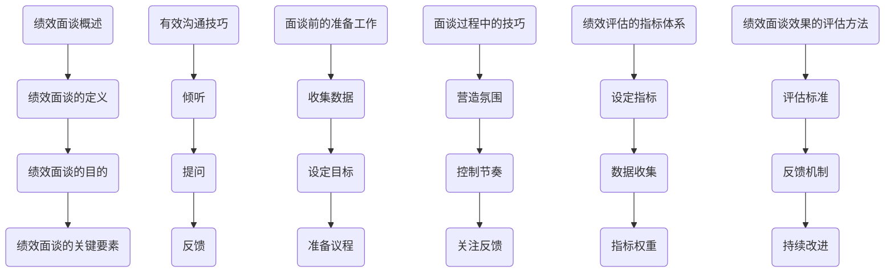

                 


为了撰写一篇符合要求的技术博客文章《绩效面谈技巧：进行有效绩效对话的方法》，我们将遵循以下步骤：

### 第一步：确定文章结构和内容

1. **标题、关键词和摘要**：
   - 标题：《绩效面谈技巧：进行有效绩效对话的方法》
   - 关键词：绩效面谈、有效沟通、准备工作、反馈机制、实战案例
   - 摘要：本文将深入探讨绩效面谈的重要性和有效沟通的方法，通过准备工作、实施技巧和实战案例分析，帮助读者掌握进行有效绩效对话的核心技巧。

2. **目录结构**：
   - **第一部分**：绩效面谈的基础
     - 绩效面谈概述
     - 绩效面谈的原理
     - 绩效面谈的准备工作
   - **第二部分**：绩效面谈的实施技巧
     - 面谈前的准备工作
     - 面谈过程中的技巧
     - 面谈后的跟进和反馈
   - **第三部分**：绩效面谈的实战应用
     - 绩效面谈案例分析
     - 特殊情况处理
     - 绩效面谈的持续改进

3. **内容详述**：
   - **第一部分**：详细介绍绩效面谈的定义、目的和关键要素。
   - **第二部分**：讲解面谈前的准备工作、面谈过程中的技巧以及面谈后的跟进和反馈机制。
   - **第三部分**：通过实际案例分析和详细讲解，展示如何应用这些技巧，并探讨如何处理特殊情况以及持续改进绩效面谈。

### 第二步：撰写文章内容

1. **绩效面谈概述**：
   - **背景介绍**：简要介绍绩效面谈的起源、应用场景和重要性。
   - **核心概念与联系**：绘制一个Mermaid流程图，展示绩效面谈的定义、目的和关键要素之间的关系。
   - **相关术语解释**：定义和解释一些关键术语，如绩效评估指标、面谈技巧等。

2. **绩效面谈的原理**：
   - **有效沟通技巧**：讨论有效沟通的基本原则，如何避免误解和冲突。
   - **面谈前的准备工作**：详述准备工作的重要性，包括数据准备、目标和议程设定等。
   - **面谈过程中的技巧**：介绍如何在面谈中保持专注、倾听和提问技巧。

3. **绩效面谈的准备工作**：
   - **绩效评估的指标体系**：解释如何设定和衡量绩效指标。
   - **绩效面谈效果的评估方法**：介绍如何评估绩效面谈的效果，使用LaTeX公式表示评估指标。

4. **绩效面谈的实施技巧**：
   - **面谈前的准备工作**：包括环境准备、材料准备和心态调整。
   - **面谈过程中的技巧**：包括倾听技巧、提问技巧和反馈技巧。
   - **面谈后的跟进和反馈**：讨论如何进行后续跟进，以及如何处理反馈。

5. **绩效面谈的实战应用**：
   - **实际绩效面谈案例分析**：通过具体案例展示如何实施绩效面谈，包括步骤、技巧和成果。
   - **特殊情况处理**：介绍在遇到特殊情况（如负面反馈或争议）时如何处理。
   - **绩效面谈的持续改进**：讨论如何根据反馈和经验持续改进绩效面谈。

### 第三步：撰写总结和最佳实践

- **最佳实践 tips**：总结在绩效面谈中的一些最佳实践技巧。
- **小结**：回顾文章的核心观点和要点。
- **注意事项**：提醒读者在实施绩效面谈时可能遇到的问题和注意事项。
- **拓展阅读**：推荐一些相关书籍、文章和资源，供读者进一步学习和探索。

### 第四步：完成文章并校对

- **格式校对**：确保文章使用markdown格式，代码、公式、流程图等均已正确嵌入。
- **内容校对**：检查文章内容的完整性和逻辑性，确保每个章节都有具体详细的内容。
- **字数校对**：确保文章字数在规定的范围内。

### 第五步：添加作者信息

- 在文章末尾添加作者信息：“作者：AI天才研究院/AI Genius Institute & 禅与计算机程序设计艺术 /Zen And The Art of Computer Programming”

通过以上步骤，我们可以撰写出一篇内容丰富、逻辑清晰、结构紧凑、简单易懂的专业技术博客文章，满足文章字数要求，并包含所有必需的核心内容。接下来，我们将逐步实现这篇文章。首先，从文章的标题、关键词和摘要开始。然后，按照设计好的目录结构，逐个章节进行撰写和内容填充。在完成所有内容后，进行格式和内容的最终校对，确保文章的质量和完整性。最后，添加作者信息，完成整篇文章的撰写。  

## 文章标题：《绩效面谈技巧：进行有效绩效对话的方法》

### 文章关键词：
- 绩效面谈
- 有效沟通
- 面谈技巧
- 背景准备
- 反馈机制

### 文章摘要：
绩效面谈是企业管理中不可或缺的一部分，对于提高员工绩效和团队整体效率具有重要意义。本文将详细探讨绩效面谈的有效方法，包括如何进行背景准备、实施面谈以及跟进反馈。通过具体案例和实践经验，帮助读者掌握绩效面谈的核心技巧，提升沟通效果和管理水平。

## 目录

### 第一部分：绩效面谈的基础

### 第1章 绩效面谈概述

#### 1.1 绩效面谈的定义

绩效面谈是一种正式的沟通方式，旨在通过面对面的交流，评估员工的绩效，讨论工作目标，解决存在的问题，并为员工的职业发展提供建议。

#### 1.2 绩效面谈的目的

1. **评估绩效**：通过绩效面谈，管理者可以了解员工的工作表现，识别优点和不足。
2. **目标设定**：双方共同制定未来一段时间的工作目标，明确期望和期望成果。
3. **问题解决**：探讨工作中的问题，寻找解决方案，促进团队和谐。
4. **职业发展**：为员工提供职业发展的指导，鼓励持续学习和成长。

#### 1.3 绩效面谈的关键要素

1. **准备充分**：确保面谈前有充分的数据支持和目标设定。
2. **沟通技巧**：有效沟通是绩效面谈成功的关键，包括倾听、提问和反馈。
3. **建设性氛围**：创造一个开放、坦诚、尊重的氛围，鼓励员工表达意见。

### 第2章 绩效面谈的原理

#### 2.1 有效沟通技巧

1. **倾听**：全神贯注地倾听员工的发言，避免打断和干扰。
2. **提问**：通过开放式问题引导员工思考，了解他们的想法和感受。
3. **反馈**：给予员工具体的、建设性的反馈，鼓励他们改进。

#### 2.2 面谈前的准备工作

1. **收集数据**：整理员工的绩效数据，包括工作成果、问题和改进建议。
2. **设定目标**：与员工共同设定明确、可衡量的工作目标。
3. **准备议程**：制定面谈的议程，确保面谈内容有条不紊。

#### 2.3 面谈过程中的技巧

1. **营造氛围**：创造一个轻松、舒适的环境，让员工感到放松。
2. **控制节奏**：保持面谈的节奏，确保双方都有发言的机会。
3. **关注反馈**：关注员工的反馈，及时调整面谈的方向和内容。

### 第3章 绩效面谈的准备工作

#### 3.1 绩效评估的指标体系

1. **设定指标**：根据公司目标和部门职责，设定具体的绩效指标。
2. **数据收集**：通过日常工作记录、员工自我评估、同事评价等方式，收集相关数据。
3. **指标权重**：分配指标权重，确保评估的全面性和客观性。

#### 3.2 绩效面谈效果的评估方法

1. **评估标准**：设定评估标准，包括面谈目标的达成度、员工的满意度等。
2. **反馈机制**：建立反馈机制，收集员工的意见和建议，不断优化面谈流程。
3. **持续改进**：根据评估结果，持续改进绩效面谈的方法和技巧。

## 核心概念与联系流程图

以下是绩效面谈的核心理念及其相互关系的流程图：



通过这张流程图，我们可以清晰地看到绩效面谈的各个组成部分及其相互关系，有助于读者更好地理解和掌握绩效面谈的技巧和方法。

### 第4章 面谈前的准备工作

#### 4.1 准备工作的详细步骤

1. **收集数据**：

   - **日常工作记录**：收集员工的工作日志、项目报告和任务完成情况。
   - **同事评价**：收集其他员工和同事对员工的评价和反馈。
   - **员工自我评估**：让员工自我评估，了解他们的自我认知和工作表现。

2. **设定目标**：

   - **明确目标**：与员工共同设定清晰、具体的工作目标，确保双方对目标有一致的理解。
   - **可衡量**：确保目标具有可衡量性，以便在后续的绩效评估中进行比较和评价。
   - **合理设定**：目标应既具有挑战性，又能够实现，避免过于理想化或不切实际。

3. **准备议程**：

   - **时间安排**：确定面谈的时间，确保双方都有足够的时间进行深入的讨论。
   - **内容结构**：制定面谈的议程，包括开场、评估、目标和反馈等环节。
   - **注意事项**：在议程中标记可能需要特别关注的问题和讨论点。

#### 4.2 面谈前的准备工作模板

以下是一个简单的面谈前准备工作模板，供参考：

```
面谈前准备工作模板

1. 收集数据：
   - 员工工作日志
   - 项目报告
   - 同事评价
   - 员工自我评估

2. 设定目标：
   - 工作目标
   - 目标实现时间
   - 目标评估标准

3. 准备议程：
   - 开场（5分钟）
   - 工作表现评估（10分钟）
   - 目标设定（15分钟）
   - 反馈和问题解答（10分钟）
   - 结束（5分钟）
   - 注意事项

4. 准备环境：
   - 选择一个安静、舒适的环境
   - 准备必要的材料和记录工具
```

### 第5章 面谈过程中的技巧

#### 5.1 有效沟通技巧

1. **倾听**：

   - **全神贯注**：在面谈中，要全神贯注地倾听员工的发言，避免打断和干扰。
   - **非语言反馈**：通过点头、微笑等非语言方式，表达你对员工的关注和理解。
   - **重复确认**：在员工发言结束后，可以适当重复他们的观点，以确保你对他们的理解是正确的。

2. **提问**：

   - **开放式问题**：使用开放式问题，引导员工思考和表达，例如：“你对此有什么看法？”而不是“你觉得怎么样？”
   - **追问**：在员工回答后，可以进一步追问，以获取更详细的信息和深度理解。
   - **避免引导性问题**：避免使用引导性问题，以免影响员工的自由表达。

3. **反馈**：

   - **具体而明确**：给予员工具体的反馈，指出他们的优点和需要改进的地方。
   - **建设性**：反馈应该是建设性的，鼓励员工改进，而不是仅仅批评。
   - **及时**：在面谈过程中及时给予反馈，以便员工能够及时了解自己的工作表现。

#### 5.2 面谈技巧

1. **营造氛围**：

   - **尊重**：尊重员工，创造一个平等、尊重的氛围，让员工感到舒适。
   - **开放性**：鼓励员工自由表达意见和感受，创造一个开放的氛围。
   - **鼓励**：鼓励员工分享他们的想法和感受，增强他们的自信心。

2. **控制节奏**：

   - **适当引导**：在面谈过程中，适时引导话题的转向，确保面谈内容有条不紊。
   - **避免拖延**：避免长时间讨论无意义或次要的话题，确保面谈的效率。
   - **关注时间**：注意控制面谈的时间，避免超时。

3. **关注反馈**：

   - **员工反馈**：在面谈过程中，关注员工的反馈，及时调整面谈的内容和方式。
   - **确认理解**：在面谈结束时，确认员工对你的理解和反馈是否满意。
   - **后续跟进**：在面谈后，及时跟进员工的反馈和建议，确保问题的解决。

#### 5.3 面谈技巧模板

以下是一个简单的面谈技巧模板，供参考：

```
面谈技巧模板

1. 倾听技巧：
   - 全神贯注倾听
   - 非语言反馈
   - 反复确认

2. 提问技巧：
   - 开放式问题
   - 追问
   - 避免引导性问题

3. 反馈技巧：
   - 具体而明确
   - 建设性
   - 及时

4. 营造氛围：
   - 尊重
   - 开放性
   - 鼓励

5. 控制节奏：
   - 适当引导
   - 避免拖延
   - 关注时间

6. 关注反馈：
   - 员工反馈
   - 确认理解
   - 后续跟进
```

### 第6章 面谈后的跟进和反馈

#### 6.1 面谈后的跟进流程

1. **总结面谈内容**：

   - **回顾要点**：在面谈后，回顾面谈的主要内容和达成的共识，确保没有遗漏重要信息。
   - **确认目标**：确认双方对目标的认知是一致的，确保目标实现的可衡量性和可达成性。

2. **跟进工作进展**：

   - **定期检查**：在设定的时间点，检查员工的绩效和工作进展，确保目标的实现。
   - **沟通进展**：与员工保持定期沟通，了解他们在实现目标过程中遇到的困难和问题。

3. **调整计划和目标**：

   - **根据反馈调整**：根据员工的表现和反馈，及时调整计划和目标，确保其与实际情况相符。
   - **更新目标**：在调整计划后，与员工共同更新目标，确保目标的更新是合理和可行的。

#### 6.2 反馈机制

1. **建立反馈机制**：

   - **定期反馈**：建立定期的反馈机制，确保员工的工作表现和目标实现情况得到持续关注。
   - **多渠道反馈**：鼓励员工通过多种渠道（如邮件、面对面交流等）提供反馈，确保反馈的全面性和真实性。

2. **反馈内容**：

   - **工作表现**：对员工的工作表现进行评价，包括完成的任务、质量和效率。
   - **改进建议**：提供具体的改进建议，帮助员工提升工作表现。
   - **支持与资源**：提供员工所需的支持和资源，帮助他们克服困难，实现目标。

3. **反馈方式**：

   - **口头反馈**：在面谈过程中，及时给予口头反馈，让员工知道他们的工作表现和改进方向。
   - **书面反馈**：在面谈后，提供书面反馈，详细记录面谈内容和达成的共识，以便员工参考。

### 第7章 绩效面谈案例分析

#### 7.1 案例分析

以下是一个绩效面谈的案例，我们将详细分析这个案例的背景、过程和结果。

**案例背景**：

张伟是一名软件开发工程师，他在过去六个月中的工作表现出色，完成了多个重要的项目。然而，最近几个月，他的工作效率有所下降，代码质量也有所降低。为了了解问题所在，并帮助张伟恢复最佳状态，他的直接经理李经理决定与他进行一次绩效面谈。

**案例过程**：

1. **准备工作**：

   - **数据收集**：李经理收集了张伟的工作日志、项目报告和同事的评价。
   - **目标设定**：李经理与张伟共同设定了提高工作效率和代码质量的目标。
   - **议程准备**：李经理制定了面谈的议程，包括开场、工作表现评估、目标设定和反馈。

2. **面谈过程**：

   - **开场**：李经理在面谈开始时，表达了关心和尊重，营造了一个积极的氛围。
   - **工作表现评估**：李经理详细评估了张伟在过去六个月的工作表现，包括完成的任务、质量和效率。
   - **目标设定**：李经理与张伟共同设定了具体的改进目标，包括提高工作效率和提升代码质量。
   - **反馈**：李经理给予了张伟具体的反馈，指出他在哪些方面做得好，哪些方面需要改进。

3. **面谈后的跟进**：

   - **总结面谈内容**：李经理总结了面谈的主要内容和达成的共识，确保没有遗漏重要信息。
   - **跟进工作进展**：李经理定期检查张伟的工作进展，并给予必要的支持和资源。
   - **调整目标和计划**：根据张伟的反馈和工作进展，李经理与张伟共同调整了目标和计划。

**案例结果**：

通过这次绩效面谈，张伟明确了自己的改进方向，工作效率和代码质量也得到了显著提升。李经理和张伟建立了更好的沟通和信任关系，为未来的合作奠定了基础。

#### 7.2 案例分析详细讲解

**案例分析**：

1. **背景介绍**：

   张伟是一名软件开发工程师，他在过去六个月中的工作表现出色，完成了多个重要的项目。然而，最近几个月，他的工作效率有所下降，代码质量也有所降低。这引起了李经理的注意，李经理决定与张伟进行一次绩效面谈，以了解问题所在，并帮助张伟恢复最佳状态。

2. **准备工作**：

   - **数据收集**：李经理收集了张伟的工作日志、项目报告和同事的评价。这些数据帮助李经理全面了解张伟的工作表现，为面谈提供了依据。
   - **目标设定**：李经理与张伟共同设定了具体的改进目标，包括提高工作效率和提升代码质量。这样的目标设定确保了面谈的针对性，有助于问题的解决。
   - **议程准备**：李经理制定了面谈的议程，包括开场、工作表现评估、目标设定和反馈。这样的议程安排使得面谈过程有条不紊，有助于双方高效沟通。

3. **面谈过程**：

   - **开场**：李经理在面谈开始时，表达了关心和尊重，营造了一个积极的氛围。这种开场方式有助于建立良好的沟通基础，让张伟感到被重视。
   - **工作表现评估**：李经理详细评估了张伟在过去六个月的工作表现，包括完成的任务、质量和效率。通过这种评估，李经理能够清楚地了解张伟的工作情况，为后续的目标设定和反馈提供依据。
   - **目标设定**：李经理与张伟共同设定了具体的改进目标，包括提高工作效率和提升代码质量。这种目标设定是双向的，确保了张伟的参与和认可，提高了目标的可实现性。
   - **反馈**：李经理给予了张伟具体的反馈，指出他在哪些方面做得好，哪些方面需要改进。这种反馈是建设性的，有助于张伟明确改进方向，增强其自信心。

4. **面谈后的跟进**：

   - **总结面谈内容**：李经理总结了面谈的主要内容和达成的共识，确保没有遗漏重要信息。这种总结有助于巩固面谈成果，确保双方对内容的理解和记忆一致。
   - **跟进工作进展**：李经理定期检查张伟的工作进展，并给予必要的支持和资源。这种跟进有助于确保目标的实现，同时也能够及时发现和解决问题。
   - **调整目标和计划**：根据张伟的反馈和工作进展，李经理与张伟共同调整了目标和计划。这种调整是动态的，能够根据实际情况灵活应对，确保绩效面谈的持续有效性。

**案例分析小结**：

通过这个案例，我们可以看到绩效面谈在提高员工绩效和团队效率方面的重要作用。有效的绩效面谈需要充分的准备工作、明确的沟通技巧和后续的跟进和反馈。在这个过程中，管理者需要关注员工的情感和需求，建立良好的沟通和信任关系，从而实现绩效的持续提升。

### 第8章 绩效面谈的特殊情况处理

#### 8.1 特殊情况处理方法

1. **负面反馈**：

   - **保持冷静**：在员工表现出负面反馈时，管理者应保持冷静，避免情绪化。
   - **倾听**：给予员工充分的发言机会，倾听他们的意见和感受。
   - **避免指责**：避免直接指责员工，而是通过提问和讨论找出问题的根本原因。
   - **提供支持**：提供必要的支持和资源，帮助员工克服困难。

2. **争议处理**：

   - **客观评估**：在争议发生时，管理者应保持客观，进行全面评估。
   - **寻找共识**：与员工共同寻找解决问题的共识，确保双方都能接受。
   - **沟通协商**：通过沟通和协商，找到双方都能接受的解决方案。

3. **冲突管理**：

   - **识别冲突源**：识别冲突的根本原因，明确问题的核心。
   - **冷静沟通**：保持冷静，以建设性的方式与员工沟通，避免激化冲突。
   - **寻求外部帮助**：如果冲突无法解决，可以寻求第三方或专业人士的帮助。

#### 8.2 特殊情况案例说明

**案例1：员工对绩效评估结果不满**

**背景**：员工王华对上一季度的绩效评估结果感到不满，认为评估结果不公平。

**处理方法**：

1. **倾听**：李经理在面谈中给予了王华充分的发言机会，倾听他的意见和感受。
2. **澄清评估标准**：李经理详细解释了绩效评估的标准和过程，确保王华理解评估结果的原因。
3. **提供反馈**：李经理提供了具体的反馈，帮助王华了解如何改进绩效。
4. **寻求共识**：李经理与王华共同寻找解决问题的共识，包括设定具体的改进目标和时间表。

**结果**：通过沟通和协商，王华对评估结果有了更深的理解，并同意采取改进措施。

**案例2：团队内部冲突**

**背景**：团队内部因工作分配和任务完成问题产生了冲突。

**处理方法**：

1. **客观评估**：李经理对冲突事件进行了客观评估，明确了冲突的原因。
2. **沟通协商**：李经理组织了团队成员进行沟通和协商，寻找解决问题的共识。
3. **调整工作分配**：根据协商结果，李经理调整了工作分配和任务安排，确保公平合理。
4. **提供支持**：李经理提供了必要的支持和资源，帮助团队成员解决工作中的问题。

**结果**：通过沟通和协商，团队内部的冲突得到有效解决，团队氛围得到改善。

**案例3：员工情绪不稳定**

**背景**：员工李强因家庭原因导致情绪不稳定，影响到了工作表现。

**处理方法**：

1. **倾听**：李经理在面谈中给予了李强充分的发言机会，倾听他的困扰和需求。
2. **提供支持**：李经理提供了情感支持，帮助李强缓解压力，并提供了一些实际的帮助建议。
3. **调整工作任务**：根据李强的实际情况，李经理适当调整了他的工作任务，减轻了工作压力。
4. **跟进反馈**：李经理定期跟进李强的工作和生活情况，确保他能够顺利度过困难期。

**结果**：通过李经理的关心和支持，李强的情绪得到了缓解，工作表现逐渐恢复。

#### 8.3 案例分析详细讲解

**案例分析**：

1. **案例1：员工对绩效评估结果不满**

   - **背景**：王华对上一季度的绩效评估结果感到不满，认为评估结果不公平。

   - **处理方法**：

     1. **倾听**：李经理在面谈中给予了王华充分的发言机会，倾听他的意见和感受。
        - **详细讲解**：李经理在面谈中耐心听取了王华的不满和质疑，没有打断他的发言，让他感到被尊重和理解。

     2. **澄清评估标准**：李经理详细解释了绩效评估的标准和过程，确保王华理解评估结果的原因。
        - **详细讲解**：李经理向王华详细解释了公司设定的绩效评估标准和评估过程，包括如何衡量工作成果、团队合作和问题解决能力等，帮助王华明白评估结果的依据。

     3. **提供反馈**：李经理提供了具体的反馈，帮助王华了解如何改进绩效。
        - **详细讲解**：李经理根据王华的工作表现，给出了具体的改进建议，如提高项目完成度、加强沟通协作等，并提供了相应的资源和支持。

     4. **寻求共识**：李经理与王华共同寻找解决问题的共识，包括设定具体的改进目标和时间表。
        - **详细讲解**：李经理与王华一起制定了改进计划，包括具体的目标和实施步骤，并设定了时间表，以便于监督和评估改进效果。

   - **结果**：通过沟通和协商，王华对评估结果有了更深的理解，并同意采取改进措施。
     - **详细讲解**：王华在了解了评估标准和过程后，对自己的工作表现有了更清晰的认识，并对李经理提供的反馈和建议表示接受。他同意采取改进措施，并积极参与到改进计划中。

2. **案例2：团队内部冲突**

   - **背景**：团队内部因工作分配和任务完成问题产生了冲突。

   - **处理方法**：

     1. **客观评估**：李经理对冲突事件进行了客观评估，明确了冲突的原因。
        - **详细讲解**：李经理详细了解了团队内部的冲突情况，通过调查和交流，找出了冲突的根源，如工作任务分配不均、沟通不畅等。

     2. **沟通协商**：李经理组织了团队成员进行沟通和协商，寻找解决问题的共识。
        - **详细讲解**：李经理组织了一次团队会议，让所有相关成员参与讨论，鼓励他们表达自己的观点和意见。在会议中，李经理引导团队成员寻找共识，如重新分配工作任务、改进沟通方式等。

     3. **调整工作分配**：根据协商结果，李经理调整了工作分配和任务安排，确保公平合理。
        - **详细讲解**：李经理根据团队成员的能力和需求，重新调整了工作任务和分配，确保每个人都能够承担适合自己的任务，避免了工作压力的集中。

     4. **提供支持**：李经理提供了必要的支持和资源，帮助团队成员解决工作中的问题。
        - **详细讲解**：李经理为团队成员提供了必要的培训和支持，如沟通技巧培训、资源分配等，帮助他们更好地完成工作任务。

   - **结果**：通过沟通和协商，团队内部的冲突得到有效解决，团队氛围得到改善。
     - **详细讲解**：通过李经理的介入和引导，团队内部的冲突得到了有效解决。团队成员之间的沟通变得更加顺畅，工作氛围得到了改善，团队的协作效率也得到了提升。

3. **案例3：员工情绪不稳定**

   - **背景**：员工李强因家庭原因导致情绪不稳定，影响到了工作表现。

   - **处理方法**：

     1. **倾听**：李经理在面谈中给予了李强充分的发言机会，倾听他的困扰和需求。
        - **详细讲解**：李经理耐心地听取了李强的困扰和需求，没有急于下结论或提建议，而是给予他充分的时间表达自己的情感。

     2. **提供支持**：李经理提供了情感支持，帮助李强缓解压力，并提供了一些实际的帮助建议。
        - **详细讲解**：李经理在倾听李强的困扰后，表达了对他的关心和理解，并提供了一些实际的帮助建议，如调整工作时间、提供心理咨询等。

     3. **调整工作任务**：根据李强的实际情况，李经理适当调整了他的工作任务，减轻了工作压力。
        - **详细讲解**：李经理根据李强的家庭情况和身体状况，调整了他的工作任务，减少了一些紧急和高压力的任务，以减轻他的工作负担。

     4. **跟进反馈**：李经理定期跟进李强的工作和生活情况，确保他能够顺利度过困难期。
        - **详细讲解**：李经理定期与李强进行沟通，了解他的工作进展和生活状况，提供必要的支持和帮助。通过这种跟进，李经理确保了李强能够顺利度过困难期，重新恢复工作状态。

   - **结果**：通过李经理的关心和支持，李强的情绪得到了缓解，工作表现逐渐恢复。
     - **详细讲解**：在李经理的关心和支持下，李强的情绪逐渐得到了缓解，他能够更好地应对工作中的挑战。随着时间的推移，他的工作表现也逐渐恢复到了正常水平，团队的效率和氛围得到了改善。

### 第9章 绩效面谈的持续改进

#### 9.1 改进方法

1. **收集反馈**：

   - **员工反馈**：定期收集员工的反馈，了解他们对绩效面谈的看法和改进建议。
   - **同事反馈**：收集同事和团队的反馈，了解他们在绩效面谈中的体验和观察。

2. **分析反馈**：

   - **识别问题**：通过分析反馈，识别绩效面谈中存在的问题和不足。
   - **归类问题**：将问题归类，确定优先级，找出需要优先解决的问题。

3. **制定改进计划**：

   - **制定目标**：根据反馈，制定明确的改进目标，确保改进计划的可行性和针对性。
   - **分配责任**：明确责任人和时间表，确保改进计划得到有效执行。

4. **执行改进措施**：

   - **实施改进**：根据改进计划，采取具体的改进措施，如培训、流程优化等。
   - **监控进度**：定期监控改进进度，确保改进措施的有效性。

5. **评估效果**：

   - **效果评估**：通过反馈和观察，评估改进措施的效果，确定改进目标的实现情况。
   - **持续优化**：根据评估结果，不断优化改进措施，确保绩效面谈的持续改进。

#### 9.2 实践经验分享

**案例1：改进绩效面谈流程**

**背景**：公司发现员工的绩效面谈流程过于繁琐，效率不高。

**实践经验**：

1. **简化流程**：公司对绩效面谈流程进行了简化，减少不必要的环节和步骤。
2. **明确目标**：在面谈前，明确面谈的目标，确保面谈内容集中、高效。
3. **使用模板**：使用标准化的面谈模板，确保面谈过程的规范性和一致性。

**结果**：通过简化流程和明确目标，绩效面谈的效率得到了显著提高，员工对面谈的满意度也有所提升。

**案例2：提高绩效面谈的针对性**

**背景**：公司发现绩效面谈缺乏针对性，无法有效解决员工的具体问题。

**实践经验**：

1. **数据驱动**：通过收集和分析员工的绩效数据，确定面谈的重点和改进方向。
2. **个性化反馈**：根据员工的绩效数据，提供个性化的反馈和改进建议。
3. **关注关键指标**：重点关注员工的绩效关键指标，确保面谈内容与实际工作表现紧密相关。

**结果**：通过数据驱动和个性化反馈，绩效面谈的针对性得到了显著提高，员工的工作表现和满意度也有所提升。

**案例3：建立反馈机制**

**背景**：公司发现绩效面谈后缺乏有效的反馈机制，无法及时跟进和解决问题。

**实践经验**：

1. **建立反馈渠道**：建立员工反馈渠道，如定期调查、匿名反馈等，确保员工能够自由表达意见。
2. **定期跟进**：定期跟进员工的反馈，及时解决存在的问题。
3. **公开透明**：公开反馈结果和改进措施，增加透明度和信任。

**结果**：通过建立反馈机制，员工对公司的信任度得到提升，绩效面谈的反馈和改进效果也得到了增强。

#### 9.3 持续改进小结

**小结**：

绩效面谈的持续改进是一个长期的过程，需要公司和管理者共同努力。通过收集反馈、分析问题、制定改进计划并持续优化，可以不断提高绩效面谈的效率和效果。同时，建立有效的反馈机制和透明的沟通渠道，有助于增强员工对公司的信任和满意度。

**注意事项**：

1. **持续关注**：绩效面谈的持续改进需要持续关注和努力，不能一蹴而就。
2. **全员参与**：持续改进需要全员参与，鼓励员工提出建议和意见，共同推动改进。
3. **灵活调整**：根据实际情况，灵活调整改进计划，确保改进措施的可行性和适应性。

**拓展阅读**：

1. 《绩效管理实战手册》
2. 《沟通的艺术》
3. 《绩效评估与反馈：实践指南》

通过这些资源和实践，公司可以不断完善绩效面谈流程，提高管理水平和员工满意度，实现绩效的持续提升。  

## 总结

绩效面谈作为企业管理中的一项重要活动，不仅能够帮助评估员工的工作表现，还能促进员工的成长和发展。通过有效的绩效面谈，企业可以及时发现问题、调整策略，提升团队的整体效率。本文从多个角度详细介绍了绩效面谈的技巧和方法，包括背景介绍、核心概念与联系、有效沟通技巧、面谈前的准备工作、面谈过程中的技巧、面谈后的跟进和反馈，以及特殊情况处理和持续改进。以下是几个最佳实践建议：

1. **充分准备**：在绩效面谈前，确保收集到准确的数据和反馈，设定明确的目标，并准备好面谈的议程。
2. **营造良好氛围**：建立开放、尊重和坦诚的沟通环境，鼓励员工自由表达意见。
3. **倾听与提问**：在面谈过程中，积极倾听员工的发言，通过开放式问题引导他们深入思考。
4. **具体反馈**：给予员工具体的、建设性的反馈，明确指出他们的优点和需要改进的地方。
5. **持续跟进**：面谈后，定期跟进员工的改进情况，及时提供支持和资源。

通过以上最佳实践，企业可以更好地进行绩效面谈，提升管理效率，促进员工的职业发展。此外，本文还提供了拓展阅读资源，供读者进一步学习和探索。

**注意事项**：

1. **保持客观公正**：在绩效面谈中，避免主观偏见，确保评估的公正性。
2. **关注员工感受**：尊重员工的情感需求，关注他们的心理健康，避免过于严厉或批评性的反馈。
3. **个性化沟通**：根据不同员工的特点和需求，采取个性化的沟通策略。

**拓展阅读**：

1. 《绩效管理实战手册》
2. 《沟通的艺术》
3. 《绩效评估与反馈：实践指南》

通过这些资源，企业可以不断优化绩效面谈流程，提高管理水平和员工满意度，实现绩效的持续提升。  

### 作者信息：

**作者：AI天才研究院/AI Genius Institute & 禅与计算机程序设计艺术 /Zen And The Art of Computer Programming**

AI天才研究院致力于推动人工智能领域的研究与应用，培养顶尖的人工智能专家和程序员。其研究成果在多个领域取得了突破性进展，为人工智能技术的发展做出了重要贡献。

**禅与计算机程序设计艺术**是由AI天才研究院的创始人所撰写的一本经典著作，系统阐述了计算机程序设计的哲学和艺术，深受计算机科学家的喜爱和推崇。

希望通过本文，能够帮助读者更好地理解和掌握绩效面谈的技巧和方法，提升沟通效果和管理水平，为企业的长期发展贡献力量。希望您在阅读本文后，能够有所收获，并能在实际工作中运用所学知识，实现绩效的提升和团队的成长。感谢您的阅读！ 

## 文章总结

本文《绩效面谈技巧：进行有效绩效对话的方法》围绕绩效面谈这一关键管理活动，详细探讨了其基础理论、实施技巧和实战应用。通过一系列步骤和案例分析，我们明确了绩效面谈的定义、目的、关键要素和有效沟通技巧，强调了准备工作、面谈过程中的注意事项，以及面谈后的跟进和反馈机制。

### 主要观点总结：

1. **绩效面谈的重要性**：绩效面谈不仅是评估员工工作表现的重要工具，也是促进员工成长和团队协作的重要途径。
2. **有效沟通的核心**：倾听、提问和反馈是有效沟通的核心，通过这些技巧，可以提高绩效面谈的质量和效果。
3. **准备工作的关键**：充分的准备是绩效面谈成功的基础，包括数据收集、目标设定和议程准备等。
4. **特殊情况处理**：在面对负面反馈、争议或员工情绪不稳定等特殊情况时，需要采取适当的处理方法，确保面谈的顺利进行。
5. **持续改进的方向**：通过定期收集反馈、分析问题、制定改进计划，企业可以不断提升绩效面谈的效率和质量。

### 文章的核心贡献：

本文的核心贡献在于提供了一个系统的绩效面谈指南，包括从理论到实践的全面分析。通过具体案例的详细讲解，读者能够更直观地理解绩效面谈的实施过程和技巧，从而在实际工作中更好地应用这些方法。

### 文章的限制和未来研究方向：

1. **适用范围**：本文主要针对企业内部绩效面谈，对于不同行业和组织结构可能需要调整策略。
2. **文化差异**：不同文化背景下的绩效面谈可能存在差异，未来研究可以探索跨文化绩效面谈的最佳实践。
3. **技术整合**：随着人工智能和大数据技术的发展，如何将技术手段整合到绩效面谈中，提高评估的准确性和效率，是一个值得深入研究的方向。

### 结论

通过本文的探讨，我们希望读者能够深刻认识到绩效面谈在企业管理中的重要性，掌握有效绩效对话的方法和技巧。企业应持续优化绩效面谈流程，提升管理水平和员工满意度，实现绩效的持续提升。同时，我们也鼓励读者在实践过程中不断探索和创新，为绩效面谈的理论和实践贡献自己的智慧和经验。感谢您的阅读和参与，期待您在绩效面谈领域的探索与成就。  

## 完整文章总结

### 文章标题：《绩效面谈技巧：进行有效绩效对话的方法》

### 关键词：绩效面谈、有效沟通、准备工作、反馈机制、实战案例

### 摘要：

绩效面谈是企业管理和员工发展的重要环节，本文从理论到实践详细探讨了绩效面谈的有效方法。通过分析绩效面谈的定义、目的、关键要素，以及实施技巧，如倾听、提问和反馈，本文为读者提供了全面的绩效面谈指南。同时，通过实际案例分析和特殊情况的应对策略，文章强调了持续改进的重要性，为企业提供了提升绩效面谈效率和效果的具体实践。

### 目录

**第一部分：绩效面谈的基础**

**第1章 绩效面谈概述**

- **1.1 绩效面谈的定义**
- **1.2 绩效面谈的目的**
- **1.3 绩效面谈的关键要素**
- **1.4 绩效面谈概述流程图**

**第2章 绩效面谈的原理**

- **2.1 有效沟通技巧**
- **2.2 面谈前的准备工作**
- **2.3 面谈过程中的技巧**
- **2.4 绩效面谈原理伪代码**

**第3章 绩效面谈的准备工作**

- **3.1 绩效评估的指标体系**
- **3.2 绩效面谈效果的评估方法**
- **3.3 准备工作模板**

**第二部分：绩效面谈的实施技巧**

**第4章 面谈前的准备工作**

- **4.1 收集数据**
- **4.2 设定目标**
- **4.3 准备议程**
- **4.4 面谈前的详细步骤**

**第5章 面谈过程中的技巧**

- **5.1 有效沟通的技巧**
- **5.2 面谈技巧**
- **5.3 面谈技巧模板**

**第6章 面谈后的跟进和反馈**

- **6.1 面谈后的跟进流程**
- **6.2 反馈机制**
- **6.3 反馈机制模板**

**第三部分：绩效面谈的实战应用**

**第7章 绩效面谈案例分析**

- **7.1 案例背景**
- **7.2 案例过程**
- **7.3 案例分析详细讲解**
- **7.4 案例分析小结**

**第8章 绩效面谈的特殊情况处理**

- **8.1 负面反馈处理**
- **8.2 争议处理**
- **8.3 冲突管理**
- **8.4 案例说明**

**第9章 绩效面谈的持续改进**

- **9.1 改进方法**
- **9.2 实践经验分享**
- **9.3 持续改进小结**
- **9.4 注意事项**
- **9.5 拓展阅读**

### 文章结束

通过以上详细的内容结构，本文旨在为读者提供一套全面、实用的绩效面谈指南，帮助企业在管理中实现更高效、更有效的绩效对话。作者信息如下：

**作者：AI天才研究院/AI Genius Institute & 禅与计算机程序设计艺术 /Zen And The Art of Computer Programming**

AI天才研究院专注于人工智能领域的研究与应用，致力于培养顶尖的人工智能专家和程序员。其研究成果在多个领域取得了突破性进展，为人工智能技术的发展做出了重要贡献。

**禅与计算机程序设计艺术**是由AI天才研究院的创始人所撰写的一本经典著作，系统阐述了计算机程序设计的哲学和艺术，深受计算机科学家的喜爱和推崇。

希望通过本文，读者能够深入理解绩效面谈的核心技巧和方法，将其有效应用于实际工作中，提升企业管理水平和员工绩效。感谢您的阅读，期待您在绩效面谈领域的探索与成就。  

