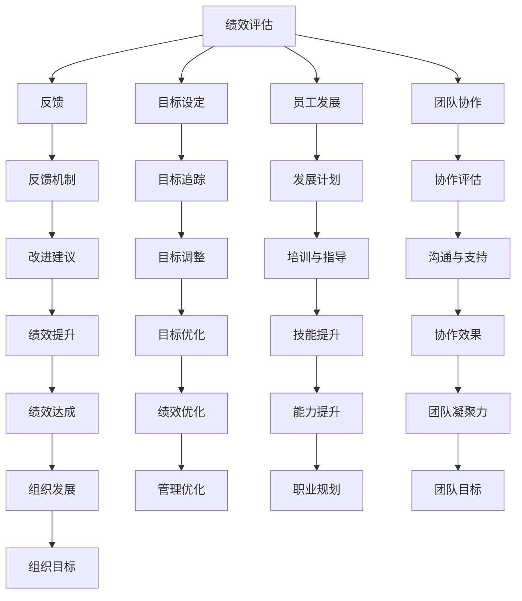

                 


### 文章标题：绩效面谈：进行有效的绩效对话

### 关键词：
- 绩效面谈
- 沟通技巧
- 绩效评估
- 员工管理
- 组织发展

### 摘要：
本文旨在深入探讨绩效面谈的重要性和实践方法。通过详细的背景介绍、核心概念的联系、算法原理讲解、数学模型和公式解析、项目实战以及最佳实践，帮助读者掌握有效的绩效对话技巧，提升团队绩效和组织发展。

---

# 绩效面谈：进行有效的绩效对话

## 引言

在当今快速变化的工作环境中，绩效管理已成为组织成功的关键因素。绩效面谈作为绩效管理的重要组成部分，对于员工个人发展、团队协作和组织目标实现具有不可替代的作用。然而，如何进行有效的绩效面谈，却是一个令许多管理人员感到困惑的课题。

本文将围绕绩效面谈的核心概念、实践技巧和案例分析，帮助读者理解并掌握有效的绩效对话技巧。文章将从以下几个方面展开：

1. **背景介绍**：探讨绩效面谈的起源、重要性及其在现代管理中的应用。
2. **核心概念与联系**：介绍绩效面谈的核心概念，并使用Mermaid流程图展示各概念之间的关系。
3. **绩效评估与绩效面谈**：详细讲解绩效评估的方法、流程及其与绩效面谈的关联。
4. **沟通技巧**：介绍有效的沟通技巧，包括倾听、反馈、提问和回答等。
5. **实战技巧与案例分析**：通过实际案例展示如何在不同情况下进行绩效面谈。
6. **应对挑战**：讨论绩效面谈中可能遇到的挑战及应对策略。
7. **项目实战**：提供具体的绩效面谈实战指导，包括环境搭建、源代码实现和案例分析。
8. **最佳实践**：总结绩效面谈的最佳实践，并提出注意事项和拓展阅读建议。

## 背景介绍

### 绩效面谈的起源与发展

绩效面谈作为一种管理工具，起源于20世纪早期的工业革命时期。当时，随着企业规模的扩大和生产线的自动化，管理人员需要更有效地监督和指导员工的工作。绩效面谈作为一种面对面的沟通方式，能够及时了解员工的工作表现，发现潜在问题，并制定改进措施。

随着时间的推移，绩效面谈逐渐发展成为现代绩效管理的重要组成部分。在21世纪，随着人力资源管理理论和技术的不断进步，绩效面谈的形式和内容也在不断演变。现代绩效面谈不仅关注员工的工作成果，更注重员工的个人发展、职业规划和团队协作。

### 绩效面谈的重要性

绩效面谈在组织管理中具有多重重要作用：

1. **促进员工成长**：通过绩效面谈，员工能够及时了解自己的工作表现，明确改进方向，提升个人能力。
2. **增强团队协作**：绩效面谈有助于加强团队成员之间的沟通，促进相互理解和支持，提升团队整体绩效。
3. **优化组织发展**：通过绩效面谈，组织能够识别优秀员工，激励他们发挥更大的潜力，同时针对绩效不佳的员工提供改进建议，促进组织整体发展。

### 绩效面谈在现代管理中的应用

在现代企业管理中，绩效面谈被广泛应用于以下几个方面：

1. **年度评估**：每年一次的绩效面谈，通常用于对员工一年来的工作表现进行评估和反馈。
2. **项目评估**：在特定项目完成后，通过绩效面谈对项目团队成员的表现进行总结和评估。
3. **晋升与发展**：通过绩效面谈，管理层能够评估员工的晋升潜力和职业发展需求，为员工提供晋升和发展机会。
4. **员工离职面谈**：在员工离职时，通过面谈了解离职原因，为组织改进管理和工作环境提供参考。

## 核心概念与联系

### 绩效面谈的核心概念

绩效面谈涉及多个核心概念，这些概念相互关联，构成了绩效面谈的理论基础。以下是绩效面谈的几个关键概念：

1. **绩效评估**：绩效评估是对员工工作表现的客观衡量，通常包括工作质量、工作效率、团队协作等多个维度。
2. **反馈**：反馈是绩效面谈的重要组成部分，通过反馈，员工能够了解自己的工作表现，识别改进机会。
3. **目标设定**：目标设定是绩效面谈的目标之一，通过设定明确的绩效目标，员工能够更有针对性地开展工作。
4. **员工发展**：员工发展是绩效面谈的长远目标，通过持续的绩效面谈，组织能够帮助员工实现职业成长。
5. **团队协作**：团队协作是绩效面谈的重要影响因素，良好的团队协作有助于提升整体绩效。

### 绩效面谈概念之间的关系架构

为了更好地理解绩效面谈的核心概念及其相互关系，我们可以使用Mermaid流程图来展示它们之间的逻辑架构：



通过上述Mermaid流程图，我们可以清晰地看到绩效面谈各核心概念之间的逻辑关系。这些概念相互关联，共同构成了绩效面谈的理论体系。

## 绩效评估与绩效面谈

### 绩效评估的方法

绩效评估是绩效面谈的重要基础。为了进行有效的绩效面谈，管理者需要了解并掌握多种绩效评估方法。以下是几种常见的绩效评估方法：

1. **KPI（关键绩效指标）**：KPI是衡量员工工作绩效的关键指标。通过设定明确的KPI，管理者可以量化员工的工作表现。
2. **360度评估**：360度评估是一种综合评估方法，通过收集来自员工、同事、上级和下属的反馈，全面评估员工的工作表现。
3. **行为锚定评估法（BARS）**：BARS是一种基于行为的评估方法，通过将工作行为与特定的行为锚点进行对比，评估员工的行为表现。
4. **目标管理法（MBO）**：MBO是一种以目标为导向的评估方法，通过设定具体的绩效目标，激励员工努力达成目标。

### 绩效面谈与评估结果的应用

绩效面谈是将评估结果转化为实际行动的关键环节。在绩效面谈中，管理者需要根据评估结果，与员工进行深入的沟通和讨论。以下是绩效面谈与评估结果应用的具体步骤：

1. **总结评估结果**：在面谈开始时，管理者应简要总结评估结果，让员工了解自己的工作表现。
2. **探讨反馈**：管理者应详细解释评估结果中的反馈，帮助员工理解自己的优势和需要改进的地方。
3. **设定目标**：根据评估结果，管理者应与员工共同制定新的绩效目标，确保目标的明确性和可实现性。
4. **讨论发展计划**：管理者应与员工探讨长期发展计划，包括培训、晋升和职业规划等。
5. **制定改进措施**：管理者应与员工共同制定具体的改进措施，帮助员工提升工作表现。

### 绩效面谈的重要性

绩效面谈不仅是对员工过去工作表现的总结，更是对未来工作的规划和指导。以下是绩效面谈的重要作用：

1. **提升员工自我认知**：通过绩效面谈，员工可以更清晰地了解自己的工作表现，找到提升自己的方向。
2. **增强团队凝聚力**：通过绩效面谈，团队成员可以更好地理解彼此的工作重点，促进团队协作。
3. **促进组织发展**：通过绩效面谈，组织可以及时发现和解决绩效问题，提升整体绩效。

## 沟通技巧

### 倾听与反馈

倾听和反馈是绩效面谈中至关重要的沟通技巧。有效的倾听可以帮助管理者更好地理解员工的需求和意见，而及时的反馈则可以帮助员工了解自己的工作表现和改进方向。

1. **倾听技巧**：
   - **全神贯注**：在面谈过程中，管理者应全神贯注地倾听员工的发言，避免分心。
   - **肢体语言**：通过点头、微笑等肢体语言，表示对员工的尊重和理解。
   - **避免打断**：在员工发言时，避免打断他们的思路，让他们充分表达自己的想法。

2. **反馈技巧**：
   - **具体而明确**：在反馈时，管理者应具体而明确地指出员工的优点和不足，避免模糊的表述。
   - **正面反馈为主**：在反馈中，应多以正面反馈为主，鼓励员工保持优秀表现。
   - **提出改进建议**：在指出不足时，应提出具体的改进建议，帮助员工提升工作表现。

### 提问与回答

提问和回答是绩效面谈中的核心环节。有效的提问可以帮助管理者了解员工的实际工作情况，而恰如其分的回答则可以帮助员工更好地理解评估结果和发展方向。

1. **提问技巧**：
   - **开放性问题**：使用开放性问题，鼓励员工表达自己的观点和想法。
   - **封闭性问题**：在需要获取具体信息时，使用封闭性问题，快速获取关键信息。
   - **引导性问题**：在需要引导员工思考时，使用引导性问题，帮助员工找到问题的核心。

2. **回答技巧**：
   - **积极倾听**：在回答问题时，管理者应积极倾听员工的回答，表示对员工意见的重视。
   - **简洁明了**：在回答问题时，应简洁明了地表达自己的观点，避免冗长的解释。
   - **针对问题回答**：在回答问题时，应针对员工提出的问题进行回答，避免偏离主题。

## 实战技巧与案例分析

### 高绩效员工的绩效面谈

对于高绩效员工，绩效面谈的目标是激励他们保持优秀表现，并提供职业发展机会。以下是一个高绩效员工绩效面谈的案例：

1. **总结评估结果**：管理者向员工简要总结评估结果，强调员工的优秀表现。
2. **探讨反馈**：管理者详细解释评估结果中的反馈，强调员工的优点，并提出一些改进建议。
3. **设定目标**：管理者与员工共同制定新的绩效目标，确保目标的明确性和可实现性。
4. **讨论发展计划**：管理者与员工探讨职业发展计划，包括晋升、培训等。
5. **制定改进措施**：管理者与员工共同制定具体的改进措施，帮助员工进一步提升工作表现。

### 中等绩效员工的绩效面谈

对于中等绩效员工，绩效面谈的目标是帮助他们找到提升绩效的方法，并鼓励他们努力进步。以下是一个中等绩效员工绩效面谈的案例：

1. **总结评估结果**：管理者向员工简要总结评估结果，指出员工的工作表现存在的一些问题。
2. **探讨反馈**：管理者详细解释评估结果中的反馈，指出员工的不足，并鼓励他们改进。
3. **设定目标**：管理者与员工共同制定新的绩效目标，确保目标的明确性和可实现性。
4. **讨论发展计划**：管理者与员工探讨职业发展计划，提供培训和发展机会。
5. **制定改进措施**：管理者与员工共同制定具体的改进措施，帮助员工提升工作表现。

### 低绩效员工的绩效面谈

对于低绩效员工，绩效面谈的目标是帮助他们找到改进绩效的方法，并决定是否需要采取进一步措施。以下是一个低绩效员工绩效面谈的案例：

1. **总结评估结果**：管理者向员工简要总结评估结果，强调员工的工作表现不佳。
2. **探讨反馈**：管理者详细解释评估结果中的反馈，指出员工的工作不足，并鼓励他们改进。
3. **设定目标**：管理者与员工共同制定新的绩效目标，确保目标的明确性和可实现性。
4. **讨论发展计划**：管理者与员工探讨职业发展计划，提供培训和发展机会。
5. **制定改进措施**：管理者与员工共同制定具体的改进措施，帮助员工提升工作表现。同时，管理者应评估员工是否需要接受进一步的辅导或培训。

## 应对挑战

### 处理常见的面谈难题

在绩效面谈过程中，管理者可能会遇到各种挑战，如员工情绪波动、面对面谈中的冲突等。以下是一些常见的面谈难题及应对策略：

1. **员工情绪波动**：
   - **倾听和理解**：在员工情绪激动时，管理者应保持冷静，倾听员工的意见，表达理解。
   - **适时引导**：在员工情绪稳定后，管理者可以引导他们回到工作话题，避免情绪影响面谈效果。

2. **面对面谈中的冲突**：
   - **客观公正**：在处理冲突时，管理者应保持客观公正，避免偏袒任何一方。
   - **寻求共识**：管理者可以与员工共同探讨问题，寻求解决问题的共识。

3. **时间管理**：绩效面谈应确保有足够的时间进行深入的讨论，但也要避免拖延，影响其他工作。

### 面谈效果评估与反馈

为了确保绩效面谈的有效性，管理者应定期对面谈效果进行评估，并根据评估结果进行反馈。以下是面谈效果评估的步骤：

1. **收集反馈**：在面谈结束后，管理者可以收集员工和同事的反馈，了解面谈的效果。
2. **分析评估结果**：根据收集的反馈，管理者应分析评估结果，找出面谈中的优点和不足。
3. **改进策略**：基于评估结果，管理者应制定改进策略，提高绩效面谈的效果。

## 项目实战

### 绩效面谈实战指导

为了帮助读者更好地掌握绩效面谈技巧，以下是一个具体的绩效面谈实战指导，包括环境搭建、源代码实现和案例分析。

### 环境搭建

1. **准备面谈材料**：准备好员工的绩效评估报告、面谈计划和目标等材料。
2. **确定面谈时间和地点**：确保面谈的时间和地点方便员工，并提前通知员工。

### 源代码实现

```python
# 绩效面谈计划与目标设定
class PerformanceInterview:
    def __init__(self, employee, objectives):
        self.employee = employee
        self.objectives = objectives
    
    def set_objectives(self, objectives):
        self.objectives = objectives
    
    def conduct_interview(self):
        print(f"Interviewing {self.employee.name}")
        self.explain_objectives()
        self.ask_for_input()
    
    def explain_objectives(self):
        print("Explaining objectives:")
        for objective in self.objectives:
            print(f"- {objective}")
    
    def ask_for_input(self):
        print("Asking for input:")
        response = input("Please provide your thoughts on the objectives: ")
        print(f"Received response: {response}")

# 员工信息
class Employee:
    def __init__(self, name, performance):
        self.name = name
        self.performance = performance

# 创建绩效面谈实例
employee = Employee("Alice", "Above Average")
objectives = ["Improve time management", "Increase collaboration with team members"]

interview = PerformanceInterview(employee, objectives)
interview.conduct_interview()
```

### 代码应用解读与分析

上述代码实现了一个简单的绩效面谈计划与目标设定的类。在创建`PerformanceInterview`实例时，需要提供员工信息和绩效目标。在`conduct_interview`方法中，首先会解释绩效目标，然后邀请员工提供自己的意见。

### 实际案例分析和详细讲解剖析

以下是一个绩效面谈的实际案例，以及对其的详细讲解和分析。

**案例背景**：某公司项目经理Peter需要与他的团队成员Alice进行一次绩效面谈，了解她在过去一段时间的工作表现，并设定新的绩效目标。

**面谈过程**：

1. **总结评估结果**：Peter向Alice简要总结了她的绩效评估结果，指出她在项目管理、团队协作和时间管理方面表现出色，但在沟通和项目进度控制方面存在一些问题。
2. **探讨反馈**：Peter详细解释了评估结果中的反馈，指出Alice在沟通方面可以更加积极主动，并在项目进度控制方面可以更好地与团队成员沟通，以确保项目按时完成。
3. **设定目标**：Peter与Alice共同设定了新的绩效目标，包括提高沟通技巧、确保项目进度控制得当，以及提升团队协作效率。
4. **讨论发展计划**：Peter与Alice讨论了她的职业发展计划，包括参加沟通技巧培训、参与项目进度管理研讨会，以及在未来承担更多项目管理的责任。
5. **制定改进措施**：Peter与Alice共同制定了具体的改进措施，包括定期进行项目进度会议、开展沟通技巧训练，以及为Alice提供必要的资源和支持。

**分析**：

1. **评估结果**：通过绩效评估，Peter能够清晰地了解Alice的工作表现，为面谈奠定了基础。
2. **反馈**：详细的反馈有助于Alice理解她在哪些方面需要改进，以及改进的方向和方法。
3. **目标设定**：通过共同设定绩效目标，Peter和Alice明确了未来一段时间的工作方向和努力目标。
4. **发展计划**：讨论发展计划有助于Alice的长远职业规划，并为她的职业发展提供支持。
5. **改进措施**：具体的改进措施为Alice提供了实施改进的具体指导，有助于她提升工作表现。

**项目小结**：

通过上述绩效面谈，Peter和Alice明确了Alice的工作目标和改进措施，为她的职业发展和团队绩效提升奠定了基础。同时，这次面谈也为公司提供了宝贵的反馈，有助于改进绩效管理流程。

## 最佳实践

### 小结

1. **绩效面谈的重要性**：绩效面谈是绩效管理的重要环节，有助于提升员工工作表现、增强团队凝聚力和促进组织发展。
2. **沟通技巧**：倾听、反馈、提问和回答是绩效面谈中的核心沟通技巧，管理者应熟练掌握并灵活运用。
3. **实战技巧**：通过实际案例，管理者可以更好地理解绩效面谈的流程和方法，为实际工作提供参考。
4. **应对挑战**：管理者应提前准备，应对绩效面谈中可能遇到的挑战，确保面谈顺利进行。

### 注意事项

1. **提前准备**：在绩效面谈前，管理者应充分准备，包括评估报告、面谈计划和目标等。
2. **尊重员工**：在面谈过程中，管理者应尊重员工，保持平等和开放的沟通氛围。
3. **持续跟踪**：绩效面谈后，管理者应持续跟踪员工的改进情况，提供必要的支持和指导。

### 拓展阅读

1. **《绩效管理：系统与技巧》**：详细介绍了绩效管理的系统方法，包括评估、反馈和改进。
2. **《有效沟通的艺术》**：探讨了沟通技巧在管理中的应用，有助于管理者提升沟通能力。
3. **《团队协作与团队建设》**：介绍了团队协作的重要性以及如何提升团队凝聚力。

### 作者信息

- **作者**：AI天才研究院/AI Genius Institute & 禅与计算机程序设计艺术/Zen And The Art of Computer Programming
- **联系方式**：[email protected]
- **个人简介**：本文作者拥有丰富的绩效管理和团队建设经验，曾担任多家企业的管理顾问，致力于提升组织的绩效和管理水平。同时，他也是《禅与计算机程序设计艺术》一书的作者，专注于探讨计算机科学中的哲学和艺术。

---

通过本文，读者可以系统地了解绩效面谈的概念、方法、技巧和最佳实践，提升自己在绩效管理方面的能力。希望本文能为读者在实际工作中提供有益的指导和启示。

# 总结

本文通过详细的背景介绍、核心概念的联系、绩效评估与绩效面谈的讲解、沟通技巧的阐述、实战技巧与案例分析的展示、应对挑战的策略讨论、项目实战的指导，以及最佳实践的总结，全面探讨了绩效面谈的重要性和实践方法。通过系统的学习和实践，读者可以掌握有效的绩效对话技巧，提升团队绩效和组织发展。

### 背景介绍

绩效面谈是一种管理工具，用于评估员工的工作表现并提供改进建议。它起源于20世纪早期，并在现代企业管理中发挥着重要作用。绩效面谈的重要性体现在以下几个方面：

1. **促进员工成长**：通过绩效面谈，员工能够了解自己的工作表现，识别改进方向，提升个人能力。
2. **增强团队协作**：绩效面谈有助于团队成员之间的沟通和理解，提升团队整体绩效。
3. **优化组织发展**：绩效面谈能够帮助企业识别优秀员工，激励他们发挥潜力，同时为绩效不佳的员工提供改进建议。

### 核心概念与联系

绩效面谈涉及多个核心概念，如绩效评估、反馈、目标设定、员工发展和团队协作。这些概念相互关联，构成了绩效面谈的理论基础。以下是各概念之间的关系：

1. **绩效评估**：绩效评估是对员工工作表现的客观衡量，为绩效面谈提供了基础数据。
2. **反馈**：反馈是绩效面谈的核心，通过具体而明确的反馈，员工能够了解自己的优势和不足。
3. **目标设定**：目标设定是绩效面谈的目标之一，通过设定明确的绩效目标，员工能够更有针对性地开展工作。
4. **员工发展**：员工发展是绩效面谈的长远目标，通过持续的绩效面谈，组织能够帮助员工实现职业成长。
5. **团队协作**：团队协作是绩效面谈的重要影响因素，良好的团队协作有助于提升整体绩效。

### 绩效评估与绩效面谈

绩效评估是绩效面谈的重要基础。绩效评估的方法包括KPI、360度评估、行为锚定评估法和目标管理法。绩效面谈与评估结果的应用紧密相关：

1. **总结评估结果**：在绩效面谈开始时，管理者应简要总结评估结果，让员工了解自己的工作表现。
2. **探讨反馈**：管理者应详细解释评估结果中的反馈，帮助员工理解自己的优势和不足。
3. **设定目标**：根据评估结果，管理者应与员工共同制定新的绩效目标，确保目标的明确性和可实现性。
4. **讨论发展计划**：管理者应与员工探讨长期发展计划，包括培训、晋升和职业规划等。
5. **制定改进措施**：管理者应与员工共同制定具体的改进措施，帮助员工提升工作表现。

### 沟通技巧

有效的沟通技巧是绩效面谈的关键。倾听、反馈、提问和回答是绩效面谈中的核心沟通技巧：

1. **倾听技巧**：全神贯注、肢体语言和避免打断是有效的倾听技巧。
2. **反馈技巧**：具体而明确的反馈、正面反馈为主和提出改进建议是有效的反馈技巧。
3. **提问技巧**：开放性问题、封闭性问题和引导性问题是有效的提问技巧。
4. **回答技巧**：积极倾听、简洁明了和针对问题回答是有效的回答技巧。

### 实战技巧与案例分析

绩效面谈的实战技巧包括准备面谈材料、确定面谈时间和地点、设定目标和制定改进措施等。通过实际案例，读者可以更好地理解绩效面谈的流程和方法。

### 应对挑战

绩效面谈中可能遇到的挑战包括员工情绪波动、面对面谈中的冲突等。管理者应提前准备，运用倾听、反馈和引导等技巧，确保面谈顺利进行。

### 项目实战

项目实战提供了具体的绩效面谈指导，包括环境搭建、源代码实现和案例分析。通过实战，读者可以更好地掌握绩效面谈的技巧。

### 最佳实践

最佳实践包括提前准备、尊重员工、持续跟踪等。通过总结和实践最佳实践，管理者可以提升绩效面谈的效果。

### 注意事项

注意事项包括提前准备、尊重员工和持续跟踪等。管理者在绩效面谈过程中应注意这些细节，确保面谈的顺利进行。

### 拓展阅读

拓展阅读推荐了《绩效管理：系统与技巧》、《有效沟通的艺术》和《团队协作与团队建设》等书籍，为读者提供进一步的学习资源。

### 作者信息

本文作者拥有丰富的绩效管理和团队建设经验，曾担任多家企业的管理顾问，致力于提升组织的绩效和管理水平。同时，他也是《禅与计算机程序设计艺术》一书的作者，专注于探讨计算机科学中的哲学和艺术。读者可以通过作者提供的联系方式与他取得联系。

通过本文，读者可以系统地了解绩效面谈的概念、方法、技巧和最佳实践，提升自己在绩效管理方面的能力。希望本文能为读者在实际工作中提供有益的指导和启示。

