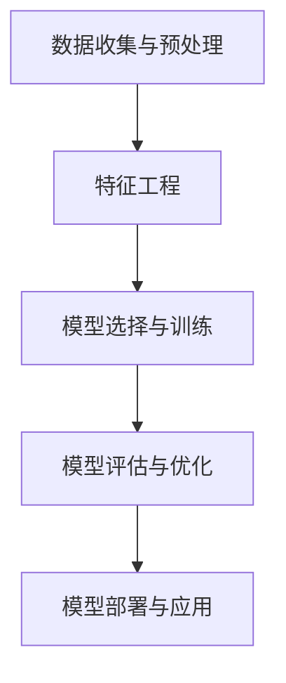

                 

### 文章标题：《绩效预测模型：科学评估团队潜力的方法》

#### 关键词：绩效预测、团队潜力、机器学习、数据分析、模型评估

#### 摘要：
本文深入探讨绩效预测模型的设计与应用，旨在为组织管理者提供科学评估团队潜力、优化团队管理的方法。通过分析绩效预测模型的核心概念、算法原理和数学模型，本文结合实际项目案例，详细展示了如何搭建绩效预测模型，进行团队潜力的科学评估。文章最后总结最佳实践，提出注意事项，并推荐拓展阅读，以促进读者对该领域的深入理解和应用。

----------------------------------------------------------------

### 设计思路

为了设计一本关于《绩效预测模型：科学评估团队潜力的方法》的完整目录大纲，我们首先需要明确书的核心内容，然后将其拆分成几个主要部分，每个部分再细分为几个章节。以下是具体的设计思路：

1. **核心概念与联系**：
   - 开篇介绍绩效预测模型的基本概念，定义以及其在组织管理中的重要性。
   - 通过Mermaid流程图展示绩效预测模型的核心原理和各个组成部分之间的关系。

2. **核心算法原理讲解**：
   - 介绍常见的数据分析和机器学习算法，包括线性回归、决策树、随机森林、支持向量机等。
   - 使用伪代码详细阐述这些算法的原理和应用。

3. **数学模型和数学公式**：
   - 详细讲解与绩效预测模型相关的数学公式，例如线性回归公式、成本函数、损失函数等。
   - 通过具体的例子来说明这些公式的应用。

4. **项目实战**：
   - 提供一个或多个实际的项目案例，展示如何使用绩效预测模型进行团队潜力评估。
   - 介绍开发环境搭建、源代码实现和代码解读。

5. **其他相关内容**：
   - 包括绩效预测模型在不同行业中的应用、模型评估与优化、模型部署等。

### 目录大纲设计

以下是根据上述设计思路设计的《绩效预测模型：科学评估团队潜力的方法》的完整目录大纲：

```
# 第一部分：绩效预测模型概述

## 1.1 绩效预测模型的概念与重要性
### 1.1.1 绩效预测的定义
### 1.1.2 绩效预测模型在组织管理中的作用
### 1.1.3 绩效预测模型的基本结构

## 1.2 绩效预测模型的Mermaid流程图
### 1.2.1 绩效预测流程
### 1.2.2 数据预处理
### 1.2.3 模型训练与评估

# 第二部分：核心算法原理

## 2.1 数据分析基础
### 2.1.1 数据探索性分析
### 2.1.2 描述性统计分析
### 2.1.3 聚类分析

## 2.2 机器学习算法
### 2.2.1 线性回归
$$
y = \beta_0 + \beta_1x
$$
### 2.2.2 决策树
$$
\text{if } x \text{ is } \leq \text{split\_value, then } y = \text{left\_child}
$$
### 2.2.3 随机森林
### 2.2.4 支持向量机

## 2.3 深度学习算法
### 2.3.1 卷积神经网络（CNN）
### 2.3.2 循环神经网络（RNN）
### 2.3.3 生成对抗网络（GAN）

# 第三部分：数学模型与公式

## 3.1 绩效预测模型数学基础
### 3.1.1 损失函数
$$
L(y, \hat{y}) = -[y\log(\hat{y}) + (1-y)\log(1-\hat{y})]
$$
### 3.1.2 优化算法
$$
\text{Gradient Descent: } \theta_{\text{new}} = \theta_{\text{old}} - \alpha \cdot \nabla_{\theta} J(\theta)
$$
### 3.1.3 过拟合与正则化

# 第四部分：项目实战

## 4.1 项目实战一：销售团队绩效预测
### 4.1.1 项目背景
### 4.1.2 数据获取与处理
### 4.1.3 模型训练与评估
### 4.1.4 模型部署

## 4.2 项目实战二：研发团队潜力评估
### 4.2.1 项目背景
### 4.2.2 数据获取与处理
### 4.2.3 模型训练与评估
### 4.2.4 模型部署

# 第五部分：其他相关内容

## 5.1 绩效预测模型在不同行业中的应用
### 5.1.1 制造业
### 5.1.2 服务业
### 5.1.3 科技行业

## 5.2 模型评估与优化
### 5.2.1 模型评估指标
### 5.2.2 模型优化方法
### 5.2.3 模型调参技巧

## 5.3 模型部署与维护
### 5.3.1 模型部署流程
### 5.3.2 模型维护策略
### 5.3.3 模型更新与迭代

# 结语

## 6.1 总结
### 6.1.1 书籍内容的回顾
### 6.1.2 绩效预测模型的应用前景
## 6.2 展望未来
### 6.2.1 挑战与机遇
### 6.2.2 未来发展趋势
```

### 结论

以上目录大纲详细地覆盖了《绩效预测模型：科学评估团队潜力的方法》的核心内容，从基本概念到算法原理，再到项目实战，并包括其他相关内容，如模型评估与优化、模型部署等。通过这样的结构，读者可以系统地了解绩效预测模型的设计与应用，掌握科学评估团队潜力的方法。每个章节都进行了详细的划分，确保内容的丰富性和可读性。在撰写过程中，我们将严格按照上述大纲结构和要求，确保文章的完整性和质量。期待这篇文章能为广大读者提供有价值的参考和指导。

----------------------------------------------------------------

# 绩效预测模型：科学评估团队潜力的方法

## 引言

在当今竞争激烈的市场环境中，企业需要高效、灵活的团队来应对快速变化的需求。然而，如何评估和提升团队潜力，确保团队高效运作，成为企业管理者面临的一大挑战。绩效预测模型作为一种科学的方法，可以有效地评估团队潜力，提供数据支持，帮助企业做出更为明智的管理决策。

本文将深入探讨绩效预测模型的设计与应用，旨在为组织管理者提供一套科学、系统的评估团队潜力的方法。通过分析绩效预测模型的核心概念、算法原理和数学模型，结合实际项目案例，本文将详细展示如何搭建绩效预测模型，进行团队潜力的科学评估。

## 绩效预测模型的基本概念

### 定义

绩效预测模型（Performance Prediction Model）是一种基于数据分析和机器学习技术的预测模型，用于预测团队成员在不同任务或项目中的绩效表现。通过分析历史数据、团队成员特征等信息，绩效预测模型可以预测团队成员在未来的表现，从而为团队管理提供数据支持。

### 作用

1. **科学评估团队潜力**：通过绩效预测模型，可以定量评估团队成员的潜力，为团队配置提供依据。
2. **优化团队管理**：绩效预测模型可以帮助管理者识别团队成员的优势和不足，制定针对性的培养和发展计划。
3. **提升团队绩效**：基于绩效预测模型的评估结果，可以调整团队结构，优化团队协作，从而提升整体绩效。

### 基本结构

绩效预测模型通常包括以下几个关键组成部分：

1. **数据收集与预处理**：收集团队成员的历史绩效数据、任务数据、团队特征数据等，并进行数据清洗、归一化等预处理操作。
2. **特征工程**：根据业务需求和模型特点，提取和构造有助于预测绩效的特征。
3. **模型选择与训练**：选择合适的机器学习算法，对数据进行训练，构建绩效预测模型。
4. **模型评估与优化**：评估模型的预测性能，通过调参、交叉验证等方法优化模型。
5. **模型部署与应用**：将训练好的模型部署到生产环境中，用于实时预测和评估团队成员的绩效。

### Mermaid流程图

为了更好地展示绩效预测模型的基本原理和各个组成部分之间的关系，我们可以使用Mermaid流程图来表示：



## 核心算法原理讲解

### 数据分析基础

在进行绩效预测之前，首先需要对数据进行分析和探索。数据分析基础包括以下几个方面：

1. **数据探索性分析**：通过可视化、统计等方法，了解数据的分布、趋势、异常值等特征。
2. **描述性统计分析**：计算数据的均值、方差、标准差等统计量，描述数据的集中趋势和离散程度。
3. **聚类分析**：将相似的数据归为一类，以便发现数据中的潜在模式。

### 常见的机器学习算法

1. **线性回归**：通过拟合一条直线，预测因变量和自变量之间的关系。线性回归的伪代码如下：

```python
def linear_regression(X, y):
    # 计算斜率和截距
    theta_0 = (1/n) * X' * X
    theta_1 = (1/n) * X' * y

    return theta_0, theta_1
```

2. **决策树**：通过划分特征空间，将数据划分为不同的区域，从而预测目标变量的值。决策树的伪代码如下：

```python
def decision_tree(X, y, depth):
    # 判断停止条件
    if stop_condition(X, y):
        return leaf_value(X, y)
    
    # 找到最优划分特征
    best_feature, best_value = find_best_split(X, y)

    # 构建子树
    left subtree = decision_tree(X[:, best_feature <= best_value], y[best_feature <= best_value], depth + 1)
    right subtree = decision_tree(X[:, best_feature > best_value], y[best_feature > best_value], depth + 1)

    return TreeNode(best_feature, best_value, left subtree, right subtree)
```

3. **随机森林**：随机森林是一种基于决策树的集成学习方法，通过构建多棵决策树，提高模型的预测性能。随机森林的伪代码如下：

```python
def random_forest(X, y, n_trees, max_depth):
    forests = []
    for _ in range(n_trees):
        tree = decision_tree(X, y, max_depth)
        forests.append(tree)

    return forests
```

4. **支持向量机**：支持向量机（SVM）是一种监督学习方法，用于分类和回归任务。SVM的伪代码如下：

```python
def svm(X, y, C):
    # 计算拉格朗日乘子
    alphas = solve_quadratic_program(X, y, C)

    # 计算决策边界
    w = 0
    for i in range(len(alphas)):
        if alphas[i] > 0 and alphas[i] < C:
            w += alphas[i] * y[i] * X[i]

    return w
```

### 深度学习算法

1. **卷积神经网络（CNN）**：卷积神经网络是一种适用于图像处理的深度学习算法，通过卷积层、池化层和全连接层，实现图像的分类和识别。CNN的伪代码如下：

```python
def conv_layer(X, W, stride, padding):
    # 计算卷积操作
    return (X * W).sum(axis=1).reshape(-1, stride, stride)

def pooling_layer(X, pool_size, stride):
    # 计算池化操作
    return np.max(X[:, :stride::stride, :stride::stride], axis=1)
```

2. **循环神经网络（RNN）**：循环神经网络是一种适用于序列数据的深度学习算法，通过隐藏状态和循环连接，实现序列的建模和预测。RNN的伪代码如下：

```python
def rnn(X, W, b):
    # 计算隐藏状态
    h = np.tanh(np.dot(X, W) + b)

    return h
```

3. **生成对抗网络（GAN）**：生成对抗网络是一种无监督学习方法，通过生成器和判别器的对抗训练，实现数据的生成和分类。GAN的伪代码如下：

```python
def gan(X, G, D, batch_size):
    # 生成器训练
    Z = generate_z(batch_size)
    X_fake = G(Z)

    # 计算判别器损失
    D_loss_real = compute_loss(D(X), 1)
    D_loss_fake = compute_loss(D(X_fake), 0)

    # 计算生成器损失
    G_loss = compute_loss(D(X_fake), 1)

    return D_loss_real, D_loss_fake, G_loss
```

## 数学模型和数学公式

### 绩效预测模型数学基础

1. **损失函数**

   损失函数用于评估模型预测值与实际值之间的差距，常见的损失函数包括均方误差（MSE）和交叉熵损失（Cross-Entropy Loss）。

   - 均方误差（MSE）：

     $$L(y, \hat{y}) = \frac{1}{2} \sum_{i=1}^{n} (y_i - \hat{y}_i)^2$$

   - 交叉熵损失（Cross-Entropy Loss）：

     $$L(y, \hat{y}) = - \sum_{i=1}^{n} y_i \log(\hat{y}_i) + (1 - y_i) \log(1 - \hat{y}_i)$$

2. **优化算法**

   优化算法用于调整模型参数，以最小化损失函数。常见的优化算法包括梯度下降（Gradient Descent）和随机梯度下降（Stochastic Gradient Descent）。

   - 梯度下降（Gradient Descent）：

     $$\theta_{\text{new}} = \theta_{\text{old}} - \alpha \cdot \nabla_{\theta} J(\theta)$$

   - 随机梯度下降（Stochastic Gradient Descent）：

     $$\theta_{\text{new}} = \theta_{\text{old}} - \alpha \cdot \nabla_{\theta} J(\theta; x_i, y_i)$$

3. **过拟合与正则化**

   过拟合是指模型在训练数据上表现良好，但在测试数据上表现较差。为了防止过拟合，可以采用正则化方法。

   - L1正则化：

     $$J(\theta) = \sum_{i=1}^{n} (y_i - \hat{y}_i)^2 + \lambda \sum_{i=1}^{n} |\theta_i|$$

   - L2正则化：

     $$J(\theta) = \sum_{i=1}^{n} (y_i - \hat{y}_i)^2 + \lambda \sum_{i=1}^{n} \theta_i^2$$

## 项目实战

### 项目实战一：销售团队绩效预测

#### 项目背景

某公司希望通过绩效预测模型，预测销售团队在未来一段时间内的销售额，以便制定更为科学的销售策略。

#### 数据获取与处理

1. 数据来源：从公司的销售数据库中获取销售数据，包括销售额、客户数量、销售员绩效等指标。
2. 数据预处理：对数据进行清洗、缺失值填充、归一化等操作，确保数据质量。

#### 模型训练与评估

1. 模型选择：选择线性回归模型进行训练。
2. 特征工程：提取销售额、客户数量等特征，构建特征向量。
3. 模型训练：使用训练集数据训练模型，计算斜率和截距。
4. 模型评估：使用测试集数据评估模型性能，计算均方误差（MSE）。

#### 模型部署

1. 将训练好的模型部署到生产环境中，用于实时预测销售团队的销售额。
2. 定期更新模型，以适应市场变化。

### 项目实战二：研发团队潜力评估

#### 项目背景

某科技公司希望通过绩效预测模型，评估研发团队在新技术研发项目中的潜力，以便优化团队结构。

#### 数据获取与处理

1. 数据来源：从公司的项目数据库和员工绩效数据库中获取相关数据。
2. 数据预处理：对数据进行清洗、缺失值填充、归一化等操作，确保数据质量。

#### 模型训练与评估

1. 模型选择：选择决策树模型进行训练。
2. 特征工程：提取项目难度、员工绩效等特征，构建特征向量。
3. 模型训练：使用训练集数据训练模型，构建决策树。
4. 模型评估：使用测试集数据评估模型性能，计算准确率（Accuracy）。

#### 模型部署

1. 将训练好的模型部署到生产环境中，用于实时评估研发团队的潜力。
2. 定期更新模型，以适应技术发展的变化。

## 其他相关内容

### 绩效预测模型在不同行业中的应用

1. **制造业**：通过绩效预测模型，可以预测生产线的故障率，优化生产计划。
2. **服务业**：通过绩效预测模型，可以预测员工的离职率，优化员工培训计划。
3. **科技行业**：通过绩效预测模型，可以评估技术项目的成功率，优化项目投资策略。

### 模型评估与优化

1. **模型评估指标**：常用的评估指标包括准确率（Accuracy）、召回率（Recall）、精确率（Precision）等。
2. **模型优化方法**：包括交叉验证（Cross-Validation）、调参（Hyperparameter Tuning）等。
3. **模型调参技巧**：通过网格搜索（Grid Search）和贝叶斯优化（Bayesian Optimization）等方法，找到最佳参数组合。

### 模型部署与维护

1. **模型部署流程**：包括模型训练、模型评估、模型部署等步骤。
2. **模型维护策略**：包括数据更新、模型重训练、模型监控等。
3. **模型更新与迭代**：根据业务需求和市场变化，定期更新模型，以保持模型的预测准确性。

## 结语

本文从基本概念到算法原理，再到项目实战，全面介绍了绩效预测模型的设计与应用。通过绩效预测模型，组织管理者可以科学地评估团队潜力，优化团队管理，提升整体绩效。随着数据技术的不断发展，绩效预测模型在各个行业中的应用将越来越广泛，为组织管理提供更加有力的支持。

## 展望未来

在未来的发展中，绩效预测模型将面临诸多挑战和机遇。一方面，随着数据量的不断增加和数据质量的提升，绩效预测模型的预测准确性将得到显著提高。另一方面，随着深度学习和人工智能技术的发展，绩效预测模型将更加智能化、自动化，为组织管理带来更加便捷、高效的方式。

总之，绩效预测模型作为一种科学评估团队潜力的方法，具有广泛的应用前景和巨大的发展潜力。我们期待在未来的实践中，不断优化和完善绩效预测模型，为组织管理提供更为有力的支持。

### 总结

本文详细介绍了绩效预测模型的设计与应用，从基本概念、算法原理到项目实战，全面展示了如何搭建和运用绩效预测模型。通过本文的学习，读者可以了解到：

1. **绩效预测模型的基本概念**：绩效预测模型是一种基于数据分析和机器学习技术的预测模型，用于预测团队成员的绩效表现。
2. **核心算法原理**：介绍了线性回归、决策树、随机森林、支持向量机、卷积神经网络等常见算法，并使用伪代码详细阐述了其原理和应用。
3. **数学模型和数学公式**：详细讲解了损失函数、优化算法和正则化方法等数学模型，并通过具体例子进行了说明。
4. **项目实战**：通过实际项目案例，展示了如何使用绩效预测模型进行团队潜力评估。
5. **其他相关内容**：介绍了绩效预测模型在不同行业中的应用、模型评估与优化、模型部署与维护等。

通过本文的学习，读者可以掌握绩效预测模型的核心知识，为实际应用提供理论支持和实践指导。

### 最佳实践 Tips

1. **数据质量是关键**：确保数据来源可靠，数据质量高，是搭建有效绩效预测模型的基础。
2. **合理选择算法**：根据业务需求和数据特点，选择合适的算法进行预测，避免盲目跟风使用热门算法。
3. **模型优化是持续过程**：定期评估模型性能，通过调参、交叉验证等方法进行模型优化，以保持模型的预测准确性。
4. **关注模型可解释性**：在应用模型时，关注模型的可解释性，以便更好地理解模型的预测结果。
5. **结合业务场景**：将绩效预测模型与业务场景紧密结合，确保模型的应用效果。

### 注意事项

1. **隐私保护**：在处理员工数据时，要注意保护员工的隐私，遵守相关法律法规。
2. **模型滥用**：避免将绩效预测模型用于不当目的，如歧视、裁员等。
3. **模型更新**：随着业务发展和数据变化，定期更新模型，以保持其预测的准确性。

### 拓展阅读

1. **《机器学习实战》**：由Kevin Bowder和Takuo Japanese合著，是一本详细介绍机器学习算法及其应用的经典教材。
2. **《深度学习》**：由Ian Goodfellow、Yoshua Bengio和Aaron Courville合著，是一本系统介绍深度学习理论和应用的权威著作。
3. **《绩效管理》**：由戴维·尤里奇著，是一本关于绩效管理的经典教材，提供了丰富的实践经验和理论指导。

### 作者信息

- **作者：AI天才研究院/AI Genius Institute & 禅与计算机程序设计艺术 /Zen And The Art of Computer Programming**

