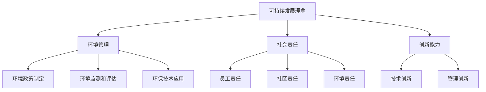

                 

### 文章标题

《绿色领导力：可持续发展理念的企业实践》

### 关键词

- 绿色领导力
- 可持续发展
- 企业实践
- 环境管理
- 社会责任

### 摘要

本文旨在探讨绿色领导力的概念及其在企业可持续发展中的应用。通过系统分析绿色领导力的核心概念、构建原则和实践案例，本文旨在为企业管理者提供切实可行的指导，帮助企业实现可持续发展目标，并提升企业在社会和环境方面的责任感。文章结构包括背景介绍、核心概念与联系、绿色领导力的实践方法、案例分析与启示，以及未来发展趋势与展望。

### 目录

1. 引言
    1.1 绿色领导力的背景与意义
    1.2 绿色领导力的核心概念
    1.3 本文的目的与结构

2. 绿色领导力的核心概念与联系
    2.1 可持续发展理念
    2.2 绿色领导力的核心要素
    2.3 绿色领导力与可持续发展战略
    2.4 核心概念关系架构（Mermaid流程图）

3. 绿色领导力的实践方法
    3.1 绿色企业文化建设
        3.1.1 绿色文化的内涵与建设路径
        3.1.2 绿色文化在企业中的实施策略
        3.1.3 绿色文化对员工行为的影响
    3.2 绿色战略规划与执行
        3.2.1 绿色战略规划的原则与方法
        3.2.2 绿色战略规划的实施步骤
        3.2.3 绿色战略规划的风险管理
    3.3 绿色供应链管理
        3.3.1 绿色供应链的概念与重要性
        3.3.2 绿色供应链的构建与优化
        3.3.3 绿色供应链的绩效评估与改进

4. 绿色产品设计与创新
    4.1 绿色产品设计的原则与方法
    4.2 绿色产品创新的策略与实践
    4.3 绿色产品的市场推广与营销

5. 绿色领导力的实践案例与启示
    5.1 国内绿色领导力实践案例
    5.2 国际绿色领导力实践案例
    5.3 案例分析与启示

6. 绿色领导力的未来发展趋势
    6.1 绿色领导力的未来挑战与机遇
    6.2 绿色领导力的发展趋势与方向
    6.3 绿色领导力对企业可持续发展的影响

7. 结论

### 附录

- 附录A：绿色领导力相关资源与工具
- 附录B：绿色领导力评估与认证标准

### 引言

#### 1.1 绿色领导力的背景与意义

在当前全球环境问题日益严峻的背景下，绿色领导力作为一种新兴的管理理念逐渐受到广泛关注。绿色领导力强调企业在追求经济效益的同时，要承担起社会责任和环境责任，实现经济、社会和环境的协调发展。可持续发展理念作为绿色领导力的核心，要求企业在经营活动中充分考虑资源的合理利用、环境的保护和社会的福祉。

绿色领导力的提出背景源于全球气候变化、资源枯竭、环境污染等问题日益严重，传统的经济发展模式已经难以满足人们对美好生活的追求。企业作为社会的重要组成部分，有责任通过绿色领导力来推动社会和环境的可持续发展。绿色领导力不仅有助于企业提升竞争力，降低运营成本，还能增强企业社会责任感和品牌形象，从而在长期内实现可持续增长。

#### 1.2 绿色领导力的核心概念

绿色领导力是指企业领导者通过创新思维、社会责任感和环境意识，引导企业实现可持续发展的能力。其核心概念包括：

- **可持续发展理念**：强调企业在追求经济效益的同时，要关注环境和社会责任，实现经济、社会和环境的协调发展。
- **环境管理**：通过有效的环境管理体系，降低企业生产过程中的环境影响，实现资源的高效利用。
- **社会责任**：企业要承担起对员工、社区和环境的责任，积极参与社会公益事业，提升企业形象。
- **创新能力**：企业要不断进行技术创新和管理创新，以适应环境变化和市场需求。

#### 1.3 本文的目的与结构

本文旨在探讨绿色领导力的概念及其在企业可持续发展中的应用，为企业管理者提供实用的指导。文章结构分为以下几个部分：

1. 引言：介绍绿色领导力的背景与意义。
2. 绿色领导力的核心概念与联系：详细阐述绿色领导力的核心概念及其相互关系。
3. 绿色领导力的实践方法：分析绿色企业文化、绿色战略规划、绿色供应链管理、绿色产品设计与创新等方面的实践方法。
4. 绿色领导力的实践案例与启示：通过国内外的实践案例，分析绿色领导力在企业中的应用效果和启示。
5. 绿色领导力的未来发展趋势：探讨绿色领导力的未来挑战与机遇，预测其发展趋势。
6. 结论：总结全文，强调绿色领导力在企业发展中的重要性。

### 绿色领导力的核心概念与联系

绿色领导力作为一种新兴的管理理念，其核心概念包括可持续发展理念、环境管理、社会责任和创新能力。这些概念相互关联，共同构成了绿色领导力的理论框架。

#### 2.1 可持续发展理念

可持续发展理念是绿色领导力的核心。它强调企业在追求经济效益的同时，要关注环境和社会责任，实现经济、社会和环境的协调发展。可持续发展理念源自1972年的联合国《人类环境宣言》，经过几十年的发展，已经成为全球共识。

可持续发展理念的核心内容包括：

- **经济可持续性**：企业要在保证盈利的同时，实现资源的有效利用和成本控制，提高生产效率。
- **环境可持续性**：企业要减少对环境的负面影响，实现资源的可持续利用，降低碳排放和污染。
- **社会可持续性**：企业要关注员工福利和社会公益，积极参与社会公益事业，提升企业形象。

可持续发展理念对绿色领导力的影响主要体现在两个方面：

1. **引导企业战略规划**：企业要根据可持续发展理念，制定符合环境和社会责任要求的战略规划，实现经济、社会和环境的协调发展。
2. **推动绿色技术创新**：企业要积极研发绿色技术，提高资源利用效率，降低环境影响，实现可持续发展。

#### 2.2 绿色领导力的核心要素

绿色领导力的核心要素包括环境管理、社会责任和创新能力。这些要素共同构成了绿色领导力的基础，使企业能够在经营活动中实现可持续发展。

- **环境管理**：环境管理是绿色领导力的核心组成部分。它包括环境政策的制定、环境监测和评估、环保技术的应用等方面。环境管理的目标是降低企业生产过程中的环境影响，实现资源的高效利用。

    - **环境政策制定**：企业要根据国家和国际环境标准，制定符合自身发展需求的环境政策。环境政策要明确环保目标、责任分配和实施措施，确保企业环保工作的有序进行。
    - **环境监测和评估**：企业要建立完善的环境监测系统，对生产过程中的环境污染指标进行实时监测，及时发现和解决环境问题。同时，企业要定期对环境绩效进行评估，确保环保目标的实现。
    - **环保技术应用**：企业要积极引进和应用环保技术，提高资源利用效率，降低污染物排放。环保技术包括清洁生产技术、废物回收利用技术、节能减排技术等。

- **社会责任**：社会责任是绿色领导力的重要组成部分。企业要承担起对员工、社区和环境的责任，积极参与社会公益事业，提升企业形象。

    - **员工责任**：企业要关心员工的身心健康，提供良好的工作环境和职业发展机会。同时，企业要倡导绿色办公，鼓励员工参与环保活动，提升员工的环保意识。
    - **社区责任**：企业要积极参与社区建设，支持社区公益事业，为社区发展贡献力量。企业可以通过捐资助学、扶贫帮困、环境保护等方式，提升社区福祉。
    - **环境责任**：企业要关注环境保护，减少生产过程中的环境污染。企业可以通过环保技术研发、环保设施建设、环保宣传等方式，推动社会环保意识的提升。

- **创新能力**：创新能力是绿色领导力的重要保障。企业要不断进行技术创新和管理创新，以适应环境变化和市场需求，实现可持续发展。

    - **技术创新**：企业要积极研发绿色技术，提高资源利用效率，降低环境影响。绿色技术创新包括清洁生产技术、废物回收利用技术、可再生能源技术等。
    - **管理创新**：企业要优化管理流程，提高管理效率，降低运营成本。管理创新包括绿色供应链管理、绿色财务管理、绿色人力资源管理等方面。

#### 2.3 绿色领导力与可持续发展战略

绿色领导力与可持续发展战略密切相关。可持续发展战略是企业为实现可持续发展目标而制定的长期规划。绿色领导力作为可持续发展战略的重要组成部分，对企业实现可持续发展目标具有关键作用。

- **战略制定**：企业要根据可持续发展理念，制定符合环境和社会责任要求的可持续发展战略。可持续发展战略要明确环保目标、社会责任目标和经济效益目标，确保企业可持续发展目标的实现。
- **战略执行**：企业要建立健全的战略执行体系，确保可持续发展战略的有效实施。战略执行体系包括目标分解、责任分配、监控与评估等方面。
- **战略调整**：企业要根据市场和环境的变化，及时调整可持续发展战略。战略调整要充分考虑环境和社会责任要求，确保企业可持续发展目标的实现。

#### 2.4 核心概念关系架构（Mermaid流程图）

以下是绿色领导力核心概念之间的关系架构（Mermaid流程图）：

### 绿色领导力的实践方法

绿色领导力在实践中需要通过多种方法来落实，以确保企业在经营活动中能够有效实现可持续发展目标。以下将详细探讨绿色企业文化、绿色战略规划、绿色供应链管理、绿色产品设计与创新等方面的实践方法。

#### 3.1 绿色企业文化建设

绿色企业文化是企业实现绿色领导力的基础。它是指在企业内部培育和推广一种以可持续发展为核心价值观的文化。绿色企业文化不仅要求企业关注环境和社会责任，还要将其融入企业的日常运营和员工行为中。

**3.1.1 绿色文化的内涵与建设路径**

绿色文化的内涵包括以下几个方面：

1. **环境意识**：企业要树立环保意识，认识到环境问题的重要性，将其作为企业发展的基础。
2. **社会责任**：企业要承担起对员工、社区和环境的责任，积极参与社会公益事业。
3. **创新精神**：企业要积极进行技术创新和管理创新，以适应环境变化和市场需求。
4. **团队合作**：企业要鼓励团队合作，共同推动绿色领导力的实施。

建设绿色文化的方法包括：

1. **领导带头**：企业领导者要树立绿色榜样，通过自身行为和决策来推动绿色文化的建设。
2. **员工培训**：企业要定期组织员工培训，提高员工的环保意识和责任感。
3. **企业文化活动**：企业可以通过举办环保活动、志愿服务等形式，增强员工的环保意识和社会责任感。

**3.1.2 绿色文化在企业中的实施策略**

实施绿色文化的方法包括：

1. **绿色理念融入日常运营**：将绿色理念融入到企业的日常运营中，如绿色办公、节能减排等。
2. **绿色绩效评估**：建立绿色绩效评估体系，将环保绩效纳入员工绩效考核，激励员工积极参与绿色活动。
3. **绿色沟通**：通过内部沟通渠道，如内部邮件、公告板等，宣传绿色理念，提高员工对绿色文化的认同感。
4. **绿色品牌建设**：企业可以通过绿色品牌建设，提升企业的社会形象和品牌价值。

**3.1.3 绿色文化对员工行为的影响**

绿色文化对员工行为的影响主要体现在以下几个方面：

1. **提高环保意识**：员工在绿色文化的熏陶下，环保意识得到提高，更加注重环境保护。
2. **改变工作方式**：员工在工作过程中，通过绿色文化的引导，改变传统的工作方式，采用更加环保和可持续的工作方法。
3. **提升社会责任感**：员工在参与绿色文化活动中，社会责任感得到提升，更加关注社会和环境问题。
4. **增强团队凝聚力**：绿色文化鼓励团队合作，员工在共同推动绿色领导力的过程中，团队凝聚力得到增强。

#### 3.2 绿色战略规划与执行

绿色战略规划是企业实现绿色领导力的关键。它是指企业根据可持续发展理念，制定长期的环境和社会责任战略，并确保其有效实施。

**3.2.1 绿色战略规划的原则与方法**

绿色战略规划应遵循以下原则：

1. **整体性**：战略规划要全面考虑环境、社会和经济三个方面的可持续性，确保三个方面的协调发展。
2. **前瞻性**：战略规划要具有前瞻性，能够预见未来可能出现的环境和社会问题，提前做好应对措施。
3. **可行性**：战略规划要具有可行性，确保企业能够在资源、技术、资金等方面实现战略目标。
4. **动态调整**：战略规划要具有灵活性，能够根据市场和环境的变化进行动态调整。

绿色战略规划的方法包括：

1. **SWOT分析**：通过SWOT分析，识别企业的优势、劣势、机会和威胁，为企业制定绿色战略提供依据。
2. **目标设定**：根据SWOT分析结果，设定明确、具体、可衡量的绿色战略目标。
3. **策略制定**：制定实现绿色战略目标的策略，包括环保技术引进、环保设施建设、环保政策制定等方面。
4. **资源配置**：合理配置资源，确保绿色战略的有效实施。

**3.2.2 绿色战略规划的实施步骤**

绿色战略规划的实施步骤包括：

1. **战略制定**：根据可持续发展理念，制定绿色战略目标、策略和资源配置方案。
2. **战略审批**：将绿色战略提交给企业高层领导审批，确保战略的可行性和前瞻性。
3. **战略宣传**：通过内部沟通渠道，向全体员工宣传绿色战略，提高员工的认同感和参与度。
4. **战略实施**：根据绿色战略规划，制定详细的实施计划，确保战略目标的实现。
5. **战略监控**：建立战略监控体系，对绿色战略实施过程中的关键指标进行实时监控，确保战略的有效执行。
6. **战略评估**：定期对绿色战略实施效果进行评估，根据评估结果调整和优化绿色战略。

**3.2.3 绿色战略规划的风险管理**

绿色战略规划在实施过程中可能会面临以下风险：

1. **环境风险**：包括自然灾害、气候变化、资源枯竭等环境风险，可能导致企业的生产运营受到影响。
2. **社会风险**：包括社会不稳定、政策变化、法律法规调整等社会风险，可能影响企业的可持续发展。
3. **经济风险**：包括市场波动、成本上升、竞争加剧等经济风险，可能影响企业的盈利能力。

为应对这些风险，企业应采取以下措施：

1. **风险评估**：对可能影响绿色战略实施的风险进行识别和评估，确定风险等级和影响程度。
2. **风险预防**：针对评估出的风险，采取预防措施，如增加保险、建立应急预案等。
3. **风险监控**：建立风险监控体系，对风险进行实时监控，确保风险得到及时处理。
4. **风险应对**：制定应对策略，对可能出现的问题进行预判和应对，确保绿色战略的顺利实施。

#### 3.3 绿色供应链管理

绿色供应链管理是企业实现绿色领导力的重要环节。它是指企业通过优化供应链管理，降低供应链环节的环境影响，提高资源利用效率。

**3.3.1 绿色供应链的概念与重要性**

绿色供应链是指企业在供应链管理过程中，充分考虑环境和社会责任，通过优化供应链结构、提高资源利用效率、降低环境影响，实现可持续发展。

绿色供应链的重要性体现在以下几个方面：

1. **降低环境风险**：通过绿色供应链管理，企业可以降低生产过程中的环境污染，减少碳排放和资源浪费，降低环境风险。
2. **提高资源利用效率**：绿色供应链管理可以优化供应链结构，提高资源利用效率，降低生产成本，提高企业竞争力。
3. **增强企业社会责任感**：通过绿色供应链管理，企业可以履行社会责任，提升企业形象，增强企业社会责任感。
4. **满足市场需求**：随着消费者对环保意识的提高，绿色供应链管理可以满足市场需求，提高企业的市场份额。

**3.3.2 绿色供应链的构建与优化**

绿色供应链的构建与优化包括以下几个方面：

1. **供应商选择**：企业要选择具有环保意识和社会责任感的供应商，建立长期合作关系，确保供应链的绿色属性。
2. **绿色采购**：企业要制定绿色采购政策，优先采购环保材料和产品，减少采购环节的环境影响。
3. **绿色物流**：企业要优化物流管理，采用环保运输方式，降低物流过程中的碳排放和资源浪费。
4. **绿色生产**：企业要优化生产过程，采用环保技术和工艺，提高资源利用效率，降低生产过程中的环境影响。
5. **绿色回收**：企业要建立回收体系，对生产过程中的废弃物进行分类回收和处理，实现资源的循环利用。

**3.3.3 绿色供应链的绩效评估与改进**

绿色供应链的绩效评估与改进包括以下几个方面：

1. **指标设定**：企业要设定绿色供应链绩效评估指标，包括环保指标、资源利用指标、社会责任指标等。
2. **数据收集**：企业要收集绿色供应链运营过程中的数据，如能源消耗、碳排放、废弃物产生等。
3. **评估分析**：企业要定期对绿色供应链绩效进行评估分析，识别存在的问题和改进方向。
4. **改进措施**：企业要根据评估分析结果，制定改进措施，优化绿色供应链管理，提高绩效。

### 绿色产品设计与创新

绿色产品设计与创新是企业实现绿色领导力的重要途径。它是指企业在产品设计和创新过程中，充分考虑环境和社会责任，开发出对环境友好、符合社会责任要求的产品。

**4.1 绿色产品设计的原则与方法**

绿色产品设计的原则包括：

1. **环保材料**：选择环保材料，减少产品的环境影响。
2. **节能设计**：优化产品结构，提高能源利用效率，减少能源消耗。
3. **易回收性**：设计产品时考虑回收利用，降低废弃物产生。
4. **社会责任**：关注产品的社会责任，确保产品符合社会责任要求。

绿色产品设计的具体方法包括：

1. **生命周期设计**：考虑产品的全生命周期，从原材料选择、生产制造、使用到回收处理，实现产品的可持续发展。
2. **模块化设计**：采用模块化设计，提高产品的可维修性和可升级性，延长产品使用寿命。
3. **绿色评估**：对产品设计进行绿色评估，确保产品设计符合环保要求和社会责任要求。

**4.2 绿色产品创新的策略与实践**

绿色产品创新的策略包括：

1. **市场驱动**：根据市场需求，开发符合环保要求和社会责任的产品。
2. **技术创新**：通过技术创新，提高产品的环保性能和资源利用效率。
3. **合作开发**：与企业、科研机构、社会组织等合作，共同推进绿色产品创新。
4. **政策引导**：利用政府政策和市场机制，推动绿色产品创新。

绿色产品创新的实践包括：

1. **环保产品开发**：开发环保产品，如节能家电、环保涂料、绿色食品等。
2. **绿色改造**：对现有产品进行绿色改造，提高产品的环保性能和资源利用效率。
3. **绿色品牌建设**：通过绿色品牌建设，提升企业的社会形象和品牌价值。

**4.3 绿色产品的市场推广与营销**

绿色产品的市场推广与营销包括：

1. **绿色宣传**：通过广告、宣传册、线上推广等方式，提高绿色产品的知名度。
2. **绿色渠道**：建立绿色产品销售渠道，如绿色商场、电商平台等。
3. **绿色认证**：获取绿色认证，提升绿色产品的市场竞争力。
4. **消费者教育**：开展消费者教育活动，提高消费者的环保意识和社会责任感。

### 绿色领导力的实践案例与启示

绿色领导力在企业中的实践已经取得了显著的成果，以下将介绍国内外的实践案例，并从中提取有益的启示。

#### 5.1 国内绿色领导力实践案例

**案例一：公司A的绿色战略转型**

公司A是一家大型制造企业，面临着资源枯竭和环境污染的挑战。为了实现可持续发展，公司A启动了绿色战略转型。

**案例分析**：

1. **绿色企业文化建设**：公司A通过内部培训和宣传，树立绿色理念，鼓励员工参与环保活动，提升了员工的环保意识。
2. **绿色供应链管理**：公司A优化供应链结构，选择环保供应商，采用绿色物流，降低供应链的环境影响。
3. **绿色产品创新**：公司A研发出一系列环保产品，如节能家电、环保涂料等，满足市场需求。
4. **绿色市场推广**：公司A通过广告、宣传活动，提高绿色产品的知名度，扩大市场份额。

**启示**：

1. **企业文化的重要性**：绿色企业文化是绿色领导力成功的关键，企业要通过培训和宣传，提升员工的环保意识。
2. **供应链管理的优化**：绿色供应链管理能够降低企业的环境影响，提高资源利用效率。
3. **产品创新与市场推广**：绿色产品创新和市场推广是提升企业竞争力的重要途径。

**案例二：企业B的绿色供应链实践**

企业B是一家食品企业，为了实现可持续发展，企业B对其供应链进行了绿色改造。

**案例分析**：

1. **绿色采购**：企业B制定了绿色采购政策，优先采购环保材料和产品，减少采购环节的环境影响。
2. **绿色物流**：企业B优化物流管理，采用环保运输方式，降低物流过程中的碳排放和资源浪费。
3. **绿色回收**：企业B建立了废弃物回收体系，对生产过程中的废弃物进行分类回收和处理，实现资源的循环利用。
4. **绿色认证**：企业B获得了绿色认证，提升了企业的社会形象和品牌价值。

**启示**：

1. **绿色采购**：绿色采购是降低企业环境影响的有效手段，企业应制定绿色采购政策，优先采购环保材料和产品。
2. **绿色物流**：优化物流管理，采用环保运输方式，能够降低企业的碳排放和资源浪费。
3. **绿色回收**：废弃物回收体系能够实现资源的循环利用，降低企业的环境负担。

#### 5.2 国际绿色领导力实践案例

**案例三：创新型企业C的绿色产品研发**

创新型企业C是一家专注于环保科技的创新型企业，其绿色产品研发取得了显著成果。

**案例分析**：

1. **绿色技术研发**：企业C投入大量资金进行绿色技术研发，开发出一系列环保技术，如节能减排技术、废物回收利用技术等。
2. **绿色产品创新**：企业C利用绿色技术研发出一系列环保产品，如环保涂料、绿色建材等，满足市场需求。
3. **国际合作**：企业C与国际科研机构和环保组织合作，共同推进绿色产品研发和技术创新。
4. **市场推广**：企业C通过广告、宣传活动，提高绿色产品的知名度，扩大市场份额。

**启示**：

1. **技术研发**：绿色技术研发是企业实现可持续发展的重要保障，企业应投入大量资金进行技术研发。
2. **国际合作**：国际合作能够推动绿色产品研发和技术创新，提升企业的国际竞争力。
3. **市场推广**：通过广告、宣传活动，提高绿色产品的知名度，能够扩大市场份额，提升企业竞争力。

#### 5.3 案例分析与启示

通过对国内外绿色领导力实践案例的分析，我们可以得出以下启示：

1. **企业文化的重要性**：绿色企业文化是绿色领导力成功的关键，企业要通过培训和宣传，提升员工的环保意识。
2. **供应链管理的优化**：绿色供应链管理能够降低企业的环境影响，提高资源利用效率，企业应制定绿色供应链策略。
3. **产品创新与市场推广**：绿色产品创新和市场推广是提升企业竞争力的重要途径，企业应加大投入，研发绿色产品，并通过广告、宣传活动提高知名度。
4. **技术研发**：绿色技术研发是企业实现可持续发展的重要保障，企业应投入大量资金进行技术研发。
5. **国际合作**：国际合作能够推动绿色产品研发和技术创新，提升企业的国际竞争力，企业应积极参与国际合作。

### 绿色领导力的未来发展趋势

绿色领导力作为一种新兴的管理理念，随着全球环境问题的日益严重，其重要性越来越受到重视。未来，绿色领导力将在以下几个方面呈现发展趋势：

#### 6.1 绿色领导力的未来挑战与机遇

**挑战**：

1. **环境法规的加强**：随着环境问题的日益严重，各国政府将加强环境保护法规，企业将面临更严格的环境监管。
2. **资源枯竭**：全球资源日益枯竭，企业将面临资源短缺的挑战，如何实现资源的高效利用成为关键问题。
3. **技术变革**：技术变革带来的不确定性和风险，企业需要不断进行技术创新，以适应市场变化。

**机遇**：

1. **市场需求**：随着消费者环保意识的提高，绿色产品市场需求将不断增长，为企业提供发展机遇。
2. **政策支持**：各国政府将加大对绿色产业的政策支持，为企业提供发展空间。
3. **国际合作**：国际合作将为绿色领导力的发展提供更多机遇，企业可以通过国际合作，分享经验和技术，提升竞争力。

#### 6.2 绿色领导力的发展趋势与方向

**趋势**：

1. **绿色供应链管理**：企业将更加重视绿色供应链管理，通过优化供应链结构，提高资源利用效率，降低环境影响。
2. **绿色产品创新**：企业将加大绿色产品研发投入，开发出更多对环境友好、符合社会责任要求的产品。
3. **绿色企业文化**：企业将更加注重绿色企业文化建设，通过培训、宣传等方式，提升员工的环保意识和社会责任感。

**方向**：

1. **可持续发展**：企业将致力于实现可持续发展，通过经济、社会和环境的协调发展，实现企业的长期稳定发展。
2. **技术创新**：企业将加大技术创新投入，推动绿色技术研发和应用，提高资源利用效率，降低环境影响。
3. **社会责任**：企业将承担起更多的社会责任，积极参与社会公益事业，提升企业形象。

#### 6.3 绿色领导力对企业可持续发展的影响

绿色领导力对企业可持续发展具有深远的影响：

1. **提高竞争力**：通过绿色供应链管理、绿色产品创新等手段，企业可以提高竞争力，在市场上获得更大的份额。
2. **降低成本**：通过资源的高效利用和绿色技术创新，企业可以降低生产成本，提高盈利能力。
3. **提升品牌形象**：通过承担社会责任，积极参与社会公益事业，企业可以提升品牌形象，增强消费者信任。
4. **实现可持续发展**：通过实现经济、社会和环境的协调发展，企业可以实现可持续发展，为未来奠定坚实基础。

### 结论

绿色领导力作为一种新兴的管理理念，在实现企业可持续发展中具有重要作用。本文通过分析绿色领导力的核心概念、实践方法、案例启示以及未来发展趋势，阐述了绿色领导力在企业发展中的重要性。企业应积极推行绿色领导力，通过绿色企业文化、绿色战略规划、绿色供应链管理、绿色产品创新等手段，实现经济、社会和环境的协调发展。未来，绿色领导力将继续发展，为企业可持续发展提供有力支持。

### 附录

#### 附录A：绿色领导力相关资源与工具

- **国际组织**：
  - 联合国环境规划署（UNEP）
  - 国际商会可持续贸易倡议（ICTSD）
  - 国际标准化组织（ISO）

- **政府机构**：
  - 各国环境保护部门
  - 各国可持续发展委员会

- **学术资源**：
  - 《绿色管理学报》
  - 《可持续发展》期刊
  - 《环境科学与技术》期刊

- **工具与平台**：
  - GreenBiz
  - Sustainable Brands
  - Sustainable Supply Chain Management Platform

#### 附录B：绿色领导力评估与认证标准

- **ISO 14001**：环境管理体系认证，帮助企业建立和实施有效的环境管理体系。
- **SA8000**：社会责任认证，帮助企业确保供应链中的社会责任。
- **B Corp**：企业社会责任认证，强调企业对社会和环境的影响。
- **Global Reporting Initiative (GRI)**：可持续发展报告标准，帮助企业制定和报告可持续发展绩效。
- **Leed**：绿色建筑认证，评估建筑项目的环境绩效。

### 作者信息

- 作者：AI天才研究院/AI Genius Institute & 禅与计算机程序设计艺术 /Zen And The Art of Computer Programming

### 注意事项

- 在实施绿色领导力时，企业需要充分考虑自身实际情况，制定符合自身发展的绿色战略。
- 绿色领导力不仅要求企业具备环保意识和社会责任感，还需要具备持续创新的能力。
- 企业应与政府、社会和合作伙伴建立良好的合作关系，共同推动绿色领导力的发展。
- 定期对绿色领导力的实施效果进行评估和调整，确保企业可持续发展目标的实现。

### 拓展阅读

- 《企业绿色管理实践指南》
- 《绿色供应链管理：战略、方法与案例》
- 《可持续发展：企业领导力与实践》

通过以上内容，我们详细探讨了绿色领导力的概念、实践方法、案例启示以及未来发展趋势。希望读者能够从中获得对绿色领导力的深入理解和实践指导，为企业可持续发展贡献力量。

