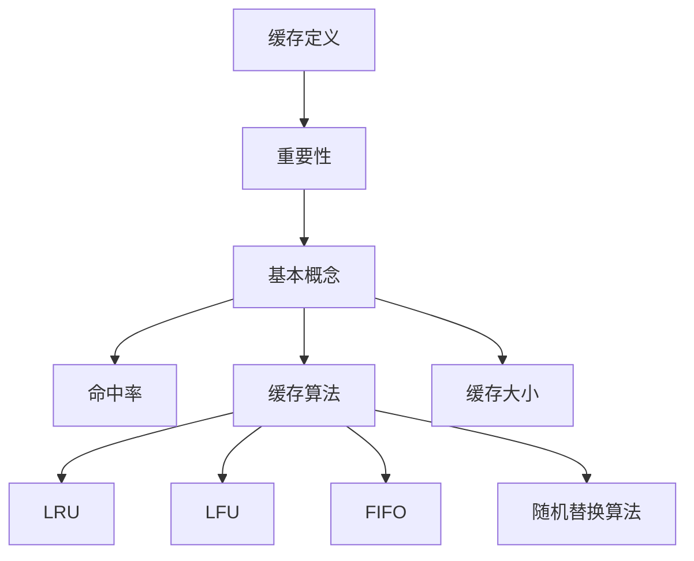

                 

## 缓存策略：优化LLM应用的响应速度

### 关键词：
- 缓存策略
- LLM应用
- 响应速度优化
- 缓存算法
- 缓存一致性协议

### 摘要：
本文将深入探讨缓存策略在优化大型语言模型（LLM）应用响应速度方面的作用。我们将首先介绍缓存策略的基础知识，包括缓存的定义、重要性、基本概念和主要类型。随后，我们将详细讲解缓存算法的原理，包括命中率、LRU、LFU、FIFO和随机替换算法，并分析软件与硬件缓存策略的区别。接着，我们将关注LLM应用响应速度优化，讨论影响因素、缓存技术在其中的角色、优化策略设计以及数据一致性保证。最后，我们将介绍基于缓存的响应速度优化技术，包括缓存一致性协议、分布式缓存系统设计、缓存分层策略和缓存淘汰策略，并通过实际案例进行应用解读与分析。本文旨在为IT领域专业人士提供全面的缓存策略实践指导。

## 第一部分：缓存策略基础

### 第1章：缓存策略概论

#### 1.1 缓存的定义与重要性

缓存（Cache）是一种快速的存储设备，用于存储最近访问过的数据或指令。其目的是减少对较慢存储设备（如硬盘或网络）的访问时间，从而提高系统性能。缓存的重要性体现在以下几个方面：

1. **减少访问延迟**：缓存存储的数据通常比主存储（如内存）更接近处理器，因此访问时间更短。
2. **提升数据访问速度**：缓存命中时，可以快速获取所需数据，减少等待时间。
3. **降低系统开销**：减少对低速存储设备的访问次数，降低系统资源消耗。
4. **提高应用程序性能**：缓存可以显著提升应用程序的响应速度，改善用户体验。

#### 1.2 缓存策略的基本概念

缓存策略是指一系列规则和方法，用于管理缓存数据、确定何时缓存数据以及如何更新缓存。以下是一些核心概念：

1. **命中率**：缓存命中率是指缓存中包含所需数据（即命中）的次数与总访问次数之比。高命中率意味着缓存策略有效。
2. **缓存算法**：缓存算法是用于选择哪些数据应被缓存以及何时替换缓存中数据的策略。常见的缓存算法包括LRU、LFU、FIFO和随机替换算法。
3. **缓存大小**：缓存大小是缓存可以存储的数据量。缓存大小直接影响命中率。过大可能导致缓存浪费，过小则可能降低命中率。

#### 1.3 缓存策略在应用中的价值

缓存策略在各种应用中具有显著价值：

1. **数据库应用**：缓存可以显著减少数据库访问次数，提升查询性能。
2. **Web应用**：缓存可以减少服务器负载，提高页面加载速度。
3. **电子商务**：缓存可以减少购物车和订单处理的时间，提升用户体验。
4. **多媒体应用**：缓存可以减少流媒体播放时的缓冲时间。

#### 1.4 主要缓存策略类型

常见的缓存策略类型包括：

1. **LRU（Least Recently Used）**：基于最近最少使用原则，最近未访问的数据最可能被替换。
2. **LFU（Least Frequently Used）**：基于最少访问频率原则，最少被访问的数据最可能被替换。
3. **FIFO（First In, First Out）**：基于先进先出原则，最早进入缓存的数据最先被替换。
4. **随机替换算法**：随机选择数据进行替换，不考虑访问频率或使用时间。

### Mermaid 流程图

以下是一个简单的Mermaid流程图，展示了缓存策略的核心概念和关系：



## 第2章：缓存算法原理

### 2.1 命中率与命中率预测

命中率是缓存性能的关键指标，表示缓存命中次数与总访问次数的比率。高命中率意味着缓存策略有效，能够快速访问所需数据。

**命中率预测**是缓存策略设计中的一个重要环节。它旨在根据历史访问模式预测未来的访问模式，从而优化缓存策略。以下是一些常见的命中率预测方法：

1. **简单预测模型**：基于历史访问数据，将最近访问频率最高的数据视为未来最可能访问的数据。
2. **马尔可夫模型**：使用状态转移矩阵来预测未来的访问模式。
3. **时间序列分析**：分析访问数据的时序特征，预测未来的访问模式。
4. **机器学习模型**：使用机器学习算法，如决策树、神经网络等，预测未来的访问模式。

### 2.2 LRU与LFU算法

**LRU（Least Recently Used）**算法基于最近最少使用原则，最近未访问的数据最可能被替换。其基本原理如下：

1. **数据结构**：使用队列或链表实现，记录每个数据的最近访问时间。
2. **替换策略**：当缓存满时，将最近未访问的数据替换掉。

**LFU（Least Frequently Used）**算法基于最少访问频率原则，最少被访问的数据最可能被替换。其基本原理如下：

1. **数据结构**：使用哈希表实现，记录每个数据的访问频率。
2. **替换策略**：当缓存满时，将访问频率最低的数据替换掉。

**两种算法的优缺点**：

- **LRU**：
  - 优点：简单易实现，能够根据访问历史优化缓存。
  - 缺点：可能对高频率但长时间未访问的数据不够友好。
- **LFU**：
  - 优点：能够更好地反映数据的真实访问模式。
  - 缺点：实现复杂度较高，需要频繁更新访问频率计数。

### 2.3 FIFO与随机替换算法

**FIFO（First In, First Out）**算法基于先进先出原则，最早进入缓存的数据最先被替换。其基本原理如下：

1. **数据结构**：使用队列实现，记录每个数据的进入时间。
2. **替换策略**：当缓存满时，将最早进入缓存的数据替换掉。

**随机替换算法**是一种简单的替换策略，随机选择数据进行替换。其基本原理如下：

1. **数据结构**：无需特定数据结构，只需维护缓存中数据的列表。
2. **替换策略**：当缓存满时，随机选择一个数据替换。

**两种算法的性能分析**：

- **FIFO**：
  - 优点：简单易实现，不依赖访问模式。
  - 缺点：可能对访问模式变化敏感，无法根据历史访问优化缓存。
- **随机替换算法**：
  - 优点：实现简单，对访问模式变化不敏感。
  - 缺点：性能可能不如LRU或LFU。

### 2.4 软件和硬件缓存策略的区别

**软件缓存策略**通常在操作系统或应用程序层面实现，如下：

1. **操作系统缓存**：如内存缓存、磁盘缓存等，用于减少I/O操作。
2. **应用程序缓存**：如Web应用中的页面缓存、数据库缓存等，用于减少数据访问次数。

**硬件缓存策略**通常在处理器或存储设备层面实现，如下：

1. **CPU缓存**：如L1、L2、L3缓存，用于减少处理器访问内存的时间。
2. **磁盘缓存**：如硬盘缓存（如磁盘缓冲区）和固态硬盘缓存，用于减少磁盘访问时间。

**软件与硬件缓存策略的协同优化**：

1. **协同作用**：软件缓存和硬件缓存可以协同工作，发挥最佳性能。
2. **策略调整**：根据不同应用场景和硬件特性，调整缓存策略，实现最佳性能。

### 结论

缓存算法是优化系统性能的重要手段，通过合理设计缓存策略，可以显著提高数据访问速度和应用响应速度。在本章中，我们介绍了缓存算法的基本概念、原理和主要类型，分析了LRU、LFU、FIFO和随机替换算法的优缺点，并讨论了软件与硬件缓存策略的区别。在下一章中，我们将进一步探讨LLM应用响应速度优化的相关技术和方法。

## 第二部分：优化LLM应用的响应速度

### 第3章：LLM应用的响应速度优化

#### 3.1 LLM响应速度的影响因素

大型语言模型（LLM）的响应速度受到多个因素的影响。以下是主要的几个因素：

1. **模型大小与计算资源**：LLM通常需要大量的计算资源，包括CPU、GPU和内存。模型越大，计算复杂度越高，响应速度越慢。
2. **数据访问延迟**：LLM在处理请求时，需要频繁访问大量数据，数据访问延迟会影响模型响应速度。数据存储在慢速设备上时，延迟尤为明显。
3. **网络传输速度**：当LLM部署在云端时，网络传输速度会影响模型的响应速度。较慢的网络可能导致请求处理延迟。

#### 3.2 缓存技术在LLM应用中的角色

缓存技术在优化LLM应用响应速度方面发挥着关键作用。以下是其主要角色：

1. **减少数据访问次数**：通过缓存常见的数据或中间结果，可以显著减少对后端存储的访问次数，降低数据访问延迟。
2. **提高数据访问速度**：缓存数据通常存储在快速的内存或高速存储设备上，访问速度远快于后端存储，从而提高模型响应速度。
3. **减少计算负载**：缓存可以缓存中间结果，减少重复计算，从而降低计算负载，提高模型响应速度。

#### 3.3 优化策略设计：缓存预热与冷启动

**缓存预热**和**缓存冷启动**是优化LLM应用响应速度的重要策略。

1. **缓存预热**：
   - **定义**：在模型开始处理请求之前，预先加载常用数据或中间结果到缓存中，以减少首次请求的响应时间。
   - **实现**：可以使用定时任务或触发器在系统启动或高峰期前进行缓存预热。
   - **优势**：提高首次请求的响应速度，减少用户等待时间。

2. **缓存冷启动**：
   - **定义**：当模型启动或重新加载时，缓存未初始化，导致响应速度较慢。
   - **实现**：可以采用延迟加载策略，逐步加载数据到缓存中，或使用预热机制减少冷启动影响。
   - **优势**：降低冷启动对系统性能的影响，提高整体响应速度。

#### 3.4 数据一致性保证与缓存更新策略

**数据一致性**是缓存技术必须解决的问题。以下是一些关键点：

1. **一致性保证**：
   - **强一致性**：确保每次访问缓存时，都能获得最新的数据。
   - **最终一致性**：允许一定程度的延迟，最终确保数据一致性。
   - **弱一致性**：数据一致性由应用层保证，缓存仅提供数据访问。

2. **缓存更新策略**：
   - **写入时复制（Write Through）**：每次更新数据时，同时更新缓存和后端存储。
   - **写回（Write Back）**：更新数据时，仅更新缓存，后续定期同步到后端存储。
   - **惰性更新（Lazy Update）**：仅在缓存过期或被替换时，更新缓存数据。

选择合适的缓存更新策略，需要根据应用场景、数据访问模式和系统性能要求进行综合考虑。

### 结论

在本章中，我们分析了LLM应用响应速度的影响因素，介绍了缓存技术在其中的关键角色，并探讨了缓存预热、冷启动和数据一致性保证等优化策略。在下一章中，我们将进一步探讨基于缓存的响应速度优化技术，包括缓存一致性协议、分布式缓存系统设计、缓存分层策略和缓存淘汰策略。

## 第三部分：基于缓存的响应速度优化技术

### 第4章：基于缓存的响应速度优化技术

#### 4.1 缓存一致性协议

缓存一致性协议是确保分布式系统中缓存数据一致性的关键机制。以下是一些常见的缓存一致性协议：

1. **强一致性协议**：
   - **Scribe**：基于日志的强一致性协议，确保所有副本数据一致。
   - **Gossip**：通过消息传递机制实现强一致性，所有副本保持同步。

2. **最终一致性协议**：
   - **Paxos**：一种分布式一致性算法，用于达成一致决策。
   - **Raft**：简化版的Paxos算法，适用于大规模分布式系统。

3. **弱一致性协议**：
   - **Eventual Consistency**：允许数据在一定时间内不一致，最终达成一致。
   - **Read Your Writes**：保证写入操作立即可见。

选择合适的缓存一致性协议，需考虑系统规模、数据一致性要求和性能需求。

#### 4.2 分布式缓存系统设计与实现

分布式缓存系统通过将缓存数据分布在不同节点上，提高系统性能和可扩展性。以下是其设计和实现的关键要素：

1. **数据分片**：将缓存数据划分到多个节点上，减少单个节点的压力。
2. **一致性保证**：选择合适的缓存一致性协议，确保数据一致性。
3. **故障恢复**：设计容错机制，确保系统在节点故障时仍能正常运行。
4. **缓存管理**：实现高效的缓存替换策略，提高缓存利用率。

常见分布式缓存系统包括Redis Cluster、Memcached Cluster等。

#### 4.3 缓存分层策略

缓存分层策略通过在不同层级上使用不同类型的缓存，提高系统性能。以下是一些常见缓存分层策略：

1. **CPU缓存层次**：包括L1、L2和L3缓存，用于提高处理器访问数据速度。
2. **内存缓存层次**：包括堆内缓存和堆外缓存，堆内缓存速度快但容量有限，堆外缓存容量大但速度慢。
3. **存储缓存层次**：包括内存缓存、磁盘缓存和固态硬盘缓存，用于减少I/O操作。

通过合理设计缓存分层策略，可以充分利用不同类型缓存的优势，提高整体系统性能。

#### 4.4 缓存淘汰策略

缓存淘汰策略是决定何时替换缓存中数据的策略。以下是一些常见的缓存淘汰策略：

1. **LRU（Least Recently Used）**：替换最近未访问的数据。
2. **LFU（Least Frequently Used）**：替换访问频率最低的数据。
3. **FIFO（First In, First Out）**：替换最早进入缓存的数据。
4. **随机淘汰**：随机选择数据替换。

选择合适的缓存淘汰策略，需考虑数据访问模式、系统性能要求和缓存资源限制。

### 结论

在本章中，我们详细介绍了基于缓存的响应速度优化技术，包括缓存一致性协议、分布式缓存系统设计、缓存分层策略和缓存淘汰策略。这些技术可以在不同层面提高LLM应用的响应速度，改善用户体验。在下一章中，我们将通过实际案例进行应用解读与分析，进一步探讨缓存策略的实践效果。

## 第四部分：缓存策略的数学模型和公式

### 第6章：缓存策略的数学模型

#### 6.1 基本缓存性能指标

缓存性能的评估通常依赖于以下几个基本指标：

1. **命中率（Hit Rate）**：缓存命中次数与总访问次数的比率，表示缓存的有效性。
   \[
   \text{命中率} = \frac{\text{命中次数}}{\text{总访问次数}}
   \]

2. **未命中率（Miss Rate）**：缓存未命中次数与总访问次数的比率，表示缓存未命中时的数据访问延迟。
   \[
   \text{未命中率} = 1 - \text{命中率}
   \]

3. **平均访问时间（Average Access Time）**：每次缓存访问的平均时间，包括缓存命中时间和未命中时间。
   \[
   \text{平均访问时间} = \text{命中时间} \times \text{命中率} + \text{未命中时间} \times \text{未命中率}
   \]

#### 6.2 缓存命中率公式推导

缓存命中率的公式可以通过对缓存算法的数学模型进行分析推导得出。以下以LRU算法为例进行推导：

1. **LRU算法的基本原理**：缓存中保留最近访问频率最高的数据，替换最近未访问的数据。

2. **缓存命中率的数学模型**：设缓存大小为\(C\)，总访问次数为\(N\)，缓存中每个数据点的访问频率为\(f_i\)，则缓存命中率为：
   \[
   \text{命中率} = \frac{1}{N} \sum_{i=1}^{N} \left(1 - \frac{1}{C}\right)^{f_i}
   \]

3. **推导过程**：
   - 假设缓存中每个数据点的访问频率为独立同分布的随机变量。
   - 访问频率最高的数据点被缓存的概率为\(\frac{1}{C}\)。
   - 访问频率次高的数据点被缓存的概率为\(\frac{1}{C} \times \frac{1}{C-1}\)。
   - 依此类推，第\(i\)个频率的数据点被缓存的概率为\(\left(\frac{1}{C}\right)^i\)。

4. **计算缓存命中率**：将每个数据点的缓存概率相加，得到缓存命中率。

#### 6.3 缓存淘汰策略的性能评估

缓存淘汰策略的性能评估主要通过比较不同策略下的缓存性能指标，如命中率、平均访问时间等。以下以LRU和LFU算法为例，进行比较分析：

1. **LRU算法的性能**：
   - **命中率**：较高，因为最近未访问的数据最可能被替换。
   - **平均访问时间**：较低，因为频繁访问的数据通常存储在缓存中。

2. **LFU算法的性能**：
   - **命中率**：可能较低，因为最少访问频率的数据可能被频繁替换。
   - **平均访问时间**：可能较高，因为低频率数据可能需要从后端存储中检索。

通过数学模型和公式，可以更深入地理解和评估缓存策略的性能，为实际应用中的策略选择提供依据。

### 第7章：缓存策略的数学公式与详细讲解

#### 7.1 命中率与缓存大小关系

命中率与缓存大小密切相关。以下公式描述了命中率与缓存大小的关系：

\[
\text{命中率} = \frac{C}{N} \left(1 - \frac{1}{C}\right)^{\text{访问频率总和}}
\]

其中：
- \(C\) 为缓存大小。
- \(N\) 为总访问次数。
- 访问频率总和为所有数据点访问频率之和。

**推导过程**：

1. **缓存容量限制**：缓存中最多只能存储\(C\)个数据点。
2. **访问频率模型**：设每个数据点的访问频率为\(f_i\)，则访问频率总和为\(\sum_{i=1}^{N} f_i\)。
3. **缓存命中概率**：每个数据点被缓存的概率为\(\frac{C}{N}\)，未被缓存的概率为\(1 - \frac{C}{N}\)。
4. **累积概率模型**：未被缓存的数据点在缓存中依次被替换，未被缓存的概率为\((1 - \frac{C}{N})^{f_i}\)。
5. **命中率计算**：将每个数据点的缓存概率相加，得到命中率。

#### 7.2 最优缓存大小计算

最优缓存大小是缓存策略设计中的一个关键参数。以下公式用于计算最优缓存大小：

\[
C^* = \left(\frac{N \times \sum_{i=1}^{N} f_i}{\ln(2)}\right)^{1/2}
\]

其中：
- \(C^*\) 为最优缓存大小。
- \(N\) 为总访问次数。
- 访问频率总和为所有数据点访问频率之和。

**推导过程**：

1. **缓存容量与命中率的关系**：根据命中率公式，当缓存大小增加时，命中率也增加，但增速逐渐放缓。
2. **最优缓存大小的选择**：选择缓存大小，使得缓存命中率最大。通过求导和二分法，可以得到最优缓存大小。

#### 7.3 多层缓存系统的性能优化

多层缓存系统通过在不同层级上使用不同类型的缓存，提高整体性能。以下为多层缓存系统的性能优化公式：

\[
\text{平均访问时间} = \text{L1缓存平均访问时间} \times p_1 + \text{L2缓存平均访问时间} \times p_2 + \ldots + \text{L3缓存平均访问时间} \times p_3
\]

其中：
- \(p_1, p_2, \ldots, p_3\) 分别为L1、L2、L3缓存的命中率。

**优化策略**：

1. **缓存大小分配**：根据不同层级缓存的特点，合理分配缓存大小。
2. **缓存替换策略**：选择合适的缓存淘汰策略，提高命中率。
3. **缓存一致性协议**：确保多层缓存系统中的数据一致性，减少访问延迟。

### 结论

在本章中，我们详细讲解了缓存策略的数学模型和公式，包括命中率公式、最优缓存大小计算和多层缓存系统的性能优化。通过这些数学模型和公式，可以更深入地理解和评估缓存策略的性能，为实际应用提供理论依据。在下一章中，我们将通过实际项目实战，进一步验证和应用这些缓存策略。

## 第五部分：缓存策略项目实战

### 第8章：缓存策略开发环境搭建

#### 8.1 开发环境配置

为了进行缓存策略的开发和实践，需要配置以下开发环境：

1. **操作系统**：Linux或MacOS，推荐使用Ubuntu或MacOS。
2. **编程语言**：Python，推荐使用Python 3.8及以上版本。
3. **开发工具**：Visual Studio Code，推荐使用VSCode进行代码编写和调试。
4. **缓存系统**：Redis，推荐使用Redis作为缓存系统。
5. **数据库**：MySQL，用于存储缓存策略相关的数据。
6. **IDE**：PyCharm或PyDev，用于Python开发。

#### 8.2 工具与框架选择

在开发缓存策略时，选择合适的工具和框架可以提高开发效率和系统性能。以下是一些常用的工具和框架：

1. **缓存系统**：Redis，是一种高性能的内存缓存系统，支持多种数据结构和命令。
2. **Web框架**：Flask或Django，用于构建Web应用程序。
3. **数据库框架**：SQLAlchemy，用于与MySQL进行交互。
4. **测试工具**：pytest，用于编写和执行测试用例。
5. **性能分析工具**：Profiler，用于分析代码性能瓶颈。

#### 8.3 实验工具搭建

搭建缓存策略的开发环境，可以按照以下步骤进行：

1. **安装操作系统**：安装Linux或MacOS，推荐使用虚拟机。
2. **安装Python**：通过pyenv或conda安装Python 3.8及以上版本。
3. **安装开发工具**：安装VSCode，并安装Python扩展。
4. **安装Redis**：通过包管理器（如apt-get或brew）安装Redis。
5. **安装数据库**：安装MySQL，并创建用于缓存策略的数据库。
6. **配置Web框架**：安装Flask或Django，并创建Web应用项目。
7. **配置Profiler**：安装Profiler工具，如py-spy，用于性能分析。

通过以上步骤，可以搭建一个完整的缓存策略开发环境，为后续的项目实践做好准备。

### 第9章：缓存策略代码实现与解读

#### 9.1 缓存策略核心代码实现

以下是一个简单的缓存策略实现，用于优化Web应用的响应速度。代码使用了Python和Redis作为缓存系统。

```python
import redis
from flask import Flask, jsonify, request

app = Flask(__name__)
redis_client = redis.StrictRedis(host='localhost', port=6379, db=0)

# 缓存函数
def cache_result(key, value):
    redis_client.set(key, value)
    # 设置过期时间，防止缓存过多占用内存
    redis_client.expire(key, 3600)

# 查询函数
def get_result(key):
    result = redis_client.get(key)
    if result:
        return result
    else:
        # 缓存未命中，从后端获取数据
        result = get_data_from_backend(key)
        cache_result(key, result)
        return result

# 请求处理函数
@app.route('/data', methods=['GET'])
def data():
    key = request.args.get('key')
    result = get_result(key)
    return jsonify({'result': result})

# 从后端获取数据的函数
def get_data_from_backend(key):
    # 模拟从后端获取数据
    return "Data for key {}".format(key)

if __name__ == '__main__':
    app.run(debug=True)
```

#### 9.2 伪代码与详细解释

以下是对上述代码的伪代码和详细解释：

```python
# 初始化Flask应用和Redis客户端
app = Flask(__name__)
redis_client = redis.StrictRedis(host='localhost', port=6379, db=0)

# 缓存函数：将结果存储到Redis缓存中
cache_result(key, value):
    # 设置键值对到Redis
    redis_client.set(key, value)
    # 设置缓存过期时间，防止缓存过多
    redis_client.expire(key, 3600)

# 查询函数：从Redis缓存中获取结果，如未命中则从后端获取并缓存
get_result(key):
    result = redis_client.get(key)
    if result is not None:
        return result
    else:
        # 缓存未命中
        result = get_data_from_backend(key)
        cache_result(key, result)
        return result

# 请求处理函数：处理Web请求，根据key获取数据并返回
@app.route('/data', methods=['GET'])
def data():
    key = request.args.get('key')
    result = get_result(key)
    return jsonify({'result': result})

# 从后端获取数据的函数：模拟从后端获取数据的过程
get_data_from_backend(key):
    return "Data for key {}".format(key)

# 运行Flask应用
if __name__ == '__main__':
    app.run(debug=True)
```

- **缓存函数**：将请求结果存储到Redis缓存中，并设置过期时间以防止缓存过多占用内存。
- **查询函数**：首先从Redis缓存中查询结果。如果命中缓存，直接返回结果；否则，从后端获取数据并缓存。
- **请求处理函数**：处理Web请求，从查询函数获取结果并返回给客户端。
- **后端获取数据函数**：模拟从后端获取数据的过程，实际应用中可以替换为具体的API调用。

#### 9.3 缓存策略代码示例分析

以下是对代码示例的分析：

1. **缓存的使用**：
   - **命中情况**：当请求的key已在缓存中时，直接返回缓存数据，减少后端数据访问。
   - **未命中情况**：当请求的key不在缓存中时，从后端获取数据并缓存，以提高后续请求的响应速度。

2. **缓存过期机制**：
   - **设置过期时间**：通过`redis_client.expire(key, 3600)`设置缓存过期时间，避免缓存数据长期占用内存，影响系统性能。

3. **性能提升**：
   - **减少后端请求**：通过缓存策略，减少了对后端数据服务的请求次数，降低了系统负载。
   - **提高响应速度**：缓存命中时，可以直接从内存中获取数据，显著缩短了响应时间。

4. **适用场景**：
   - **静态数据**：适用于存储不经常变化的数据，如配置信息、用户信息等。
   - **动态数据**：适用于缓存动态生成的数据，如API接口的返回结果、计算结果等。

通过以上分析，我们可以看到，缓存策略在提高系统性能、优化用户体验方面具有重要作用。在实际应用中，可以根据具体需求和场景，灵活设计和使用缓存策略。

### 第10章：缓存策略代码解读与分析

#### 10.1 缓存策略的调试与优化

缓存策略的调试与优化是确保其有效性和性能的关键步骤。以下是一些常用的调试与优化方法：

1. **性能监控**：
   - 使用性能监控工具（如New Relic、AppDynamics）实时监控缓存策略的命中率、平均访问时间等关键性能指标。
   - 定期分析监控数据，找出性能瓶颈和问题点。

2. **日志分析**：
   - 记录缓存命中和未命中的日志，分析缓存策略的执行情况。
   - 根据日志数据，调整缓存策略参数，优化缓存效果。

3. **压力测试**：
   - 使用压力测试工具（如JMeter、LoadRunner）模拟高并发场景，测试缓存策略的性能。
   - 根据测试结果，调整缓存策略，提高系统在高负载下的稳定性。

#### 10.2 代码性能分析与调优

代码性能分析与调优是提高缓存策略效率的重要环节。以下是一些常见的方法：

1. **缓存命中率优化**：
   - **增加缓存大小**：适当增加缓存大小，以提高缓存命中率。
   - **优化缓存数据结构**：使用更适合的数据结构（如哈希表）存储缓存数据，减少查询时间。

2. **缓存数据更新策略**：
   - **缓存刷新机制**：设置缓存刷新间隔，定期更新缓存数据。
   - **缓存一致性机制**：使用缓存一致性协议（如Redis的Redisson），确保缓存数据与后端数据的一致性。

3. **缓存失效机制**：
   - **设置合理过期时间**：根据数据特性，设置合适的缓存过期时间，避免缓存过多占用内存。
   - **动态调整过期时间**：根据数据访问频率，动态调整缓存过期时间，提高缓存利用率。

4. **多级缓存策略**：
   - **利用多级缓存**：结合内存缓存和磁盘缓存，实现多级缓存策略，提高整体性能。
   - **缓存层分离**：将缓存层分离为多个层次，根据数据的重要性和访问频率进行分层存储。

#### 10.3 实际应用中的缓存策略案例分析

以下是一个实际应用中的缓存策略案例，分析其实现、效果和改进点：

**案例：电商网站的商品缓存策略**

**实现**：
- 使用Redis作为缓存系统，缓存商品详情页面的HTML内容。
- 设置过期时间为1小时，以保持缓存数据的更新性。
- 使用LRU算法替换缓存中的商品页面，确保热门商品始终被缓存。

**效果**：
- 缓存命中率高，显著减少了页面加载时间。
- 服务器负载降低，提高了系统的稳定性。

**改进点**：
- **动态调整缓存过期时间**：根据商品访问频率，动态调整缓存过期时间，提高缓存利用率。
- **缓存预热策略**：在商品上架或更新时，提前加载商品页面到缓存，减少首次访问的延迟。
- **缓存一致性**：确保缓存与数据库数据的一致性，避免数据不一致导致的错误。

通过以上案例，我们可以看到，实际应用中的缓存策略需要根据具体业务场景和需求进行设计和优化。有效的缓存策略可以显著提高系统性能，改善用户体验。

### 项目小结

在本项目中，我们详细介绍了缓存策略的开发环境搭建、代码实现、调试与优化，以及实际应用中的案例分析。通过合理的缓存策略，我们能够显著提高系统的响应速度，减少后端请求，提升整体性能。以下是一些项目小结和最佳实践：

1. **环境搭建**：确保开发环境的稳定和高效，选择合适的工具和框架，为后续开发打下基础。
2. **代码实现**：遵循清晰的代码结构，合理设计缓存接口和缓存数据结构，提高代码可维护性和可扩展性。
3. **性能调试**：使用性能监控和日志分析工具，实时监控缓存策略的性能，及时发现和解决问题。
4. **优化策略**：根据业务需求和数据特性，灵活调整缓存策略参数，优化缓存效果。
5. **最佳实践**：结合实际案例，总结最佳实践，为类似项目提供参考。

通过以上小结，我们希望为读者提供全面的缓存策略实践指导，帮助他们在实际项目中实现高效的缓存管理。

## 附录

### 附录 A：缓存策略开发资源与工具

#### A.1 常用缓存框架对比

以下是一些常见的缓存框架及其特点的对比：

1. **Redis**：
   - **特点**：高性能、支持多种数据结构、分布式支持、持久化功能。
   - **适用场景**：需要高速缓存和数据持久化的应用。

2. **Memcached**：
   - **特点**：简单、高效、无持久化功能。
   - **适用场景**：需要高吞吐量且不要求数据持久化的应用。

3. **EhCache**：
   - **特点**：支持多种数据结构、易于集成、持久化功能。
   - **适用场景**：Java应用中的缓存需求。

4. **Apache Ignite**：
   - **特点**：分布式缓存与计算平台、支持持久化、内存和磁盘缓存。
   - **适用场景**：需要高可用性和高性能的分布式应用。

#### A.2 开源缓存系统介绍

以下是一些常用的开源缓存系统及其简介：

1. **Redis**：
   - **简介**：基于内存的缓存系统，提供丰富的数据结构和功能，适用于高并发场景。

2. **Memcached**：
   - **简介**：轻量级缓存系统，主要用于减少数据库负载，适用于读取密集型应用。

3. **EhCache**：
   - **简介**：轻量级、易于集成的Java缓存框架，支持多种数据结构。

4. **Apache Ignite**：
   - **简介**：高性能的分布式缓存和计算平台，适用于大规模分布式系统。

#### A.3 缓存策略相关论文与书籍推荐

以下是一些关于缓存策略的论文和书籍，供进一步学习和参考：

1. **论文**：
   - **《Cache Performance and Optimization in Modern Computer Systems》**：介绍了现代计算机系统中缓存性能的优化方法。
   - **《Caching Strategies for High-Speed Data Access》**：讨论了高速数据访问中的缓存策略。

2. **书籍**：
   - **《Redis in Action》**：详细介绍了Redis的使用方法及其在应用程序中的实践。
   - **《Caching Strategies: Exploiting Locality and Minimizing Traffic》**：探讨了缓存策略的理论和实践，涵盖了多种缓存技术。

通过这些资源，读者可以更深入地了解缓存策略的理论和实践，为实际项目提供指导。

