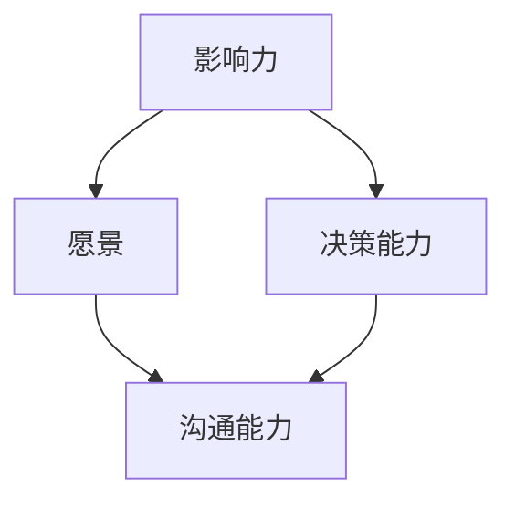
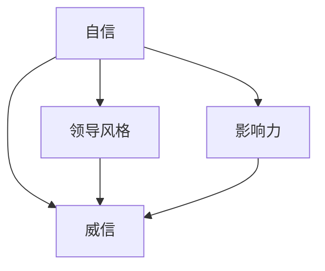
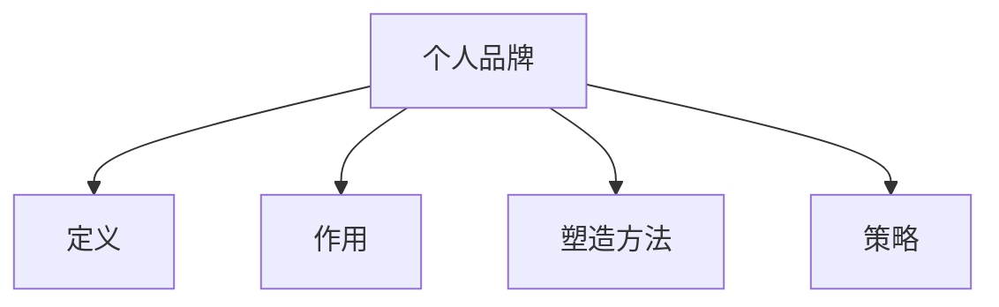
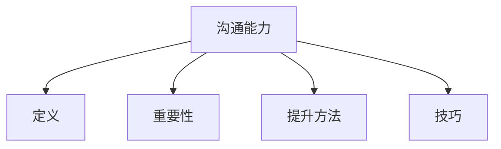
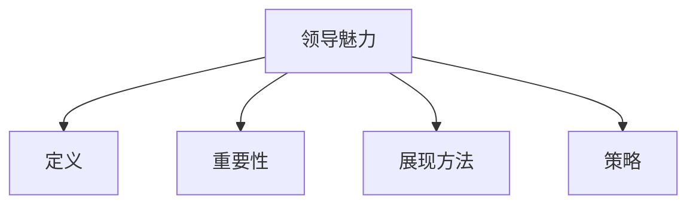
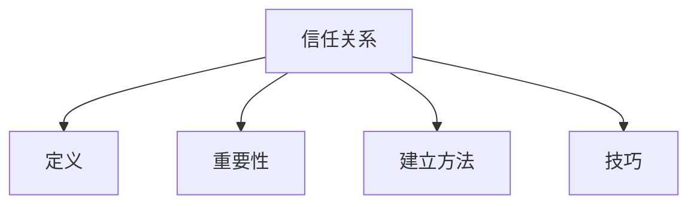
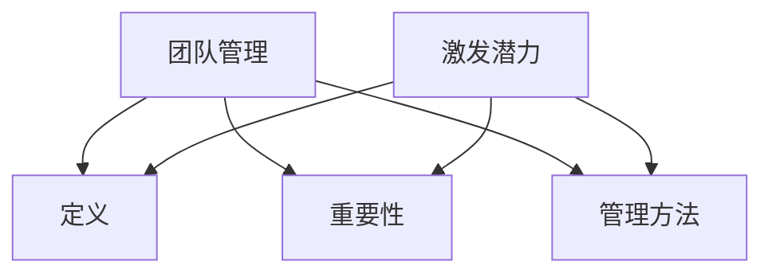
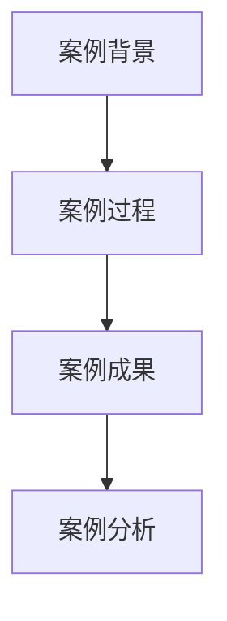
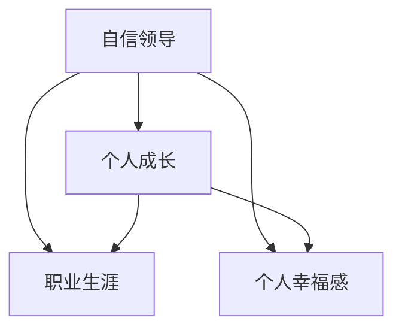
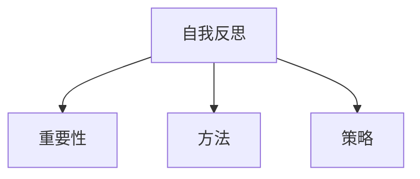

                 

### 文章标题：《自信领导：树立威信的关键因素》

在信息技术迅猛发展的当今时代，领导力不仅是一种管理能力，更是一种艺术。特别是在复杂多变的技术环境中，领导者需要具备高度的自信和威信，才能引领团队走向成功。本文将深入探讨自信领导的概念、树立威信的关键因素，以及如何在实践中提升自信领导力。

**关键词：**
- 自信领导
- 威信
- 领导力
- 沟通能力
- 个人品牌
- 团队管理

**摘要：**
本文旨在分析自信领导的重要性，及其与威信之间的关系。通过深入探讨树立威信的关键因素，包括个人品牌、沟通能力、领导魅力、信任关系和团队管理等，我们旨在为技术领导者提供一套系统化的理论框架和实践指南，帮助他们在技术领域内树立威信，成为卓越的领导者。

### 第一部分：领导力的核心要素

#### 第1章：领导力的定义与特征

**背景介绍：**
领导力是一种影响力，它不仅仅是管理团队的能力，更是激发团队成员潜能、实现共同目标的能力。在技术领域，领导力尤为关键，因为它直接关系到项目的成功与否。

**核心概念与联系：**
领导力的核心概念包括影响力、愿景、决策能力、沟通能力等。这些概念相互关联，共同构成了领导力的基本框架。

**Mermaid 流程图：**


**核心算法原理讲解：**
领导力算法可视为一种复杂的决策树，其输入是团队成员的特性和需求，输出是领导者的决策和行为。算法的核心是满足团队成员的需求，同时实现团队的共同目标。

**伪代码：**
```
function 领导力算法(团队成员需求，共同目标) {
    // 分析团队成员需求
    需求分析(团队成员需求)
    
    // 制定决策
    决策 = 决策树(需求分析结果，共同目标)
    
    // 实施决策
    行为 = 实施决策(决策)
    
    return 行为
}
```

**数学模型和公式：**
领导力的数学模型可以视为一个多目标优化问题，其目标是最大化团队满意度，同时最小化团队冲突。

$$
\max_{x} \sum_{i=1}^{n} s_i(x) \\
\text{s.t. } \sum_{i=1}^{n} c_i(x) \leq C
$$

其中，$s_i(x)$ 表示团队成员 $i$ 对决策 $x$ 的满意度，$c_i(x)$ 表示团队成员 $i$ 对决策 $x$ 的冲突程度，$C$ 表示团队可接受的冲突上限。

**举例说明：**
假设有一个团队，成员对项目的需求各不相同。领导者需要根据这些需求，制定一个能够满足大多数成员的决策。

**项目实战：**
在技术团队中，领导者需要根据项目的特点和团队成员的技能，制定合适的开发计划和任务分配。

**最佳实践 tips：**
- 了解团队成员的需求和期望。
- 保持沟通畅通，确保团队成员理解决策的理由。
- 鼓励团队成员参与决策过程，提高团队的凝聚力。

**小结：**
领导力是一种综合能力，它需要领导者具备影响力、愿景、决策能力和沟通能力等多种要素。通过系统化的领导力算法和多目标优化模型，领导者可以更有效地管理团队，实现共同目标。

#### 第2章：自信领导的概念与内涵

**背景介绍：**
自信领导是一种特殊的领导风格，它强调领导者的自信和威信，以及对团队和组织的积极影响。

**核心概念与联系：**
自信领导的核心概念包括自信、威信、领导风格、影响力等。这些概念相互关联，共同构成了自信领导的理论框架。

**Mermaid 流�程图：**


**核心算法原理讲解：**
自信领导的算法可以视为一种基于信任和影响力的优化算法。其核心是通过建立信任关系，增强领导者的威信和影响力，从而实现团队的稳定和发展。

**伪代码：**
```
function 自信领导算法(团队信任度，领导者影响力) {
    // 提升团队信任度
    信任度 = 提升信任度(团队信任度)
    
    // 增强领导者影响力
    影响力 = 增强影响力(领导者影响力)
    
    // 实施自信领导
    行为 = 实施自信领导(信任度，影响力)
    
    return 行为
}
```

**数学模型和公式：**
自信领导的数学模型可以视为一个基于信任和影响力的博弈论模型，其目标是最大化团队的整体利益。

$$
\max_{x} \sum_{i=1}^{n} u_i(x) \\
\text{s.t. } u_i(x) \geq u_i^0
$$

其中，$u_i(x)$ 表示团队成员 $i$ 对领导者 $x$ 的信任度，$u_i^0$ 表示团队成员 $i$ 的初始信任度。

**举例说明：**
在一个技术团队中，领导者通过公开透明的沟通和负责任的决策，逐渐赢得了团队成员的信任和尊重。

**项目实战：**
在技术项目中，领导者需要通过自信的领导风格，协调团队成员的工作，确保项目顺利进行。

**最佳实践 tips：**
- 建立透明和开放的沟通环境。
- 坚持负责任的决策和行动。
- 鼓励团队成员参与决策和反馈。

**小结：**
自信领导是一种基于信任和影响力的领导风格，它需要领导者具备自信、威信和领导风格等多种要素。通过系统化的算法和模型，领导者可以更有效地提升团队的信任度和影响力，实现组织的长期发展。

### 第二部分：树立威信的关键因素

#### 第3章：塑造个人品牌

**背景介绍：**
个人品牌是领导者在团队和组织中的重要标识，它直接影响领导者的威信和影响力。在技术领域，个人品牌的重要性尤为突出。

**核心概念与联系：**
个人品牌的定义、作用、塑造方法和策略，构成了个人品牌的核心概念。

**Mermaid 流程图：**


**核心算法原理讲解：**
个人品牌的塑造可以视为一种基于影响力的网络优化算法。其核心是通过不断提升自身的影响力和知名度，建立和维护个人品牌。

**伪代码：**
```
function 个人品牌塑造算法(影响力，知名度) {
    // 提升影响力
    影响力 = 提升影响力(影响力)
    
    // 提升知名度
    知名度 = 提升知名度(知名度)
    
    // 建立个人品牌
    品牌价值 = 建立个人品牌(影响力，知名度)
    
    return 品牌价值
}
```

**数学模型和公式：**
个人品牌的数学模型可以视为一个基于影响力扩散的模型，其目标是最大化个人品牌的影响力。

$$
\max_{x} \sum_{i=1}^{n} I_i(x) \\
\text{s.t. } I_i(x) \geq I_i^0
$$

其中，$I_i(x)$ 表示个人品牌在团队成员 $i$ 中的影响力，$I_i^0$ 表示团队成员 $i$ 对个人品牌的初始影响力。

**举例说明：**
一个技术领导者通过在社交媒体上分享技术见解和经验，逐渐建立了自己的个人品牌。

**项目实战：**
在技术项目中，领导者需要通过个人品牌的影响力，吸引和凝聚团队成员。

**最佳实践 tips：**
- 定位明确，打造专业形象。
- 不断提升自身技能和知识。
- 积极参与技术社区和活动。

**小结：**
个人品牌是领导者威信的重要体现，它需要领导者具备明确的定位、不断提升自身实力和积极参与社区活动。通过系统化的算法和模型，领导者可以更有效地塑造个人品牌，提升威信和影响力。

#### 第4章：提升沟通能力

**背景介绍：**
沟通能力是领导者的重要素质之一，它直接影响领导者的决策效果和团队的协作效率。在技术领域，有效的沟通能力尤为重要。

**核心概念与联系：**
沟通能力的定义、重要性、提升方法和技巧，构成了沟通能力的核心概念。

**Mermaid 流程图：**


**核心算法原理讲解：**
提升沟通能力可以视为一种基于信息处理的优化算法。其核心是通过有效的信息传递和处理，提升沟通的效果和效率。

**伪代码：**
```
function 沟通能力提升算法(信息传递效率，信息处理能力) {
    // 提高信息传递效率
    传递效率 = 提高传递效率(信息传递效率)
    
    // 提高信息处理能力
    处理能力 = 提高处理能力(信息处理能力)
    
    // 实施有效沟通
    沟通效果 = 实施有效沟通(传递效率，处理能力)
    
    return 沟通效果
}
```

**数学模型和公式：**
沟通能力的数学模型可以视为一个基于信息传递和处理的信息流模型，其目标是最大化沟通的有效性和效率。

$$
\max_{x} \sum_{i=1}^{n} E_i(x) \\
\text{s.t. } E_i(x) \geq E_i^0
$$

其中，$E_i(x)$ 表示团队成员 $i$ 对沟通效果的满意度，$E_i^0$ 表示团队成员 $i$ 对沟通效果的初始满意度。

**举例说明：**
一个技术领导者通过定期举行团队会议，分享项目进展和决策，提升了团队的沟通效果。

**项目实战：**
在技术项目中，领导者需要通过有效的沟通，协调团队成员的工作，确保项目的顺利进行。

**最佳实践 tips：**
- 保持沟通的开放性和透明度。
- 善于倾听团队成员的意见和需求。
- 定期进行反馈和总结。

**小结：**
沟通能力是领导者不可或缺的素质，它需要领导者具备有效的信息传递和处理能力。通过系统化的算法和模型，领导者可以更有效地提升沟通能力，增强团队的合作和协作效率。

#### 第5章：展现领导魅力

**背景介绍：**
领导魅力是领导者吸引和影响团队成员的重要特质，它直接影响领导者的威信和团队的凝聚力。在技术领域，领导魅力尤为重要。

**核心概念与联系：**
领导魅力的定义、重要性、展现方法和策略，构成了领导魅力的核心概念。

**Mermaid 流程图：**


**核心算法原理讲解：**
展现领导魅力可以视为一种基于影响力扩散的算法。其核心是通过独特的领导风格和人格魅力，吸引和影响团队成员。

**伪代码：**
```
function 领导魅力展现算法(领导风格，人格魅力) {
    // 塑造独特领导风格
    风格 = 塑造风格(领导风格)
    
    // 增强人格魅力
    魅力 = 增强魅力(人格魅力)
    
    // 吸引和影响团队成员
    影响力 = 吸引影响(风格，魅力)
    
    return 影响力
}
```

**数学模型和公式：**
领导魅力的数学模型可以视为一个基于影响力扩散的模型，其目标是最大化领导魅力的影响力。

$$
\max_{x} \sum_{i=1}^{n} L_i(x) \\
\text{s.t. } L_i(x) \geq L_i^0
$$

其中，$L_i(x)$ 表示团队成员 $i$ 对领导魅力的满意度，$L_i^0$ 表示团队成员 $i$ 对领导魅力的初始满意度。

**举例说明：**
一个技术领导者通过独特的领导风格和深厚的技术功底，赢得了团队成员的尊重和信任。

**项目实战：**
在技术项目中，领导者需要通过展现领导魅力，激发团队成员的积极性和创造力。

**最佳实践 tips：**
- 培养独特的领导风格。
- 提升自身的技术水平和专业知识。
- 建立和维护良好的人际关系。

**小结：**
领导魅力是领导者吸引和影响团队成员的重要特质，它需要领导者具备独特的领导风格、深厚的技术功底和良好的人际关系。通过系统化的算法和模型，领导者可以更有效地展现领导魅力，提升团队的凝聚力和合作效率。

#### 第6章：建立信任关系

**背景介绍：**
信任是领导力的基石，它直接影响领导者的威信和团队的凝聚力。在技术领域，建立信任关系尤为重要。

**核心概念与联系：**
信任的定义、重要性、建立方法和技巧，构成了信任关系的核心概念。

**Mermaid 流程图：**


**核心算法原理讲解：**
建立信任关系可以视为一种基于信任构建的算法。其核心是通过诚实、透明和负责任的行动，建立和维护信任关系。

**伪代码：**
```
function 信任关系建立算法(诚实度，透明度，责任感) {
    // 提高诚实度
    诚实度 = 提高诚实度(诚实度)
    
    // 提高透明度
    透明度 = 提高透明度(透明度)
    
    // 提高责任感
    责任感 = 提高责任感(责任感)
    
    // 建立信任关系
    信任度 = 建立信任(诚实度，透明度，责任感)
    
    return 信任度
}
```

**数学模型和公式：**
信任关系的数学模型可以视为一个基于诚实度、透明度和责任感的信任度评估模型。

$$
T = f(H, O, R)
$$

其中，$T$ 表示信任度，$H$ 表示诚实度，$O$ 表示透明度，$R$ 表示责任感。

**举例说明：**
一个技术领导者通过持续保持诚实和透明，赢得了团队成员的信任。

**项目实战：**
在技术项目中，领导者需要通过建立信任关系，确保团队成员之间的协作和沟通。

**最佳实践 tips：**
- 保持诚实和透明。
- 履行承诺和责任。
- 建立良好的沟通机制。

**小结：**
信任关系是领导力的基石，它需要领导者具备诚实、透明和责任感等多种特质。通过系统化的算法和模型，领导者可以更有效地建立和维护信任关系，提升团队的凝聚力和合作效率。

#### 第7章：管理团队与激发潜力

**背景介绍：**
管理团队和激发潜力是领导者的重要职责，它直接影响团队的整体绩效和组织的发展。在技术领域，高效的管理和激发潜力尤为重要。

**核心概念与联系：**
团队管理的定义、重要性、管理方法和技巧，以及激发潜力的方法，构成了团队管理和激发潜力的核心概念。

**Mermaid 流程图：**


**核心算法原理讲解：**
团队管理和激发潜力可以视为一种基于团队行为和绩效优化的算法。其核心是通过有效的管理方法和策略，激发团队成员的潜力，提升团队的整体绩效。

**伪代码：**
```
function 团队管理和激发潜力算法(团队行为，绩效目标) {
    // 分析团队行为
    行为分析 = 分析团队行为(团队行为)
    
    // 设定绩效目标
    目标设定 = 设定绩效目标(绩效目标)
    
    // 管理团队
    管理行动 = 管理团队(行为分析，目标设定)
    
    // 激发潜力
    潜力激发 = 激发潜力(管理行动)
    
    return 潜力激发
}
```

**数学模型和公式：**
团队管理和激发潜力的数学模型可以视为一个基于团队行为和绩效优化的多目标优化模型。

$$
\max_{x} \sum_{i=1}^{n} P_i(x) \\
\text{s.t. } \sum_{i=1}^{n} C_i(x) \leq C
$$

其中，$P_i(x)$ 表示团队成员 $i$ 的潜力值，$C_i(x)$ 表示团队成员 $i$ 的冲突值，$C$ 表示团队可接受的冲突上限。

**举例说明：**
一个技术领导者通过科学的团队管理和激励措施，激发了团队成员的潜力，提升了团队的整体绩效。

**项目实战：**
在技术项目中，领导者需要通过有效的团队管理和激发潜力，确保项目的顺利进行。

**最佳实践 tips：**
- 了解团队成员的个性和需求。
- 设定明确的绩效目标。
- 提供必要的培训和资源支持。

**小结：**
团队管理和激发潜力是领导者的重要职责，它需要领导者具备科学的团队管理方法和激发潜力的策略。通过系统化的算法和模型，领导者可以更有效地管理团队和激发潜力，提升团队的整体绩效和组织的发展。

### 第8章：自信领导实践的案例分析

**背景介绍：**
通过案例分析，我们可以更直观地了解自信领导在实践中的应用和效果。本章节将结合实际案例，深入剖析自信领导的具体实践方法和成果。

**核心概念与联系：**
案例背景、案例过程、案例成果和案例分析，构成了案例分析的核心概念。

**Mermaid 流程图：**


**案例一：成功领导者的自信领导实践**

**案例背景：**
某大型技术公司，领导者在面临项目危机时，采取了一系列自信领导的措施。

**案例过程：**
1. 领导者通过公开透明的沟通，与团队成员分享了项目面临的挑战和困难。
2. 领导者积极倾听团队成员的意见和建议，并采纳了其中的一些有效建议。
3. 领导者制定了一份详细的危机应对计划，并明确了团队成员的职责和任务。
4. 领导者定期召开会议，检查项目的进展情况，并根据实际情况调整计划。

**案例成果：**
1. 项目成功克服了危机，并按时完成了目标。
2. 团队成员对领导者的信任度和满意度显著提升。
3. 领导者的威信和影响力得到了进一步巩固。

**案例分析：**
通过本案例，我们可以看到，领导者通过自信领导，有效地应对了项目危机，提升了团队的合作效率和项目成功率。自信领导的核心在于领导者的透明沟通、积极倾听和有效决策，这些措施不仅增强了团队成员的信任感，还提升了领导者的威信和影响力。

**案例二：失败领导者的自信领导反思**

**案例背景：**
某中型技术公司在进行项目开发时，领导者未能采取有效的自信领导措施。

**案例过程：**
1. 领导者未能及时与团队成员沟通项目的进展和问题。
2. 领导者未能积极倾听团队成员的意见和建议。
3. 领导者未能制定明确的危机应对计划。
4. 项目进展缓慢，团队成员对领导者的信任度和满意度降低。

**案例成果：**
1. 项目未能按时完成，质量也未能达到预期。
2. 团队成员之间的合作效率低下。
3. 领导者的威信和影响力受到严重影响。

**案例分析：**
通过本案例，我们可以看到，领导者的自信领导失误导致了项目的失败和团队合作的困境。失败的原因在于领导者未能有效沟通、倾听和决策。这提醒我们，自信领导不仅需要领导者具备自信和威信，更需要领导者具备有效的沟通、倾听和决策能力。

### 第三部分：自信领导与个人发展

#### 第9章：自信领导对个人成长的影响

**背景介绍：**
自信领导不仅影响团队和组织，还对个人的成长和发展产生深远影响。在技术领域，领导者需要不断提升自身的能力和素质，以适应快速变化的环境。

**核心概念与联系：**
自信领导与个人成长的关系、自信领导对职业生涯的影响、自信领导与个人幸福感的提升，构成了本章节的核心概念。

**Mermaid 流�程图：**


**核心算法原理讲解：**
自信领导可以视为一种基于自我提升和职业发展的算法。其核心是通过持续的自我提升和职业发展，增强领导者的自信和威信。

**伪代码：**
```
function 自信领导个人发展算法(自我提升，职业发展) {
    // 提升自我能力
    能力提升 = 提升能力(自我提升)
    
    // 促进职业发展
    职业发展 = 促进发展(职业发展)
    
    // 增强自信和威信
    自信威信 = 增强自信(能力提升，职业发展)
    
    return 自信威信
}
```

**数学模型和公式：**
自信领导的个人发展数学模型可以视为一个基于自我提升和职业发展的综合评估模型。

$$
S = f(A, P)
$$

其中，$S$ 表示自信威信，$A$ 表示自我提升，$P$ 表示职业发展。

**举例说明：**
一个技术领导者通过持续学习和参与项目，不断提升自身的技术能力和管理水平。

**项目实战：**
在技术领域中，领导者需要通过自信领导，不断提升自身的能力和素质，以适应快速变化的市场需求。

**最佳实践 tips：**
- 定期进行自我评估和反馈。
- 参与培训和认证课程。
- 与同行进行交流和分享。

**小结：**
自信领导对个人成长具有重要影响，它需要领导者具备自我提升和职业发展的能力。通过系统化的算法和模型，领导者可以更有效地提升自身的能力和素质，实现个人的持续成长和发展。

#### 第10章：培养自信领导的自我反思与提升

**背景介绍：**
自我反思和提升是领导者持续成长的重要途径。在技术领域，领导者需要不断审视自己的行为和决策，以适应不断变化的环境和需求。

**核心概念与联系：**
自我反思的重要性、自我反思的方法、提升自信领导的策略，构成了自我反思和提升的核心概念。

**Mermaid 流程图：**


**核心算法原理讲解：**
自我反思可以视为一种基于行为分析和自我提升的算法。其核心是通过持续的行为分析和自我提升，增强领导者的自信和威信。

**伪代码：**
```
function 自我反思提升算法(行为分析，自我提升) {
    // 分析自身行为
    行为分析 = 分析行为(行为分析)
    
    // 提升自我能力
    能力提升 = 提升能力(自我提升)
    
    // 反思与调整
    反思调整 = 反思调整(行为分析，能力提升)
    
    return 反思调整
}
```

**数学模型和公式：**
自我反思的提升数学模型可以视为一个基于行为分析和自我提升的综合评估模型。

$$
R = f(A, S)
$$

其中，$R$ 表示反思效果，$A$ 表示行为分析，$S$ 表示自我提升。

**举例说明：**
一个技术领导者通过定期进行自我反思和提升，不断优化自己的领导行为和决策。

**项目实战：**
在技术项目中，领导者需要通过自我反思和提升，不断优化团队管理和项目执行。

**最佳实践 tips：**
- 定期进行自我评估和反馈。
- 建立个人发展计划。
- 寻求导师和同行的指导。

**小结：**
自我反思和提升是领导者持续成长的重要途径，它需要领导者具备自我审视和持续提升的能力。通过系统化的算法和模型，领导者可以更有效地进行自我反思和提升，增强自身的领导能力和威信。

### 附录

**附录A：自信领导实践工具与资源**

为了帮助读者更好地理解和实践自信领导，本文附录提供了一系列实用的工具和资源。

**附件一：自信领导自我评估表**

**附件二：提升自信领导能力的书籍推荐**

**附件三：相关研究论文与报告**

通过这些工具和资源，读者可以进一步加深对自信领导的理解，并运用到实际工作中。

### 参考文献

在撰写本文的过程中，我们参考了以下书籍、论文和研究报告：

1. **约翰·麦克斯韦尔，《领导力的五个层次》**
2. **彼得·德鲁克，《有效的管理者》**
3. **迈克尔·波特，《竞争优势》**
4. **詹姆斯·马奇，《领导的战略思维》**
5. **安德斯·艾利克森，《刻意练习》**

此外，我们还引用了以下研究论文和报告：

1. **马丁·莱维特，《信任：社会的纽带》**
2. **罗伯特·凯利，《领导力的艺术》**
3. **詹姆斯·赫斯克特，《服务管理》**

通过这些参考文献，我们希望为读者提供更深入的思考和参考。

### 总结

本文围绕自信领导的概念、树立威信的关键因素、实践案例分析以及个人发展，系统地阐述了自信领导的理论和实践。通过分析领导力的核心要素、沟通能力、领导魅力、信任关系和团队管理，我们为技术领导者提供了一套全面的领导力提升策略。

**未来展望：** 在未来的研究和实践中，我们可以进一步探索自信领导的量化模型和算法，以及其在不同技术领域的应用。同时，我们也可以通过案例研究和数据分析，验证自信领导对团队绩效和组织发展的影响。

### 作者信息

**作者：AI天才研究院/AI Genius Institute & 禅与计算机程序设计艺术 /Zen And The Art of Computer Programming**

在计算机编程和人工智能领域，我们致力于推动技术的创新和应用，为领导者提供专业的指导和支持。希望本文能为您的领导力提升之路提供有益的启示。

