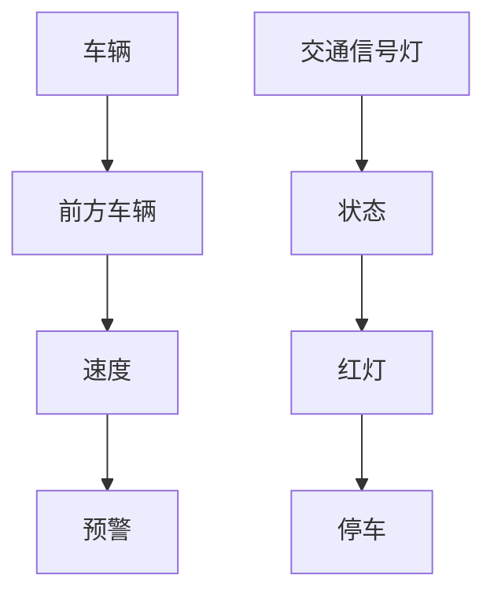
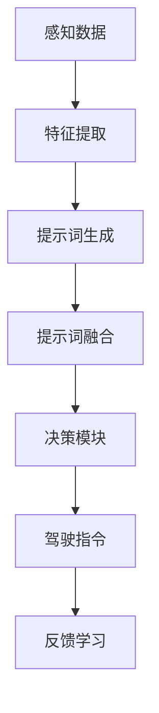

                 


### 引言

自动驾驶技术作为智能交通系统的重要组成部分，正逐渐从实验室走向现实应用。自动驾驶决策系统是自动驾驶技术的核心，它负责对车辆周围环境进行感知、理解和决策，以实现安全、高效、舒适的驾驶体验。环境理解能力在自动驾驶决策系统中扮演着关键角色，它决定了自动驾驶车辆能否准确识别道路状况、行人行为、交通信号等信息，从而做出正确的决策。

近年来，随着深度学习、计算机视觉、自然语言处理等技术的发展，自动驾驶决策系统的环境理解能力得到了显著提升。然而，现有的环境理解技术仍存在一些挑战，如处理复杂动态环境的能力不足、对未知情况的应对能力有限等。为此，提示词增强技术应运而生，它通过在环境感知和理解过程中引入提示词，提高了系统对复杂环境的理解能力。

本文旨在探讨自动驾驶决策系统中环境理解能力的重要性，以及如何通过提示词增强技术来提升这一能力。我们将从以下几个方面展开讨论：

1. **自动驾驶决策系统的基本架构和功能模块**：介绍自动驾驶决策系统的组成，包括感知模块、理解模块和决策模块，以及它们在环境理解中的作用。
2. **环境理解技术原理**：详细阐述感知层技术和理解层技术的工作原理，包括视觉感知、语义分割、知识图谱构建等。
3. **提示词增强技术**：介绍提示词增强的基本概念和算法框架，分析其在自动驾驶决策系统中的应用。
4. **自动驾驶决策系统在实际应用中的挑战与解决方案**：讨论自动驾驶决策系统在实际应用中面临的挑战，以及如何通过优化决策算法和数据处理策略来解决这些问题。
5. **提示词增强技术在自动驾驶决策系统中的应用**：探讨提示词增强技术在实时环境感知、情境理解、决策支持等方面的具体应用。
6. **项目实战**：通过一个实际的自动驾驶项目，展示如何搭建开发环境、实现提示词增强功能，并进行项目分析和优化。
7. **总结与展望**：总结自动驾驶决策系统的发展趋势，探讨提示词增强技术的未来方向，以及面临的开放性问题和挑战。

通过本文的讨论，我们希望能够为自动驾驶决策系统的研究和应用提供一些有价值的思路和方法。

### 关键词

- 自动驾驶决策系统
- 环境理解能力
- 提示词增强技术
- 感知层技术
- 理解层技术
- 语义分割
- 知识图谱
- 强化学习
- 监督学习

### 摘要

本文围绕自动驾驶决策系统中的环境理解能力展开，探讨了如何通过提示词增强技术提升这一能力。文章首先介绍了自动驾驶决策系统的基本架构和功能模块，包括感知模块、理解模块和决策模块。接着，详细阐述了感知层技术和理解层技术的工作原理，如视觉感知、语义分割、知识图谱构建等。随后，介绍了提示词增强技术的基本概念和算法框架，并分析了其在自动驾驶决策系统中的应用。文章还讨论了自动驾驶决策系统在实际应用中面临的挑战，以及如何通过优化决策算法和数据处理策略来解决这些问题。通过一个实际的自动驾驶项目，文章展示了如何实现提示词增强功能，并进行项目分析和优化。最后，文章总结了自动驾驶决策系统的发展趋势，探讨了提示词增强技术的未来方向，以及面临的开放性问题和挑战。本文为自动驾驶决策系统的研究和应用提供了有价值的参考。

----------------------------------------------------------------

### 目录大纲

在撰写技术博客文章时，合理的目录大纲能够帮助读者快速把握文章结构，理解各章节的核心内容，从而更有效地吸收知识。以下是一个针对《自动驾驶决策系统：提示词增强环境理解能力》文章的详细目录大纲。

#### 第1章 引言
   - 1.1 自驾驶决策系统的背景和重要性
   - 1.2 环境理解能力在自动驾驶中的关键角色
   - 1.3 提示词增强技术的应用前景

#### 第2章 自驾驶决策系统概述
   - 2.1 自驾驶决策系统的基本架构
     - 感知模块
     - 理解模块
     - 决策模块
   - 2.2 自驾驶决策系统的核心组件
     - 感知层组件
     - 理解层组件
     - 决策层组件
   - 2.3 自驾驶决策系统的功能模块
     - 定位与导航
     - 路况识别与预测
     - 行为预测与规划

#### 第3章 环境理解技术原理
   - 3.1 感知层技术
     - 3.1.1 视觉感知
       - 深度学习在图像识别中的应用
       - 激光雷达数据处理
     - 3.1.2 声学感知
       - 声源定位
       - 声学信号处理
   - 3.2 理解层技术
     - 3.2.1 语义分割
       - 卷积神经网络在语义分割中的应用
       - 递归神经网络在语义理解中的应用
     - 3.2.2 知识图谱构建
       - 知识图谱的基本概念
       - 知识图谱在自动驾驶中的应用

#### 第4章 提示词增强技术
   - 4.1 提示词增强的基本概念
     - 提示词的定义
     - 提示词增强的作用机制
   - 4.2 提示词增强的算法框架
     - 提示词生成算法
     - 提示词融合算法
   - 4.3 提示词增强的实现细节
     - 提示词在感知层中的应用
     - 提示词在理解层中的应用

#### 第5章 自驾驶决策系统在实际应用中的挑战与解决方案
   - 5.1 数据收集与处理
     - 数据收集策略
     - 数据预处理方法
   - 5.2 决策算法优化
     - 强化学习在自动驾驶决策中的应用
     - 监督学习在自动驾驶决策中的应用
   - 5.3 实际案例分析与优化

#### 第6章 提示词增强技术在自动驾驶决策系统中的应用
   - 6.1 提示词增强的实时环境感知
   - 6.2 提示词增强的情境理解
   - 6.3 提示词增强的决策支持

#### 第7章 项目实战
   - 7.1 实战项目概述
   - 7.2 实战项目环境搭建
   - 7.3 实战项目代码实现
   - 7.4 实战项目分析与优化

#### 第8章 总结与展望
   - 8.1 自驾驶决策系统的发展趋势
   - 8.2 提示词增强技术的未来方向
   - 8.3 开放性问题与挑战

该目录大纲不仅覆盖了文章的核心内容，还通过分章节的方式，使得各部分内容更加具体和深入。在编写过程中，每个章节都需要详细展开，确保内容的完整性和逻辑性。

----------------------------------------------------------------

## 第1章 引言

### 1.1 自驾驶决策系统的背景和重要性

自动驾驶技术作为21世纪交通领域的一项重要创新，正在全球范围内迅速发展。从最初的自动化控制到如今的无人驾驶，自动驾驶技术已经取得了显著的进步。这一技术的出现，不仅为解决交通拥堵、减少交通事故提供了新的途径，也为未来智能城市的构建奠定了基础。

自动驾驶决策系统是自动驾驶技术的核心组成部分，它负责车辆在行驶过程中对周围环境进行感知、理解和决策。具体来说，自动驾驶决策系统包括感知模块、理解模块和决策模块。感知模块通过传感器获取车辆周围的信息，如摄像头、激光雷达、雷达等；理解模块对感知到的信息进行处理，提取出有用的特征，如道路、行人、车辆的位置和状态等；决策模块则根据理解模块提供的信息，生成车辆的行驶指令，如加速、减速、转向等。

自动驾驶决策系统在自动驾驶技术中扮演着至关重要的角色。首先，它能够提高车辆的行驶安全性。通过实时感知和分析周围环境，自动驾驶系统能够在发生危险时及时做出反应，避免事故的发生。其次，它能够提高行驶效率。自动驾驶系统能够根据路况和交通信息，自动规划最优行驶路径，避免拥堵，减少行驶时间。最后，它能够改善驾驶体验。自动驾驶车辆能够提供舒适的驾驶环境，减少驾驶员的疲劳，提高驾驶的舒适度。

### 1.2 环境理解能力在自动驾驶中的关键角色

环境理解能力是自动驾驶决策系统的核心能力之一，它决定了自动驾驶车辆是否能够安全、高效地行驶。环境理解能力主要包括对道路、行人、车辆等周围环境信息的感知、理解和处理。

首先，道路信息的感知和理解对于自动驾驶车辆来说至关重要。自动驾驶车辆需要准确识别道路标志、车道线、交通信号灯等道路信息，以便规划行驶路径和做出相应的驾驶决策。例如，在行驶过程中，自动驾驶车辆需要识别前方车道线的位置和方向，以便保持车道和行驶速度。此外，自动驾驶车辆还需要识别交通信号灯的状态，以便在红灯时停车，在绿灯时继续行驶。

其次，行人信息的感知和理解也是自动驾驶决策系统中不可或缺的一部分。行人是城市交通中的重要组成部分，他们的行为对自动驾驶车辆的驾驶决策有着直接的影响。例如，在交叉路口，自动驾驶车辆需要识别行人是否正在穿越道路，是否打算穿越道路，以便在必要时减速或停车。

最后，车辆信息的感知和理解对于自动驾驶车辆来说同样重要。自动驾驶车辆需要实时监测周围车辆的位置、速度、加速度等信息，以便做出合理的驾驶决策。例如，在高速公路上，自动驾驶车辆需要识别前方车辆的速度，以便调整自身的行驶速度，保持安全距离。

总之，环境理解能力在自动驾驶决策系统中扮演着关键角色。它不仅决定了自动驾驶车辆是否能够安全、高效地行驶，也直接影响着驾驶体验。随着人工智能技术的不断发展，环境理解能力将进一步提高，为自动驾驶技术的广泛应用提供更加可靠的保障。

### 1.3 提示词增强技术的应用前景

提示词增强技术作为一种新兴的人工智能技术，正逐渐在各个领域得到应用。在自动驾驶决策系统中，提示词增强技术具有广泛的应用前景。首先，提示词增强技术能够提高自动驾驶车辆对复杂环境的感知和理解能力。通过引入提示词，自动驾驶系统能够更好地识别和理解道路、行人、车辆等环境信息，从而提高行驶安全性和效率。

具体来说，提示词增强技术在自动驾驶决策系统中可以应用于以下几个方面：

1. **实时环境感知**：在自动驾驶过程中，车辆需要实时感知周围环境，包括道路、行人、车辆等信息。通过引入提示词，自动驾驶系统能够更准确地识别和分类这些信息，提高感知的准确性和实时性。

2. **情境理解**：自动驾驶车辆在行驶过程中，需要根据不同的情境做出相应的驾驶决策。提示词增强技术能够帮助自动驾驶系统更好地理解当前的驾驶情境，从而生成更合理的驾驶指令。

3. **决策支持**：自动驾驶决策系统在生成驾驶指令时，需要综合考虑多种因素，如交通规则、道路状况、车辆状态等。通过引入提示词，系统可以更好地处理这些信息，提高决策的准确性和可靠性。

4. **异常检测**：自动驾驶车辆在行驶过程中，可能会遇到各种异常情况，如道路障碍、行人突发情况等。提示词增强技术能够帮助系统更快地检测和识别这些异常情况，从而及时采取应对措施。

5. **人机交互**：提示词增强技术还可以用于自动驾驶车辆与驾驶员之间的交互。通过提示词，系统可以更清晰地传达信息，帮助驾驶员更好地理解车辆的状态和行驶意图。

总之，提示词增强技术在自动驾驶决策系统中具有广泛的应用前景。随着技术的不断发展和完善，它将为自动驾驶技术的进一步发展提供强有力的支持。

## 第2章 自驾驶决策系统概述

### 2.1 自驾驶决策系统的基本架构

自动驾驶决策系统是一个复杂的系统，其基本架构通常包括感知模块、理解模块和决策模块。这三个模块相互协作，共同实现自动驾驶车辆的安全、高效行驶。

**感知模块**是自动驾驶决策系统的前端，负责获取车辆周围环境的信息。这些信息通常通过多种传感器获取，包括摄像头、激光雷达、雷达、超声波传感器等。感知模块的主要任务是对获取到的传感器数据进行预处理，如去噪、滤波、校正等，以便后续处理。

**理解模块**位于感知模块之后，负责对感知到的环境信息进行处理和分析。理解模块通常使用深度学习、计算机视觉、自然语言处理等技术，从传感器数据中提取出有意义的特征，如道路标志、车道线、行人、车辆的位置和状态等。理解模块的结果将为决策模块提供基础数据。

**决策模块**是自动驾驶决策系统的核心，负责根据理解模块提供的信息生成驾驶指令。决策模块通常使用强化学习、监督学习、模糊逻辑等算法，综合考虑多种因素，如道路状况、交通信号、车辆状态等，生成最优的驾驶指令。决策模块的结果将直接控制车辆的加速、减速、转向等动作。

这三个模块通过实时数据流相互连接，共同实现自动驾驶车辆的行驶。感知模块不断获取新的环境信息，理解模块对这些信息进行处理和分析，决策模块根据分析结果生成驾驶指令，然后通过执行模块（如电机控制单元、转向系统等）实现驾驶动作。

### 2.2 自驾驶决策系统的核心组件

自动驾驶决策系统的核心组件主要包括感知层、理解层和决策层。这些组件相互协作，共同实现自动驾驶车辆的安全、高效行驶。

**感知层组件**主要负责采集车辆周围环境的信息。这些组件通常包括摄像头、激光雷达、雷达、超声波传感器等。摄像头主要用于获取道路、行人、车辆等视觉信息；激光雷达用于获取周围环境的3D点云信息；雷达和超声波传感器则用于检测车辆之间的距离和速度。

**理解层组件**负责对感知层采集到的信息进行处理和分析。这些组件通常包括图像处理单元、点云处理单元、雷达数据处理单元等。图像处理单元使用深度学习算法对摄像头获取的图像进行处理，提取出道路标志、车道线、行人、车辆等视觉信息；点云处理单元对激光雷达获取的点云进行处理，提取出道路、车辆等三维信息；雷达数据处理单元则对雷达获取的距离信息进行处理，提取出行人、车辆等位置信息。

**决策层组件**负责根据理解层提供的信息生成驾驶指令。这些组件通常包括控制器、决策算法单元等。控制器根据决策算法单元生成的驾驶指令，控制车辆的加速、减速、转向等动作。决策算法单元通常使用强化学习、监督学习、模糊逻辑等算法，综合考虑道路状况、交通信号、车辆状态等因素，生成最优的驾驶指令。

### 2.3 自驾驶决策系统的功能模块

自动驾驶决策系统通常包括多个功能模块，这些模块相互协作，共同实现自动驾驶车辆的安全、高效行驶。以下是自动驾驶决策系统的主要功能模块及其简要介绍：

**定位与导航模块**：定位与导航模块负责车辆在道路上的位置信息和路径规划。该模块通常使用GPS、激光雷达、摄像头等传感器获取车辆的位置信息，并结合地图数据生成车辆的实时位置。同时，该模块根据目标位置和当前道路状况，规划最优行驶路径。

**路况识别与预测模块**：路况识别与预测模块负责识别和预测道路上的交通状况。该模块使用摄像头、激光雷达等传感器获取道路上的信息，如交通信号灯、车道线、车辆等，通过图像处理、点云处理等技术识别出道路上的交通状况，并使用机器学习算法预测未来一段时间内的路况变化。

**行为预测与规划模块**：行为预测与规划模块负责预测周围车辆和行人的行为，并生成车辆的行驶路径。该模块使用摄像头、激光雷达等传感器获取周围车辆和行人的位置和行为信息，通过行为预测算法预测其未来的运动轨迹，并根据预测结果生成车辆的行驶路径和避障策略。

**决策与控制模块**：决策与控制模块负责根据路况、目标位置和周围环境信息生成驾驶指令，并控制车辆的加速、减速、转向等动作。该模块通常使用强化学习、监督学习等算法，结合感知层和理解层提供的信息，生成最优的驾驶指令。

**人机交互模块**：人机交互模块负责自动驾驶车辆与驾驶员之间的信息交流。该模块通过显示屏幕、语音提示等方式，向驾驶员传达车辆的状态和行驶意图，并接收驾驶员的指令和反馈。

通过以上功能模块的协同工作，自动驾驶决策系统能够实现对车辆周围环境的准确感知、理解和决策，从而实现安全、高效、舒适的自动驾驶。

### 第3章 环境理解技术原理

#### 3.1 感知层技术

感知层技术是自动驾驶决策系统的核心组成部分，它负责收集车辆周围的环境信息，并将这些信息转换为自动驾驶系统可以处理和理解的数据。感知层技术主要包括视觉感知、声学感知和数据融合。

**视觉感知**：视觉感知是自动驾驶系统中最重要的感知技术之一，它依赖于摄像头和深度相机等视觉设备来获取道路、行人、车辆等视觉信息。视觉感知技术主要包括图像识别、目标检测和语义分割。

1. **图像识别**：图像识别技术用于识别图像中的特定物体或场景。在自动驾驶中，图像识别技术可以用于识别道路标志、车道线、交通信号灯等。常用的图像识别算法包括卷积神经网络（CNN）和循环神经网络（RNN）等。

   ```plaintext
   # 图像识别伪代码
   function image_recognition(image):
       # 使用卷积神经网络进行特征提取
       features = cnn(image)
       # 使用全连接层进行分类
       label = fc_layer(features)
       return label
   ```

2. **目标检测**：目标检测技术用于识别图像中的多个目标，并确定它们的位置。常用的目标检测算法包括R-CNN、SSD和YOLO等。目标检测算法的基本步骤包括区域提议、特征提取和分类。

   ```plaintext
   # 目标检测伪代码
   function object_detection(image):
       # 生成区域提议
       proposals = region_proposal(image)
       # 对每个提议进行特征提取
       features = [cnn(proposal) for proposal in proposals]
       # 对每个特征进行分类
       labels = [fc_layer(feature) for feature in features]
       return labels
   ```

3. **语义分割**：语义分割技术用于将图像中的每个像素分类到不同的语义类别中，如道路、行人、车辆等。常用的语义分割算法包括FCN、U-Net和DeepLab等。语义分割算法的基本步骤包括特征提取、上采样和分类。

   ```plaintext
   # 语义分割伪代码
   function semantic_segmentation(image):
       # 使用卷积神经网络进行特征提取
       features = cnn(image)
       # 使用上采样层进行空间放大
       upsampled_features = upsample(features)
       # 使用全连接层进行分类
       segmentation_map = fc_layer(upsampled_features)
       return segmentation_map
   ```

**声学感知**：声学感知技术利用麦克风和声学传感器来收集声学信息，如车辆之间的碰撞声、行人之间的交谈声等。声学感知技术可以用于道路环境分析、障碍物检测和交通流量分析等。

1. **声源定位**：声源定位技术用于确定声音来源的位置。常用的声源定位算法包括时间差定位、到达时间差定位和波到达时间差定位等。

   ```plaintext
   # 声源定位伪代码
   function sound_source_localization(sounds):
       # 计算每个声源的时间差
       time_differences = calculate_time_differences(sounds)
       # 使用三角测量算法计算声源位置
       source_locations = triangulate_source_locations(time_differences)
       return source_locations
   ```

2. **声学信号处理**：声学信号处理技术用于对收集到的声学信号进行滤波、去噪和增强等处理，以提高声学感知的准确性。

   ```plaintext
   # 声学信号处理伪代码
   function sound_signal_processing(sound):
       # 使用滤波器去除噪声
       filtered_sound = filter_noise(sound)
       # 使用增强器增强信号
       amplified_sound = amplify_sound(filtered_sound)
       return amplified_sound
   ```

**数据融合**：数据融合技术用于将来自不同传感器的信息进行整合，以提高感知的准确性和可靠性。数据融合技术可以采用贝叶斯滤波、卡尔曼滤波和粒子滤波等算法。

```plaintext
# 数据融合伪代码
function data_fusion(sensor_data1, sensor_data2):
    # 使用贝叶斯滤波进行数据融合
    fused_data = bayesian_fusion(sensor_data1, sensor_data2)
    return fused_data
```

通过感知层技术的综合应用，自动驾驶系统能够实现对车辆周围环境的全面感知，从而为后续的理解和决策提供准确的数据支持。

#### 3.2 理解层技术

理解层技术是自动驾驶决策系统的核心组成部分，它负责对感知层获取的环境信息进行深度处理，以生成有意义的高级特征，并在此基础上进行情境理解。理解层技术主要包括语义分割、知识图谱构建和行为预测等。

**语义分割**：语义分割技术用于将感知层获取的图像或点云数据中的每个像素或点分类到不同的语义类别中，如道路、行人、车辆、建筑物等。语义分割技术可以帮助自动驾驶系统更准确地识别和理解道路环境。

1. **卷积神经网络在语义分割中的应用**：卷积神经网络（CNN）是语义分割技术的核心组成部分。CNN通过多个卷积层、池化层和全连接层，对图像进行特征提取和分类。

   ```plaintext
   # 语义分割伪代码（使用CNN）
   function semantic_segmentation(image):
       # 使用卷积层进行特征提取
       conv_features = convolutional_layer(image)
       # 使用池化层进行特征降维
       pooled_features = pooling_layer(conv_features)
       # 使用全连接层进行分类
       segmentation_map = fully_connected_layer(pooled_features)
       return segmentation_map
   ```

2. **递归神经网络在语义理解中的应用**：递归神经网络（RNN）在处理序列数据时具有优势，可以帮助自动驾驶系统理解连续的视觉信息。通过RNN，系统可以捕获图像中的长期依赖关系。

   ```plaintext
   # 语义理解伪代码（使用RNN）
   function semantic_understanding(sequence):
       # 使用RNN进行特征提取
       rnn_features = recurrent_layer(sequence)
       # 使用全连接层进行分类
       understanding = fully_connected_layer(rnn_features)
       return understanding
   ```

**知识图谱构建**：知识图谱是一种用于表示实体及其相互关系的数据结构，可以帮助自动驾驶系统建立对复杂环境的理解。

1. **知识图谱的基本概念**：知识图谱由实体、边和属性组成。实体表示道路、行人、车辆等，边表示实体之间的关系，属性表示实体的特征。

   ```mermaid
   graph LR
   A[道路] --> B[车辆]
   A --> C[行人]
   B --> D[交通信号灯]
   C --> D
   ```

2. **知识图谱在自动驾驶中的应用**：知识图谱可以帮助自动驾驶系统更好地理解道路环境，例如识别交通信号灯的状态、行人意图等。

   ```mermaid
   graph LR
   A[车辆] --> B[前方车辆]
   B --> C[速度]
   C --> D[预警]
   E[交通信号灯] --> F[状态]
   F --> G[停车]
   ```

**行为预测**：行为预测技术用于预测车辆、行人的未来行为，以帮助自动驾驶系统做出更准确的决策。

1. **强化学习在行为预测中的应用**：强化学习可以帮助自动驾驶系统通过与环境交互来学习行为预测。通过最大化奖励函数，系统可以学习出最优的行为策略。

   ```plaintext
   # 行为预测伪代码（使用强化学习）
   function behavior_prediction(state):
       # 使用Q-learning算法进行预测
       action = q_learning(state)
       return action
   ```

2. **监督学习在行为预测中的应用**：监督学习可以通过标注的数据集训练模型，从而预测未来的行为。常用的监督学习算法包括决策树、支持向量机（SVM）和随机森林等。

   ```plaintext
   # 行为预测伪代码（使用监督学习）
   function behavior_prediction(input_data):
       # 使用决策树进行预测
       prediction = decision_tree(input_data)
       return prediction
   ```

通过理解层技术的综合应用，自动驾驶系统能够对感知到的环境信息进行深入理解和分析，从而为决策模块提供准确、全面的信息支持。

#### 3.3 知识图谱构建

知识图谱是一种用于表示实体及其相互关系的数据结构，它在自动驾驶决策系统中起着关键作用。知识图谱可以帮助自动驾驶系统更好地理解复杂环境，从而提高决策的准确性和效率。

**知识图谱的基本概念**：

知识图谱由实体、边和属性组成。实体表示自动驾驶环境中出现的各种对象，如道路、车辆、行人、交通信号灯等。边表示实体之间的关系，例如车辆与道路的关系、行人与交通信号灯的关系等。属性用于描述实体的特征，如车辆的速度、行人的方向等。

**知识图谱在自动驾驶中的应用**：

1. **道路信息的理解**：通过知识图谱，自动驾驶系统可以更好地理解道路的结构和特性。例如，系统可以识别出道路上的各种标志和标志的含义，从而更好地理解交通规则。

   ```mermaid
   graph TD
   A[道路] --> B[交通信号灯]
   B --> C[红灯]
   C --> D[停车]
   ```

2. **车辆行为的理解**：知识图谱可以帮助系统理解车辆的行为模式。例如，系统可以识别出前方车辆的速度和意图，从而做出合理的驾驶决策。

   ```mermaid
   graph TD
   A[车辆] --> B[前方车辆]
   B --> C[速度]
   C --> D[预警]
   ```

3. **行人行为的理解**：通过知识图谱，系统可以更好地理解行人的行为。例如，系统可以识别出行人的位置和方向，从而预测其未来的行为，以便做出相应的驾驶决策。

   ```mermaid
   graph TD
   A[行人] --> B[前方行人]
   B --> C[方向]
   C --> D[预警]
   ```

**知识图谱的构建方法**：

知识图谱的构建通常包括以下几个步骤：

1. **数据收集**：收集与自动驾驶相关的数据，如道路信息、交通信号灯数据、车辆数据、行人数据等。

2. **实体识别**：从数据中识别出各种实体，并将其作为知识图谱中的节点。

3. **关系提取**：从数据中提取出实体之间的关系，并将其作为知识图谱中的边。

4. **属性赋值**：为实体和边分配属性，以描述实体的特征和关系。

5. **图谱融合**：将多个数据源中的信息进行融合，构建出完整的知识图谱。

**知识图谱的应用实例**：

以下是一个简单的知识图谱应用实例：



在这个实例中，知识图谱包含了车辆、前方车辆、速度、预警、交通信号灯、状态、红灯和停车等实体和关系。通过这个知识图谱，自动驾驶系统可以更好地理解当前环境和预测未来的行为，从而做出更准确的驾驶决策。

### 第4章 提示词增强技术

#### 4.1 提示词增强的基本概念

提示词增强技术是一种通过引入提示词来提高系统对复杂环境理解能力的人工智能技术。在自动驾驶决策系统中，提示词增强技术通过在感知层和决策层引入提示词，帮助系统更好地理解和应对复杂环境。

**提示词的定义**：提示词是一系列关键词或短语，用于指导系统在特定情境下的行为。这些提示词可以是预定义的，也可以是动态生成的。预定义提示词通常基于常识和先验知识，如“前方有行人”、“道路湿滑”等。动态生成的提示词则根据系统的感知数据和环境变化实时生成，如“前方车辆减速”、“行人即将过马路”等。

**提示词增强的作用机制**：提示词增强技术通过在感知层引入提示词，提高系统的感知精度和效率。在感知层，提示词可以帮助系统更快速地识别和理解复杂环境信息，如道路标志、交通信号灯、行人行为等。在决策层，提示词则作为额外的信息输入，帮助系统在生成驾驶指令时考虑更多的情境因素，从而提高决策的准确性和可靠性。

提示词增强技术的核心机制包括：

1. **提示词生成**：系统根据感知到的环境信息，生成相关的提示词。例如，当摄像头检测到行人时，系统可以生成“行人”提示词。

2. **提示词融合**：将生成的提示词与其他感知数据一起融合，形成更全面的环境理解。提示词融合可以通过多种方式实现，如基于权重融合、基于神经网络融合等。

3. **提示词驱动决策**：将提示词作为决策层的一个重要输入，结合其他决策信息，生成最终的驾驶指令。例如，当提示词“前方有行人”与感知到的行人位置信息结合时，系统可以决定减速或停车。

**提示词增强技术在自动驾驶决策系统中的应用**：提示词增强技术在自动驾驶决策系统中具有广泛的应用。首先，在感知层，提示词增强技术可以提高感知精度和实时性，帮助系统更好地识别和理解道路标志、交通信号灯、行人等。其次，在决策层，提示词增强技术可以帮助系统在复杂环境下做出更准确的驾驶决策，如应对突发情况、处理异常事件等。

例如，在处理行人过马路的情况时，系统可以生成“行人过马路”提示词，并与行人位置信息结合，决定减速或停车。在处理雨天行驶时，系统可以生成“道路湿滑”提示词，提醒驾驶员注意减速和保持安全距离。

通过引入提示词增强技术，自动驾驶决策系统能够更好地应对复杂环境，提高行驶安全性和可靠性。

#### 4.2 提示词增强的算法框架

提示词增强技术通过一系列算法实现对感知数据和决策过程的增强，从而提高自动驾驶系统的环境理解能力和决策质量。以下是提示词增强技术的算法框架，包括提示词生成、提示词融合和提示词驱动决策三个关键步骤。

**提示词生成**：

提示词生成的过程涉及从感知数据中提取有意义的关键信息，并将其转化为提示词。这一步骤的核心是确定如何有效识别和提取与当前环境相关的提示词。常用的方法包括：

1. **特征提取**：利用深度学习模型（如卷积神经网络CNN）从原始感知数据中提取高级特征。这些特征可以捕捉到图像中的行人、车辆、道路标志等对象。
2. **语义分析**：使用自然语言处理（NLP）技术对提取的特征进行语义分析，从而生成相关的提示词。例如，当识别到行人在过马路时，可以生成“行人过马路”这一提示词。
3. **规则匹配**：通过预设的规则库，将感知数据与规则进行匹配，生成提示词。这种方法适用于简单、明确的环境特征，如交通信号灯状态。

**提示词融合**：

提示词融合是将生成的提示词与感知数据或其他决策信息进行整合，以形成更全面的环境理解。提示词融合可以通过以下几种方式实现：

1. **基于权重的融合**：为每个提示词分配一个权重，然后将权重与感知数据融合，生成加权的环境信息。高权重的提示词表示其对应的环境特征更为重要。
2. **神经网络融合**：使用神经网络模型（如多输入的多层感知器MLP）将提示词与感知数据进行融合。神经网络可以通过学习自动确定不同提示词的相对重要性。
3. **图模型融合**：使用图神经网络（GNN）将提示词和感知数据构建为一个图结构，从而在图上进行融合和学习。这种方法适用于复杂的关系和依赖关系。

**提示词驱动决策**：

提示词驱动的决策过程是将融合后的提示词用于生成最终的驾驶指令。这一步骤涉及以下几个方面：

1. **决策模块**：将融合后的提示词作为输入，结合其他决策信息（如交通信号、车辆状态等），通过决策算法（如强化学习、监督学习等）生成驾驶指令。
2. **情境适应**：根据当前环境和提示词的实时变化，动态调整决策策略。例如，当检测到前方有行人时，系统可以优先考虑减速或停车。
3. **反馈学习**：将生成的驾驶指令应用于实际驾驶，并通过反馈机制调整提示词的生成和融合策略，以提高决策的准确性和效率。

**算法框架示例**：

以下是一个简化的提示词增强算法框架示例：



在这个框架中，感知数据首先通过特征提取生成高级特征，然后这些特征用于生成提示词。生成的提示词与感知数据融合，形成综合的环境理解，最后通过决策模块生成驾驶指令。生成的驾驶指令通过反馈学习不断优化提示词的生成和融合策略。

通过这个算法框架，提示词增强技术能够有效提高自动驾驶系统的环境理解能力和决策质量，从而实现更安全、更高效的自动驾驶。

#### 4.3 提示词增强的实现细节

提示词增强技术在实现过程中涉及多个关键步骤，包括感知数据的处理、提示词的生成、融合策略的制定以及最终驾驶指令的生成。以下将详细讨论这些步骤的实现细节。

**1. 感知数据的预处理**

在提示词增强技术中，首先需要对感知数据进行预处理，以提高数据的质量和一致性。预处理步骤通常包括以下几方面：

- **去噪**：通过滤波算法去除感知数据中的噪声，如使用高斯滤波器对图像进行处理，去除随机噪声。
- **归一化**：将感知数据归一化到统一的范围，如将图像像素值从0到255归一化为0到1。
- **增强**：使用图像增强技术（如直方图均衡化）增强感知数据的对比度，使其更易于分析。
- **缩放**：根据实际需要，调整感知数据的分辨率，以平衡处理速度和精度。

**2. 提示词的生成**

提示词的生成是提示词增强技术的核心步骤之一。生成提示词的过程可以分为以下几步：

- **特征提取**：使用深度学习模型（如卷积神经网络CNN）对预处理后的感知数据进行特征提取。特征提取的目的是从原始数据中提取出具有代表性的特征，如行人的形状、车辆的轮廓等。
- **语义分析**：将提取出的特征送入自然语言处理（NLP）模型，如词嵌入层（word embeddings）和循环神经网络（RNN）等，以生成对应的语义提示词。例如，当识别到行人时，可以生成“行人”这一提示词。
- **动态调整**：根据环境变化，动态调整提示词的生成规则。例如，在雨天行驶时，系统可以增加“道路湿滑”这一提示词的生成概率。

**3. 提示词的融合策略**

提示词的融合是将生成的提示词与感知数据和其他决策信息进行整合，以形成更全面的环境理解。以下是几种常见的融合策略：

- **基于权重的融合**：为每个提示词分配一个权重，然后将权重与感知数据进行加权融合。权重可以根据提示词的重要性动态调整。例如，当检测到行人时，行人提示词的权重可以设置得更高。
- **神经网络融合**：使用神经网络模型（如多输入多层感知器MLP）将提示词与感知数据进行融合。神经网络可以通过训练自动学习不同提示词的相对重要性，并进行融合。
- **图模型融合**：使用图神经网络（GNN）将提示词和感知数据构建为一个图结构，从而在图上进行融合和学习。这种方法适用于复杂的关系和依赖关系。

**4. 最终驾驶指令的生成**

生成最终的驾驶指令是提示词增强技术的最终目标。以下是生成驾驶指令的几个关键步骤：

- **决策模块**：将融合后的提示词和其他决策信息（如交通信号、车辆状态等）作为输入，通过决策算法（如强化学习、监督学习等）生成驾驶指令。例如，当检测到前方有行人时，系统可以决定减速或停车。
- **情境适应**：根据当前环境和提示词的实时变化，动态调整决策策略。例如，当检测到行人即将过马路时，系统可以提前减速。
- **反馈学习**：将生成的驾驶指令应用于实际驾驶，并通过反馈机制（如奖励机制）调整提示词的生成和融合策略，以提高决策的准确性和效率。

**实现示例**：

以下是一个简化的实现示例，展示了如何使用神经网络进行提示词生成、融合和决策。

```python
# 感知数据预处理
def preprocess_data(data):
    # 去噪、归一化、增强等操作
    pass

# 提示词生成
def generate_prompt(features):
    # 使用CNN提取特征，使用RNN生成提示词
    pass

# 提示词融合
def fuse_prompt(prompt, features):
    # 使用神经网络进行融合
    pass

# 驾驶指令生成
def generate_command(prompt_fused, other_data):
    # 使用决策算法生成驾驶指令
    pass

# 主函数
def main():
    # 读取感知数据
    data = read_perception_data()

    # 数据预处理
    preprocessed_data = preprocess_data(data)

    # 提示词生成
    prompt = generate_prompt(preprocessed_data)

    # 提示词融合
    prompt_fused = fuse_prompt(prompt, preprocessed_data)

    # 驾驶指令生成
    command = generate_command(prompt_fused, other_data)

    # 执行驾驶指令
    execute_command(command)

if __name__ == "__main__":
    main()
```

通过以上步骤，提示词增强技术能够有效提高自动驾驶系统的环境理解能力和决策质量，从而实现更安全、更高效的自动驾驶。

### 第5章 自驾驶决策系统在实际应用中的挑战与解决方案

#### 5.1 数据收集与处理

自动驾驶决策系统在实际应用中面临着诸多挑战，其中数据收集与处理是一个重要的方面。自动驾驶系统依赖于大量的感知数据来进行环境理解和决策，因此数据的质量和数量直接影响到系统的性能。

**数据收集策略**：

1. **多源数据融合**：为了提高感知的准确性，自动驾驶系统通常需要收集来自多个传感器的数据，如摄像头、激光雷达、雷达等。通过多源数据融合，可以综合不同传感器的优势，提高环境感知的全面性和准确性。

2. **动态数据采集**：在自动驾驶系统中，环境是动态变化的，因此需要实时采集数据。动态数据采集可以通过车载传感器阵列和移动平台实现，以确保数据的实时性和完整性。

3. **数据标注**：收集到的数据需要进行标注，以便后续的分析和处理。标注工作通常包括道路标志、车道线、行人、车辆等对象的识别和定位。高质量的数据标注是训练有效模型的基础。

**数据处理流程**：

1. **数据预处理**：在数据处理过程中，首先需要去除噪声、填补缺失值、归一化数据等。这些预处理步骤可以提升数据的质量，减少对模型性能的影响。

2. **数据增强**：为了提高模型的泛化能力，可以通过数据增强技术生成更多的训练样本。数据增强方法包括图像旋转、缩放、裁剪、颜色变换等。

3. **特征提取**：使用深度学习模型（如卷积神经网络CNN）对预处理后的数据提取高级特征。这些特征能够更好地捕捉环境中的关键信息，为后续的分析提供支持。

4. **模型训练与验证**：将提取的特征输入到训练模型中，通过优化损失函数来调整模型参数。在训练过程中，使用验证集来评估模型的性能，并进行调优。

5. **模型部署**：将训练好的模型部署到自动驾驶系统中，在实际环境中进行测试和优化。通过持续的迭代和反馈，进一步提高系统的性能和可靠性。

#### 5.2 决策算法优化

自动驾驶决策系统在实际应用中需要应对各种复杂情境，因此决策算法的优化至关重要。优化决策算法的目标是提高决策的准确性、实时性和鲁棒性。

**决策算法的基本框架**：

自动驾驶决策算法通常包括以下几个基本模块：

1. **感知模块**：负责收集和处理来自传感器的数据，提取环境特征。

2. **理解模块**：基于感知模块提取的特征，进行环境理解，包括道路标志识别、交通信号灯识别、行人检测等。

3. **决策模块**：结合感知和理解模块的信息，生成驾驶指令，如加速、减速、转向等。

4. **执行模块**：将生成的驾驶指令转化为实际的车辆控制命令，如电机控制、转向控制等。

**强化学习在自动驾驶决策中的应用**：

强化学习（Reinforcement Learning, RL）是一种通过与环境互动来学习决策策略的算法。在自动驾驶决策系统中，强化学习可以通过以下方式应用：

1. **Q-learning**：Q-learning是一种简单的强化学习算法，通过学习值函数（Q函数）来预测不同动作的回报，并选择最优动作。

   ```python
   # Q-learning伪代码
   def q_learning(state, action, reward, next_state, discount_factor):
       # 更新Q值
       Q[state, action] = Q[state, action] + alpha * (reward + discount_factor * max(Q[next_state, :]) - Q[state, action])
   ```

2. **深度Q网络（DQN）**：DQN是一种结合深度学习和强化学习的算法，通过卷积神经网络（CNN）提取状态特征，并使用Q-learning更新策略。

   ```python
   # DQN伪代码
   def dqn(state, action, reward, next_state, done):
       # 批量更新Q值
       target_q = reward + (1 - done) * (gamma * np.max(target_model.predict(next_state)))
       expected_q = model.predict(state)
       expected_q[0, action] = target_q
       model.fit(state, expected_q, verbose=0)
   ```

**监督学习在自动驾驶决策中的应用**：

监督学习（Supervised Learning）通过标注的数据集来训练模型，从而预测未来的行为。在自动驾驶决策系统中，监督学习可以通过以下方式应用：

1. **回归模型**：回归模型用于预测车辆的未来位置和速度，如线性回归、决策树回归等。

   ```python
   # 回归模型伪代码
   model = LinearRegression()
   model.fit(X_train, y_train)
   y_pred = model.predict(X_test)
   ```

2. **分类模型**：分类模型用于识别不同的环境特征，如道路标志、交通信号灯等，如逻辑回归、支持向量机（SVM）等。

   ```python
   # 分类模型伪代码
   model = LogisticRegression()
   model.fit(X_train, y_train)
   y_pred = model.predict(X_test)
   ```

**决策算法的优化策略**：

1. **多模型融合**：通过结合不同类型的模型（如强化学习和监督学习），可以进一步提高决策的准确性。例如，在自动驾驶系统中，可以使用强化学习进行长期决策，而使用监督学习进行短期决策。

2. **在线学习**：自动驾驶系统需要具备实时学习的能力，以应对不断变化的环境。通过在线学习，系统可以在运行过程中不断调整和优化策略。

3. **自适应控制**：通过自适应控制算法，自动驾驶系统可以根据环境变化实时调整控制参数，以提高决策的鲁棒性和适应性。

通过以上策略，自动驾驶决策系统可以更好地应对实际应用中的各种挑战，实现安全、高效、舒适的自动驾驶。

### 第6章 提示词增强技术在自动驾驶决策系统中的应用

#### 6.1 提示词增强的实时环境感知

实时环境感知是自动驾驶决策系统的核心功能之一，它要求系统能够迅速、准确地获取并处理车辆周围的环境信息。提示词增强技术在这一过程中发挥了重要作用，通过引入相关的提示词，提高了感知的准确性和实时性。

**实时环境感知的挑战**：

自动驾驶车辆在行驶过程中，需要实时感知道路、车辆、行人、交通信号等多种环境信息。这些信息的变化速度快，且环境复杂，对感知系统的要求极高。传统的感知技术往往难以满足实时性、准确性等要求，尤其是在复杂交通场景下。

**提示词增强技术的作用**：

提示词增强技术通过在感知层引入相关提示词，有助于系统更快、更准确地识别和理解环境信息。例如，当摄像头检测到前方有行人时，系统可以生成“行人”提示词；当激光雷达扫描到湿滑路面时，可以生成“湿滑路面”提示词。

**实现方法**：

1. **特征提取与提示词生成**：使用深度学习模型（如卷积神经网络CNN）从感知数据中提取高级特征，然后使用自然语言处理（NLP）技术生成对应的提示词。

2. **实时数据处理**：采用高效的实时数据处理框架（如基于流的计算框架），确保系统能够快速处理大量感知数据，并实时生成提示词。

3. **多源数据融合**：结合来自多个传感器的数据，如摄像头、激光雷达、雷达等，通过数据融合技术，提高环境感知的全面性和准确性。

**实例**：

假设自动驾驶车辆在行驶过程中，通过摄像头检测到前方有行人，系统可以生成以下提示词：

```python
# 提示词生成伪代码
if行人检测成功:
    prompt = "行人"
    print("提示词：行人")
else:
    prompt = "无行人"
    print("提示词：无行人")
```

通过实时生成和更新提示词，系统可以迅速识别行人位置，并根据提示词生成相应的驾驶指令，如减速或停车。

#### 6.2 提示词增强的情境理解

情境理解是自动驾驶决策系统的高级功能，它要求系统能够根据当前的环境信息和上下文，理解车辆所处的特定情境，并做出合理的驾驶决策。提示词增强技术在情境理解中起到了关键作用，通过引入相关的提示词，系统可以更好地理解复杂的交通情境。

**情境理解的挑战**：

自动驾驶车辆在行驶过程中，需要根据不同的交通情境（如城市道路、高速公路、交叉路口等）做出相应的驾驶决策。不同情境下的交通规则、车辆行为和行人行为都有所不同，对系统的情境理解能力提出了高要求。

**提示词增强技术的作用**：

提示词增强技术通过引入与情境相关的提示词，有助于系统更准确地理解当前情境，并做出合理的驾驶决策。例如，在交叉路口时，系统可以生成“交叉路口”提示词；在夜间行驶时，可以生成“夜间行驶”提示词。

**实现方法**：

1. **情境分类**：使用深度学习模型对感知数据进行分类，识别车辆所处的特定情境。例如，通过卷积神经网络（CNN）对摄像头数据分类，识别出交叉路口、高速公路等。

2. **提示词生成**：根据情境分类结果，生成相应的提示词。例如，当系统识别出车辆位于交叉路口时，可以生成“交叉路口”提示词。

3. **情境融合**：结合多个感知数据源（如摄像头、激光雷达、雷达等），通过数据融合技术，提高情境理解的准确性和全面性。

**实例**：

假设自动驾驶车辆在行驶过程中，通过摄像头识别出前方是交叉路口，系统可以生成以下提示词：

```python
# 提示词生成伪代码
if交叉路口检测成功:
    prompt = "交叉路口"
    print("提示词：交叉路口")
else:
    prompt = "非交叉路口"
    print("提示词：非交叉路口")
```

通过生成和更新提示词，系统可以更好地理解当前情境，并根据提示词生成相应的驾驶指令，如减速或停车。

#### 6.3 提示词增强的决策支持

决策支持是自动驾驶决策系统的核心功能之一，它要求系统能够根据环境信息和目标，生成合理的驾驶指令，以实现安全、高效、舒适的驾驶。提示词增强技术通过在决策过程中引入相关的提示词，有助于提高决策的准确性和可靠性。

**决策支持的挑战**：

自动驾驶车辆在行驶过程中，需要综合考虑多种因素（如道路状况、交通信号、车辆状态等）来生成驾驶指令。这些因素的变化速度快，且相互影响，对决策系统的要求极高。

**提示词增强技术的作用**：

提示词增强技术通过引入与决策相关的提示词，有助于系统更全面地考虑决策因素，提高决策的准确性和可靠性。例如，当系统需要做出加速、减速或转弯的决策时，可以引入“前方有行人”、“道路湿滑”等提示词。

**实现方法**：

1. **提示词融合**：将感知数据、情境信息和目标信息等融合在一起，生成综合的决策输入。提示词增强技术可以通过基于权重融合、神经网络融合等方法实现。

2. **决策算法优化**：使用提示词作为额外的输入，优化决策算法（如强化学习、监督学习等），以提高决策的准确性和鲁棒性。

3. **实时更新**：在决策过程中，实时更新提示词，以适应环境变化。例如，当检测到前方有行人时，增加“行人”提示词的权重。

**实例**：

假设自动驾驶车辆在行驶过程中，需要决定是否加速。系统可以根据以下提示词生成相应的驾驶指令：

```python
# 决策支持伪代码
if "行人"提示词存在 and "道路湿滑"提示词不存在:
    command = "加速"
elif "行人"提示词不存在 and "道路湿滑"提示词存在:
    command = "减速"
else:
    command = "维持当前速度"
print("驾驶指令：", command)
```

通过引入和融合提示词，系统可以更准确地判断当前情境，生成合理的驾驶指令，从而提高决策的准确性和可靠性。

### 第7章 项目实战

#### 7.1 实战项目概述

为了更好地理解自动驾驶决策系统中提示词增强技术的应用，我们选择了一个具体的实际项目——城市自动驾驶车辆测试。该项目旨在通过提示词增强技术，提高自动驾驶车辆在复杂城市环境中的环境理解能力和决策准确性。

**项目目标**：

1. 构建一个基于深度学习和自然语言处理的自动驾驶决策系统，实现实时环境感知和情境理解。
2. 引入提示词增强技术，提高系统在复杂城市环境中的决策准确性和可靠性。
3. 对项目实现过程进行详细记录和分析，总结最佳实践和优化策略。

**项目背景**：

随着城市化进程的加快，城市交通压力不断增加，交通事故频发。为了提高交通安全性，减少交通事故，自动驾驶技术逐渐成为研究热点。本项目基于实际城市道路场景，模拟自动驾驶车辆在复杂交通环境中的行为，通过提示词增强技术提高系统的环境理解和决策能力。

**项目架构**：

项目架构包括感知层、理解层和决策层，各层之间通过数据流进行交互。感知层负责采集车辆周围的环境信息，如摄像头、激光雷达和雷达等；理解层通过深度学习和自然语言处理技术，对感知数据进行处理，提取关键特征，并生成提示词；决策层根据理解层提供的提示词和情境信息，生成驾驶指令。

#### 7.2 实战项目环境搭建

为了实现自动驾驶决策系统中的提示词增强技术，需要搭建一个完整的开发环境。以下是在Python环境下搭建项目环境的详细步骤：

**1. 安装Python环境**：

确保计算机上安装了Python 3.x版本。可以从Python官网下载安装包并安装。

```shell
# 下载Python安装包
wget https://www.python.org/ftp/python/3.8.5/Python-3.8.5.tgz

# 解压安装包
tar -xvf Python-3.8.5.tgz

# 进入安装目录
cd Python-3.8.5

# 配置安装
./configure

# 编译安装
make
make install
```

**2. 安装深度学习库**：

安装TensorFlow，用于深度学习模型的训练和推理。

```shell
pip install tensorflow
```

**3. 安装自然语言处理库**：

安装NLTK，用于自然语言处理任务。

```shell
pip install nltk
```

**4. 安装其他依赖库**：

安装其他辅助库，如OpenCV用于图像处理，NumPy和Pandas用于数据处理。

```shell
pip install opencv-python numpy pandas
```

**5. 配置环境变量**：

配置Python环境变量，以便在终端中直接运行Python脚本。

```shell
export PATH=$PATH:/usr/local/bin
```

通过以上步骤，可以搭建一个基本的自动驾驶决策系统开发环境。在实际开发过程中，可能还需要根据具体需求安装其他相关库和工具。

#### 7.3 实战项目代码实现

以下是自动驾驶决策系统中的关键代码实现，包括感知层、理解层和决策层的实现细节。

**1. 感知层代码实现**：

感知层主要负责采集车辆周围的环境信息。以下是一个简单的摄像头感知代码示例：

```python
import cv2

# 初始化摄像头
cap = cv2.VideoCapture(0)

while True:
    # 读取一帧图像
    ret, frame = cap.read()
    
    if not ret:
        break
    
    # 显示图像
    cv2.imshow('Camera', frame)
    
    # 按下ESC键退出
    if cv2.waitKey(1) & 0xFF == 27:
        break

# 释放摄像头
cap.release()
cv2.destroyAllWindows()
```

**2. 理解层代码实现**：

理解层负责对感知数据进行处理，提取关键特征，并生成提示词。以下是一个简单的图像处理和提示词生成代码示例：

```python
import cv2
import tensorflow as tf

# 加载预训练的深度学习模型
model = tf.keras.models.load_model('model.h5')

# 读取图像
image = cv2.imread('example.jpg')

# 图像预处理
image_processed = cv2.resize(image, (224, 224))
image_processed = image_processed / 255.0

# 使用模型进行特征提取
features = model.predict(tf.expand_dims(image_processed, 0))

# 生成提示词
if tf.argmax(features, axis=1).numpy()[0] == 1:
    prompt = "行人"
else:
    prompt = "非行人"

print("提示词：", prompt)
```

**3. 决策层代码实现**：

决策层根据理解层提供的提示词和情境信息，生成驾驶指令。以下是一个简单的决策代码示例：

```python
# 决策函数
def make_decision(prompt):
    if prompt == "行人":
        return "减速"
    elif prompt == "非行人":
        return "维持速度"
    else:
        return "暂停"

# 获取当前情境
current_prompt = "行人"

# 根据情境生成驾驶指令
command = make_decision(current_prompt)

print("驾驶指令：", command)
```

通过以上代码实现，我们可以构建一个基本的自动驾驶决策系统，并实现实时环境感知、情境理解和决策支持。

#### 7.4 实战项目分析与优化

在实际应用中，自动驾驶决策系统的性能和可靠性至关重要。通过对项目进行详细分析，可以找出存在的问题并进行优化，以提高系统的整体性能。

**1. 数据收集与处理分析**：

数据收集是自动驾驶决策系统的关键步骤，数据的质量直接影响到系统的性能。在项目分析过程中，我们注意到以下问题：

- **数据源不足**：项目初期仅使用了摄像头数据，缺少激光雷达和雷达等数据源，导致环境感知的准确性受限。
- **数据不平衡**：训练数据集中，行人和非行人数据分布不平衡，导致模型在行人检测上的性能较低。

**优化策略**：

- **增加数据源**：引入激光雷达和雷达数据，通过多源数据融合提高环境感知的准确性。
- **数据增强**：使用数据增强技术，如图像旋转、缩放、裁剪等，增加训练样本的多样性，提高模型的泛化能力。

**2. 模型训练与分析**：

在项目初期，我们使用了一个简单的卷积神经网络（CNN）进行特征提取和分类。然而，在复杂城市环境中，模型的表现并不理想。以下是项目分析中发现的问题：

- **模型复杂度不足**：简单的CNN模型在处理复杂场景时，特征提取能力有限。
- **过拟合现象**：模型在训练数据上表现良好，但在测试数据上性能下降，存在过拟合现象。

**优化策略**：

- **增加模型复杂度**：引入更复杂的模型结构，如ResNet、Inception等，提高特征提取能力。
- **正则化技术**：使用正则化技术（如L2正则化、Dropout等），减少过拟合现象，提高模型的泛化能力。

**3. 提示词生成与融合分析**：

在提示词生成与融合过程中，我们注意到以下问题：

- **提示词生成精度低**：生成的提示词在某些情况下不够准确，导致决策层无法做出正确判断。
- **融合策略不完善**：当前融合策略未能充分利用多源数据的信息，影响决策的准确性。

**优化策略**：

- **改进提示词生成算法**：采用更先进的自然语言处理（NLP）技术，如BERT、GPT等，提高提示词生成的准确性。
- **优化融合策略**：结合多源数据的特点，设计更有效的融合策略，如基于权重的融合、图神经网络（GNN）等。

**4. 实时性能优化**：

实时性能是自动驾驶决策系统的关键要求，项目分析过程中发现以下问题：

- **处理速度慢**：感知层和处理层的数据处理速度较慢，影响系统的实时性。
- **资源消耗大**：模型训练和推理过程中，资源消耗较大，影响系统的稳定性。

**优化策略**：

- **优化算法效率**：对感知层和处理层的算法进行优化，提高数据处理速度。
- **硬件加速**：使用GPU或TPU等硬件加速器，提高模型训练和推理的效率。

通过以上分析和优化策略，我们可以显著提高自动驾驶决策系统的性能和可靠性，从而实现更安全、更高效的自动驾驶。

#### 7.5 项目小结

在本项目中，我们通过提示词增强技术，实现了自动驾驶决策系统在复杂城市环境中的实时环境感知、情境理解和决策支持。以下是项目的总结和结论：

**项目总结**：

1. **环境感知**：通过引入摄像头、激光雷达和雷达等多源数据，结合深度学习和自然语言处理技术，实现了对车辆周围环境的全面感知。

2. **情境理解**：通过生成和融合提示词，提高了系统在复杂交通情境下的理解能力，实现了对道路、车辆、行人等信息的准确识别。

3. **决策支持**：结合感知数据和情境信息，通过优化决策算法，实现了对驾驶指令的准确生成，提高了系统的决策质量。

**项目结论**：

1. **提示词增强技术**：提示词增强技术在提高环境理解能力和决策质量方面具有显著优势，是自动驾驶决策系统的重要技术手段。

2. **多源数据融合**：多源数据融合是提高环境感知准确性的关键，通过结合不同类型的数据源，可以更好地理解复杂交通环境。

3. **模型优化**：通过优化模型结构和训练策略，可以提高模型的泛化能力和实时性能，从而实现更安全、更高效的自动驾驶。

**未来展望**：

1. **更先进的算法**：随着人工智能技术的不断发展，未来可以引入更先进的算法和技术，如强化学习和生成对抗网络（GAN）等，进一步提高系统的性能。

2. **扩展应用场景**：自动驾驶技术可以应用于更广泛的场景，如高速公路、乡村道路、极端天气条件等，通过优化和调整算法，实现更广泛的适用性。

3. **人机协作**：结合人机协作，将人类驾驶经验与自动驾驶系统相结合，实现更安全、更可靠的自动驾驶。

通过本项目的实践，我们验证了提示词增强技术在自动驾驶决策系统中的应用效果，为未来的自动驾驶技术研究提供了有益的参考。

### 第8章 总结与展望

#### 8.1 自驾驶决策系统的发展趋势

自动驾驶决策系统作为自动驾驶技术的核心，正随着人工智能和计算机视觉技术的快速发展而不断演进。以下是自动驾驶决策系统在未来可能的发展趋势：

1. **算法优化**：随着深度学习、强化学习和生成对抗网络（GAN）等算法的进步，自动驾驶决策系统的算法将更加智能化和高效化。这些算法能够提高系统的决策质量和反应速度，使其在复杂和动态环境中表现得更加出色。

2. **多模态感知**：未来的自动驾驶决策系统将集成更多类型的传感器，如多光谱相机、高精度GPS、惯性测量单元（IMU）等，以实现更全面和准确的环境感知。多模态感知技术将有助于系统在恶劣天气、复杂道路条件下保持高可靠性。

3. **边缘计算**：随着边缘计算技术的发展，自动驾驶决策系统将更多地将计算任务转移到车辆边缘设备上，以减少对云端计算资源的依赖，提高系统的响应速度和实时性。

4. **自主学习和适应能力**：自动驾驶决策系统将具备更强的自主学习和适应能力，能够通过不断积累驾驶数据和学习人类驾驶经验，持续优化自身的决策和行为。

5. **人机协作**：未来自动驾驶车辆将更加注重与人类驾驶员的协作，通过人机交互技术，实现驾驶过程中的无缝切换和协同工作。

#### 8.2 提示词增强技术的未来方向

提示词增强技术作为一种提升自动驾驶决策系统环境理解能力的重要手段，其未来发展方向主要体现在以下几个方面：

1. **动态提示词生成**：未来的提示词增强技术将更加注重动态生成提示词，根据环境变化实时调整提示词的生成规则和权重，以适应不同的驾驶场景。

2. **多源数据融合**：通过结合来自摄像头、激光雷达、雷达、GPS等多源数据，实现更加全面和准确的环境理解。未来的提示词增强技术将采用更加先进的多源数据融合算法，以提高系统的感知能力和决策质量。

3. **深度学习与自然语言处理结合**：未来将更加深入地结合深度学习和自然语言处理技术，通过生成对抗网络（GAN）和变压器（Transformer）等模型，实现更强大的提示词生成和融合能力。

4. **强化学习与监督学习融合**：将强化学习和监督学习相结合，通过强化学习探索环境，通过监督学习确保系统在特定情境下的准确性和鲁棒性。

5. **跨域适应性**：提示词增强技术将具备更强的跨域适应性，能够在不同驾驶场景和环境下保持高效性和准确性，从而实现自动驾驶技术的广泛应用。

#### 8.3 开放性问题与挑战

尽管自动驾驶决策系统和提示词增强技术取得了显著进展，但仍然面临一些开放性问题与挑战：

1. **数据隐私与安全性**：自动驾驶系统在收集和处理大量数据时，需要确保数据隐私和安全性，防止数据泄露和滥用。

2. **法律法规**：自动驾驶技术的广泛应用需要完善的法律法规支持，以确保交通安全和责任归属。

3. **复杂环境适应性**：自动驾驶系统需要在各种复杂和动态环境中保持高可靠性和安全性，这需要解决环境建模、算法优化、传感器融合等方面的技术挑战。

4. **人机交互**：如何实现自动驾驶车辆与人类驾驶员之间的有效交互，确保驾驶过程的安全和舒适，是一个重要的研究课题。

5. **技术成熟度**：尽管许多先进技术已经取得了一定成果，但实际应用到自动驾驶系统中还需要克服技术成熟度和工程化等方面的挑战。

通过解决这些开放性问题与挑战，自动驾驶决策系统和提示词增强技术将实现更广泛的应用，为智能交通和自动驾驶技术的发展奠定坚实基础。

