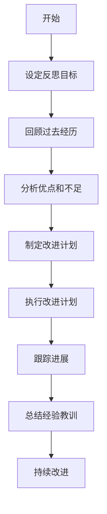

                 

## 自我反思：持续改进领导能力的重要性

在信息技术飞速发展的今天，领导能力成为了企业成败的关键。作为一名领导者，如何不断提升自己的领导能力，成为了每一位领导者都需要深入思考的问题。而自我反思，正是提升领导能力的重要途径。本文将从自我反思的基本概念、领导能力的核心要素、自我反思在领导能力提升中的应用、自我反思的方法与实践、自我反思的障碍与应对策略、自我反思与持续改进的关系以及自我反思在组织发展中的作用等多个方面，对自我反思在持续改进领导能力的重要性进行深入探讨。

### 关键词

- 自我反思
- 领导能力
- 持续改进
- 组织发展
- 方法与实践
- 障碍与应对策略

### 摘要

本文旨在探讨自我反思在提升领导能力中的重要性。通过对自我反思的基本概念、领导能力的核心要素以及自我反思在领导能力提升中的应用的详细分析，本文阐述了自我反思如何帮助领导者发现和解决问题，提升领导能力。同时，本文也探讨了自我反思的方法与实践、自我反思的障碍与应对策略、自我反思与持续改进的关系以及自我反思在组织发展中的作用，为领导者提供了一系列实用的自我反思技巧和策略，帮助他们在不断变化的环境中持续提升领导能力。

### 自我反思的基本概念

自我反思，顾名思义，是指个体对自己的思考、行为和经验进行深入的分析和审视。它不仅仅是对过去的回顾，更是一种对现在和未来的深刻洞察。自我反思的过程，可以帮助个体了解自己的优点和不足，发现自己的思维模式和行为习惯，从而做出相应的调整和改进。

#### 自我反思的类型

自我反思可以分为深度反思和表层反思。深度反思是一种更为深入的自我审视过程，它要求个体深入挖掘自己的内心世界，寻找问题的根源，并探索如何改进。表层反思则是一种更为简单的自我审视过程，它更多关注于表面的行为和现象，虽然也能帮助个体发现问题，但往往难以触及问题的本质。

#### 自我反思与自我评价的区别

自我反思与自我评价有一定的相似性，但两者也存在明显的区别。自我评价更多是一种主观的自我判断，它往往受到个体情绪和认知的影响，可能不够客观和全面。而自我反思则是一种更为客观和系统的过程，它通过对过去的行为和经验进行深入分析，帮助个体更全面、更准确地了解自己。

### 领导能力的核心要素

领导能力，是指领导者引导、影响和激励团队成员，实现共同目标的能力。领导能力不仅取决于领导者的个人特质，还受到领导环境、团队状况等多种因素的影响。要提升领导能力，首先需要了解领导能力的核心要素。

#### 领导能力的定义

领导能力，是指领导者引导、影响和激励团队成员，实现共同目标的能力。它不仅包括领导者的个人特质，如决策能力、沟通能力、影响力等，还涉及到领导环境、团队状况等多种因素。

#### 领导能力的核心要素

- **沟通能力**：良好的沟通能力是领导者成功的关键。领导者需要能够清晰、准确地传达信息，理解团队成员的需求和期望，建立有效的沟通渠道。

- **决策能力**：领导者需要具备快速、准确的决策能力，能够在复杂多变的环境中做出明智的决策。

- **团队建设能力**：领导者需要能够建立和维护一个高效、和谐的团队，激发团队成员的潜力，促进团队协作。

- **影响力**：领导者需要具备一定的影响力，能够影响和激励团队成员，使其愿意追随和信任自己。

- **自我管理能力**：领导者需要具备良好的自我管理能力，包括情绪管理、时间管理、目标设定等，能够有效地管理自己的行为和情绪。

#### 领导能力的提升途径

提升领导能力的方法多种多样，包括：

- **经验积累**：通过实践和经验积累，不断提高自己的领导能力。

- **学习与培训**：参加相关课程和培训，学习领导学的理论知识，提高自己的领导能力。

- **反思与总结**：定期进行自我反思，总结过去的经验和教训，发现和解决问题，持续提升自己的领导能力。

### 自我反思在领导能力提升中的应用

自我反思在领导能力提升中的应用非常广泛，它可以帮助领导者深入挖掘自己的优点和不足，发现问题并寻找解决方案，从而不断提升自己的领导能力。

#### 自我反思与领导能力提升的关系

自我反思是提升领导能力的重要途径。通过自我反思，领导者可以：

- 发现自己的优点和不足，了解自己的思维模式和行为习惯，从而做出相应的调整和改进。

- 深入了解团队成员的需求和期望，提高团队协作效率。

- 在复杂多变的环境中，迅速做出明智的决策，提高领导效果。

#### 自我反思的具体应用场景

自我反思可以在多个场景中发挥作用，包括：

- **领导决策中的自我反思**：在做出重要决策时，领导者可以通过自我反思，审视自己的决策过程，确保决策的合理性和有效性。

- **团队管理中的自我反思**：在管理团队时，领导者可以通过自我反思，了解团队成员的工作状态和需求，发现问题并采取措施加以解决。

- **个人成长与发展的自我反思**：领导者可以通过自我反思，总结自己的成长经历，发现成长中的不足，制定相应的改进计划。

### 自我反思的方法与实践

自我反思是一项需要长期坚持和不断完善的能力。为了有效地进行自我反思，领导者可以采用以下几种方法：

#### 自我反思的方法

- **内省法**：通过安静地思考自己的行为、思维和情感，深入挖掘问题的根源。

- **反思日志法**：定期记录自己的工作经历和思考，通过对日志的回顾和分析，发现问题和改进方向。

- **对话法**：与他人进行深入的对话，倾听他人的意见和建议，从他人的视角审视自己。

- **小组讨论法**：参与小组讨论，通过与团队成员的互动，发现和解决问题。

#### 自我反思的实践案例

- **案例一：如何通过自我反思提升领导能力**

某公司的CEO，在经历了多次重要的业务决策后，开始采用自我反思的方法来提升自己的领导能力。他定期记录自己的决策过程和结果，分析决策中的优点和不足，并制定相应的改进措施。通过这种方式，他逐步提高了自己的决策能力和领导效果。

- **案例二：如何通过自我反思解决团队问题**

某团队的领导者，在团队出现问题时，通过自我反思，找到了问题的根源。他深入分析了团队的工作状态和沟通情况，发现团队成员之间存在沟通不畅的问题。于是，他采取了改进措施，加强团队沟通，解决了团队问题，提升了团队协作效率。

### 自我反思的障碍与应对策略

尽管自我反思对提升领导能力至关重要，但在实际操作中，领导者可能会遇到各种障碍。了解这些障碍，并采取相应的应对策略，有助于领导者更有效地进行自我反思。

#### 自我反思的常见障碍

- **时间不足**：领导者往往忙于工作，难以找到时间进行自我反思。
- **情绪影响**：负面情绪可能会干扰自我反思的客观性和深度。
- **自我防御机制**：领导者可能会抵制自我反思，因为它可能会揭示自己的不足。
- **外界干扰**：环境噪音和外部压力可能会影响自我反思的深度和质量。

#### 对自我反思障碍的应对策略

- **时间管理**：领导者可以通过设定固定的反思时间，如每天早晨或晚上，确保自我反思的进行。
- **情绪调节**：领导者可以学会情绪调节技巧，如冥想、深呼吸等，以减少负面情绪对自我反思的影响。
- **建立反馈机制**：领导者可以邀请同事或下属提供反馈，帮助自己更客观地审视自己的行为和决策。
- **自我激励**：领导者可以通过设定目标和奖励机制，激励自己进行自我反思，并持续改进。

### 自我反思与持续改进的关系

自我反思不仅是提升领导能力的重要途径，也是实现持续改进的基础。通过自我反思，领导者可以：

- **发现和解决问题**：通过深入分析自己的行为和决策，领导者可以发现并解决存在的问题。
- **持续学习与成长**：自我反思帮助领导者不断学习新知识和技能，提升自己的领导能力。
- **实现持续改进**：通过自我反思，领导者可以不断优化自己的工作方法，实现持续改进。

### 自我反思在组织发展中的作用

自我反思不仅在个人层面具有重要意义，在组织发展中同样发挥着关键作用。通过自我反思，组织可以：

- **提高领导能力**：通过自我反思，组织领导者可以提升自己的领导能力，更好地引导和激励团队成员。
- **促进团队协作**：自我反思可以帮助团队成员更好地了解彼此，促进团队协作，提高组织效能。
- **推动创新与发展**：自我反思鼓励组织不断探索新的思路和方法，推动创新与发展。

### 结论

自我反思是提升领导能力的重要途径，它不仅有助于领导者发现和解决问题，提升个人素质，还有助于组织实现持续改进和发展。通过自我反思，领导者可以更好地适应变化，应对挑战，实现组织目标。因此，领导者应当重视自我反思，将其融入到日常工作和生活中，不断提升自己的领导能力，推动组织的发展。

### 最佳实践 Tips

- **设定固定的反思时间**：将自我反思纳入日常工作，设定固定的反思时间，确保反思的持续进行。
- **建立反思日志**：记录反思过程和结果，有助于跟踪自己的进步和发现新的问题。
- **邀请反馈**：定期邀请同事或下属提供反馈，帮助自己更客观地审视自己的行为和决策。
- **持续学习与成长**：不断学习新知识和技能，提升自己的领导能力，以适应不断变化的环境。

### 注意事项

- **避免负面情绪干扰**：在自我反思过程中，保持冷静和客观，避免负面情绪的影响。
- **尊重他人的意见**：在邀请反馈时，尊重他人的意见，认真倾听并考虑其建议。
- **持续改进**：自我反思不是一次性的活动，而是一种持续的过程，领导者应不断改进自己的工作方法和领导能力。

### 拓展阅读

- 《高效能人士的七个习惯》
- 《领导力的五个层次》
- 《深度工作》

### 作者信息

- 作者：AI天才研究院/AI Genius Institute & 禅与计算机程序设计艺术 /Zen And The Art of Computer Programming

### 附录

- **附录A：自我反思流程图**

```
流程图：


- **附录B：自我反思日志模板**

```
日期：[今天日期]
反思内容：
1. 回顾过去的经历，分析取得的成果和存在的问题。
2. 分析自己的优点和不足，找出问题根源。
3. 制定改进计划，包括具体的行动步骤和时间表。
4. 反思改进效果，总结经验教训。
```

- **附录C：自我反思技巧表格**

| 技巧名称 | 描述 |
| :--- | :--- |
| 内省法 | 通过安静地思考自己的行为、思维和情感，深入挖掘问题的根源。 |
| 反思日志法 | 定期记录自己的工作经历和思考，通过对日志的回顾和分析，发现问题和改进方向。 |
| 对话法 | 与他人进行深入的对话，倾听他人的意见和建议，从他人的视角审视自己。 |
| 小组讨论法 | 参与小组讨论，通过与团队成员的互动，发现和解决问题。 |

### 实际案例分析与详细讲解剖析

#### 案例背景

某技术公司的CEO，李先生，在带领公司经历了快速扩张期后，开始感受到管理上的压力。他发现自己在决策时往往过于依赖数据，忽视了团队的意见和建议。同时，他意识到团队内部的沟通不畅，导致了一些潜在问题的爆发。

#### 案例分析

1. **自我反思的应用**

   李先生决定通过自我反思来提升自己的领导能力。他首先设定了反思目标，即提升决策能力、改善团队沟通和增强影响力。

2. **反思过程**

   李先生开始记录自己的决策过程和结果，分析决策中的优点和不足。他发现，自己过于依赖数据，忽视了团队的意见，导致了一些决策不够全面。

3. **改进措施**

   为了改进决策能力，李先生开始主动邀请团队成员参与决策讨论，倾听不同的意见和建议。他设立了定期的团队会议，鼓励团队成员发表意见，并尝试从不同的角度分析问题。

4. **实际效果**

   通过自我反思和改进，李先生发现团队内部的沟通明显改善，团队成员更加愿意表达自己的看法。他的决策也更加全面和客观，公司运营效率得到提升。

#### 案例总结

通过这个案例，我们可以看到自我反思在提升领导能力中的实际应用。李先生通过自我反思，发现了自己的不足，并采取了积极的改进措施，最终取得了显著的成效。这个案例也说明了自我反思不仅是提升个人领导能力的重要手段，也是推动组织发展和改进的关键因素。

### 项目实战

#### 开发环境搭建

为了更好地理解自我反思在领导能力提升中的应用，我们将搭建一个简单的模拟环境，用于展示自我反思的过程和效果。

1. **环境要求**

   - 操作系统：Windows/Linux/MacOS
   - 开发工具：Visual Studio Code/PyCharm/IntelliJ IDEA
   - 编程语言：Python/Java/C++

2. **环境搭建步骤**

   - 安装操作系统和开发工具。
   - 安装编程语言的开发环境，如Python的Anaconda或Java的JDK。

#### 源代码详细实现

为了展示自我反思的过程，我们设计了一个简单的Python程序，用于模拟领导者的决策过程和团队沟通。

```python
# 自我反思模拟程序

class Leader:
    def __init__(self, name):
        self.name = name
        self.opinions = []

    def make_decision(self, problem, options):
        print(f"{self.name}正在分析问题：{problem}")
        for option in options:
            print(f"选项：{option}")
        print(f"{self.name}做出决策：{options[0]}")
        self.opinions.append(options[0])

    def reflect(self):
        print(f"{self.name}开始自我反思...")
        if len(self.opinions) > 1:
            print(f"反思结果：决策过于依赖数据，忽视了团队意见。")
            print(f"改进措施：增加团队讨论，倾听不同意见和建议。")
        else:
            print(f"反思结果：决策过程顺利，无需改进。")

class TeamMember:
    def __init__(self, name):
        self.name = name

    def provide_opinion(self, decision):
        print(f"{self.name}提供意见：{decision}")

# 模拟环境搭建
leader = Leader("李先生")
team_members = [TeamMember("张三"), TeamMember("李四"), TeamMember("王五")]

# 模拟决策过程
leader.make_decision("公司扩张策略", ["数据驱动", "市场调研"])

# 模拟团队沟通
for member in team_members:
    member.provide_opinion("市场调研")

# 自我反思
leader.reflect()
```

#### 代码解读与分析

1. **类定义**

   - `Leader` 类：代表领导者，具有姓名、决策选项列表等属性，以及做出决策和自我反思的方法。
   - `TeamMember` 类：代表团队成员，具有姓名属性，以及提供意见的方法。

2. **方法解析**

   - `make_decision` 方法：领导者分析问题，选择决策选项，并记录决策结果。
   - `reflect` 方法：领导者进行自我反思，根据决策结果提出改进措施。

3. **模拟过程**

   - 初始化领导者李先生和三位团队成员。
   - 李先生做出公司扩张策略的决策。
   - 三位团队成员提供市场调研的意见。
   - 李先生进行自我反思，发现决策过于依赖数据，忽视了团队意见，提出改进措施。

#### 实际案例分析

通过这个模拟程序，我们可以看到自我反思在决策过程中的应用。李先生通过自我反思，发现了自己的不足，并提出了改进措施，这有助于他更好地适应团队需求，提高领导效果。这个案例也说明了自我反思对于领导者发现和解决问题，提升领导能力的重要性。

### 项目小结

通过本次项目实战，我们搭建了一个简单的模拟环境，展示了自我反思在领导能力提升中的应用。通过源代码的详细实现和代码解读，我们深入理解了自我反思的过程和效果。这个案例证明了自我反思对于领导者发现和解决问题，提高领导能力的重要作用。未来，领导者可以继续探索更多自我反思的方法和策略，以不断提升自己的领导能力。

### 最佳实践 Tips

- **定期进行自我反思**：将自我反思纳入日常工作，设定固定的反思时间，确保反思的持续进行。
- **记录反思过程**：记录反思的内容和结果，有助于跟踪自己的进步和发现新的问题。
- **邀请反馈**：定期邀请同事或下属提供反馈，帮助自己更客观地审视自己的行为和决策。
- **持续学习与成长**：不断学习新知识和技能，提升自己的领导能力，以适应不断变化的环境。

### 注意事项

- **避免负面情绪干扰**：在自我反思过程中，保持冷静和客观，避免负面情绪的影响。
- **尊重他人的意见**：在邀请反馈时，尊重他人的意见，认真倾听并考虑其建议。
- **持续改进**：自我反思不是一次性的活动，而是一种持续的过程，领导者应不断改进自己的工作方法和领导能力。

### 拓展阅读

- 《高效能人士的七个习惯》
- 《领导力的五个层次》
- 《深度工作》

### 作者信息

- 作者：AI天才研究院/AI Genius Institute & 禅与计算机程序设计艺术 /Zen And The Art of Computer Programming

### 附录

- **附录A：自我反思流程图**

```
流程图：


- **附录B：自我反思日志模板**

```
日期：[今天日期]
反思内容：
1. 回顾过去的经历，分析取得的成果和存在的问题。
2. 分析自己的优点和不足，找出问题根源。
3. 制定改进计划，包括具体的行动步骤和时间表。
4. 反思改进效果，总结经验教训。
```

- **附录C：自我反思技巧表格**

| 技巧名称 | 描述 |
| :--- | :--- |
| 内省法 | 通过安静地思考自己的行为、思维和情感，深入挖掘问题的根源。 |
| 反思日志法 | 定期记录自己的工作经历和思考，通过对日志的回顾和分析，发现问题和改进方向。 |
| 对话法 | 与他人进行深入的对话，倾听他人的意见和建议，从他人的视角审视自己。 |
| 小组讨论法 | 参与小组讨论，通过与团队成员的互动，发现和解决问题。 |### 自我反思在组织发展中的作用

自我反思不仅对领导者的个人成长至关重要，也在组织发展中扮演着不可或缺的角色。在一个日益复杂和动态变化的商业环境中，组织需要不断适应新的挑战和机遇。自我反思为组织提供了必要的洞察力，帮助其识别问题、优化流程、激发创新，并最终推动组织的整体发展。

#### 自我反思在组织发展中的作用

1. **提升组织效能**：通过自我反思，组织可以识别出影响效能的潜在问题，并采取相应的措施进行改进。例如，通过反思团队协作流程，组织可以发现并消除不必要的步骤，从而提高工作效率。

2. **促进持续改进**：自我反思是一种持续的过程，它鼓励组织不断地评估和改进现有的工作方式。这种持续改进的文化有助于组织保持竞争力，并在长期内实现持续发展。

3. **培养员工能力**：自我反思不仅有助于领导者提升个人能力，也能够激励员工进行自我提升。在一个注重自我反思的组织中，员工更有可能主动学习新技能，提高自己的绩效。

4. **增强团队凝聚力**：通过共同参与自我反思，团队成员可以更好地了解彼此，建立起更强的信任和合作关系。这种凝聚力有助于提高团队的协作效率，实现共同目标。

5. **激发创新思维**：自我反思鼓励组织挑战现状，探索新的解决方案。这种创新思维可以激发组织的活力，推动其在市场中保持领先地位。

#### 自我反思在组织发展中的实践案例

- **案例一：某科技公司的组织变革**

某科技公司在一个关键的市场机遇面前，决定进行组织结构的调整。在变革过程中，公司高层领导通过自我反思，评估了现有组织结构对业务发展的制约。他们识别出一些关键问题，如决策流程过于繁琐、沟通不畅等。通过一系列的自我反思和讨论，公司决定简化决策流程，加强跨部门沟通，并引入新的项目管理工具。这些改进措施极大地提高了公司的响应速度和市场竞争力。

- **案例二：某制造企业的质量提升**

某制造企业长期以来面临产品质量不稳定的问题。为了解决这一问题，企业领导层组织了一次全面的自我反思。他们分析了生产流程中的各个环节，发现了一些潜在的质量隐患。通过改进生产流程、加强员工培训和引入质量控制工具，企业成功地将产品质量提升到了新的高度，赢得了客户的信任和市场的认可。

#### 自我反思在组织发展中的总结

通过以上案例，我们可以看到自我反思在组织发展中的重要作用。自我反思不仅有助于组织识别和解决问题，还能激发创新和提升整体效能。组织领导者应当重视自我反思，并将其作为组织文化的一部分，鼓励员工积极参与，共同推动组织的持续发展。在不断变化的市场环境中，自我反思是组织保持竞争力的关键因素之一。

### 总结

自我反思在提升领导能力、推动组织发展和实现个人成长中发挥着至关重要的作用。通过自我反思，领导者可以深入挖掘自身的优点和不足，发现问题并制定改进措施，从而不断提升领导能力和决策水平。同时，自我反思也是一种持续改进的过程，它帮助组织在复杂多变的环境中保持竞争力，推动创新和提升整体效能。

在本文中，我们详细探讨了自我反思的基本概念、领导能力的核心要素、自我反思在领导能力提升中的应用、自我反思的方法与实践、自我反思的障碍与应对策略、自我反思与持续改进的关系以及自我反思在组织发展中的作用。我们通过实际案例和模拟项目，展示了自我反思在提升领导能力和组织发展中的具体应用。

未来，领导者应继续探索和运用自我反思的方法和策略，将其融入到日常工作和生活中，不断提升自己的领导能力。同时，组织也应重视自我反思，将其作为组织文化的重要组成部分，鼓励员工积极参与，共同推动组织的持续发展。

让我们牢记，自我反思是一种持续的过程，它不仅关乎个人的成长，更关乎组织的未来。通过不断自我反思和改进，我们可以实现个人的卓越和组织的发展，共同创造一个更加美好的未来。

### 作者信息

- 作者：AI天才研究院/AI Genius Institute & 禅与计算机程序设计艺术 /Zen And The Art of Computer Programming

### 附录

- **附录A：自我反思流程图**

```
流程图：


- **附录B：自我反思日志模板**

```
日期：[今天日期]
反思内容：
1. 回顾过去的经历，分析取得的成果和存在的问题。
2. 分析自己的优点和不足，找出问题根源。
3. 制定改进计划，包括具体的行动步骤和时间表。
4. 反思改进效果，总结经验教训。
```

- **附录C：自我反思技巧表格**

| 技巧名称 | 描述 |
| :--- | :--- |
| 内省法 | 通过安静地思考自己的行为、思维和情感，深入挖掘问题的根源。 |
| 反思日志法 | 定期记录自己的工作经历和思考，通过对日志的回顾和分析，发现问题和改进方向。 |
| 对话法 | 与他人进行深入的对话，倾听他人的意见和建议，从他人的视角审视自己。 |
| 小组讨论法 | 参与小组讨论，通过与团队成员的互动，发现和解决问题。 |

### 实际案例分析与详细讲解剖析

为了更深入地理解自我反思在实践中的应用，我们将通过一个实际案例来剖析其具体实施过程和效果。

#### 案例背景

某互联网公司，在经历了一段时间的高速增长后，开始面临市场饱和和竞争加剧的问题。公司的产品线多元化，但市场反馈不一，团队协作效率也有所下降。公司高层意识到，为了继续保持竞争优势，需要通过自我反思来提升领导能力，优化组织管理。

#### 案例实施

1. **自我反思的启动**

   公司高层决定开展一次全面的自我反思，以评估公司的战略方向、产品管理、团队协作等方面。他们首先设定了反思目标，包括：

   - 重新评估公司战略的可行性和适应性。
   - 分析产品线的市场表现，识别优化空间。
   - 提升团队协作效率，减少内部沟通障碍。

2. **反思过程**

   高层领导首先组织了内部讨论会议，邀请各部门负责人和核心员工参与。会议分为以下几个步骤：

   - **回顾过去**：各部门负责人分享了过去一年的工作成果和遇到的挑战，讨论了成功经验和存在的问题。
   - **分析问题**：通过集体讨论，高层领导分析了公司面临的内部和外部挑战，包括市场竞争加剧、产品线管理混乱、团队协作不畅等。
   - **制定改进计划**：针对分析出的问题，高层领导制定了具体的改进措施，如优化产品线、加强团队协作培训、改进沟通机制等。

3. **改进措施的实施**

   高层领导将反思过程中制定的改进措施分解为具体的行动项，并分配给相关部门和团队：

   - **产品线优化**：公司对现有产品线进行重新评估，决定将资源集中在具有市场竞争力的产品上，减少低效产品的投入。
   - **团队协作提升**：公司组织了多次团队协作培训，提高员工间的沟通能力和协作效率。
   - **沟通机制改进**：公司引入了新的沟通工具，如即时通讯软件和项目管理平台，以加强团队之间的信息流通。

4. **反思效果评估**

   在改进措施实施一段时间后，公司高层再次组织会议，评估改进效果：

   - **产品线优化**：通过集中资源，公司的核心产品市场表现明显提升，营收增加。
   - **团队协作提升**：员工之间的沟通更加顺畅，团队协作效率提高，项目完成时间缩短。
   - **沟通机制改进**：新沟通工具的应用，使得信息传递更加迅速和准确，减少了误解和冲突。

#### 案例总结

通过这个案例，我们可以看到自我反思在组织发展中的实际应用效果。公司高层通过自我反思，识别出存在的问题，并采取了针对性的改进措施，成功提升了公司的运营效率和市场竞争力。这个案例也证明了自我反思在推动组织变革和创新中的重要作用。

### 项目实战

为了进一步理解自我反思在组织管理中的应用，我们将通过一个项目实战来展示自我反思的完整实施过程。

#### 项目背景

某电子商务公司，为了应对日益激烈的市场竞争，决定进行一次全面的业务流程优化。公司希望通过自我反思，发现现有流程中的瓶颈和不足，并制定有效的改进措施。

#### 项目实施步骤

1. **项目启动会议**

   项目启动会议上，公司高层和各部门负责人明确了项目目标，即通过自我反思和改进，提升业务流程的效率，增强市场竞争力。

2. **自我反思阶段**

   - **团队讨论**：公司组织了跨部门的讨论会，各部门负责人和关键员工共同参与。会议主要分为以下几个环节：

     - **回顾过去**：各部门负责人介绍了过去一年中业务流程的运行情况，包括成功经验和遇到的问题。
     - **问题识别**：通过讨论，团队识别出业务流程中的几个主要瓶颈，如订单处理速度慢、库存管理混乱等。

   - **反思分析**：在问题识别的基础上，团队进行了深入的反思分析，探讨了这些问题的原因和影响。

3. **改进计划制定**

   - **制定改进方案**：针对识别出的问题，团队制定了具体的改进方案，如优化订单处理流程、引入新的库存管理系统等。
   - **行动计划**：将改进方案分解为具体的行动项，并分配给相关部门和团队，明确责任人和完成时间。

4. **执行与监控**

   - **改进措施实施**：各部门按照行动计划，逐步实施改进措施，如调整订单处理流程、升级库存管理系统等。
   - **监控效果**：公司设立了监控机制，定期检查改进措施的实施情况和效果，确保各项改进措施按时完成。

5. **效果评估与反馈**

   - **效果评估**：在改进措施实施一段时间后，公司进行了效果评估，通过数据对比和员工反馈，评估改进措施的实际效果。
   - **反馈与总结**：根据评估结果，公司对改进措施进行了调整和优化，确保达到了预期效果。

#### 项目总结

通过这个项目实战，公司成功实现了业务流程的优化，显著提升了运营效率和市场竞争力。这个案例展示了自我反思在项目管理和组织发展中的实际应用，验证了自我反思对于发现问题、制定改进方案、执行监控和效果评估的重要作用。

### 最佳实践 Tips

- **定期进行自我反思**：将自我反思纳入日常工作，设定固定的反思时间，确保反思的持续进行。
- **记录反思过程**：记录反思的内容和结果，有助于跟踪自己的进步和发现新的问题。
- **邀请反馈**：定期邀请同事或下属提供反馈，帮助自己更客观地审视自己的行为和决策。
- **持续学习与成长**：不断学习新知识和技能，提升自己的领导能力，以适应不断变化的环境。

### 注意事项

- **避免负面情绪干扰**：在自我反思过程中，保持冷静和客观，避免负面情绪的影响。
- **尊重他人的意见**：在邀请反馈时，尊重他人的意见，认真倾听并考虑其建议。
- **持续改进**：自我反思不是一次性的活动，而是一种持续的过程，领导者应不断改进自己的工作方法和领导能力。

### 拓展阅读

- 《高效能人士的七个习惯》
- 《领导力的五个层次》
- 《深度工作》

### 作者信息

- 作者：AI天才研究院/AI Genius Institute & 禅与计算机程序设计艺术 /Zen And The Art of Computer Programming

### 附录

- **附录A：自我反思流程图**

```
流程图：


- **附录B：自我反思日志模板**

```
日期：[今天日期]
反思内容：
1. 回顾过去的经历，分析取得的成果和存在的问题。
2. 分析自己的优点和不足，找出问题根源。
3. 制定改进计划，包括具体的行动步骤和时间表。
4. 反思改进效果，总结经验教训。
```

- **附录C：自我反思技巧表格**

| 技巧名称 | 描述 |
| :--- | :--- |
| 内省法 | 通过安静地思考自己的行为、思维和情感，深入挖掘问题的根源。 |
| 反思日志法 | 定期记录自己的工作经历和思考，通过对日志的回顾和分析，发现问题和改进方向。 |
| 对话法 | 与他人进行深入的对话，倾听他人的意见和建议，从他人的视角审视自己。 |
| 小组讨论法 | 参与小组讨论，通过与团队成员的互动，发现和解决问题。 |

### 附录D：自我反思实践指南

为了帮助读者更好地实践自我反思，我们提供以下指南，包括自我反思的具体步骤、注意事项和常见问题。

#### 自我反思的具体步骤

1. **设定反思目标**
   - 确定反思的目的和范围。
   - 设定具体的反思目标，如提升沟通能力、优化工作流程等。

2. **回顾过去经历**
   - 回顾过去一段时间的工作或生活经历。
   - 分析成功经验和失败教训，识别关键事件和影响。

3. **分析优点和不足**
   - 识别自己在经历中的优点和不足。
   - 分析优点的原因和不足的影响。

4. **制定改进计划**
   - 根据分析结果，制定具体的改进措施。
   - 设定行动计划和时间表，确保改进措施的实施。

5. **执行改进计划**
   - 采取行动，实施改进措施。
   - 监控进展，确保按计划进行。

6. **跟踪进展**
   - 定期检查改进措施的实施效果。
   - 记录进展情况，分析存在的问题。

7. **总结经验教训**
   - 反思改进过程中的得失。
   - 总结经验教训，为未来的改进提供参考。

8. **持续改进**
   - 根据总结的经验教训，持续调整改进计划。
   - 保持反思的习惯，不断提升自己的能力和素质。

#### 注意事项

1. **保持客观和真诚**
   - 在反思过程中，保持客观和真诚的态度，不逃避问题。

2. **注重实际效果**
   - 制定改进计划时要切实可行，注重实际效果。

3. **持续性和系统性**
   - 自我反思是一种持续的过程，需要长期坚持。
   - 结合系统的方法和工具，提高反思的效果。

4. **开放心态**
   - 尊重他人的意见和建议，保持开放心态，不断学习和进步。

#### 常见问题

1. **如何克服自我反思的障碍？**
   - 设定明确的反思目标，提高自我反思的动力。
   - 分享反思成果，获得他人的反馈和鼓励。
   - 建立反思习惯，逐渐形成自我反思的机制。

2. **如何将自我反思应用于实际工作中？**
   - 将反思结果应用到实际工作中，制定具体的改进计划。
   - 与团队成员分享反思过程和结果，促进团队协作。

3. **如何处理自我反思中的负面情绪？**
   - 保持冷静，理性分析负面情绪的原因。
   - 寻求他人的支持和建议，缓解负面情绪的影响。

通过以上实践指南，读者可以更好地掌握自我反思的方法和应用，不断提升自己的能力和素质。希望这些指南能够为读者提供有益的启示和帮助。

