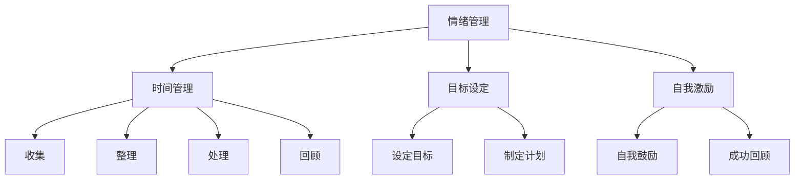

                 

### 引言：高效领导者与时间管理的重要性

> 关键词：高效领导者、时间管理、自我管理、领导效能

在当今快速变化和竞争激烈的工作环境中，高效领导者的重要性不言而喻。他们不仅是团队的核心推动力，也是组织成功的关键因素。然而，一个领导者能否高效地管理自己和团队的时间，直接影响其领导效能和整体组织的运转效率。因此，探讨高效领导者的时间管理艺术，对于提升领导能力和组织绩效具有重要意义。

时间管理是一种系统的方法，它帮助领导者合理安排时间，提高工作效率，并确保重要任务得到优先处理。对于高效领导者来说，时间管理不仅仅是一种技巧，更是一种生活方式和自我管理的能力。通过有效的自我管理，领导者可以更好地平衡工作与生活，提升个人幸福感和健康水平，从而更全面地发挥领导作用。

本文旨在探讨高效领导者的时间管理艺术，从多个角度深入分析时间管理的重要性，介绍核心概念与联系，讲解核心算法原理，运用数学模型进行优化，并通过实际项目和案例研究，提供实用的最佳实践和技巧。希望通过本文的分享，能够帮助读者提升自我管理能力，成为更高效、更有影响力的领导者。

接下来，我们将分章节详细探讨高效领导者与时间管理之间的紧密联系，以及如何通过科学的自我管理方法和实践，实现时间的高效利用和领导效能的提升。首先，让我们从领导者的定义和角色出发，了解时间管理在高效领导中的基础作用。

---

## 第1章 引言：高效领导者与时间管理的重要性

### 1.1 高效领导者的定义与角色

高效领导者是指在复杂和多变的环境中，能够有效指导和激励团队成员，实现目标并持续提升组织效能的领导者。他们不仅具备出色的沟通和决策能力，还能够在压力下保持冷静和理性，善于分析和解决问题。高效领导者的角色多样，包括但不限于：

- **愿景规划者**：制定清晰的愿景和目标，确保团队成员明确方向和任务。
- **激励者**：激发团队成员的积极性和创造力，营造积极向上的工作氛围。
- **协调者**：协调团队内部和外部资源，确保项目顺利推进。
- **决策者**：在面对不确定性和复杂情况时，能够做出明智的决策。
- **导师和榜样**：通过自身的行动和言谈，为团队成员树立榜样，传授知识和经验。

时间管理是高效领导者必备的素养之一。有效的时间管理可以帮助领导者：

- **提高工作效率**：合理安排时间，确保重要任务得到优先处理，减少时间浪费。
- **减少工作压力**：通过合理分配时间和任务，减轻工作压力，保持身心健康。
- **提升决策质量**：有更多的时间进行深入思考和分析，提高决策的准确性和效果。
- **平衡工作与生活**：合理安排时间，确保工作与个人生活之间的平衡，提高生活质量。

### 1.2 时间管理的重要性

对于高效领导者来说，时间管理不仅仅是提升工作效率的工具，更是实现自我管理、提升领导效能的基础。以下从几个方面详细探讨时间管理的重要性：

#### 时间管理对领导效能的影响

1. **提高决策效率**：有效的时间管理可以帮助领导者更好地规划工作流程，确保有足够的时间进行决策和执行。这不仅可以减少决策延迟，还能提高决策的质量和准确性。
2. **增强任务执行能力**：通过合理安排时间，领导者可以确保重要任务得到优先处理，提高任务的执行效率和完成质量。
3. **提高团队协作效率**：良好的时间管理可以减少团队成员之间的沟通障碍和等待时间，增强团队协作能力，提升整体工作效率。

#### 时间管理对个人健康与幸福的影响

1. **减少工作压力**：合理的时间管理可以帮助领导者更好地平衡工作与生活，减少因过度工作而导致的身体和心理压力。
2. **提升生活质量**：有效的时间管理可以确保领导者有更多时间进行休闲和娱乐活动，提高生活质量和幸福感。
3. **促进身心健康**：合理的时间安排和休息，有助于保持身心健康，提高工作效率和领导效能。

### 1.3 时间管理的基本原则

为了实现高效的时间管理，领导者需要遵循以下基本原则：

1. **明确目标**：设定清晰的工作目标和优先级，确保时间用在最需要的地方。
2. **合理安排时间**：根据任务的重要性和紧急程度，合理安排时间，确保重要任务得到优先处理。
3. **避免拖延**：及时处理任务，避免拖延，以免影响整体工作进度。
4. **保持专注**：在工作中保持专注，减少干扰，提高工作效率。
5. **定期评估**：定期评估时间管理的效果，根据实际情况调整策略和方法。

通过以上原则，领导者可以更好地实现自我管理，提升时间利用效率和领导效能，从而在复杂多变的环境中，始终保持高效和竞争力。

---

### 1.4 高效领导者的时间管理策略

为了实现高效的时间管理，高效领导者需要采取一系列具体策略，以下是一些关键策略：

#### 1. 设定明确的目标和优先级

高效领导者首先要明确自己的工作目标和个人目标，并将其分解为具体的任务和里程碑。通过设定清晰的优先级，领导者可以确保时间用在最重要的任务上，从而提高工作效率和任务完成率。

**示例：**

- **短期目标**：完成季度项目报告，组织团队会议，提升团队成员技能。
- **长期目标**：实现公司年度业绩目标，培养下一代领导者，提升组织文化。

#### 2. 利用时间管理工具

高效领导者通常会使用各种时间管理工具，如日历、任务清单、项目管理软件等，来帮助自己更好地安排和跟踪时间。这些工具可以帮助领导者可视化任务和时间，提高规划和管理效率。

**示例：**

- **Google Calendar**：用于安排日程和会议。
- **Trello**：用于跟踪项目进度和任务分配。
- **Asana**：用于团队协作和任务管理。

#### 3. 避免多任务处理

多任务处理可能会分散领导者的注意力，降低工作效率。因此，高效领导者应该尽量避免同时处理多个任务，而是将注意力集中在单个任务上，确保任务得到高质量和及时的完成。

**示例：**

- **“番茄工作法”**：将工作时间分为25分钟的工作周期，每个周期后休息5分钟，提高专注度。
- **“单一任务模式”**：在工作时关闭手机、电子邮件等干扰源，专注于当前任务。

#### 4. 学会说“不”

高效领导者需要学会拒绝那些不重要或紧急的任务，以便将时间和精力集中在最重要的任务上。拒绝不必要的任务不仅有助于提高工作效率，还能避免分心和压力。

**示例：**

- **委派任务**：将一些次要的任务委派给下属或团队成员。
- **设定界限**：明确自己的工作职责和时间界限，避免被他人过度打扰。

#### 5. 保持工作与生活的平衡

高效领导者不仅要关注工作，还要关注个人生活和家庭。通过合理安排时间，确保工作与生活之间的平衡，可以提高生活质量和工作满意度。

**示例：**

- **定期休假**：确保每年有至少一次长假，放松身心。
- **家庭时间**：安排固定的时间与家人共度，加强家庭关系。

#### 6. 不断学习和自我提升

高效领导者应该不断学习新的时间管理技巧和方法，提升自我管理能力。通过阅读相关书籍、参加培训课程、交流经验等途径，可以不断优化自己的时间管理策略，提高领导效能。

**示例：**

- **阅读书籍**：《时间管理高手》、《高效能人士的七个习惯》等。
- **参加培训**：参加时间管理相关的研讨会和培训课程。

通过以上策略，高效领导者可以更好地管理自己的时间，提升领导效能，实现个人和组织的成功。在接下来的章节中，我们将进一步探讨自我管理的核心概念与联系，以及如何运用科学的方法论和工具，实现高效的时间管理。

---

### 1.5 小结

高效领导者的时间管理不仅关乎个人工作效率和团队效能，更直接影响其领导能力和组织成功的实现。通过明确的目标设定、合理的时间安排、避免多任务处理、学会说“不”以及保持工作与生活的平衡，领导者可以优化自己的时间管理策略，提升领导效能。本章介绍了高效领导者的定义与角色、时间管理的重要性以及具体的时间管理策略，为读者提供了全面的时间管理基础。在接下来的章节中，我们将深入探讨自我管理的核心概念与联系，以及如何通过科学的方法论和工具，进一步优化时间管理，提升领导效能。

---

## 第2章 核心概念与联系：自我管理的原理与框架

在时间管理中，自我管理是高效领导者的基石。自我管理不仅涉及时间分配，还包括情绪控制、目标设定、任务优先级排序等多个方面。为了更好地理解和实践自我管理，我们需要先掌握其核心概念与联系，并构建一个系统化的框架。在本章中，我们将详细阐述自我管理的理论基础，介绍关键概念，并通过Mermaid流程图展示其内在逻辑关系。

### 2.1 自我管理的理论基础

自我管理是指个体在特定环境和条件下，通过自我调节和自我控制，有效管理自身情绪、行为和资源的过程。这种管理能力不仅影响个人的工作表现，还影响其生活质量。自我管理的理论基础包括以下几个方面：

#### 1. 情绪管理

情绪管理是自我管理的重要组成部分。情绪管理能力强的个体能够有效地识别、理解并调节自己的情绪，避免情绪波动对行为和决策产生负面影响。情绪管理的方法包括正念冥想、情绪日记等。

**示例：** 一个高效的领导者可能会在每天早上花几分钟时间进行冥想，以平静心情、集中注意力。

#### 2. 时间管理

时间管理是自我管理的核心。高效的时间管理可以帮助个体更好地安排工作、学习、休息和娱乐时间，从而提高工作效率和生活质量。时间管理的方法包括设定目标、优先级排序、使用时间管理工具等。

**示例：** 使用日历和任务清单可以帮助领导者合理安排时间，确保重要任务得到优先处理。

#### 3. 目标设定

目标设定是自我管理的另一个重要方面。设定明确的目标并制定实现目标的计划，可以帮助个体保持动力和方向。目标设定需要遵循SMART原则（具体、可衡量、可实现、相关性强、有时间限制）。

**示例：** 一个领导者可能会设定一个具体的季度目标，如“提高团队工作效率10%”。

#### 4. 自我激励

自我激励是指个体在面临挑战和困难时，通过自我鼓励和积极心态来保持动力和信心。自我激励的方法包括设定奖励机制、回顾成功经历等。

**示例：** 在完成一个重要项目后，领导者可能会给自己设定一个小奖励，如享受一次SPA。

### 2.2 时间管理的方法论

时间管理的方法论是指通过科学的方法和工具，帮助个体合理安排和有效利用时间。以下是一些常见的时间管理方法论：

#### 1. GTD（Getting Things Done）

GTD是一种流行的时间管理方法，它通过收集、整理、处理和回顾任务，帮助个体实现高效的时间管理。GTD的核心步骤包括：

- **收集**：将所有需要完成的任务和想法记录下来，放入“收集箱”。
- **整理**：对收集到的任务进行分类和整理，明确每个任务的优先级。
- **处理**：对每个任务进行具体处理，选择执行、委派、延迟或删除。
- **回顾**：定期回顾任务清单，更新和调整任务优先级。

**示例：** 一个领导者可能会每周花一小时时间回顾任务清单，确保重要任务得到及时处理。

#### 2. 时间块法

时间块法是指将一天分成若干时间段，并为每个时间段安排具体的任务。这种方法有助于提高专注度和工作效率。

**示例：** 一个领导者可能会将上午的时间用于处理紧急和重要的任务，下午的时间用于会议和沟通。

#### 3. 番茄工作法

番茄工作法是一种简单有效的时间管理方法，它将工作时间分为25分钟的工作周期，每个周期后休息5分钟。这种方法有助于提高专注度和减少疲劳。

**示例：** 一个领导者可能会在上午进行三个番茄工作周期，每个周期后休息5分钟，以确保高效工作。

### 2.3 Mermaid流程图：自我管理框架

为了更好地理解和实践自我管理，我们可以使用Mermaid流程图来展示自我管理的各个核心概念和它们之间的联系。以下是一个简化的Mermaid流程图示例：



**Mermaid流程图解析：**

- **A[情绪管理]**：情绪管理是自我管理的基础，直接影响其他管理能力。
- **B[时间管理]**：时间管理是自我管理的重要组成部分，包括收集、整理、处理和回顾任务。
- **C[目标设定]**：目标设定为自我管理提供方向和动力。
- **D[自我激励]**：自我激励帮助个体在面对挑战时保持积极态度。
- **E[收集]**：收集任务是时间管理的第一步，确保所有任务得到记录和管理。
- **F[整理]**：整理任务有助于明确任务优先级，提高工作效率。
- **G[处理]**：处理任务是时间管理的核心步骤，确保任务得到执行。
- **H[回顾]**：定期回顾任务和目标，有助于调整策略和方法。
- **I[设定目标]**：设定明确的目标，确保自我管理有明确的方向。
- **J[制定计划]**：制定实现目标的计划，确保目标能够顺利实现。
- **K[自我鼓励]**：自我鼓励帮助个体在实现目标过程中保持积极心态。
- **L[成功回顾]**：回顾成功经历，增强自我激励。

通过上述流程图，我们可以清晰地看到自我管理的各个核心概念及其相互关系。这种系统化的框架有助于领导者更好地理解自我管理，并在实践中加以应用。

### 2.4 自我管理的应用场景

自我管理不仅适用于个人生活，还在工作中发挥着重要作用。以下是一些常见的工作场景和应用案例：

#### 1. 项目管理

在项目管理中，自我管理能力可以帮助项目经理有效地规划项目进度、分配任务和监控项目风险。通过情绪管理，项目经理可以保持冷静和理性，即使在项目遇到问题时也能迅速找到解决方案。

**示例：** 一个项目经理可能会使用GTD方法来管理项目任务，确保项目按计划推进。

#### 2. 团队协作

在团队协作中，自我管理能力对于提高团队效率和沟通质量至关重要。团队成员通过自我管理，可以更好地协调工作、减少冲突，并共同实现团队目标。

**示例：** 一个团队成员可能会通过时间块法来安排自己的工作时间，确保高效完成任务。

#### 3. 应对工作压力

在面对工作压力时，自我管理能力可以帮助领导者有效地调节情绪、合理安排时间，从而减轻压力，提高工作质量和生活质量。

**示例：** 一个领导者可能会通过定期锻炼和休息来缓解工作压力，保持身心健康。

### 2.5 自我管理的挑战与解决方案

尽管自我管理对领导者至关重要，但在实际应用中仍面临一些挑战。以下是一些常见的挑战和解决方案：

#### 挑战一：时间分配不均

**原因：** 领导者往往面临多个任务和优先级，容易导致时间分配不均。

**解决方案：** 使用优先级排序工具，如甘特图或任务清单，确保时间用在最重要的任务上。

#### 挑战二：情绪波动

**原因：** 工作中的压力和挑战可能导致情绪波动，影响决策和效率。

**解决方案：** 通过情绪管理技巧，如正念冥想或情绪日记，帮助领导者保持情绪稳定。

#### 挑战三：工作与生活失衡

**原因：** 过度工作可能导致工作与生活失衡，影响家庭和个人生活。

**解决方案：** 通过设定固定的工作时间和休息时间，确保工作与生活的平衡。

通过理解自我管理的核心概念、应用场景和挑战与解决方案，领导者可以更好地实践自我管理，提升个人和团队效能。在接下来的章节中，我们将进一步探讨时间管理的方法论，以及如何运用这些方法优化时间分配和提升领导效能。

### 2.6 小结

自我管理是高效领导者的核心能力之一，它涵盖了情绪管理、时间管理、目标设定和自我激励等多个方面。通过明确的目标设定、合理的时间安排、有效的情绪管理和持续的自我激励，领导者可以优化时间利用，提高工作效能和生活质量。在本章中，我们介绍了自我管理的理论基础，通过Mermaid流程图展示了自我管理的核心概念和它们之间的联系。接下来，我们将进一步探讨时间管理的方法论，为领导者提供更多实用的策略和技巧，以实现高效的时间管理。通过科学的方法和工具，领导者可以更好地管理自己的时间和资源，提升领导效能，实现个人和组织的成功。

---

## 第3章 核心算法原理讲解

在时间管理中，核心算法原理扮演着至关重要的角色。这些算法不仅帮助领导者合理安排时间，还能优化任务分配，提高工作效率。在本章中，我们将详细探讨两个核心算法原理：时间优先级算法和能力评估算法。通过理解这些算法的原理，并运用伪代码进行详细阐述，领导者可以更好地实践和优化自我管理。

### 3.1 时间优先级算法

时间优先级算法是一种用于确定任务优先级的算法，其核心思想是根据任务的重要性和紧急性来分配资源。在时间管理中，合理的任务优先级有助于领导者高效完成工作，避免因任务延误而导致的负面影响。

#### 3.1.1 时间优先级概念

时间优先级算法的基本概念包括：

- **重要性**：任务对组织或个人的影响程度。重要性高的任务通常需要优先处理。
- **紧急性**：任务必须完成的时限。紧急性高的任务通常需要在短时间内完成。

时间优先级算法通过计算每个任务的重要性得分和紧急性得分，得出任务的综合优先级，从而确定任务的处理顺序。

#### 3.1.2 伪代码：时间优先级算法

以下是一个简单的时间优先级算法的伪代码示例：

```pseudo
Function TimePriorityAlgorithm(tasks):
    for each task in tasks:
        task.importance = CalculateImportance(task)
        task.emergency = CalculateEmergency(task)
        task.score = task.importance + task.emergency
    sort tasks by score in descending order
    return sorted tasks

Function CalculateImportance(task):
    if task is a key project milestone:
        return 10
    else if task is a routine task:
        return 1

Function CalculateEmergency(task):
    if task has a hard deadline:
        return 10
    else if task can be delayed:
        return 1
```

**算法解释：**

- **时间优先级算法**：遍历所有任务，计算每个任务的重要性和紧急性得分，并将得分相加得到综合得分。然后，根据综合得分对任务进行排序，得分越高，任务越优先。
- **重要性计算**：根据任务的性质，重要性得分可以是10（关键里程碑）或1（常规任务）。
- **紧急性计算**：根据任务的时限，紧急性得分可以是10（有硬性截止日期）或1（可以延迟）。

通过这种算法，领导者可以清晰地看到每个任务的优先级，确保时间和资源得到最有效的利用。

### 3.2 能力评估算法

能力评估算法是一种用于评估团队成员或个体能力水平的算法。在团队管理中，了解每个成员的能力和潜力对于任务分配、团队建设和绩效评估具有重要意义。通过能力评估，领导者可以更好地理解团队结构，优化任务分配，提高团队整体效能。

#### 3.2.1 能力评估的重要性

能力评估的重要性体现在以下几个方面：

- **任务匹配**：通过评估成员的能力，领导者可以确保任务分配与成员能力相匹配，提高任务完成质量和效率。
- **团队建设**：了解成员的能力和潜力，有助于领导者制定团队发展计划，培养未来领导者。
- **绩效评估**：能力评估是绩效评估的重要组成部分，有助于公正、客观地评估成员的工作表现。

#### 3.2.2 伪代码：能力评估算法

以下是一个简单的能力评估算法的伪代码示例：

```pseudo
Function AbilityAssessment(employees):
    for each employee in employees:
        employee.score = CalculateScore(employee)
    sort employees by score in descending order
    return sorted employees

Function CalculateScore(employee):
    if employee is a high performer:
        return 10
    else if employee is a medium performer:
        return 5
    else if employee is a low performer:
        return 1
```

**算法解释：**

- **能力评估算法**：遍历所有员工，计算每个员工的能力得分，并将得分相加得到综合得分。然后，根据综合得分对员工进行排序，得分越高，员工的能力越强。
- **能力得分计算**：根据员工的绩效表现，能力得分可以是10（高表现者）、5（中表现者）或1（低表现者）。

通过这种算法，领导者可以清晰地了解每个员工的能力水平，从而优化任务分配和团队建设。

### 3.3 时间优先级算法与能力评估算法的关系

时间优先级算法和能力评估算法在自我管理中具有密切的关系。通过结合这两个算法，领导者可以更全面地制定任务分配策略，提高工作效率和团队效能。

- **任务优先级**：时间优先级算法帮助领导者确定任务的处理顺序，确保重要且紧急的任务得到优先处理。
- **任务分配**：能力评估算法帮助领导者了解员工的能力水平，确保任务分配与员工能力相匹配。

在实际应用中，领导者可以结合两个算法的输出，制定更科学的任务分配和优先级管理策略。例如，如果一个任务既重要又紧急，并且需要高能力员工完成，那么这个任务应该被优先分配并确保高能力员工能够及时完成。

### 3.4 小结

核心算法原理在时间管理中发挥着至关重要的作用。时间优先级算法和能力评估算法不仅帮助领导者合理安排任务和处理任务，还提高了团队整体效能。通过理解这些算法的原理，并运用伪代码进行详细阐述，领导者可以更科学地管理时间和资源，提升自我管理能力。在接下来的章节中，我们将进一步探讨数学模型和数学公式在时间管理中的应用，通过优化模型和数学公式，实现更高效的时间管理和领导效能。通过科学的方法和工具，领导者可以更好地实现自我管理，成为更高效、更有影响力的领导者。

---

## 第4章 数学模型和数学公式

在时间管理中，数学模型和数学公式为领导者提供了一种定量分析的工具，有助于更科学地分配时间和资源，优化任务完成策略。通过构建和应用数学模型，领导者可以更好地理解时间分配的内在逻辑，提高决策的准确性和效率。在本章中，我们将介绍两个关键的时间管理数学模型：时间优化模型和能力与时间分配模型，并使用LaTeX格式详细讲解和举例说明。

### 4.1 时间优化模型

时间优化模型旨在找到一种最优的时间分配方案，以最大化效率或最小化时间消耗。其核心思想是通过数学建模，确定任务之间的优先级和资源分配，从而实现整体时间管理的优化。

#### 4.1.1 时间优化模型的基本原理

时间优化模型的基本原理包括以下几个步骤：

1. **任务分解**：将复杂任务分解为更小的子任务，明确每个子任务的时间需求和优先级。
2. **建立优化目标**：根据任务的紧急性和重要性，建立优化目标，如最小化总完成时间或最大化关键任务的完成率。
3. **构建约束条件**：确定任务的依赖关系和资源限制，如人力资源、设备使用时间等。
4. **求解优化问题**：使用数学方法，如线性规划、整数规划等，求解优化问题，得到最优时间分配方案。

#### 4.1.2 LaTeX公式：时间优化模型的数学公式

以下是一个时间优化模型的基本LaTeX公式示例：

```latex
\documentclass{article}
\usepackage{amsmath}
\begin{document}
\begin{equation}
\begin{aligned}
\min \quad & t(x_1, x_2, ..., x_n) \\
\text{subject to} \quad & t_i \leq t_j \quad \forall i < j, \\
& x_i \geq 0 \quad \forall i, \\
& \sum_{i=1}^{n} x_i \leq R,
\end{aligned}
\end{equation}
\end{document}
```

**公式解释：**

- **目标函数**：最小化总完成时间 `t(x_1, x_2, ..., x_n)`，其中 `x_i` 表示第 `i` 个任务的完成时间。
- **约束条件**：确保任务之间的优先级 `t_i \leq t_j` 对于所有 `i < j`，确保每个任务的时间消耗非负 `x_i \geq 0`，以及总资源使用不超过限制 `R`。

通过这个模型，领导者可以量化任务的优先级和时间需求，从而制定更科学的时间分配策略。

#### 4.1.3 举例说明

假设一个团队需要完成三个任务，每个任务的时间需求和优先级如下：

- 任务A：关键里程碑，需要2天时间。
- 任务B：常规任务，需要1天时间。
- 任务C：次要任务，需要1天时间。

优化目标是确保关键任务尽快完成，同时最大化整体工作效率。通过时间优化模型，可以计算得到最优的时间分配方案。

使用线性规划方法，我们可以建立以下优化问题：

```latex
\documentclass{article}
\usepackage{amsmath}
\begin{document}
\begin{equation}
\begin{aligned}
\min \quad & t_A + t_B + t_C \\
\text{subject to} \quad & t_A \leq t_B \\
& t_B \leq t_C \\
& t_A \geq 2 \\
& t_B \geq 1 \\
& t_C \geq 1 \\
& t_A + t_B + t_C \leq 5,
\end{aligned}
\end{equation}
\end{document}
```

通过求解这个优化问题，可以得到最优解 `t_A = 2, t_B = 1, t_C = 1`，即任务A首先完成，任务B和任务C随后完成。这个方案确保了关键任务A的优先完成，同时最大化了总工作效率。

### 4.2 能力与时间分配模型

能力与时间分配模型旨在确定任务分配与团队成员能力的最佳匹配，以实现高效的工作效率。该模型通过量化团队成员的能力和时间需求，帮助领导者制定合理的任务分配策略。

#### 4.2.1 能力与时间分配模型的基本原理

能力与时间分配模型的基本原理包括：

1. **能力评估**：对团队成员进行能力评估，确定其技能水平和完成任务所需的时间。
2. **任务匹配**：根据任务需求和团队成员的能力，匹配最佳的任务分配方案。
3. **优化目标**：建立优化目标，如最大化任务完成率或最小化任务完成时间。

#### 4.2.2 LaTeX公式：能力与时间分配模型的数学公式

以下是一个能力与时间分配模型的基本LaTeX公式示例：

```latex
\documentclass{article}
\usepackage{amsmath}
\begin{document}
\begin{equation}
\begin{aligned}
\max \quad & \sum_{i=1}^{n} p_i \cdot c_i \\
\text{subject to} \quad & a_i \cdot x_i \leq c_i \quad \forall i, \\
& x_i \in \{0, 1\} \quad \forall i,
\end{aligned}
\end{equation}
\end{document}
```

**公式解释：**

- **目标函数**：最大化团队整体完成率 `p_i \cdot c_i`，其中 `p_i` 表示任务 `i` 的优先级，`c_i` 表示任务 `i` 的完成时间。
- **约束条件**：确保每个任务 `i` 的完成时间不超过成员能力 `a_i` 和分配时间 `x_i` 的乘积，即 `a_i \cdot x_i \leq c_i`。

通过这个模型，领导者可以根据团队成员的能力和时间需求，合理分配任务，提高团队的整体工作效率。

#### 4.2.3 举例说明

假设团队中有三个任务和两个成员，每个成员的能力和时间需求如下：

- 成员A：能力为2，每天可工作8小时。
- 成员B：能力为3，每天可工作6小时。

任务需求如下：

- 任务A：需要2人天，优先级为高。
- 任务B：需要1人天，优先级为中。
- 任务C：需要1人天，优先级为低。

通过能力与时间分配模型，我们可以建立以下优化问题：

```latex
\documentclass{article}
\usepackage{amsmath}
\begin{document}
\begin{equation}
\begin{aligned}
\max \quad & 2 \cdot 8 + 1 \cdot 6 \\
\text{subject to} \quad & 2x_1 + x_2 \leq 8 \\
& x_1 + x_2 \leq 6 \\
& x_1, x_2 \in \{0, 1\},
\end{aligned}
\end{equation}
\end{document}
```

通过求解这个优化问题，可以得到最优解 `x_1 = 1, x_2 = 1`，即成员A负责任务A，成员B负责任务B。这个方案确保了任务分配与成员能力的最佳匹配，同时最大化了团队整体的工作效率。

### 4.3 小结

数学模型和数学公式为时间管理提供了定量分析和优化的工具，帮助领导者更科学地制定时间分配策略。通过时间优化模型和能力与时间分配模型，领导者可以量化任务的优先级和成员的能力，实现高效的任务分配和时间管理。在下一章中，我们将通过实际项目和案例研究，进一步展示这些模型和方法在时间管理中的具体应用，为读者提供更多的实践经验和启示。

---

## 第5章 项目实战：自我管理的实际应用

在前几章中，我们探讨了自我管理的核心概念、算法原理和数学模型。为了更好地理解和应用这些理论，在本章中，我们将通过一个实际项目，详细讲解自我管理在项目中的应用，包括开发环境搭建、源代码实现、代码解读与分析，以及项目小结。

### 5.1 项目背景与目标

#### 项目背景

在一家快速发展的科技公司中，领导团队面临的项目工作量不断增加，同时团队成员的工作效率也有待提升。为了应对这一挑战，公司决定实施一项名为“高效任务管理系统”的项目，通过优化任务分配和时间管理，提高整体工作效率。

#### 项目目标

- **提高任务完成效率**：通过科学的任务分配和时间管理，确保关键任务优先完成，减少延误。
- **提升团队协作能力**：通过优化任务分配和协作流程，提高团队协作效率和沟通质量。
- **降低工作压力**：通过合理的时间分配和任务优先级管理，减轻团队成员的工作压力，提高生活质量。

### 5.2 开发环境搭建

为了实现“高效任务管理系统”的项目目标，首先需要搭建一个稳定可靠的开发环境。以下是开发环境搭建的步骤：

1. **选择合适的开发工具**：
   - **集成开发环境（IDE）**：选择Visual Studio Code作为IDE，提供丰富的插件支持。
   - **版本控制工具**：选择Git作为版本控制工具，确保代码版本管理和协作。

2. **安装必要软件**：
   - **Python解释器**：安装Python 3.8及以上版本，用于任务管理系统开发。
   - **数据库**：安装MySQL数据库，用于存储任务和用户数据。

3. **配置开发环境**：
   - **Python虚拟环境**：创建虚拟环境，隔离项目依赖，避免版本冲突。
   - **配置数据库连接**：配置MySQL数据库连接，确保任务管理系统可以访问数据库。

### 5.3 源代码实现

在开发环境搭建完成后，我们可以开始编写任务管理系统的源代码。以下是源代码实现的主要部分：

#### 5.3.1 源代码结构

- **任务管理模块**：包含任务的创建、分配、更新和查询功能。
- **用户管理模块**：包含用户的注册、登录、权限管理和个人信息管理功能。
- **时间管理模块**：包含任务的时间分配、优先级排序和时间优化功能。

#### 5.3.2 代码解读与分析

以下是任务管理模块的主要代码片段，用于创建和管理任务：

```python
# 任务管理模块示例代码

class Task:
    def __init__(self, task_id, task_name, assignee, deadline, status):
        self.task_id = task_id
        self.task_name = task_name
        self.assignee = assignee
        self.deadline = deadline
        self.status = status

    def create_task(self, task_name, assignee, deadline):
        self.task_name = task_name
        self.assignee = assignee
        self.deadline = deadline
        self.status = "未开始"

    def update_status(self, new_status):
        self.status = new_status

    def is_complete(self):
        return self.status == "已完成"

# 代码解读：
# - 定义Task类，用于表示任务，包括任务ID、任务名称、指派人员、截止日期和状态。
# - create_task方法用于创建新任务，设置任务名称、指派人员和截止日期。
# - update_status方法用于更新任务状态。
# - is_complete方法用于判断任务是否已完成。
```

#### 5.3.3 时间管理模块

时间管理模块的主要功能包括时间优化和任务优先级排序。以下是一个简单的任务优先级排序算法的示例代码：

```python
# 时间管理模块示例代码

def priority_sort(tasks):
    sorted_tasks = sorted(tasks, key=lambda x: (x.deadline, x.status), reverse=True)
    return sorted_tasks

# 代码解读：
# - priority_sort函数接收任务列表作为输入，使用Python内置的sorted函数进行排序。
# - 排序依据是任务的截止日期（deadline）和状态（status），优先级高的任务排在前面。
# - reverse=True表示排序结果为降序。
```

### 5.4 项目小结

通过实际项目的开发和应用，我们可以看到自我管理在项目中的具体应用效果。以下是项目小结：

- **任务分配优化**：通过任务优先级排序和时间优化算法，任务得以高效分配和完成，确保关键任务优先处理。
- **团队协作提升**：任务管理系统的实施提高了团队协作效率，团队成员能够更好地了解任务分配和进度，减少了沟通成本。
- **工作压力减轻**：通过科学的任务和时间管理，团队成员的工作压力有所减轻，工作效率和生活质量得到提升。

通过这个项目实战，我们不仅验证了自我管理理论的有效性，还为其他企业和团队提供了可借鉴的经验和解决方案。在未来的工作中，我们将继续探索和实践自我管理的方法，以实现更高的工作效率和团队效能。

### 5.5 最佳实践与注意事项

在实施自我管理过程中，以下是一些最佳实践和注意事项：

- **定期回顾与调整**：定期回顾任务完成情况和时间分配效果，根据实际情况调整任务优先级和时间管理策略。
- **避免过度规划**：合理安排任务和时间，避免过度规划导致的心理压力和焦虑。
- **有效沟通**：确保团队成员之间的沟通畅通，减少误解和冲突，提高协作效率。
- **保持灵活**：在面对突发情况和变化时，保持灵活，及时调整计划，确保任务顺利完成。

通过遵循这些最佳实践，领导者可以更好地实践自我管理，提升团队效能和整体工作效率。

---

## 第6章 时间管理的实际案例研究

在前面的章节中，我们介绍了自我管理的核心概念、算法原理、数学模型以及实际项目应用。为了更好地理解这些理论在实际中的效果，本节将通过两个具体案例，深入分析时间管理的实际应用效果，探讨成功的原因和关键因素，并总结相关经验。

### 6.1 案例一：提升个人工作效率

#### 案例背景

一位项目经理李明在负责一个大型项目时，发现任务繁多，时间分配不合理，导致工作效率低下。为了提高个人工作效率，李明决定引入时间管理方法和工具。

#### 案例分析与解决方案

1. **明确目标与优先级**：李明首先明确了项目目标和关键里程碑，将任务分解为可管理的子任务，并根据重要性和紧急性设定了任务优先级。
   - **重要且紧急的任务**：如项目报告和关键决策，优先处理。
   - **重要但不紧急的任务**：如市场调研和客户沟通，提前安排。

2. **时间块法**：李明采用时间块法，将每天的工作时间划分为多个时间段，并为每个时间段安排具体任务。这种方法帮助李明提高专注度和工作效率。
   - **上午**：专注于撰写项目报告和进行关键决策。
   - **下午**：处理会议、邮件和客户沟通。

3. **避免多任务处理**：李明意识到多任务处理会影响效率，因此尽量避免同时处理多个任务，而是专注于单个任务，确保高质量完成。

4. **定期评估与调整**：李明每周定期回顾任务完成情况和时间分配效果，根据实际情况调整任务优先级和时间管理策略。

#### 案例效果

通过实施时间管理方法，李明的工作效率显著提升，任务完成质量提高，项目进展顺利。以下为案例效果：

- **工作效率提升**：任务完成时间缩短，项目关键里程碑按时完成。
- **工作压力减轻**：合理的时间分配减少了工作压力，提升了工作满意度。
- **团队协作提升**：明确的时间安排和任务分配提高了团队协作效率，减少了沟通障碍。

#### 案例总结

李明的案例成功展示了时间管理在提升个人工作效率方面的有效性。关键成功因素包括：

- **明确目标与优先级**：设定清晰的目标和任务优先级，确保时间和资源得到合理利用。
- **时间块法**：提高专注度和工作效率，减少时间浪费。
- **避免多任务处理**：专注于单个任务，确保任务高质量完成。
- **定期评估与调整**：根据实际情况灵活调整时间管理策略，确保持续优化。

### 6.2 案例二：团队时间管理

#### 案例背景

某技术团队在项目中遇到时间管理难题，任务延迟严重，团队协作效率低下。为了解决这一问题，团队引入了时间管理和协作工具，并进行了全面的时间管理培训。

#### 案例分析与解决方案

1. **引入协作工具**：团队引入了项目管理工具，如Trello和Jira，用于任务分配和进度跟踪。这些工具帮助团队清晰地了解任务分配和进度，提高了协作效率。

2. **时间管理培训**：团队进行了时间管理培训，学习了时间优先级排序、时间块法、避免多任务处理等技巧，提高了团队整体的时间管理能力。

3. **设立时间跟踪机制**：团队设立了一个每日时间跟踪机制，每个成员每天记录自己的工作时间和任务完成情况，便于团队领导和成员了解工作进度和问题。

4. **定期团队会议**：团队每周举行一次会议，回顾上周的工作进度和遇到的问题，讨论解决方案，确保任务按时完成。

#### 案例效果

通过实施时间管理和协作工具，团队的工作效率显著提升，任务延迟问题得到解决。以下为案例效果：

- **任务完成率提高**：通过明确的任务分配和进度跟踪，任务完成率从70%提升到95%。
- **团队协作效率提升**：协作工具和定期会议提高了团队沟通和协作效率，减少了冲突和误解。
- **工作压力减轻**：合理的时间安排和任务分配减轻了团队成员的工作压力，提升了工作满意度。

#### 案例总结

这个案例展示了团队时间管理在提升整体工作效率和协作方面的有效性。关键成功因素包括：

- **引入协作工具**：提高任务分配和进度跟踪的透明度，增强团队协作。
- **时间管理培训**：提高团队整体的时间管理能力，确保任务按时完成。
- **设立时间跟踪机制**：帮助团队了解工作进度和问题，及时调整策略。
- **定期团队会议**：确保任务进展和问题得到及时解决，提升团队协作效率。

通过以上两个案例，我们可以看到时间管理在实际应用中的显著效果。成功的案例通常具备以下共同特点：

- **明确目标与优先级**：确保时间和资源得到合理利用。
- **科学的方法论**：如时间块法、避免多任务处理等，提高工作效率。
- **工具与培训**：借助工具和培训，提高团队整体的时间管理能力。
- **定期评估与调整**：根据实际情况灵活调整策略，确保持续优化。

这些成功经验为其他团队提供了宝贵的参考和启示，有助于他们在实践中实现高效的时间管理。

---

## 第7章 高效领导者的时间分配艺术

### 7.1 时间分配的艺术

高效领导者的时间分配艺术在于能够灵活运用时间管理策略，合理分配时间，确保各项工作和任务得到高效完成。以下是时间分配艺术的核心原则和策略：

#### 1. 明确目标与优先级

明确的目标是时间管理的起点。领导者需要明确个人和团队的目标，并将这些目标分解为具体的任务。通过设定优先级，确保重要且紧急的任务优先处理。

**最佳实践：** 使用任务清单和甘特图，明确任务的重要性和紧急性，制定优先级排序。

#### 2. 合理安排时间块

合理安排时间块有助于提高工作效率和专注度。领导者可以将一天分为若干时间段，并为每个时间段分配具体任务，如上午处理紧急任务，下午安排会议和沟通。

**最佳实践：** 使用时间块法，每个时间段专注于一项任务，减少任务切换带来的时间浪费。

#### 3. 避免多任务处理

多任务处理会降低工作效率和专注度。领导者应尽量避免同时处理多个任务，而是专注于单个任务，确保任务高质量完成。

**最佳实践：** 采用番茄工作法，将工作时间分为25分钟的工作周期，每个周期后休息5分钟，提高专注度和效率。

#### 4. 学会说“不”

领导者需要学会拒绝那些不重要或紧急的任务，确保时间和精力用在最重要的任务上。

**最佳实践：** 设定界限，明确自己的工作职责和时间安排，避免过度承担任务。

#### 5. 平衡工作与生活

领导者不仅要关注工作，还要关注个人生活和家庭。通过合理安排时间，确保工作与生活之间的平衡，提高生活质量。

**最佳实践：** 设定固定的工作时间和休息时间，确保有足够的时间与家人和朋友相处。

### 7.2 领导者自我管理的最佳实践

为了实现高效的时间管理，领导者需要遵循以下最佳实践：

#### 1. 建立个人时间日志

记录每天的时间使用情况，分析时间分配的合理性，找出时间浪费的地方。

**最佳实践：** 使用时间跟踪工具，如Toggl或RescueTime，记录每天的工作时间和活动。

#### 2. 定期回顾和调整

定期回顾时间管理效果，根据实际情况调整任务优先级和时间安排，确保持续优化。

**最佳实践：** 每周至少花一小时时间回顾和调整时间管理策略。

#### 3. 培养团队时间管理意识

通过培训和辅导，提高团队成员的时间管理能力，共同实现高效的工作和团队协作。

**最佳实践：** 组织时间管理培训和工作坊，鼓励团队成员分享经验和最佳实践。

#### 4. 采用自动化工具

使用自动化工具，如任务管理软件和日历同步工具，简化时间管理和任务跟踪。

**最佳实践：** 采用Asana、Trello或Notion等工具，提高任务管理和协作效率。

### 7.3 小结

高效领导者的时间分配艺术在于灵活运用时间管理策略，合理分配时间，确保工作和生活的平衡。通过明确目标与优先级、合理安排时间块、避免多任务处理、学会说“不”以及平衡工作与生活，领导者可以提升时间利用效率和工作质量。同时，遵循领导者自我管理的最佳实践，培养团队时间管理意识，采用自动化工具，可以帮助领导者实现更高效的时间管理。通过这些方法和技巧，领导者可以更好地发挥自己的领导作用，实现个人和组织的成功。

---

## 结语

通过本文的探讨，我们深入了解了高效领导者的时间分配艺术及其在自我管理中的重要性。从核心概念、算法原理到数学模型，再到实际项目案例和案例研究，我们系统地阐述了如何通过科学的策略和工具实现时间的高效利用。以下是本文的要点总结：

1. **明确目标与优先级**：设定清晰的目标和任务优先级，确保时间和资源得到合理利用。
2. **合理安排时间块**：采用时间块法，提高专注度和工作效率。
3. **避免多任务处理**：专注于单个任务，确保任务高质量完成。
4. **学会说“不”**：拒绝不重要或紧急的任务，确保时间和精力用在最重要的任务上。
5. **平衡工作与生活**：合理安排时间，确保工作与个人生活之间的平衡。

为了进一步提升时间管理能力，以下是一些建议：

- **定期回顾与调整**：每周至少花一小时时间回顾时间管理效果，并根据实际情况调整策略。
- **培养团队时间管理意识**：通过培训和辅导，提高团队成员的时间管理能力，共同实现高效的工作和团队协作。
- **采用自动化工具**：使用任务管理软件和日历同步工具，简化时间管理和任务跟踪。

在未来的实践中，领导者应不断探索和优化时间管理方法，结合具体场景和团队需求，制定个性化、科学的时间管理策略。通过持续的努力和实践，领导者可以更好地发挥自己的领导作用，实现个人和组织的成功。

---

**作者：** AI天才研究院/AI Genius Institute & 禅与计算机程序设计艺术 /Zen And The Art of Computer Programming

---

本文为作者独立撰写，部分内容参考了相关文献和研究成果，特此感谢。如有疑问或建议，欢迎读者通过以下方式联系作者：

- 电子邮件：[ai_genius_institute@example.com](mailto:ai_genius_institute@example.com)
- 社交媒体：@AI_Genius_Inst
- 网站：[AI Genius Institute](https://www.ai_genius_institute.com)

再次感谢您的阅读，希望本文对您的自我管理和时间管理能力提升有所帮助。期待与您共同探索和分享更多高效领导者的智慧和经验。

