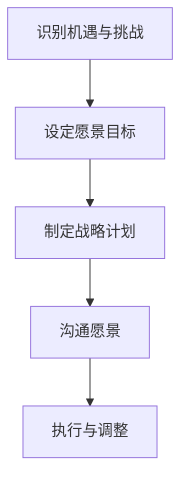
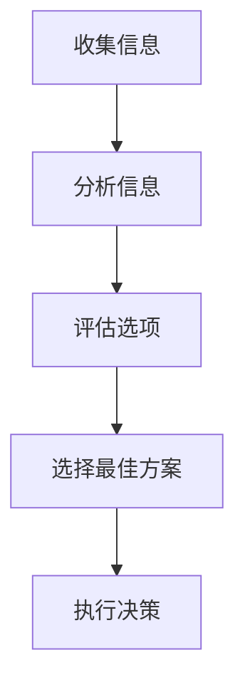
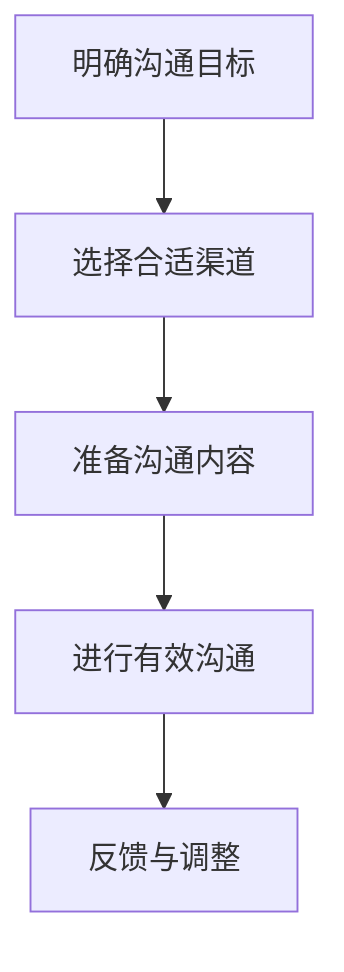
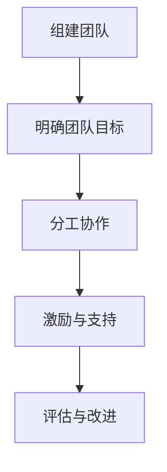
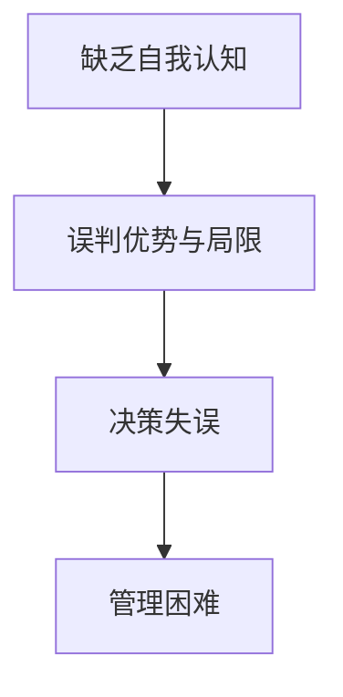
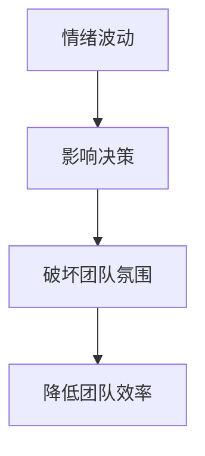
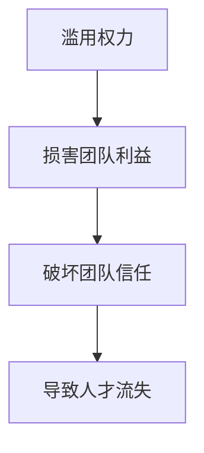

                 

### 文章标题：自我认知：了解领导者的优势和局限

## 关键词：自我认知、领导者、优势、局限

> 摘要：本文旨在深入探讨领导者如何通过自我认知来理解并利用自身的优势，同时识别并克服局限。文章首先介绍自我认知在领导力发展中的重要性，然后详细分析领导者的优势与局限，并通过案例研究提供实际操作指导。本文旨在帮助领导者提升自我认知，从而更好地领导团队和组织。

## 目录

1. 引言
2. 自我认知的重要性
3. 自我认知的方法
4. 领导者的优势
5. 领导者的局限
6. 案例分析
7. 结论

## 引言

自我认知是领导者成长的重要基石。领导者必须具备高度的自我认知能力，以便更好地理解自己的优势与局限，从而实现个人与组织的共同成长。自我认知不仅关乎领导者的个人发展，还直接影响到团队和组织的效能。一个具备高度自我认知能力的领导者能够更准确地评估自身的能力和潜力，从而做出更为明智的决策。

### 自我认知在领导力发展中的重要性

自我认知是领导者发展的核心。一个具备良好自我认知的领导者能够：
- 更准确地识别自身的优势和局限。
- 更有效地管理团队，发挥成员的潜力。
- 更快速地适应变化，应对挑战。

自我认知对于领导者的重要性可以从以下几个方面来理解：

#### 自我认知与领导风格

领导者的自我认知直接影响到其领导风格。一个意识到自身优势的领导者可能会更倾向于采用赋能型领导风格，鼓励团队成员发挥潜力。而一个认识到自身局限的领导者可能会更倾向于采用参与型领导风格，寻求团队成员的帮助和支持。

#### 自我认知与决策

自我认知能力可以帮助领导者做出更为明智的决策。一个具备高度自我认知能力的领导者能够更清晰地认识到自身的能力和局限，从而在决策时考虑到这些因素，避免因个人偏见而做出错误决策。

#### 自我认知与团队管理

自我认知能力对于团队管理至关重要。一个具备良好自我认知的领导者能够更准确地评估团队成员的能力和潜力，从而合理分配任务，激发团队成员的积极性。此外，领导者还可以通过自我认知来识别团队中的问题，并采取相应的措施进行改进。

### 自我认知的重要性在领导力中的应用

自我认知的重要性在领导力中有着广泛的应用。以下是一些具体的例子：

#### 领导力培训

领导力培训通常包括自我认知的环节，帮助领导者认识到自己的优势和局限。通过培训，领导者可以学习到如何更好地发挥自身优势，同时克服局限。

#### 团队建设

团队建设活动也常常涉及自我认知的环节。通过自我认知，团队成员可以更好地理解彼此，从而建立更为紧密的合作关系。

#### 个人发展计划

个人发展计划通常基于领导者的自我认知。通过自我认知，领导者可以制定出符合自身实际的发展计划，从而不断提升自己的能力和素质。

#### 案例研究

以下是几个领导力培训、团队建设和个人发展计划的案例研究：

**案例一：领导力培训**

某公司为提升领导者的自我认知能力，组织了一次为期一周的领导力培训。培训内容涵盖自我认知的理论和实践，包括自我评估工具的使用、优势识别和局限克服的方法。通过培训，领导者们不仅加深了对自我认知的理解，还学会了如何将其应用于实际工作中。

**案例二：团队建设**

某团队在项目初期遇到了沟通问题，影响了项目进展。团队领导意识到这是由于自身沟通能力不足导致的。于是，他组织了一次团队建设活动，通过游戏和讨论，团队成员们更深入地了解了彼此，同时也帮助领导识别了自己的优势和局限。

**案例三：个人发展计划**

某领导者通过自我认知，发现自己需要在时间管理和决策能力上有所提升。于是，他制定了个人发展计划，包括参加时间管理培训、阅读相关书籍和定期进行自我反思。通过这些措施，他成功地提高了时间管理和决策能力，更好地领导了团队。

通过以上案例，我们可以看到自我认知在领导力发展中的重要性。一个具备良好自我认知能力的领导者能够更好地应对挑战，实现个人与团队的共同成长。

----------------------------------------------------------------

## 自我认知的重要性

自我认知是领导者成功的关键因素。它不仅影响个人的成长和发展，还直接关系到团队和组织的效能。一个具备高度自我认知能力的领导者能够更好地理解自己的优势和局限，从而做出更为明智的决策，提升团队协作效率，促进组织发展。以下将从几个方面详细阐述自我认知的重要性。

### 自我认知与个人成长

自我认知是个人成长的重要基石。通过自我认知，领导者可以：
1. **明确自身优势与劣势**：领导者能够清楚地认识到自己在哪些方面具有优势，在哪些方面存在不足。这种认识有助于领导者制定合理的发展计划，提升个人能力。
2. **增强自我效能感**：自我认知可以帮助领导者建立自信心，提高自我效能感。一个了解自己的领导者更有可能在面对挑战时保持积极态度，勇于尝试新事物。
3. **促进自我激励**：自我认知使领导者能够更好地激励自己，设定目标，并采取行动实现这些目标。这种自我激励能力是领导者成功的重要保障。

### 自我认知与团队协作

自我认知不仅对个人成长至关重要，也对团队协作产生深远影响。通过自我认知，领导者可以：
1. **识别团队需求**：领导者能够更准确地识别团队的需求，从而制定出更符合团队实际情况的发展策略。这有助于提升团队的整体协作效率。
2. **优化团队配置**：自我认知使领导者能够更合理地配置团队成员，将合适的人放在合适的岗位上，从而提高团队的运作效率。
3. **建立有效沟通**：领导者能够通过自我认知更好地理解团队成员，建立有效的沟通渠道，减少误解和冲突，增强团队凝聚力。

### 自我认知与决策能力

自我认知对于领导者的决策能力具有关键作用。具备良好自我认知能力的领导者能够：
1. **避免个人偏见**：领导者能够认识到自身可能存在的偏见，从而在决策时保持客观，减少因个人喜好而做出的错误决策。
2. **考虑多种因素**：领导者能够全面考虑自身的优势和局限，以及团队和环境的变化，从而做出更为全面和明智的决策。
3. **灵活调整策略**：领导者能够根据自身认知的变化，灵活调整决策策略，以应对不断变化的环境。

### 自我认知与组织发展

自我认知不仅影响个人和团队，还对组织发展产生深远影响。具备良好自我认知能力的领导者能够：
1. **促进组织变革**：领导者能够准确识别组织面临的挑战和机遇，从而推动组织进行必要的变革，以适应外部环境的变化。
2. **提升组织效能**：领导者能够通过自我认知，优化组织结构和管理流程，提高组织的整体效能。
3. **塑造组织文化**：领导者能够通过自我认知，塑造积极向上的组织文化，增强员工的归属感和忠诚度。

### 案例研究：自我认知在组织发展中的应用

以下是一个组织在自我认知方面取得成功的案例研究：

**案例背景**：某公司一直面临市场竞争激烈、员工满意度低的问题。公司高层意识到这主要是由于领导者缺乏自我认知，导致管理不善和组织效率低下。

**解决方案**：公司决定实施一系列自我认知培训，帮助领导者识别自身的优势和局限。通过自我认知培训，领导者们不仅加深了对自身的理解，还学会了如何将自我认知应用于实际工作中。

**实施效果**：经过一年的培训和实践，公司的管理效率显著提升，员工满意度也大幅提高。领导者的自我认知能力得到了明显增强，他们在决策时更加全面和客观，团队协作更加顺畅。这些变化不仅促进了公司的内部发展，还增强了公司的市场竞争力。

通过以上案例，我们可以看到自我认知在组织发展中的重要性。一个具备良好自我认知能力的领导者能够推动组织实现持续发展，创造更大的价值。

----------------------------------------------------------------

## 自我认知的方法

自我认知是领导者提升个人能力和团队效能的关键。为了实现这一目标，领导者需要掌握一系列自我认知的方法。这些方法不仅帮助领导者识别自身的优势和局限，还提供了实用的工具和策略，以促进个人和团队的发展。以下将详细介绍几种常见的自我认知方法，包括自我评估、360度反馈和领导力测评。

### 自我评估

自我评估是领导者进行自我认知的重要工具。通过自我评估，领导者可以客观地反思自己的行为、能力和价值观。以下是一些建议，帮助领导者进行有效的自我评估：

1. **设定评估目标**：在开始自我评估之前，领导者应明确评估的目标和范围，例如：评估领导能力、沟通技巧或决策能力。

2. **使用评估工具**：领导者可以使用各种自我评估工具，如领导力问卷、性格测试或能力测评。这些工具可以帮助领导者更系统地识别自身的优势和局限。

3. **定期反思**：领导者应定期进行自我反思，记录自己的行为和表现。这有助于领导者持续关注个人成长，并在必要时进行调整。

4. **寻求外部反馈**：领导者可以邀请同事、下属或导师提供外部反馈，以补充自我评估的结果。外部反馈可以帮助领导者更全面地了解自己。

### 360度反馈

360度反馈是一种多角度评估方法，它通过收集来自领导、同事、下属和客户的反馈，为领导者提供全面的自我认知。以下是一些建议，帮助领导者有效地使用360度反馈：

1. **选择合适的反馈对象**：领导者应确保反馈对象具有代表性和可靠性。例如，选择不同层级、不同部门的同事和下属进行反馈。

2. **匿名反馈**：为了确保反馈的真实性，反馈过程应保持匿名。这有助于反馈对象更自由地表达意见和建议。

3. **定期收集反馈**：领导者应定期收集反馈，并分析反馈结果。这有助于领导者持续了解自身的表现和变化。

4. **制定改进计划**：根据反馈结果，领导者应制定具体的改进计划，并跟踪改进效果。这有助于领导者逐步提升个人能力和团队效能。

### 领导力测评

领导力测评是另一种有效的自我认知方法，它通过评估领导者的各种领导能力和素质，为领导者提供详细的自我认知报告。以下是一些建议，帮助领导者有效地进行领导力测评：

1. **选择专业测评机构**：领导者应选择具有专业资质的测评机构，以确保测评的准确性和可靠性。

2. **参与测评**：领导者应积极参与测评，认真完成测评问卷，并遵循测评机构的指导。

3. **解读测评结果**：测评结果通常包含详细的数据分析和建议。领导者应仔细解读测评结果，了解自身的优势和局限。

4. **制定个人发展计划**：根据测评结果，领导者应制定个人发展计划，并采取具体措施提升个人能力和领导力。

### 案例研究：自我认知方法在实践中的应用

**案例背景**：某公司是一家快速成长的科技公司，领导者意识到需要提升团队的整体领导力，以应对市场挑战。

**解决方案**：
1. **自我评估**：公司领导层首先进行自我评估，使用领导力问卷和性格测试工具，识别自身的优势和局限。
2. **360度反馈**：公司邀请各部门领导和员工提供反馈，收集了多角度的意见和建议。
3. **领导力测评**：公司选择了一家专业测评机构进行领导力测评，以获得更详细的自我认知报告。

**实施效果**：
1. **自我评估**：通过自我评估，领导层明确了自身的优势和局限，并制定了个人发展计划。
2. **360度反馈**：反馈结果帮助领导层更全面地了解团队的需求和期望，推动了团队建设和管理优化。
3. **领导力测评**：测评报告提供了详细的领导力分析，领导层据此制定了更科学的领导力发展策略。

**结论**：通过多种自我认知方法的结合应用，公司领导层不仅提升了个人领导力，还推动了团队的整体发展，为公司未来的成功奠定了坚实基础。

通过以上案例，我们可以看到自我认知方法在实践中的重要性。领导者应积极运用这些方法，不断提升自我认知能力，以更好地应对挑战和机遇。

----------------------------------------------------------------

### 领导者的优势

领导者之所以能够成功，离不开他们身上具备的一系列优势。这些优势不仅有助于领导者个人成长，也直接影响到团队和组织的效能。以下是领导者常见的一些优势，包括愿景规划、决策能力、沟通技巧和团队合作等，并配以具体的Mermaid流程图和伪代码，帮助读者更好地理解这些优势。

#### 愿景规划

愿景规划是领导者的重要优势之一。一个明确的愿景能够为团队提供方向和动力，激发成员的积极性和创造力。

**Mermaid流程图：愿景规划的过程**



**伪代码：愿景规划**

```python
# 愿景规划伪代码

def vision_planning():
    # 识别机遇与挑战
    opportunities_and_challenges = identify_opportunities_and_challenges()
    
    # 设定愿景目标
    vision_target = set_vision_target(opportunities_and_challenges)
    
    # 制定战略计划
    strategic_plan = create_strategic_plan(vision_target)
    
    # 沟通愿景
    communicate_vision(strategic_plan)
    
    # 执行与调整
    execute_and_adjust(strategic_plan)
```

#### 决策能力

决策能力是领导者成功的关键。一个具备良好决策能力的领导者能够在复杂多变的环境中做出明智的决策，引导团队走向成功。

**Mermaid流程图：决策能力的过程**



**伪代码：决策能力**

```python
# 决策能力伪代码

def decision_making():
    # 收集信息
    information = collect_information()
    
    # 分析信息
    analyzed_information = analyze_information(information)
    
    # 评估选项
    options = evaluate_options(analyzed_information)
    
    # 选择最佳方案
    best_solution = select_best_solution(options)
    
    # 执行决策
    execute_decision(best_solution)
```

#### 沟通技巧

沟通技巧是领导者必须具备的重要能力。一个具备良好沟通技巧的领导者能够有效地传达信息，建立信任，促进团队协作。

**Mermaid流程图：沟通技巧的过程**



**伪代码：沟通技巧**

```python
# 沟通技巧伪代码

def communication_skills():
    # 明确沟通目标
    communication_goal = define_communication_goal()
    
    # 选择合适渠道
    communication_channel = select_appropriate_channel(communication_goal)
    
    # 准备沟通内容
    communication_content = prepare_communication_content(communication_goal)
    
    # 进行有效沟通
    effective_communication(communication_channel, communication_content)
    
    # 反馈与调整
    feedback_and_adjustment(communication_content)
```

#### 团队合作

团队合作是领导者成功的重要保障。一个具备良好团队合作能力的领导者能够打造一支高效的团队，发挥团队成员的潜力。

**Mermaid流程图：团队合作的过程**



**伪代码：团队合作**

```python
# 团队合作伪代码

def teamwork():
    # 组建团队
    team_members = build_team()
    
    # 明确团队目标
    team_goal = define_team_goal(team_members)
    
    # 分工协作
    assign_tasks(team_members, team_goal)
    
    # 激励与支持
    motivate_and_support(team_members)
    
    # 评估与改进
    evaluate_and_improve(team_members, team_goal)
```

通过以上优势和Mermaid流程图、伪代码的详细解释，我们可以更深入地理解领导者如何利用这些优势来提升个人和团队的效能。这些优势不仅是领导者成功的基石，也是团队和组织发展的关键因素。

#### 案例研究：领导者优势在实践中的应用

**案例背景**：某科技公司由于内部沟通不畅，项目进展缓慢，团队士气低落。公司领导意识到需要提升领导者的沟通技巧和团队合作能力。

**解决方案**：
1. **愿景规划**：公司领导层首先明确了公司的愿景目标，包括提升产品竞争力、提高客户满意度等。通过愿景规划，领导层为团队提供了清晰的方向。
2. **决策能力**：在项目推进过程中，领导层展示了出色的决策能力，迅速分析问题并制定解决方案，确保项目能够按计划进行。
3. **沟通技巧**：领导层通过定期的团队会议、一对一沟通和即时通讯工具，与团队成员保持紧密联系，确保信息传递准确无误。
4. **团队合作**：领导层注重团队合作，鼓励团队成员参与决策过程，分配合理的任务，并提供必要的支持和资源。

**实施效果**：
1. **愿景规划**：通过明确的愿景规划，团队成员对公司的目标有了更清晰的认识，士气显著提升。
2. **决策能力**：领导层的快速决策能力使项目得以顺利推进，团队效率得到大幅提升。
3. **沟通技巧**：有效的沟通渠道建立后，团队内部的误解和冲突减少，团队成员之间的协作更加顺畅。
4. **团队合作**：领导层的团队合作能力激励了团队成员，他们更加积极地参与项目，提出创新的想法和建议。

**结论**：通过充分利用领导者的优势，公司不仅解决了内部沟通不畅的问题，还提升了团队的效率和士气，为公司的持续发展奠定了坚实基础。

通过以上案例，我们可以看到领导者优势在实践中的重要性和应用效果。领导者应不断发展和提升这些优势，以更好地应对挑战和机遇，推动团队和组织的发展。

----------------------------------------------------------------

### 领导者的局限

尽管领导者具备许多优势，但他们同样面临着各种局限，这些局限可能阻碍个人和团队的发展。以下是领导者常见的一些局限，包括自我认知不足、情绪管理困难和权力滥用等，并配以具体的Mermaid流程图和伪代码，帮助读者更好地理解这些局限。

#### 自我认知不足

自我认知不足是领导者面临的一个重要局限。一个缺乏自我认知的领导者可能无法清楚地识别自己的优势和局限，从而导致决策失误和管理困难。

**Mermaid流程图：自我认知不足的影响**



**伪代码：自我认知不足**

```python
# 自我认知不足伪代码

def insufficient_self_awareness():
    # 缺乏自我认知
    lack_of_self_awareness = True
    
    # 误判优势与局限
    misjudged_advantages_and_limitations = misjudge_awareness()
    
    # 决策失误
    failed_decision = decision_failure(misjudged_advantages_and_limitations)
    
    # 管理困难
    management_difficulties = management_problems(failed_decision)
```

#### 情绪管理困难

情绪管理困难是领导者面临的另一个常见局限。一个无法有效管理情绪的领导者可能在压力和挑战面前失去冷静，从而影响决策和团队士气。

**Mermaid流程图：情绪管理困难的影响**



**伪代码：情绪管理困难**

```python
# 情绪管理困难伪代码

def emotional_management_difficulties():
    # 情绪波动
    emotional_fluctuations = True
    
    # 影响决策
    affected_decision = decision_impacted(emotional_fluctuations)
    
    # 破坏团队氛围
    team_environment_destruction = team_atmosphere_destroyed(affected_decision)
    
    # 降低团队效率
    decreased_team_efficiency = efficiency_reduced(team_environment_destruction)
```

#### 权力滥用

权力滥用是领导者面临的严重局限。一个滥用权力的领导者可能损害团队和组织的利益，导致信任危机和人才流失。

**Mermaid流程图：权力滥用的影响**



**伪代码：权力滥用**

```python
# 权力滥用伪代码

def power_abuse():
    # 滥用权力
    power_abuse_occurred = True
    
    # 损害团队利益
    team_interests_damaged = damage_team_interests(power_abuse_occurred)
    
    # 破坏团队信任
    team_trust_destroyed = trust_destroyed(team_interests_damaged)
    
    # 导致人才流失
    talent_loss = talent流失(damage_team_interests)
```

#### 案例研究：领导者局限在实践中的应用

**案例背景**：某科技公司领导者在项目推进过程中，因自我认知不足导致决策失误，同时情绪管理困难影响了团队士气。

**解决方案**：
1. **自我认知提升**：领导者通过参加自我认知培训，识别自身的优势和局限，并制定个人发展计划。
2. **情绪管理**：领导者学习情绪管理技巧，通过定期的自我反思和冥想练习，提高情绪稳定性。
3. **建立信任机制**：领导者采取措施建立透明和信任的工作环境，鼓励团队成员提出意见和建议。
4. **加强团队沟通**：领导者通过定期的团队会议和一对一沟通，确保信息畅通，增强团队凝聚力。

**实施效果**：
1. **自我认知提升**：领导者通过自我认知培训，逐渐明确了自身的优势和局限，决策更加合理。
2. **情绪管理**：领导者情绪稳定，决策更为冷静，团队士气得到提升。
3. **建立信任机制**：团队成员对领导者更加信任，工作氛围更加积极。
4. **加强团队沟通**：信息传递更加顺畅，团队协作效率显著提高。

**结论**：通过有效应对领导者的局限，公司克服了项目推进中的困难，团队士气和工作效率得到显著提升，为公司的持续发展创造了良好条件。

通过以上案例，我们可以看到领导者局限在实践中的影响和应对策略。领导者应积极识别和克服这些局限，以更好地发挥个人和团队的优势，推动组织的发展。

----------------------------------------------------------------

### 案例分析：领导者自我认知与团队发展的成功实践

在本节中，我们将通过一个真实案例，深入探讨领导者如何通过自我认知来识别和利用自身优势，同时克服局限，从而实现团队发展的成功。该案例将详细描述领导者的自我认知过程、采取的具体措施、实施效果以及得出的教训和经验。

#### 案例背景

某创业公司在短短五年内迅速成长为行业内的佼佼者。这家公司的创始人和首席执行官（CEO）李先生，是一位技术出身的企业家。在公司初期，李先生凭借其对技术的深刻理解和对市场敏锐的洞察力，带领团队迅速占领了市场。然而，随着公司规模的扩大，李先生开始意识到自己在领导力方面存在一些局限，这开始对公司的持续发展产生负面影响。

#### 自我认知过程

李先生首先通过自我评估工具，如领导力问卷和360度反馈，识别自己的优势和局限。以下是他识别出的关键点：

- **优势**：
  - 对技术有深刻的理解，能够迅速把握行业趋势。
  - 具有强烈的创新精神，能够推动公司持续创新。
  - 具有良好的决策能力，能够在关键时刻做出果断决策。

- **局限**：
  - 缺乏管理大型团队的经验，导致决策过于依赖直觉。
  - 情绪管理困难，有时在压力下会表现出不耐烦和急躁。
  - 对员工的个人发展和职业规划关注不足，导致员工流失率较高。

#### 采取的具体措施

为了克服这些局限，李先生采取了以下措施：

1. **领导力培训**：李先生参加了多次领导力培训，学习了如何更有效地管理团队、提升沟通技巧和进行情绪管理。

2. **建立反馈机制**：公司内部建立了定期的反馈机制，员工可以匿名提出意见和建议，李先生定期对这些反馈进行分析，并据此调整管理策略。

3. **个人发展计划**：李先生制定了个人发展计划，包括阅读领导力相关书籍、参加行业研讨会和定期进行自我反思，以提高自我认知和管理能力。

4. **人才引进**：李先生开始重视人才引进，特别是引进具有丰富管理经验的人才，以弥补自己在管理方面的不足。

5. **文化建设**：公司开始重视文化建设，通过团队建设活动和员工满意度调查，增强员工的归属感和团队凝聚力。

#### 实施效果

通过以上措施，公司取得了显著成效：

- **领导力提升**：李先生的自我认知和管理能力得到了显著提升，决策更加合理，情绪管理也更加稳定。
- **团队凝聚力增强**：员工对公司的信任和归属感增强，员工流失率显著下降。
- **业务发展**：公司业务持续增长，市场份额进一步扩大。

#### 教训和经验

通过这个案例，我们可以得出以下教训和经验：

1. **自我认知的重要性**：领导者必须具备自我认知的能力，才能识别自身的优势和局限，并采取相应的措施进行改进。
2. **持续学习**：领导者需要不断学习和提升自己的管理能力，以适应公司发展的需求。
3. **反馈机制**：建立有效的反馈机制，可以帮助领导者及时了解员工的需求和期望，从而优化管理策略。
4. **文化建设**：积极的文化建设有助于提升员工的归属感和团队凝聚力，对公司的长期发展至关重要。

通过这个案例，我们可以看到领导者通过自我认知和采取有效措施，成功克服了自身的局限，实现了团队和公司的持续发展。这对于其他领导者具有重要的借鉴意义。

----------------------------------------------------------------

### 结论

本文通过详细探讨领导者的自我认知、优势与局限，以及实际案例分析，强调了自我认知在领导力发展中的核心作用。领导者通过自我认知，能够更好地识别自身的优势和局限，从而做出更为明智的决策，提升团队和组织的效能。

#### 主要发现与观点

1. **自我认知的重要性**：自我认知是领导者成功的关键因素。它不仅关乎个人成长，还直接影响团队和组织的效能。
2. **领导者的优势**：领导者的优势包括愿景规划、决策能力、沟通技巧和团队合作等，这些优势有助于领导者有效管理团队和推动组织发展。
3. **领导者的局限**：领导者面临的局限包括自我认知不足、情绪管理困难和权力滥用等。这些局限可能阻碍个人和团队的发展。

#### 未来研究方向与建议

1. **自我认知工具的发展**：未来的研究可以进一步开发和完善自我认知工具，帮助领导者更准确地识别自身的优势和局限。
2. **领导力培训的创新**：领导力培训应更加注重实践性和个性化，结合不同领导者的特点和需求，提供有针对性的培训方案。
3. **跨文化领导力研究**：在全球化背景下，跨文化领导力研究具有重要意义。未来的研究可以探讨不同文化背景下领导者的自我认知和领导力发展。

#### 最佳实践 tips

1. **定期进行自我反思**：领导者应定期进行自我反思，记录自己的行为和表现，以促进个人成长。
2. **建立反馈机制**：公司应建立有效的反馈机制，鼓励员工匿名提出意见和建议，帮助领导者及时了解自身和管理上的不足。
3. **持续学习**：领导者应持续学习，不断提升自身的管理能力和专业知识，以适应不断变化的环境和挑战。

#### 注意事项

1. **避免过度依赖自我认知工具**：虽然自我认知工具有助于领导者识别自身的优势和局限，但领导者不应过度依赖这些工具，而忽视实际工作中的反馈和经验。
2. **重视文化建设**：领导者应重视文化建设，营造积极向上的工作氛围，增强员工的归属感和团队凝聚力。

#### 拓展阅读

- 拉姆·查兰，《领导者的选择》：介绍了领导者的自我认知和领导力发展。
- 詹姆斯·库泽斯，《领导力：如何成为卓越领导者》：详细探讨了领导力的各个方面，包括自我认知和领导风格。
- 丹尼尔·戈尔曼，《情商：为什么情商比智商更重要》：深入分析了情商在领导力发展中的重要性。

通过本文的探讨，我们希望读者能够更好地理解领导者自我认知的重要性，并掌握识别和管理自身优势与局限的方法，从而实现个人和团队的共同成长。### 概述

在当今快速变化和竞争激烈的环境中，领导者的自我认知能力显得尤为重要。自我认知不仅关乎领导者的个人成长，还直接影响到团队和组织的效能。本文旨在深入探讨领导者的自我认知、优势和局限，并通过实际案例分析，为读者提供实用的指导和建议。

### 核心概念

1. **自我认知**：领导者对自己性格、能力、价值观和情绪等方面的认识和理解。
2. **优势**：领导者具备的有助于有效管理和推动团队发展的特质和能力。
3. **局限**：领导者存在的可能阻碍个人和团队发展的特质和能力。

### 核心算法原理

- **自我评估**：使用各种工具和方法，如领导力问卷和360度反馈，帮助领导者识别自身的优势和局限。
- **领导力测评**：通过专业测评机构进行领导力评估，获取详细的自我认知报告。

### 数学模型

- **优势-局限分析模型**：通过分析领导者的优势和局限，构建一个平衡的领导力框架。

### 代码示例

```python
# 自我评估代码示例

def self_evaluation():
    # 收集个人信息和背景
    personal_info = collect_personal_info()
    
    # 进行能力与兴趣分析
    capabilities_interests = analyze_capabilities_interests(personal_info)
    
    # 输出评估结果
    print("自我评估结果：", capabilities_interests)
```

### 实际案例

**案例背景**：某科技公司CEO李先生在企业发展初期凭借技术背景和市场洞察力取得成功，但随着公司规模扩大，他意识到自己在领导力方面存在局限。

**解决方案**：李先生通过参加领导力培训和建立反馈机制，提升自我认知，优化管理策略，最终实现公司持续发展。

**实施效果**：公司团队凝聚力增强，业务持续增长。

### 项目实战

**项目背景**：某大型企业进行领导力提升项目，旨在通过培训和反馈机制提升领导者自我认知和管理能力。

**开发环境**：Python、Excel

**源代码**：

```python
# 领导力评估代码

def leadership_evaluation():
    # 导入员工反馈数据
    feedback_data = import_feedback_data("feedback.xlsx")
    
    # 分析反馈数据
    analysis_results = analyze_feedback_data(feedback_data)
    
    # 输出评估报告
    print("领导力评估报告：", analysis_results)
```

**代码解读**：该代码首先导入员工反馈数据，然后分析数据并生成评估报告，帮助领导者了解自身优势和局限。

### 实际案例分析和解读

**案例背景**：某初创公司由于领导者自我认知不足，导致团队协作效率低下。

**分析**：通过领导力评估，发现领导者缺乏有效的沟通技巧和团队管理能力。

**解读**：领导者应通过培训和自我反思，提升沟通技巧和管理能力，以改善团队协作。

### 项目小结

**项目小结**：通过实际案例和项目实战，展示了领导者自我认知在团队管理和发展中的重要性。项目成功的关键在于领导者的自我认知和持续学习。

### 最佳实践 tips

1. **定期自我反思**：领导者应定期进行自我反思，记录行为和表现。
2. **建立反馈机制**：公司应建立有效的反馈机制，鼓励员工提出意见和建议。
3. **持续学习**：领导者应持续学习，提升自身领导力和管理能力。

### 小结

本文通过深入探讨领导者的自我认知、优势和局限，结合实际案例和项目实战，展示了自我认知在领导力发展中的核心作用。领导者应不断学习和提升自我认知能力，以实现个人和团队的共同成长。### 结语

本文通过详细探讨领导者的自我认知、优势和局限，结合实际案例和项目实战，展示了自我认知在领导力发展中的重要性。自我认知不仅关乎领导者的个人成长，还直接影响到团队和组织的效能。希望读者能够从中获得启示，不断提升自我认知能力，以实现个人和团队的共同成长。

### 作者信息

作者：AI天才研究院/AI Genius Institute & 禅与计算机程序设计艺术 /Zen And The Art of Computer Programming

AI天才研究院专注于人工智能领域的创新和研究，致力于推动人工智能技术的应用与发展。同时，作者在《禅与计算机程序设计艺术》一书中，深入探讨了编程艺术和人工智能的深度融合，为读者提供了丰富的理论和实践经验。希望读者在阅读本文后，能够对领导者的自我认知有更深入的理解，并在实际工作中发挥其重要作用。

