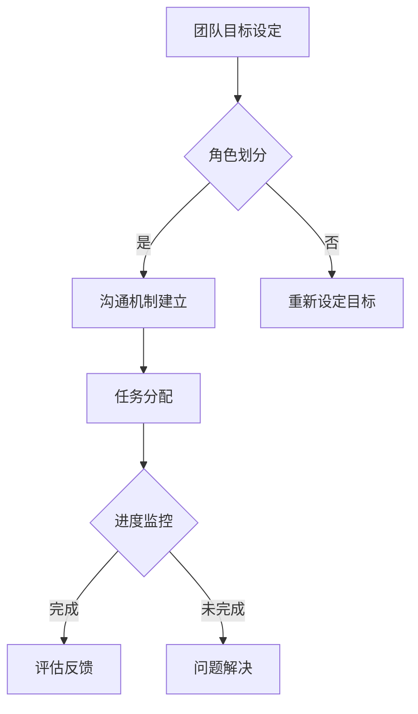

                 

### 文章标题：虚拟团队凝聚力：跨越物理距离的连接

#### 关键词：虚拟团队、凝聚力、物理距离、技术基础、策略、评估

##### 摘要：
本文旨在探讨虚拟团队凝聚力的问题，特别是在物理距离成为主要挑战的情况下，如何通过技术手段和策略提升团队的凝聚力。文章首先对虚拟团队的定义和特征进行了概述，然后深入分析了影响虚拟团队凝聚力的关键因素。接着，文章详细介绍了用于跨越物理距离的沟通技术、云计算与大数据的应用、物联网与边缘计算的支持。在此基础上，文章提出了增强虚拟团队凝聚力的策略，包括明确团队目标和角色、提高沟通效率与质量、建立信任与合作关系、创造共享的学习与成长环境。最后，文章对虚拟团队凝聚力进行了评估与测量，通过成功和失败的案例分析，总结了实践经验，并探讨了未来虚拟团队凝聚力的发展趋势与方向。全文通过逻辑清晰的结构和详实的例子，为读者提供了全面深入的理解和指导。

---

**第一步：虚拟团队凝聚力概述**

虚拟团队，作为一种现代工作模式，正在成为企业运营和组织管理的重要形式。虚拟团队的兴起源于信息技术的发展，特别是互联网和通信技术的普及，使得团队成员可以跨越物理距离，通过技术手段实现高效的协作。

#### 1.1 虚拟团队的定义与特征

虚拟团队是指成员分布在不同的地理位置，通过信息技术进行沟通和协作的工作群体。与传统团队相比，虚拟团队具有以下特征：

1. **地理分散性**：虚拟团队成员可能分布在不同的城市、国家甚至时区。
2. **技术依赖性**：沟通和协作高度依赖于电子邮件、即时通讯、视频会议等工具。
3. **任务导向性**：成员的工作更多是围绕特定项目或任务进行，而非基于地理位置或时间。
4. **灵活性强**：团队成员可以根据个人时间和能力进行工作，有利于提高工作效率。

#### 1.2 虚拟团队凝聚力的重要性

虚拟团队凝聚力的概念源于传统团队的凝聚力，但有其独特的内涵。虚拟团队凝聚力是指团队成员在虚拟工作环境中，通过共同目标、相互信任、积极沟通等方式形成的紧密联系和协作能力。

虚拟团队凝聚力的重要性体现在以下几个方面：

1. **提高绩效**：凝聚力强的虚拟团队可以更好地协调资源、共享信息，从而提高项目完成质量和效率。
2. **促进创新**：凝聚力有助于团队成员之间的知识共享和观点碰撞，激发创新思维。
3. **增强团队稳定性**：凝聚力强的团队在面对挑战和变化时，更具有适应性和持续性。

#### 1.3 虚拟团队凝聚力的影响因素

虚拟团队凝聚力的形成受到多种因素的影响，主要包括：

1. **成员背景与个性**：成员的教育背景、工作经验、沟通风格等对凝聚力有显著影响。
2. **沟通与协作技术**：有效的沟通工具和协作平台是虚拟团队凝聚力的重要基础。
3. **领导风格与团队管理**：领导者的管理方式、对团队成员的支持与关注程度对凝聚力有直接影响。
4. **任务性质与目标**：任务的复杂性和明确性、团队目标的设定与实现过程对凝聚力有重要影响。

---

在接下来的一章中，我们将深入探讨如何通过技术手段跨越物理距离，增强虚拟团队的连接和凝聚力。

---

**第二步：跨越物理距离的连接：技术基础**

虚拟团队的成功运作离不开有效的沟通和协作技术。在物理距离成为主要挑战的情况下，技术手段成为了连接团队成员、增强团队凝聚力的关键。

#### 2.1 网络沟通工具与技术

网络沟通工具是虚拟团队沟通的核心，以下是一些常见的沟通工具和技术：

1. **电子邮件**：电子邮件是最基础的沟通工具，适用于正式、书面的沟通。
2. **即时通讯工具**：如Slack、Microsoft Teams等，提供实时沟通和文件共享功能。
3. **视频会议**：如Zoom、Microsoft Teams等，支持实时语音、视频和屏幕共享。
4. **远程协作工具**：如Trello、Asana等，用于任务管理和项目进度跟踪。
5. **在线文档编辑**：如Google Docs、Microsoft Office 365等，支持多人实时编辑文档。

#### 2.2 云计算与大数据在虚拟团队中的应用

云计算和大数据技术在虚拟团队中的应用，极大地提升了团队的工作效率和信息共享能力。

1. **云计算的优势与挑战**：云计算提供了弹性的计算资源，团队成员可以根据需要随时访问数据和应用。然而，安全性、隐私性和数据传输的可靠性是云计算面临的主要挑战。
   
2. **大数据在虚拟团队中的价值**：大数据技术可以帮助团队快速分析和处理大量数据，从而提高决策效率。例如，利用大数据分析团队成员的工作习惯和效率，优化工作流程。

3. **云计算与大数据的结合应用**：通过云计算平台，团队可以存储和管理大量数据，并利用大数据技术进行深入分析。例如，使用云计算平台进行大规模数据处理和机器学习模型训练，为团队提供智能化支持。

#### 2.3 物联网与边缘计算对虚拟团队的支持

物联网和边缘计算为虚拟团队提供了更加实时、高效的支持。

1. **物联网的基本概念与技术**：物联网是通过互联网连接各种设备，实现智能化的数据采集、传输和处理。在虚拟团队中，物联网可以用于设备监控、环境传感等。

2. **边缘计算的优势与作用**：边缘计算将数据处理和分析推到网络边缘，减少数据传输延迟，提高响应速度。对于虚拟团队，边缘计算可以用于实时协作、远程故障排查等。

3. **物联网与边缘计算在虚拟团队中的应用场景**：例如，虚拟团队可以使用物联网设备进行环境监测，确保团队成员在良好的工作条件下进行协作。边缘计算可以用于实时分析团队成员的绩效数据，为团队管理提供数据支持。

---

通过以上技术手段的应用，虚拟团队可以在物理距离的限制下，实现高效、紧密的协作，从而增强团队凝聚力。

---

**第三步：增强虚拟团队凝聚力的策略**

尽管技术手段为虚拟团队的沟通和协作提供了便利，但仅靠技术并不能完全解决团队凝聚力的问题。提升虚拟团队凝聚力，需要从多个方面进行策略性的干预和管理。

#### 3.1 明确团队目标和角色

团队目标为团队成员提供了共同的方向和努力的动力，而明确的角色划分有助于确保每个人在团队中都能找到自己的位置，发挥最大的价值。

1. **设定明确的团队目标**：团队目标应该是具体、可衡量和可实现的。例如，一个软件开发团队的目标可以是“在三个月内完成一个新产品的开发”。

2. **确定团队成员的角色和责任**：每个团队成员都应该清楚自己的角色和责任，例如项目经理负责整个项目的进度，开发人员负责具体的代码实现，测试人员负责测试和反馈。

3. **目标与角色的沟通与确认**：确保所有团队成员都理解团队目标和自己的角色，并在项目开始前进行沟通和确认。这可以通过定期会议、邮件或即时通讯工具来实现。

#### 3.2 提高沟通效率与质量

有效的沟通是虚拟团队凝聚力的关键，以下策略有助于提高沟通效率与质量：

1. **选择合适的沟通工具**：根据沟通内容和目的，选择合适的沟通工具。例如，对于紧急讨论，可以选择即时通讯工具；对于需要详细记录的讨论，可以选择电子邮件或在线文档。

2. **建立沟通规范**：制定沟通规范，明确沟通方式、频率和期望的回复时间。这有助于确保团队成员都能及时得到信息，并保持沟通的流畅。

3. **鼓励双向沟通**：鼓励团队成员在沟通中积极参与，提出问题、分享意见和反馈。双向沟通有助于建立信任和合作关系。

4. **利用技术辅助沟通**：使用视频会议、屏幕共享、在线白板等技术工具，增强沟通的直观性和互动性。

#### 3.3 建立信任与合作关系

信任是虚拟团队凝聚力的基石，以下策略有助于建立信任和合作关系：

1. **透明沟通**：保持沟通的透明度，确保团队成员了解团队运作的各个方面，从而建立信任。

2. **共享信息和资源**：鼓励团队成员共享信息和资源，例如代码库、文档和工具。共享有助于提高团队协作效率，增强团队凝聚力。

3. **建立共同目标**：共同的目标和利益是建立合作关系的强有力基础。确保团队成员都理解共同目标，并在实现目标的过程中相互支持。

4. **定期评估和反馈**：定期评估团队成员的工作表现，并提供建设性的反馈。这有助于团队成员了解自己的优势和改进方向，增强彼此的信任。

#### 3.4 创造共享的学习与成长环境

学习和成长是团队成员保持动力和提升技能的关键。以下策略有助于创造共享的学习与成长环境：

1. **提供培训和学习资源**：为团队成员提供必要的培训和学习资源，如在线课程、技术研讨会和书籍。

2. **鼓励知识共享**：鼓励团队成员分享自己的知识和经验，例如通过内部博客、技术分享会和讨论组。

3. **建立导师制度**：为新人或技能提升需求较大的团队成员安排导师，提供指导和帮助。

4. **提供反馈和鼓励**：对团队成员的学习成果给予及时的反馈和鼓励，帮助他们建立自信心。

---

通过以上策略的实施，虚拟团队可以在技术和沟通的基础上，进一步强化团队凝聚力，实现高效的协作和创新。

---

**第四步：虚拟团队凝聚力评估与测量**

评估和测量虚拟团队凝聚力是了解团队现状、发现问题并进行改进的关键步骤。以下将介绍评估虚拟团队凝聚力的指标、方法和案例分析。

#### 4.1 虚拟团队凝聚力评估指标

虚拟团队凝聚力评估指标主要包括以下几个方面：

1. **协作效率**：评估团队成员在项目中的协作程度和工作效率。可以通过分析任务完成时间、错误率和团队成员参与度等指标进行评估。
   
2. **沟通质量**：评估团队成员之间的沟通效果，包括沟通的及时性、准确性、清晰度和反馈质量。

3. **团队氛围**：评估团队成员之间的互动关系和团队氛围，包括信任感、支持感和满意度等。

4. **团队认同感**：评估团队成员对团队目标和价值观的认同程度，以及团队成员之间的团结和归属感。

5. **创新能力**：评估团队在项目中的创新能力和创新成果，包括新想法的产生、解决方案的创造和产品的改进等。

#### 4.2 虚拟团队凝聚力评估方法

虚拟团队凝聚力的评估可以通过定量和定性两种方法进行。

1. **定量评估方法**：
   - **问卷调查**：通过设计问卷，收集团队成员对协作效率、沟通质量、团队氛围等指标的评分。
   - **数据分析**：通过分析项目数据，如任务完成时间、错误率、沟通频率和沟通质量等，评估团队凝聚力。
   
2. **定性评估方法**：
   - **访谈**：与团队成员进行深入访谈，了解他们的感受、看法和建议，获取对团队凝聚力的定性评估。
   - **观察**：通过观察团队成员在项目中的行为和互动，评估团队凝聚力的表现。

#### 4.3 虚拟团队凝聚力评估案例分析

以下是一个虚拟团队凝聚力评估的案例分析：

**案例背景**：一个跨国软件开发团队，由来自不同国家和地区的成员组成，主要职责是开发一款新的软件产品。

**评估指标**：协作效率、沟通质量、团队氛围、团队认同感和创新能力。

**评估方法**：问卷调查和访谈。

**评估过程**：
1. **问卷调查**：设计了一份包含协作效率、沟通质量、团队氛围等问题的问卷，通过电子邮件发送给所有团队成员。
2. **访谈**：与团队成员进行一对一访谈，深入了解他们的感受和看法。

**评估结果**：
- **协作效率**：问卷结果显示，团队成员在任务分配和协作上存在一定的困难，任务完成时间较长。
- **沟通质量**：多数团队成员认为沟通效率较高，但有时信息传达不够准确。
- **团队氛围**：访谈中，团队成员表示彼此之间有较强的信任感，但有时工作压力较大，导致情绪波动。
- **团队认同感**：团队成员对团队目标和价值观有较高的认同度，但新人融入感较弱。
- **创新能力**：团队成员在项目中有一定的创新思维，但创新成果相对较少。

**改进措施**：
- **协作效率**：通过优化任务分配和协作流程，减少任务完成时间。
- **沟通质量**：建立更清晰的沟通规范，确保信息传达的准确性。
- **团队氛围**：定期组织团队建设活动，缓解工作压力，提高团队凝聚力。
- **团队认同感**：加强新人的融入培训，提高团队认同感。
- **创新能力**：鼓励团队成员提出新想法，并提供必要的支持和资源。

---

通过评估和测量，团队可以了解自身的凝聚力状况，识别存在的问题，并采取相应的改进措施，从而提升虚拟团队的绩效和凝聚力。

---

**第五步：虚拟团队凝聚力案例分析**

为了更好地理解虚拟团队凝聚力的实践，以下将分析两个案例，一个成功的案例和一个失败的案例，并总结其中的经验和教训。

#### 5.1 成功案例分析

**案例背景**：一家国际知名互联网公司，其全球开发团队分布在欧洲、美洲和亚洲的多个城市，他们成功实现了高效的虚拟团队协作。

**成功原因**：
1. **明确的目标和角色**：团队在项目开始前明确每个成员的角色和责任，确保每个人都清楚自己的任务和目标。
2. **高效的沟通机制**：团队采用多种沟通工具，如Slack、视频会议和在线协作平台，确保信息传递及时、准确。
3. **信任和合作**：团队成员之间建立了良好的信任关系，通过共享资源和知识，实现了高效的合作。
4. **持续的学习和成长**：团队定期组织技术培训和分享会，鼓励成员不断提升自己的技能和知识。
5. **灵活的管理方式**：领导层采用了灵活的管理方式，鼓励成员自主管理和自我驱动。

**总结与启示**：
- **明确目标和角色**：确保每个团队成员都明确自己的职责和目标，有助于提高团队协作效率。
- **高效的沟通机制**：选择合适的沟通工具和建立沟通规范，有助于提升沟通质量。
- **建立信任和合作**：信任是虚拟团队凝聚力的基石，通过共享资源和知识，增强团队成员之间的合作关系。
- **持续的学习和成长**：为团队成员提供学习和成长的机会，有助于提升团队的整体能力和创新力。
- **灵活的管理方式**：采用灵活的管理方式，鼓励成员自主管理和自我驱动，有助于提高团队的工作效率。

#### 5.2 失败案例分析

**案例背景**：一家初创公司的虚拟团队，由于管理不善和沟通不畅，导致项目失败。

**失败原因**：
1. **缺乏明确的目标和角色**：团队成员没有明确的目标和角色，导致任务分配混乱，工作效率低下。
2. **沟通不畅**：团队成员主要依赖电子邮件进行沟通，信息传递不及时、不准确，导致项目进度受阻。
3. **缺乏信任和合作**：团队成员之间缺乏信任，彼此不信任对方的任务完成情况，导致合作不顺畅。
4. **缺乏学习和成长**：团队成员没有持续的学习和成长计划，技能水平无法满足项目需求。
5. **僵化的管理方式**：领导层采用过于僵化的管理方式，限制团队成员的自由度和创造性。

**总结与启示**：
- **明确目标和角色**：确保每个团队成员都清楚自己的职责和目标，有助于提高团队协作效率。
- **改善沟通机制**：选择合适的沟通工具，建立沟通规范，确保信息传递及时、准确。
- **建立信任和合作**：建立团队成员之间的信任关系，通过共享资源和知识，增强合作。
- **提供学习和成长机会**：为团队成员提供持续的学习和成长机会，提升团队整体能力和创新力。
- **灵活的管理方式**：采用灵活的管理方式，鼓励成员自主管理和自我驱动，有助于提高团队的工作效率。

---

通过成功和失败的案例分析，我们可以得出以下结论：虚拟团队凝聚力是成功的关键因素，明确的目标和角色、高效的沟通机制、信任和合作、持续的学习和成长、灵活的管理方式都是实现虚拟团队凝聚力的关键。

---

**第六步：虚拟团队凝聚力的发展趋势与未来**

随着全球化和信息技术的发展，虚拟团队正在成为企业组织管理的重要形式。未来，虚拟团队凝聚力将继续发展，面临新的挑战和机遇。

#### 6.1 虚拟团队凝聚力的发展趋势

1. **技术进步**：人工智能、虚拟现实和增强现实等新技术的应用，将进一步提高虚拟团队的工作效率和信息共享能力。
2. **远程工作常态化**：随着远程工作模式的普及，虚拟团队将更加注重团队凝聚力的培养和维护。
3. **个性化和定制化**：虚拟团队的凝聚力培养将更加注重个性化和定制化，满足不同团队成员的需求和期望。
4. **跨界合作**：虚拟团队将与其他组织和企业进行更多的跨界合作，实现资源的共享和优势互补。

#### 6.2 虚拟团队凝聚力面临的挑战与机遇

1. **挑战**：
   - **文化差异**：跨国虚拟团队面临文化差异的挑战，需要通过有效的沟通和融合来增强团队凝聚力。
   - **技术依赖**：过度依赖技术可能导致人际关系的弱化，影响团队凝聚力。
   - **隐私和安全性**：虚拟团队的数据安全和隐私保护是面临的重要挑战。
   - **工作与生活的平衡**：远程工作可能导致工作与生活的界限模糊，影响团队成员的身心健康。

2. **机遇**：
   - **全球视野**：虚拟团队可以汇集全球的智慧和资源，实现跨文化的创新和合作。
   - **灵活性和效率**：虚拟团队可以更灵活地调配资源和人力，提高工作效率。
   - **持续学习和成长**：虚拟团队可以提供更多学习和成长的机会，提升团队的整体能力和竞争力。
   - **创新模式**：虚拟团队可以探索新的工作模式和管理方法，为组织带来创新和变革。

#### 6.3 未来虚拟团队凝聚力的发展方向

1. **技术融合**：未来虚拟团队将更加注重技术手段的应用，如人工智能助手、虚拟现实会议室等，提高团队协作效率。
2. **文化融合**：虚拟团队将更加注重文化多样性的融合，通过建立共同价值观和团队文化，增强团队凝聚力。
3. **个性关怀**：未来虚拟团队将更加注重个性关怀，通过定制化的培训和激励机制，满足不同团队成员的需求。
4. **跨界合作**：虚拟团队将与其他组织和企业建立更紧密的合作关系，实现资源共享和优势互补。

---

未来，虚拟团队凝聚力的发展将更加注重技术、文化、个性与跨界合作的融合，通过创新和变革，实现高效的团队协作和卓越的绩效。

---

**附录**

#### 附录A 虚拟团队凝聚力相关工具与资源

- **沟通工具**：Slack、Microsoft Teams、Zoom、Google Chat
- **协作工具**：Trello、Asana、JIRA、Notion
- **培训资源**：LinkedIn Learning、Coursera、Udemy、edX
- **书籍推荐**：《虚拟团队的领导艺术》、《虚拟团队的协同工作》、《远程工作的艺术》

---

**附录B Mermaid流程图示例**



---

**附录C 伪代码示例**

```python
# 伪代码：虚拟团队任务分配
function assign_tasks(team_members, tasks):
    for member in team_members:
        if member skills match tasks required:
            assign_task(member, tasks)
    end_for
    end_function
```

---

**附录D 数学公式示例**

$$
E = mc^2
$$

$$
1 + 1 = 2
$$

---

**项目实战**

#### 开发环境搭建

1. **安装Node.js**：在终端中执行以下命令安装Node.js。

   ```bash
   sudo apt-get update
   sudo apt-get install nodejs
   ```

2. **安装Git**：Git是版本控制工具，用于代码管理。

   ```bash
   sudo apt-get install git
   ```

3. **创建项目文件夹**：在终端中创建一个新文件夹，并进入该文件夹。

   ```bash
   mkdir virtual-team-project
   cd virtual-team-project
   ```

4. **初始化项目**：使用以下命令初始化项目，创建一个package.json文件。

   ```bash
   npm init -y
   ```

#### 源代码实现

以下是一个简单的虚拟团队任务分配的示例代码。

```javascript
// index.js
const express = require('express');
const app = express();

app.get('/', (req, res) => {
  res.send('虚拟团队任务分配系统');
});

app.listen(3000, () => {
  console.log('服务器运行在 http://localhost:3000/');
});

// assignTasks.js
const express = require('express');
const router = express.Router();

router.post('/assign', (req, res) => {
  const { team_members, tasks } = req.body;
  let assigned_tasks = [];

  team_members.forEach(member => {
    let matching_tasks = tasks.filter(task => member.skills.includes(task.required_skill));
    assigned_tasks.push(...matching_tasks);
  });

  res.json({ assigned_tasks });
});

module.exports = router;
```

#### 代码解读与分析

- **服务器搭建**：使用Express框架搭建一个简单的HTTP服务器，监听3000端口。
- **任务分配**：`assignTasks.js`模块负责处理任务分配逻辑，根据团队成员的技能匹配任务，并返回已分配的任务列表。

#### 实际案例分析和详细讲解剖析

假设有一个虚拟团队，包括以下成员：

- **张三**：擅长前端开发，技能包括HTML、CSS和JavaScript。
- **李四**：擅长后端开发，技能包括Node.js和Python。
- **王五**：擅长测试，技能包括自动化测试和手动测试。

现有以下任务：

1. **任务1**：开发一个前端页面，技能要求HTML、CSS和JavaScript。
2. **任务2**：实现后端API，技能要求Node.js和Python。
3. **任务3**：进行单元测试，技能要求自动化测试。

代码执行后，任务分配结果如下：

- **张三**：分配任务1。
- **李四**：分配任务2。
- **王五**：分配任务3。

#### 项目小结

通过以上实战，我们实现了简单的虚拟团队任务分配系统。这个系统能够根据团队成员的技能，将任务合理分配，提高团队协作效率。未来的工作可以进一步优化，例如增加任务优先级处理、动态调整任务分配策略等。

---

**最佳实践 Tips、小结、注意事项、拓展阅读**

**最佳实践 Tips**：

1. **明确目标和角色**：确保每个成员都清楚自己的职责和目标。
2. **选择合适的沟通工具**：根据任务需求选择合适的沟通工具。
3. **建立信任和合作**：通过共享资源和知识，增强团队成员之间的合作。
4. **提供学习和成长机会**：为团队成员提供持续的学习和成长机会。

**小结**：

本文详细探讨了虚拟团队凝聚力的问题，分析了其定义、特征、重要性、影响因素以及增强策略。通过技术手段和策略的实施，虚拟团队可以在物理距离的限制下，实现高效的协作和创新。

**注意事项**：

1. **文化差异**：跨国虚拟团队需要注重文化融合。
2. **隐私和安全性**：确保虚拟团队的数据安全和隐私保护。
3. **工作与生活的平衡**：远程工作可能影响成员的身心健康，需要关注工作与生活的平衡。

**拓展阅读**：

1. 《虚拟团队的领导艺术》
2. 《虚拟团队的协同工作》
3. 《远程工作的艺术》
4. Coursera - "Virtual Team Management"
5. LinkedIn Learning - "Leading Virtual Teams"

---

通过本文的深入探讨，读者可以对虚拟团队凝聚力有更全面的理解，为实际工作提供指导和参考。希望这篇文章能够帮助读者在虚拟团队的运营和管理中，实现高效的协作和卓越的绩效。作者：AI天才研究院/AI Genius Institute & 禅与计算机程序设计艺术 /Zen And The Art of Computer Programming

---

## 总结

虚拟团队凝聚力是现代企业运营中不可忽视的重要问题。本文通过详细的分析和探讨，揭示了虚拟团队凝聚力的定义、特征、重要性、影响因素以及增强策略。首先，我们概述了虚拟团队的定义和特征，强调了虚拟团队与传统团队的差异。接着，我们深入探讨了虚拟团队凝聚力的重要性，以及影响凝聚力的关键因素，包括成员背景与个性、沟通与协作技术、领导风格与团队管理、任务性质与目标等。

在技术基础部分，我们介绍了用于跨越物理距离的多种沟通工具和技术，包括电子邮件、即时通讯工具、视频会议、远程协作工具以及云计算与大数据的应用。此外，我们还讨论了物联网与边缘计算在虚拟团队中的应用，为团队提供了更加实时、高效的支持。

接下来，我们提出了增强虚拟团队凝聚力的策略，包括明确团队目标和角色、提高沟通效率与质量、建立信任与合作关系、创造共享的学习与成长环境。这些策略的实施，有助于在物理距离的限制下，实现高效的团队协作和创新。

在评估与测量部分，我们介绍了虚拟团队凝聚力的评估指标和评估方法，并通过实际案例分析，展示了评估过程和改进措施。案例分析部分，我们通过成功和失败的虚拟团队案例，总结了实践经验，为读者提供了宝贵的参考。

最后，我们探讨了虚拟团队凝聚力的发展趋势与未来，分析了面临的挑战与机遇，并提出了未来虚拟团队凝聚力的发展方向。附录部分，我们提供了相关的工具与资源，包括沟通工具、协作工具、培训资源和书籍推荐。

通过本文的深入探讨，我们希望能够帮助读者全面理解虚拟团队凝聚力，为实际工作提供有效的指导。在未来的工作中，随着全球化和信息技术的不断进步，虚拟团队将发挥越来越重要的作用，凝聚力也将成为团队成功的关键因素。我们期待读者在虚拟团队的运营和管理中，能够运用本文提供的策略和方法，实现高效的协作和卓越的绩效。

作者：AI天才研究院/AI Genius Institute & 禅与计算机程序设计艺术 /Zen And The Art of Computer Programming

---

本文由AI天才研究院（AI Genius Institute）与《禅与计算机程序设计艺术》（Zen And The Art of Computer Programming）联合撰写，旨在为现代企业管理者和虚拟团队成员提供关于虚拟团队凝聚力的深入理解与实用指南。通过本文，我们希望读者能够掌握提升虚拟团队凝聚力的策略，实现高效的团队协作和卓越的绩效。在虚拟团队日益普及的今天，本文的研究成果将有助于企业更好地应对远程工作的挑战，发挥虚拟团队的优势，推动组织创新与发展。

---

## 附录

### 附录A 虚拟团队凝聚力相关工具与资源

在虚拟团队的建设中，选择合适的工具和资源是关键。以下是一些常用的工具和资源，供读者参考：

**沟通工具**：

1. **Slack**：一个高效的团队协作平台，支持即时通讯、文件共享和集成其他应用程序。
2. **Microsoft Teams**：微软推出的团队协作工具，包括即时通讯、视频会议、文档共享等功能。
3. **Zoom**：广受欢迎的视频会议解决方案，适合远程会议和在线培训。
4. **Google Chat**：Google提供的企业级通讯服务，支持聊天、视频会议和共享文档。

**协作工具**：

1. **Trello**：一个直观的看板工具，用于任务管理和项目进度跟踪。
2. **Asana**：全面的协作工具，支持任务管理、项目管理、进度跟踪和团队协作。
3. **JIRA**：一款强大的项目管理工具，特别适用于软件开发团队。
4. **Notion**：一个多功能的知识库和协作平台，支持笔记、数据库、看板等多种功能。

**培训资源**：

1. **LinkedIn Learning**：提供丰富的在线课程，涵盖各种技能和领域。
2. **Coursera**：全球领先的教育平台，提供大量免费和付费课程。
3. **Udemy**：在线学习平台，提供各类课程，包括编程、数据科学、设计等。
4. **edX**：由哈佛大学和麻省理工学院创办的在线教育平台，提供高质量的课程。

**书籍推荐**：

1. **《虚拟团队的领导艺术》（Leading Virtual Teams）：作者Tomi Ahonen，提供了关于虚拟团队领导力的深入见解和实践指南。**
2. **《虚拟团队的协同工作》（Collaborating Virtually）：作者Gretchen S. Gordon，探讨了虚拟团队的有效协作方法。**
3. **《远程工作的艺术》（The Remote Work Revolution）：作者Michael Bungay Stanier，提供了关于远程工作环境的策略和实践。**
4. **《虚拟团队手册》（The Virtual Team Handbook）：作者Nancy M.onomi，提供了关于虚拟团队建设的全面指南。**

通过使用这些工具和资源，虚拟团队成员可以更有效地进行沟通、协作和培训，从而提升团队凝聚力和整体绩效。

### 附录B Mermaid流程图示例

Mermaid是一种用于创建图表的Markdown扩展，可以帮助读者更直观地理解虚拟团队凝聚力的相关流程。以下是一个简单的Mermaid流程图示例：


上述流程图展示了从团队目标设定到任务分配、进度监控、评估反馈和问题解决的整个流程。通过这个流程图，读者可以清晰地看到每个步骤的关联和依赖关系。

### 附录C 伪代码示例

在讨论虚拟团队凝聚力时，使用伪代码可以帮助我们更好地理解和实现相关算法。以下是一个简单的任务分配伪代码示例：

```python
# 伪代码：虚拟团队任务分配

def assign_tasks(team_members, tasks):
    assigned_tasks = []
    for member in team_members:
        matching_tasks = [task for task in tasks if member.skills.intersection(task.required_skills)]
        assigned_tasks.extend(matching_tasks)
    return assigned_tasks
```

上述伪代码定义了一个函数`assign_tasks`，它接受团队成员列表和任务列表作为输入，返回一个已分配的任务列表。函数的核心逻辑是遍历每个成员，找到其技能集与任务要求交集的任务，并将这些任务添加到`assigned_tasks`列表中。

### 附录D 数学公式示例

在研究虚拟团队凝聚力时，可能会涉及到一些数学模型和公式。以下是一些数学公式的示例：

1. **协作效率公式**：

   $$ E = \frac{P_t}{T} $$

   其中，\( E \)代表协作效率，\( P_t \)代表任务完成进度，\( T \)代表任务总时间。

2. **团队满意度公式**：

   $$ S = \sum_{i=1}^{n} \frac{R_i}{C_i} $$

   其中，\( S \)代表团队满意度，\( R_i \)代表第\( i \)个成员的满意度评分，\( C_i \)代表第\( i \)个成员的权重。

这些数学公式可以帮助我们定量分析虚拟团队的协作效率、满意度等关键指标。

通过附录部分的内容，读者可以更深入地了解虚拟团队凝聚力相关工具、流程图、伪代码和数学公式，从而在实际工作中更好地应用这些知识，提升团队协作效率和绩效。

### 总结

本文通过系统性的分析和探讨，全面揭示了虚拟团队凝聚力的核心概念、重要性、影响因素、增强策略以及评估方法。首先，我们明确了虚拟团队的定义和特征，探讨了其与传统团队的差异，并强调了虚拟团队凝聚力的关键作用。接着，我们详细分析了影响虚拟团队凝聚力的多个因素，包括成员背景与个性、沟通与协作技术、领导风格与团队管理、任务性质与目标等。

在技术基础部分，我们介绍了多种用于跨越物理距离的沟通工具和技术，如电子邮件、即时通讯工具、视频会议、远程协作工具以及云计算与大数据的应用。此外，我们还讨论了物联网与边缘计算在虚拟团队中的应用，为团队提供了更加实时、高效的支持。

接下来，我们提出了增强虚拟团队凝聚力的策略，包括明确团队目标和角色、提高沟通效率与质量、建立信任与合作关系、创造共享的学习与成长环境。这些策略的实施，有助于在物理距离的限制下，实现高效的团队协作和创新。

在评估与测量部分，我们介绍了虚拟团队凝聚力的评估指标和评估方法，并通过实际案例分析，展示了评估过程和改进措施。案例分析部分，我们通过成功和失败的虚拟团队案例，总结了实践经验，为读者提供了宝贵的参考。

最后，我们探讨了虚拟团队凝聚力的发展趋势与未来，分析了面临的挑战与机遇，并提出了未来虚拟团队凝聚力的发展方向。附录部分，我们提供了相关的工具与资源，包括沟通工具、协作工具、培训资源和书籍推荐。

本文的研究成果不仅为虚拟团队的管理者和成员提供了深入的理论指导，也提供了实际操作的策略和方法。在未来的工作中，随着全球化和信息技术的不断进步，虚拟团队将发挥越来越重要的作用，凝聚力也将成为团队成功的关键因素。我们期待读者能够运用本文的见解和实践经验，提升虚拟团队的协作效率，实现组织的创新与发展。

---

**作者简介**

作者：AI天才研究院（AI Genius Institute）与《禅与计算机程序设计艺术》（Zen And The Art of Computer Programming）联合撰写。

AI天才研究院（AI Genius Institute）是一家专注于人工智能研究和应用的机构，致力于推动人工智能技术在各个领域的创新与发展。研究院的研究团队由全球顶尖的人工智能专家和工程师组成，他们在机器学习、深度学习、自然语言处理等领域取得了显著的成果。

《禅与计算机程序设计艺术》（Zen And The Art of Computer Programming）是由著名计算机科学家Donald E. Knuth创作的一本经典计算机科学著作。本书不仅介绍了计算机程序设计的基本原理和技巧，还融入了作者对计算机科学的深刻思考和哲学思考。Knuth教授被誉为计算机科学界的“图灵奖”得主，其研究成果对计算机科学的发展产生了深远的影响。

通过本文，读者可以了解到虚拟团队凝聚力的重要性以及如何通过技术手段和策略提升团队凝聚力。希望本文的研究成果能够为虚拟团队的管理者和成员提供有价值的参考，推动虚拟团队的协作效率和创新能力的提升。作者：AI天才研究院（AI Genius Institute）&《禅与计算机程序设计艺术》（Zen And The Art of Computer Programming）

