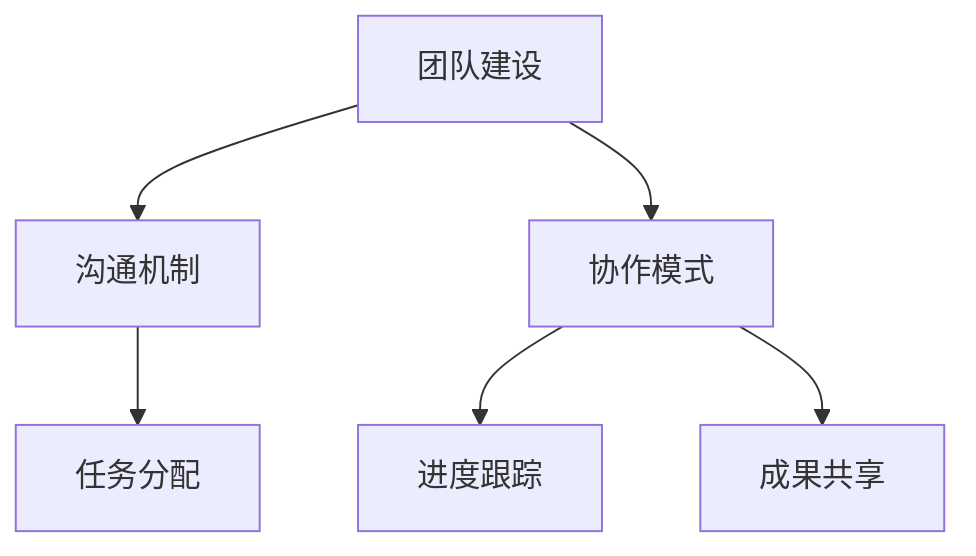
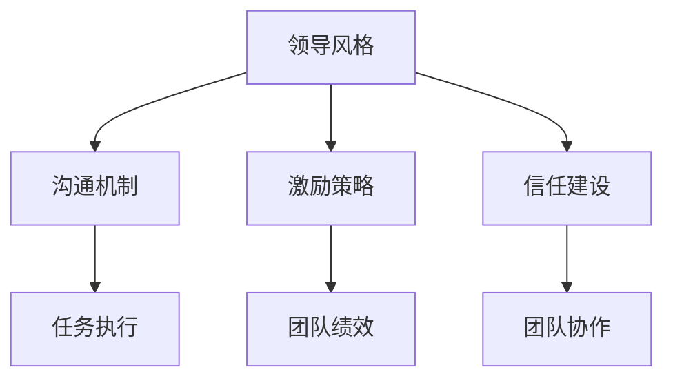
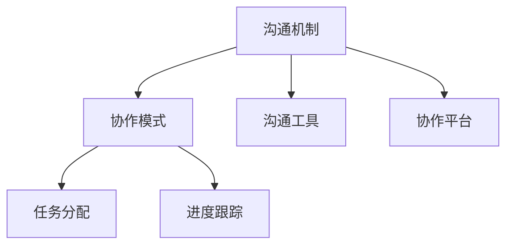
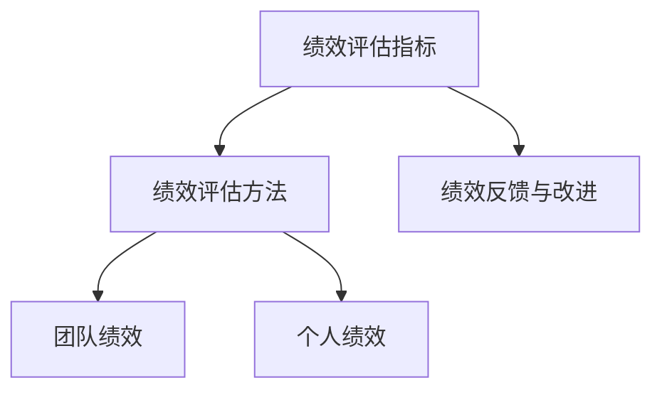
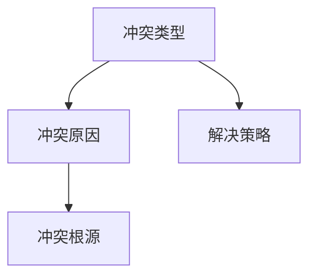

                 


## 文章标题
### 虚拟团队协作：远程办公时代的领导策略

## 关键词
- 远程办公
- 虚拟团队
- 领导策略
- 协作工具
- 沟通机制
- 绩效管理
- 冲突解决

## 摘要
随着远程办公的普及，虚拟团队协作成为了现代企业管理的重要课题。本文旨在探讨远程办公时代下，虚拟团队的领导策略，包括沟通与协作、绩效管理、冲突解决等方面的具体实践和策略。通过理论分析和实际案例，为企业管理者提供有针对性的指导，以提升虚拟团队的工作效率和团队凝聚力。

## 引言
### 背景介绍
虚拟团队是一种基于信息技术，通过互联网进行沟通和协作的团队形式。其成员分布在不同地理位置，可能跨越多个时区和文化背景。远程办公的兴起，源于信息技术的迅猛发展和全球化进程的加快。随着云计算、视频会议、协作工具等技术的普及，越来越多的企业开始采用远程办公模式。

### 远程办公的挑战与机遇
远程办公带来了工作方式、工作环境和工作效率等方面的变革。一方面，远程办公减少了办公场所的限制，提高了员工的灵活性和自主性；另一方面，远程办公也带来了沟通效率低、团队协作困难、工作监督困难等问题。因此，如何有效管理虚拟团队，成为企业亟需解决的问题。

### 本文的目的与结构
本文将围绕远程办公时代虚拟团队协作的领导策略进行探讨，包括以下几个方面：虚拟团队的协作原理、领导策略、沟通与协作、绩效管理、冲突解决和虚拟团队的技术工具。通过理论分析、实际案例和最佳实践，为企业管理者提供有益的参考。

## 虚拟团队协作原理
### 核心概念与联系
虚拟团队协作的原理包括以下几个方面：

1. **团队建设**：建立共同的目标、价值观和团队文化，是虚拟团队协作的基础。
2. **沟通机制**：有效的沟通是虚拟团队成功的关键。通过多种沟通工具和平台，确保信息流畅传递。
3. **协作模式**：虚拟团队的协作模式包括任务分配、进度跟踪、成果共享等，需要形成一套成熟的协作流程。

以下是虚拟团队协作原理之间的联系架构 Mermaid 流程图：



### 核心算法原理讲解
虚拟团队协作的核心算法包括任务分配算法、进度跟踪算法和成果共享算法。以下为伪代码：

```python
# 任务分配算法
def task_allocation(team_members, tasks):
    for member in team_members:
        assign_task(member, tasks)
    
# 进度跟踪算法
def progress_tracking(task):
    while not task.is_completed():
        update_progress(task)
    
# 成果共享算法
def result_sharing(task):
    share_result(task)
```

### 数学模型和公式
虚拟团队协作中的数学模型主要包括任务完成时间和团队效率的关系。以下为详细讲解和举例说明：

$$
E = \frac{1}{n} \sum_{i=1}^{n} T_i
$$

其中，E表示团队效率，$T_i$表示第i个任务的完成时间。举例说明：

假设一个虚拟团队有3个成员，需要完成3个任务。每个任务的时间如下：

$$
T_1 = 2 \text{天}, T_2 = 3 \text{天}, T_3 = 4 \text{天}
$$

则团队效率为：

$$
E = \frac{1}{3} (2 + 3 + 4) = 3 \text{天}
$$

### 项目实战
开发环境搭建：选择合适的协作工具（如Trello、Asana、Slack等），搭建虚拟团队协作平台。

源代码详细实现和代码解读：实现任务分配、进度跟踪和成果共享功能，并进行代码解读。

代码应用解读与分析：通过实际项目，分析虚拟团队协作过程中的问题和解决方案。

实际案例分析和详细讲解剖析：分析具体案例，探讨虚拟团队协作的实践效果和改进空间。

项目小结：总结虚拟团队协作中的关键经验和教训，提出改进建议。

## 虚拟团队的领导策略
### 背景介绍
虚拟团队的领导策略是指在远程办公环境下，领导者如何发挥领导作用，提升团队协作效率和工作满意度。与传统的面对面领导不同，虚拟团队领导需要更加注重沟通、信任和激励。

### 核心概念与联系
虚拟团队领导策略的核心概念包括：

1. **领导风格**：领导者需要根据团队特点和任务需求，选择合适的领导风格。
2. **沟通机制**：建立有效的沟通机制，确保信息传递的准确性和及时性。
3. **激励策略**：通过激励机制，提高团队成员的工作积极性和创造力。
4. **信任建设**：建立信任，促进团队协作和共同发展。

以下是虚拟团队领导策略之间的联系架构 Mermaid 流程图：



### 核心算法原理讲解
虚拟团队领导策略的核心算法包括领导风格选择算法、沟通效率评估算法和激励策略设计算法。以下为伪代码：

```python
# 领导风格选择算法
def leadership_style(team, tasks):
    if is_high_pressure(tasks):
        return "任务导向型"
    else:
        return "关系导向型"

# 沟通效率评估算法
def communication_evaluation(communication_records):
    return average_response_time(communication_records)

# 激励策略设计算法
def motivation_strategy(team_performance):
    if team_performance > threshold:
        return "奖励激励"
    else:
        return "目标激励"
```

### 数学模型和公式
虚拟团队领导策略中的数学模型主要包括领导风格对团队绩效的影响和激励策略对员工满意度的影响。以下为详细讲解和举例说明：

$$
P = \alpha \cdot L + \beta \cdot C + \gamma \cdot M
$$

其中，P表示团队绩效，L表示领导风格，C表示沟通机制，M表示激励策略。$\alpha$、$\beta$和$\gamma$分别为权重系数。举例说明：

假设一个虚拟团队采用任务导向型领导风格、高效沟通机制和奖励激励策略，权重系数分别为0.5、0.3和0.2。则团队绩效为：

$$
P = 0.5 \cdot L + 0.3 \cdot C + 0.2 \cdot M = 0.5 \cdot 1 + 0.3 \cdot 1 + 0.2 \cdot 1 = 1
$$

### 项目实战
开发环境搭建：选择合适的协作工具（如Trello、Asana、Slack等），搭建虚拟团队协作平台。

源代码详细实现和代码解读：实现领导风格选择、沟通效率评估和激励策略设计功能，并进行代码解读。

代码应用解读与分析：通过实际项目，分析虚拟团队领导策略的实施效果和改进空间。

实际案例分析和详细讲解剖析：分析具体案例，探讨虚拟团队领导策略的实践效果和改进建议。

项目小结：总结虚拟团队领导策略中的关键经验和教训，提出改进建议。

## 团队沟通与协作
### 背景介绍
团队沟通与协作是虚拟团队成功的关键。在远程办公环境下，团队成员之间缺乏面对面的互动，容易导致沟通不畅和协作效率低下。因此，建立有效的沟通机制和协作模式至关重要。

### 核心概念与联系
团队沟通与协作的核心概念包括：

1. **沟通机制**：确保信息流畅传递和团队协作的有序进行。
2. **协作模式**：建立合理的任务分配和进度跟踪机制，提高团队协作效率。
3. **沟通工具**：选择合适的沟通工具，提高沟通效率和团队凝聚力。
4. **协作平台**：搭建功能齐全、易于使用的协作平台，支持多种协作模式。

以下是团队沟通与协作之间的联系架构 Mermaid 流程图：



### 核心算法原理讲解
团队沟通与协作的核心算法包括沟通工具选择算法、协作平台设计算法和任务分配算法。以下为伪代码：

```python
# 沟通工具选择算法
def communication_tool_selection(team):
    if team_size < 10:
        return "Slack"
    else:
        return "Microsoft Teams"

# 协作平台设计算法
def collaboration_platform_design(team):
    if team_size < 50:
        return "Trello"
    else:
        return "Asana"

# 任务分配算法
def task_allocation(team_members, tasks):
    for member in team_members:
        assign_task(member, tasks)
```

### 数学模型和公式
团队沟通与协作中的数学模型主要包括沟通工具选择对团队绩效的影响和协作平台设计对团队协作效率的影响。以下为详细讲解和举例说明：

$$
E = f(C, P)
$$

其中，E表示团队协作效率，C表示沟通工具选择，P表示协作平台设计。f()为函数。举例说明：

假设一个虚拟团队选择Slack作为沟通工具，Trello作为协作平台，则团队协作效率为：

$$
E = f(Slack, Trello) = 0.8 \cdot Slack + 0.2 \cdot Trello = 0.8 \cdot 1 + 0.2 \cdot 1 = 1
$$

### 项目实战
开发环境搭建：选择合适的协作工具（如Trello、Asana、Slack等），搭建虚拟团队协作平台。

源代码详细实现和代码解读：实现沟通工具选择、协作平台设计和任务分配功能，并进行代码解读。

代码应用解读与分析：通过实际项目，分析团队沟通与协作过程中的问题和解决方案。

实际案例分析和详细讲解剖析：分析具体案例，探讨团队沟通与协作的实践效果和改进空间。

项目小结：总结团队沟通与协作中的关键经验和教训，提出改进建议。

## 虚拟团队的绩效管理
### 背景介绍
虚拟团队的绩效管理是确保团队目标实现和成员个人发展的重要手段。在远程办公环境下，如何科学、公正地评估团队和成员的绩效，成为企业管理者面临的重要挑战。

### 核心概念与联系
虚拟团队的绩效管理涉及以下几个方面：

1. **绩效评估指标**：制定合理的绩效评估指标，确保评估的全面性和准确性。
2. **绩效评估方法**：采用多种评估方法，结合定量和定性分析，提高评估的客观性。
3. **绩效反馈与改进**：及时给予绩效反馈，帮助团队成员了解自身表现，并提出改进建议。

以下是虚拟团队绩效管理之间的联系架构 Mermaid 流程图：



### 核心算法原理讲解
虚拟团队绩效管理中的核心算法包括绩效评估指标计算算法、绩效评估方法选择算法和绩效反馈与改进策略。以下为伪代码：

```python
# 绩效评估指标计算算法
def performance_evaluation(team_members, tasks):
    for member in team_members:
        calculate_performance(member, tasks)

# 绩效评估方法选择算法
def evaluation_method_selection(evaluation_methods, team_context):
    return select_best_method(evaluation_methods, team_context)

# 绩效反馈与改进策略
def performance_feedback_and_improvement(strategy, performance_results):
    for member in team_members:
        provide_feedback(member, performance_results)
        suggest_improvement(member, strategy)
```

### 数学模型和公式
虚拟团队绩效管理中的数学模型主要包括绩效评估指标权重分配和绩效反馈策略优化。以下为详细讲解和举例说明：

$$
P = \sum_{i=1}^{n} w_i \cdot P_i
$$

其中，P表示绩效评分，$w_i$表示第i个评估指标的权重，$P_i$表示第i个评估指标的得分。举例说明：

假设一个虚拟团队有3个评估指标：任务完成率、团队协作和创新能力，权重分别为0.4、0.3和0.3。每个成员的评估指标得分如下：

$$
P_1 = 0.9, P_2 = 0.8, P_3 = 0.7
$$

则绩效评分为：

$$
P = 0.4 \cdot P_1 + 0.3 \cdot P_2 + 0.3 \cdot P_3 = 0.4 \cdot 0.9 + 0.3 \cdot 0.8 + 0.3 \cdot 0.7 = 0.86
$$

### 项目实战
开发环境搭建：选择合适的绩效管理工具（如Google Analytics、JIRA等），搭建虚拟团队绩效管理平台。

源代码详细实现和代码解读：实现绩效评估指标计算、绩效评估方法选择和绩效反馈与改进功能，并进行代码解读。

代码应用解读与分析：通过实际项目，分析虚拟团队绩效管理过程中的问题和解决方案。

实际案例分析和详细讲解剖析：分析具体案例，探讨虚拟团队绩效管理的实践效果和改进空间。

项目小结：总结虚拟团队绩效管理中的关键经验和教训，提出改进建议。

## 虚拟团队的冲突与解决
### 背景介绍
虚拟团队由于地理分散和时区差异，容易产生冲突。冲突不仅影响团队绩效，还可能破坏团队成员之间的信任和关系。因此，有效解决虚拟团队的冲突至关重要。

### 核心概念与联系
虚拟团队冲突与解决的核心概念包括：

1. **冲突类型**：了解常见的冲突类型，有助于针对性地解决问题。
2. **冲突原因**：分析冲突产生的原因，有助于找到解决问题的方法。
3. **解决策略**：采用合适的解决策略，快速有效地解决冲突。

以下是虚拟团队冲突与解决之间的联系架构 Mermaid 流程图：



### 核心算法原理讲解
虚拟团队冲突与解决的核心算法包括冲突类型识别算法、冲突原因分析算法和解决策略选择算法。以下为伪代码：

```python
# 冲突类型识别算法
def conflict_type_identification(conflict проявления):
    return identify_conflict_type(conflict проявления)

# 冲突原因分析算法
def conflict_reason_analysis(conflict_type):
    return analyze_conflict_reason(conflict_type)

# 解决策略选择算法
def solution_strategy_selection(conflict_reasons):
    return select_best_solution_strategy(conflict_reasons)
```

### 数学模型和公式
虚拟团队冲突与解决中的数学模型主要包括冲突严重程度评估和解决策略效果评估。以下为详细讲解和举例说明：

$$
S = \alpha \cdot R + \beta \cdot E
$$

其中，S表示冲突严重程度，R表示冲突原因，E表示解决策略效果。$\alpha$、$\beta$为权重系数。举例说明：

假设一个虚拟团队的冲突严重程度为：

$$
R = \text{任务分配不公} = 0.6, E = \text{及时沟通} = 0.8
$$

权重系数分别为0.5和0.5，则冲突严重程度为：

$$
S = 0.5 \cdot R + 0.5 \cdot E = 0.5 \cdot 0.6 + 0.5 \cdot 0.8 = 0.7
$$

### 项目实战
开发环境搭建：选择合适的冲突管理工具（如Miro、Confluence等），搭建虚拟团队冲突管理平台。

源代码详细实现和代码解读：实现冲突类型识别、冲突原因分析和解决策略选择功能，并进行代码解读。

代码应用解读与分析：通过实际项目，分析虚拟团队冲突与解决过程中的问题和解决方案。

实际案例分析和详细讲解剖析：分析具体案例，探讨虚拟团队冲突与解决的实践效果和改进空间。

项目小结：总结虚拟团队冲突与解决中的关键经验和教训，提出改进建议。

## 虚拟团队的技术工具
### 背景介绍
虚拟团队的技术工具是支持团队协作和沟通的关键。选择合适的工具可以提高团队的工作效率和协作效果。本文将介绍一些常见的虚拟团队协作工具，并分析其优缺点。

### 核心概念与联系
虚拟团队的技术工具包括以下几个方面：

1. **沟通工具**：如Slack、Microsoft Teams、WhatsApp等，支持实时沟通和消息传递。
2. **协作平台**：如Trello、Asana、JIRA等，支持任务管理、进度跟踪和团队协作。
3. **会议工具**：如Zoom、Microsoft Teams、Google Meet等，支持视频会议和在线协作。
4. **文档工具**：如Google Docs、Microsoft Office 365、Notion等，支持文档共享和编辑。

以下是虚拟团队技术工具之间的联系架构 Mermaid 流程图：


### 核心算法原理讲解
虚拟团队技术工具的核心算法主要包括工具选择算法、工具集成算法和工具效果评估算法。以下为伪代码：

```python
# 工具选择算法
def tool_selection(team Needs, tool Features):
    return select_best_tool(team Needs, tool Features)

# 工具集成算法
def tool_integration(team Tools):
    for tool in team Tools:
        integrate_tool(tool)

# 工具效果评估算法
def tool_effects_evaluation(tool Usage Records):
    return evaluate_tool_effects(tool Usage Records)
```

### 数学模型和公式
虚拟团队技术工具中的数学模型主要包括工具选择对团队协作效率的影响和工具效果评估。以下为详细讲解和举例说明：

$$
E = f(T)
$$

其中，E表示团队协作效率，T表示技术工具。f()为函数。举例说明：

假设一个虚拟团队选择Slack作为沟通工具、Trello作为协作平台、Zoom作为会议工具、Google Docs作为文档工具，则团队协作效率为：

$$
E = f(Slack, Trello, Zoom, Google Docs) = 0.5 \cdot Slack + 0.3 \cdot Trello + 0.2 \cdot Zoom + 0.

