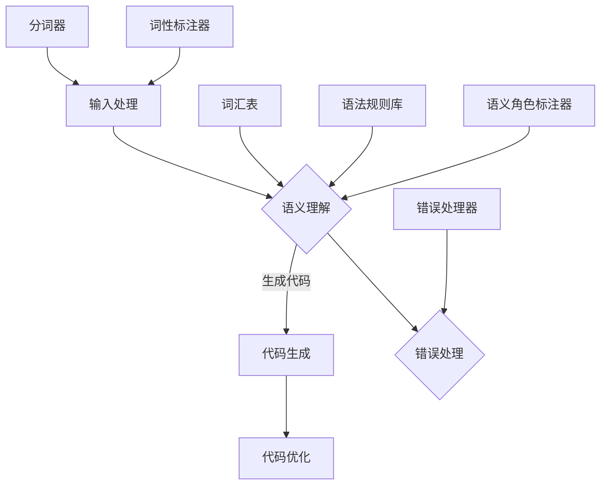

                 


### 文章标题：设计模式在提示词编程中的应用

---

### 关键词：
设计模式，提示词编程，自然语言处理，AI，软件工程

---

### 摘要：
本文旨在探讨设计模式在提示词编程中的应用，分析如何利用设计模式提高代码的可复用性、可维护性和可扩展性。通过详细解析创建型、结构型和行为型设计模式，本文将展示设计模式在自然语言处理和AI任务中的实际应用，并提供一个完整的实战项目实例，以帮助读者深入理解并实践设计模式在提示词编程中的重要性。

---

## 目录

### 第1章：设计模式概述与提示词编程

#### 1.1 设计模式的定义与重要性

#### 1.2 提示词编程基础

#### 1.3 设计模式与提示词编程的联系

### 第2章：设计模式在提示词编程中的应用原则

#### 2.1 S.O.L.I.D原则

#### 2.2 设计模式的复用性

#### 2.3 提示词编程中的设计模式实践

### 第3章：创建型设计模式

#### 3.1 单例模式

##### 3.1.1 单例模式的原理与实现

##### 3.1.2 单例模式在提示词编程中的应用

#### 3.2 工厂方法模式

##### 3.2.1 工厂方法模式的原理与实现

##### 3.2.2 工厂方法模式在提示词编程中的应用

### 第4章：结构型设计模式

#### 4.1 适配器模式

##### 4.1.1 适配器模式的原理与实现

##### 4.1.2 适配器模式在提示词编程中的应用

#### 4.2 桥接模式

##### 4.2.1 桥接模式的原理与实现

##### 4.2.2 桥接模式在提示词编程中的应用

### 第5章：行为型设计模式

#### 4.3 职责链模式

##### 4.3.1 职责链模式的原理与实现

##### 4.3.2 职责链模式在提示词编程中的应用

#### 4.4 观察者模式

##### 4.4.1 观察者模式的原理与实现

##### 4.4.2 观察者模式在提示词编程中的应用

### 第6章：设计模式在自然语言处理中的应用

#### 6.1 提示词编程中的NLP基础

#### 6.2 设计模式在NLP任务中的应用

### 第7章：设计模式在提示词编程项目中的应用

#### 7.1 提示词编程项目概述

#### 7.2 设计模式在项目中的具体应用

#### 7.3 项目实战：设计模式在提示词编程中的实现

### 第8章：设计模式在提示词编程中的进阶思考

#### 8.1 设计模式的扩展与演变

#### 8.2 提示词编程中的创新设计模式

#### 8.3 未来设计模式的发展趋势

### 附录：参考资料与扩展阅读

#### 9.1 设计模式与深度学习

#### 9.2 设计模式与AI应用

#### 9.3 设计模式研究趋势与展望

---

### 第1章：设计模式概述与提示词编程

#### 1.1 设计模式的定义与重要性

设计模式是软件开发中的经验总结，是一套被反复使用、经过分类的、代码实现的基本解决方案。设计模式旨在解决软件设计中的常见问题，提高代码的可读性、可维护性和可扩展性。常见的创建型、结构型和行为型设计模式在软件开发中有着广泛的应用。

在提示词编程中，设计模式的重要性体现在以下几个方面：

1. **提高代码复用性**：设计模式提供了可复用的解决方案，可以减少代码重复，提高开发效率。
2. **提高代码可维护性**：设计模式通过良好的抽象和封装，使得代码模块化，降低了系统的复杂性，便于后续的维护和升级。
3. **提高代码可扩展性**：设计模式提供了灵活的扩展机制，使得系统在需求变化时能够更容易地进行扩展和修改。

#### 1.2 提示词编程基础

提示词编程是一种利用人工智能技术，通过自然语言处理和机器学习算法，实现自动生成代码的技术。其基本流程包括：

1. **输入处理**：接收用户输入的提示词，对提示词进行解析和预处理。
2. **语法分析**：对预处理后的提示词进行语法分析，生成抽象语法树（AST）。
3. **代码生成**：根据AST，利用模板和代码生成器，生成目标代码。
4. **代码优化**：对生成的代码进行优化，提高代码的执行效率和可读性。

提示词编程的关键技术包括自然语言处理、语法分析、代码生成和代码优化。这些技术共同作用，实现了从自然语言输入到代码输出的过程。

#### 1.3 设计模式与提示词编程的联系

设计模式在提示词编程中的应用主要体现在以下几个方面：

1. **模块化设计**：通过设计模式，可以将提示词编程系统划分为多个模块，每个模块实现特定的功能，从而提高系统的可维护性和可扩展性。
2. **代码复用**：设计模式提供了可复用的代码模板和组件，可以在不同的提示词编程任务中复用，减少重复开发的工作量。
3. **代码生成优化**：设计模式可以帮助优化代码生成过程，提高代码生成的效率和质量。

总之，设计模式在提示词编程中起到了至关重要的作用，它不仅提高了代码的复用性、可维护性和可扩展性，还为提示词编程系统的设计提供了良好的指导。在接下来的章节中，我们将详细探讨不同类型的设计模式在提示词编程中的应用。

---

### 第2章：设计模式在提示词编程中的应用原则

#### 2.1 S.O.L.I.D原则

S.O.L.I.D原则是一组指导软件设计的重要原则，这些原则可以帮助开发人员编写出更加可维护、可扩展的代码。S.O.L.I.D原则包括：

1. **单一职责原则（Single Responsibility Principle, SRP）**：一个类应该只负责一项功能，这样有助于提高代码的可维护性和可扩展性。
2. **开放封闭原则（Open/Closed Principle, OCP）**：软件实体（类、模块、函数等）应该对扩展开放，对修改封闭。这意味着在软件设计时，我们应该尽量避免直接修改已有的代码，而是通过扩展来实现新的功能。
3. **里氏替换原则（Liskov Substitution Principle, LSP）**：任何可替换基类的地方，都可以用子类来替换。这条原则保证了子类能够继承基类的行为，并且不会破坏系统的正常运作。
4. **接口隔离原则（Interface Segregation Principle, ISP）**：不应该强迫用户依赖他们不用的接口。这意味着应该为不同的功能提供独立的接口，避免接口过于臃肿。
5. **依赖倒置原则（Dependency Inversion Principle, DIP）**：高层模块不应该依赖于低层模块，二者都应依赖于抽象。抽象不应依赖于细节，细节应依赖于抽象。

在提示词编程中，遵循S.O.L.I.D原则可以帮助我们编写出更加模块化、可复用的代码。例如，通过单一职责原则，我们可以将提示词编程系统划分为多个独立的模块，每个模块负责处理输入处理、语法分析、代码生成等特定功能。这样不仅提高了代码的可维护性，还使得系统更加灵活，便于后续的扩展。

#### 2.2 设计模式的复用性

设计模式的一大优点是它们具有高度的复用性。在设计模式中，许多模式都是基于通用的设计原则和最佳实践构建的，这使得它们可以在不同的项目和场景中复用。

在提示词编程中，设计模式的复用性尤为重要。例如，单例模式可以用于确保系统中的某些关键组件（如数据库连接、配置管理器等）只有一个实例。工厂方法模式可以用于生成不同类型的代码生成器，使得代码生成过程更加灵活。适配器模式可以用于将非标准化的接口转换为标准化的接口，从而提高系统的兼容性。

通过复用设计模式，开发人员可以避免重复编写相同的代码，从而提高开发效率。同时，复用的设计模式也可以提高代码的可读性和一致性，使得系统更加易于理解和维护。

#### 2.3 提示词编程中的设计模式实践

在提示词编程中，设计模式的实践需要考虑以下几个方面：

1. **模块化设计**：使用设计模式将系统划分为多个模块，每个模块实现特定的功能。例如，使用工厂方法模式创建不同的代码生成器模块，使用适配器模式处理不同类型的输入。
2. **代码复用**：通过设计模式，实现通用功能的代码可以复用。例如，使用单例模式管理共享资源，使用职责链模式处理复杂的请求流程。
3. **优化代码生成过程**：设计模式可以帮助优化代码生成过程，提高代码生成器的性能和灵活性。例如，使用桥接模式分离代码生成器的实现和接口，使得代码生成器可以更灵活地适应不同的需求。

总之，设计模式在提示词编程中的应用，可以提高系统的可维护性、可扩展性和代码复用性。通过遵循S.O.L.I.D原则和实践设计模式，开发人员可以编写出更加高效、灵活和可靠的提示词编程系统。

---

### 第3章：创建型设计模式

创建型设计模式关注对象的创建过程，提供了一系列创建对象的规范和最佳实践。在提示词编程中，创建型设计模式可以帮助我们更好地管理对象的生命周期，提高代码的可复用性和可维护性。本章节将详细介绍单例模式和工厂方法模式，并探讨它们在提示词编程中的应用。

#### 3.1 单例模式

单例模式是一种确保一个类只有一个实例，并提供一个全局访问点的模式。在提示词编程中，单例模式常用于管理共享资源，如数据库连接、配置管理器和日志记录器等。

##### 3.1.1 单例模式的原理与实现

单例模式的原理很简单：确保一个类仅有一个实例，并提供一个全局访问点。为了实现这一点，通常需要以下步骤：

1. **私有构造函数**：私有构造函数防止其他类直接实例化单例类。
2. **静态变量**：使用一个静态变量来存储单例实例。
3. **静态方法**：提供一个静态方法用于获取单例实例。

以下是一个简单的单例模式实现示例：

```java
public class DatabaseConnector {
    private static DatabaseConnector instance;
    
    private DatabaseConnector() {
        // 私有构造函数
    }
    
    public static synchronized DatabaseConnector getInstance() {
        if (instance == null) {
            instance = new DatabaseConnector();
        }
        return instance;
    }
}
```

在上面的示例中，私有构造函数确保了 `DatabaseConnector` 类不能被其他类直接实例化。`getInstance()` 方法用于获取单例实例，如果实例尚未创建，则会创建一个新的实例。

##### 3.1.2 单例模式在提示词编程中的应用

在提示词编程中，单例模式可以用于管理共享资源，确保资源的唯一性和一致性。例如，可以使用单例模式管理数据库连接，防止多个实例同时访问数据库导致的数据不一致问题。

以下是一个使用单例模式管理数据库连接的示例：

```java
public class DatabaseConnector {
    private static DatabaseConnector instance;
    private Connection connection;
    
    private DatabaseConnector() {
        // 私有构造函数
        try {
            connection = DriverManager.getConnection("jdbc:mysql://localhost:3306/mydb", "user", "password");
        } catch (SQLException e) {
            e.printStackTrace();
        }
    }
    
    public static DatabaseConnector getInstance() {
        if (instance == null) {
            instance = new DatabaseConnector();
        }
        return instance;
    }
    
    public Connection getConnection() {
        return connection;
    }
}
```

在这个示例中，`DatabaseConnector` 类通过单例模式确保只有一个数据库连接实例。每次调用 `getInstance()` 方法时，如果实例尚未创建，则会创建一个新的实例，并返回该实例的连接。

#### 3.2 工厂方法模式

工厂方法模式是一种用于创建对象的方法，它将对象的创建过程封装在一个单独的类中。在提示词编程中，工厂方法模式可以帮助我们动态地创建对象，而不需要直接使用构造函数。

##### 3.2.1 工厂方法模式的原理与实现

工厂方法模式的原理是将对象的创建过程封装在父类中，然后通过子类来实现具体的创建逻辑。具体实现步骤如下：

1. **定义一个创建对象的接口**：定义一个用于创建对象的接口，该接口包含一个工厂方法。
2. **实现具体的工厂类**：创建多个具体的工厂类，每个工厂类实现接口，并重写工厂方法以创建特定的对象。
3. **客户端使用工厂类**：客户端通过工厂类来创建对象，而不需要直接使用构造函数。

以下是一个简单的工厂方法模式实现示例：

```java
public interface Product {
    void use();
}

public class ConcreteProductA implements Product {
    public void use() {
        System.out.println("Using ConcreteProductA");
    }
}

public class ConcreteProductB implements Product {
    public void use() {
        System.out.println("Using ConcreteProductB");
    }
}

public abstract class Creator {
    public abstract Product createProduct();
}

public class ConcreteCreatorA extends Creator {
    public Product createProduct() {
        return new ConcreteProductA();
    }
}

public class ConcreteCreatorB extends Creator {
    public Product createProduct() {
        return new ConcreteProductB();
    }
}
```

在上面的示例中，`Product` 接口定义了一个 `use()` 方法，`ConcreteProductA` 和 `ConcreteProductB` 类实现了该接口。`Creator` 抽象类定义了一个工厂方法 `createProduct()`，`ConcreteCreatorA` 和 `ConcreteCreatorB` 类分别实现了该抽象类，并重写了 `createProduct()` 方法以创建特定的对象。

##### 3.2.2 工厂方法模式在提示词编程中的应用

在提示词编程中，工厂方法模式可以帮助我们动态地创建不同的代码生成器，以满足不同的编程需求。例如，我们可以创建多个代码生成器类，每个类负责生成不同类型的代码。通过工厂方法模式，我们可以方便地切换代码生成器，而不需要直接修改代码。

以下是一个使用工厂方法模式创建代码生成器的示例：

```java
public interface CodeGenerator {
    void generateCode(String template);
}

public class JavaCodeGenerator implements CodeGenerator {
    public void generateCode(String template) {
        System.out.println("Generating Java code using template: " + template);
    }
}

public class PythonCodeGenerator implements CodeGenerator {
    public void generateCode(String template) {
        System.out.println("Generating Python code using template: " + template);
    }
}

public class CodeGeneratorFactory {
    public CodeGenerator createCodeGenerator(String type) {
        if ("java".equals(type)) {
            return new JavaCodeGenerator();
        } else if ("python".equals(type)) {
            return new PythonCodeGenerator();
        } else {
            throw new IllegalArgumentException("Unsupported code generator type: " + type);
        }
    }
}
```

在这个示例中，`CodeGenerator` 接口定义了一个 `generateCode()` 方法，`JavaCodeGenerator` 和 `PythonCodeGenerator` 类分别实现了该接口。`CodeGeneratorFactory` 类是一个工厂类，它根据传入的类型参数来创建对应的代码生成器实例。

通过工厂方法模式，我们可以方便地创建和管理不同的代码生成器，例如：

```java
CodeGeneratorFactory factory = new CodeGeneratorFactory();
CodeGenerator javaGenerator = factory.createCodeGenerator("java");
javaGenerator.generateCode("Hello, World!");

CodeGenerator pythonGenerator = factory.createCodeGenerator("python");
pythonGenerator.generateCode("print('Hello, World!');");
```

在这个示例中，我们首先创建了 `CodeGeneratorFactory` 实例，然后使用该工厂实例创建不同的代码生成器，并调用它们的 `generateCode()` 方法生成代码。

总之，创建型设计模式在提示词编程中具有重要作用，可以帮助我们更好地管理对象的创建过程，提高代码的可复用性和可维护性。通过单例模式和工厂方法模式，我们可以实现模块化的代码设计，使得系统更加灵活和易于扩展。

---

### 第4章：结构型设计模式

结构型设计模式主要关注类与类之间的关系和组合，提供了一系列用于构建复杂系统的设计方案。在提示词编程中，结构型设计模式可以帮助我们更好地组织代码，提高系统的可扩展性和可维护性。本章节将详细介绍适配器模式和桥接模式，并探讨它们在提示词编程中的应用。

#### 4.1 适配器模式

适配器模式是一种用于将一个类的接口转换成客户希望的另一个接口的架构模式。适配器模式使得原本由于接口不兼容而无法在一起工作的类可以协同工作。

##### 4.1.1 适配器模式的原理与实现

适配器模式由三个主要部分组成：目标接口（Target）、适配者类（Adaptee）和适配器类（Adapter）。

1. **目标接口（Target）**：定义客户类期望的接口。
2. **适配者类（Adaptee）**：包含被适配的类所实现的方法。
3. **适配器类（Adapter）**：将适配者类的方法转换为与目标接口相符合的方法。

以下是一个简单的适配器模式实现示例：

```java
// 目标接口
public interface Target {
    void request();
}

// 适配者类
public class Adaptee {
    public void specificRequest() {
        System.out.println("Specific request from Adaptee");
    }
}

// 适配器类
public class Adapter implements Target {
    private Adaptee adaptee;

    public Adapter(Adaptee adaptee) {
        this.adaptee = adaptee;
    }

    public void request() {
        adaptee.specificRequest();
    }
}
```

在这个示例中，`Target` 接口定义了一个 `request()` 方法，`Adaptee` 类实现了该方法。`Adapter` 类实现了 `Target` 接口，并在内部持有 `Adaptee` 类的实例。通过调用 `specificRequest()` 方法，适配器将适配者的方法转换为与目标接口相符合的方法。

##### 4.1.2 适配器模式在提示词编程中的应用

在提示词编程中，适配器模式可以用于将非标准化的接口转换为标准化的接口，从而提高系统的兼容性。例如，我们可以使用适配器模式将不同类型的代码生成器统一成一个标准的接口，使得客户可以无缝地使用不同的代码生成器。

以下是一个使用适配器模式处理不同类型代码生成器的示例：

```java
// 目标接口
public interface CodeGenerator {
    void generateCode();
}

// 适配者类
public class JavaCodeGenerator {
    public void generateJavaCode() {
        System.out.println("Generating Java code");
    }
}

// 适配器类
public class PythonCodeGeneratorAdapter implements CodeGenerator {
    private JavaCodeGenerator javaCodeGenerator;

    public PythonCodeGeneratorAdapter(JavaCodeGenerator javaCodeGenerator) {
        this.javaCodeGenerator = javaCodeGenerator;
    }

    public void generateCode() {
        javaCodeGenerator.generateJavaCode();
    }
}
```

在这个示例中，`CodeGenerator` 接口定义了一个 `generateCode()` 方法，`JavaCodeGenerator` 类实现了该方法。`PythonCodeGeneratorAdapter` 类实现了 `CodeGenerator` 接口，并在内部持有 `JavaCodeGenerator` 类的实例。通过调用 `generateJavaCode()` 方法，适配器将 Java 代码生成器的方法转换为与目标接口相符合的方法。

通过适配器模式，我们可以将不同类型的代码生成器统一成一个标准的接口，使得客户可以无缝地使用不同的代码生成器：

```java
CodeGenerator javaCodeGenerator = new JavaCodeGenerator();
CodeGenerator pythonCodeGenerator = new PythonCodeGeneratorAdapter(javaCodeGenerator);

javaCodeGenerator.generateCode();  // 输出：Generating Java code
pythonCodeGenerator.generateCode();  // 输出：Generating Java code
```

在这个示例中，我们首先创建了 `JavaCodeGenerator` 实例和 `PythonCodeGeneratorAdapter` 实例，然后分别调用它们的 `generateCode()` 方法生成代码。

#### 4.2 桥接模式

桥接模式是一种用于将抽象部分与实现部分分离，使它们可以独立变化的架构模式。桥接模式通过将抽象部分和实现部分解耦，使得系统更加灵活和可扩展。

##### 4.2.1 桥接模式的原理与实现

桥接模式由两个主要部分组成：抽象部分（Abstraction）和实现部分（Implementor）。

1. **抽象部分（Abstraction）**：定义抽象类的接口，并包含一个指向实现部分的引用。
2. **实现部分（Implementor）**：定义实现类的接口，并包含具体的行为。

以下是一个简单的桥接模式实现示例：

```java
// 抽象部分
public abstract class Abstraction {
    protected Implementor implementor;

    public Abstraction(Implementor implementor) {
        this.implementor = implementor;
    }

    public void operation() {
        implementor.operationImpl();
    }
}

// 实现部分
public interface Implementor {
    void operationImpl();
}

public class ConcreteImplementorA implements Implementor {
    public void operationImpl() {
        System.out.println("ConcreteImplementorA operation");
    }
}

public class ConcreteImplementorB implements Implementor {
    public void operationImpl() {
        System.out.println("ConcreteImplementorB operation");
    }
}
```

在这个示例中，`Abstraction` 类定义了一个抽象方法 `operation()`，并包含一个指向 `Implementor` 接口的引用。`ConcreteImplementorA` 和 `ConcreteImplementorB` 类实现了 `Implementor` 接口，并提供了具体的实现。

`Abstraction` 类的一个具体实现如下：

```java
public class RefinedAbstraction extends Abstraction {
    public RefinedAbstraction(Implementor implementor) {
        super(implementor);
    }

    public void refinedOperation() {
        implementor.operationImpl();
        // 添加额外的操作
    }
}
```

在这个示例中，`RefinedAbstraction` 类扩展了 `Abstraction` 类，并添加了一个额外的操作 `refinedOperation()`。

##### 4.2.2 桥接模式在提示词编程中的应用

在提示词编程中，桥接模式可以帮助我们分离代码生成器的抽象部分和实现部分，使得系统更加灵活和可扩展。例如，我们可以使用桥接模式将代码生成器的抽象部分（如语法分析器、代码优化器等）与实现部分（如不同的编程语言实现）分离。

以下是一个使用桥接模式分离代码生成器的抽象部分和实现部分的示例：

```java
// 抽象部分
public abstract class CodeGenerator {
    public abstract void generateCode();

    public void optimizeCode() {
        // 优化代码
    }
}

// 实现部分
public class JavaCodeGenerator extends CodeGenerator {
    public void generateCode() {
        // 生成 Java 代码
    }
}

public class PythonCodeGenerator extends CodeGenerator {
    public void generateCode() {
        // 生成 Python 代码
    }
}
```

在这个示例中，`CodeGenerator` 类定义了一个抽象方法 `generateCode()`，并包含一个优化代码的方法 `optimizeCode()`。`JavaCodeGenerator` 和 `PythonCodeGenerator` 类分别实现了 `CodeGenerator` 接口，并提供了具体的实现。

通过桥接模式，我们可以将代码生成器的抽象部分和实现部分分离，使得系统更加灵活和可扩展。例如，我们可以添加新的代码生成器实现，而不会影响到系统的其他部分。

```java
CodeGenerator javaCodeGenerator = new JavaCodeGenerator();
CodeGenerator pythonCodeGenerator = new PythonCodeGenerator();

javaCodeGenerator.generateCode();  // 输出：生成 Java 代码
pythonCodeGenerator.generateCode();  // 输出：生成 Python 代码
```

在这个示例中，我们首先创建了 `JavaCodeGenerator` 实例和 `PythonCodeGenerator` 实例，然后分别调用它们的 `generateCode()` 方法生成代码。

总之，结构型设计模式在提示词编程中具有重要作用，可以帮助我们更好地组织代码，提高系统的可扩展性和可维护性。通过适配器模式和桥接模式，我们可以实现模块化的代码设计，使得系统更加灵活和易于扩展。

---

### 第5章：行为型设计模式

行为型设计模式主要关注对象之间的交互和协作，提供了一系列用于描述对象之间交互的解决方案。在提示词编程中，行为型设计模式可以帮助我们更好地处理对象之间的复杂关系，提高系统的可维护性和可扩展性。本章节将详细介绍职责链模式和观察者模式，并探讨它们在提示词编程中的应用。

#### 4.3 职责链模式

职责链模式是一种用于将请求的发送者和接收者解耦，使多个对象都有机会处理请求的架构模式。在职责链模式中，多个对象形成一个链，请求沿着链传递，直到找到一个能处理该请求的对象。

##### 4.3.1 职责链模式的原理与实现

职责链模式由四个主要部分组成：处理者接口（Handler）、具体处理者（ConcreteHandler）、请求（Request）和处理者链（HandlerChain）。

1. **处理者接口（Handler）**：定义处理请求的方法。
2. **具体处理者（ConcreteHandler）**：实现处理者接口，处理特定的请求。
3. **请求（Request）**：封装请求信息。
4. **处理者链（HandlerChain）**：管理处理者链，负责将请求沿着链传递。

以下是一个简单的职责链模式实现示例：

```java
// 处理者接口
public interface Handler {
    void handleRequest(Request request);
}

// 具体处理者
public class ConcreteHandlerA implements Handler {
    public void handleRequest(Request request) {
        if (request.getType() == Type.A) {
            System.out.println("ConcreteHandlerA handles request of type A");
        } else {
            successor.handleRequest(request);
        }
    }
    
    private Handler successor;

    public void setSuccessor(Handler successor) {
        this.successor = successor;
    }
}

public class ConcreteHandlerB implements Handler {
    public void handleRequest(Request request) {
        if (request.getType() == Type.B) {
            System.out.println("ConcreteHandlerB handles request of type B");
        } else {
            successor.handleRequest(request);
        }
    }
    
    private Handler successor;

    public void setSuccessor(Handler successor) {
        this.successor = successor;
    }
}

// 请求
public class Request {
    private Type type;

    public Request(Type type) {
        this.type = type;
    }

    public Type getType() {
        return type;
    }
}

// 处理者链
public class HandlerChain {
    private Handler first;

    public void setFirst(Handler first) {
        this.first = first;
    }

    public void handleRequest(Request request) {
        first.handleRequest(request);
    }
}
```

在这个示例中，`Handler` 接口定义了一个 `handleRequest()` 方法，`ConcreteHandlerA` 和 `ConcreteHandlerB` 类实现了该接口，并处理特定的请求。`HandlerChain` 类管理处理者链，负责将请求沿着链传递。

以下是一个使用职责链模式处理请求的示例：

```java
HandlerChain chain = new HandlerChain();
chain.setFirst(new ConcreteHandlerA());
ConcreteHandlerB handlerB = new ConcreteHandlerB();
handlerB.setSuccessor(chain.getFirst());
chain.getFirst().setSuccessor(handlerB);

Request requestA = new Request(Type.A);
Request requestB = new Request(Type.B);
Request requestC = new Request(Type.C);

chain.handleRequest(requestA);  // 输出：ConcreteHandlerA handles request of type A
chain.handleRequest(requestB);  // 输出：ConcreteHandlerB handles request of type B
chain.handleRequest(requestC);  // 输出：ConcreteHandlerA handles request of type C
```

在这个示例中，我们首先创建了处理者链，将 `ConcreteHandlerA` 和 `ConcreteHandlerB` 添加到链中。然后，我们创建三个请求并传递给处理者链处理。

##### 4.3.2 职责链模式在提示词编程中的应用

在提示词编程中，职责链模式可以用于处理复杂的请求流程，例如语法分析、代码生成和错误处理等。通过职责链模式，我们可以将请求的发送者和接收者解耦，使得系统更加灵活和可扩展。

以下是一个使用职责链模式处理语法分析的示例：

```java
public class GrammarAnalyzer {
    private HandlerChain grammarChain;

    public GrammarAnalyzer() {
        grammarChain = new HandlerChain();
        grammarChain.setFirst(new SimpleGrammarHandler());
        grammarChain.getFirst().setSuccessor(new ComplexGrammarHandler());
    }

    public void analyzeGrammar(String code) {
        grammarChain.handleRequest(new GrammarRequest(code));
    }
}

public class SimpleGrammarHandler implements Handler {
    public void handleRequest(Request request) {
        System.out.println("Handling simple grammar");
    }
}

public class ComplexGrammarHandler implements Handler {
    public void handleRequest(Request request) {
        System.out.println("Handling complex grammar");
    }
}

public class GrammarRequest {
    private String code;

    public GrammarRequest(String code) {
        this.code = code;
    }

    public String getCode() {
        return code;
    }
}
```

在这个示例中，`GrammarAnalyzer` 类负责创建处理者链，并将语法分析请求传递给处理者链处理。通过职责链模式，我们可以方便地添加新的语法分析处理者，而不会影响到系统的其他部分。

```java
GrammarAnalyzer analyzer = new GrammarAnalyzer();
analyzer.analyzeGrammar("int x = 1;");  // 输出：Handling simple grammar
analyzer.analyzeGrammar("class MyClass { int x = 1; }");  // 输出：Handling simple grammar
analyzer.analyzeGrammar("def my_function(x): return x + 1;");  // 输出：Handling complex grammar
```

在这个示例中，我们首先创建了 `GrammarAnalyzer` 实例，然后调用 `analyzeGrammar()` 方法分析不同的代码。

#### 4.4 观察者模式

观察者模式是一种用于一对多关系的架构模式，当一个对象的状态发生变化时，它会自动通知所有依赖于它的对象。在提示词编程中，观察者模式可以帮助我们实现事件驱动编程，提高系统的响应性和可扩展性。

##### 4.4.1 观察者模式的原理与实现

观察者模式由三个主要部分组成：观察者（Observer）、被观察者（Subject）和主题（Subject）。

1. **观察者（Observer）**：实现观察者接口，定义更新方法，用于处理被观察者的状态变化。
2. **被观察者（Subject）**：定义被观察者接口，包含添加、删除和通知观察者的方法。
3. **主题（Subject）**：实现被观察者接口，维护一个观察者列表，并在状态变化时通知观察者。

以下是一个简单的观察者模式实现示例：

```java
// 观察者接口
public interface Observer {
    void update(Subject subject);
}

// 被观察者接口
public interface Subject {
    void addObserver(Observer observer);
    void removeObserver(Observer observer);
    void notifyObservers();
}

// 观察者类
public class TemperatureObserver implements Observer {
    public void update(Subject subject) {
        System.out.println("Temperature has changed: " + subject.getState());
    }
}

// 被观察者类
public class TemperatureSensor implements Subject {
    private List<Observer> observers;
    private int state;

    public TemperatureSensor() {
        observers = new ArrayList<>();
    }

    public void addObserver(Observer observer) {
        observers.add(observer);
    }

    public void removeObserver(Observer observer) {
        observers.remove(observer);
    }

    public void notifyObservers() {
        for (Observer observer : observers) {
            observer.update(this);
        }
    }

    public void setState(int state) {
        this.state = state;
        notifyObservers();
    }

    public int getState() {
        return state;
    }
}
```

在这个示例中，`Observer` 接口定义了一个 `update()` 方法，用于处理被观察者的状态变化。`Subject` 接口定义了添加、删除和通知观察者的方法。`TemperatureObserver` 类实现了 `Observer` 接口，`TemperatureSensor` 类实现了 `Subject` 接口。

以下是一个使用观察者模式处理温度传感器的示例：

```java
TemperatureSensor sensor = new TemperatureSensor();
TemperatureObserver observer = new TemperatureObserver();

sensor.addObserver(observer);

sensor.setState(25);  // 输出：Temperature has changed: 25
sensor.setState(30);  // 输出：Temperature has changed: 30
sensor.removeObserver(observer);
sensor.setState(35);  // 无输出
```

在这个示例中，我们首先创建了 `TemperatureSensor` 和 `TemperatureObserver` 实例，并将观察者添加到被观察者中。然后，我们修改传感器的状态，观察者会收到通知并更新状态。

##### 4.4.2 观察者模式在提示词编程中的应用

在提示词编程中，观察者模式可以用于处理事件驱动编程，例如语法分析、代码生成和错误处理等。通过观察者模式，我们可以实现更灵活的事件响应和处理机制。

以下是一个使用观察者模式处理语法分析的示例：

```java
public class CodeAnalyzer {
    private List<Observer> observers;

    public CodeAnalyzer() {
        observers = new ArrayList<>();
    }

    public void addObserver(Observer observer) {
        observers.add(observer);
    }

    public void removeObserver(Observer observer) {
        observers.remove(observer);
    }

    public void analyzeCode(String code) {
        // 进行语法分析
        if (isSyntaxError()) {
            notifyObservers();
        }
    }

    private void notifyObservers() {
        for (Observer observer : observers) {
            observer.update(this);
        }
    }
}

public class SyntaxErrorObserver implements Observer {
    public void update(CodeAnalyzer analyzer) {
        System.out.println("Syntax error detected in code");
    }
}
```

在这个示例中，`CodeAnalyzer` 类负责语法分析，并在发现语法错误时通知观察者。`SyntaxErrorObserver` 类实现了 `Observer` 接口，并在收到通知时更新状态。

```java
CodeAnalyzer analyzer = new CodeAnalyzer();
SyntaxErrorObserver observer = new SyntaxErrorObserver();

analyzer.addObserver(observer);
analyzer.analyzeCode("int x = 1;");  // 无输出
analyzer.analyzeCode("int x = 1, y = 2;");  // 输出：Syntax error detected in code
```

在这个示例中，我们首先创建了 `CodeAnalyzer` 和 `SyntaxErrorObserver` 实例，并将观察者添加到分析器中。然后，我们调用 `analyzeCode()` 方法分析不同的代码。

总之，行为型设计模式在提示词编程中具有重要作用，可以帮助我们更好地处理对象之间的交互和协作。通过职责链模式和观察者模式，我们可以实现模块化的事件驱动编程，提高系统的响应性和可扩展性。

---

### 第6章：设计模式在自然语言处理中的应用

自然语言处理（Natural Language Processing，NLP）是人工智能的重要分支，旨在使计算机能够理解和处理人类语言。在提示词编程中，设计模式发挥着至关重要的作用，帮助开发者构建高效的NLP系统，提高系统的可维护性和可扩展性。本章节将探讨设计模式在NLP任务中的应用，包括常见设计模式的使用以及NLP任务的实现。

#### 6.1 提示词编程中的NLP基础

提示词编程是NLP的一个重要应用领域，它通过接收用户输入的提示词，利用NLP技术自动生成相应的代码。NLP任务通常包括以下步骤：

1. **输入处理**：接收用户输入的提示词，进行预处理，如去除停用词、分词、词性标注等。
2. **语义理解**：理解提示词的语义，将其转换为结构化的数据，如语法树或语义角色标注。
3. **代码生成**：根据语义理解的结果，生成符合语法和语义要求的代码。
4. **代码优化**：对生成的代码进行优化，提高代码的执行效率和可读性。

在这些步骤中，设计模式可以帮助我们更好地组织代码，提高系统的可维护性和可扩展性。

#### 6.2 设计模式在NLP任务中的应用

设计模式在NLP任务中的应用主要体现在以下几个方面：

1. **模块化设计**：通过模块化设计，可以将NLP系统划分为多个功能模块，每个模块负责特定的任务，如分词、词性标注、语义理解等。这种模块化设计不仅提高了系统的可维护性，还使得系统更加灵活和可扩展。

2. **代码复用**：设计模式提供了可复用的解决方案，如工厂方法模式用于创建不同的组件，适配器模式用于适配不同的数据源和接口，单例模式用于管理共享资源等。通过复用设计模式，可以减少代码重复，提高开发效率。

3. **动态扩展**：设计模式支持系统的动态扩展，如桥接模式可以将新的实现与抽象部分解耦，观察者模式可以实现事件驱动的动态扩展。这些模式使得系统在需求变化时能够更容易地进行扩展和修改。

以下是一些设计模式在NLP任务中的应用示例：

1. **单例模式**：用于管理共享资源，如词汇表、语法规则库等。通过单例模式，可以确保系统中只有一个实例，避免资源浪费和并发问题。

2. **工厂方法模式**：用于创建不同的NLP组件，如分词器、词性标注器、语义角色标注器等。通过工厂方法模式，可以动态地创建和替换组件，提高系统的灵活性和可扩展性。

3. **适配器模式**：用于适配不同的数据源和接口，如将文本数据转换为结构化数据、将不同格式的数据转换为统一格式等。适配器模式使得系统能够兼容各种数据源和接口，提高系统的兼容性和可维护性。

4. **桥接模式**：用于将NLP系统的抽象部分与实现部分分离，如将不同的自然语言处理算法与接口分离。桥接模式使得系统在需求变化时能够更容易地进行扩展和修改。

5. **观察者模式**：用于实现事件驱动的NLP系统，如处理语法错误、代码生成中的事件等。观察者模式使得系统能够及时响应事件，提高系统的响应性和可扩展性。

通过以上设计模式，我们可以构建一个高效、灵活和可扩展的NLP系统。以下是一个简单的NLP系统架构示例：



在这个示例中，输入处理模块使用分词器、词性标注器和语义角色标注器处理输入文本，语义理解模块使用词汇表和语法规则库进行语义理解，代码生成模块生成代码，并使用错误处理器处理可能的错误。通过设计模式，这些模块可以灵活地组合和扩展，以适应不同的NLP任务。

总之，设计模式在自然语言处理中的应用，有助于构建高效、灵活和可扩展的NLP系统。通过合理地使用设计模式，我们可以提高NLP系统的可维护性和可扩展性，满足不断变化的需求。

---

### 第7章：设计模式在提示词编程项目中的应用

#### 7.1 提示词编程项目概述

提示词编程项目旨在利用人工智能技术，通过自然语言处理和机器学习算法，实现自动生成代码的功能。该项目的目标是为开发人员提供一种高效的代码生成工具，提高开发效率，减少重复性工作。在提示词编程项目中，设计模式起到了至关重要的作用，帮助我们构建一个高效、灵活和可扩展的系统。

项目的主要功能模块包括：

1. **输入处理**：接收用户输入的提示词，进行预处理，如分词、词性标注等。
2. **语法分析**：对预处理后的提示词进行语法分析，生成抽象语法树（AST）。
3. **代码生成**：根据AST，利用模板和代码生成器，生成目标代码。
4. **代码优化**：对生成的代码进行优化，提高代码的执行效率和可读性。

在项目的实现过程中，我们采用了多种设计模式，如单例模式、工厂方法模式、适配器模式、桥接模式和观察者模式等。这些设计模式不仅提高了代码的可维护性和可扩展性，还使得系统能够更好地适应不同的需求。

#### 7.2 设计模式在项目中的具体应用

在提示词编程项目中，设计模式的应用贯穿了整个开发过程，下面我们将详细探讨每种设计模式在项目中的具体应用。

1. **单例模式**：单例模式用于管理共享资源，如数据库连接、配置管理器和日志记录器等。通过单例模式，我们可以确保系统中只有一个实例，避免资源浪费和并发问题。例如，在项目中，我们使用单例模式管理数据库连接，确保在多个请求同时访问数据库时，能够保持一致性和效率。

2. **工厂方法模式**：工厂方法模式用于创建不同的NLP组件，如分词器、词性标注器、语义角色标注器等。通过工厂方法模式，我们可以动态地创建和替换组件，提高系统的灵活性和可扩展性。例如，在项目中，我们使用工厂方法模式创建不同的分词器，根据输入文本的格式和需求，选择合适的分词器进行分词。

3. **适配器模式**：适配器模式用于适配不同的数据源和接口，如将文本数据转换为结构化数据、将不同格式的数据转换为统一格式等。适配器模式使得系统能够兼容各种数据源和接口，提高系统的兼容性和可维护性。例如，在项目中，我们使用适配器模式将JSON格式的数据转换为内部使用的结构化数据，以便于进一步处理。

4. **桥接模式**：桥接模式用于将NLP系统的抽象部分与实现部分分离，如将不同的自然语言处理算法与接口分离。桥接模式使得系统在需求变化时能够更容易地进行扩展和修改。例如，在项目中，我们使用桥接模式将语法分析器与不同的语言模型分离，以便于后续增加新的语言模型。

5. **观察者模式**：观察者模式用于实现事件驱动的NLP系统，如处理语法错误、代码生成中的事件等。观察者模式使得系统能够及时响应事件，提高系统的响应性和可扩展性。例如，在项目中，我们使用观察者模式处理语法错误，当语法分析器检测到错误时，会通知错误处理器进行处理。

#### 7.3 项目实战：设计模式在提示词编程中的实现

为了更好地展示设计模式在提示词编程项目中的应用，我们以下将通过一个简单的示例来介绍如何使用设计模式实现一个基本的提示词编程系统。

**项目需求**：用户输入一个简单的提示词，如“打印1到10的数字”，系统需要自动生成对应的Python代码。

**实现步骤**：

1. **输入处理**：接收用户输入的提示词，进行预处理，如分词、词性标注等。这一步骤可以使用NLP库（如NLTK或spaCy）实现。

2. **语法分析**：对预处理后的提示词进行语法分析，生成抽象语法树（AST）。我们可以使用现有的语法分析工具（如PyAST或ASTOR）来生成AST。

3. **代码生成**：根据AST，利用模板和代码生成器，生成目标代码。我们可以定义一个代码生成器工厂，根据AST生成不同的代码模板。

4. **代码优化**：对生成的代码进行优化，提高代码的执行效率和可读性。我们可以使用代码优化工具（如PyOxidizer）进行代码优化。

以下是使用Python实现该项目的部分代码：

```python
# 输入处理
def preprocess_input(input_str):
    # 进行分词、词性标注等预处理
    tokens = tokenize(input_str)
    pos_tags = pos_tag(tokens)
    return pos_tags

# 语法分析
def parse_input(pos_tags):
    # 使用语法分析工具生成AST
    ast = generate_ast(pos_tags)
    return ast

# 代码生成
def generate_code(ast):
    # 根据AST生成代码模板
    code_template = generate_template(ast)
    code = render_template(code_template, ast)
    return code

# 代码优化
def optimize_code(code):
    # 使用代码优化工具进行代码优化
    optimized_code = optimize(code)
    return optimized_code

# 主函数
def main():
    input_str = "打印1到10的数字"
    pos_tags = preprocess_input(input_str)
    ast = parse_input(pos_tags)
    code = generate_code(ast)
    optimized_code = optimize_code(code)
    print(optimized_code)

if __name__ == "__main__":
    main()
```

在这个示例中，我们首先接收用户输入的提示词，进行预处理和语法分析，然后根据AST生成代码模板，最后对生成的代码进行优化。通过使用设计模式，我们可以将不同的功能模块化，提高代码的可维护性和可扩展性。

总之，设计模式在提示词编程项目中具有重要作用，通过合理地使用设计模式，我们可以构建一个高效、灵活和可扩展的代码生成系统。在实际项目中，设计模式可以帮助我们更好地组织代码，提高系统的可维护性和可扩展性，满足不断变化的需求。

---

### 第8章：设计模式在提示词编程中的进阶思考

设计模式在提示词编程中的应用不仅有助于提高代码的可维护性和可扩展性，还能够为开发人员提供更高效的编程体验。然而，随着技术的不断进步和需求的多样化，设计模式也在不断地发展和演变。本章节将探讨设计模式在提示词编程中的进阶思考，包括设计模式的扩展与演变、创新设计模式，以及未来设计模式的发展趋势。

#### 8.1 设计模式的扩展与演变

设计模式的发展是一个持续的过程，随着软件开发领域的新技术和新需求不断涌现，设计模式也在不断扩展和演变。以下是一些设计模式扩展与演变的例子：

1. **原型模式**：原型模式是一种通过复制现有对象来创建新对象的模式。在提示词编程中，原型模式可以用于快速生成类似的代码片段，提高开发效率。

2. **状态模式**：状态模式允许对象在其内部状态改变时改变行为。在提示词编程中，状态模式可以用于处理代码生成过程中的状态变化，如不同的编程语言、不同的代码风格等。

3. **策略模式**：策略模式允许在运行时选择不同的算法或行为。在提示词编程中，策略模式可以用于动态选择不同的代码生成策略，如代码压缩、代码优化等。

4. **模板方法模式**：模板方法模式定义了一个算法的骨架，将一些步骤延迟到子类中实现。在提示词编程中，模板方法模式可以用于定义代码生成的通用步骤，如语法分析、代码生成、代码优化等。

#### 8.2 提示词编程中的创新设计模式

随着人工智能和自然语言处理技术的发展，提示词编程领域也涌现出一些创新的设计模式。以下是一些在提示词编程中可能出现的创新设计模式：

1. **意图模式**：意图模式用于描述用户的意图，并将其映射到具体的代码生成操作。在提示词编程中，意图模式可以帮助系统更准确地理解用户的意图，提高代码生成的准确性和效率。

2. **模式识别模式**：模式识别模式用于识别和提取提示词中的特定模式，如循环结构、条件语句等。在提示词编程中，模式识别模式可以用于自动生成复杂的代码结构，提高代码生成的能力。

3. **上下文感知模式**：上下文感知模式用于根据上下文信息动态调整代码生成策略。在提示词编程中，上下文感知模式可以用于处理不同场景下的代码生成需求，如编程语言、编程风格、项目上下文等。

4. **多态模式**：多态模式允许不同的对象通过共同的接口进行操作。在提示词编程中，多态模式可以用于实现代码生成器的动态扩展，使得系统可以支持多种编程语言和开发框架。

#### 8.3 未来设计模式的发展趋势

随着技术的不断进步，未来设计模式的发展趋势将更加注重智能化、自动化和可扩展性。以下是一些未来设计模式的发展趋势：

1. **自动化设计模式**：随着人工智能技术的发展，自动化设计模式将成为可能。通过机器学习和自然语言处理技术，自动化设计模式可以帮助开发人员自动生成最佳的设计模式，提高开发效率。

2. **自适应设计模式**：自适应设计模式可以根据不同的环境和需求，自动调整和优化设计模式。在提示词编程中，自适应设计模式可以动态适应不同的编程语言、开发框架和项目需求，提高代码生成的灵活性和效率。

3. **高阶设计模式**：高阶设计模式是一种能够处理更高层次问题的设计模式。在提示词编程中，高阶设计模式可以用于处理复杂的编程任务，如代码生成、软件架构设计等。

4. **模块化设计模式**：模块化设计模式将系统划分为多个功能模块，每个模块实现特定的功能。在未来，模块化设计模式将继续发展，以支持更复杂和多样化的开发需求。

总之，设计模式在提示词编程中的应用是一个持续发展和创新的过程。通过不断扩展和演变，设计模式将更好地满足开发人员的需求，提高代码的可维护性、可扩展性和开发效率。未来，设计模式的发展将更加智能化、自动化和模块化，为软件开发带来更多创新和变革。

---

### 附录：参考资料与扩展阅读

设计模式在提示词编程中的应用是一个广泛而深入的领域。为了帮助读者进一步了解设计模式的相关知识，以下是一些参考资料和扩展阅读推荐：

#### 9.1 设计模式与深度学习

1. **《深度学习》（Deep Learning）**：由Ian Goodfellow、Yoshua Bengio和Aaron Courville合著的深度学习经典教材，详细介绍了深度学习的基础理论、算法和应用。
2. **《深度学习实践指南》（Deep Learning for Coders）**：由Andrew Ng等人编写的教材，适合有一定编程基础的读者，涵盖了深度学习的基础知识和实践应用。
3. **《设计模式与深度学习结合》**：相关学术论文和博客文章，探讨了设计模式在深度学习系统中的应用和优化。

#### 9.2 设计模式与AI应用

1. **《AI应用实战》（AI Applications: A Practical Guide for the Rest of Us）**：介绍了人工智能在各个领域的应用，包括自然语言处理、图像识别和推荐系统等。
2. **《设计模式与AI结合》**：相关学术论文和博客文章，探讨了设计模式在人工智能系统中的应用和优势。
3. **《AI系统设计模式》**：由John Hogg等人编写的书籍，详细介绍了设计模式在人工智能系统设计中的应用和最佳实践。

#### 9.3 设计模式研究趋势与展望

1. **《软件工程中的设计模式：现状与未来》（Design Patterns in Software Engineering: Current Status and Future Directions）**：相关学术论文，总结了设计模式在软件工程领域的研究现状和未来发展趋势。
2. **《设计模式与软件工程研究趋势》**：学术会议和期刊上的相关论文，探讨设计模式在软件开发中的最新研究和应用。
3. **《设计模式：回顾与展望》（Design Patterns: Reflections in Practice）**：由Erich Gamma、Richard Helm、Ralph Johnson和John Vlissides合著的书籍，回顾了设计模式的起源和发展，并展望了未来的方向。

通过这些参考资料和扩展阅读，读者可以更深入地了解设计模式在提示词编程、深度学习和AI应用中的实际应用和未来发展。希望这些资料能够为读者的学习和实践提供帮助。作者：AI天才研究院/AI Genius Institute & 禅与计算机程序设计艺术 /Zen And The Art of Computer Programming。

---

## 结束

感谢您阅读《设计模式在提示词编程中的应用》这篇文章。本文旨在探讨设计模式在提示词编程中的应用，通过详细介绍创建型、结构型和行为型设计模式，展示了它们在自然语言处理和AI任务中的实际应用。我们还通过一个实战项目实例，帮助读者深入理解并实践设计模式在提示词编程中的重要性。

设计模式在提示词编程中的应用不仅提高了代码的可维护性、可扩展性和可复用性，还为开发人员提供了一种高效、灵活的编程方式。通过合理地使用设计模式，我们可以构建出更加健壮、灵活和易于维护的提示词编程系统。

为了更好地应用设计模式，以下是几点最佳实践建议：

1. **理解设计模式的核心原理**：在应用设计模式之前，首先要深入理解每种模式的核心原理和适用场景。
2. **遵循S.O.L.I.D原则**：在软件设计中，遵循S.O.L.I.D原则，有助于编写出更加模块化、可扩展的代码。
3. **实践复用性**：在设计模式中，复用是核心思想之一。在实践中，要充分利用设计模式提供的复用性优势，减少代码重复。
4. **优化代码生成过程**：设计模式可以帮助优化代码生成过程，提高代码生成器的性能和灵活性。在实践中，要关注代码生成器的优化和改进。
5. **持续学习和创新**：设计模式是一个不断发展和创新的领域。要持续关注设计模式的研究进展，学习新的设计模式，并将其应用到实践中。

总之，设计模式在提示词编程中具有重要的应用价值。通过合理地使用设计模式，我们可以构建出更加高效、灵活和可维护的提示词编程系统。希望本文能够为您的学习和实践提供帮助。祝您在编程道路上取得更大的成就！作者：AI天才研究院/AI Genius Institute & 禅与计算机程序设计艺术 /Zen And The Art of Computer Programming。

