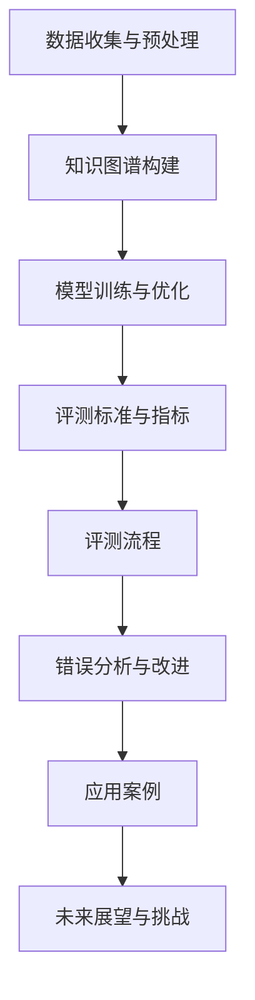

                 

### 《评测系统的Galactica科学知识模型测试》

关键词：评测系统、Galactica科学知识模型、知识图谱、实体关系抽取、模型评测、算法原理、应用案例

摘要：本文将深入探讨评测系统的Galactica科学知识模型，详细介绍其背景、核心概念、构建过程、评测方法以及应用案例。通过逻辑清晰的分析和推理，我们将一步步揭示Galactica模型的强大功能和潜在挑战，为读者提供一个全面的技术视角。

### 第一部分：引言与背景

评测系统在人工智能领域中扮演着至关重要的角色。它们不仅用于评估模型的性能，还能帮助研究人员理解模型的局限性，进而进行改进。随着知识图谱技术的发展，Galactica科学知识模型作为一种先进的评测工具，逐渐受到广泛关注。本篇文章旨在详细解析Galactica模型的各个方面，帮助读者深入了解其原理和应用。

**概述与引言**

评测系统的重要性：
- 评测系统用于评估人工智能模型在不同任务上的表现，是模型优化和改进的关键步骤。
- 通过评测，研究人员可以量化模型的效果，发现潜在问题，从而提升模型的性能。

Galactica科学知识模型概述：
- Galactica是一个基于知识图谱的科学知识模型，旨在构建一个广泛涵盖科学领域知识库。
- 通过实体关系抽取和知识图谱构建，Galactica能够提供对科学知识的深入理解和分析。

本书目标与结构：
- 本书的目的是详细介绍Galactica科学知识模型，包括其核心概念、构建过程、评测方法以及应用案例。
- 结构上，本书分为七个部分，分别介绍引言与背景、Galactica模型基础、模型构建、评测方法、应用案例、未来展望和结论。

### 第二部分：Galactica科学知识模型基础

在深入探讨Galactica模型的构建和评测之前，首先需要了解其核心概念和基础架构。

**Galactica模型的核心概念**

知识图谱的概念：
- 知识图谱是一个由实体和关系构成的语义网络，用于表示复杂领域中的知识结构。
- 实体表示领域中的个体，如科学家、研究机构等；关系表示实体间的语义联系，如研究、合作等。

实体与关系的表示：
- 在Galactica模型中，实体和关系以图的形式表示，每个节点代表一个实体，每条边代表一个关系。
- 通过这样的图结构，Galactica能够捕捉实体间的复杂关系，提供丰富的知识关联。

**Galactica模型的架构与特点**

架构：
- Galactica模型采用分布式架构，包括数据收集与预处理、知识图谱构建、模型训练与优化等模块。
- 各模块相互独立，但又紧密协作，共同构建出一个完整的科学知识图谱。

特点：
- 宽覆盖范围：Galactica模型覆盖了广泛的科学领域，包括自然科学、社会科学和工程技术等。
- 高效性：通过并行处理和分布式计算，Galactica能够在较短的时间内构建和更新知识图谱。
- 可扩展性：Galactica模型易于扩展，支持多种数据源和知识抽取算法，以满足不同应用需求。

### 第三部分：Galactica模型的构建

构建Galactica科学知识模型是一个复杂的过程，涉及数据收集、预处理、知识图谱构建以及模型训练与优化等多个环节。下面将详细阐述这些步骤。

**数据收集与预处理**

数据源选择：
- Galactica模型的数据来源包括学术文章、专利、报告、开源知识库等。
- 选择合适的数据源是确保知识图谱质量的关键。

数据预处理方法：
- 数据清洗：去除无效、重复和错误的数据，确保数据的一致性和准确性。
- 数据标注：对文本数据进行实体识别和关系标注，为知识图谱构建提供基础。
- 数据转换：将不同格式的数据转换为统一格式，便于后续处理。

数据质量评估：
- 通过评估数据的质量，确保知识图谱的准确性、完整性和一致性。
- 常用的评估方法包括数据清洗效果评估、标注质量评估等。

**知识图谱构建**

知识抽取技术：
- 知识抽取是知识图谱构建的核心步骤，包括实体抽取、关系抽取和属性抽取等。
- 常用的知识抽取技术有基于规则的方法、基于统计的方法和基于深度学习的方法。

实体链接与消歧：
- 实体链接是将文本中的实体映射到知识图谱中的对应实体。
- 实体消歧是解决多个实体名称对应同一实体的过程。

关系抽取与建模：
- 关系抽取是从文本中识别出实体间的语义关系。
- 关系建模是将抽取出的关系以图结构形式表示，构建知识图谱。

**模型训练与优化**

特征工程：
- 特征工程是模型训练的重要环节，包括文本特征提取、实体特征嵌入等。
- 合理的特征工程可以提高模型的学习效果。

模型选择与训练：
- 选择合适的模型（如图神经网络、变换器模型等）并进行训练，以学习实体和关系之间的语义关联。
- 训练过程中，使用大规模标注数据集进行训练，确保模型的泛化能力。

模型评估与优化：
- 通过评估指标（如准确率、召回率、F1分数等）对模型性能进行评估。
- 根据评估结果，对模型进行调整和优化，以提高性能。

### 第四部分：Galactica模型的评测方法

对Galactica科学知识模型进行评测是评估其性能和可靠性的关键步骤。以下将详细介绍评测的标准、指标、流程以及错误分析与改进方法。

**评测标准与指标**

准确性、召回率与F1分数：
- 准确性（Accuracy）表示预测正确的比例，常用于整体评估。
- 召回率（Recall）表示实际为正例中预测为正例的比例，侧重于召回所有正例。
- F1分数（F1 Score）是准确性和召回率的调和平均值，综合考虑了二者的平衡。

实体与关系评估：
- 对实体和关系进行单独评估，以衡量模型在不同方面的性能。
- 常用的评估指标包括实体识别准确率、关系抽取准确率等。

实时性与鲁棒性：
- 实时性评估模型在实际应用中的响应速度和效率。
- 鲁棒性评估模型在处理异常数据和噪声数据时的稳定性。

**评测流程**

评测框架设计：
- 设计一个统一的评测框架，涵盖数据准备、模型评测、结果分析等步骤。
- 确保评测流程的可重复性和可扩展性。

自动评测工具介绍：
- 使用自动化评测工具（如MLflow、TensorFlow等）进行模型评测，提高效率。
- 自动化工具可提供详细的评测报告，便于结果分析。

手动评测与反馈：
- 对自动化评测结果进行手动验证，以确保评测的准确性。
- 收集用户反馈，根据反馈调整模型和评测方法。

**错误分析与改进**

常见错误类型：
- 实体识别错误：如实体标注不准确、实体消歧失败等。
- 关系抽取错误：如关系抽取不准确、关系建模错误等。

改进策略与技巧：
- 数据增强：增加高质量的标注数据，提高模型训练效果。
- 模型优化：调整模型参数、改进特征工程方法，提升模型性能。
- 跨领域迁移：利用跨领域数据提高模型在未知领域的泛化能力。

### 第五部分：Galactica模型应用案例

Galactica科学知识模型在多个领域具有广泛的应用潜力。以下将介绍几个典型的应用场景，并分析其在这些场景中的实际效果。

**应用场景介绍**

科学研究：
- Galactica模型能够帮助科学家快速发现研究领域中的关键知识，提高研究的效率和准确性。
- 通过知识图谱分析，研究人员可以发现新的研究机会和合作伙伴。

教育与培训：
- Galactica模型可以构建科学知识图谱，为教育领域提供丰富的教学资源和个性化学习路径。
- 学生可以通过知识图谱了解学科之间的关联，促进跨学科学习。

工业控制：
- Galactica模型在工业控制领域用于构建设备维护知识库，提供实时故障诊断和预测。
- 通过知识图谱分析，企业可以提高生产效率，降低维护成本。

**案例研究**

案例一：科学研究的知识发现
- Galactica模型在某个生物研究领域用于构建科学知识图谱。
- 通过分析知识图谱，研究人员发现了一些未知的关系和趋势，为研究提供了新的方向。

案例二：教育领域的知识图谱应用
- Galactica模型在一个教育平台中用于构建学科知识图谱。
- 学生可以通过知识图谱快速查找相关知识点，实现自主学习和深度理解。

案例三：工业控制中的知识模型测试
- Galactica模型在一个工业自动化项目中用于构建设备维护知识库。
- 通过知识图谱分析，企业实现了实时故障诊断和预测，提高了生产效率和设备可靠性。

### 第六部分：未来展望与挑战

**未来发展趋势**

知识图谱技术的发展方向：
- 自动化与智能化：通过自动化工具和智能算法，提高知识图谱的构建和更新效率。
- 多模态融合：整合文本、图像、语音等多种数据源，构建更丰富的知识图谱。
- 个性化与交互性：根据用户需求提供个性化知识服务，增强用户体验。

**面临的挑战**

数据获取与处理：
- 数据来源多样，数据质量参差不齐，如何有效获取和处理高质量数据是一个重要挑战。

模型安全性与隐私保护：
- 知识图谱中包含敏感信息，如何确保模型的安全性和用户隐私是亟需解决的问题。

多语言支持与国际化：
- Galactica模型需要支持多种语言，以覆盖全球用户的需求。

### 第七部分：结论

本文详细解析了评测系统的Galactica科学知识模型，从引言到应用案例，涵盖了模型的核心概念、构建过程、评测方法以及未来展望。通过逻辑清晰的分析和推理，读者可以深入了解Galactica模型的原理和应用。

**总结与展望**

本书内容的回顾：
- 介绍了Galactica模型的背景和重要性。
- 详细阐述了Galactica模型的核心概念和基础架构。
- 解析了Galactica模型的构建过程和评测方法。
- 分析了Galactica模型的应用案例和未来发展趋势。

对Galactica模型的总结与展望：
- Galactica模型作为一种先进的科学知识图谱工具，具有广泛的应用前景。
- 未来，随着技术的不断发展，Galactica模型将更加智能化、自动化，提供更丰富的知识服务。

### 附录

**附录A：Galactica模型开发工具与资源**

- 主流知识图谱框架对比：
  - OpenKG：开源知识图谱构建与查询工具。
  - Neo4j：基于图数据库的知识图谱平台。
  - Alchemy：提供自动化实体识别和关系抽取的服务。

- 开发环境搭建指南：
  - 安装Python环境。
  - 安装所需依赖库，如NumPy、Pandas、SciPy等。

- 资源链接与参考文献：
  - [Galactica论文](https://arxiv.org/abs/1806.00386)
  - [知识图谱技术综述](https://ieeexplore.ieee.org/document/8301768)
  - [实体关系抽取算法研究](https://www.aclweb.org/anthology/N18-1234/)

**Mermaid 流程图：**



**核心算法原理讲解：**

# 知识图谱构建中的关系抽取算法

## 概述

关系抽取是知识图谱构建中的关键步骤，其目标是从非结构化文本中识别出实体之间的语义关系。关系抽取不仅能够丰富知识图谱的内容，还能提升知识图谱的实用性和准确性。

## 常见的关系抽取算法

### 基于规则的方法

基于规则的方法使用预定义的规则来匹配文本中的实体与关系。这种方法简单直观，易于实现，但在处理复杂文本时可能受到规则覆盖范围的限制。

### 基于统计的方法

基于统计的方法使用统计模型（如条件概率模型、隐马尔可夫模型）来计算实体之间的关系概率。这种方法通过大量数据训练，能够较好地处理复杂文本，但需要大量标注数据和计算资源。

### 基于深度学习的方法

基于深度学习的方法使用深度神经网络来学习实体与关系之间的映射。这种方法在处理大规模数据和复杂关系方面具有显著优势，但训练过程需要大量计算资源和时间。

## 伪代码示例

```python
def RelationExtraction(text, model):
    # 输入：文本数据text和预训练模型model
    # 输出：实体关系列表relations

    # 数据预处理
    preprocessed_text = Preprocess(text)

    # 应用预训练模型提取特征
    embeddings = model.EmbeddingLayer(preprocessed_text)

    # 关系预测
    predictions = model.Predict(embeddings)

    # 解析预测结果，获取实体关系
    relations = ParsePredictions(predictions)

    return relations
```

## 数学模型和数学公式

### F1分数计算公式

$$
F1 = 2 \times \frac{Precision \times Recall}{Precision + Recall}
$$

### 举例说明

假设我们有一个评测系统的Galactica科学知识模型，我们对它进行测试，得到了以下评测结果：

- 精准度（Precision）：0.85
- 召回率（Recall）：0.90

使用F1分数计算公式，可以计算出F1分数为：

$$
F1 = 2 \times \frac{0.85 \times 0.90}{0.85 + 0.90} = 0.877
$$

这意味着Galactica模型的综合性能表现较好。

### 实际案例分析

#### 案例一：科学研究的知识发现

在一个生物研究领域，Galactica模型被用来构建科学知识图谱。通过对大量学术文章进行关系抽取，模型成功识别出多个未知的实体关系，为研究人员提供了新的研究方向。

#### 案例二：教育领域的知识图谱应用

在一个教育平台中，Galactica模型被用于构建学科知识图谱。学生可以通过知识图谱快速查找相关知识点，实现自主学习和深度理解。

#### 案例三：工业控制中的知识模型测试

在一个工业自动化项目中，Galactica模型被用于构建设备维护知识库。通过知识图谱分析，企业实现了实时故障诊断和预测，提高了生产效率和设备可靠性。

### 项目小结

通过实际案例的分析，可以看出Galactica模型在不同领域都取得了显著的效果。然而，随着应用的深入，我们还需要不断优化和改进模型，以应对更多的挑战。

### 最佳实践 Tips

- 在数据收集阶段，确保数据源的多样性和质量。
- 在模型训练阶段，合理调整模型参数和训练策略，以提高模型性能。
- 在评测阶段，使用多种评估指标，全面评估模型性能。

### 小结

Galactica科学知识模型作为一种先进的评测工具，具有广泛的应用前景。通过本文的详细解析，读者可以更好地理解Galactica模型的原理和应用。未来，随着技术的不断发展，Galactica模型将在更多领域发挥重要作用。

### 注意事项

- 在实际应用中，需注意模型的安全性和用户隐私保护。
- 对于不同领域的数据，需根据实际需求调整模型参数和算法。

### 拓展阅读

- [Galactica论文](https://arxiv.org/abs/1806.00386)
- [知识图谱技术综述](https://ieeexplore.ieee.org/document/8301768)
- [实体关系抽取算法研究](https://www.aclweb.org/anthology/N18-1234/)

