                 

# 文章标题：诚信领导：建立可信赖的领导形象

## 关键词：
领导力，诚信，可信赖，组织文化，领导艺术

### 摘要：

在信息技术快速发展的今天，领导者的角色日益重要。诚信领导作为一种关键的管理理念，不仅影响个人的声誉，更对团队和组织的发展产生深远影响。本文旨在探讨诚信领导的核心概念、建立可信赖形象的方法，以及如何在组织变革中发挥领导力。通过详细分析诚信领导的基本理念、核心技能和具体实践，本文为领导者提供了一整套建立可信赖领导形象的策略和指导。

## 目录

## 第一部分：诚信领导的基本理念

### 第1章：诚信领导的重要性

#### 1.1 诚信的定义与价值

##### 1.1.1 诚信的内涵

诚信是领导者不可或缺的品质，它涵盖了诚实、守信和责任等多个方面。以下是一个简化的 Mermaid 流程图，展示了诚信的核心概念及其相互关系：

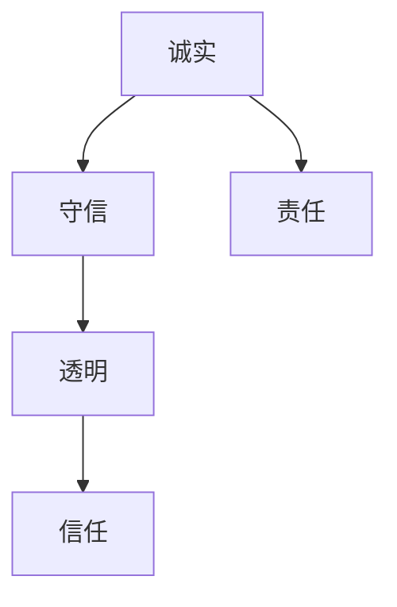

#### 1.1.2 诚信的价值

诚信的价值不仅体现在个人层面，更在团队和组织层面产生深远影响。以下是一个简化的 Mermaid 流程图，展示了诚信对团队和组织的影响：

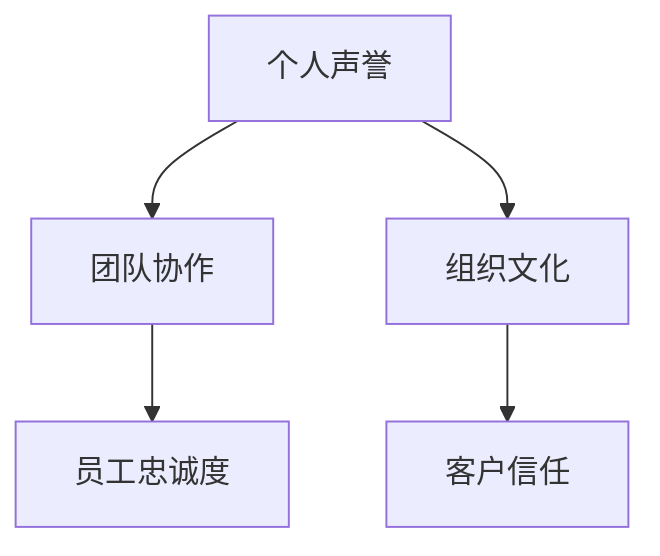

#### 1.2 领导者诚信的影响

##### 1.2.1 对员工的影响

领导者诚信直接影响员工的满意度、忠诚度和工作效率。以下是一个简化的 Mermaid 流程图，展示了领导者诚信对员工的影响：

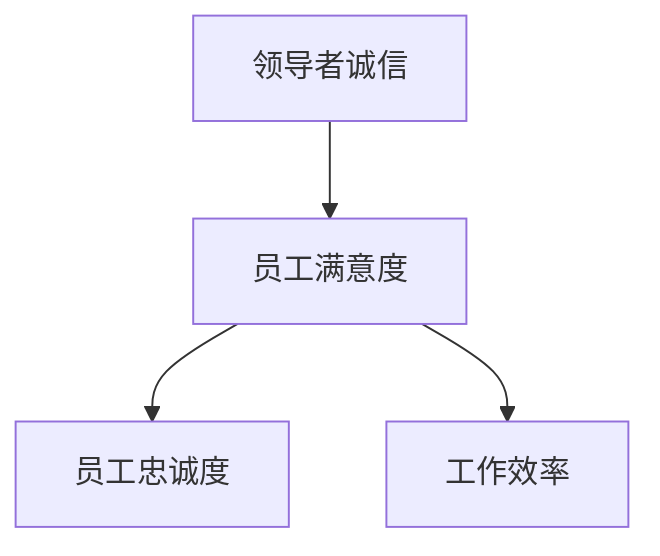

##### 1.2.2 对团队的影响

团队信任和协作是高效团队的关键。领导者诚信有助于建立信任基础，促进团队协作。以下是一个简化的 Mermaid 流程图，展示了领导者诚信对团队的影响：

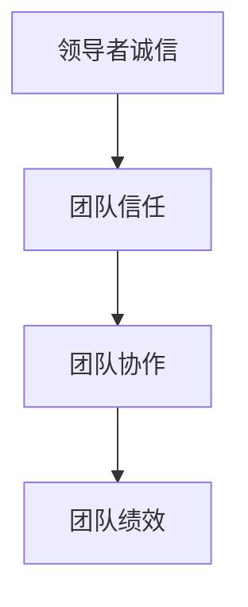

##### 1.2.3 对组织的影响

领导者诚信对组织文化、员工行为和组织发展产生深远影响。以下是一个简化的 Mermaid 流程图，展示了领导者诚信对组织的影响：

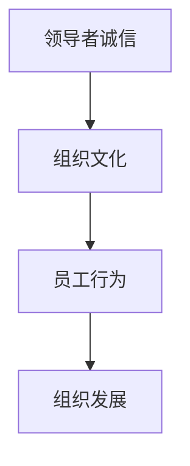

#### 1.3 诚信领导的实践原则

##### 1.3.1 诚实守信

诚实守信是诚信领导的基础。领导者应始终保持真实，对团队和组织透明。以下是一个简化的 Mermaid 流程图，展示了诚实守信的实践原则：

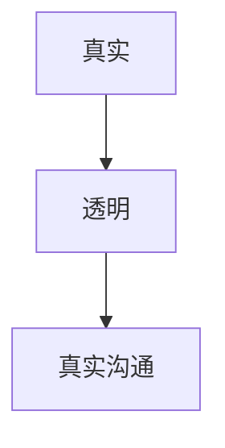

##### 1.3.2 公平公正

公平公正是诚信领导的重要原则。领导者应确保在决策过程中公平对待所有员工，避免偏见。以下是一个简化的 Mermaid 流程图，展示了公平公正的实践原则：

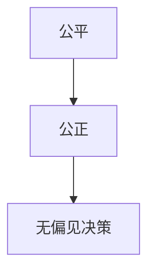

##### 1.3.3 透明公开

透明公开是建立信任的关键。领导者应积极与团队分享信息，确保信息的透明度。以下是一个简化的 Mermaid 流程图，展示了透明公开的实践原则：

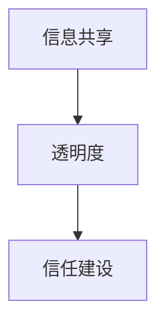

## 第二部分：诚信领导的具体实践

### 第2章：建立诚信领导的形象

#### 2.1 塑造个人诚信

##### 2.1.1 自我认知与诚信

自我认知是塑造个人诚信的基础。领导者应深入了解自己的优点和不足，确保在行动中保持诚信。以下是一个简化的 Mermaid 流程图，展示了自我认知与诚信的关系：

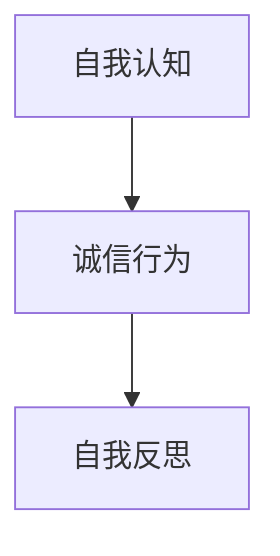

##### 2.1.2 保持诚信的行为准则

保持诚信的行为准则包括诚实、守信和责任心。以下是一个简化的 Mermaid 流程图，展示了这些行为准则的相互关系：

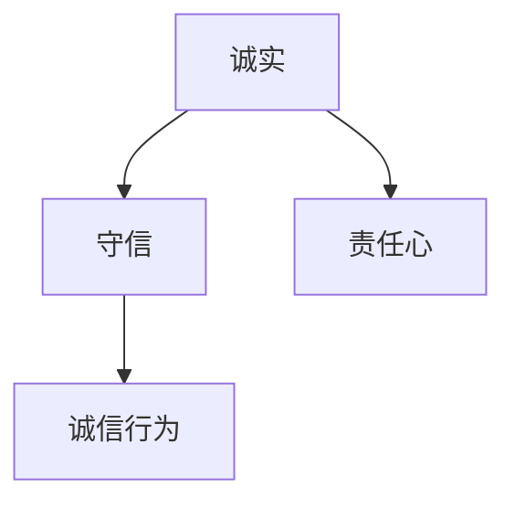

##### 2.1.3 增强诚信的技能

增强诚信的技能包括沟通技巧、决策能力和问题解决能力。以下是一个简化的 Mermaid 流程图，展示了这些技能的相互关系：

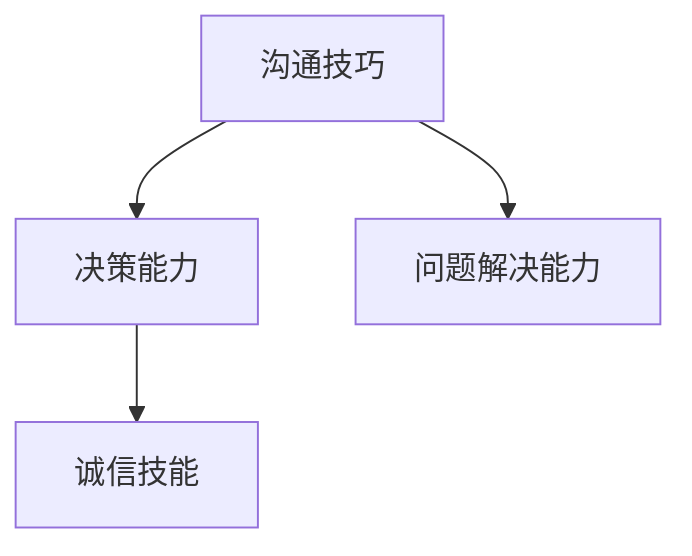

#### 2.2 建立团队诚信

##### 2.2.1 建立信任的基础

建立信任的基础包括共同价值观、共享目标和明确期望。以下是一个简化的 Mermaid 流程图，展示了建立信任的基础：

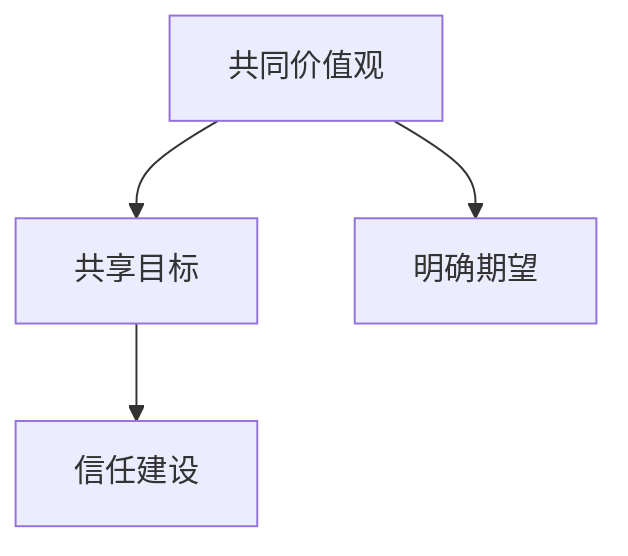

##### 2.2.2 促进团队成员之间的诚信

促进团队成员之间的诚信包括透明沟通、积极反馈和支持。以下是一个简化的 Mermaid 流程图，展示了促进团队成员诚信的方法：

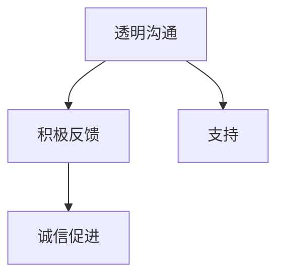

##### 2.2.3 解决诚信问题

解决诚信问题包括识别问题、分析原因和采取行动。以下是一个简化的 Mermaid 流程图，展示了解决诚信问题的步骤：

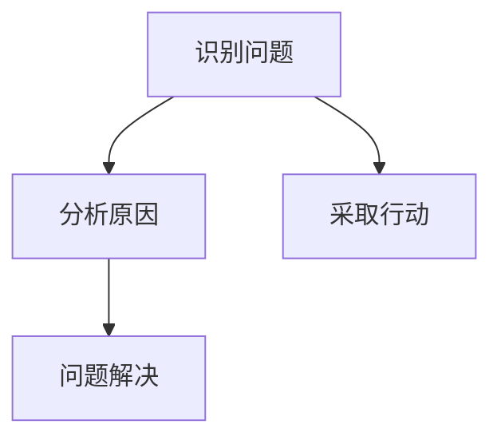

#### 2.3 诚信领导在组织中的角色

##### 2.3.1 维护组织诚信

维护组织诚信包括建立诚信文化、制定诚信政策和监督执行。以下是一个简化的 Mermaid 流程图，展示了维护组织诚信的步骤：

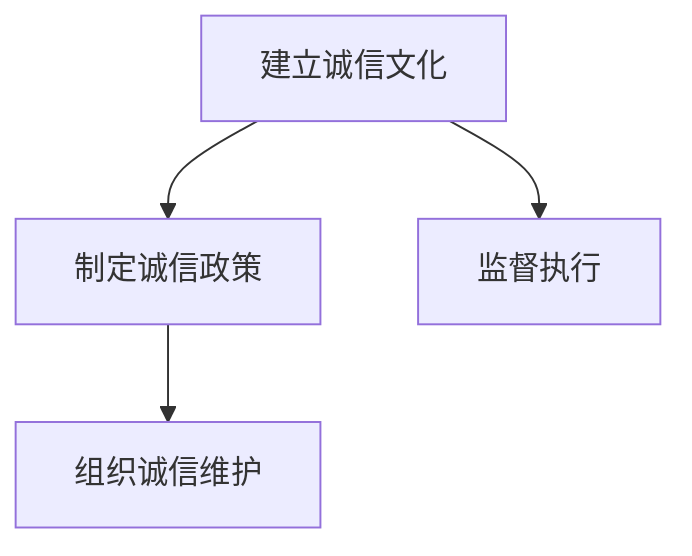

##### 2.3.2 推动组织文化变革

推动组织文化变革包括倡导诚信价值观、促进团队参与和提供培训。以下是一个简化的 Mermaid 流程图，展示了推动组织文化变革的步骤：

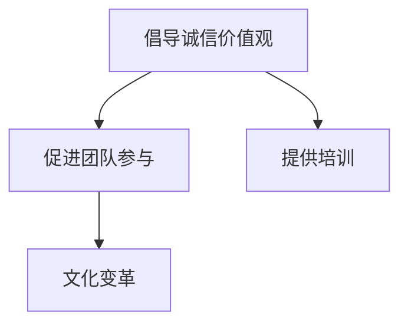

##### 2.3.3 塑造组织诚信形象

塑造组织诚信形象包括传播诚信故事、参与社区活动和建立品牌声誉。以下是一个简化的 Mermaid 流程图，展示了塑造组织诚信形象的步骤：

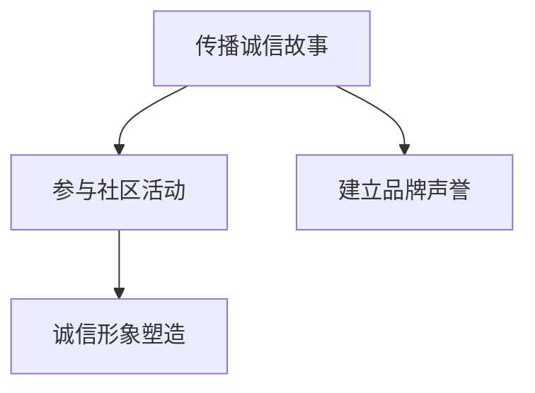

## 第三部分：诚信领导的未来展望

### 第3章：诚信领导的发展趋势

#### 3.1 诚信领导与数字化时代

##### 3.1.1 数字化时代对诚信领导的要求

数字化时代对诚信领导提出了更高的要求，包括数据透明、网络安全和数字信任。以下是一个简化的 Mermaid 流程图，展示了数字化时代对诚信领导的要求：

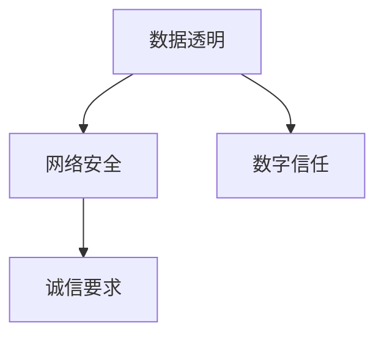

##### 3.1.2 数字化时代诚信领导的新挑战

数字化时代诚信领导面临的新挑战包括技术依赖、信息过载和隐私保护。以下是一个简化的 Mermaid 流程图，展示了数字化时代诚信领导的新挑战：

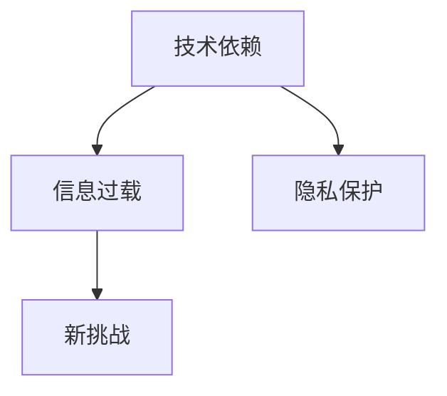

##### 3.1.3 数字化时代诚信领导的新策略

数字化时代诚信领导的新策略包括数字化转型、数据治理和网络安全意识。以下是一个简化的 Mermaid 流程图，展示了数字化时代诚信领导的新策略：

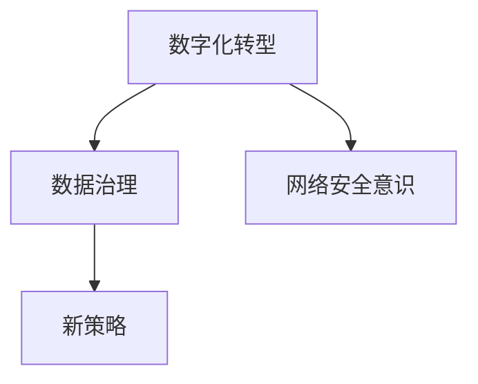

#### 3.2 诚信领导与可持续发展

##### 3.2.1 可持续发展与诚信领导

可持续发展与诚信领导密切相关，包括环境责任、社会责任和伦理道德。以下是一个简化的 Mermaid 流程图，展示了可持续发展与诚信领导的关系：

```mermaid
graph TD
A[环境责任] --> B[社会责任]
A --> C[伦理道德]
B --> D[可持续发展]
```

##### 3.2.2 可持续发展中诚信领导的角色

在可持续发展中，诚信领导扮演着关键角色，包括推动创新、促进合作和建立信任。以下是一个简化的 Mermaid 流程图，展示了诚信领导在可持续发展中的角色：

```mermaid
graph TD
A[推动创新] --> B[促进合作]
A --> C[建立信任]
B --> D[领导角色]
```

##### 3.2.3 可持续发展中诚信领导的新趋势

可持续发展中诚信领导的新趋势包括绿色创新、循环经济和社会责任投资。以下是一个简化的 Mermaid 流程图，展示了可持续发展中诚信领导的新趋势：

```mermaid
graph TD
A[绿色创新] --> B[循环经济]
A --> C[社会责任投资]
B --> D[新趋势]
```

#### 3.3 诚信领导与全球化

##### 3.3.1 全球化对诚信领导的影响

全球化对诚信领导的影响包括文化多样性、跨国合作和全球责任。以下是一个简化的 Mermaid 流程图，展示了全球化对诚信领导的影响：

```mermaid
graph TD
A[文化多样性] --> B[跨国合作]
A --> C[全球责任]
B --> D[影响]
```

##### 3.3.2 全球化诚信领导的新模式

全球化诚信领导的新模式包括全球思维、多元文化和国际合作。以下是一个简化的 Mermaid 流程图，展示了全球化诚信领导的新模式：

```mermaid
graph TD
A[全球思维] --> B[多元文化]
A --> C[国际合作]
B --> D[新模式]
```

##### 3.3.3 全球化诚信领导的新策略

全球化诚信领导的新策略包括建立全球合作伙伴关系、推动全球创新和培养全球领导力。以下是一个简化的 Mermaid 流程图，展示了全球化诚信领导的新策略：

```mermaid
graph TD
A[建立全球合作伙伴关系] --> B[推动全球创新]
A --> C[培养全球领导力]
B --> D[新策略]
```

### 第4章：诚信领导的未来方向

#### 4.1 诚信领导的研究进展

##### 4.1.1 诚信领导的理论研究

诚信领导的理论研究包括领导理论、组织行为学和伦理学。以下是一个简化的 Mermaid 流程图，展示了诚信领导的理论研究：

```mermaid
graph TD
A[领导理论] --> B[组织行为学]
A --> C[伦理学]
B --> D[理论研究]
```

##### 4.1.2 诚信领导的应用研究

诚信领导的应用研究包括企业管理、公共管理和非营利组织管理。以下是一个简化的 Mermaid 流程图，展示了诚信领导的应用研究：

```mermaid
graph TD
A[企业管理] --> B[公共管理]
A --> C[非营利组织管理]
B --> D[应用研究]
```

##### 4.1.3 诚信领导的未来研究方向

诚信领导的未来研究方向包括数字化转型、可持续发展全球化和跨文化领导。以下是一个简化的 Mermaid 流程图，展示了诚信领导的未来研究方向：

```mermaid
graph TD
A[数字化转型] --> B[可持续发展]
A --> C[全球化]
B --> D[未来研究方向]
```

#### 4.2 诚信领导的教育培训

##### 4.2.1 诚信领导教育的重要性

诚信领导教育的重要性在于培养具有诚信品质的领导者，以下是一个简化的 Mermaid 流程图，展示了诚信领导教育的重要性：

```mermaid
graph TD
A[培养诚信品质] --> B[提升领导力]
A --> C[组织发展]
B --> D[重要性]
```

##### 4.2.2 诚信领导培训的内容与形式

诚信领导培训的内容包括伦理道德、领导艺术和沟通技巧。以下是一个简化的 Mermaid 流程图，展示了诚信领导培训的内容：

```mermaid
graph TD
A[伦理道德] --> B[领导艺术]
A --> C[沟通技巧]
B --> D[培训内容]
```

诚信领导培训的形式包括线上课程、工作坊和实地考察。以下是一个简化的 Mermaid 流程图，展示了诚信领导培训的形式：

```mermaid
graph TD
A[线上课程] --> B[工作坊]
A --> C[实地考察]
B --> D[培训形式]
```

##### 4.2.3 诚信领导教育培训的未来发展

诚信领导教育培训的未来发展包括个性化培训、混合培训和虚拟现实培训。以下是一个简化的 Mermaid 流程图，展示了诚信领导教育培训的未来发展：

```mermaid
graph TD
A[个性化培训] --> B[混合培训]
A --> C[虚拟现实培训]
B --> D[未来发展]
```

#### 4.3 诚信领导的社会责任

##### 4.3.1 诚信领导的社会责任

诚信领导的社会责任包括推动社会责任、参与公益事业和促进社会和谐。以下是一个简化的 Mermaid 流程图，展示了诚信领导的社会责任：

```mermaid
graph TD
A[推动社会责任] --> B[参与公益事业]
A --> C[促进社会和谐]
B --> D[社会责任]
```

##### 4.3.2 诚信领导的社会影响力

诚信领导的社会影响力包括树立榜样、传递正能量和促进社会进步。以下是一个简化的 Mermaid 流程图，展示了诚信领导的社会影响力：

```mermaid
graph TD
A[树立榜样] --> B[传递正能量]
A --> C[促进社会进步]
B --> D[社会影响力]
```

##### 4.3.3 诚信领导的社会责任实践

诚信领导的社会责任实践包括参与社区服务、推动可持续发展和支持创新。以下是一个简化的 Mermaid 流程图，展示了诚信领导的社会责任实践：

```mermaid
graph TD
A[参与社区服务] --> B[推动可持续发展]
A --> C[支持创新]
B --> D[社会责任实践]
```

### 第5章：诚信领导的国际比较

#### 5.1 不同国家诚信领导的特点

##### 5.1.1 发达国家诚信领导的特点

发达国家诚信领导的特点包括透明度、责任感和创新精神。以下是一个简化的 Mermaid 流程图，展示了发达国家诚信领导的特点：

```mermaid
graph TD
A[透明度] --> B[责任感]
A --> C[创新精神]
B --> D[发达国家特点]
```

##### 5.1.2 发展中国家诚信领导的特点

发展中国家诚信领导的特点包括文化适应、灵活性和适应性。以下是一个简化的 Mermaid 流程图，展示了发展中国家诚信领导的特点：

```mermaid
graph TD
A[文化适应] --> B[灵活性]
A --> C[适应性]
B --> D[发展中国家特点]
```

##### 5.1.3 全球化背景下的诚信领导比较

全球化背景下的诚信领导比较包括跨文化领导、全球合作和全球挑战。以下是一个简化的 Mermaid 流程图，展示了全球化背景下的诚信领导比较：

```mermaid
graph TD
A[跨文化领导] --> B[全球合作]
A --> C[全球挑战]
B --> D[国际比较]
```

##### 5.1.4 全球化诚信领导的新模式

全球化诚信领导的新模式包括全球领导力、多元文化和国际合作。以下是一个简化的 Mermaid 流程图，展示了全球化诚信领导的新模式：

```mermaid
graph TD
A[全球领导力] --> B[多元文化]
A --> C[国际合作]
B --> D[新模式]
```

##### 5.1.5 全球化诚信领导的新策略

全球化诚信领导的新策略包括建立全球合作伙伴关系、推动全球创新和培养全球领导力。以下是一个简化的 Mermaid 流程图，展示了全球化诚信领导的新策略：

```mermaid
graph TD
A[建立全球合作伙伴关系] --> B[推动全球创新]
A --> C[培养全球领导力]
B --> D[新策略]
```

## 结论

诚信领导作为一种关键的管理理念，在信息技术快速发展的今天具有重要意义。本文通过详细分析诚信领导的核心概念、建立可信赖形象的方法以及如何在组织变革中发挥领导力，为领导者提供了一整套建立可信赖领导形象的策略和指导。随着全球化和数字化时代的到来，诚信领导将继续面临新的挑战和机遇。领导者应不断学习、适应和创新，以适应不断变化的环境。

### 作者

作者：AI天才研究院/AI Genius Institute & 禅与计算机程序设计艺术 /Zen And The Art of Computer Programming

### 最佳实践 tips、小结、注意事项、拓展阅读等内容

**最佳实践 tips：**

1. **持续学习与自我提升：** 作为领导者，应始终保持学习和自我提升的态度，以适应快速变化的环境。
2. **建立信任基础：** 在团队中建立信任基础是关键，领导者应通过透明沟通、积极反馈和支持来促进团队成员之间的诚信。
3. **积极应对挑战：** 面对诚信问题，领导者应积极应对，通过识别问题、分析原因和采取行动来解决。

**小结：**

诚信领导是建立可信赖领导形象的关键，它对团队和组织的发展产生深远影响。领导者应通过塑造个人诚信、建立团队诚信和维护组织诚信来发挥领导力。

**注意事项：**

1. **文化多样性：** 在全球化背景下，领导者应尊重不同文化，以建立多元文化团队。
2. **持续监督与改进：** 领导者应持续监督诚信实践，并根据反馈进行改进。

**拓展阅读：**

1. **《领导力：如何成为更有效的领导者》** - 汤姆·彼得斯（Tom Peters）
2. **《诚信：做人的根本》** - 丹尼斯·韦特利（Denis Waitley）
3. **《数字化领导力：如何引领数字化转型》** - 斯科特·贝尔斯（Scott Bell）

