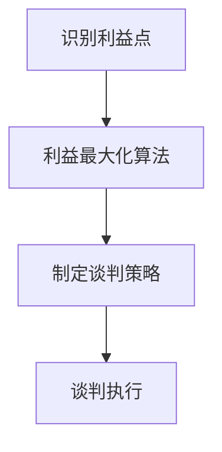
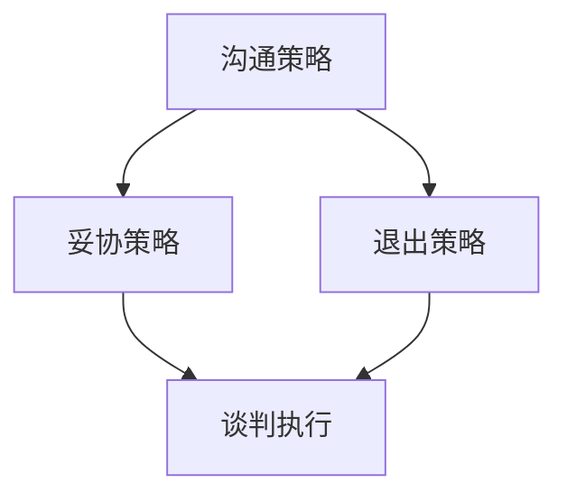
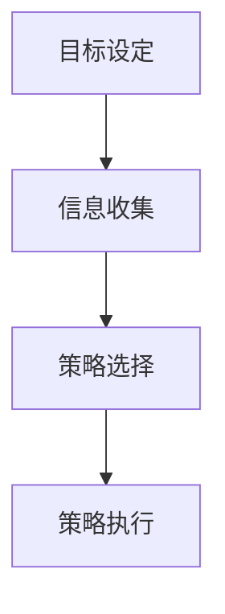
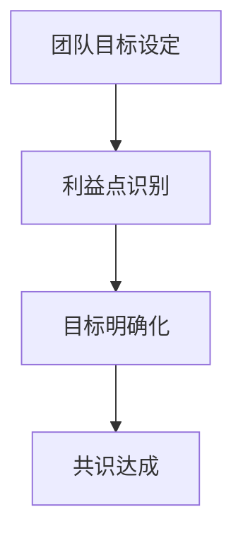
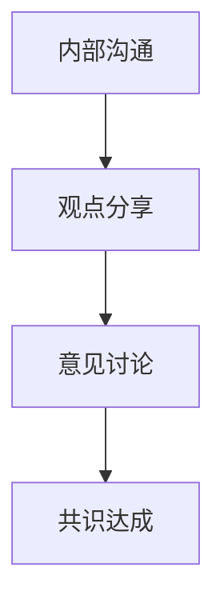
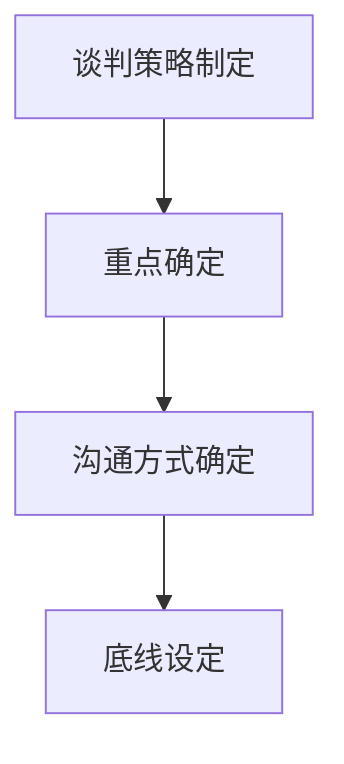

                 

### 谈判高手：为团队争取最大利益的技巧

#### 关键词：谈判技巧、团队利益、策略、情感、利益最大化、情感识别、博弈论

#### 摘要：

在快速变化的商业环境中，谈判能力成为团队领导者和成员成功的关键。本文基于《谈判高手：为团队争取最大利益的技巧》，深入探讨了谈判的核心概念、策略和方法，以及如何将这些技巧应用到实际团队谈判中。通过利益谈判、情感谈判和策略谈判的分析，本文提供了实用的工具和技巧，帮助读者提高谈判效果，实现团队的最大利益。

---

**作者：AI天才研究院/AI Genius Institute & 禅与计算机程序设计艺术 /Zen And The Art of Computer Programming**

### 引言

在现代商业环境中，谈判已经成为一种不可或缺的技能。无论是商务谈判、合同谈判还是团队内部资源的分配，谈判的成功与否直接关系到团队的整体利益。作为团队领导者或成员，掌握有效的谈判技巧不仅能够帮助团队争取到更好的条件，还能够提升团队的凝聚力和工作效率。

《谈判高手：为团队争取最大利益的技巧》这本书旨在为读者提供一套实用的谈判方法论，通过深入分析谈判的核心概念、策略和方法，帮助读者在谈判中取得优势。本书的核心内容分为三个部分：利益谈判、情感谈判和策略谈判。

在利益谈判部分，我们将探讨如何通过明确双方的利益点，运用利益最大化算法来制定谈判策略。在情感谈判部分，我们将学习如何识别和利用情感因素，以提升谈判的效率和效果。在策略谈判部分，我们将介绍博弈论在谈判中的应用，以及如何制定有效的谈判策略。

本文将逐步解析这些谈判技巧，并提供实际案例，帮助读者理解并掌握这些方法，从而在实际谈判中为团队争取最大利益。

### 利益谈判：基础与策略

谈判的本质在于利益交换，而利益谈判是谈判中最基础也是最重要的一部分。利益谈判的核心在于识别和最大化双方的利益，从而达成双赢的结果。为了有效地进行利益谈判，我们需要遵循以下几个关键步骤。

#### 1. 明确利益点

在利益谈判中，第一步是明确双方的利益点。这需要通过深入的沟通和数据分析来识别。例如，在商务谈判中，我们需要明确对方公司的核心需求、目标以及他们在谈判中的底线。同时，我们也需要识别出自己团队的需求和期望，以及我们愿意为达成协议而做出的妥协。



#### 2. 利益最大化算法

为了最大化双方的利益，我们可以运用利益最大化算法。这个算法的基本思想是，通过比较不同选项的预期价值，选择能够带来最大收益的方案。以下是一个简单的利益最大化算法的伪代码示例：

```python
# 利益最大化算法伪代码
def maximize_profit(offer1, offer2, value):
    if value[offer1] > value[offer2]:
        return offer1
    else:
        return offer2

# 示例
value = {'offer1': 100, 'offer2': 80}
result = maximize_profit('offer1', 'offer2', value)
print("最大化利益的选项是:", result)
```

在这个例子中，`value`字典存储了每个选项的预期价值，`maximize_profit`函数通过比较这两个值，选择了能够带来最大利益的选项。

#### 3. 制定谈判策略

在明确利益点和选择利益最大化算法后，下一步是制定具体的谈判策略。谈判策略应包括沟通策略、妥协策略和退出策略。以下是一个简单的谈判策略流程图：



#### 4. 实际案例

假设我们是一家软件开发公司的项目经理，正在与一家客户进行合同谈判。客户的利益点是尽快完成项目并且保证质量，我们的利益点是获得合理的报酬和长期的合作机会。

1. **识别利益点**：
   - 客户：快速交付、高质量
   - 我们：合理报酬、长期合作

2. **利益最大化算法**：
   - 客户的期望报酬为100万元，但我们认为合理的报酬为80万元。
   - 客户对项目完成时间的要求为2个月，但我们认为可以在3个月内完成。

3. **制定谈判策略**：
   - 沟通策略：首先明确双方的利益点，然后展示我们的优势和过去成功的案例。
   - 妥协策略：我们可以同意在3个月内完成项目，并承诺在质量上达到客户的要求。
   - 退出策略：如果客户不同意我们的条件，我们可以提出其他合作伙伴的选择。

通过这样的利益谈判，我们不仅能够争取到合理的报酬，还能够建立长期的合作关系。

#### 小结

利益谈判是谈判过程中的基础，通过明确利益点、运用利益最大化算法和制定谈判策略，我们可以为团队争取到最大利益。在实际谈判中，灵活运用这些技巧，将有助于实现双赢的结果。

### 情感谈判：识别与利用情感因素

在谈判过程中，情感因素往往被忽视，但它们对谈判的结果有着重要的影响。情感谈判旨在通过识别和利用双方的情感因素，来提升谈判的效率和效果。以下是如何进行情感谈判的几个关键步骤。

#### 1. 识别情感因素

情感因素包括喜、怒、哀、乐等，它们可以通过言语、肢体语言和行为表现来识别。例如，在谈判中，对方如果频繁点头、微笑或者使用积极的词汇，这通常表示他们对谈判结果感到满意。相反，如果对方皱眉、叹气或者使用消极的词汇，这可能是他们面临压力或不满的迹象。

以下是一个简单的情感识别算法的伪代码示例：

```python
# 情感识别算法伪代码
def identify_emotion(speech):
    if "happy" in speech:
        return "积极"
    elif "sad" in speech:
        return "消极"
    else:
        return "中立"

# 示例
speech = "我很高兴我们能达成这个协议"
result = identify_emotion(speech)
print("情感状态：", result)
```

在这个例子中，`identify_emotion`函数通过检查输入的言语，判断情感状态。

#### 2. 利用情感因素

在识别了情感因素后，我们可以利用这些信息来调整谈判策略。以下是一些利用情感因素的技巧：

- **积极肯定**：在对方表现出积极的情感时，我们可以通过肯定和赞美来强化他们的积极情绪，从而促进谈判的顺利进行。
- **同理心**：在对方表现出消极的情感时，我们可以通过展示同理心来缓解他们的情绪，并找到解决问题的方法。
- **情感转换**：有时，我们可以通过提出新的话题或解决方案，来转换双方的情感状态，从而改变谈判的气氛。

#### 3. 实际案例

假设我们正在与一家潜在客户进行合同谈判，对方的谈判代表在会议上表现出不满和抵触情绪。

1. **识别情感因素**：
   - 代表的言语中包含“这个价格太高了”，“我不认为这个项目值得这个价钱”等消极词汇。

2. **利用情感因素**：
   - 我们可以通过展示同理心来缓解对方的不满情绪，例如：“我理解您的担忧，我们也能感受到市场的压力。我们希望找到一个双方都能接受的解决方案。”
   - 然后我们可以提出一个新的解决方案，例如：“我们愿意降低一些费用，同时提供一些额外的服务来补偿。”

通过这样的情感谈判，我们不仅能够缓解对方的不满情绪，还能够找到双方都能接受的解决方案。

#### 小结

情感谈判是谈判中不可或缺的一部分，通过识别和利用情感因素，我们可以提升谈判的效果。在实际谈判中，灵活运用情感识别和利用技巧，将有助于实现双赢的结果。

### 策略谈判：博弈论与策略制定

策略谈判是谈判过程中的高级阶段，它涉及到更复杂的策略和决策。策略谈判的核心在于运用博弈论原理，制定和执行有效的谈判策略。以下是如何进行策略谈判的几个关键步骤。

#### 1. 理解博弈论

博弈论是研究决策和互动的数学理论，它适用于谈判中的各种情况。博弈论的基本概念包括：

- **参与者**：谈判的双方或多方。
- **策略**：参与者在决策中采取的行动方案。
- **支付函数**：参与者从不同策略组合中获得的收益或损失。

博弈论中有几种常见的模型，例如零和博弈、合作博弈和非合作博弈。在谈判中，我们通常关注的是合作博弈，其目标是实现双方的利益最大化。

#### 2. 策略制定

在策略谈判中，制定有效的策略至关重要。以下是一些策略制定的步骤：

- **目标设定**：明确谈判的目标和优先级，例如，是争取最大的利益还是建立长期合作关系。
- **信息收集**：收集对方的信息，包括其需求和底线，以及可能的市场变化和竞争对手的情况。
- **策略选择**：根据目标和信息，选择最合适的策略。这可以包括直接的妥协、合作或者采取更激进的策略。

以下是一个简单的策略选择流程图：



#### 3. 实际案例

假设我们是一家软件公司的CTO，正在与一家硬件公司进行合作谈判，以共同开发一款新产品。

1. **目标设定**：
   - 我们的目标是确保新产品的技术领先，同时获得合理的经济回报。

2. **信息收集**：
   - 硬件公司拥有一项关键的技术专利，这将是新产品的核心技术。
   - 我们需要在新产品开发过程中投入大量的人力物力。

3. **策略选择**：
   - 我们可以选择与硬件公司进行合作，共同开发新产品。这种合作模式可以最大化双方的利益。
   - 我们可以提出共享收益的方案，例如，如果新产品获得成功，双方按照约定的比例分享收益。

4. **策略执行**：
   - 在谈判过程中，我们展示了我们的技术实力和开发能力，同时也表达了我们对长期合作的诚意。
   - 我们提出了一个双赢的合作方案，即硬件公司提供核心技术，我们负责开发和应用。

通过这样的策略谈判，我们不仅能够确保新产品的技术领先，还能够获得合理的经济回报，并建立起长期的合作关系。

#### 小结

策略谈判是谈判中的高级阶段，通过理解博弈论和制定有效的策略，我们可以为团队争取到最大的利益。在实际谈判中，灵活运用策略制定和执行技巧，将有助于实现谈判目标。

### 团队谈判：内部沟通与协作

团队谈判不仅涉及到与外部的沟通和协作，还涉及到团队成员之间的内部沟通和协作。有效的团队谈判能够确保团队内部意见一致，提高谈判的成功率。以下是如何进行团队谈判的几个关键步骤。

#### 1. 明确团队目标

在团队谈判前，首先需要明确团队的目标和利益点。这需要团队成员共同讨论和确定，确保每个成员都清楚团队的目标和期望。以下是一个团队目标设定的流程图：



#### 2. 内部沟通

在明确团队目标后，内部沟通至关重要。通过有效的沟通，团队成员可以分享各自的观点和意见，共同探讨最佳策略。以下是一个内部沟通的流程图：



#### 3. 制定谈判策略

在内部沟通的基础上，团队可以制定统一的谈判策略。这包括确定谈判的重点、沟通的方式和妥协的底线。以下是一个谈判策略制定的流程图：



#### 4. 实际案例

假设我们是一家科技公司，正在与一家潜在客户进行项目合作谈判。以下是如何进行团队谈判的步骤：

1. **明确团队目标**：
   - 团队目标是在保证项目质量的前提下，争取到最大的利润。

2. **内部沟通**：
   - 团队成员共同讨论项目的细节，确定项目的关键点和风险。

3. **制定谈判策略**：
   - 确定谈判的重点是项目的交付时间和质量，同时设定了最低可接受的利润率。

4. **执行谈判**：
   - 团队成员在谈判中统一立场，共同应对客户的提问和要求。

通过这样的团队谈判，我们不仅能够确保项目顺利进行，还能够为公司争取到最大的利益。

#### 小结

团队谈判是谈判中的重要一环，通过明确团队目标、内部沟通和制定谈判策略，我们可以提高谈判的成功率。在实际谈判中，有效运用这些技巧，将有助于团队实现共同的目标。

### 项目实战：从理论到实践的转化

在了解了谈判的理论和方法后，如何将这些理论应用到实际项目中，是提升谈判效果的关键。以下是一个具体的实战案例，我们将详细讲解从项目启动到谈判执行的全过程。

#### 项目背景

我们是一家软件开发公司，接到一个大型客户的需求，为客户开发一款企业管理系统。该项目预计为期六个月，客户希望系统能够在短时间内上线，并且要求较高的稳定性。

#### 项目阶段

1. **需求分析**：与客户进行初步沟通，明确客户的具体需求和期望。

2. **技术方案设计**：根据需求分析，设计合适的技术方案。

3. **项目谈判**：与客户进行项目谈判，确定项目的交付时间、费用和技术支持等细节。

4. **项目执行**：按照谈判结果，开始项目开发和测试。

5. **项目交付**：完成系统开发，进行验收和交付。

#### 实战步骤

1. **需求分析**

   在与客户沟通的过程中，我们识别出以下利益点：

   - 客户：尽快上线、系统稳定、功能完善
   - 我们：合理的报酬、长期合作机会

   我们通过利益最大化算法，确定我们的底线和可接受的妥协范围。

   ```python
   value = {'时间': 500000, '稳定': 300000, '功能': 200000}
   result = maximize_profit('时间', '稳定', value)
   print("最大化利益的选项是：", result)
   ```

   结果显示，我们最关注的是系统的稳定性。

2. **技术方案设计**

   我们设计了以下技术方案：

   - 使用流行的开源框架进行开发，确保系统的稳定性和安全性。
   - 引入云服务，提高系统的可扩展性和灵活性。
   - 设计详细的测试方案，确保系统上线后的稳定性。

3. **项目谈判**

   在谈判中，我们采用了以下策略：

   - **沟通策略**：首先明确双方的利益点，展示我们的技术实力和以往的成功案例。
   - **妥协策略**：我们同意在四个月内完成项目，并且承诺在系统上线后提供一年的技术支持。
   - **退出策略**：如果客户不同意我们的条件，我们可以提出其他合作伙伴的选择。

   通过情感谈判，我们识别出客户对项目交付时间的担忧，通过展示我们的技术方案和以往的成功案例，缓解了客户的担忧。

4. **项目执行**

   项目执行过程中，我们严格按照谈判协议进行。同时，我们通过定期的进度报告和沟通，确保项目的顺利进行。

5. **项目交付**

   项目完成后，我们进行了严格的测试和验收，确保系统达到客户的要求。客户对我们的工作表示满意，并同意长期合作。

#### 项目小结

通过这个实战案例，我们可以看到，将谈判技巧应用到项目中，可以有效地提高项目的成功率。以下是项目小结和反思：

- **小结**：
  - 利益谈判帮助我们明确了项目目标和底线，确保了项目的顺利进行。
  - 情感谈判帮助我们缓解了客户的担忧，增强了信任。
  - 策略谈判帮助我们制定了有效的谈判策略，提高了谈判的成功率。

- **反思**：
  - 在未来的项目中，我们可以进一步优化谈判流程，提高谈判效率。
  - 我们需要加强团队成员之间的沟通，确保团队内部的协作更加顺畅。
  - 我们需要持续提升技术能力和服务水平，为客户提供更好的体验。

### 最佳实践 tips

在谈判中，以下是一些最佳实践技巧，可以帮助你提高谈判效果：

1. **准备充分**：在谈判前，做好充分准备，了解对方的需求和底线，制定详细的谈判策略。

2. **建立信任**：通过展示自己的技术实力和成功案例，建立与对方的信任关系。

3. **倾听与沟通**：在谈判中，积极倾听对方的意见，通过有效的沟通，确保双方理解对方的需求。

4. **灵活妥协**：在谈判过程中，灵活调整策略，找到双方都能接受的妥协点。

5. **持续沟通**：在项目执行过程中，保持与客户的持续沟通，确保项目按计划进行。

### 小结

通过本文的讨论，我们了解了谈判高手如何为团队争取最大利益的技巧。从利益谈判、情感谈判到策略谈判，每个环节都至关重要。在实际项目中，灵活运用这些技巧，将有助于团队实现共赢的目标。希望通过本文，读者能够掌握谈判的核心技巧，提升自己的谈判能力。

---

**作者：AI天才研究院/AI Genius Institute & 禅与计算机程序设计艺术 /Zen And The Art of Computer Programming**

---

通过上述内容，本文详细探讨了谈判高手如何为团队争取最大利益的技巧，从利益谈判、情感谈判到策略谈判，每个环节都进行了深入分析和实例讲解。希望通过本文，读者能够掌握谈判的核心技巧，提升自己的谈判能力，在实际工作中取得更好的成果。

