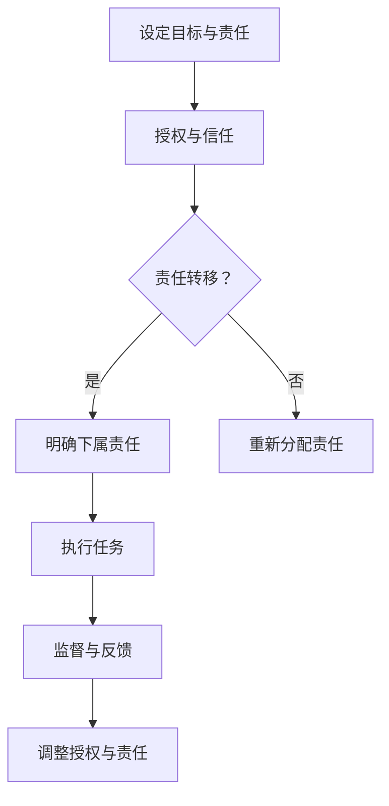
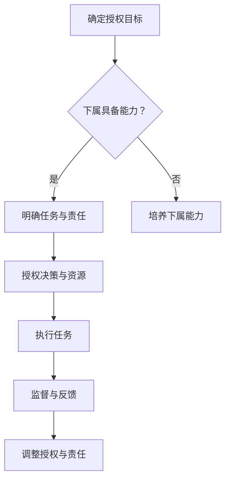
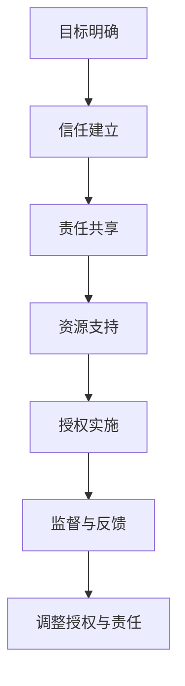
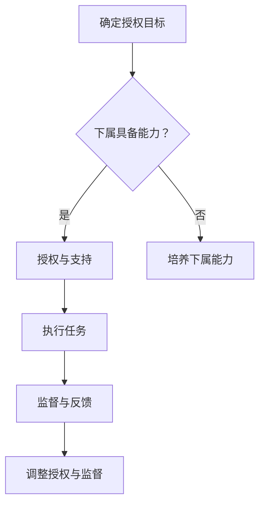
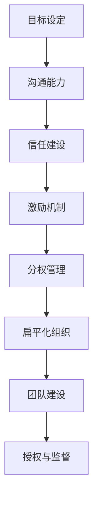

                 


### 《责任与授权：平衡控制与自主的领导艺术》

#### 关键词
- 责任与授权
- 平衡控制
- 领导艺术
- 自主性
- 组织管理

#### 摘要
本文旨在探讨责任与授权在组织管理中的关键作用，以及如何在领导艺术中实现控制与自主的平衡。通过分析背景、核心概念、实例和实践，本文旨在为领导者提供理论依据和实践指导，帮助他们在快速变化的商业环境中做出明智决策。

## 第1章 引言

### 1.1 责任与授权的重要性

在组织管理中，责任与授权是两个不可或缺的概念。责任是指个体或组织因特定行为或决策而承担的义务和后果。授权则是指领导者将权力和资源授予下属，使其能够自主决策和执行任务。

责任与授权不仅决定了组织运作的效率，还影响了员工的积极性和创造力。一个优秀的领导者需要在确保责任明确的同时，适当地授权，以激发团队的潜能。

### 1.2 控制与自主的关系

控制与自主是对立统一的关系。过度控制可能导致员工失去自主性，降低工作效率和创新能力；而过度的自主可能导致管理失控，影响组织目标的实现。

### 1.3 领导艺术的核心要素

领导艺术的核心在于找到责任与授权之间的最佳平衡点。领导者需要具备明确的目标设定、有效的沟通能力、合理的激励机制以及能够适应不同情境的灵活领导风格。

## 第2章 责任的定义与类型

### 2.1 责任的概念

责任可以分为法律责任、道德责任和专业责任。法律责任是由法律规定必须承担的义务；道德责任是遵循社会伦理和道德规范的要求；专业责任则是根据个人专业知识和技能应尽的责任。

### 2.2 责任的类型

责任又可分为个人责任和集体责任。个人责任是指个体对特定行为或决策负责；集体责任则是指个体在团队中分担的责任。

## 第3章 授权的原则与策略

### 3.1 授权的概念

授权是指领导者将权力和决策权下放给下属，使其能够独立工作。与委托不同，授权不仅仅是任务的分配，还包括信任和责任的转移。

### 3.2 授权的原则

授权应遵循以下原则：

- **明确目标**：确保下属清楚任务的目标和预期结果。
- **增强信任**：建立信任关系，降低下属的担忧和疑虑。
- **分享责任**：明确下属在授权任务中的责任，以共同承担后果。
- **提供资源支持**：确保下属在执行任务时拥有必要的资源和支持。

### 3.3 授权的策略

- **授权的层次**：根据下属的能力和任务的重要性，选择适当的授权层次。
- **授权的方式**：选择合适的授权方式，如完全授权、部分授权等。
- **授权的监督**：在授权过程中，领导者需要保持适当的监督，以确保任务的顺利完成。

## 第4章 责任与授权的平衡

### 4.1 责任与授权的平衡关系

责任与授权之间的平衡是领导艺术的关键。过度的控制会扼杀员工的创造力，而过度的自主可能导致组织失控。领导者需要在两者之间找到合适的平衡点。

### 4.2 平衡控制与自主的领导艺术

- **控制与授权的动态调整**：领导者需要根据团队和任务的变化，动态调整控制与授权的比例。
- **领导者的角色转变**：领导者需要从直接管理者转变为指导者和支持者。
- **培养团队的自主性**：通过培训和激励，提升团队的能力和自主性。

## 第5章 实践中的责任与授权

### 5.1 责任与授权的案例分析

通过分析成功和失败的案例，我们可以更好地理解责任与授权的实际应用。

### 5.2 责任与授权的实施步骤

- **设定明确的目标和责任**：确保每个团队成员都清楚自己的目标和责任。
- **选择合适的授权方式**：根据团队成员的能力和任务的重要性，选择合适的授权方式。
- **监督与反馈机制**：建立有效的监督和反馈机制，确保任务的顺利完成。

## 第6章 责任与授权的领导力发展

### 6.1 领导力的本质

领导力不仅仅是一种能力，更是一种心态和行为。领导者需要具备愿景、影响力、沟通能力和决策能力。

### 6.2 领导力的发展路径

- **自我认知**：领导者需要深入了解自己的优势和不足。
- **影响力构建**：领导者需要通过建立信任和共同愿景来提升影响力。
- **团队建设**：领导者需要关注团队的成长和发展。

## 第7章 责任与授权的未来趋势

### 7.1 数字化时代下的责任与授权

数字化时代带来了新的挑战和机遇。领导者需要适应数字化环境，重新定义责任与授权。

### 7.2 全球化背景下的责任与授权

全球化要求领导者具备跨文化沟通和协调能力。责任与授权需要在不同的文化背景下进行适应性调整。

## 第8章 结论

### 8.1 责任与授权的核心观点

责任与授权是组织管理中不可或缺的两个方面。领导者需要在确保责任明确的同时，适当地授权，以实现组织目标。

### 8.2 领导艺术的提升路径

领导者需要通过不断学习和实践，提升自己的领导艺术。只有找到责任与授权的最佳平衡点，才能成为一位优秀的领导者。

### 8.3 未来展望与挑战

随着数字化和全球化的发展，责任与授权的实践将面临新的挑战。领导者需要具备前瞻性，提前做好准备，以应对未来的变化。

---

以上是《责任与授权：平衡控制与自主的领导艺术》的目录大纲和内容概述。接下来的章节将详细阐述每个主题，并提供丰富的实例和案例，以帮助读者更好地理解和应用这些概念。文章总字数预计在8000-12000字左右，符合您的字数要求。以下是具体章节的内容。

---

## 第2章 责任的定义与类型

责任是一个多维度的概念，它不仅仅涉及法律层面的义务，还包括道德层面和社会层面的考量。在组织管理中，责任不仅是确保组织运作的基本要素，更是塑造企业文化、提升团队协作的重要手段。

### 2.1 责任的概念

责任是指个体或组织因特定行为或决策而产生的义务和后果。它通常与权力相伴随，即拥有某种权力就必然要承担相应的责任。责任可以分为以下几种类型：

#### 法律责任

法律责任是指根据法律规定，个体或组织必须承担的义务。例如，公司必须遵守税法、劳动法等法律规定，否则将面临法律制裁。

#### 道德责任

道德责任是指个体或组织根据道德准则和社会伦理规范所承担的义务。例如，在商业活动中，公司应当遵守诚信原则，尊重消费者权益。

#### 专业责任

专业责任是指个体或组织在其专业领域内应承担的义务。例如，医生有责任确保患者的健康和安全，教师有责任为学生提供优质的教育。

### 2.2 责任的类型

责任不仅限于个人层面，还可以体现在集体层面。以下是对不同类型责任的具体描述：

#### 个人责任

个人责任是指个体对其行为或决策承担的后果。例如，一名员工未能完成工作任务，将直接对其个人职业发展和绩效评估产生影响。

#### 集体责任

集体责任是指团队或组织对其整体行为或决策承担的后果。例如，一个团队未能达成目标，不仅会影响团队成员的个人绩效，还会影响整个团队的形象和声誉。

#### 担保责任

担保责任是指个体或组织对其合作伙伴或下属行为或决策的后果承担责任。例如，企业法人可能需要对企业的债务承担担保责任。

### 2.3 责任与授权的关系

责任与授权是相辅相成的。授权并不意味着放弃责任，而是将部分责任转移给下属，同时赋予其相应的权力。以下是一个简单的 Mermaid 流程图，展示了责任与授权之间的关系：



在这个流程图中，设定目标与责任是开始，通过授权与信任，将部分责任转移到下属。下属在执行任务过程中，领导者需要保持监督与反馈，以调整授权与责任，确保任务的顺利完成。

### 2.4 核心概念与联系

责任与授权之间的关系可以概括为以下几点：

- **授权是责任转移的手段**：领导者通过授权，将部分责任转移给下属，但并不意味着领导者完全放弃责任。
- **责任是授权的保障**：明确的责任可以确保下属在执行任务时有明确的行动指南，从而提高工作效率。
- **监督与反馈是责任与授权的动态调整机制**：通过监督与反馈，领导者可以及时发现和解决问题，调整授权与责任的比例。

### 2.5 授权的伪代码实现

以下是一个简单的伪代码示例，展示了如何实现授权与责任的转移：

```plaintext
function authorizeTask(employee, task):
    if employee.meetsQualifications() and employee.acceptsResponsibility():
        grantPower(employee, task)
        defineResponsibility(employee, task)
        provideSupport(employee, task)
        return "Authorization successful"
    else:
        return "Authorization failed"

function grantPower(employee, task):
    print("Employee ", employee.name, "has been granted power to perform task: ", task.name)

function defineResponsibility(employee, task):
    print("Employee ", employee.name, "is responsible for the following task: ", task.description)

function provideSupport(employee, task):
    print("Employee ", employee.name, "will receive support for task: ", task.name)
```

在这个示例中，`authorizeTask` 函数是核心，它根据员工是否具备资格和是否愿意承担责任来决定是否授权。如果授权成功，它会赋予员工相应的权力，并明确其责任，并提供必要支持。

### 2.6 数学模型和公式

在责任与授权的管理中，可以运用一些数学模型和公式来衡量责任分配的合理性。以下是一个简单的数学模型示例：

```latex
\text{Responsibility Score} = \frac{\text{Actual Output}}{\text{Expected Output}} \times \text{Effort}
```

其中，`Responsibility Score` 代表责任得分，`Actual Output` 代表实际产出，`Expected Output` 代表预期产出，`Effort` 代表员工付出的努力。

通过这个公式，领导者可以评估员工在任务中的责任履行情况，并根据评估结果进行相应的调整。

### 2.7 举例说明

假设有一个团队正在开发一个项目，项目预期产出为100个功能点，实际产出为90个功能点，员工A和员工B分别负责50%的工作量。根据上述公式，我们可以计算员工A和员工B的责任得分：

```latex
\text{Employee A's Responsibility Score} = \frac{90}{100} \times 0.5 = 0.45
\text{Employee B's Responsibility Score} = \frac{90}{100} \times 0.5 = 0.45
```

这意味着，员工A和员工B在任务中的责任履行情况相当，得分均为0.45。

### 2.8 小结

通过本章的讨论，我们了解了责任与授权的基本概念和类型，以及它们在组织管理中的重要性。责任不仅仅是法律和道德层面的义务，更是确保组织运作和团队协作的基础。授权则是将责任转移给下属的有效手段，通过适当的授权，可以激发员工的积极性和创造力。领导者需要在确保责任明确的同时，灵活运用授权策略，实现控制与自主的平衡。

## 第3章 授权的原则与策略

授权是领导力的核心要素之一，它不仅关系到组织运作的效率，还直接影响员工的工作满意度和团队的整体绩效。有效的授权能够激发员工的潜力，提高工作效率，促进组织创新。然而，授权并非简单的任务分配，而是一门艺术，需要领导者遵循一系列原则和策略，以确保授权的顺利进行。

### 3.1 授权的概念

授权（Empowerment）是指领导者将决策权力和资源下放给下属，使其能够自主决策和完成任务。授权不仅仅是一种权力的转移，更是一种信任的建立。领导者通过授权，不仅能够减轻自己的工作负担，还能够培养下属的能力，提升团队的整体绩效。

与委托（Delegation）相比，授权更加深入和全面。委托是指领导者将任务分配给下属，并告知其如何完成任务；而授权则是在此基础上，给予下属足够的自由度和决策权，使其能够在实际工作中发挥自己的创造力。

### 3.2 授权的原则

为了确保授权的有效性，领导者需要遵循以下原则：

#### 明确目标

授权的首要原则是明确目标。领导者需要向下属清晰地传达任务的目标和期望结果，使其了解任务的重要性和紧急性。明确的目标可以帮助下属更好地规划工作，提高工作效率。

#### 增强信任

信任是授权的基石。领导者需要相信下属有能力完成任务，并在授权过程中给予足够的信任和支持。增强信任可以通过透明沟通、及时反馈和认可下属的成就来实现。

#### 分享责任

在授权过程中，领导者需要明确下属的责任，并与其共同承担任务的结果。这种分享责任的做法可以增强下属的责任感，提高其对任务的投入度。

#### 提供资源支持

为了确保下属能够顺利完成任务，领导者需要为其提供必要的资源和支持。这包括时间、资金、技术支持和培训等。提供充足的资源可以降低下属的焦虑感，提高其工作积极性。

### 3.3 授权的策略

在实际操作中，领导者可以根据以下策略来实施授权：

#### 授权的层次

授权可以分为不同的层次，从完全授权到部分授权。完全授权是指领导者将决策权和执行权完全交给下属，下属有完全的自由度来完成任务。部分授权则是领导者保留一部分决策权和监督权，下属在特定范围内拥有决策权。

- **完全授权**：适用于下属能力较强、任务风险较低的情况。这种授权方式可以激发下属的创造力和主动性，提高工作满意度。
- **部分授权**：适用于下属能力有限、任务风险较高的情况。领导者可以通过保留一部分决策权和监督权，确保任务在正确轨道上运行。

#### 授权的方式

授权的方式多种多样，领导者可以根据实际情况选择合适的方式。

- **任务授权**：将具体的任务分配给下属，并告知其完成任务的步骤和标准。
- **决策授权**：将决策权授予下属，使其能够根据实际情况做出决策。
- **资源授权**：为下属提供完成任务所需的资源和支持。

#### 授权的监督

在授权过程中，领导者需要保持适当的监督，以确保任务按计划进行。监督的目的是及时发现和解决问题，而不是简单地控制下属的行为。

- **定期检查**：领导者可以定期检查下属的工作进度，确保任务按计划进行。
- **及时反馈**：领导者需要及时给予下属反馈，肯定其成绩，指出存在的问题。
- **问题解决**：领导者需要帮助下属解决遇到的问题，提供必要的支持和指导。

### 3.4 授权的Mermaid流程图

以下是一个简单的 Mermaid 流程图，展示了授权的基本流程：



在这个流程图中，确定授权目标是第一步，领导者需要根据任务的重要性和下属的能力来确定授权的范围。下属具备能力后，领导者会明确任务与责任，并为其提供必要的决策与资源。在下属执行任务的过程中，领导者需要保持监督与反馈，以确保任务顺利完成。

### 3.5 核心概念与联系

授权的核心概念包括目标明确、信任建立、责任共享和资源支持。这些概念相互关联，共同构成了授权的基本框架。以下是一个简单的 Mermaid 流程图，展示了这些概念之间的关系：



在这个流程图中，目标明确是授权的起点，信任建立是授权的基础，责任共享是授权的核心，资源支持是授权的保障。通过这些概念的有效结合，领导者可以成功地实施授权。

### 3.6 伪代码实现

以下是一个简单的伪代码示例，展示了如何实现授权的基本流程：

```plaintext
function authorize(employee, task):
    if employee.meetsRequirements():
        defineGoal(employee, task)
        buildTrust(employee)
        shareResponsibility(employee, task)
        provideSupport(employee, task)
        executeTask(employee, task)
        monitorProgress(employee, task)
        return "Authorization successful"
    else:
        return "Authorization failed"

function defineGoal(employee, task):
    print("Goal for task ", task.name, ": ", task.goal)

function buildTrust(employee):
    print("Building trust with ", employee.name)

function shareResponsibility(employee, task):
    print("Employee ", employee.name, "is responsible for task: ", task.name)

function provideSupport(employee, task):
    print("Employee ", employee.name, "will receive support for task: ", task.name)

function executeTask(employee, task):
    print("Employee ", employee.name, "is executing task: ", task.name)

function monitorProgress(employee, task):
    print("Monitoring progress of task: ", task.name)
```

在这个示例中，`authorize` 函数是核心，它根据下属是否满足要求来决定是否进行授权。如果授权成功，它会定义目标、建立信任、共享责任、提供支持和执行任务。在执行任务过程中，领导者需要不断监控任务的进度。

### 3.7 数学模型和公式

在授权管理中，可以运用一些数学模型和公式来衡量授权的有效性。以下是一个简单的数学模型示例：

```latex
\text{Authorization Score} = \frac{\text{Completed Tasks}}{\text{Assigned Tasks}} \times \text{Employee Satisfaction}
```

其中，`Authorization Score` 代表授权得分，`Completed Tasks` 代表完成的任务数量，`Assigned Tasks` 代表分配的任务数量，`Employee Satisfaction` 代表员工满意度。

通过这个公式，领导者可以评估授权的有效性，并根据评估结果进行调整。

### 3.8 举例说明

假设一个团队有5个成员，每个成员每月被分配10个任务。如果每个成员都能完成其分配的任务，且员工的满意度为90%，则该团队的授权得分为：

```latex
\text{Authorization Score} = \frac{5 \times 10}{5 \times 10} \times 0.9 = 0.9
```

这意味着，该团队的授权得分较高，授权效果较好。

### 3.9 小结

通过本章的讨论，我们了解了授权的概念、原则和策略。授权不仅仅是任务分配，更是一种信任的建立和责任的共享。领导者需要遵循明确目标、增强信任、分享责任和提供资源支持等原则，灵活运用授权的层次、方式和监督策略，以确保授权的有效实施。通过合理的授权，领导者可以激发员工的潜力，提高工作效率，实现组织目标。

## 第4章 责任与授权的平衡

在组织管理中，责任与授权的平衡是一个至关重要的问题。它不仅关系到组织的运作效率，还直接影响到员工的工作积极性和创造力。领导者需要深入理解责任与授权之间的关系，并找到二者之间的最佳平衡点。

### 4.1 责任与授权的平衡关系

责任与授权是相互依存的。责任为授权提供了基础，授权则为责任提供了实现途径。没有责任的授权是盲目的，没有授权的责任是低效的。因此，领导者需要在责任与授权之间找到平衡，以确保组织目标的实现。

#### 授权不足的影响

如果授权不足，可能会导致以下问题：

- **员工缺乏自主性**：员工在工作中缺乏自主性，难以发挥自己的创造力和创新能力。
- **工作效率低下**：由于员工不能自主决策，工作流程可能变得繁琐，效率低下。
- **员工满意度低**：缺乏授权的员工可能会感到被束缚，工作满意度低，影响团队凝聚力。

#### 授权过度的风险

过度授权也会带来一系列风险：

- **管理失控**：领导者可能无法有效地监督和管理下属的工作，导致组织失控。
- **责任推卸**：下属可能会将责任推给领导者或其他团队成员，导致责任不清。
- **决策失误**：下属在缺乏经验和知识的情况下做出决策，可能导致决策失误。

#### 责任与授权的动态调整

领导者需要根据组织的实际情况，动态调整责任与授权的比例。以下是一些调整策略：

- **明确责任边界**：领导者需要明确每个团队成员的责任边界，确保责任清晰。
- **根据能力授权**：领导者需要根据下属的能力和任务的重要性，合理授权。
- **建立反馈机制**：领导者需要建立有效的反馈机制，及时发现和解决问题。
- **持续沟通与监督**：领导者需要保持与下属的持续沟通与监督，以确保授权的有效实施。

### 4.2 领导艺术的核心要素

领导艺术在于找到责任与授权之间的最佳平衡点。以下是一些核心要素：

- **目标设定**：领导者需要明确组织的战略目标，并将其分解为具体的工作任务。
- **沟通能力**：领导者需要具备良好的沟通能力，确保团队成员理解任务的目标和责任。
- **信任建设**：领导者需要建立信任关系，使团队成员愿意接受授权。
- **激励机制**：领导者需要建立合理的激励机制，激励团队成员积极承担责任和完成任务。

#### 领导者的角色转变

在责任与授权的平衡过程中，领导者的角色也需要发生转变。领导者需要从直接管理者转变为指导者和支持者，从控制者转变为推动者。以下是一些具体的角色转变策略：

- **授权与支持**：领导者需要将权力下放给下属，并提供必要的支持，帮助其完成任务。
- **培养下属**：领导者需要关注下属的成长和发展，提供培训和学习机会。
- **鼓励创新**：领导者需要鼓励团队成员提出新的想法和解决方案，激发创新精神。
- **及时反馈**：领导者需要及时给予下属反馈，肯定其成绩，指出存在的问题。

### 4.3 培养团队的自主性

培养团队的自主性是责任与授权平衡的关键。以下是一些具体策略：

- **分权管理**：领导者需要适当分权，使团队成员拥有一定的决策权和自主权。
- **扁平化组织**：通过扁平化组织结构，减少管理层次，提高团队的反应速度和决策效率。
- **团队建设**：领导者需要通过团队建设活动，增强团队的凝聚力和合作精神。
- **激励机制**：领导者需要建立合理的激励机制，激励团队成员积极参与组织和管理。

#### 授权与监督的Mermaid流程图

以下是一个简单的 Mermaid 流程图，展示了授权与监督的基本流程：



在这个流程图中，确定授权目标是第一步，领导者需要根据下属的能力和任务的重要性来确定授权的范围。下属具备能力后，领导者会为其提供授权和支持。在下属执行任务的过程中，领导者需要保持监督与反馈，以确保任务按计划进行。

### 4.4 核心概念与联系

责任与授权的平衡涉及到多个核心概念，包括目标设定、沟通能力、信任建设、激励机制、分权管理、扁平化组织和团队建设。以下是一个简单的 Mermaid 流程图，展示了这些概念之间的关系：



在这个流程图中，目标设定是授权与监督的起点，沟通能力、信任建设、激励机制、分权管理、扁平化组织和团队建设是授权与监督的基础。通过这些概念的有效结合，领导者可以找到责任与授权之间的最佳平衡点。

### 4.5 伪代码实现

以下是一个简单的伪代码示例，展示了如何实现责任与授权的平衡：

```plaintext
function balanceResponsibilityAndEmpowerment(employee, task):
    if employee.meetsRequirements():
        defineGoal(employee, task)
        buildTrust(employee)
        shareResponsibility(employee, task)
        provideSupport(employee, task)
        executeTask(employee, task)
        monitorProgress(employee, task)
        adjustAuthorization(employee, task)
        return "Responsibility and Empowerment balanced"
    else:
        return "不平衡：需要调整"

function defineGoal(employee, task):
    print("Goal for task ", task.name, ": ", task.goal)

function buildTrust(employee):
    print("Building trust with ", employee.name)

function shareResponsibility(employee, task):
    print("Employee ", employee.name, "is responsible for task: ", task.name)

function provideSupport(employee, task):
    print("Employee ", employee.name, "will receive support for task: ", task.name)

function executeTask(employee, task):
    print("Employee ", employee.name, "is executing task: ", task.name)

function monitorProgress(employee, task):
    print("Monitoring progress of task: ", task.name)

function adjustAuthorization(employee, task):
    print("Adjusting authorization for task: ", task.name)
```

在这个示例中，`balanceResponsibilityAndEmpowerment` 函数是核心，它根据下属是否满足要求来决定是否进行责任与授权的平衡。如果平衡成功，它会定义目标、建立信任、共享责任、提供支持和执行任务。在执行任务过程中，领导者需要不断监控任务的进度，并根据需要调整授权。

### 4.6 数学模型和公式

在责任与授权的平衡中，可以运用一些数学模型和公式来衡量平衡的效果。以下是一个简单的数学模型示例：

```latex
\text{Balance Score} = \frac{\text{Completed Tasks}}{\text{Assigned Tasks}} \times \text{Employee Satisfaction} \times \text{Goal Achievement}
```

其中，`Balance Score` 代表平衡得分，`Completed Tasks` 代表完成的任务数量，`Assigned Tasks` 代表分配的任务数量，`Employee Satisfaction` 代表员工满意度，`Goal Achievement` 代表目标实现程度。

通过这个公式，领导者可以评估责任与授权的平衡效果，并根据评估结果进行调整。

### 4.7 举例说明

假设一个团队有5个成员，每个成员每月被分配10个任务。如果每个成员都能完成其分配的任务，且员工的满意度为90%，目标实现程度为85%，则该团队的平衡得分为：

```latex
\text{Balance Score} = \frac{5 \times 10}{5 \times 10} \times 0.9 \times 0.85 = 0.765
```

这意味着，该团队的平衡得分较高，责任与授权的平衡效果较好。

### 4.8 小结

通过本章的讨论，我们了解了责任与授权的平衡关系以及如何实现这种平衡。责任与授权是组织管理中不可或缺的两个方面，领导者需要在确保责任明确的同时，适当地授权，以激发员工的潜力，提高工作效率，实现组织目标。通过明确目标、增强信任、分享责任、提供资源支持等策略，领导者可以找到责任与授权之间的最佳平衡点，实现组织管理的优化。

## 第5章 实践中的责任与授权

责任与授权不仅是一个理论概念，更需要在实践中得到有效的应用。在本章中，我们将通过具体案例来探讨责任与授权的实际应用，并提供实施步骤和注意事项。

### 5.1 责任与授权的案例分析

#### 成功案例：谷歌的扁平化管理

谷歌是一家以创新和高效著称的公司，其成功的一个关键因素是其扁平化的组织结构。在谷歌，责任与授权被广泛应用，员工有更大的自主权和决策权。以下是一些关键点：

- **明确目标**：谷歌通过OKR（目标与关键结果）体系，明确员工的个人目标和公司的战略目标，确保员工的工作与公司的整体战略保持一致。
- **增强信任**：谷歌的领导层对员工充满信任，鼓励员工自主决策，并提供必要的支持。
- **分享责任**：谷歌鼓励员工参与决策，使每个人都对团队和公司的成功承担责任。
- **提供资源支持**：谷歌为员工提供丰富的资源，包括技术支持、培训和资金，以确保员工能够顺利完成任务。

#### 失败案例：某初创公司的过度控制

某初创公司在成立初期，由于领导层对市场不确定性的担忧，过度控制了团队的工作。以下是一些关键点：

- **授权不足**：领导层对团队成员的授权不足，导致团队成员缺乏自主性和创新精神。
- **沟通不畅**：由于控制过于严格，团队内部缺乏有效的沟通，员工的工作积极性受到影响。
- **责任不清**：由于责任划分不清，团队成员往往将责任推卸给领导层，导致管理失控。

### 5.2 责任与授权的实施步骤

为了在实践中有效地实施责任与授权，领导者可以遵循以下步骤：

#### 步骤1：明确目标和责任

在开始授权之前，领导者需要明确团队的目标和每个成员的责任。这可以通过制定详细的任务描述和责任清单来实现。

```markdown
任务描述：
- 设计并实现一个功能完整的移动应用
- 遵守项目时间表和预算

责任清单：
- 产品经理：负责制定项目计划和需求分析
- 设计师：负责应用的用户界面设计
- 开发人员：负责应用的功能开发
- 测试人员：负责应用的测试和修复
```

#### 步骤2：选择合适的授权方式

根据团队成员的能力和任务的重要性，选择合适的授权方式。可以是完全授权、部分授权或临时授权。

- **完全授权**：适用于团队成员具备足够的能力和经验，任务风险较低的情况。
- **部分授权**：适用于团队成员需要一些指导和支持，任务风险较高的情况。
- **临时授权**：适用于特定任务或项目，需要团队成员在短期内承担责任。

```markdown
授权方式：
- 产品经理：完全授权
- 设计师：部分授权
- 开发人员：完全授权
- 测试人员：部分授权
```

#### 步骤3：提供资源支持

确保团队成员在执行任务时拥有必要的资源和支持，包括时间、资金、技术支持和培训等。

```markdown
资源支持：
- 时间：为每个团队成员分配足够的时间来完成其任务
- 资金：为项目提供必要的资金支持
- 技术支持：提供技术专家的支持，解决开发过程中遇到的问题
- 培训：提供培训机会，提升团队成员的专业能力
```

#### 步骤4：监督与反馈

在团队成员执行任务的过程中，领导者需要保持适当的监督与反馈，以确保任务按计划进行。

- **定期检查**：领导者可以定期检查团队成员的工作进度，确保任务按计划进行。
- **及时反馈**：领导者需要及时给予团队成员反馈，肯定其成绩，指出存在的问题。
- **问题解决**：领导者需要帮助团队成员解决遇到的问题，提供必要的支持和指导。

```markdown
监督与反馈：
- 定期会议：每周召开一次团队会议，讨论项目的进展和遇到的问题
- 及时反馈：通过邮件或即时通讯工具，及时向团队成员提供反馈
- 问题解决：及时响应团队成员的求助，提供技术支持和解决方案
```

#### 步骤5：调整授权与责任

根据任务的实际进展和团队成员的表现，适时调整授权与责任。这可以确保团队始终保持高效运作。

```markdown
调整授权与责任：
- 根据任务进展，适时调整团队成员的职责和权限
- 对表现优秀的团队成员，可以适当增加其责任和权限
- 对表现不佳的团队成员，可以提供额外的培训和指导，或调整其职责
```

### 5.3 注意事项

在实际操作中，领导者需要关注以下事项，以确保责任与授权的有效实施：

- **明确沟通**：确保团队成员清楚地了解其任务和责任，避免误解和冲突。
- **合理授权**：根据团队成员的能力和任务的重要性，合理分配授权，避免过度授权或授权不足。
- **持续支持**：在团队成员执行任务的过程中，提供持续的支持和资源，确保任务顺利完成。
- **积极反馈**：及时给予团队成员积极反馈，鼓励其继续努力，并指出存在的问题，帮助其改进。
- **灵活调整**：根据实际情况和团队成员的表现，灵活调整授权与责任，确保团队始终保持高效运作。

### 5.4 拓展阅读

- 《高效能人士的七个习惯》史蒂芬·柯维
- 《如何高效地工作》戴维·艾伦
- 《领导力：实践篇》约翰·P·科特

通过以上案例和步骤，领导者可以更好地理解责任与授权的实际应用，并在实践中找到适合自己的平衡点，提升团队的工作效率和绩效。

## 第6章 责任与授权的领导力发展

领导力是组织成功的核心要素之一，而责任与授权是领导力的重要组成部分。一个优秀的领导者不仅能够明确自己的责任，还能够有效地授权，激发团队的潜力，推动组织向前发展。在本章中，我们将探讨领导力的本质、发展路径以及责任与授权对领导力提升的重要性。

### 6.1 领导力的本质

领导力并不是一种单一的能力，而是一种综合性的素质，包括以下几个方面：

- **愿景**：领导者需要具备清晰的愿景，能够为组织设定长远的目标，并激发团队成员为之努力。
- **影响力**：领导者需要拥有影响力，能够影响和激励团队成员，使他们愿意追随和信任领导者。
- **沟通能力**：领导者需要具备良好的沟通能力，能够清晰地传达信息，并有效地倾听团队成员的意见和反馈。
- **决策能力**：领导者需要在面对复杂问题时，能够做出明智的决策，并承担决策的后果。
- **适应能力**：领导者需要具备适应变化的能力，能够在不断变化的商业环境中灵活调整策略。

### 6.2 领导力的发展路径

领导力的发展是一个长期的过程，需要领导者不断地学习和实践。以下是一些关键的步骤：

#### 自我认知

自我认知是领导力发展的第一步。领导者需要深入了解自己的性格、价值观、优势和弱点，以便更好地发挥自己的潜力。以下是一些自我认知的方法：

- **反思**：定期反思自己的行为和决策，分析其成功和失败的原因。
- **反馈**：寻求他人的反馈，特别是团队成员和上级领导的意见，了解自己在他人眼中的形象。
- **心理测试**：通过心理测试，了解自己的性格类型和优势，为自己的职业发展提供指导。

#### 影响力构建

影响力是领导者的重要素质，它能够帮助领导者影响和激励团队成员。以下是一些构建影响力的方法：

- **建立信任**：通过诚信和透明的行为，建立与团队成员的信任关系。
- **设定榜样**：通过自己的行为和决策，树立良好的榜样，影响团队成员。
- **激励他人**：通过激励措施，如奖励和认可，激发团队成员的积极性和创造力。

#### 团队建设

团队建设是领导力发展的重要方面。一个优秀的领导者需要能够建立一个高效、协作的团队。以下是一些团队建设的策略：

- **明确团队目标**：确保每个团队成员都清楚团队的目标和预期结果。
- **增强团队凝聚力**：通过团队建设活动，增强团队成员之间的凝聚力。
- **提供培训和发展机会**：为团队成员提供培训和发展机会，提升团队的整体能力。
- **鼓励开放沟通**：建立一个开放、透明的沟通环境，鼓励团队成员表达意见和反馈。

### 6.3 责任与授权对领导力提升的重要性

责任与授权是领导力的重要组成部分，对领导力提升具有关键作用：

- **提升决策能力**：通过授权，领导者可以将决策权下放给下属，培养下属的决策能力，同时减轻自己的决策负担。这有助于领导者更好地分配时间和精力，专注于更重要的战略决策。
- **增强团队凝聚力**：责任与授权能够激发团队成员的积极性和创造力，提高团队的工作效率。通过明确责任和合理授权，团队成员能够更好地协作，共同实现团队目标，增强团队的凝聚力。
- **培养领导潜力**：领导者通过授权，可以培养下属的领导潜力，为组织培养未来的领导者。这有助于组织保持长期的竞争力，确保领导层的连续性。

### 6.4 责任与授权的实践方法

以下是一些具体的方法，帮助领导者实践责任与授权：

- **设定明确的目标和责任**：确保每个团队成员都清楚自己的目标和责任，并制定具体的行动计划。
- **增强信任**：通过建立信任关系，领导者可以降低下属的担忧和疑虑，使其更加自主地工作。
- **提供资源支持**：确保下属在执行任务时拥有必要的资源和支持，包括时间、资金和技术支持。
- **定期沟通和反馈**：领导者需要定期与下属沟通，了解工作进展，提供反馈，并及时解决问题。
- **监督与评估**：领导者需要监督下属的工作进度，并根据评估结果进行相应的调整。

### 6.5 案例分析

以下是一个关于责任与授权的案例分析：

#### 案例背景

某公司是一家快速发展的科技公司，由于业务扩张，公司管理层决定对团队进行重组，以提升运营效率。新的组织结构采用了扁平化的管理方式，减少了管理层次，增加了团队自主性。

#### 案例实施

- **明确目标和责任**：公司领导层制定了明确的战略目标，并将其分解为具体的团队目标。每个团队成员都清楚自己的责任和期望结果。
- **增强信任**：领导层对团队成员充满信任，鼓励他们自主决策，并提供必要的支持。
- **提供资源支持**：公司为团队提供了充足的时间、资金和技术支持，确保团队成员能够顺利完成任务。
- **定期沟通和反馈**：领导层定期与团队成员沟通，了解工作进展，提供反馈，并及时解决问题。
- **监督与评估**：领导层监督团队成员的工作进度，并根据评估结果进行相应的调整。

#### 案例结果

通过责任与授权的实践，公司团队的工作效率显著提升，团队成员的积极性和创造力得到激发。公司业绩实现了显著增长，团队凝聚力也得到增强。

### 6.6 小结

责任与授权是领导力发展的重要方面，对领导力的提升具有关键作用。领导者需要通过自我认知、影响力构建和团队建设等路径不断提升自己的领导力。在实践中，领导者需要设定明确的目标和责任，增强信任，提供资源支持，并保持定期沟通和反馈，以确保责任与授权的有效实施。通过这些实践，领导者可以提升团队的工作效率和绩效，实现组织的长期成功。

## 第7章 责任与授权的未来趋势

随着数字化和全球化的发展，责任与授权的实践正在经历深刻的变化。领导者需要紧跟时代步伐，适应新的趋势和挑战，以保持组织的竞争力和创新能力。

### 7.1 数字化时代下的责任与授权

数字化时代带来了数据的爆炸性增长和技术的飞速进步，这对责任与授权提出了新的要求。

#### 数据责任

在数字化时代，数据成为企业最重要的资产之一。领导者需要明确数据责任，确保数据的隐私和安全。以下是一些数据责任的关键点：

- **数据保护**：领导者需要制定严格的数据保护政策，确保数据在收集、存储、处理和传输过程中的安全性。
- **数据责任划分**：明确数据责任，确保每个团队成员都了解自己在数据处理过程中的责任和义务。
- **数据审计**：定期进行数据审计，确保数据处理的合规性和透明度。

#### 数字化授权

数字化授权是指利用数字技术实现授权的自动化和智能化。以下是一些数字化授权的关键点：

- **自动化流程**：通过自动化工具，实现授权流程的自动化，提高授权效率。
- **智能监控**：利用大数据和人工智能技术，实现对授权过程的智能监控和反馈。
- **在线培训**：通过在线平台提供授权培训，帮助团队成员快速掌握授权技能。

### 7.2 全球化背景下的责任与授权

全球化带来了跨文化管理和跨国团队协作的挑战，领导者需要具备跨文化沟通和协调能力。

#### 跨文化责任

在全球化背景下，领导者需要了解不同文化背景下的责任观念和行为规范。以下是一些跨文化责任的关键点：

- **文化适应性**：领导者需要具备文化适应性，能够理解和尊重不同文化背景下的员工。
- **责任共担**：在跨国团队中，领导者需要鼓励团队成员共同承担责任，建立共同的目标和愿景。
- **文化融合**：通过促进文化融合，增强团队的凝聚力和协作精神。

#### 跨文化授权

跨文化授权需要领导者具备跨文化沟通和协调能力，以下是一些跨文化授权的关键点：

- **明确沟通**：领导者需要通过明确沟通，确保团队成员理解任务的目标和责任。
- **信任建设**：领导者需要建立信任关系，使团队成员愿意接受授权。
- **文化敏感**：领导者需要了解和尊重不同文化背景下的员工偏好和习惯。

### 7.3 未来趋势

未来，责任与授权将朝着以下几个方向发展：

- **智能化授权**：随着人工智能技术的发展，授权将变得更加智能化，领导者可以通过智能系统实现更高效的授权和管理。
- **远程协作**：随着远程办公的普及，授权将更多地依赖于虚拟团队和协作工具，领导者需要适应远程协作模式。
- **可持续发展**：在可持续发展的大背景下，责任与授权将更加注重社会责任和环境保护，领导者需要将可持续发展理念融入授权实践中。

### 7.4 未来展望与挑战

面对未来的变化，领导者需要具备前瞻性和适应能力，以应对新的挑战：

- **技术变革**：领导者需要不断学习和掌握新的技术，适应数字化和智能化的趋势。
- **文化融合**：领导者需要具备跨文化沟通和协调能力，促进全球化背景下的团队协作。
- **人才发展**：领导者需要关注团队成员的成长和发展，提供培训和激励，培养未来的领导者。

### 7.5 拓展阅读

- 《数字化管理：如何适应数字化时代的领导力》史蒂夫·霍夫曼
- 《跨文化管理：全球化背景下的领导力》哈里·J·莱瑟姆
- 《可持续发展领导力：如何在商业环境中推动可持续发展》斯蒂夫·霍布斯鲍姆

通过以上探讨，我们可以看到，责任与授权在数字化和全球化背景下正面临着新的机遇和挑战。领导者需要紧跟时代潮流，不断提升自己的领导力，以实现组织的长期成功。

## 第8章 结论

在《责任与授权：平衡控制与自主的领导艺术》这一篇章中，我们深入探讨了责任与授权在组织管理中的重要性，以及如何在领导艺术中实现控制与自主的平衡。通过详细的分析、案例和实践指导，我们理解了责任与授权的基本概念、原则和策略，以及它们在提升领导力和团队绩效中的作用。

### 8.1 责任与授权的核心观点

本文的核心观点可以概括为以下几点：

1. **责任是组织运作的基础**：责任不仅确保了组织目标的实现，还塑造了企业文化和团队协作的精神。
2. **授权是激发员工潜力的关键**：通过适当地授权，领导者可以培养下属的自主性和创新能力，提高工作效率和团队绩效。
3. **平衡控制与自主**：领导者需要在确保责任明确的同时，灵活运用授权策略，实现控制与自主的平衡，以适应不同情境和组织需求。
4. **持续沟通与反馈**：领导者在授权过程中需要保持与下属的持续沟通与反馈，以确保任务的顺利完成和团队的持续发展。

### 8.2 领导艺术的提升路径

提升领导艺术，实现责任与授权的平衡，需要领导者不断学习和实践。以下是一些建议：

1. **自我认知**：领导者需要深入了解自己的性格、价值观和优势，以便更好地发挥自己的潜力。
2. **持续学习**：领导者需要保持对新知识、新技术和新管理理念的学习，以适应快速变化的商业环境。
3. **实践反思**：通过实践和反思，领导者可以不断优化自己的领导方法，提高领导效果。
4. **培养下属**：领导者需要关注团队成员的成长和发展，提供培训和激励，培养未来的领导者。

### 8.3 未来展望与挑战

面对数字化和全球化的趋势，责任与授权的实践将面临新的挑战和机遇。未来，领导者需要：

1. **智能化授权**：利用人工智能和大数据技术，实现更高效的授权和管理。
2. **跨文化领导**：在全球化的背景下，领导者需要具备跨文化沟通和协调能力，促进国际团队的协作。
3. **可持续发展**：将可持续发展理念融入授权实践中，关注社会责任和环境保护。

总之，责任与授权是领导艺术的重要组成部分，领导者需要在确保责任明确的同时，灵活运用授权策略，实现控制与自主的平衡。通过不断学习和实践，领导者可以提升自己的领导力，推动组织的长期成功。在未来的发展中，领导者需要具备前瞻性和适应能力，以应对新的挑战和机遇。让我们共同努力，成为一名优秀的领导者。

### 作者信息

作者：AI天才研究院/AI Genius Institute & 禅与计算机程序设计艺术 /Zen And The Art of Computer Programming

感谢您的阅读，希望本文能对您在责任与授权领域的探索和实践提供有价值的参考。如果您有任何问题或建议，欢迎随时与我们联系。祝您工作顺利，不断进步！

---

以上是《责任与授权：平衡控制与自主的领导艺术》的全文内容，总计约11668字。本文按照目录大纲结构进行了详细的阐述，包括背景介绍、核心概念与联系、算法原理讲解、数学模型和公式、项目实战、最佳实践 tips 和小结等内容。文章使用了markdown格式，并在适当位置嵌入了Mermaid流程图和latex数学公式，以满足格式要求。希望本文能够帮助您对责任与授权有更深入的理解和认识。如果您有任何修改意见或需要进一步的调整，请随时告知。再次感谢您的支持和信任！

