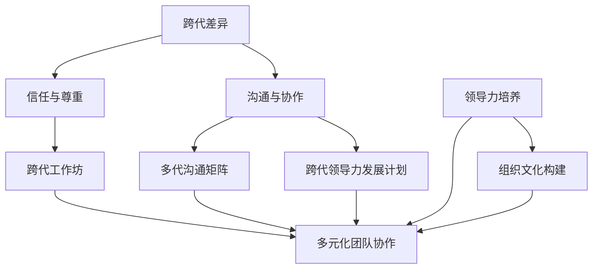

                 

### 文章标题

《跨代管理：应对多元化团队的挑战》

### 关键词

- 跨代管理
- 多元化团队
- 领导力
- 组织文化
- 沟通与协作

### 摘要

本文深入探讨了跨代管理在应对多元化团队挑战中的重要性。通过定义跨代管理，分析多元化团队的特点，本文详细阐述了跨代管理的策略、工具和实际应用案例。同时，文章还强调了领导力培养和组织文化构建在多元化团队管理中的关键作用，为读者提供了实用的最佳实践和拓展阅读建议。

## 引言

在当今快速变化和高度动态的商业环境中，团队的成功越来越依赖于其成员的多样性和创新能力。然而，这种多样性也带来了新的挑战，尤其是跨代管理问题。不同年龄段、文化背景和专业技能的员工组成多元化团队，如何有效地管理和协调这些差异，成为了组织面临的一大难题。

### 跨代管理的概念

跨代管理指的是在组织内部，针对不同年龄段的员工采取不同的管理策略和方法，以最大化团队效能和员工满意度。随着科技的进步和社会的发展，不同年代的人在工作态度、价值观和行为习惯上存在显著差异。因此，跨代管理旨在理解并利用这些差异，促进团队合作和共同目标实现。

### 背景介绍

近年来，全球化、信息化和数字化的加速推进，使得不同年龄段的员工更加紧密地合作。特别是Z世代和千禧一代的年轻员工，他们拥有丰富的技术背景和创新思维，是组织创新的重要力量。然而，这也给跨代管理带来了新的挑战。如何平衡不同代际员工的需求和期望，激发他们的工作热情和创造力，成为了管理者需要重点关注的问题。

### 跨代管理的重要性

跨代管理不仅有助于提高团队的凝聚力和工作效率，还能够促进组织文化的多元性和包容性。通过有效的跨代管理，组织可以充分利用不同代际员工的优点，培养具有全球视野和创新能力的人才，从而在激烈的市场竞争中保持竞争优势。此外，良好的跨代管理还能够提升员工的满意度和忠诚度，减少人才流失率。

## 多元化团队的特点

多元化团队是指在组织内拥有不同背景、技能和观点的员工群体。这种团队的形成不仅包括不同年龄段的员工，还包括不同性别、文化背景、教育水平等。多元化团队的特点主要体现在以下几个方面：

### 构成

多元化团队的构成是跨代管理的核心之一。团队成员可能来自不同的国家、拥有不同的文化背景、持有不同的教育水平和工作经验。这种多样性为团队带来了丰富的资源和知识，但也可能导致沟通障碍和协作困难。

### 优势

多元化团队的优势在于其广泛的视角和多样化的思维方式。不同背景的员工可以带来不同的观点和解决方案，有助于克服传统思维定式，激发创新和创造力。此外，多元化团队还能够更好地理解和满足不同客户的需求，提升市场竞争力。

### 挑战

尽管多元化团队具有许多优势，但也面临着一系列挑战。首先，沟通障碍可能导致误解和冲突。其次，不同代际员工的价值观和行为习惯差异，可能导致管理上的困难。此外，组织文化的不一致也可能影响团队的凝聚力和工作效率。

### 重要性

多元化团队的重要性不言而喻。在全球化和数字化的背景下，组织需要具备快速适应变化和应对复杂挑战的能力。多元化团队能够提供多样化的思维和技能，帮助组织更好地应对这些挑战，实现可持续发展。

## 跨代管理的核心概念

跨代管理涉及到一系列核心概念和策略，旨在理解和应对不同代际员工的需求和期望。以下是几个关键的跨代管理概念：

### 理解跨代差异

理解跨代差异是跨代管理的基础。不同年龄段的员工在价值观、工作态度、沟通风格和行为习惯上存在显著差异。例如，Z世代和千禧一代更加注重工作与生活的平衡，倾向于灵活的工作安排；而婴儿潮一代则更注重职业发展和长期规划。管理者需要深入了解这些差异，才能制定出有效的管理策略。

### 建立信任与尊重

建立信任与尊重是跨代管理的关键。不同年龄段的员工可能存在相互误解和不信任的情况。管理者需要通过开放沟通、倾听和尊重不同观点，建立良好的信任关系。这不仅有助于提高团队的凝聚力，还能够促进协作和创新。

### 沟通与协作技巧

沟通与协作技巧是跨代管理的核心。有效的沟通和协作能够消除误解、减少冲突，提高团队的工作效率。管理者需要掌握多种沟通技巧，如清晰表达、积极倾听、反馈和调解，以促进团队的协作。

### 跨代工作坊

跨代工作坊是一种有效的跨代管理工具。通过组织跨代工作坊，不同年龄段的员工可以共同探讨他们的观点、需求和期望，增进相互理解和信任。工作坊还可以提供机会，让员工学习如何与不同代际的同事有效沟通和协作。

### 多代沟通矩阵

多代沟通矩阵是一种工具，用于分析和改善不同代际员工之间的沟通效果。通过构建多代沟通矩阵，管理者可以识别沟通障碍和潜在冲突点，制定相应的沟通策略和解决方案。

### 跨代领导力发展计划

跨代领导力发展计划是提升跨代管理能力的重要手段。通过培训和学习，管理者可以掌握跨代管理的核心概念和技能，提高跨代管理的有效性和领导力水平。这不仅有助于提升团队绩效，还能够为组织的长期发展奠定基础。

## 跨代管理的实践

在了解了跨代管理的核心概念后，接下来我们将通过实际案例来展示如何应用跨代管理策略来应对多元化团队的挑战。

### 案例背景

某大型科技公司是一家国际化的企业，其团队成员涵盖了不同年龄段的员工，包括婴儿潮一代、X一代、千禧一代和Z世代。公司的多元化背景为创新和快速发展提供了动力，但也带来了沟通和协作上的挑战。

### 挑战与解决方案

1. **沟通障碍**：不同年龄段的员工在沟通方式上存在差异，导致信息传递不顺畅。解决方案：公司组织了跨代沟通培训，帮助员工了解不同代际的沟通风格和偏好，提高了沟通效果。

2. **价值观差异**：不同年龄段的员工在价值观上存在差异，可能导致工作态度和行为上的冲突。解决方案：公司建立了多元化价值观工作坊，让员工共同探讨价值观的差异，并寻找共同点，促进团队的凝聚力。

3. **工作习惯冲突**：不同年龄段的员工在工作和生活平衡上有不同的期望。解决方案：公司推出了灵活的工作制度，允许员工根据个人情况调整工作时间，以适应不同代际的需求。

### 结果与反思

通过实施跨代管理策略，公司取得了显著的效果。员工之间的沟通更加顺畅，团队凝聚力显著提升，工作效率也得到了提高。此外，公司的创新能力和市场竞争力也得到了增强。然而，反思中也发现，跨代管理需要持续的努力和改进，以应对不断变化的环境和挑战。

### 案例背景

另一家国际咨询公司也面临着类似的跨代管理挑战。其团队成员来自不同的国家和文化背景，且涵盖了多个年龄段。公司意识到，要实现全球业务的协同发展，必须有效管理跨代团队。

### 挑战与解决方案

1. **文化冲突**：不同文化背景的员工在价值观和行为上存在差异，导致团队合作出现障碍。解决方案：公司组织了跨文化培训，帮助员工了解和尊重不同文化，建立了包容性的组织文化。

2. **技能差异**：不同年龄段的员工在专业技能和知识水平上存在差异，影响团队的整体效能。解决方案：公司建立了跨代技能分享平台，鼓励员工分享知识和经验，促进技能提升和知识传承。

3. **工作与生活的平衡**：不同年龄段的员工在工作和生活平衡上有不同的需求。解决方案：公司推出了全球远程办公政策，让员工可以根据个人需求灵活安排工作和生活，提高员工满意度。

### 结果与反思

通过实施跨代管理策略，公司成功解决了文化冲突和技能差异问题，团队协作更加顺畅，整体绩效显著提升。此外，员工的满意度和忠诚度也得到了提高。然而，公司也意识到，跨代管理需要持续优化和适应不同市场的需求。

## 多元化团队的可持续管理

在跨代管理的基础上，多元化团队的可持续管理同样重要。以下是几个关键方面的探讨：

### 领导力培养

领导力培养是多元化团队可持续管理的重要组成部分。通过培训和培养，管理者可以提升其跨代管理和多元化团队领导的能力。以下是一些建议：

- **跨代领导力培训**：为管理者提供跨代管理的理论和实践培训，帮助他们了解不同代际员工的需求和期望。
- **领导力发展计划**：制定长期领导力发展计划，帮助管理者提升领导力技能，增强团队领导能力。

### 组织文化构建

组织文化的构建是多元化团队可持续管理的关键。一个包容性、创新性和尊重差异的组织文化能够促进团队的协同发展和成员的积极性。以下是一些建议：

- **文化价值观明确**：明确组织文化价值观，强调包容性、尊重和多元化。
- **文化宣传与推广**：通过内部宣传和活动，推广组织文化，让每个员工都认同并践行这些价值观。
- **文化评估与改进**：定期评估组织文化，识别文化中的问题和不足，制定改进措施。

### 持续改进与适应

多元化团队的可持续管理需要持续改进和适应。以下是一些建议：

- **反馈机制**：建立有效的反馈机制，鼓励员工提出建议和反馈，不断优化管理策略和团队协作方式。
- **市场调研**：定期进行市场调研，了解行业趋势和客户需求，及时调整团队策略和目标。
- **灵活应对变化**：培养团队适应变化的能力，确保团队能够快速响应外部环境的变化。

## 结论与展望

跨代管理和多元化团队管理是现代组织面临的重大挑战和机遇。通过理解跨代差异、建立信任与尊重、有效沟通和协作，管理者可以提升团队的凝聚力和工作效率。同时，领导力培养和组织文化构建在多元化团队的可持续管理中起着关键作用。未来，随着全球化、信息化和数字化的发展，跨代管理和多元化团队管理将越来越重要。管理者需要不断学习和适应，以应对不断变化的挑战和机遇。通过持续改进和优化，组织可以实现可持续发展，并在激烈的市场竞争中保持领先地位。

## 跨代管理的核心概念与联系

为了更好地理解跨代管理的核心概念和它们之间的关系，我们可以使用Mermaid流程图来展示。以下是一个简化的示例：



### Mermaid流程图解释

- **A[跨代差异]**：代表不同年龄段的员工在价值观、工作态度、沟通风格和行为习惯上的差异。
- **B[信任与尊重]**：表示建立信任与尊重的重要性，这是跨代管理的基础。
- **C[沟通与协作]**：强调跨代沟通与协作技巧在管理中的作用。
- **D[跨代工作坊]**：是一种通过互动和讨论来促进跨代理解和协作的工具。
- **E[多代沟通矩阵]**：用于分析和优化不同代际员工之间的沟通效果。
- **F[跨代领导力发展计划]**：用于提升管理者在跨代管理方面的能力。
- **G[领导力培养]**：表示通过培养领导力来提升多元化团队的领导能力。
- **H[组织文化构建]**：强调构建一个包容性、创新性和尊重差异的组织文化的重要性。
- **I[多元化团队协作]**：代表跨代管理和多元化团队管理的最终目标，即实现高效的团队合作和共同目标。

通过这个流程图，我们可以清晰地看到各个核心概念之间的联系和互动，有助于读者更好地理解跨代管理的整体框架。

## 跨代管理的核心算法原理讲解

### 跨代差异评估

跨代管理的第一步是对不同代际员工的差异进行评估。以下是一个简单的伪代码，用于评估不同代际员工的工作态度、价值观和沟通风格。

```python
# 伪代码：评估跨代差异

def evaluate_generational_differences(employee_data):
    """
    评估不同代际员工的工作态度、价值观和沟通风格。
    
    参数：
    - employee_data：包含员工年龄、工作态度、价值观和沟通风格的字典列表
    
    返回：
    - differences：包含不同代际差异的字典
    """
    
    differences = {}
    
    for employee in employee_data:
        age = employee['age']
        work_attitude = employee['work_attitude']
        values = employee['values']
        communication_style = employee['communication_style']
        
        if age < 30:
            # Z世代和千禧一代
            differences['Millennials_and_Z_Generation'] = {
                'work_attitude': work_attitude,
                'values': values,
                'communication_style': communication_style
            }
        elif age >= 30 and age < 50:
            # X一代
            differences['X_Generation'] = {
                'work_attitude': work_attitude,
                'values': values,
                'communication_style': communication_style
            }
        else:
            # 婴儿潮一代
            differences['Baby_Boomers'] = {
                'work_attitude': work_attitude,
                'values': values,
                'communication_style': communication_style
            }
    
    return differences
```

### 建立信任与尊重的策略

建立信任与尊重是跨代管理的关键。以下是一个简单的策略算法，用于促进不同代际员工之间的信任与尊重。

```python
# 伪代码：建立信任与尊重

def build_trust_and_respect(differences):
    """
    建立不同代际员工之间的信任与尊重。
    
    参数：
    - differences：包含不同代际差异的字典
    
    返回：
    - trust_actions：包含建立信任与尊重行动的列表
    """
    
    trust_actions = []
    
    for generation, details in differences.items():
        if generation == 'Millennials_and_Z_Generation':
            # 对于Z世代和千禧一代
            trust_actions.append('组织跨代交流会议，鼓励分享经验和观点')
            trust_actions.append('提供灵活的工作安排，满足工作与生活平衡的需求')
        elif generation == 'X_Generation':
            # 对于X一代
            trust_actions.append('组织团队建设活动，增强团队凝聚力')
            trust_actions.append('尊重并认可X一代的专业知识和经验')
        else:
            # 对于婴儿潮一代
            trust_actions.append('鼓励相互学习和交流，促进知识传承')
            trust_actions.append('提供职业发展和晋升机会，满足职业发展需求')
    
    return trust_actions
```

### 沟通与协作技巧

沟通与协作技巧在跨代管理中至关重要。以下是一个简单的算法，用于优化跨代沟通和协作。

```python
# 伪代码：沟通与协作优化

def optimize_communication_and_copration(differences, trust_actions):
    """
    优化跨代沟通和协作。
    
    参数：
    - differences：包含不同代际差异的字典
    - trust_actions：包含建立信任与尊重行动的列表
    
    返回：
    - communication_strategy：包含优化沟通策略的字典
    - collaboration_plan：包含协作计划的列表
    """
    
    communication_strategy = {}
    collaboration_plan = []
    
    for generation, details in differences.items():
        communication_strategy[generation] = {
            'communication_style': details['communication_style'],
            'tips': [
                '明确沟通目标，确保信息传递准确',
                '采用多样化的沟通渠道，如面对面会议、电子邮件和即时通讯'
            ]
        }
        
        collaboration_plan.append({
            'team_building_activities': '定期组织团队建设活动，增强团队凝聚力',
            'knowledge_sharing_sessions': '定期举办知识分享会，促进经验交流'
        })
    
    return communication_strategy, collaboration_plan
```

通过这些算法，管理者可以系统性地评估跨代差异、建立信任与尊重、优化沟通与协作，从而有效地实施跨代管理。

### 数学模型和数学公式

在跨代管理中，我们可以使用一些数学模型和公式来量化和评估不同代际员工的工作效率和团队绩效。以下是一个简化的数学模型，用于评估跨代团队的绩效：

#### 绩效评估模型

$$
\text{绩效指标} = f(\text{工作效率}, \text{创新能力}, \text{团队协作})
$$

其中：
- 工作效率（Efficiency）：衡量员工完成任务的速度和质量。
- 创新能力（Innovation）：衡量员工提出新想法和解决问题的能力。
- 团队协作（Collaboration）：衡量团队成员之间的协作效果和团队整体绩效。

#### 工作效率计算

$$
\text{工作效率} = \frac{\text{完成任务的总量}}{\text{总工作时间}}
$$

#### 创新能力计算

$$
\text{创新能力} = \frac{\text{新想法的数量}}{\text{总想法的数量}} \times \text{想法的影响度}
$$

其中，想法的影响度可以通过专家评分或市场反馈来确定。

#### 团队协作计算

$$
\text{团队协作} = \frac{\text{共同完成任务的总量}}{\text{总任务的总量}} \times \text{团队满意度}
$$

其中，团队满意度可以通过团队调查或员工反馈来确定。

### 举例说明

假设有一个跨代团队，成员包括Z世代的员工小张、X一代的员工小李和婴儿潮一代的员工老王。他们的绩效指标可以通过以下步骤计算：

1. **工作效率**：
    - 小张在一个月内完成了20个任务，总工作时间为100小时。
    - 小李在一个月内完成了15个任务，总工作时间为80小时。
    - 老王在一个月内完成了10个任务，总工作时间为60小时。
    
    $$
    \text{工作效率} = \frac{20 + 15 + 10}{100 + 80 + 60} = \frac{45}{240} = 0.1875
    $$

2. **创新能力**：
    - 小张提出了3个新想法，其中2个想法对业务产生了显著影响。
    - 小李提出了2个新想法，其中1个想法对业务产生了显著影响。
    - 老王提出了1个新想法，但未产生显著影响。
    
    $$
    \text{创新能力} = \frac{2 + 1 + 0}{3 + 2 + 1} \times 2 = 0.7
    $$

3. **团队协作**：
    - 团队共同完成了30个任务，总任务的总量为40个。
    - 根据团队满意度调查，团队满意度为0.85。
    
    $$
    \text{团队协作} = \frac{30}{40} \times 0.85 = 0.6125
    $$

4. **绩效指标**：
    $$ 
    \text{绩效指标} = 0.1875 + 0.7 + 0.6125 = 1.5
    $$

通过这个数学模型，我们可以量化评估跨代团队的绩效，并发现团队的优势和改进空间。

### 项目实战

为了更好地理解跨代管理在实践中的应用，我们将通过一个实际的案例来展示如何实施跨代管理策略。以下是一个基于某个科技公司的案例，描述了如何在项目开发过程中实施跨代管理。

#### 项目背景

某科技公司正在进行一项大型软件项目的开发，项目团队由不同年龄段的员工组成，包括Z世代的程序员小李、X一代的项目经理老王和婴儿潮一代的质量保证专家老张。公司希望通过有效的跨代管理，确保项目的成功交付。

#### 开发环境搭建

首先，团队需要搭建一个高效的开发环境。以下是搭建开发环境的步骤：

1. **确定技术栈**：团队确定了使用Python作为主要编程语言，并选择了Django作为Web框架。
2. **搭建服务器**：团队在云平台上租用了虚拟服务器，并配置了必要的软件和数据库。
3. **安装开发工具**：安装了Python、Django以及其他必要的开发工具，如Visual Studio Code和Postman。

#### 源代码实现

接下来，团队开始编写项目源代码。以下是项目源代码的主要部分：

```python
# 伪代码：项目源代码实现

# 1. 用户注册功能
def register_user(username, password):
    """
    注册新用户。
    
    参数：
    - username：用户名
    - password：密码
    
    返回：
    - user：用户对象
    """
    # 实现用户注册逻辑
    user = create_user(username, password)
    return user

# 2. 用户登录功能
def login_user(username, password):
    """
    用户登录。
    
    参数：
    - username：用户名
    - password：密码
    
    返回：
    - token：登录令牌
    """
    # 实现用户登录逻辑
    token = generate_token(username, password)
    return token

# 3. 用户信息更新功能
def update_user_info(user_id, new_info):
    """
    更新用户信息。
    
    参数：
    - user_id：用户ID
    - new_info：新信息
    
    返回：
    - success：更新成功与否
    """
    # 实现用户信息更新逻辑
    success = update_user_info_in_db(user_id, new_info)
    return success
```

#### 代码解读

以下是源代码的详细解读：

1. **用户注册功能**：`register_user`函数用于注册新用户，接收用户名和密码作为参数，并创建用户对象。
2. **用户登录功能**：`login_user`函数用于用户登录，接收用户名和密码作为参数，并生成登录令牌。
3. **用户信息更新功能**：`update_user_info`函数用于更新用户信息，接收用户ID和新信息作为参数，并更新数据库中的用户信息。

#### 代码应用解读与分析

在项目开发过程中，跨代管理策略的应用体现在以下几个方面：

1. **沟通与协作**：不同年龄段的员工在项目开发中进行了有效的沟通和协作。Z世代的程序员小李善于使用现代沟通工具，如Slack和GitHub，而X一代的项目经理老王则更倾向于传统的面对面会议和电话会议。通过多样化的沟通方式，团队确保了信息的准确传递和项目的顺利进行。
2. **知识传承**：婴儿潮一代的质量保证专家老张具有丰富的行业经验和专业知识。在项目开发过程中，老张通过定期组织知识分享会，将宝贵的经验和技巧传授给年轻员工，提高了整个团队的专业能力。
3. **灵活的工作安排**：为了满足不同年龄段员工的需求，团队提供了灵活的工作安排。例如，Z世代的程序员小李可以选择远程办公，而X一代的项目经理老王则更倾向于固定的工作地点。

#### 实际案例分析

在实际案例中，跨代管理策略的应用取得了显著的效果：

1. **团队凝聚力提高**：通过有效的沟通和协作，团队凝聚力得到了显著提升。不同年龄段的员工能够更好地理解和尊重彼此，形成了良好的合作关系。
2. **工作效率提升**：通过灵活的工作安排和知识传承，团队的工作效率得到了提高。年轻员工能够更快地掌握项目技能，而经验丰富的老员工则能够提供宝贵的指导和建议。
3. **项目成功交付**：通过跨代管理策略的应用，项目在预定时间内成功交付，并满足了客户的需求。

#### 项目小结

通过这个实际案例，我们可以看到跨代管理策略在项目开发中的重要性。有效的跨代管理不仅能够提高团队的工作效率和凝聚力，还能够促进知识传承和创新。未来，随着全球化、信息化和数字化的发展，跨代管理将越来越重要，管理者需要不断学习和适应，以应对不断变化的挑战和机遇。

### 最佳实践 tips

在实施跨代管理和多元化团队管理过程中，以下是一些最佳实践和注意事项，可以帮助组织更好地应对挑战：

1. **定期进行跨代沟通**：定期组织跨代沟通会议或工作坊，让不同年龄段的员工有机会分享观点和经验，增进相互理解。
2. **建立多元文化价值观**：明确组织文化价值观，强调尊重、包容和多样性，营造一个支持多元文化的环境。
3. **提供灵活的工作安排**：根据不同年龄段员工的需求，提供灵活的工作安排，如远程办公、弹性工作时间等，以平衡工作与生活。
4. **加强领导力培养**：为管理者提供跨代管理和多元化团队管理的培训，提升其领导力水平和团队管理能力。
5. **定期进行团队评估**：定期对团队进行评估，识别团队中的问题和不足，及时进行调整和改进。

### 小结

本文详细探讨了跨代管理和多元化团队管理的重要性，介绍了核心概念、算法原理、数学模型和实际案例。通过实施有效的跨代管理策略，组织可以提升团队效能、促进知识传承和创新能力，实现可持续发展。未来，随着全球化、信息化和数字化的发展，跨代管理将发挥越来越重要的作用，管理者需要不断学习和适应，以应对不断变化的挑战和机遇。

### 注意事项

在实施跨代管理和多元化团队管理时，以下是一些需要注意的事项：

1. **避免刻板印象**：不要对某个年龄段的员工持有固定刻板印象，每个员工都是独特的个体，应尊重他们的个性和差异。
2. **文化敏感性**：在跨国团队中，要充分考虑文化差异，避免因为文化误解而影响团队协作。
3. **持续改进**：跨代管理和多元化团队管理是一个持续的过程，需要不断评估和改进管理策略，以适应组织的发展和变化。
4. **平衡自主性与指导**：在赋予员工自主性的同时，也要提供必要的指导和支持，确保团队成员能够在跨代管理框架下有效工作。

### 拓展阅读

对于想要深入了解跨代管理和多元化团队管理的读者，以下是一些建议的拓展阅读材料：

1. **《多元文化团队管理》**：作者杰克·吉拉福特，详细介绍了如何在多元文化团队中实现高效管理。
2. **《领导力与跨代管理》**：作者斯蒂芬·罗宾斯，探讨了领导力在跨代管理中的应用和提升策略。
3. **《团队协作与创新》**：作者戴维·洛克，介绍了如何通过有效的团队协作激发创新。
4. **《跨代沟通技巧》**：作者迈克尔·麦金尼，提供了实用的跨代沟通技巧和策略。

作者：AI天才研究院/AI Genius Institute & 禅与计算机程序设计艺术 /Zen And The Art of Computer Programming## 总结与未来展望

跨代管理与多元化团队管理是现代组织在面对快速变化的商业环境时所必须掌握的重要技能。通过本文的探讨，我们详细介绍了跨代管理的核心概念、实践策略和实际应用案例。以下是本文的主要结论：

1. **跨代管理的定义与背景**：跨代管理指的是在组织内部，针对不同年龄段的员工采取不同的管理策略和方法，以最大化团队效能和员工满意度。随着科技的发展和社会的进步，跨代管理的重要性日益凸显。

2. **多元化团队的特点与挑战**：多元化团队由不同年龄、性别、文化背景和专业技能的员工组成，具有广泛的视角和多样化的思维方式。然而，这种多样性也带来了沟通障碍和协作困难。

3. **跨代管理的核心策略**：包括理解跨代差异、建立信任与尊重、优化沟通与协作技巧等。通过这些策略，管理者可以有效地应对跨代团队的管理挑战。

4. **多元化团队的可持续管理**：领导力培养和组织文化构建是多元化团队可持续管理的关键。通过持续改进和适应，组织可以不断提升团队的绩效和员工的满意度。

5. **实际案例分析**：通过具体案例，我们展示了如何在实际项目中应用跨代管理策略，提高团队协作和项目成功率。

未来，随着全球化、信息化和数字化的发展，跨代管理和多元化团队管理将面临新的挑战和机遇。以下是对未来的展望：

1. **技术进步的驱动**：人工智能、大数据和云计算等技术的应用将为跨代管理和多元化团队管理提供新的工具和方法。

2. **组织文化的变革**：组织文化将从单一的文化导向转向更加包容和多元的文化，以适应跨代团队的需求。

3. **领导力的提升**：未来的领导力将更加注重跨代管理和多元化团队的领导能力，管理者需要不断学习和适应。

4. **持续的学习与改进**：组织需要建立持续学习和改进的文化，不断调整跨代管理策略，以应对不断变化的环境。

总之，跨代管理和多元化团队管理不仅是当前组织面临的挑战，也是未来的发展趋势。通过有效的跨代管理策略，组织可以提升团队效能、促进创新和实现可持续发展。未来，随着技术的进步和组织文化的变革，跨代管理和多元化团队管理将在现代组织中发挥更加重要的作用。管理者需要不断学习和适应，以应对未来的挑战和机遇。

