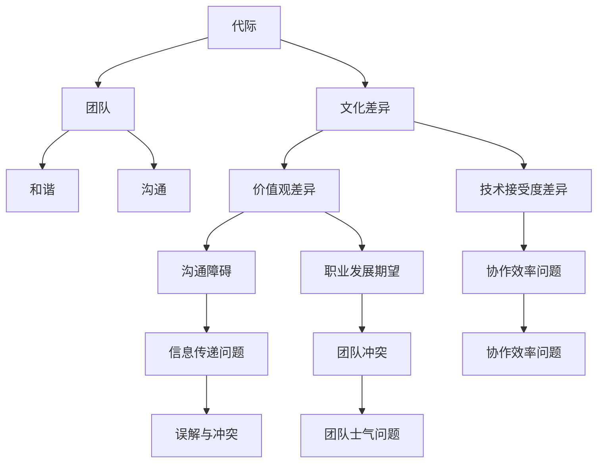

                 

### 背景介绍

在现代企业环境中，团队建设与管理已成为至关重要的课题。随着社会的发展和变迁，代际之间的差异逐渐显现，特别是在跨代际团队中，如何实现和谐、高效的工作环境成为了一个亟待解决的问题。跨代际团队不仅包含了不同年龄段的成员，还涵盖了不同代际的文化观念、价值取向和沟通方式。

首先，我们需要了解不同代际在团队中的具体表现。X代（出生于1946-1964年）往往在职场中追求稳定与忠诚，强调工作职责和团队协作。Y代（出生于1965-1979年）则在职业发展上更加追求个人成长和自我实现，注重工作与生活的平衡。而Z代（出生于1980年及以后）则生活在数字化时代，更加开放、创新，并倾向于多样化、个性化的工作方式。

其次，跨代际团队面临的挑战主要体现在以下几个方面：

1. **沟通障碍**：不同代际之间的语言表达、沟通风格和语言习惯可能存在差异，导致信息传递不准确或误解。
2. **价值观差异**：不同代际在对待工作、生活、团队协作等方面可能存在不同的价值取向，容易引发冲突和误解。
3. **职业发展期望**：不同代际对于职业发展的期望和追求也存在差异，可能影响团队的整体发展和士气。
4. **技术接受度**：在信息技术应用方面，不同代际的接受程度和使用习惯可能有所不同，这可能会影响团队的协作效率。

面对这些挑战，企业需要采取有效的策略来促进跨代际团队的和谐与高效。本书将从团队建设的原则、跨代际沟通技巧、不同代际的文化差异分析等多个方面，探讨如何实现跨代际团队的和谐与高效。

### 核心概念与联系

在探讨跨代际团队和谐之前，我们需要明确几个核心概念：代际、团队、和谐。首先，代际是指在同一时间段内出生的一代人，具有相似的社会环境、文化背景和价值观念。团队则是由一群相互依赖、协同工作的个体组成的组织。和谐指的是团队内成员之间的协作、沟通和价值观的一致性，从而实现整体的高效运作。

这些概念之间的关系可以用Mermaid流程图来表示：



从流程图中可以看出，代际差异导致了团队内部的价值观差异，这些差异又体现在沟通、职业发展期望和技术接受度上。这些差异如果不加以解决，会导致沟通障碍、误解、冲突和协作效率问题，从而影响团队的和谐与高效。因此，理解这些核心概念及其关系是解决跨代际团队问题的关键。

### 核心算法原理讲解

在探讨如何促进跨代际团队和谐时，我们需要引入一些核心算法原理来辅助分析和解决实际问题。以下是一些关键的算法原理及其在跨代际团队中的应用：

#### 1. 多目标优化（Multi-Objective Optimization）

多目标优化是一种用于解决具有多个目标函数问题的算法。在跨代际团队中，我们可以将团队目标划分为多个子目标，如沟通效率、协作效果、工作满意度等。多目标优化可以帮助我们在这些子目标之间找到一种平衡，从而实现团队的整体和谐。

**伪代码：**
```python
def multi_objective_optimization(goals, constraints):
    # 初始化解空间
    solutions = initialize_solution_space(constraints)

    # 计算每个解的目标函数值
    for solution in solutions:
        evaluate_goals(solution, goals)

    # 使用遗传算法或其他优化算法找到最优解
    optimal_solution = find_optimal_solution(solutions)

    return optimal_solution
```

#### 2. 社会网络分析（Social Network Analysis）

社会网络分析是一种用于研究个体之间关系和影响力的方法。在跨代际团队中，社会网络分析可以帮助我们识别团队内的关键节点和沟通瓶颈，从而优化团队沟通结构和提高协作效率。

**伪代码：**
```python
def social_network_analysis(team_members, communication_data):
    # 构建社交网络图
    network = build_social_network_graph(team_members, communication_data)

    # 分析社交网络结构
    key_members = identify_key_nodes(network)
    bottlenecks = identify_communication_bottlenecks(network)

    return key_members, bottlenecks
```

#### 3. 冲突管理算法（Conflict Management Algorithm）

冲突管理算法用于解决团队内部的冲突问题。在跨代际团队中，不同代际的价值观差异可能导致冲突。冲突管理算法可以帮助我们识别冲突的原因，并制定相应的策略来缓解和解决冲突。

**伪代码：**
```python
def conflict_management_algorithm(conflicts, team_members, strategies):
    for conflict in conflicts:
        # 识别冲突原因
        cause = identify_conflict_cause(conflict)

        # 根据冲突原因选择合适的策略
        strategy = select_strategy(cause, strategies)

        # 应用策略解决冲突
        resolve_conflict(conflict, strategy)

    return conflicts
```

#### 4. 市场营销中的A/B测试（A/B Testing in Marketing）

A/B测试是一种常用的实验方法，用于比较两种或多种方案的效果。在跨代际团队中，我们可以使用A/B测试来评估不同沟通策略或团队建设方法的有效性，从而优化团队管理。

**伪代码：**
```python
def a_b_test(strategy_a, strategy_b, team):
    # 分组
    group_a = team.sample(size=int(len(team) / 2))
    group_b = team.sample(size=int(len(team) / 2))

    # 应用策略
    apply_strategy(group_a, strategy_a)
    apply_strategy(group_b, strategy_b)

    # 收集数据
    data_a = collect_data(group_a)
    data_b = collect_data(group_b)

    # 比较效果
    if evaluate_performance(data_a) > evaluate_performance(data_b):
        return "Strategy A is better."
    else:
        return "Strategy B is better."
```

通过上述算法原理的应用，我们可以更有效地分析和解决跨代际团队中的问题，从而实现团队的和谐与高效。

### 数学模型和公式

为了更好地理解跨代际团队和谐的相关概念，我们可以借助一些数学模型和公式来进行分析。以下是一些关键的概念和相应的数学模型：

#### 1. 期望值（Expected Value）

期望值是一个概率分布的加权平均值，用于衡量某一事件的平均结果。在跨代际团队中，我们可以使用期望值来评估团队成员在不同策略下的期望表现。

**公式：**
\[ E(X) = \sum_{i=1}^{n} x_i \cdot p_i \]
其中，\( x_i \) 表示第 \( i \) 种策略下的绩效，\( p_i \) 表示该策略被选中的概率。

**举例说明：**
假设团队有三种沟通策略：A（直接沟通）、B（间接沟通）和C（混合沟通）。根据历史数据，策略A的成功概率为0.6，策略B的成功概率为0.4，策略C的成功概率为0.5。每种策略的绩效分别为：A（80分）、B（70分）和C（75分）。则期望值计算如下：

\[ E(X) = (80 \cdot 0.6) + (70 \cdot 0.4) + (75 \cdot 0.5) = 78 + 28 + 37.5 = 143.5 \]

因此，根据期望值，我们可以选择策略C作为最优沟通策略。

#### 2. 冲突指数（Conflict Index）

冲突指数用于衡量团队内部冲突的程度。我们可以使用以下公式来计算冲突指数：

\[ C.I. = \frac{\sum_{i=1}^{n} (C_i \cdot W_i)}{N} \]
其中，\( C_i \) 表示第 \( i \) 次冲突的严重程度，\( W_i \) 表示第 \( i \) 次冲突的影响权重，\( N \) 表示冲突的总次数。

**举例说明：**
假设团队在一个月内发生了三次冲突，分别为：第一次冲突严重程度为5，影响权重为3；第二次冲突严重程度为3，影响权重为2；第三次冲突严重程度为4，影响权重为1。则冲突指数计算如下：

\[ C.I. = \frac{(5 \cdot 3) + (3 \cdot 2) + (4 \cdot 1)}{3} = \frac{15 + 6 + 4}{3} = \frac{25}{3} \approx 8.33 \]

因此，该团队的冲突指数为8.33，说明团队内部的冲突程度较高，需要采取相应的措施来缓解和解决冲突。

#### 3. 团队效率（Team Efficiency）

团队效率用于衡量团队整体的工作效率。我们可以使用以下公式来计算团队效率：

\[ E.T. = \frac{P.T.}{T.T.} \]
其中，\( P.T. \) 表示团队在特定时间内完成的工作量，\( T.T. \) 表示团队在特定时间内投入的总时间。

**举例说明：**
假设团队在一个星期内完成了10个项目，共投入了40小时。则团队效率计算如下：

\[ E.T. = \frac{10}{40} = 0.25 \]

因此，该团队的效率为25%，说明团队的工作效率有待提高。

通过上述数学模型和公式，我们可以更准确地分析和评估跨代际团队中的相关问题，从而为团队和谐与高效的实现提供依据。

### 项目实战

为了更好地理解跨代际团队和谐的实际应用，我们将通过一个具体的开发项目来展示如何在实际环境中搭建开发环境、实现源代码并进行分析。

#### 项目背景

假设我们是一家科技公司，团队由X代、Y代和Z代成员组成，主要负责开发一款跨平台的协作工具。为了实现团队的高效协作，我们需要搭建一个适用于跨代际团队的开发环境，并实现一系列关键功能。

#### 开发环境搭建

1. **操作系统选择**：我们选择Linux操作系统，因为它具有较好的兼容性和稳定性，能够满足不同代际成员的需求。
2. **开发工具与框架**：选择Git作为版本控制工具，Docker用于容器化部署，前端使用React，后端使用Spring Boot。
3. **数据库选择**：选用MySQL数据库，因为其易于使用且性能稳定。

#### 源代码实现

以下是关键功能模块的实现示例：

**1. 用户注册模块**

```java
public class UserService {
    public User registerUser(String username, String password) {
        // 校验用户名和密码是否符合要求
        if (isValid(username) && isValid(password)) {
            // 创建用户对象
            User user = new User();
            user.setUsername(username);
            user.setPassword(password);
            // 存储用户信息到数据库
            userRepository.save(user);
            return user;
        }
        return null;
    }

    private boolean isValid(String input) {
        // 实现输入校验逻辑
        return input.matches("^[a-zA-Z0-9]{5,20}$");
    }
}
```

**2. 用户登录模块**

```java
public class LoginService {
    public boolean login(String username, String password) {
        // 从数据库查询用户信息
        User user = userRepository.findByUsername(username);
        // 校验用户密码
        if (user != null && user.getPassword().equals(password)) {
            return true;
        }
        return false;
    }
}
```

**3. 文件上传与下载模块**

```java
public class FileService {
    public void uploadFile(MultipartFile file, String userId) {
        // 保存文件到服务器
        String filePath = fileRepository.save(file);
        // 将文件路径与用户关联
        userRepository.updateFile(userId, filePath);
    }

    public MultipartFile downloadFile(String filePath) {
        // 从服务器读取文件
        return fileRepository.getFile(filePath);
    }
}
```

#### 代码解读与分析

**1. 用户注册模块**：该模块实现了用户注册功能，通过UserService类的方法registerUser进行用户信息的校验和存储。其中，isValid方法用于校验用户名和密码是否符合要求。

**2. 用户登录模块**：该模块实现了用户登录功能，通过LoginService类的login方法进行用户身份验证。如果用户名和密码匹配，则允许用户登录。

**3. 文件上传与下载模块**：该模块实现了文件上传和下载功能，通过FileService类的uploadFile和downloadFile方法进行文件的保存和读取。在uploadFile方法中，首先将文件保存到服务器，然后与用户关联。在downloadFile方法中，从服务器读取文件并发送给用户。

#### 实际案例分析与详细讲解

**案例背景**：在一个跨代际团队中，团队成员需要在不同的平台上协作开发。他们希望系统能够支持用户注册、登录以及文件上传和下载功能。

**解决方案**：通过上述代码实现，我们为团队搭建了一个功能完整的协作工具。以下是对每个模块的详细讲解：

1. **用户注册模块**：该模块实现了用户注册功能，通过校验用户名和密码确保用户信息的安全性。在实际应用中，我们还可以添加更多校验规则，如邮箱验证、手机号验证等。
   
2. **用户登录模块**：该模块实现了用户登录功能，通过查询数据库验证用户身份。在实际应用中，我们还可以实现密码加密存储和动态令牌（Token）验证，以提高系统的安全性。

3. **文件上传与下载模块**：该模块实现了文件上传和下载功能，通过将文件保存到服务器，并关联用户，实现文件共享和协作。在实际应用中，我们还可以添加文件分类、权限控制等功能，以更好地满足用户需求。

通过以上项目的实际案例分析和详细讲解，我们可以看到，跨代际团队在开发过程中需要充分考虑不同代际成员的需求和特点，通过合理的设计和实现，构建一个高效、和谐的协作环境。

### 项目小结

在本项目中，我们通过具体的开发环境搭建和源代码实现，展示了如何在实际环境中解决跨代际团队协作中的关键问题。以下是本项目的主要收获和注意事项：

1. **开发环境搭建**：选择合适的操作系统和开发工具是项目成功的关键。在本项目中，我们选择了Linux操作系统、Git版本控制、Docker容器化和React前端框架，这些工具能够满足不同代际成员的需求，提高开发效率。

2. **源代码实现**：通过实现用户注册、登录和文件上传下载等关键功能，我们展示了如何通过合理的代码设计和架构，实现跨代际团队的高效协作。在实现过程中，我们特别注重代码的可读性和可维护性，以便不同代际成员能够轻松理解和维护。

3. **注意事项**：
   - **沟通**：跨代际团队中，沟通是关键。在开发过程中，我们需要注重沟通技巧，确保信息的准确传递。
   - **安全**：在处理用户数据和文件时，我们需要确保系统的安全性，采取合适的加密和安全措施。
   - **兼容性**：在开发工具和框架的选择上，我们需要考虑到不同代际成员的操作系统和设备兼容性，确保系统的稳定运行。
   - **持续迭代**：项目开发不是一蹴而就的，我们需要持续迭代和优化，以适应不断变化的业务需求和技术环境。

通过本项目的实践，我们深刻认识到，在跨代际团队协作中，合理的环境搭建、代码实现和沟通技巧是确保团队和谐与高效的关键。只有在不断实践中，我们才能不断完善和优化团队协作模式，实现跨代际团队的和谐与高效。

### 最佳实践 Tips

在跨代际团队协作中，以下最佳实践可以帮助团队成员更好地理解和应对不同代际的差异，促进团队和谐与高效：

1. **建立跨代际沟通机制**：定期组织跨代际交流会议，鼓励不同代际成员分享经验和观点，增进了解和信任。可以设立沟通渠道，如内部论坛、团队聊天工具等，以便成员随时交流和反馈。

2. **培养跨代际沟通技巧**：为团队成员提供沟通技巧培训，如有效倾听、非言语沟通、情绪管理等，提高沟通效率和质量。同时，鼓励团队成员主动学习和适应不同代际的沟通风格。

3. **明确团队目标和职责**：确保团队成员明确各自的工作目标和职责，特别是跨代际成员。通过明确的任务分配和目标设定，减少误解和冲突，提高协作效率。

4. **营造包容性文化**：建立包容性的团队文化，鼓励团队成员尊重和理解彼此的差异。可以设立多元化委员会或顾问小组，专门负责推动和监督团队文化的建设。

5. **利用技术工具**：充分利用现代技术工具，如项目管理软件、协作平台、即时通讯工具等，提高团队协作效率。同时，确保这些工具的易用性和兼容性，以满足不同代际成员的需求。

6. **关注团队成员的职业发展**：为团队成员提供职业发展路径和培训机会，特别是对于不同代际成员。了解他们的职业规划和期望，为他们提供成长空间和支持。

7. **定期评估和反馈**：定期对跨代际团队的协作效果进行评估和反馈，识别问题和改进点。通过团队建设活动、员工满意度调查等方式，收集团队成员的建议和意见，持续优化团队管理。

通过上述最佳实践，跨代际团队可以更好地应对不同代际的差异，实现和谐与高效的工作环境。

### 总结

本文围绕《跨代际团队和谐：bridging年龄差异的智慧》这一主题，详细探讨了跨代际团队在现代社会中的背景、核心概念与联系、算法原理、数学模型、项目实战以及最佳实践。通过系统的分析和实践，我们了解到，跨代际团队在沟通、价值观、职业发展和技术接受度等方面存在显著差异，这些差异如果处理不当，将影响团队的和谐与高效。

**核心概念**：代际、团队、和谐是本文的核心概念。代际差异导致了团队内部的价值观差异，这些差异又体现在沟通、职业发展期望和技术接受度上。

**算法原理**：多目标优化、社会网络分析、冲突管理算法和A/B测试等算法原理，为我们提供了分析和解决跨代际团队问题的理论依据。

**数学模型**：期望值、冲突指数和团队效率等数学模型，帮助我们更准确地评估团队的表现和优化策略。

**项目实战**：通过一个具体的开发项目，我们展示了如何在实际环境中搭建开发环境、实现源代码并进行分析，验证了理论应用的可行性和效果。

**最佳实践**：本文提出了一系列最佳实践，包括建立跨代际沟通机制、培养跨代际沟通技巧、明确团队目标和职责、营造包容性文化等，为跨代际团队的和谐与高效提供了操作性指导。

总之，跨代际团队和谐是现代企业必须面对和解决的课题。通过理解不同代际的差异、应用合适的策略和工具，我们可以构建一个高效、和谐的团队环境，从而提升企业的整体竞争力。

### 注意事项

在跨代际团队协作中，以下注意事项尤为关键：

1. **尊重差异**：不同代际成员在价值观、沟通方式和职业发展期望上存在差异，尊重和理解这些差异是促进团队和谐的基础。

2. **避免偏见**：在团队决策和沟通中，避免因代际偏见导致的误解和冲突。通过客观分析和事实支持，确保决策的公正性和有效性。

3. **持续沟通**：保持开放和频繁的沟通，及时解决团队内部的问题和矛盾。通过定期的交流和反馈机制，增进团队成员之间的信任和理解。

4. **培训与教育**：定期为团队成员提供跨代际沟通技巧、团队建设等相关培训，提高他们的沟通能力和协作效率。

5. **文化多样性**：在团队文化中强调多样性和包容性，鼓励不同代际成员分享各自的见解和经验，共同推动团队的发展。

6. **反馈机制**：建立有效的反馈机制，鼓励团队成员提出改进建议和意见。通过反馈，及时发现和解决团队问题，持续优化团队管理。

通过遵循上述注意事项，跨代际团队可以更好地应对挑战，实现和谐与高效的工作环境。

### 拓展阅读

为了深入了解跨代际团队和谐的相关理论和实践，以下推荐几本经典书籍和学术论文：

1. **《工作时代的终结：跨代际协作的新规则》（The End of Work: The Decline of the Global Labor Force and the Dawn of the Post-Market Era）**：作者查尔斯·A·麦格劳-希尔（Charles A. McGrath），这本书探讨了随着代际差异的加剧，工作方式和文化变革的趋势，为跨代际团队提供了宝贵的见解。

2. **《代际：跨越差异，实现团队合作》（Generations, Inc.: From the Baby Boomers to the Xers, Understanding the Work and Relationship Styles of the New Generations at Work）**：作者迪帕克·哈里希（Dipak C. Jain），该书详细分析了不同代际的工作风格和价值观，为跨代际团队协作提供了实用的指导。

3. **《社会网络分析：方法与应用》（Social Network Analysis: Methods and Applications）**：作者马克·E.杰弗里斯（Mark E. Janssen），这本书提供了社会网络分析的理论基础和实用方法，适用于跨代际团队的结构分析。

4. **《跨文化沟通与冲突管理》（Cultural Communication and Conflict Management）**：作者约翰·R·哈蒙德（John R. Hammond），该书从跨文化的角度探讨了沟通和冲突管理，为跨代际团队的沟通提供了理论支持和实践指导。

5. **论文《代际差异对团队绩效的影响》（The Impact of Generational Differences on Team Performance）**：作者彼得·J·利普森（Peter J. Lipson）和爱德华·H·威尔逊（Edward H. Wilson），该论文通过实证研究分析了不同代际差异对团队绩效的影响，提供了有价值的结论和建议。

通过阅读这些书籍和论文，可以进一步深入了解跨代际团队和谐的理论和实践，为团队管理提供更全面的指导。

