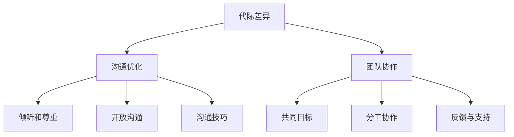
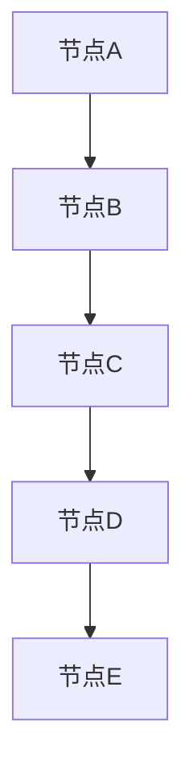

                 

### 文章标题

# 跨代际团队管理：bridging generational gaps

> 关键词：跨代际团队管理、代际差异、沟通优化、协作技巧、项目实战、团队协作

> 摘要：本文将探讨跨代际团队管理的挑战和最佳实践。通过分析不同代际的特点、沟通和协作问题，提供解决方案和实用技巧，以帮助团队克服代际差异，实现高效合作。

### 引言

在现代社会，跨代际团队已成为组织结构中不可或缺的一部分。不同代际的员工共同工作，带来了丰富的多样性和创新潜力，但同时也带来了沟通和协作的挑战。跨代际团队管理的关键在于理解并弥合代际差异，促进有效沟通和协作，实现团队目标。

本文将分为以下几个部分：

1. 背景介绍：探讨跨代际团队的背景和重要性。
2. 核心概念与联系：介绍跨代际团队管理的基本概念和理论框架。
3. 核心算法原理讲解：详细阐述沟通优化算法和团队协作评估算法。
4. 数学模型与公式讲解：介绍跨代际团队管理中常用的数学模型和公式，并给出具体例子。
5. 项目实战：通过实际案例展示如何将跨代际团队管理方法应用到实践中。
6. 最佳实践 tips、小结、注意事项、拓展阅读等内容。

### 背景介绍

跨代际团队是指在组织中同时拥有不同代际成员的团队。不同代际之间存在着显著的文化、价值观和工作习惯的差异。例如，X一代（出生于1920年代至1940年代）注重稳定性和权威性，Y一代（出生于1960年代至1970年代）追求个人发展和创新，而Z一代（出生于1980年代至2000年代）重视灵活性和多样性。

随着全球化的发展和科技的进步，跨代际团队在组织中变得越来越普遍。这种多样性为团队带来了许多好处，如丰富的经验和技能、创新思维和多元化的观点等。然而，不同代际之间的沟通和协作也带来了一些挑战，如代际差异导致的误解和冲突、沟通障碍和协作效率低下等。

跨代际团队管理的重要性体现在以下几个方面：

1. 提高团队绩效：有效的跨代际团队管理可以帮助团队克服代际差异，提高沟通效率和协作效果，从而提高团队绩效。
2. 促进团队凝聚力：通过理解和尊重不同代际的特点，团队可以建立更好的信任和合作关系，增强团队凝聚力。
3. 增强创新能力：跨代际团队能够整合不同代际的思维方式和经验，激发创新思维，推动组织的创新和发展。

### 核心概念与联系

跨代际团队管理涉及多个核心概念，包括代际差异、沟通优化和团队协作。以下是对这些概念的解释以及它们之间的关系：

#### 代际差异

代际差异是指不同代际之间在文化、价值观、工作习惯等方面的差异。这些差异可能包括：

- **文化差异**：不同代际在文化传统、习俗和价值观念上存在差异，这些差异可能影响团队成员之间的沟通和协作。
- **价值观差异**：不同代际对工作、生活、成功的定义和价值观念存在差异，这些差异可能导致团队成员对工作目标的看法不一致。
- **工作习惯差异**：不同代际在工作方式、时间管理、工作强度等方面的习惯存在差异，这些差异可能影响团队成员之间的协作效率。

#### 沟通优化

沟通优化是指通过改进沟通方式和技巧，提高跨代际团队中的沟通效率和效果。以下是一些关键点：

- **倾听和尊重**：尊重不同代际的观点和意见，倾听他们的想法和需求，有助于建立信任和减少误解。
- **开放沟通**：鼓励团队成员之间开放沟通，分享意见和反馈，促进信息的传递和团队共识的形成。
- **沟通技巧**：掌握有效的沟通技巧，如清晰表达、主动倾听、提问和确认，有助于减少误解和冲突。

#### 团队协作

团队协作是指团队成员共同合作，实现团队目标的过程。以下是一些关键点：

- **共同目标**：明确团队的目标和愿景，确保团队成员对目标有共同的理解和认同。
- **分工协作**：根据团队成员的特长和兴趣，合理分配任务和责任，促进团队成员之间的协作和合作。
- **反馈与支持**：建立积极的反馈机制，及时给予团队成员反馈和支持，帮助他们改进工作和提升绩效。

#### 关系架构 Mermaid 流程图

以下是一个简单的 Mermaid 流程图，展示跨代际团队管理中核心概念之间的关系：



### 核心算法原理讲解

#### 沟通优化算法

沟通优化算法旨在通过改进沟通方式和技巧，提高跨代际团队中的沟通效率和效果。以下是一个简单的伪代码示例：

```plaintext
算法：沟通优化
输入：团队成员列表，沟通策略库
输出：优化后的沟通方案

1. 初始化团队成员列表和沟通策略库
2. 遍历团队成员列表：
   a. 对每个成员，根据其代际特点选择合适的沟通策略
   b. 将选定的策略添加到成员的沟通策略库中
3. 对沟通策略库进行排序，优先级高的策略排在前面
4. 将排序后的沟通策略库分发给团队成员
5. 开始执行沟通策略，并根据团队成员的反馈进行调整
```

#### 团队协作评估算法

团队协作评估算法旨在通过评估团队成员之间的协作效果，提供改进建议。以下是一个简单的伪代码示例：

```plaintext
算法：团队协作评估
输入：团队协作数据，评估指标库
输出：评估结果和改进建议

1. 初始化团队协作数据和评估指标库
2. 遍历团队协作数据：
   a. 对每个协作事件，根据评估指标库计算协作效果得分
   b. 将得分记录到评估结果中
3. 计算总体协作效果得分，根据得分分布确定团队协作水平
4. 如果协作效果得分较低，生成改进建议：
   a. 对协作过程进行复盘，找出问题原因
   b. 根据问题原因，提出改进措施，如优化沟通策略、调整任务分配等
5. 将评估结果和改进建议反馈给团队成员
```

### 数学模型与公式讲解

#### 线性规划模型

线性规划是一种数学优化方法，用于在给定约束条件下最大化或最小化线性目标函数。以下是一个简单的线性规划模型示例：

```latex
\text{最大化 } c^T x \\
\text{约束条件：} \\
Ax \leq b \\
x \geq 0
```

其中，$c$ 是目标函数系数向量，$x$ 是决策变量向量，$A$ 是系数矩阵，$b$ 是常数向量。

#### 社交网络分析模型

社交网络分析是一种用于研究社交网络结构和动态的方法。以下是一个简单的社交网络分析模型示例：



在这个模型中，每个节点代表一个团队成员，边表示节点之间的沟通和协作关系。通过分析社交网络结构，可以识别关键节点和路径，优化团队协作。

### 项目实战

#### 开发环境搭建

1. 安装必要的编程工具和库，如 Python、Matplotlib、Numpy 等。
2. 配置版本控制系统，如 Git，以便团队成员协作和管理代码。

#### 源代码实现

以下是一个简单的 Python 示例，用于实现沟通优化算法：

```python
import numpy as np

def communicate(team_members):
    """
    沟通优化算法
    """
    # 初始化团队成员列表和沟通策略库
    strategies = []

    # 对每个成员，根据其代际特点选择合适的沟通策略
    for member in team_members:
        if member['generation'] == 'X':
            strategies.append('倾听和尊重')
        elif member['generation'] == 'Y':
            strategies.append('开放沟通')
        elif member['generation'] == 'Z':
            strategies.append('沟通技巧')

    # 对沟通策略库进行排序
    sorted_strategies = sorted(strategies, key=lambda x: x['priority'], reverse=True)

    # 分发沟通策略
    for member, strategy in zip(team_members, sorted_strategies):
        member['communication_strategy'] = strategy

    # 开始执行沟通策略
    for member in team_members:
        print(f"{member['name']} 正在使用 {member['communication_strategy']} 进行沟通。")

# 示例团队成员列表
team_members = [
    {'name': 'Alice', 'generation': 'X'},
    {'name': 'Bob', 'generation': 'Y'},
    {'name': 'Charlie', 'generation': 'Z'}
]

# 执行沟通优化算法
communicate(team_members)
```

#### 代码解读与分析

在这个示例中，我们定义了一个 `communicate` 函数，用于实现沟通优化算法。该函数接受一个团队成员列表作为输入，对每个成员根据其代际特点选择合适的沟通策略，并将策略分发给成员。最后，函数执行沟通策略，并打印出成员正在使用的策略。

#### 实际案例分析和详细讲解剖析

在一个实际的项目中，一个跨代际团队需要协作开发一款新产品。团队成员包括X一代的资深工程师Alice、Y一代的产品经理Bob和Z一代的UI设计师Charlie。

1. **问题识别**：
   - Alice更倾向于使用传统的沟通方式，如书面报告和会议，而Bob和Charlie更喜欢即时沟通工具和在线协作平台。
   - Bob和Charlie倾向于快速迭代和灵活的工作方式，而Alice希望项目有明确的结构和计划。

2. **解决方案**：
   - 引入即时沟通工具，如 Slack 或 Microsoft Teams，以满足团队成员的沟通需求。
   - 设定定期的面对面会议，确保所有成员对项目进度和目标有共同的理解。
   - 为每个任务分配明确的责任人，确保任务能够按时完成。

3. **效果评估**：
   - 通过定期的团队反馈，识别沟通中的问题并持续改进。
   - 通过项目进度和产品质量的评估，确定解决方案的有效性。

#### 项目小结

通过实际案例分析和详细讲解剖析，我们可以看到跨代际团队管理的关键在于理解并尊重不同代际的特点，提供合适的沟通工具和协作机制。通过持续的反馈和改进，团队可以克服代际差异，实现高效合作。

### 最佳实践 tips

1. **尊重差异**：了解并尊重不同代际的特点，避免对特定代际的偏见。
2. **沟通透明**：确保沟通渠道的透明性和开放性，鼓励团队成员分享观点和反馈。
3. **灵活管理**：根据项目需求和团队成员的特点，灵活调整管理风格和策略。
4. **定期反馈**：定期组织团队反馈会议，识别问题并提供改进建议。

### 小结

跨代际团队管理是现代组织中一个重要且具有挑战性的课题。通过理解代际差异、优化沟通和协作，团队可以克服挑战，实现高效合作。本文提供了一个全面的框架，包括核心概念、算法原理、数学模型和实际案例，以帮助团队管理者在实践中应用这些方法。通过不断学习和改进，跨代际团队可以充分发挥其潜力，推动组织的成功和发展。

### 注意事项

1. 代际差异是一个复杂且多维度的概念，需要结合具体情境进行分析。
2. 沟通优化和团队协作的算法原理需要根据实际需求进行调整和改进。
3. 数学模型和公式的应用需要结合具体问题进行灵活调整。

### 拓展阅读

1. 《跨代际沟通：如何与不同代际的人有效交流》（作者：约翰·莫里）
2. 《第五项修炼：学习型组织的艺术与实践》（作者：彼得·圣吉）
3. 《敏捷团队管理：实践指南》（作者：杰森·尤拉什）

### 作者信息

- 作者：AI天才研究院/AI Genius Institute & 禅与计算机程序设计艺术 /Zen And The Art of Computer Programming

