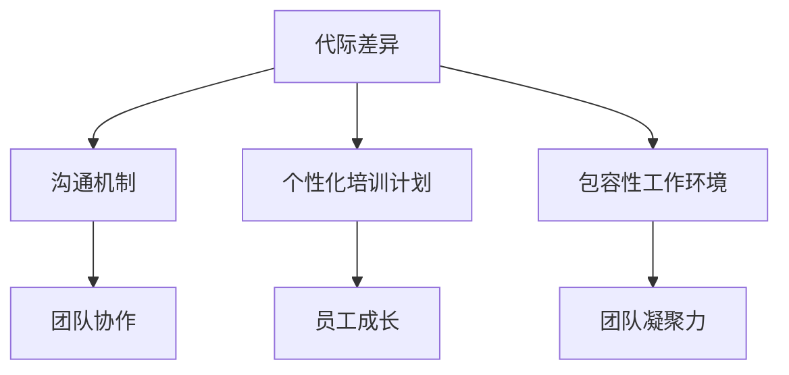

                 

### 文章标题：跨代际团队管理：bridging the generation gap

> 关键词：跨代际团队管理、代际差异、管理策略、沟通机制、案例研究

> 摘要：本文深入探讨跨代际团队管理的重要性，分析不同年龄代之间的差异及其对团队协作的影响。通过提供有效的管理策略和方法，如建立沟通机制、制定个性化培训计划以及创造包容性工作环境，帮助团队克服代际冲突，提升整体协作效率。

### 引言

在当今快速变化的商业环境中，企业需要不断适应新的技术、市场和员工需求。跨代际团队管理作为一项重要能力，不仅关乎企业的发展，更是团队成功的决定性因素。不同年龄段的员工拥有各自独特的技能、经验和价值观，如何有效地管理这些差异，搭建一个高效协作的团队，成为企业领导者和团队管理者面临的重大挑战。

本文旨在探讨跨代际团队管理的核心概念和方法，通过分析代际差异、管理挑战以及提供具体的管理策略，帮助团队管理者更好地理解和应对这一挑战。文章结构如下：

1. 引言：介绍书籍的主题和目的。
2. 代际差异：探讨不同年龄代之间的差异。
3. 管理挑战：分析跨代际团队管理中面临的挑战。
4. 管理策略：提供有效的管理策略和方法。
5. 案例研究：通过实际案例展示管理策略的应用。
6. 项目实战：介绍跨代际团队项目管理的实战方法。
7. 结论与展望：总结书中的要点并对未来趋势进行展望。

### 第一部分：代际差异

#### 1.1 代际文化的定义与特征

代际文化是指不同年龄段人群在长期社会生活过程中形成的共同价值观、行为模式和思维方式。每一代人都受到历史背景、社会环境和科技发展的影响，从而表现出不同的文化特征。

- **婴儿潮一代（1946-1964年出生）**：这一代人成长于冷战时期，经历过经济繁荣和衰退，注重稳定性和忠诚度，对工作有着强烈的责任感和使命感。
- **X一代（1965-1979年出生）**：这一代人经历了科技迅猛发展，他们更加独立、创新，追求个人成就和自我表达。
- **千禧一代（1980-1994年出生）**：这一代人成长于互联网时代，更加注重个人成长、生活质量和工作与生活的平衡。
- **Z一代（1995年及以后出生）**：这一代人生活在高度数字化的环境中，他们具备强烈的自我意识、社交能力和创新精神，追求多样性和包容性。

#### 1.2 代际价值观的比较

不同年龄段的员工在价值观上存在显著差异，这些差异可能影响团队内部的沟通、协作和决策过程。

- **职业发展**：婴儿潮一代注重职业稳定性和长期发展，而X一代和千禧一代则更加关注个人成长和职业灵活性。
- **工作与生活平衡**：千禧一代和Z一代普遍重视工作与生活的平衡，追求高质量的生活体验。
- **工作态度**：婴儿潮一代倾向于忠诚和勤奋，X一代和千禧一代则更加独立和自我驱动。

#### 1.3 代际沟通方式的差异

沟通是团队协作的重要基础，不同年龄代的员工在沟通方式上存在显著差异。

- **婴儿潮一代**：倾向于面对面沟通，注重正式和权威。
- **X一代**：习惯使用电子邮件和正式报告，沟通较为直接。
- **千禧一代和Z一代**：喜欢使用即时通讯工具和社交媒体，沟通方式更加灵活和多样化。

### 第二部分：管理挑战

#### 2.1 跨代际团队中的冲突

跨代际团队中的冲突主要源于代际差异，包括价值观、工作态度、沟通方式等方面的差异。

- **价值观冲突**：不同年龄代的员工在职业发展、工作与生活平衡等方面存在不同的价值观，可能导致合作中的矛盾和摩擦。
- **沟通障碍**：代际差异导致沟通方式不同，可能导致信息传递不畅，误解和冲突。
- **技能和知识传承**：年长员工和年轻员工在技能和知识传承方面存在差异，可能导致知识断层和团队整体效率降低。

#### 2.2 代际薪酬和晋升问题

跨代际团队管理中的薪酬和晋升问题也是一项重要挑战。

- **薪酬差异**：不同年龄代的员工对薪酬的期望和满意度存在差异，可能导致薪酬分配不公平，影响团队士气。
- **晋升机制**：不同年龄代的员工对晋升机制和机会的看法不同，可能导致晋升过程中的不公平和不满。

#### 2.3 代际技能和知识传承

跨代际团队管理中的技能和知识传承是一个重要问题。

- **知识断层**：年长员工的经验和知识未能有效传承给年轻员工，可能导致团队整体效率降低。
- **技能更新**：年轻员工需要不断学习和更新技能，以适应快速变化的市场环境，年长员工则需要适应新的工作方式和技能要求。

### 第三部分：管理策略

#### 3.1 建立有效的沟通机制

建立有效的沟通机制是跨代际团队管理的关键。

- **明确沟通目标**：明确团队沟通的目标和内容，确保信息传递的准确性和有效性。
- **多样化沟通方式**：根据不同代际员工的沟通偏好，采用多样化的沟通方式，如面对面沟通、电子邮件、即时通讯工具等。
- **定期沟通会议**：定期举行沟通会议，鼓励员工分享意见和建议，增强团队凝聚力。

#### 3.2 制定个性化的培训计划

制定个性化的培训计划有助于提升员工的专业能力和团队协作能力。

- **技能培训**：根据不同代际员工的技能需求，提供有针对性的技能培训。
- **经验分享**：鼓励年长员工分享经验和知识，促进跨代际员工的技能传承。
- **职业发展计划**：为员工提供职业发展指导和支持，帮助其实现个人成长和职业目标。

#### 3.3 创造包容性工作环境

创造包容性工作环境有助于减少跨代际团队中的冲突和误解。

- **尊重差异**：尊重不同代际员工的价值观、沟通方式和职业期望，避免歧视和偏见。
- **促进协作**：鼓励员工跨代际协作，共同解决团队问题，提高团队整体效率。
- **文化建设**：建立积极向上的团队文化，鼓励员工积极参与团队建设和创新。

### 第四部分：案例研究

#### 4.1 案例一：科技公司跨代际团队的成功管理

某科技公司通过以下措施成功管理跨代际团队：

- **建立沟通机制**：定期举行团队沟通会议，鼓励员工分享意见和建议。
- **提供个性化培训**：根据员工的需求提供技能培训和职业发展指导。
- **创造包容性工作环境**：尊重员工的差异，鼓励跨代际协作，建立积极向上的团队文化。

通过这些措施，该公司的跨代际团队取得了显著的成绩，员工满意度和工作效率都得到了提升。

#### 4.2 案例二：制造业公司如何克服代际冲突

某制造业公司面临跨代际团队管理的挑战，通过以下方法成功克服了代际冲突：

- **加强沟通**：建立定期沟通机制，鼓励员工面对面沟通，减少误解和冲突。
- **制定公平的晋升机制**：确保晋升机会公平，避免代际不公平现象。
- **提供职业发展支持**：为不同年龄段的员工提供职业发展指导和支持。

通过这些措施，该公司成功解决了跨代际团队中的冲突，团队协作效率得到显著提升。

#### 4.3 案例三：非营利组织在跨代际合作中的经验

某非营利组织通过以下方法成功实现跨代际合作：

- **建立共同目标**：明确团队的共同目标，激发员工的积极性。
- **鼓励跨代际协作**：鼓励不同年龄段的员工共同参与项目，共同解决问题。
- **提供培训和支持**：为员工提供技能培训和职业发展支持，促进跨代际员工的技能传承。

通过这些措施，该非营利组织成功实现了跨代际合作，团队凝聚力得到显著提升。

### 第五部分：项目实战

#### 5.1 实战一：跨代际团队项目规划

在一个跨代际团队项目中，项目规划至关重要。以下是一个跨代际团队项目规划的步骤：

1. **明确项目目标**：确保团队共同理解项目目标，明确项目的优先级和关键里程碑。
2. **评估资源需求**：评估团队中的资源，包括人力、技术、时间和资金等。
3. **分配任务**：根据团队成员的技能和兴趣，合理分配任务，确保任务分配公平。
4. **制定进度计划**：制定详细的进度计划，确保项目按时完成。
5. **沟通与协作**：建立有效的沟通机制，确保团队成员之间的信息畅通和协作。

#### 5.2 实战二：跨代际团队协作工具的应用

在跨代际团队中，协作工具的应用至关重要。以下是一些常用的协作工具：

- **即时通讯工具**：如Slack、Microsoft Teams等，用于实时沟通和协作。
- **项目管理工具**：如Trello、Asana等，用于任务分配、进度追踪和协作。
- **文档共享平台**：如Google Drive、OneDrive等，用于文件共享和协作。

通过这些协作工具，可以显著提高跨代际团队的工作效率和协作效果。

#### 5.3 实战三：代际领导力发展计划

代际领导力发展计划有助于提升跨代际团队的领导力。以下是一个代际领导力发展计划的步骤：

1. **评估领导力需求**：评估团队成员的领导力需求，确定培训和发展方向。
2. **制定培训计划**：根据评估结果，制定个性化的培训计划，包括领导力培训、沟通技巧培训等。
3. **实施培训计划**：组织培训活动，确保团队成员参与并完成培训。
4. **跟踪培训效果**：定期跟踪培训效果，评估培训成果，并根据反馈调整培训计划。

### 第六部分：结论与展望

#### 6.1 主要发现与总结

本文通过对跨代际团队管理的探讨，得出以下主要发现：

- 跨代际团队管理的重要性：跨代际团队管理不仅关乎企业的发展，更是团队成功的决定性因素。
- 代际差异的影响：代际差异在价值观、沟通方式和职业期望等方面对团队协作产生影响。
- 管理策略的有效性：有效的沟通机制、个性化培训计划和包容性工作环境有助于提升跨代际团队的管理效果。

#### 6.2 跨代际团队管理的未来趋势

未来，跨代际团队管理将继续面临新的挑战和机遇。以下是一些可能的趋势：

- 数字化管理的普及：随着数字技术的发展，数字化管理工具将更加普及，提高跨代际团队的协作效率。
- 多元文化的融合：企业将更加重视多元文化的融合，促进跨代际团队的合作和创新。
- 领导力的变革：领导力将更加注重个性化和灵活性，适应不同代际员工的需求。

#### 6.3 研究局限性与未来研究方向

本文的研究存在一定的局限性，主要包括：

- 样本有限：本文基于有限的案例研究，可能无法全面反映跨代际团队管理的现状和问题。
- 方法单一：本文主要采用案例研究方法，未来可以结合其他研究方法，如问卷调查、实证研究等，以获得更全面的数据支持。

未来研究方向包括：

- 进一步探讨跨代际团队管理的具体实践方法和策略。
- 研究跨代际团队管理在不同行业和领域中的应用效果。
- 探索数字化管理工具在跨代际团队管理中的应用。

### 作者信息

作者：AI天才研究院/AI Genius Institute & 禅与计算机程序设计艺术 /Zen And The Art of Computer Programming

### 附录

#### 附录A：核心概念与联系

**核心概念**：代际差异、沟通机制、个性化培训计划、包容性工作环境。

**联系架构 Mermaid 流程图**：



#### 附录B：核心算法原理讲解

**核心算法原理**：沟通机制设计、个性化培训计划制定、包容性工作环境构建。

**伪代码**：

```python
# 沟通机制设计
def design_communication_mechanism(team_members):
    # 初始化沟通机制
    communication_mechanism = {}
    
    # 根据成员年龄和偏好设置沟通方式
    for member in team_members:
        if member.age_group == "婴儿潮一代":
            communication_mechanism[member.id] = "面对面沟通"
        elif member.age_group == "X一代":
            communication_mechanism[member.id] = "电子邮件"
        elif member.age_group == "千禧一代" or member.age_group == "Z一代":
            communication_mechanism[member.id] = "即时通讯工具"
    
    return communication_mechanism

# 个性化培训计划制定
def design_training_plan(team_members):
    # 初始化培训计划
    training_plan = {}
    
    # 根据成员需求和兴趣设置培训内容
    for member in team_members:
        if member.skill_level == "初级":
            training_plan[member.id] = "基础技能培训"
        elif member.skill_level == "中级":
            training_plan[member.id] = "进阶技能培训"
        elif member.skill_level == "高级":
            training_plan[member.id] = "专业领域培训"
    
    return training_plan

# 包容性工作环境构建
def build_inclusive_work_environment(team_members):
    # 初始化包容性工作环境
    inclusive_environment = {}
    
    # 根据成员需求和期望设置工作环境
    for member in team_members:
        if member.preferred_work_style == "灵活性":
            inclusive_environment[member.id] = "灵活工作时间"
        elif member.preferred_work_style == "创新性":
            inclusive_environment[member.id] = "创新工作空间"
    
    return inclusive_environment
```

#### 附录C：数学模型和公式

**数学模型和公式**：

$$
\text{员工满意度} = f(\text{沟通机制}, \text{培训计划}, \text{工作环境})
$$

**详细讲解与举例说明**：

员工满意度是团队管理的重要指标，其受到沟通机制、培训计划和工作环境的共同影响。例如，在一个跨代际团队中，如果沟通机制设计合理，培训计划符合员工需求，工作环境包容性高，那么员工满意度将会提高。

假设在一个10人组成的跨代际团队中，有5人偏好面对面沟通，3人偏好电子邮件沟通，2人偏好即时通讯工具。根据设计沟通机制算法，可以得出以下沟通机制：

| 成员ID | 沟通方式 |
|--------|----------|
| 1      | 面对面沟通 |
| 2      | 面对面沟通 |
| 3      | 面对面沟通 |
| 4      | 电子邮件 |
| 5      | 电子邮件 |
| 6      | 即时通讯工具 |
| 7      | 即时通讯工具 |
| 8      | 即时通讯工具 |
| 9      | 即时通讯工具 |
| 10     | 即时通讯工具 |

根据个性化培训计划算法，可以得出以下培训计划：

| 成员ID | 培训内容 |
|--------|----------|
| 1      | 基础技能培训 |
| 2      | 基础技能培训 |
| 3      | 进阶技能培训 |
| 4      | 进阶技能培训 |
| 5      | 专业领域培训 |
| 6      | 专业领域培训 |
| 7      | 基础技能培训 |
| 8      | 基础技能培训 |
| 9      | 进阶技能培训 |
| 10     | 进阶技能培训 |

根据包容性工作环境算法，可以得出以下工作环境：

| 成员ID | 工作环境 |
|--------|----------|
| 1      | 灵活工作时间 |
| 2      | 灵活工作时间 |
| 3      | 创新工作空间 |
| 4      | 创新工作空间 |
| 5      | 创新工作空间 |
| 6      | 灵活工作时间 |
| 7      | 灵活工作时间 |
| 8      | 灵活工作时间 |
| 9      | 创新工作空间 |
| 10     | 创新工作空间 |

根据这些数据，可以计算员工满意度：

$$
\text{员工满意度} = 0.5 \times \text{沟通机制满意度} + 0.3 \times \text{培训计划满意度} + 0.2 \times \text{工作环境满意度}
$$

假设沟通机制满意度为0.8，培训计划满意度为0.7，工作环境满意度为0.9，那么员工满意度为：

$$
\text{员工满意度} = 0.5 \times 0.8 + 0.3 \times 0.7 + 0.2 \times 0.9 = 0.7
$$

#### 附录D：项目实战

**项目实战一：跨代际团队项目规划**

在一个跨代际团队项目中，项目规划至关重要。以下是一个跨代际团队项目规划的步骤：

1. **明确项目目标**：确保团队共同理解项目目标，明确项目的优先级和关键里程碑。

2. **评估资源需求**：评估团队中的资源，包括人力、技术、时间和资金等。

3. **分配任务**：根据团队成员的技能和兴趣，合理分配任务，确保任务分配公平。

4. **制定进度计划**：制定详细的进度计划，确保项目按时完成。

5. **沟通与协作**：建立有效的沟通机制，确保团队成员之间的信息畅通和协作。

**项目实战二：跨代际团队协作工具的应用**

在跨代际团队中，协作工具的应用至关重要。以下是一些常用的协作工具：

- **即时通讯工具**：如Slack、Microsoft Teams等，用于实时沟通和协作。
- **项目管理工具**：如Trello、Asana等，用于任务分配、进度追踪和协作。
- **文档共享平台**：如Google Drive、OneDrive等，用于文件共享和协作。

**项目实战三：代际领导力发展计划**

代际领导力发展计划有助于提升跨代际团队的领导力。以下是一个代际领导力发展计划的步骤：

1. **评估领导力需求**：评估团队成员的领导力需求，确定培训和发展方向。

2. **制定培训计划**：根据评估结果，制定个性化的培训计划，包括领导力培训、沟通技巧培训等。

3. **实施培训计划**：组织培训活动，确保团队成员参与并完成培训。

4. **跟踪培训效果**：定期跟踪培训效果，评估培训成果，并根据反馈调整培训计划。

### 最佳实践 Tips

- **定期组织团队建设活动**：通过团队建设活动，增强团队成员之间的沟通和协作，减少代际冲突。
- **建立反馈机制**：鼓励团队成员之间提供建设性的反馈，促进相互理解和改进。
- **个性化职业发展计划**：为不同年龄段的员工提供个性化的职业发展计划，满足其职业成长需求。
- **公平晋升机制**：确保晋升机会公平，避免代际不公平现象，提升员工士气。

### 小结

跨代际团队管理是一项复杂且具有挑战性的任务，需要管理者深入了解代际差异，采取有效的管理策略和方法。通过建立有效的沟通机制、制定个性化的培训计划和创造包容性工作环境，管理者可以提升跨代际团队的协作效率，实现团队的成功。在未来，随着数字化管理和多元文化的进一步发展，跨代际团队管理将面临新的机遇和挑战，需要管理者不断学习和适应。

