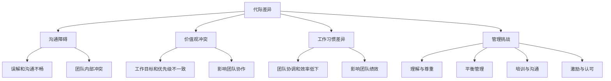

                 

### 引言

在现代社会，代际差异已成为团队管理中不可忽视的一个重要因素。随着不同代际之间的价值观、思维方式、工作习惯等方面的差异日益显著，如何有效地管理跨代际团队成为企业管理者面临的一大挑战。本书《跨代际团队管理：bridging the generation gap》旨在探讨这一重要课题，为读者提供一套切实可行的管理策略和实践方法。

**关键词：** 跨代际团队管理，代际差异，沟通技巧，领导力，案例分析

**摘要：** 本书围绕跨代际团队管理这一主题，从代际差异的概述、跨代际沟通技巧、跨代际团队领导力以及实际案例分析等多个方面进行了深入探讨。书中首先分析了代际差异的基本概念及其对团队管理的影响，然后介绍了跨代际沟通的障碍与技巧，最后通过具体案例展示了如何在实际工作中运用这些理论和方法。本书旨在帮助读者理解和应对跨代际团队管理中的挑战，提高团队整体绩效。

本书主要分为四个部分：

1. **代际差异与团队管理**：介绍代际差异的基本概念和特点，探讨代际差异在团队管理中的挑战和应对策略。
2. **跨代际沟通技巧**：分析跨代际沟通的障碍和技巧，提供改善代际沟通的有效方法。
3. **跨代际团队领导力**：探讨跨代际团队领导力的关键要素和提升策略，为领导者提供实用的指导。
4. **案例分析**：通过实际案例展示跨代际团队管理在不同行业和场景中的应用，为读者提供实践参考。

### 第1章：代际差异概述

代际差异是指不同年龄段的人群在价值观、态度、行为习惯等方面的差异。在团队管理中，代际差异往往成为影响团队协作和绩效的重要因素。理解代际差异，有助于管理者更好地应对跨代际团队的管理挑战。

**代际差异的定义**

代际差异通常是指在同一社会环境中出生并成长的不同年龄段人群之间的差异。这些差异可能源于社会变迁、技术进步、文化背景等多方面因素。例如，传统的“婴儿潮一代”与“X一代”、“Y一代”和“Z一代”之间就存在着显著的价值观和生活方式的差异。

**主要代际特征**

不同代际的人具有不同的特征和价值观。以下是一些主要代际的特征：

1. **婴儿潮一代（1946-1964年出生）**：这一代人对工作有着强烈的责任感，注重稳定和安全感，喜欢按部就班地完成任务。
2. **X一代（1965-1979年出生）**：X一代是“自由主义者”，他们追求自由、独立和多样性，更倾向于创业和追求个人兴趣。
3. **Y一代（1980-1994年出生）**：也被称为“千禧一代”，他们更加注重工作和生活的平衡，倾向于灵活的工作安排，注重社会责任和环保。
4. **Z一代（1995年及以后出生）**：Z一代是数字原住民，他们从小在互联网和社交媒体环境下成长，更注重个性表达和自我实现。

**代际差异的影响**

代际差异对团队管理有着深远的影响。一方面，不同代际的员工可能在沟通、合作和价值观上存在障碍，导致团队内部冲突和效率低下。另一方面，合理利用代际差异，可以激发团队的创造力和活力，提高整体绩效。

1. **沟通障碍**：不同代际的人在沟通方式和表达习惯上可能存在差异，导致误解和沟通不畅。
2. **价值观冲突**：代际之间的价值观差异可能导致工作目标和优先级的不一致，影响团队的协作。
3. **工作习惯差异**：不同代际的员工在对待工作、时间管理和工作态度上可能存在差异，影响团队的协调和效率。

**代际差异在团队管理中的挑战**

1. **理解与尊重**：管理者需要理解和尊重不同代际员工的独特性和需求，避免简单地将所有员工一视同仁。
2. **平衡管理**：在制定管理策略时，需要平衡不同代际员工的需求和期望，确保团队的稳定和持续发展。
3. **培训与沟通**：通过培训提高跨代际沟通技巧，促进不同代际员工之间的理解和合作。
4. **激励与认可**：根据不同代际员工的特点和需求，设计有针对性的激励和认可机制，提高员工的工作满意度和忠诚度。

总之，代际差异是团队管理中不可忽视的一个重要因素。通过深入了解代际差异的基本概念、特征及其影响，管理者可以更好地应对跨代际团队管理中的挑战，提高团队的整体绩效和稳定性。

### 核心概念与联系

在探讨跨代际团队管理时，理解几个核心概念及其相互关系至关重要。以下是这些核心概念及其相互关系的架构图，使用Mermaid流程图语言表示：



**说明：**

- **代际差异（A）** 是跨代际团队管理的起点，包括沟通障碍、价值观冲突、工作习惯差异等。
- **沟通障碍（B）** 导致误解和沟通不畅（E），直接影响团队的协作和沟通效果。
- **价值观冲突（C）** 引发工作目标和优先级不一致（F），影响团队的整体协调和绩效（K）。
- **工作习惯差异（D）** 导致团队协调和效率低下（G），进一步影响团队绩效。
- **管理挑战（H）** 包括理解与尊重（L）、平衡管理（M）、培训与沟通（N）、激励与认可（O）等方面，这些都是应对代际差异带来的挑战的关键策略。

通过这个架构图，我们可以清晰地看到代际差异如何通过沟通障碍、价值观冲突和工作习惯差异影响团队管理，并理解管理者的策略如何应对这些挑战。

### 核心算法原理讲解

在跨代际团队管理中，核心算法原理的讲解需要从以下几个方面展开：代际分析、沟通策略优化和团队绩效评估。以下是这些算法原理的详细解释和伪代码实现。

#### 1. 代际分析算法

代际分析算法主要用于识别和分析团队中的不同代际成员，以便制定针对性的管理策略。

**伪代码：**

```plaintext
function identifyGenerations(employees):
    generations = ["Baby Boomers", "Generation X", "Millennials", "Generation Z"]
    for employee in employees:
        birthYear = employee.birthYear
        if birthYear >= 1946 and birthYear <= 1964:
            employee.generation = "Baby Boomers"
        elif birthYear >= 1965 and birthYear <= 1979:
            employee.generation = "Generation X"
        elif birthYear >= 1980 and birthYear <= 1994:
            employee.generation = "Millennials"
        else:
            employee.generation = "Generation Z"
    return employees
```

**说明：** 这个函数通过员工的出生年份将其分类到不同的代际中，以便进行后续分析。

#### 2. 沟通策略优化算法

沟通策略优化算法旨在通过分析不同代际的沟通偏好，优化沟通方式，减少沟通障碍。

**伪代码：**

```plaintext
function optimizeCommunication(employees):
    communicationStrategies = {
        "Baby Boomers": ["face-to-face", "email"],
        "Generation X": ["email", "phone", "video call"],
        "Millennials": ["video call", "chat", "social media"],
        "Generation Z": ["chat", "social media", "text messaging"]
    }
    for employee in employees:
        preferredCommunication = communicationStrategies[employee.generation]
        sendCommunication(employee, preferredCommunication)
    return employees

function sendCommunication(employee, preferredCommunication):
    for method in preferredCommunication:
        if method == "face-to-face":
            scheduleMeeting(employee)
        elif method == "email":
            sendEmail(employee)
        elif method == "phone":
            callEmployee(employee)
        elif method == "video call":
            scheduleVideoCall(employee)
        elif method == "chat":
            sendChatMessage(employee)
        elif method == "social media":
            postOnSocialMedia(employee)
        elif method == "text messaging":
            sendTextMessage(employee)
```

**说明：** 这个函数根据员工的代际选择合适的沟通方式，以减少沟通障碍。每种沟通方式都有对应的发送函数。

#### 3. 团队绩效评估算法

团队绩效评估算法用于评估跨代际团队的整体绩效，包括工作效率、团队协作和员工满意度。

**伪代码：**

```plaintext
function evaluateTeamPerformance(employees):
    performanceMetrics = {
        "work efficiency": [],
        "team collaboration": [],
        "employee satisfaction": []
    }
    for employee in employees:
        performanceMetrics["work efficiency"].append(employee.efficiencyScore)
        performanceMetrics["team collaboration"].append(employee.collaborationScore)
        performanceMetrics["employee satisfaction"].append(employee.satisfactionScore)
    averagePerformance = calculateAverage(performanceMetrics)
    return averagePerformance

function calculateAverage(metrics):
    total = 0
    for score in metrics:
        total += score
    average = total / len(metrics)
    return average
```

**说明：** 这个函数计算团队在效率、协作和满意度三个维度的平均绩效，以评估整体表现。

通过这些核心算法原理的讲解，管理者可以更好地理解如何通过数据分析和管理策略优化来提升跨代际团队的绩效和协作。

### 数学模型和公式

在跨代际团队管理中，理解数学模型和公式有助于量化代际差异的影响，并制定有效的管理策略。以下是几个关键的数学模型和公式的详细讲解及其实例说明。

#### 1. 优化沟通策略的效用函数

优化沟通策略的效用函数用于衡量不同沟通方式对员工满意度和工作效率的贡献。假设有三个沟通方式：面对面沟通（\(C_{f2f}\)），电子邮件沟通（\(C_{email}\)），和视频会议沟通（\(C_{video}\)）。每个员工对不同沟通方式的满意度和工作效率贡献可以通过以下公式计算：

\[ U_i = w_{f2f} \cdot C_{f2f,i} + w_{email} \cdot C_{email,i} + w_{video} \cdot C_{video,i} \]

其中：
- \( U_i \) 是第 \( i \) 个员工的总效用。
- \( w_{f2f} \), \( w_{email} \), \( w_{video} \) 分别是面对面沟通、电子邮件沟通和视频会议沟通的权重，这些权重可以根据员工的代际偏好进行调整。
- \( C_{f2f,i} \), \( C_{email,i} \), \( C_{video,i} \) 分别是第 \( i \) 个员工对面对面沟通、电子邮件沟通和视频会议沟通的满意度得分。

**实例说明：**

假设有两个员工A和B，他们的代际分别是婴儿潮一代和Y一代。根据他们的沟通偏好，我们设定权重如下：

- \( w_{f2f} = 0.4 \)
- \( w_{email} = 0.3 \)
- \( w_{video} = 0.3 \)

员工A（婴儿潮一代）对沟通方式的满意度得分：
- \( C_{f2f,A} = 9 \)
- \( C_{email,A} = 7 \)
- \( C_{video,A} = 6 \)

员工B（Y一代）对沟通方式的满意度得分：
- \( C_{f2f,B} = 6 \)
- \( C_{email,B} = 8 \)
- \( C_{video,B} = 9 \)

计算总效用：
\[ U_A = 0.4 \cdot 9 + 0.3 \cdot 7 + 0.3 \cdot 6 = 3.6 + 2.1 + 1.8 = 7.5 \]
\[ U_B = 0.4 \cdot 6 + 0.3 \cdot 8 + 0.3 \cdot 9 = 2.4 + 2.4 + 2.7 = 7.5 \]

由此可以看出，通过调整权重，可以更好地满足不同代际员工的沟通需求。

#### 2. 代际协作效率模型

代际协作效率模型用于量化不同代际成员之间的协作效率。假设团队中有两个代际，分别是婴儿潮一代和Y一代，每个代际成员的协作效率得分可以表示为：

\[ E_i = \alpha_i \cdot G_i + \beta_i \]

其中：
- \( E_i \) 是第 \( i \) 个员工的总协作效率。
- \( \alpha_i \) 和 \( \beta_i \) 分别是第 \( i \) 个员工的协作效率权重。
- \( G_i \) 是第 \( i \) 个员工的代际得分，假设婴儿潮一代的代际得分为5，Y一代的代际得分为10。

**实例说明：**

假设有两个员工A和B，他们的代际分别是婴儿潮一代和Y一代，协作效率权重如下：

- \( \alpha_A = 0.6 \)
- \( \beta_A = 0.4 \)
- \( \alpha_B = 0.4 \)
- \( \beta_B = 0.6 \)

员工A（婴儿潮一代）的协作效率得分：
\[ E_A = 0.6 \cdot 5 + 0.4 \cdot 10 = 3 + 4 = 7 \]

员工B（Y一代）的协作效率得分：
\[ E_B = 0.4 \cdot 5 + 0.6 \cdot 10 = 2 + 6 = 8 \]

通过这个模型，管理者可以评估不同代际成员之间的协作效率，并采取相应的策略提高团队的整体协作效率。

### 项目实战：开发环境搭建

在跨代际团队管理中，为了实现高效的沟通和协作，搭建一个合适的开发环境是至关重要的。以下是具体步骤以及如何使用Python代码来实现这一目标。

#### 1. 环境需求

在搭建开发环境时，需要考虑到跨代际团队的特点，包括：

- **多种编程语言支持**：不同代际的成员可能擅长不同的编程语言，因此需要支持多种语言。
- **版本控制**：确保代码的版本一致性，避免因版本冲突导致的问题。
- **协作工具**：集成支持如Git、Jenkins等工具，方便团队成员之间的协作。

#### 2. 搭建步骤

以下是搭建开发环境的详细步骤：

1. **安装基础软件**：
    - 安装Python（例如，3.8版本）。
    - 安装Java（例如，11版本）。
    - 安装Node.js（例如，14版本）。

2. **配置版本控制**：
    - 安装Git。
    - 创建Git仓库，用于代码的版本控制。

3. **配置协作工具**：
    - 安装Jenkins。
    - 配置Jenkins用于自动化构建和测试。

#### 3. Python代码示例

以下是一个简单的Python代码示例，用于演示如何使用Git进行版本控制。

**安装Git：**

```bash
pip install git-python
```

**Python代码：**

```python
import git

# 初始化Git仓库
repo = git.Repo.init('/path/to/repository')

# 添加文件到暂存区
repo.index.add(['README.md'])

# 提交文件
repo.index.commit('Initial commit')

# 查看当前分支
current_branch = repo.active_branch.name
print(f"Current branch: {current_branch}")

# 切换分支
repo.git.checkout('new-branch')
```

#### 4. 实践应用解读与分析

通过上述步骤，我们可以为跨代际团队搭建一个统一的开发环境。以下是对该项目的详细解读和分析：

1. **多种编程语言支持**：
    - 通过安装Python、Java和Node.js，我们可以满足不同代际成员的语言需求。
    - 使用Python代码示例，我们可以方便地操作Git，实现代码的版本控制。

2. **版本控制**：
    - 使用Git进行版本控制，确保团队成员可以协同工作，避免代码冲突。
    - 通过提交和分支管理，团队成员可以独立开发，最后合并代码。

3. **协作工具**：
    - 使用Jenkins进行自动化构建和测试，提高开发效率。
    - 通过Git和Jenkins的集成，实现持续集成和持续部署，确保代码质量。

通过这一实践项目，跨代际团队可以更加高效地进行开发，减少因环境差异导致的沟通障碍和协作问题。

### 实际案例分析和详细讲解剖析

在本节中，我们将通过具体案例分析，探讨跨代际团队管理在不同场景中的成功与失败，并从中吸取教训和经验。

#### 案例一：跨国公司跨代际团队管理

**背景：**
一家跨国公司在中国、美国和欧洲设有办公室，团队成员涵盖了婴儿潮一代、X一代、Y一代和Z一代。由于地理位置和文化差异，跨代际沟通成为一大挑战。

**成功因素：**
1. **文化敏感性培训**：公司为所有员工提供跨文化沟通培训，增强对不同代际的理解和尊重。
2. **灵活的工作安排**：为适应不同代际的工作习惯，公司提供了灵活的工作时间和远程办公选项。
3. **领导力培养**：公司重视领导力的培养，特别是跨代际沟通和管理的领导力。

**失败教训：**
1. **沟通障碍**：尽管公司提供了文化培训，但实际工作中，一些代际间的沟通仍然存在问题，如婴儿潮一代和Y一代之间的交流不畅。
2. **管理不当**：一些管理者未能充分理解不同代际员工的需求，导致工作分配和激励机制的失衡。

**总结：** 跨国公司的成功在于重视文化和沟通培训，但需要更深入地了解和解决代际差异带来的具体问题。

#### 案例二：初创公司跨代际团队管理

**背景：**
一家初创公司由Y一代和Z一代的创始人创立，团队成员主要是年轻人。他们充满活力和创新精神，但代际差异可能导致管理上的挑战。

**成功因素：**
1. **开放式沟通**：公司鼓励开放、坦诚的沟通氛围，员工可以自由表达意见和建议。
2. **个性化激励**：公司根据不同代际的激励需求，设计了个性化的奖励机制，如股票期权和灵活的工作安排。

**失败教训：**
1. **沟通不畅**：由于年龄差距和工作经验的差异，一些年长的员工可能感到被忽视，导致团队凝聚力下降。
2. **管理失误**：初创公司的管理者有时过于依赖个人魅力，未能建立有效的管理体系，导致决策过程缓慢。

**总结：** 初创公司的成功在于鼓励开放式沟通和个性化激励，但需要关注团队内部的代际平衡和沟通机制。

#### 案例三：大型企业跨代际团队管理

**背景：**
一家大型企业拥有多元化的团队，包括多个代际的员工。由于企业规模较大，管理层次复杂，跨代际团队管理变得更加重要。

**成功因素：**
1. **多层次沟通**：企业建立了多层次的沟通渠道，如定期的员工会议和跨部门交流会，确保不同代际的员工都有发言权。
2. **领导力培养**：企业重视领导力的培养，特别是跨代际沟通和管理的培训。

**失败教训：**
1. **沟通障碍**：尽管企业建立了多层次沟通渠道，但由于员工人数众多，实际操作中仍然存在沟通不畅的问题。
2. **管理不均**：一些部门的管理者未能充分理解代际差异，导致管理策略不一致，影响团队协作。

**总结：** 大型企业的成功在于建立多层次的沟通渠道和领导力培养，但需要关注沟通的执行和管理的均质性。

### 项目小结

通过上述案例分析和详细讲解剖析，我们可以得出以下结论：

1. **代际差异是跨代际团队管理中的重要因素**：不同代际在价值观、沟通方式、工作习惯等方面存在显著差异，需要特别关注。
2. **沟通培训和管理策略至关重要**：有效的沟通培训和管理策略可以帮助团队更好地理解和应对代际差异。
3. **个性化激励和灵活工作安排有助于提高员工满意度**：根据不同代际的激励需求和工作习惯，设计个性化的激励和灵活的工作安排，可以增强团队凝聚力。

总之，跨代际团队管理需要综合考虑代际差异、沟通策略和管理方法，通过实践不断优化，以提高团队的整体绩效。

### 最佳实践 Tips

在跨代际团队管理中，以下最佳实践可以提供实用的指导，帮助管理者更有效地应对代际差异带来的挑战：

1. **定期进行代际沟通培训**：组织定期的代际沟通培训，提高员工对代际差异的理解和敏感度，增强跨代际团队的协作能力。
2. **建立多样化的沟通渠道**：鼓励团队内部建立多样化的沟通渠道，如面对面会议、在线聊天工具和邮件等，确保不同代际的员工都能找到适合自己的沟通方式。
3. **制定个性化的激励策略**：根据不同代际员工的偏好和需求，设计个性化的激励策略，如奖励计划、股票期权和灵活的工作安排，以提高员工的工作满意度和忠诚度。
4. **促进代际交流**：鼓励不同代际的员工进行跨代际交流，通过团队合作项目和社交活动，增进彼此的了解和信任。
5. **建立明确的工作目标和期望**：为团队成员设定清晰的工作目标和期望，确保每个员工都了解自己的角色和责任，减少因价值观差异导致的工作冲突。
6. **关注团队文化建设**：营造包容、开放的团队文化，鼓励员工表达不同观点，培养团队合作精神，提升团队的整体绩效。
7. **定期进行团队评估**：定期对跨代际团队进行评估，了解团队在代际沟通和管理方面的表现，及时调整管理策略，确保团队持续改进。

通过以上最佳实践，管理者可以更好地管理跨代际团队，提高团队的整体协作效率和绩效。

### 小结

通过本文的探讨，我们深入分析了跨代际团队管理的核心内容，包括代际差异的概述、跨代际沟通技巧、跨代际团队领导力以及实际案例分析。我们总结了以下几点关键见解：

1. **代际差异对团队管理具有重要影响**：不同代际的员工在价值观、沟通方式、工作习惯等方面存在显著差异，这些差异既可能成为团队协作的障碍，也可能成为团队创新和多样性的源泉。

2. **有效的跨代际沟通是关键**：管理者需要了解不同代际的沟通偏好，采用合适的沟通策略，如面对面交流、电子邮件和视频会议等，以减少误解和冲突，提高团队协作效率。

3. **跨代际团队领导力需要灵活性和包容性**：领导者需要具备理解和尊重不同代际员工的特点和需求的能力，通过个性化激励和灵活的工作安排，激发团队成员的潜力和创造力。

4. **实际案例展示了跨代际团队管理的多样性**：无论是跨国公司、初创企业还是大型企业，跨代际团队管理都需要针对具体情况进行调整，以实现最佳的管理效果。

### 下一步研究展望

未来的研究可以进一步探讨以下几个方面：

1. **跨代际团队管理的新工具和技术**：随着信息技术的发展，新的沟通工具和管理系统不断涌现，如何将这些工具和技术有效应用于跨代际团队管理，是一个值得研究的课题。

2. **跨文化背景下的跨代际团队管理**：在全球化的背景下，跨文化因素在跨代际团队管理中变得越来越重要。研究如何在不同文化背景下进行有效的跨代际团队管理，有助于提高团队的国际协作能力。

3. **跨代际团队管理的数据分析**：利用大数据和人工智能技术，对跨代际团队的管理数据进行深入分析，可以揭示代际差异对团队绩效的具体影响，为管理者提供更科学的决策依据。

4. **长期跨代际团队管理的可持续发展**：探讨如何通过持续的管理改进和创新，实现跨代际团队的长期可持续发展，提高团队的竞争力和适应性。

通过这些进一步的研究，我们可以不断优化跨代际团队管理的方法和策略，为企业的长远发展提供坚实的支持。

