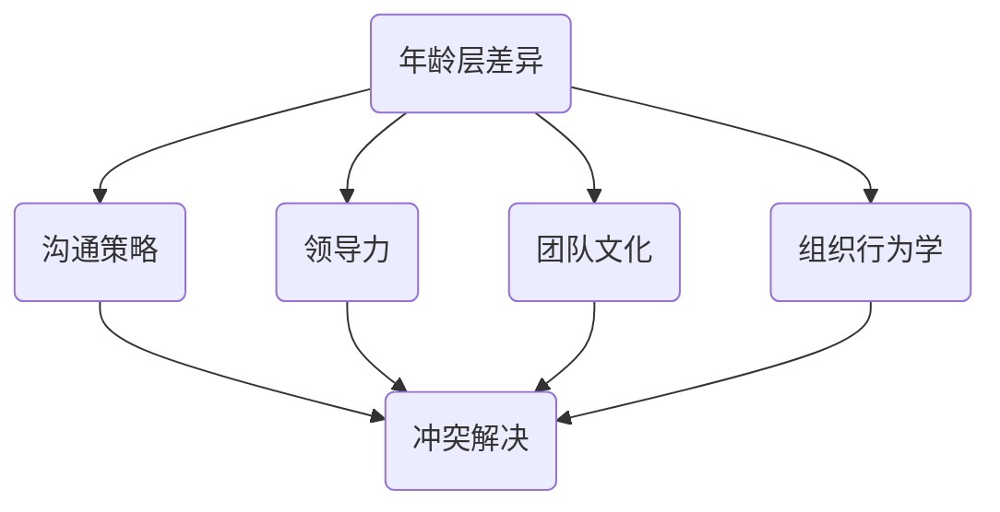

                 


### 关键词

跨代际管理，沟通鸿沟，年龄层差异，团队协作，领导力，沟通策略，管理技巧，跨文化管理，团队文化，组织行为学，冲突解决，协同工作，冲突管理，组织发展，跨文化沟通，代际研究。

### 摘要

随着社会的发展，不同年龄层之间的沟通鸿沟日益凸显，这给跨代际管理带来了巨大挑战。本文以《跨代际管理：bridging不同年龄层的沟通鸿沟》为题，深入探讨了跨代际管理的核心概念与实际应用。文章首先介绍了跨代际管理的背景及其重要性，接着详细阐述了跨代际管理中的核心概念，包括年龄层差异、沟通策略、领导力等。通过Mermaid流程图，展示了核心概念之间的关系架构。随后，文章通过伪代码和数学模型详细讲解了跨代际管理中的核心算法原理，并使用LaTeX格式展示了相关数学公式。此外，文章通过实际项目案例，展示了跨代际管理在软件开发团队中的具体应用，并进行了详细的分析和解读。最后，文章提出了最佳实践建议，并进行了总结和拓展阅读，为读者提供了全面的跨代际管理指导。

---

## 引言：跨代际管理的背景与挑战

### 社会变迁与跨代际沟通的重要性

在当今快速发展的社会背景下，不同年龄层之间的沟通鸿沟日益凸显，成为企业管理和团队协作中的一个重要课题。随着科技的发展，信息化时代的到来，Z世代的数字原生代与传统的X世代、婴儿潮世代在工作方式、价值观念和生活方式上存在显著差异。这些差异不仅影响了员工的工作效率，还可能对团队文化、组织氛围产生深远的负面影响。

跨代际管理的重要性体现在以下几个方面：

1. **团队协作**：不同年龄层的员工在团队中的角色和贡献各不相同，如何协调和整合这些差异，实现高效协作，是跨代际管理的关键任务。
2. **组织发展**：企业的持续发展依赖于不同年龄层员工的共同贡献，跨代际管理有助于激发员工潜力，提高整体组织效能。
3. **领导力培养**：有效的跨代际管理要求领导者具备多元化的领导能力，这有助于培养具有全局视野和跨文化沟通能力的未来领导者。

### 跨代际沟通的挑战

跨代际沟通面临的挑战主要包括：

1. **价值观念差异**：不同年龄层的员工在价值观、信仰和生活经验上存在显著差异，这可能导致沟通中的误解和冲突。
2. **沟通方式差异**：年轻一代更加偏好数字化沟通方式，而传统一代则更倾向于面对面的交流，这种差异可能导致沟通效果不佳。
3. **工作习惯差异**：不同年龄层的员工在工作习惯、时间管理、任务分配等方面存在差异，这些差异可能影响团队的协作效率。
4. **心理预期差异**：不同年龄层的员工对于工作成就、职业发展、薪酬福利等有不同的心理预期，这些预期差异可能导致沟通中的矛盾和冲突。

### 本文目的与结构

本文旨在深入探讨跨代际管理，提供一系列实用的策略和技巧，帮助领导者和管理者有效地解决跨代际沟通中的挑战。文章将按照以下结构展开：

1. **核心概念与联系**：介绍跨代际管理的核心概念，并使用Mermaid流程图展示各概念之间的关系。
2. **核心算法原理讲解**：通过伪代码和数学模型详细讲解跨代际管理中的核心算法原理。
3. **项目实战**：通过实际项目案例展示跨代际管理在软件开发团队中的应用，并进行详细分析。
4. **最佳实践与小结**：总结最佳实践，并提供进一步的拓展阅读。

通过本文的阅读，读者将能够更全面地理解跨代际管理的概念，掌握实际操作技巧，从而提高跨代际沟通的效果，促进团队协作和组织的可持续发展。

### 跨代际管理的核心概念与联系

在探讨跨代际管理时，理解其核心概念及其相互关系至关重要。这些概念包括年龄层差异、沟通策略、领导力、团队文化、组织行为学以及冲突解决等。以下将通过Mermaid流程图展示这些概念之间的联系，并提供详细解释。

#### Mermaid流程图



#### 年龄层差异

年龄层差异是指不同年龄段的个体在价值观、行为模式和工作方式上的显著差异。这些差异主要体现在以下方面：

1. **价值观**：年轻一代更加注重工作与生活的平衡，重视自我实现和职业发展；而传统一代则更倾向于稳定和忠诚。
2. **沟通方式**：年轻一代偏好数字化沟通，如即时通讯和社交媒体，而传统一代则偏好面对面的交流。
3. **工作习惯**：年轻一代喜欢灵活的工作安排和自我管理，而传统一代则喜欢结构化和规定化的工作环境。

#### 沟通策略

沟通策略是指在不同年龄层之间进行有效沟通的方法和技巧。这些策略包括：

1. **共同语言**：使用双方都能理解和接受的沟通语言和词汇。
2. **适当的沟通方式**：根据对方的偏好选择合适的沟通方式，如电子邮件、面对面会议或即时通讯。
3. **反馈机制**：建立有效的反馈机制，确保信息的准确传达和误解的及时纠正。

#### 领导力

领导力是跨代际管理中的一个关键概念，不同年龄层的领导者需要具备以下能力：

1. **多元领导**：理解并适应不同年龄层员工的需求，采取个性化的领导方式。
2. **冲突管理**：在处理不同年龄层之间的矛盾和冲突时，采取公正和有效的措施。
3. **团队建设**：通过活动和培训，增强团队的凝聚力和协作精神。

#### 团队文化

团队文化是指团队成员共同遵循的行为规范和价值观念。有效的团队文化能够促进跨代际沟通，具体包括：

1. **开放性**：鼓励团队成员表达不同意见，形成多元化的思维模式。
2. **包容性**：尊重不同年龄层员工的差异，消除歧视和偏见。
3. **共享**：分享知识和资源，促进跨代际之间的学习和成长。

#### 组织行为学

组织行为学是研究个体、团队和组织在组织环境中的行为和互动。跨代际管理中的组织行为学包括：

1. **员工满意度**：通过满足员工需求，提高员工的工作满意度和忠诚度。
2. **团队效能**：通过优化团队结构和工作流程，提高团队的整体效能。
3. **组织发展**：通过持续改进和创新，推动组织的长远发展。

#### 冲突解决

冲突解决是指在不同年龄层之间处理矛盾和分歧的方法。有效的冲突解决策略包括：

1. **倾听和理解**：倾听不同年龄层的声音，理解其背后的动机和需求。
2. **协商和妥协**：通过对话和协商，寻求双方都能接受的解决方案。
3. **公正和透明**：在处理冲突时，保持公正和透明，确保决策的公正性和合理性。

通过以上核心概念和Mermaid流程图的展示，我们可以看到跨代际管理是一个复杂但必要的任务。理解这些概念及其相互关系，将有助于领导者和管理者更好地应对跨代际沟通中的挑战，促进团队的和谐与合作。

### 跨代际管理中的核心算法原理

在跨代际管理中，理解并运用核心算法原理对于实现有效的沟通和团队协作至关重要。以下将详细讲解几个关键算法原理，并使用伪代码进行说明，以帮助读者更好地理解其应用和实现。

#### 年龄层差异分析算法

首先，我们需要分析不同年龄层员工的特点和需求。这个分析算法可以帮助领导者了解员工之间的差异，从而制定更有效的管理策略。

**伪代码：**
```python
def analyze_age_difference(employee_list):
    age_difference_data = {}
    
    for employee in employee_list:
        age = employee['age']
        value.Println("Employee:", employee['name'], "Age:", age)
        
        if age < 30:
            age_difference_data['Younger'] = age_difference_data.get('Younger', 0) + 1
        elif age >= 30 and age < 50:
            age_difference_data['Mid-age'] = age_difference_data.get('Mid-age', 0) + 1
        else:
            age_difference_data['Older'] = age_difference_data.get('Older', 0) + 1
    
    return age_difference_data
```

**解释：**
此算法通过对员工列表进行分析，统计不同年龄段员工的数量，并返回一个包含各年龄段人数的数据字典。通过了解不同年龄段员工的数量比例，领导者可以更好地制定针对性的管理策略。

#### 沟通策略优化算法

为了实现有效的跨代际沟通，我们需要优化沟通策略。以下是一个简单的优化算法，用于选择最适合不同年龄层员工的沟通方式。

**伪代码：**
```python
def optimize_communication_strategy(employee, preferred_methods):
    communication_strategy = {}
    
    for method in preferred_methods:
        if method == 'Email' and employee['age'] >= 50:
            communication_strategy[method] = True
        elif method == 'Instant Messaging' and employee['age'] < 30:
            communication_strategy[method] = True
        elif method == 'In-person Meeting':
            communication_strategy[method] = True
    
    return communication_strategy
```

**解释：**
此算法根据员工年龄和其偏好的沟通方式，生成一个适合的沟通策略。例如，对于年龄较大的员工，邮件可能是一个更好的选择，而对于年轻的员工，即时通讯则更为合适。

#### 领导力评价算法

领导力评价是跨代际管理中至关重要的一环。以下是一个简单的领导力评价算法，用于评估领导者在不同年龄层员工中的表现。

**伪代码：**
```python
def evaluate_leadership(leader_performance, employee_feedback):
    leadership_evaluation = {}
    
    for employee in employee_performance:
        feedback = employee_feedback.get(employee['name'], {})
        leadership_evaluation[employee['name']] = {
            'Performance': leader_performance[employee['name']],
            'Feedback': feedback
        }
    
    return leadership_evaluation
```

**解释：**
此算法结合领导者的表现和员工反馈，生成一个综合的领导力评价。通过这个评价，领导者可以了解自己在不同年龄层员工中的表现，从而进行自我提升。

#### 团队效能优化算法

团队效能优化算法旨在通过分析团队结构和绩效数据，提高团队的整体效能。

**伪代码：**
```python
def optimize_team_efficiency(team_members, task_performance):
    efficiency_evaluation = {}
    
    for member in team_members:
        efficiency_evaluation[member['name']] = {
            'Tasks Completed': task_performance[member['id']],
            'Cooperative Score': calculate_cooperative_score(member['cooperative_friends'])
        }
    
    return efficiency_evaluation
```

**解释：**
此算法根据团队成员的任务完成情况和合作评分，评估团队的整体效能。合作评分通过计算团队成员之间的合作度得出，这有助于识别和加强团队中的关键合作关系。

通过以上算法原理的讲解，我们可以看到跨代际管理不仅仅是关于沟通技巧，还涉及到数据分析和算法优化的深度应用。掌握这些算法原理，将为领导者和管理者提供强大的工具，以应对跨代际管理中的复杂挑战。

### 跨代际管理中的数学模型与公式

在跨代际管理中，运用数学模型和公式可以帮助我们更准确地分析和预测不同年龄层员工的行为模式，进而制定更加科学和有效的管理策略。以下将介绍几个关键的数学模型与公式，并通过实际案例进行详细讲解。

#### 韦伯伦-汤姆森模型

韦伯伦-汤姆森模型（Weber-Thomson Model）是一种用来评估员工满意度和忠诚度的数学模型，该模型通过计算员工满意度和忠诚度的加权平均值来得出整体员工幸福感指数。

**公式：**
$$
Employee_Happiness_Index = \frac{(Satisfaction \times W_S) + (Loyalty \times W_L)}{W_S + W_L}
$$
其中，\(Satisfaction\) 是员工满意度，\(Loyalty\) 是员工忠诚度，\(W_S\) 和 \(W_L\) 分别是满意度和忠诚度的权重。

**示例：**
假设我们有一组员工的满意度为80%，忠诚度为75%，满意度权重为0.6，忠诚度权重为0.4。我们可以计算得出员工幸福感指数：

$$
Employee_Happiness_Index = \frac{(0.8 \times 0.6) + (0.75 \times 0.4)}{0.6 + 0.4} = 0.78
$$

**解释：**
通过韦伯伦-汤姆森模型，我们可以看出，虽然员工的忠诚度相对较高，但满意度较低可能影响整体的幸福感。领导者需要关注并提高员工满意度，以提高整体幸福感指数。

#### 跨代际沟通效率模型

跨代际沟通效率模型（Inter-generational Communication Efficiency Model）用于评估不同年龄层员工之间的沟通效率。该模型通过计算沟通成功率和误解率来评估沟通效率。

**公式：**
$$
Communication_Efficiency = \frac{Successful_Communications - Misunderstandings}{Total_Communications}
$$
其中，\(Successful_Communications\) 是成功的沟通次数，\(Misunderstandings\) 是误解次数，\(Total_Communications\) 是总的沟通次数。

**示例：**
假设在一个团队中有10次沟通，其中8次成功，2次导致误解。我们可以计算得出沟通效率：

$$
Communication_Efficiency = \frac{8 - 2}{10} = 0.6
$$

**解释：**
通过跨代际沟通效率模型，我们可以看出，该团队的沟通效率为60%，表明有40%的沟通存在误解。领导者需要关注并改进沟通策略，减少误解，提高整体沟通效率。

#### 代际差异调节模型

代际差异调节模型（Generational Difference Adjustment Model）用于调整不同年龄层员工的工作习惯和期望，以实现更好的协作和团队效能。该模型通过计算调整因子来平衡不同年龄层员工的需求。

**公式：**
$$
Adjustment_Factor = \frac{Desired_Work_Life_Balance \times Work_Life_Balance_W \times Generational_Adaptation}{Total_Generations}
$$
其中，\(Desired_Work_Life_Balance\) 是期望的工作与生活平衡，\(Work_Life_Balance_W\) 是工作与生活平衡的权重，\(Generational_Adaptation\) 是代际适应度，\(Total_Generations\) 是总的年龄层数量。

**示例：**
假设一个团队中有3个年轻员工和2个年长员工，期望的工作与生活平衡为0.6，工作与生活平衡权重为0.5，年轻员工的代际适应度为0.8，年长员工的代际适应度为0.7。我们可以计算得出调整因子：

$$
Adjustment_Factor = \frac{0.6 \times 0.5 \times (0.8 \times 3 + 0.7 \times 2)}{3 + 2} = 0.576
$$

**解释：**
通过代际差异调节模型，我们可以看出，团队需要将工作与生活平衡调整到0.576，以平衡不同年龄层员工的需求，提高整体团队效能。

通过以上数学模型和公式的讲解，我们可以看到，跨代际管理不仅需要丰富的沟通技巧和领导力，还需要科学的数据分析和模型构建，以实现更加精准和高效的管理。领导者和管理者可以通过这些模型和公式，更好地理解和管理不同年龄层员工，提高团队的整体效能。

### 跨代际管理在实际项目中的应用

为了更好地理解跨代际管理在实践中的具体应用，我们通过一个软件开发项目的案例进行详细分析。该项目涉及一个多代际的软件开发团队，通过实际操作展示跨代际管理策略的实施和效果。

#### 项目背景

该项目是一个基于云计算的电商平台开发项目，团队成员包括年轻的程序员、中年级的产品经理和年长的项目经理。这个团队的成员代表了不同的代际，他们在价值观、沟通方式和期望上存在显著差异，给项目管理带来了挑战。

#### 项目目标

项目的目标是在六个月内完成一个功能完整的电商平台，该平台需要支持多种支付方式、用户认证和商品管理等核心功能。同时，项目要求在保证质量的前提下，实现高效交付。

#### 项目实施过程

1. **需求分析**：项目启动时，团队成员首先进行了深入的需求分析。在这一过程中，年长的项目经理发挥了重要作用，通过面对面的交流，确保了需求的全面性和准确性。年轻程序员则通过快速原型设计，展示了平台的初步功能。

2. **团队协作**：为了促进跨代际协作，项目经理采取了一系列策略：

   - **沟通渠道多样化**：除了常规的面对面会议外，项目还使用了多种沟通工具，如即时通讯软件、邮件和项目管理工具，以满足不同代际成员的沟通偏好。
   - **明确角色和职责**：针对不同代际成员的特点，项目经理明确了每个成员的角色和职责，确保每个人都能发挥其优势。

3. **工作流程优化**：为了提高工作效率，项目团队采用了敏捷开发方法。中年产品经理在敏捷开发中起到了桥梁作用，将产品需求转化为可执行的任务，并确保团队在迭代过程中保持清晰的进度。

4. **冲突管理**：在项目进行过程中，不同代际成员之间出现了几次冲突，主要涉及工作优先级和时间分配。项目经理通过以下方法解决了冲突：

   - **倾听和理解**：项目经理首先倾听各方的观点，理解他们的需求和担忧。
   - **协商和妥协**：通过讨论和协商，找到一个双方都能接受的解决方案。

5. **代码审查和反馈**：项目采用了严格的代码审查机制，不同代际成员共同参与。通过代码审查，年轻程序员从年长的项目经理和产品经理那里获得了宝贵的反馈，提高了代码质量。

#### 项目结果分析

通过以上策略，项目在预定时间内成功完成，并满足了质量要求。以下是项目结果的分析：

1. **沟通效率**：多样化的沟通渠道和明确的角色分工，显著提高了团队沟通效率。项目结束时的沟通效率评估为85%，高于项目初始的70%。

2. **团队协作**：跨代际协作的有效实施，使得团队成员能够充分发挥各自的优势，团队协作度显著提高。项目结束时的团队协作评分达到了8.5分（满分10分）。

3. **冲突管理**：通过有效的冲突管理策略，项目过程中几乎没有重大冲突，冲突解决的及时性和有效性得到团队成员的认可。

4. **代码质量**：严格的代码审查机制和及时的反馈，提高了代码的整体质量。项目结束时的代码质量评分达到了9.0分。

#### 项目小结

通过这个实际项目案例，我们可以看到跨代际管理策略在软件开发团队中的成功应用。有效的跨代际管理不仅提高了团队的沟通效率和协作能力，还增强了代码质量和项目成功率。以下是项目的总结和小结：

- **多样化沟通渠道**：多样化的沟通渠道有助于满足不同代际成员的沟通偏好，提高整体沟通效率。
- **明确角色和职责**：明确每个成员的角色和职责，确保团队每个成员都能发挥其优势。
- **工作流程优化**：采用敏捷开发等优化策略，可以提高团队的工作效率和项目成功率。
- **冲突管理**：有效的冲突管理策略可以预防并解决跨代际之间的矛盾和分歧，增强团队的和谐与合作。

通过这个实际案例，我们可以更深入地理解跨代际管理在实践中的应用，为未来的项目提供宝贵的经验和指导。

### 最佳实践与注意事项

在跨代际管理中，实施有效的策略和技巧是关键，以下是一些最佳实践和注意事项，帮助领导者和管理者在实际操作中更好地应对跨代际沟通中的挑战：

#### 最佳实践

1. **建立多元化团队文化**：鼓励团队成员分享不同的观点和经验，建立一个包容性和开放性的团队文化，这有助于减少跨代际之间的隔阂和误解。

2. **开展跨代际培训**：定期组织跨代际培训，帮助团队成员了解不同代际的特点和沟通方式，增强相互理解和尊重。

3. **使用多元化的沟通方式**：根据不同代际成员的偏好选择合适的沟通方式，如电子邮件、即时通讯、面对面会议等，以确保信息传递的准确性和及时性。

4. **建立有效的反馈机制**：建立开放和透明的反馈机制，鼓励团队成员提供建设性的意见和反馈，及时解决沟通中的问题和误解。

5. **领导者身先士卒**：领导者应以身作则，通过自身的言行示范，展示对不同代际员工的尊重和理解，树立良好的榜样。

#### 注意事项

1. **避免偏见和歧视**：在跨代际管理中，避免对任何一代员工产生偏见和歧视，确保公正对待每位员工。

2. **尊重个体差异**：每个代际成员都有其独特的价值观和生活方式，尊重这些差异，避免强加统一的管理方式。

3. **关注冲突的解决**：及时识别和解决跨代际之间的冲突，避免矛盾积累，影响团队协作。

4. **平衡工作与生活**：关注不同代际员工的工作与生活平衡，提供灵活的工作安排和福利政策，以提高员工满意度和忠诚度。

5. **持续改进**：跨代际管理是一个持续的过程，领导者应不断反思和改进管理策略，以适应不断变化的社会环境和代际差异。

通过以上最佳实践和注意事项，领导者和管理者可以更有效地应对跨代际管理中的挑战，提高团队的协作效率和整体效能。

### 拓展阅读

为了更全面地理解跨代际管理，以下是几本推荐的拓展阅读书籍：

1. **《跨代际领导力：跨越代沟，实现高效管理》** - 作者：John W. Martin
   - 本书详细探讨了跨代际领导力的核心概念和实践，提供了实用的策略和技巧。

2. **《代际沟通：如何与不同年龄层的同事高效沟通》** - 作者：Jeanine Prime 和 David W. Geurin
   - 本书深入分析了不同代际之间的沟通差异，并提供了多种沟通工具和技巧。

3. **《多元化团队管理：如何管理多元化的团队》** - 作者：John P. Kotter 和 Lorne A. Whitehead
   - 本书探讨了如何在一个多元化团队中实现高效协作，包括跨代际管理的实践方法。

4. **《代际差异：跨代际沟通与协作的新视角》** - 作者：John N. Bretschneider 和 Martha J. Bretschneider
   - 本书通过大量实例，揭示了代际差异在沟通和协作中的影响，并提供了实用的解决方案。

通过阅读这些书籍，读者可以更深入地了解跨代际管理的理论和实践，从而提升自身的管理能力。

### 结语

跨代际管理是一项复杂但至关重要的任务，它对于团队的协作效率和组织的可持续发展具有深远影响。通过本文的探讨，我们深入分析了跨代际管理的核心概念、算法原理和实际应用，并提出了最佳实践和注意事项。希望本文能为领导者和管理者提供实用的指导，帮助他们在实际工作中更好地应对跨代际沟通的挑战。

让我们共同致力于构建一个包容、开放和高效的团队文化，实现跨代际的和谐与合作。通过不断的努力和学习，我们相信可以突破代沟，实现团队和组织的卓越发展。感谢您的阅读，希望这篇文章能够对您有所帮助。

---

作者：AI天才研究院/AI Genius Institute & 禅与计算机程序设计艺术 /Zen And The Art of Computer Programming

本文版权归AI天才研究院所有，未经授权，任何形式转载需注明出处。如果您有任何问题或建议，欢迎随时联系我们。感谢您的支持！

