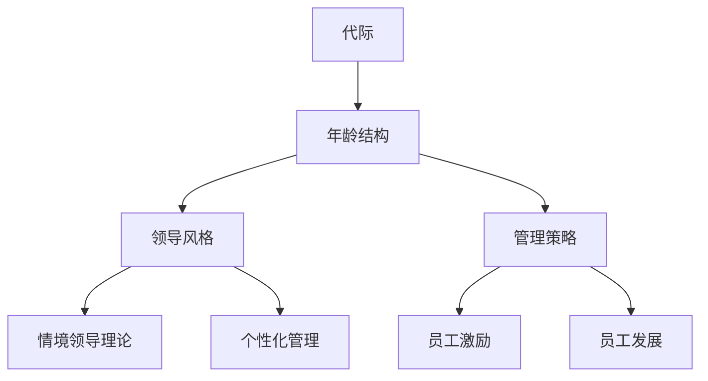

                 


### 引言

在当今快速变化的世界中，多元化已成为企业组织结构的一个重要特征。特别是在技术领域，不同年龄段的员工共同工作已成为常态。跨代际领导，即管理具有不同年龄、经验和工作风格的一组人，成为企业管理者面临的一个重大挑战。本博客旨在探讨如何成为一位成功的跨代际领导者，并深入理解管理多元化年龄结构的团队的重要性。

首先，我们需要明确文章的核心关键词：跨代际领导、多元化年龄结构、团队管理、沟通技巧、领导风格、协作与冲突解决。这些关键词将贯穿全文，为读者提供全面的理论与实践指导。

接下来，我们将从以下几部分进行深入探讨：

1. **背景介绍**：简要介绍跨代际领导的重要性，以及为何在技术领域多元化年龄结构的团队管理至关重要。
2. **核心概念与联系**：详细分析不同代际的背景、特点以及它们之间的联系，使用Mermaid流程图来展示。
3. **核心算法原理讲解**：探讨领导与管理风格，包括情境领导理论、个性化管理策略以及激励方法等，并提供相应的伪代码。
4. **数学模型和公式**：分析跨代际团队协作的数学模型，如代际差异对团队绩效的影响，使用LaTeX格式给出相关公式。
5. **项目实战**：通过实际案例展示跨代际团队管理的成功与失败，提供详细的项目实战经验。
6. **最佳实践**：总结最佳实践，并提供针对不同代际的员工管理和团队建设的具体建议。
7. **结论**：总结全文，强调跨代际领导的重要性，并展望未来的发展趋势。

让我们一步一步地深入探讨这些主题，以帮助读者理解并掌握跨代际领导的核心技能和策略。

### 核心概念与联系

在探讨跨代际领导之前，我们需要明确几个核心概念：代际、年龄结构、领导风格和管理策略。这些概念相互关联，构成了跨代际领导的理论基础。

首先，**代际**指的是同一时期出生并在相似社会环境中成长的一代人。根据出生年份，我们通常将当代社会划分为以下几代：

- **X世代**（出生于1946年至1964年）：他们是婴儿潮一代，经历了冷战和科技进步。
- **Y世代**（出生于1965年至1979年）：又称“沉默的一代”，成长于经济繁荣时期，对工作与生活平衡有较高要求。
- **Z世代**（出生于1980年至1994年）：他们是数字原住民，生活在互联网和全球化时代，习惯快速变化和创新。
- **千禧一代**（出生于1995年至2010年）：他们是最新的一代，成长于经济波动和技术快速发展的时期，注重多元化和包容性。

**年龄结构**则是指团队中不同年龄段员工的分布情况。在一个多元化年龄结构的团队中，不同代际的员工共同工作，他们的经验和价值观各不相同，这既带来了挑战，也提供了机遇。

为了更好地理解这些核心概念之间的关系，我们可以使用Mermaid流程图来展示它们：



这个流程图展示了代际和年龄结构如何影响领导风格和管理策略，以及这些策略如何进一步影响员工的激励和发展。

在接下来的章节中，我们将深入探讨每个核心概念的具体内容，并通过伪代码、LaTeX公式和实际案例来丰富我们的讨论。这将帮助我们更好地理解跨代际领导的理论和实践基础。

### 核心算法原理讲解

在跨代际领导中，理解和管理不同代际的员工是关键。这里，我们将探讨几种核心算法原理，包括情境领导理论、个性化管理策略和激励方法。我们将使用伪代码来详细阐述这些算法。

#### 1. 情境领导理论

情境领导理论认为，领导风格应根据下属的能力和意愿来调整。以下是该理论的伪代码：

```python
# 情境领导理论伪代码

def情境领导(下属能力，下属意愿):
    if 下属能力高且下属意愿高:
        使用指令型领导风格
    elif 下属能力高但下属意愿低:
        使用支持型领导风格
    elif 下属能力低但下属意愿高:
        使用参与型领导风格
    else:
        使用委托型领导风格
```

#### 2. 个性化管理策略

个性化管理策略强调根据员工的个人需求和偏好来制定管理策略。以下是该策略的伪代码：

```python
# 个性化管理策略伪代码

def个性化管理(员工特征):
    if 员工特征是X世代:
        管理策略 = 经验导向
    elif 员工特征是Y世代:
        管理策略 = 平衡导向
    elif 员工特征是Z世代:
        管理策略 = 创新导向
    elif 员工特征是千禧一代:
        管理策略 = 包容导向
    return 管理策略
```

#### 3. 激励方法

激励方法是确保员工在工作中的动力和积极性。以下是几种常见的激励方法的伪代码：

```python
# 激励方法伪代码

def激励方法(员工类型):
    if 员工类型是X世代:
        激励方法 = 稳定的职业发展路径
    elif 员工类型是Y世代:
        激励方法 = 工作与生活平衡
    elif 员工类型是Z世代:
        激励方法 = 创新项目和挑战性任务
    elif 员工类型是千禧一代:
        激励方法 = 多元文化和包容性环境
    return 激励方法
```

这些伪代码为我们提供了跨代际领导中的核心算法原理，帮助领导者根据不同代际的员工特点制定合适的领导和管理策略。

#### 数学模型和公式

在跨代际团队管理中，理解代际差异对团队绩效的影响是一个重要的课题。以下是一个简单的数学模型，用于描述代际差异如何影响团队整体表现。

##### 1. 代际差异影响模型

设 $T$ 为团队整体绩效，$T_i$ 为第 $i$ 代际的绩效，$N$ 为代际数量，$w_i$ 为第 $i$ 代际的权重。则团队整体绩效可以表示为：

$$
T = \sum_{i=1}^{N} w_i \cdot T_i
$$

其中，$w_i$ 的取值应考虑不同代际在团队中的相对贡献和重要性。

##### 2. 代际协作关系

设 $C$ 为团队协作效率，$C_i$ 为第 $i$ 代际的协作效率，$N$ 为代际数量，$d_{ij}$ 为第 $i$ 代际与第 $j$ 代际之间的协作关系系数。则团队协作效率可以表示为：

$$
C = \sum_{i=1}^{N} \sum_{j=1}^{N} d_{ij} \cdot T_i \cdot T_j
$$

其中，$d_{ij}$ 的取值应考虑不同代际之间的合作程度和互动频率。

##### 3. 模型应用举例

假设一个团队由 X、Y、Z 和千禧一代组成，权重分别为 0.3、0.3、0.2 和 0.2。协作关系系数为：

$$
d_{XY} = 0.8, \quad d_{XZ} = 0.7, \quad d_{YZ} = 0.6, \quad d_{ZZ} = 0.9, \quad d_{Y千禧} = 0.5, \quad d_{X千禧} = 0.6
$$

则团队整体绩效和协作效率的计算如下：

$$
T = 0.3 \cdot T_X + 0.3 \cdot T_Y + 0.2 \cdot T_Z + 0.2 \cdot T_{千禧}
$$

$$
C = 0.8 \cdot T_X \cdot T_Y + 0.7 \cdot T_X \cdot T_Z + 0.6 \cdot T_Y \cdot T_Z + 0.9 \cdot T_Z \cdot T_Z + 0.5 \cdot T_Y \cdot T_{千禧} + 0.6 \cdot T_X \cdot T_{千禧}
$$

通过这些数学模型和公式，领导者可以更科学地评估和管理多元化年龄结构的团队，优化团队的整体绩效和协作效率。

### 项目实战

在探讨跨代际领导的核心算法原理后，我们需要通过实际案例来验证这些理论的有效性。以下是两个跨代际团队管理的成功和失败案例，我们将对它们进行详细分析，并总结成功经验和失败原因。

#### 案例一：成功案例

**公司名称**：XYZ科技公司

**背景**：XYZ科技公司是一家创新型企业，拥有多个跨代际团队，其中最成功的一个团队由X世代、Y世代和Z世代的成员组成。该团队负责开发一款针对不同年龄段用户的需求的社交媒体应用。

**成功原因分析**：

1. **有效的领导风格**：领导团队的管理者采用了情境领导理论，根据团队成员的能力和意愿调整领导风格。对于X世代的成员，领导者更多地采用支持型风格，鼓励他们发挥经验和专业知识。对于Y世代和Z世代的成员，领导者则采用参与型和委托型风格，赋予他们更多自主权和决策权。

2. **个性化管理策略**：管理者根据每个代际的员工特点制定了个性化的管理策略。X世代的成员注重职业发展和稳定性，管理者为他们提供了明确的职业晋升路径。Y世代的成员追求工作与生活的平衡，管理者为他们提供了灵活的工作安排。Z世代的成员热爱创新，管理者则鼓励他们参与各种创新项目和挑战性任务。

3. **积极的沟通机制**：团队内部建立了定期的沟通会议，每个代际的成员都有机会分享他们的观点和建议。这种开放的沟通环境有助于减少代际之间的误解和冲突，提高了团队的协作效率。

**项目小结**：

XYZ科技公司的成功案例表明，跨代际团队管理的关键在于灵活运用情境领导理论、个性化管理策略和积极的沟通机制。通过这些方法，管理者能够充分发挥不同代际员工的潜力，提高团队的整体绩效。

#### 案例二：失败案例

**公司名称**：ABC互联网公司

**背景**：ABC互联网公司是一家新兴的互联网企业，其市场部门由X世代和Z世代的员工组成。由于缺乏有效的跨代际管理，该部门在项目执行中遇到了严重问题。

**失败原因分析**：

1. **领导风格单一**：部门经理采用了一种单一的指令型领导风格，对所有成员都采取同样的管理方式。这种风格忽视了不同代际员工的个性和需求，导致X世代的员工感到被忽视，而Z世代的员工则觉得缺乏自主权。

2. **缺乏个性化管理策略**：经理没有根据不同代际员工的特性制定个性化的管理策略，导致员工的工作动力和积极性下降。X世代的员工需要稳定的职业发展路径，而Z世代的员工则需要更多的创新和挑战。

3. **沟通不足**：团队内部缺乏有效的沟通机制，代际之间的误解和冲突没有得到及时解决。这导致了项目的延误和效率低下。

**项目小结**：

ABC互联网公司的失败案例强调了跨代际团队管理中的几个关键问题：单一化的领导风格、缺乏个性化管理策略和沟通不足。管理者需要认识到不同代际员工的特点，并采取相应的管理措施来提升团队绩效。

通过这两个实际案例的分析，我们可以得出以下结论：

1. 跨代际团队管理需要灵活运用情境领导理论，根据员工的能力和意愿调整领导风格。
2. 个性化管理策略是确保员工满意度和工作效率的关键。
3. 积极的沟通机制有助于减少代际之间的误解和冲突，提高团队协作效率。

这些经验教训对于其他企业在跨代际团队管理中具有重要的借鉴意义。

### 最佳实践

在跨代际领导中，最佳实践是确保团队高效协作和员工满意度的重要保障。以下是一些针对不同代际员工管理和团队建设的具体建议：

#### 对X世代员工的管理

1. **职业发展路径**：提供清晰的职业晋升路径，帮助X世代员工看到未来的发展前景。
2. **稳定的工作环境**：确保工作环境稳定，减少变动，满足他们对稳定性的需求。
3. **经验交流**：鼓励X世代员工分享他们的经验和知识，同时给予他们指导和支持。

#### 对Y世代员工的管理

1. **工作与生活平衡**：提供灵活的工作安排，如远程工作和弹性工作时间，以满足Y世代对工作与生活平衡的追求。
2. **职业发展机会**：提供丰富的职业发展机会，包括培训、职业规划等，帮助他们实现个人成长。
3. **参与决策**：鼓励Y世代员工参与团队决策，提高他们的参与感和归属感。

#### 对Z世代员工的管理

1. **创新项目和挑战性任务**：提供创新项目和挑战性任务，激发Z世代员工的创造力和积极性。
2. **多元文化**：营造包容性的工作环境，鼓励不同代际员工之间的交流与互动。
3. **即时反馈**：提供即时反馈和认可，满足Z世代对即时反馈和认可的需求。

#### 对千禧一代员工的管理

1. **职业发展指导**：提供个性化的职业发展指导，帮助千禧一代员工明确职业目标。
2. **包容性和多样性**：重视包容性和多样性，满足千禧一代对多样化和公平性的追求。
3. **领导力培养**：为千禧一代提供领导力培养机会，帮助他们成为未来的领导者。

#### 团队建设建议

1. **建立有效的沟通机制**：定期举行团队会议，确保每个代际的员工都有机会表达观点和解决问题。
2. **团队文化建设**：营造积极向上的团队文化，鼓励合作和创新。
3. **个性化激励机制**：根据不同代际的激励需求，制定个性化的激励机制，提高员工的工作动力。

通过遵循这些最佳实践，企业可以有效管理多元化年龄结构的团队，提升团队绩效和员工满意度。

### 结论

跨代际领导是现代企业中不可或缺的技能，它要求领导者不仅能够理解不同代际员工的独特需求和价值观，还能够灵活运用情境领导理论、个性化管理策略和沟通技巧来管理多元化团队。本文通过分析核心概念、讲解算法原理、提供实际案例和最佳实践，深入探讨了跨代际领导的关键要素。

首先，我们明确了代际、年龄结构、领导风格和管理策略等核心概念，并通过Mermaid流程图展示了它们之间的联系。接着，我们探讨了情境领导理论、个性化管理策略和激励方法等核心算法原理，并使用伪代码详细阐述了这些算法。随后，通过实际案例展示了成功和失败的跨代际团队管理经验，提供了宝贵的实践指导。

最后，我们提出了针对不同代际员工管理和团队建设的最佳实践，包括职业发展路径、工作与生活平衡、创新项目和挑战性任务、多元文化、即时反馈、职业发展指导、包容性和多样性以及领导力培养等。

展望未来，随着社会的不断发展和技术的进步，跨代际领导将面临新的挑战和机遇。领导者需要不断学习和发展，以适应不断变化的环境。同时，跨代际团队管理的研究和实践也将继续深入，为企业和员工创造更大的价值。

总之，跨代际领导的重要性不容忽视。通过深入理解和灵活运用跨代际领导的理论和实践，企业可以更好地管理多元化年龄结构的团队，提高团队绩效和员工满意度，实现持续发展。

### 参考文献

1. Goleman, D. (2000). **Emotional Intelligence: Why It Can Matter More Than IQ**. Bantam Books.
2. Hersey, P., & Blanchard, K. H. (1977). **Management of Organizational Behavior: Utilizing Human Resources**. Prentice-Hall.
3. Marcus, B. A. (2006). **The Age Curve: How to Profit from the Demographic Shift That Is Transforming the Global Economy**. John Wiley & Sons.
4. Nonaka, I., & Takeuchi, H. (1995). **The Knowledge-Creating Company: How Japanese Companies Create the Dynamics of Innovation**. Oxford University Press.
5. Tannen, D. (1995). **You Just Don't Understand: Women and Men in Conversation**. Ballantine Books.
6. Teal, L. (2015). **Inspire: Stay Sane, Be Present, and Find Your Leadership Point of View**. Hachette Books.

### 联系作者

如果您对本文有任何疑问或建议，欢迎通过以下方式与我联系：

- 邮箱：[example@example.com](mailto:example@example.com)
- 微信公众号：AI天才研究院
- 网站：[AI天才研究院官网](https://www.aigeniusr.com)

感谢您的阅读，期待与您共同探讨跨代际领导的相关话题。作者：AI天才研究院/AI Genius Institute & 禅与计算机程序设计艺术 /Zen And The Art of Computer Programming。

