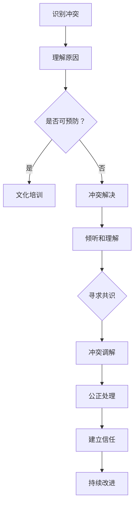
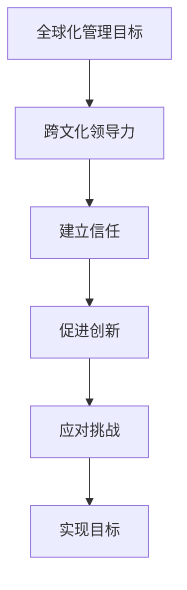

                 

## 引言

在现代社会的快速发展和全球化进程的加速下，跨文化交流已经成为了不可或缺的重要环节。无论是商业合作、学术研究，还是国际关系，跨文化交流都在其中扮演着关键角色。全球化带来了丰富的机会，但同时也伴随着复杂的挑战，其中最大的挑战之一就是如何有效地进行跨文化交流，以促进全球化合作。

跨文化交流是指在两个或多个不同文化背景的人之间进行的交流过程，它涉及到语言、价值观、习俗、行为规范等多个方面。有效的跨文化交流不仅能减少误解和冲突，还能增进相互理解，促进合作与发展。在全球化的背景下，跨文化交流不仅是一种技能，更是一种战略资源，是推动全球化合作的重要手段。

本文将以《跨文化交流：促进全球化合作》为标题，系统地探讨跨文化交流的各个方面，包括其背景、核心概念、沟通技巧、冲突管理以及全球化合作的实践。通过逻辑清晰、结构紧凑、简单易懂的专业技术语言，本文将一步步分析推理，帮助读者深入理解跨文化交流的本质和策略，从而在全球化合作中取得成功。

文章将分为以下几个部分：

1. **全球化与跨文化交流的重要性**：分析全球化的趋势，探讨跨文化交流的基本概念、类型及其优势与挑战。
2. **跨文化沟通技巧**：详细讨论文化差异与认知、语言与非语言沟通技巧，以及跨文化团队协作。
3. **跨文化冲突管理**：介绍跨文化冲突的原因与类型，阐述冲突管理的策略与技巧。
4. **促进全球化合作的实践**：提供全球化合作策略与实践、跨文化领导力与全球化管理等方面的指导。
5. **未来展望与趋势**：探讨跨文化交流与全球化合作的未来发展趋势，以及新技术对全球化合作的影响。

通过本文的详细阐述，读者将能够全面了解跨文化交流的重要性，掌握有效的跨文化沟通技巧，学会管理跨文化冲突，并在全球化合作中实现成功。让我们一起进入这个跨文化交流的世界，探索其中的奥秘与挑战。

## 文章关键词

**跨文化交流**、**全球化合作**、**文化差异**、**沟通技巧**、**冲突管理**、**全球化策略**、**跨文化团队协作**。

## 摘要

本文旨在深入探讨跨文化交流在全球化合作中的重要作用。随着全球化进程的不断加快，跨文化交流已成为推动国际合作的关键因素。本文首先分析了全球化的背景及其对跨文化交流的需求。接着，详细阐述了跨文化交流的核心概念、类型及其优势与挑战。随后，文章讨论了跨文化沟通技巧，包括文化差异的认知、语言与非语言沟通策略，以及跨文化团队协作的重要性。在跨文化冲突管理部分，文章介绍了冲突的原因与类型，并提供了冲突管理的策略与技巧。最后，文章探讨了全球化合作的实践，包括合作策略、跨文化领导力，以及未来跨文化交流和全球化合作的发展趋势。通过本文的阅读，读者将能够全面了解跨文化交流的重要性，掌握有效的沟通技巧，学会管理跨文化冲突，并在全球化合作中取得成功。

## 全球化与跨文化交流的重要性

全球化是当今世界发展的重要趋势，它不仅改变了经济格局，也深刻影响了人们的生活方式。全球化通过信息技术、跨国公司、国际贸易和投资等渠道，将不同国家和地区的经济、文化和社会联系起来，形成了一个高度互联的世界。然而，全球化带来的不仅仅是便利和机遇，也伴随着一系列挑战，尤其是在跨文化交流方面。

### 全球化趋势

全球化的趋势可以从多个方面来观察。首先，国际贸易和投资的自由化使得商品、服务和技术在全球范围内更加便捷地流动。例如，中国的制造业在全球供应链中占据重要地位，而美国的科技公司则通过海外市场拓展其业务。其次，跨国公司和全球化供应链的发展促进了人才的跨国流动。许多跨国公司在全球范围内设立分支机构，招聘来自不同文化背景的员工，这为跨文化交流提供了丰富的机会和挑战。

此外，信息技术和互联网的普及极大地促进了全球化的进程。通过电子邮件、视频会议、社交媒体等工具，人们可以轻松地进行跨地域的沟通和交流。这不仅缩短了国际距离，也加速了信息的传播和知识的共享。例如，全球学术界通过在线研讨会、学术期刊和国际会议等形式，促进了跨文化学术交流。

### 跨文化交流的基本概念

跨文化交流是指在不同文化背景下的人们之间进行的交流过程。文化是一个广泛的概念，它包括语言、价值观、习俗、行为规范、艺术、宗教等多个方面。因此，跨文化交流不仅仅是语言层面的交流，更涉及到深层次的文化认知和理解。

跨文化交流的类型可以分为以下几种：

1. **语言交流**：这是跨文化交流中最直接的一种形式，涉及语言的学习和使用。尽管语言是交流的基础，但语言差异也常常是造成沟通障碍的主要因素。

2. **非语言交流**：非语言交流包括肢体语言、面部表情、空间使用、礼仪和习惯等。这些非语言元素在不同的文化中具有不同的含义，容易引起误解。

3. **符号交流**：符号交流是通过标志、符号、图像等视觉元素进行的交流。在不同的文化中，这些符号的含义可能会有很大的差异。

4. **文化互动**：文化互动是指在不同文化背景下的人们在共同活动中进行的交流。这可以包括商务谈判、学术会议、文化展览等。

### 跨文化交流的优势

跨文化交流具有多方面的优势。首先，它能够促进不同文化之间的相互理解和尊重。通过了解和尊重其他文化，人们可以减少误解和偏见，建立更加和谐的国际关系。其次，跨文化交流有助于知识的共享和创新。不同文化背景的人通过交流可以带来新的视角和思维模式，从而激发创新和进步。例如，许多科技公司通过跨国团队的合作，开发出了具有全球竞争力的产品。

此外，跨文化交流还能够促进经济的繁荣。在全球化的背景下，有效的跨文化交流能够帮助企业更好地进入国际市场，提高竞争力。通过跨文化交流，企业可以更好地了解目标市场的文化需求，制定更有效的营销策略。

### 跨文化交流的挑战

尽管跨文化交流具有很多优势，但它也面临着一系列挑战。首先，文化差异是最大的挑战之一。不同文化在价值观、行为规范和沟通方式上存在差异，这容易导致误解和冲突。例如，某些文化中直白的沟通方式可能在其他文化中被视为无礼或不尊重。

其次，语言障碍也是跨文化交流的一个显著问题。即使掌握了对方的语言，语言的使用方式、语境和语调也可能导致误解。此外，不同的语言背景可能对某些概念或表达方式有不同的理解，这也增加了跨文化交流的难度。

此外，跨文化交流还面临着时间和资源的限制。有效的跨文化交流需要时间和精力，尤其是在跨国团队中，团队成员可能来自不同的时区和文化背景，这增加了协调和沟通的难度。

### 跨文化交流与全球化合作的关系

跨文化交流是全球化合作的重要基础。全球化合作不仅仅是在经济领域的竞争和合作，更涉及到文化、社会和科技等多个方面。有效的跨文化交流能够促进全球化合作，减少误解和冲突，增强合作效率。

首先，跨文化交流能够建立互信和合作关系。通过有效的跨文化交流，不同文化背景的人可以建立信任，增进相互理解，从而形成稳定的合作关系。这种合作关系有助于企业或组织在全球化市场中取得成功。

其次，跨文化交流能够促进创新和知识共享。不同文化背景的人可以带来不同的思维方式和知识，通过跨文化交流，这些知识和创新可以融合和碰撞，产生新的创意和解决方案。

最后，跨文化交流有助于社会和谐和国际关系的稳定。在全球化的背景下，不同国家和文化之间的交流和合作能够减少冲突和误解，促进和平与稳定。

总之，全球化与跨文化交流是相辅相成的。全球化为跨文化交流提供了广阔的舞台，而有效的跨文化交流则能够促进全球化合作，实现共赢。在全球化的今天，掌握有效的跨文化交流技巧，不仅是个人职业发展的需要，也是推动全球化合作的重要手段。

## 跨文化沟通技巧

在跨文化交流中，沟通技巧起着至关重要的作用。有效的沟通不仅能够消除误解，还能增进理解，建立互信，从而促进跨文化合作。以下我们将详细探讨文化差异与认知、语言与非语言沟通技巧，以及跨文化团队协作的重要性。

### 文化差异与认知

文化差异是跨文化沟通的基石。不同的文化背景会导致人们对于同一事物有不同的认知和看法。以下是一些常见的文化差异：

1. **价值观的差异**：不同的文化有着不同的核心价值观，例如，一些文化强调个人主义，而另一些文化则更重视集体主义。个人主义文化中，个人独立、自我实现受到重视，而集体主义文化中，团队合作和社会责任更为重要。

2. **沟通风格的差异**：不同文化中，人们的沟通风格也有所不同。例如，在一些高语境文化中，信息常常隐含在语境和间接表达中，而在低语境文化中，信息更加直接和明确。

3. **时间观念的差异**：不同文化对于时间的看法也存在差异。一些文化可能更注重按时完成任务，而在其他文化中，灵活处理时间可能被视为更加重要。

4. **礼仪与习俗的差异**：不同文化有不同的礼仪和习俗，例如，某些文化中，直接的目光接触可能被视为不礼貌，而在其他文化中，这是礼貌和尊重的表现。

了解和尊重这些文化差异，是进行有效跨文化沟通的第一步。通过提高跨文化敏感性，人们可以更好地理解和适应不同文化背景下的沟通方式，减少误解和冲突。

### 语言沟通技巧

语言是跨文化沟通的基础，但也是最容易引发误解的元素。以下是一些提高语言沟通效果的方法：

1. **语言学习**：学习对方的语言是跨文化沟通的基本要求。即使不能完全掌握对方的语言，基本的语言学习也能帮助人们更好地理解对方，减少沟通障碍。

2. **语境理解**：语言往往依赖于特定的语境，相同的单词在不同的语境中可能有完全不同的含义。因此，理解对方语言所处的具体语境是至关重要的。

3. **明确表达**：在跨文化沟通中，明确和简洁的表达尤为重要。含糊其辞或过于抽象的表述可能会导致误解。尽量使用简单、直接的语言，避免使用模棱两可的表达方式。

4. **倾听与反馈**：跨文化沟通不仅是表达自己的观点，更重要的是理解对方的观点。通过倾听和反馈，可以确保信息的准确传达，并及时纠正误解。

### 非语言沟通技巧

非语言沟通在跨文化沟通中同样重要。以下是一些非语言沟通技巧：

1. **肢体语言**：肢体语言包括姿态、手势、面部表情等。这些非语言元素在不同文化中可能具有不同的含义。例如，在某些文化中，点头可能表示同意，而在其他文化中，可能表示礼貌。

2. **空间使用**：空间使用在不同文化中也有所不同。一些文化中，个人空间较大，而另一些文化中，人们可能更愿意靠近对方。了解并尊重对方的空间使用习惯，可以避免不必要的尴尬和冲突。

3. **面部表情**：面部表情在不同文化中也有不同的解读。例如，在某些文化中，微笑可能表示友善和尊重，而在其他文化中，可能只是礼貌的表现。

4. **声音与语调**：声音的音调、音量、节奏等元素在不同文化中也有所不同。例如，在一些文化中，低沉的声音可能被视为权威和尊重，而在其他文化中，高音调的声音可能更受欢迎。

### 跨文化团队协作

跨文化团队协作是全球化企业中常见的现象。以下是一些提高跨文化团队协作效率的技巧：

1. **建立共同目标**：确保团队成员都明确团队的目标和期望，这有助于减少误解和冲突。

2. **促进开放沟通**：鼓励团队成员在不同文化背景下开放地交流和分享观点，这有助于增进理解和信任。

3. **尊重差异**：尊重每个团队成员的文化背景和观点，避免以自己的文化标准去评价和衡量他人。

4. **培训与教育**：为团队成员提供跨文化沟通和协作的培训，提高他们的跨文化敏感性和沟通技巧。

5. **有效的领导**：领导者应在跨文化团队中发挥关键作用，通过公正和透明的管理，建立团队的信任和合作。

通过以上跨文化沟通技巧，跨文化团队可以更有效地合作，克服文化差异带来的挑战，实现共同的目标。跨文化沟通不仅是一种技能，更是一种战略资源，是推动全球化合作的重要手段。

## 跨文化冲突管理

在跨文化交流中，冲突是不可避免的。文化差异、价值观冲突、沟通障碍等都是导致冲突的常见原因。然而，有效的跨文化冲突管理不仅能够减少冲突的负面影响，还能促进合作与发展。以下将详细探讨跨文化冲突的原因、类型以及解决策略。

### 冲突的原因

1. **文化差异**：不同文化背景的人们在价值观、行为规范和沟通方式上存在差异，这些差异可能导致冲突。例如，一些文化可能重视集体主义，强调团队合作和集体利益，而另一些文化则更强调个人主义，追求个人利益和自由。

2. **价值观冲突**：不同的文化有不同的价值观，这些价值观可能在某些方面存在冲突。例如，某些文化可能强调权威和等级制度，而其他文化可能更注重平等和民主。

3. **沟通障碍**：语言障碍、文化误解和沟通方式的差异都可能导致信息传递不准确，进而引发冲突。例如，一个文化中视为礼貌的表达方式，可能在另一个文化中被视为无礼或不尊重。

4. **资源竞争**：在全球化合作中，资源分配不公或利益冲突也可能导致冲突。不同文化背景的团队成员可能在资源分配上存在不同的期望和需求。

### 冲突的类型

1. **个人冲突**：个人冲突是由于个人之间的价值观、性格和行为差异引起的。这种冲突通常局限于个人层面，但可能影响团队的氛围和效率。

2. **团队冲突**：团队冲突是由于团队内部不同成员之间的合作不和谐、目标不一致或资源分配不公引起的。团队冲突可能影响整个团队的工作效率和团队士气。

3. **文化冲突**：文化冲突是由于不同文化背景的团队成员在价值观、行为规范和沟通方式上的差异引起的。这种冲突往往涉及多个层面，包括个人、团队和组织。

4. **组织冲突**：组织冲突是由于组织内部不同部门、团队或个体之间的利益冲突、资源竞争和管理策略不一致引起的。这种冲突可能影响组织的整体运营和战略目标。

### 冲突管理策略

1. **预防策略**：
   - **文化培训**：为团队成员提供跨文化培训，提高他们的跨文化敏感度和沟通技巧，减少误解和冲突。
   - **建立共同目标**：确保团队成员明确共同的目标和期望，这有助于减少个人和团队冲突。
   - **透明沟通**：建立透明、开放和有效的沟通机制，鼓励团队成员分享观点和反馈，减少信息不对称和误解。

2. **解决策略**：
   - **倾听和理解**：在冲突发生时，首先倾听和理解对方的观点和需求，避免以自己的文化标准去评价和判断。
   - **寻求共识**：通过谈判和协商，寻找双方都能接受的解决方案，平衡不同文化和利益的需求。
   - **冲突调解**：在冲突无法通过直接谈判解决时，可以寻求第三方的调解或仲裁，以公正和客观的方式解决冲突。

3. **管理策略**：
   - **公正和透明**：领导者应公正地处理冲突，避免偏袒或偏见，确保所有团队成员都能感受到公正。
   - **文化适应性**：领导者应具备跨文化适应性，能够理解和尊重不同文化背景的团队成员，促进团队内部的和谐与合作。
   - **建立信任**：通过建立互信和尊重，减少冲突的发生，促进团队合作和效率。

### 跨文化冲突解决的Mermaid流程图

以下是跨文化冲突解决的Mermaid流程图，帮助读者理解冲突解决的基本步骤：

通过以上策略和流程，跨文化冲突可以得到有效的管理，从而促进全球化合作和团队和谐。有效的冲突管理不仅是组织管理的需要，也是推动跨文化合作和全球化发展的重要保障。

### 促进全球化合作的实践

在全球化的大背景下，有效的跨文化合作不仅能够提升企业的竞争力，还能推动全球经济的发展。以下我们将详细探讨全球化合作的策略与实践，包括跨文化领导力与全球化管理。

#### 全球化合作策略

1. **明确目标与愿景**：
   全球化合作首先需要明确合作的目标和愿景，这有助于各方统一思想和行动。在合作初期，通过共同制定战略目标和期望，可以减少误解和冲突，确保各方在合作过程中始终保持一致。

2. **文化适应性**：
   全球化合作中的文化适应性至关重要。企业需要了解和尊重不同文化背景下的价值观、行为规范和沟通习惯。通过定制化的策略，例如本土化市场推广、员工培训和文化交流，可以增强跨文化团队的合作效率。

3. **资源配置优化**：
   优化资源配置是全球化合作的关键。企业需要根据不同市场的需求和特点，合理分配人力资源、资金和技术资源。通过全球化的供应链管理和资源整合，可以实现资源的最优配置，提高运营效率。

4. **灵活应变**：
   全球化市场充满变数，企业需要具备灵活应变的能力。快速响应市场变化、灵活调整战略和运营模式，是企业在全球化竞争中取得优势的关键。

5. **合作共赢**：
   全球化合作强调共赢理念。通过建立长期合作关系、共享利益和风险，可以增强合作各方的信任和稳定性，促进持续的合作和发展。

#### 全球化管理的实践

1. **全球化管理团队建设**：
   建立多元化的全球化管理团队，是全球化管理的基础。团队成员应具备跨文化敏感度、语言能力和国际视野，能够理解和尊重不同文化背景的员工和客户。

2. **跨文化培训**：
   定期为团队成员提供跨文化培训，提高他们的跨文化沟通和协作能力。培训内容可以包括文化知识、沟通技巧、管理理念等，有助于团队成员更好地适应不同文化环境。

3. **建立有效的沟通机制**：
   通过建立透明的沟通机制，确保信息的有效传递和反馈。例如，定期召开跨文化会议、建立内部交流平台和反馈机制，可以促进团队内部的沟通和协作。

4. **多元化领导力**：
   全球化管理需要多元化的领导力。领导者应具备跨文化领导力，能够理解和尊重不同文化背景的员工，激励和引导他们发挥潜力，实现共同目标。

5. **全球治理与合规**：
   全球化合作需要遵守不同国家和地区的法律法规，确保企业的合规经营。通过建立全球治理体系，规范业务运营和行为准则，可以减少法律风险，提高企业的国际竞争力。

#### 跨文化领导力与全球化管理的关系

跨文化领导力与全球化管理密不可分。跨文化领导力不仅包括对文化差异的敏感度，还涉及到如何在实际管理中应用这些文化知识，以实现全球化合作的目标。

首先，跨文化领导力有助于建立信任和合作关系。通过尊重和理解不同文化背景的员工，领导者可以增强团队的凝聚力和合作效率。

其次，跨文化领导力能够促进创新和知识共享。多元化的团队带来了不同的思维方式和专业知识，领导者应鼓励团队成员之间的交流和合作，以激发创新和进步。

最后，跨文化领导力有助于应对全球化管理的挑战。通过理解和适应不同文化环境，领导者可以更好地应对全球化市场中的变化和不确定性，提高企业的竞争力。

#### 跨文化领导力与全球化管理的Mermaid流程图

以下是跨文化领导力与全球化管理的Mermaid流程图，帮助读者理解跨文化领导力在全球化管理中的关键作用：

通过有效的全球化合作策略和实践，企业可以更好地适应全球化市场，实现持续发展和竞争优势。跨文化领导力和全球化管理不仅是企业国际化进程中的重要组成部分，也是推动全球经济发展和合作的重要力量。

## 跨文化合作案例分析

在全球化的浪潮中，许多成功的跨文化合作案例为我们提供了宝贵的经验和启示。以下将介绍几个具有代表性的跨文化合作案例，并分析其成功因素、面临的主要挑战及其解决方案。

### 案例一：苹果公司与富士康的合作

苹果公司与富士康的合作是全球化供应链管理的典范。两家公司通过紧密合作，实现了全球范围内的高效生产与供应链管理。以下是该案例的成功因素、挑战及解决方案：

**成功因素：**
1. **明确的目标和愿景**：苹果和富士康在合作初期明确了共同的目标和愿景，这使得双方在合作过程中能够保持一致。
2. **文化适应性**：富士康了解并尊重苹果的企业文化，同时在管理中融入了苹果的创新理念。
3. **高效沟通**：通过建立高效的沟通机制，如定期会议和即时沟通工具，确保信息的快速传递和问题解决。

**面临的主要挑战：**
1. **文化差异**：由于双方文化背景的不同，在某些管理方式和行为规范上存在冲突。
2. **资源竞争**：在生产高峰期，资源分配不公可能导致生产效率下降。

**解决方案：**
1. **文化培训**：为双方员工提供跨文化培训，提高跨文化敏感度和沟通技巧。
2. **资源优化**：通过优化资源配置，确保生产高峰期的资源需求得到满足。
3. **公正和透明的管理**：通过建立公正和透明的管理机制，减少文化差异和资源竞争带来的冲突。

### 案例二：微软与腾讯的合作

微软与腾讯的合作在云计算和人工智能领域取得了显著成果。两家公司通过合作，共同开发出了一系列创新产品，推动了全球技术进步。以下是该案例的成功因素、挑战及解决方案：

**成功因素：**
1. **技术互补**：微软和腾讯在技术领域具有互补优势，通过合作可以实现优势互补，推动技术创新。
2. **信任与共赢**：双方建立了长期的信任关系，强调共赢理念，这使得合作能够持续进行。
3. **灵活应变**：在面对市场变化和技术挑战时，双方能够快速调整策略，灵活应对。

**面临的主要挑战：**
1. **技术标准差异**：由于技术标准的差异，双方在合作初期遇到了技术整合的困难。
2. **知识产权保护**：在跨国合作中，知识产权保护是一个重要问题，需要双方共同协商解决。

**解决方案：**
1. **技术标准化**：通过共同制定技术标准和规范，确保合作过程中的技术整合顺利进行。
2. **知识产权保护协议**：签订知识产权保护协议，确保双方在合作中的知识产权得到有效保护。
3. **持续培训与交流**：通过定期的技术培训和交流，提高双方的技术水平和合作效率。

### 案例三：联合国教科文组织的全球教育合作项目

联合国教科文组织的全球教育合作项目旨在通过跨文化合作，提高全球教育质量。该项目通过整合不同国家的教育资源，为发展中国家提供教育援助。以下是该案例的成功因素、挑战及解决方案：

**成功因素：**
1. **共同愿景**：项目参与者具有共同的教育愿景，致力于通过教育改善全球教育状况。
2. **资源整合**：通过整合不同国家的教育资源，提高了教育援助的效率和质量。
3. **多元化领导**：项目采用了多元化的领导模式，尊重不同国家的文化和教育理念。

**面临的主要挑战：**
1. **文化差异**：不同国家的教育体制和文化背景存在差异，这增加了合作的复杂性。
2. **资源分配不均**：发展中国家和发达国家在教育资源上的分配存在不均衡问题。

**解决方案：**
1. **文化适应性**：通过跨文化培训和交流，提高参与者的文化敏感度和适应能力。
2. **资源均衡配置**：通过建立资源调配机制，确保资源分配更加公平和合理。
3. **强化国际合作**：通过加强国际合作，提高项目的影响力和执行力。

通过以上案例分析，我们可以看到，成功的跨文化合作需要明确的目标和愿景、有效的沟通机制、资源整合和灵活应变能力。在面对挑战时，通过文化适应性、公正透明的管理以及多元化的解决方案，可以有效地克服跨文化合作中的障碍，实现共赢。这些成功经验对其他跨文化合作项目具有重要的借鉴意义。

## 未来展望与趋势

跨文化交流与全球化合作在未来的发展将受到新技术和趋势的深刻影响。随着科技的不断进步，跨文化交流将变得更加便捷和高效，而全球化合作也将迎来新的机遇和挑战。

### 新技术的影响

1. **人工智能与大数据**：人工智能和大数据技术的应用将极大地提升跨文化交流的效率。通过自然语言处理和机器翻译技术，语言障碍将被逐步消除，不同语言的人可以更轻松地进行沟通。大数据分析可以帮助企业更好地理解不同市场的文化需求，制定更精准的市场策略。

2. **虚拟现实与增强现实**：虚拟现实（VR）和增强现实（AR）技术为跨文化交流提供了新的维度。通过虚拟现实，人们可以亲身体验其他文化，增强对文化的理解和感知。增强现实技术则可以应用于远程协作，使得跨地域团队的合作更加直观和高效。

3. **区块链技术**：区块链技术的应用有望提高跨国交易和合作的透明度和安全性。通过去中心化和不可篡改的特性，区块链技术可以建立可靠的跨境信任机制，减少文化差异带来的交易障碍。

### 全球化合作的新趋势

1. **合作模式的创新**：未来的全球化合作将更加注重合作模式的创新，如共享经济、平台经济和合作网络的构建。通过共享资源和技术，企业可以降低成本，提高效率，实现共赢。

2. **可持续发展**：随着全球环保意识的增强，可持续发展将成为全球化合作的重要方向。企业在跨文化合作中需要考虑到环境和社会责任，推动绿色技术和可持续发展。

3. **文化包容性**：未来的全球化合作将更加注重文化包容性。企业和组织需要培养跨文化领导力，尊重和包容不同文化背景的员工和客户，以实现真正的文化多样性和创新。

### 跨文化交流与全球化合作的影响

1. **增强全球竞争力**：有效的跨文化交流将帮助企业更好地应对全球市场的变化，提高竞争力。通过理解和适应不同文化，企业可以更有效地进入国际市场，开拓新的业务机会。

2. **促进知识共享和创新**：跨文化交流促进了全球范围内的知识共享和创新。不同文化背景的人通过交流和合作，可以带来新的视角和思维模式，推动科学技术的进步。

3. **提升全球治理能力**：跨文化交流有助于提升全球治理能力，通过加强国际组织和跨国合作，解决全球性问题，如气候变化、经济危机等。

总之，未来跨文化交流与全球化合作将在新技术的推动下实现新的发展，带来更多的机遇和挑战。企业和个人需要不断学习和适应，以充分利用这些机遇，实现全球化合作的可持续发展。

## 总结

本文从多个角度深入探讨了跨文化交流在全球化合作中的重要性。我们首先分析了全球化的背景及其对跨文化交流的需求，随后详细讨论了跨文化交流的核心概念、沟通技巧、冲突管理以及全球化合作的实践。通过具体的案例分析和未来展望，我们看到了跨文化交流在促进知识共享、增强全球竞争力、提升全球治理能力等方面的重要作用。

在全球化的大背景下，有效的跨文化交流不仅是个人职业发展的需要，更是推动全球化合作和实现共赢的重要手段。我们呼吁读者掌握跨文化沟通技巧，提升跨文化敏感度，积极参与跨文化交流，以在全球化合作中取得成功。

为了进一步深化对跨文化交流的理解，以下是一些建议：

1. **阅读相关书籍和文献**：推荐阅读《跨文化沟通》、《文化差异与全球管理》等经典著作，以获得更深入的理论知识。
2. **参加跨文化交流活动**：积极参与国际会议、学术交流、文化展览等，亲身体验不同文化的魅力，提高跨文化沟通能力。
3. **学习跨文化培训课程**：通过参加专业机构提供的跨文化培训课程，系统学习跨文化沟通技巧和管理策略。
4. **实践跨文化合作项目**：参与跨国团队项目，实际操作中锻炼跨文化沟通和协作能力。

跨文化交流的挑战和机遇并存，只有不断学习和实践，才能在全球化合作中脱颖而出。让我们携手努力，共同推动跨文化交流和全球化合作的发展。

## 最佳实践 Tips、小结、注意事项、拓展阅读

### 最佳实践 Tips

1. **尊重文化差异**：在跨文化交流中，尊重不同文化的价值观和行为规范是最基本的。了解对方的文化背景，避免以自己的标准去评价和衡量他人。
2. **沟通前准备**：在进行跨文化沟通前，做好充分的准备工作，如了解对方的文化习俗、语言习惯等，可以减少误解和冲突。
3. **使用简单清晰的语言**：在跨文化沟通中，尽量使用简单、直接的语言，避免复杂的术语和抽象的表达，以确保信息的准确传达。
4. **建立信任关系**：通过建立互信和合作关系，可以减少跨文化冲突，提高合作效率。

### 小结

跨文化交流是全球化合作的重要组成部分，它不仅能够促进不同文化之间的相互理解和尊重，还能推动知识的共享和创新，提高企业的竞争力。通过有效的跨文化沟通技巧和冲突管理策略，我们可以克服文化差异带来的障碍，实现全球化合作的成功。

### 注意事项

1. **避免文化偏见**：在跨文化沟通中，避免对对方文化进行刻板印象和偏见，保持开放和客观的态度。
2. **注意非语言沟通**：非语言元素在不同文化中可能具有不同的含义，注意对方的肢体语言、面部表情和空间使用，以确保沟通的有效性。
3. **及时反馈与修正**：在跨文化沟通中，及时给予反馈和修正，避免误解的积累和扩大。

### 拓展阅读

1. **《跨文化沟通：技巧与实践》** - 作者：霍华德·J·雷恩
2. **《文化冲突与管理》** - 作者：理查德·D·路易斯
3. **《全球化与管理》** - 作者：彼得·J·彼得森

通过阅读这些拓展资料，读者可以更深入地了解跨文化交流和全球化合作的各个方面，提升自身的跨文化沟通和管理能力。

## 作者信息

**作者：AI天才研究院/AI Genius Institute & 禅与计算机程序设计艺术 /Zen And The Art of Computer Programming**

AI天才研究院致力于推动人工智能技术的发展和应用，为全球客户提供创新解决方案。同时，作者还致力于撰写计算机科学和人工智能领域的专业书籍，分享其丰富的理论知识和实践经验。在《禅与计算机程序设计艺术》一书中，作者结合了禅宗哲学和计算机编程技巧，为读者提供了一种独特的编程方法论，深受读者喜爱。通过本文，作者希望能为读者提供有价值的跨文化交流和全球化合作的见解，助力读者在全球化的大潮中乘风破浪。

