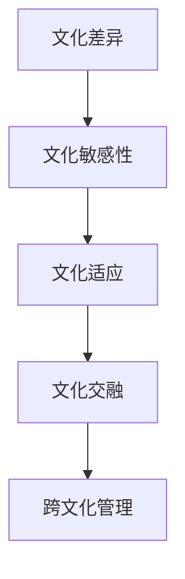
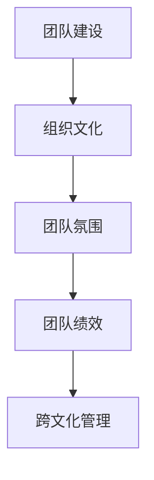
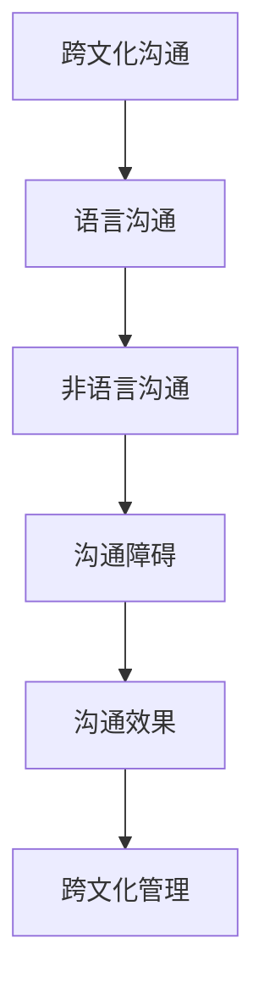
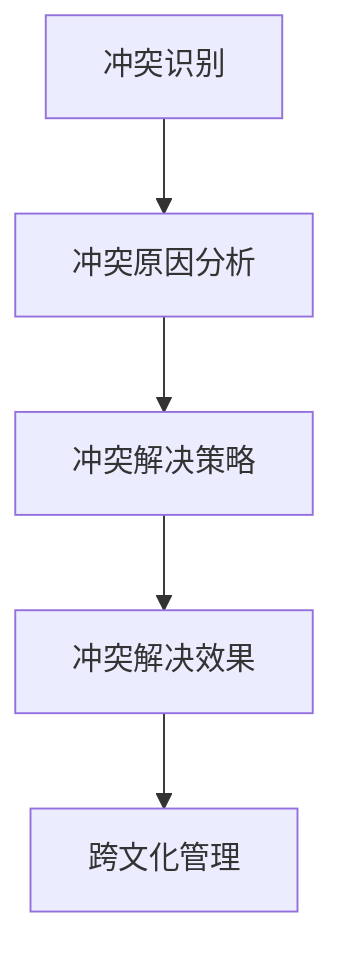

                 

### 文章标题

# 跨文化团队管理：bridging the cultural gap

在全球化不断深入的今天，跨文化团队管理成为了企业领导者和管理者面临的一大挑战。本文将围绕这一主题，详细探讨跨文化管理的理论基础、实践方法、案例分析以及技能提升等方面，旨在帮助读者理解和应对跨文化团队管理中的种种问题。文章关键词包括“跨文化管理”、“文化差异”、“团队建设”、“沟通策略”和“冲突解决”。通过本文的阅读，读者将能够掌握跨文化团队管理的核心知识，提升实际管理能力。

## 文章摘要

本文首先介绍了跨文化管理的概念与重要性，明确了文化差异在跨文化管理中的核心地位。接着，探讨了跨文化管理的理论框架，包括高-低语境文化模型、个性和集体主义模型以及权力距离模型。随后，文章深入分析了文化敏感性培养的重要性及方法，以及跨文化沟通策略和冲突解决技巧。为了更好地理解和应用这些理论，文章通过多个实际案例进行了详细解析。最后，文章总结了跨文化团队管理的最佳实践，并提供了进一步学习资源，帮助读者持续提升跨文化管理能力。

## 第一部分：理论基础与框架

### 1.1 跨文化管理的概念与重要性

#### 背景介绍

随着全球化的加速，企业越来越需要在国际市场上开展业务。这种国际化不仅带来了新的市场机会，同时也带来了跨文化团队管理的挑战。跨文化管理，顾名思义，是指在不同文化背景下进行管理活动的理论与实践。在全球化的背景下，企业经常需要组建由不同国籍、不同文化背景的员工组成的团队，这为企业的运营和管理带来了新的挑战。

#### 核心概念与联系

跨文化管理涉及到多个核心概念，其中最为重要的包括文化差异、文化敏感性、文化适应和文化交融。以下是这些概念之间的关系架构 Mermaid 流程图：

#### 文化差异分析模型

为了更好地理解和应对文化差异，跨文化管理理论中提出了多种文化差异分析模型。以下是一些常用的模型：

1. **高-低语境文化模型**：该模型由爱德华·霍尔提出，认为文化可以分为高语境文化和低语境文化。高语境文化依赖上下文信息，如日本、中国等；低语境文化则更注重直接表达，如美国、德国等。

2. **个性和集体主义模型**：霍夫斯泰德提出的文化维度理论将文化分为个性和集体主义两个维度。个性主义文化强调个人主义，如美国、英国等；集体主义文化则强调集体主义，如日本、韩国等。

3. **权力距离模型**：该模型由霍夫斯泰德提出，衡量文化中权力分配的不平等程度。权力距离大，如印度、俄罗斯等；权力距离小，如瑞典、丹麦等。

#### 跨文化适应理论

跨文化适应理论主要包括两个方面：个体适应和组织适应。

1. **个体适应**：个体适应是指个人在新的文化环境中调整自己的行为和思维方式，以更好地适应新环境。个体适应通常包括文化学习、文化接受和文化整合三个阶段。

2. **组织适应**：组织适应是指企业或组织在跨文化环境中调整自身的管理模式、组织文化以及战略方向，以更好地适应新环境。组织适应包括文化同化、文化融合和文化创新等策略。

#### 文化敏感性培养

文化敏感性培养是跨文化管理的重要组成部分。它包括以下几个方面：

1. **文化敏感性定义**：文化敏感性是指个体对文化差异的识别、理解和反应能力。

2. **文化敏感性培养方法**：包括跨文化培训、文化交流活动、自我反思等。

3. **跨文化沟通技巧**：跨文化沟通技巧是文化敏感性培养的重要组成部分，包括有效倾听、明确表达、非语言沟通等。

### 1.2 跨文化管理的理论框架

#### 高-低语境文化模型

高-低语境文化模型是由爱德华·霍尔提出的文化差异分析模型。根据这个模型，文化可以分为高语境文化和低语境文化。

1. **高语境文化**：高语境文化依赖于上下文信息，如日本、中国等。在这种文化中，信息的大部分内容被包含在非言语交流、环境背景以及交流过程中的暗示中。

2. **低语境文化**：低语境文化更注重直接表达，如美国、德国等。在这种文化中，信息的主要部分由语言本身传达，而非依赖上下文。

#### 个性和集体主义模型

个性和集体主义模型是由霍夫斯泰德提出的文化维度理论。根据这个模型，文化可以被分为个性主义和集体主义两个维度。

1. **个性主义文化**：个性主义文化强调个人主义，如美国、英国等。在这种文化中，个人拥有自主权，追求个人成就和自我实现。

2. **集体主义文化**：集体主义文化强调集体主义，如日本、韩国等。在这种文化中，个人是集体的一部分，追求集体的利益和和谐。

#### 权力距离模型

权力距离模型是由霍夫斯泰德提出的另一个文化维度理论。这个模型衡量文化中权力分配的不平等程度。

1. **高权力距离文化**：高权力距离文化如印度、俄罗斯等，这些文化中，权力差距较大，上级对下级有较强的控制力。

2. **低权力距离文化**：低权力距离文化如瑞典、丹麦等，这些文化中，权力差距较小，上下级之间的关系更加平等。

### 1.3 文化敏感性培养

#### 文化敏感性定义

文化敏感性是指个体对文化差异的识别、理解和反应能力。它包括以下几个方面：

1. **文化认知**：对文化差异的认识和了解，包括文化价值观、信仰、习俗等。

2. **文化理解**：对文化差异背后的原因和逻辑的理解，包括文化历史、社会结构等。

3. **文化适应**：在新的文化环境中调整自己的行为和思维方式，以更好地适应新环境。

#### 文化敏感性培养方法

1. **跨文化培训**：通过专业培训，提高个体对文化差异的认识和理解。

2. **文化交流活动**：通过参与各种文化交流活动，加深对其他文化的了解和体验。

3. **自我反思**：通过自我反思，了解自己在不同文化环境中的行为和思维方式，找到改进的方向。

#### 跨文化沟通技巧

跨文化沟通技巧是文化敏感性培养的重要组成部分。以下是一些关键的跨文化沟通技巧：

1. **有效倾听**：在跨文化沟通中，倾听是非常重要的。通过有效倾听，可以更好地理解对方的文化背景和意图。

2. **明确表达**：在跨文化沟通中，表达清晰、明确非常重要。这有助于避免误解和冲突。

3. **非语言沟通**：在跨文化沟通中，非语言沟通（如肢体语言、面部表情等）的作用非常显著。了解并掌握不同文化的非语言沟通特点，可以有效地提升沟通效果。

### 小结

本部分介绍了跨文化管理的概念与重要性，以及文化差异分析模型和跨文化适应理论。通过这些理论，我们可以更好地理解跨文化团队管理的复杂性，并为实际操作提供指导。接下来，我们将深入探讨跨文化团队管理的实践方法，包括团队建设、沟通策略和冲突解决等。

## 第二部分：跨文化团队管理的实践方法

### 2.1 团队建设与组织文化

#### 核心概念与联系

团队建设和组织文化是跨文化团队管理的重要组成部分。以下是一个关于团队建设与组织文化的 Mermaid 流程图：

#### 团队建设的原则

有效的团队建设需要遵循以下原则：

1. **共同目标**：明确团队的目标和愿景，确保所有成员都朝着同一方向努力。

2. **角色定位**：为每个成员分配明确的角色和责任，确保每个成员都能发挥自己的优势。

3. **相互信任**：建立信任是团队成功的关键。通过开放沟通和互相支持，增强团队成员之间的信任。

4. **团队氛围**：营造积极、开放和包容的团队氛围，鼓励团队成员自由表达意见和提出建议。

#### 组织文化的构建与适应

组织文化是团队建设的基础。以下是构建和适应组织文化的步骤：

1. **文化价值观**：明确组织的核心价值观，并确保所有团队成员都认同这些价值观。

2. **行为规范**：制定明确的行为规范，确保团队成员在行为上遵循组织的价值观。

3. **文化传承**：通过培训和宣传，确保新成员了解和适应组织文化。

4. **文化适应**：对于跨文化团队，需要特别关注文化适应问题。通过文化交流和培训，帮助团队成员适应新的文化环境。

#### 跨文化团队中的领导风格

在跨文化团队中，领导风格的选择至关重要。以下是几种常见的领导风格：

1. **权威型领导**：通过明确指导和监督，确保团队成员遵循既定的目标和规范。

2. **参与型领导**：鼓励团队成员参与决策过程，提高团队的凝聚力和归属感。

3. **变革型领导**：通过激发团队成员的积极性和创造力，推动团队不断创新和进步。

#### 小结

本节介绍了团队建设与组织文化的核心原则和方法，以及跨文化团队中的领导风格。通过有效的团队建设和组织文化构建，可以提升团队绩效，实现跨文化团队的有效管理。

### 2.2 跨文化沟通策略

#### 核心概念与联系

跨文化沟通策略是跨文化团队管理中的关键环节。以下是关于跨文化沟通策略的 Mermaid 流程图：

#### 跨文化沟通的特点

跨文化沟通具有以下特点：

1. **语言沟通**：在跨文化沟通中，语言是最基本的沟通工具。然而，不同语言之间的差异可能导致误解和沟通障碍。

2. **非语言沟通**：非语言沟通包括肢体语言、面部表情、声音语调等。在跨文化沟通中，非语言沟通的作用尤为重要，因为它们可以补充和解释语言沟通的不足。

3. **文化差异**：文化差异是跨文化沟通中最大的挑战之一。不同的文化背景可能导致不同的沟通风格和行为习惯。

#### 非语言沟通在跨文化团队中的作用

非语言沟通在跨文化团队中的作用如下：

1. **补充语言沟通**：在某些情况下，语言无法准确表达意图，非语言沟通可以起到补充和解释的作用。

2. **降低误解风险**：通过非语言沟通，可以更好地传达情感和态度，从而降低误解和冲突的风险。

3. **建立信任**：非语言沟通可以增强团队成员之间的信任和凝聚力。

#### 跨文化沟通策略

以下是几种有效的跨文化沟通策略：

1. **了解文化差异**：在跨文化沟通前，了解对方的文化背景和沟通风格是非常重要的。

2. **开放沟通**：鼓励团队成员自由表达意见，并提供充分的机会进行反馈和讨论。

3. **积极倾听**：在跨文化沟通中，积极倾听对方的观点和意见，以更好地理解对方的意图。

4. **使用多种沟通渠道**：除了语言沟通，还可以使用邮件、视频会议等多元化沟通渠道，以增强沟通效果。

#### 小结

本节介绍了跨文化沟通的特点、非语言沟通在跨文化团队中的作用以及有效的跨文化沟通策略。通过掌握这些策略，可以提高跨文化团队沟通的效果，促进团队协作。

### 2.3 多元文化团队中的冲突解决

#### 核心概念与联系

多元文化团队中的冲突解决是跨文化团队管理的重要方面。以下是关于冲突解决的 Mermaid 流程图：

#### 冲突的类型与原因

在多元文化团队中，冲突可以分为以下几种类型：

1. **价值观冲突**：由于不同文化价值观的差异，可能导致团队成员在决策、工作方式等方面产生冲突。

2. **沟通障碍**：语言和文化差异可能导致误解和沟通障碍，从而引发冲突。

3. **资源分配冲突**：由于资源有限，团队成员可能在资源分配上产生分歧。

#### 冲突解决策略

以下是几种有效的冲突解决策略：

1. **沟通与协商**：通过开放和坦诚的沟通，协商解决冲突。这包括倾听对方的观点、表达自己的看法以及寻找共同点。

2. **调解与仲裁**：在冲突无法通过协商解决时，可以求助于第三方调解或仲裁，以公正的方式解决冲突。

3. **文化敏感性培训**：通过培训，提高团队成员的文化敏感性，减少因文化差异引发的冲突。

4. **建立共识**：在团队中建立共同的价值观和行为规范，以减少冲突的发生。

#### 冲突解决的特殊处理

在多元文化团队中，冲突解决需要特别注意以下几点：

1. **避免对个人的攻击**：冲突解决应集中在问题本身，避免对个人的攻击和指责。

2. **尊重不同观点**：尊重团队成员的不同观点和文化背景，以建立和谐的团队氛围。

3. **持续监督与反馈**：冲突解决后，需要持续监督和反馈，以确保解决方案的有效性和持续性。

#### 小结

本节介绍了多元文化团队中冲突的类型与原因，以及有效的冲突解决策略和特殊处理方法。通过掌握这些策略，可以有效地管理多元文化团队中的冲突，促进团队协作。

## 第三部分：跨文化团队管理的案例分析

### 3.1 案例研究一：跨国公司的成功经验

#### 案例背景

全球知名的跨国公司微软（Microsoft）在全球范围内拥有多个分支机构，其成功管理跨文化团队的案例备受瞩目。本文将分析微软在跨文化团队管理方面的成功经验。

#### 跨文化管理策略

1. **文化敏感性培训**：微软为全球员工提供了丰富的跨文化培训资源，包括在线课程、研讨会和工作坊等，帮助员工了解不同文化背景和工作习惯。

2. **多元文化领导**：微软鼓励多元文化领导，在团队中引入来自不同国家的领导者，以促进文化交流和协作。

3. **沟通策略**：微软重视跨文化沟通，通过多元化沟通渠道（如电子邮件、视频会议、即时通讯等）确保信息传递的准确性和及时性。

4. **文化包容**：微软倡导文化包容，尊重不同文化的差异，并在工作中体现出来。

#### 案例分析

微软的跨文化管理策略成功的原因主要包括：

1. **培训与教育**：通过文化敏感性培训，提高员工的文化认知和适应能力。

2. **多元文化领导**：多元文化领导有助于建立跨文化团队的信任和协作。

3. **沟通策略**：有效的沟通策略确保了信息传递的准确性和及时性，减少了误解和冲突。

4. **文化包容**：文化包容营造了一个包容和尊重的环境，使员工能够在多元文化中发挥最佳水平。

### 3.2 案例研究二：本土化与全球化平衡

#### 案例背景

跨国零售巨头沃尔玛（Walmart）在全球范围内进行业务扩张，其在本土化与全球化平衡方面的经验值得借鉴。本文将分析沃尔玛如何在跨文化团队管理中实现本土化与全球化的平衡。

#### 本土化策略

1. **适应当地文化**：沃尔玛尊重和适应不同国家的文化，包括节日庆典、礼仪习惯等。

2. **本地化管理团队**：沃尔玛在各个国家建立本地化管理团队，以确保更好地理解当地市场和文化。

3. **定制化产品与服务**：沃尔玛根据当地市场需求，提供定制化的产品和服务。

#### 全球化战略

1. **标准化流程**：沃尔玛通过标准化流程和操作规范，确保全球业务的一致性和效率。

2. **全球共享资源**：沃尔玛利用全球共享资源，如供应链、物流和信息系统，实现资源的优化配置。

3. **全球合作与交流**：沃尔玛鼓励全球员工之间的合作和交流，以促进知识共享和文化融合。

#### 案例分析

沃尔玛在本土化与全球化平衡方面的成功经验主要包括：

1. **本土化策略**：通过适应当地文化和提供定制化产品和服务，沃尔玛赢得了当地市场的信任和忠诚。

2. **全球化战略**：通过标准化流程和全球共享资源，沃尔玛实现了全球业务的一致性和效率。

3. **本地化管理团队**：本地化管理团队有助于更好地理解当地市场和文化，提高决策的准确性和有效性。

### 3.3 案例研究三：跨文化团队绩效提升

#### 案例背景

国际咨询公司麦肯锡（McKinsey & Company）在全球范围内拥有多个跨文化团队，其在跨文化团队绩效提升方面的经验值得借鉴。本文将分析麦肯锡如何提升跨文化团队的绩效。

#### 管理措施

1. **明确目标和期望**：麦肯锡为每个跨文化团队设定明确的目标和期望，确保团队成员都清楚自己的职责和贡献。

2. **多样化团队组成**：麦肯锡注重团队多样性，通过引入不同文化背景的成员，提高团队的思维深度和创造力。

3. **跨文化沟通培训**：麦肯锡为团队成员提供跨文化沟通培训，提高跨文化沟通的技巧和效果。

4. **鼓励反馈与反思**：麦肯锡鼓励团队成员定期进行反馈和反思，以改进团队协作和沟通。

#### 绩效评估

1. **综合评估指标**：麦肯锡采用综合评估指标，包括团队绩效、个人贡献、跨文化适应能力等，全面评估团队绩效。

2. **持续改进**：麦肯锡根据评估结果，持续改进团队协作和沟通策略，以提高绩效。

3. **奖励机制**：麦肯锡设立奖励机制，激励团队成员在跨文化团队中发挥积极作用。

#### 案例分析

麦肯锡在跨文化团队绩效提升方面的成功经验主要包括：

1. **明确目标和期望**：明确的目标和期望有助于提高团队成员的积极性和责任感。

2. **多样化团队组成**：多样化的团队组成有助于提高团队的思维深度和创造力。

3. **跨文化沟通培训**：跨文化沟通培训有助于提高团队成员的跨文化沟通能力。

4. **持续改进**：持续改进团队协作和沟通策略，有助于提高团队绩效。

5. **奖励机制**：奖励机制有助于激励团队成员在跨文化团队中发挥积极作用。

## 第四部分：跨文化团队管理的技能提升

### 4.1 文化知识储备

#### 世界主要文化的特点

了解世界主要文化的特点对于跨文化团队管理至关重要。以下是几种主要文化的特点：

1. **西方文化**：强调个人主义、竞争和自我实现。沟通风格直接、明确，注重逻辑和理性。

2. **东方文化**：强调集体主义、和谐和关系。沟通风格间接、含蓄，注重面子和情感。

3. **阿拉伯文化**：重视家族和宗教，注重社交关系。沟通风格强调尊重和礼貌。

4. **非洲文化**：强调集体主义、共享和互助。沟通风格开放、直接，注重情感表达。

5. **拉丁文化**：强调情感、幽默和个性化。沟通风格热情、直接，注重人际交往。

#### 跨文化知识获取途径

1. **专业培训**：参加专业的跨文化培训课程，系统地学习跨文化知识。

2. **文化交流**：参与文化交流活动，亲身体验不同文化。

3. **阅读和研究**：阅读相关书籍和文献，进行深入的研究和分析。

### 4.2 跨文化培训与开发

#### 跨文化培训方法

1. **文化差异培训**：通过案例分析、角色扮演等方式，帮助员工了解不同文化的差异。

2. **沟通技巧培训**：通过模拟对话、沟通技巧练习等，提高员工的跨文化沟通能力。

3. **领导力培训**：针对跨文化团队领导者，提供领导力培训，帮助他们更好地管理多元文化团队。

#### 跨文化团队建设活动

1. **团队建设工作坊**：通过团队活动、小组讨论等，增强团队成员之间的合作和信任。

2. **文化交流活动**：组织跨文化团队参与文化交流活动，增进对其他文化的了解。

3. **国际交流活动**：鼓励团队成员参与国际交流活动，体验不同的文化环境。

### 4.3 持续学习与适应

#### 持续学习的策略

1. **定期学习**：设定定期学习时间，确保团队成员持续学习和提升。

2. **知识分享**：鼓励团队成员分享学习经验和心得，促进知识的传递和积累。

3. **自我反思**：通过自我反思，了解自己在跨文化团队管理中的优势和不足，制定改进计划。

#### 跨文化管理的挑战与适应

1. **文化适应**：团队成员需要不断适应新的文化环境，了解和尊重当地的文化习俗和价值观。

2. **沟通障碍**：跨文化沟通中，语言和非语言沟通的差异可能导致误解和冲突。需要提高跨文化沟通技巧。

3. **团队协作**：跨文化团队中的协作可能面临挑战，需要建立有效的协作机制和沟通渠道。

### 小结

本部分介绍了跨文化团队管理的技能提升方法，包括文化知识储备、跨文化培训与开发以及持续学习与适应。通过这些方法，可以提升跨文化团队管理的技能，有效应对跨文化团队管理中的挑战。

## 附录

### 5.1 跨文化管理工具与资源

#### 文献资源

1. **《跨文化管理》（Managing Across Cultures）**：作者：Rudolf H. Moosmann
2. **《文化冲突与沟通》（Cultural Conflict and Communication）**：作者：James A. Bennett
3. **《全球领导力》（Global Leadership：The Next Generation）**：作者：J. Craig Venter

#### 在线工具与平台

1. **Culture Crossing**：提供各种文化的介绍和指南。
2. **Intercultural Communication Institute**：提供跨文化沟通资源和培训。
3. **Global Cultures**：提供全球文化的比较和分析。

#### 专业组织与协会

1. **国际跨文化管理协会（Society for Intercultural Education, Training and Research, SIETAR）**：致力于跨文化教育和培训。
2. **国际文化适应协会（Society for the Psychological Study of Social Issues, SPSSI）**：关注文化适应和跨文化心理学。
3. **美国跨文化沟通协会（Association for Intercultural Communication）**：提供跨文化沟通资源和培训。

## 参考文献

1. Moosmann, R. H. (2010). Managing Across Cultures. Sage Publications.
2. Bennett, J. A. (2004). Cultural Conflict and Communication. McGraw-Hill.
3. Venter, J. C. (2015). Global Leadership: The Next Generation. John Wiley & Sons.
4. Culture Crossing. (n.d.). Retrieved from https://www.culturecrossing.com/
5. Intercultural Communication Institute. (n.d.). Retrieved from https://www.icinstitute.org/
6. Global Cultures. (n.d.). Retrieved from https://globalcultures.org/
7. Society for Intercultural Education, Training and Research (SIETAR). (n.d.). Retrieved from https://www.sietar.org/
8. Society for the Psychological Study of Social Issues (SPSSI). (n.d.). Retrieved from https://www.spssi.org/
9. Association for Intercultural Communication. (n.d.). Retrieved from https://aicc.org/

### 结语

作者：AI天才研究院/AI Genius Institute & 禅与计算机程序设计艺术 /Zen And The Art of Computer Programming

本文旨在为跨文化团队管理者提供全面的理论和实践指导，帮助他们有效应对跨文化团队管理中的挑战。通过本文的阅读，读者将能够了解跨文化管理的核心概念、实践方法以及技能提升策略。同时，通过案例分析和最佳实践总结，读者可以更好地理解和应用这些理论和方法。在全球化不断深入的今天，跨文化团队管理的重要性愈发凸显。希望本文能为读者在跨文化团队管理领域提供有益的参考和启示。

