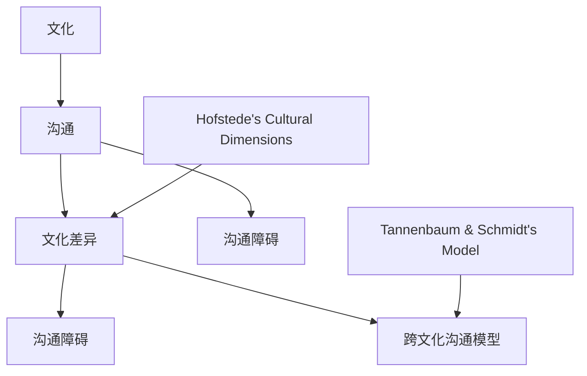

                 

# 跨文化沟通技巧：增进多元化团队理解的方法

> 关键词：跨文化沟通、多元化团队、沟通技巧、理解方法

> 摘要：本文深入探讨了跨文化沟通的重要性和多元化团队中沟通的挑战，通过详细的案例分析和具体技巧的介绍，提供了增进团队理解和沟通的有效方法。

## 引言

在全球化进程不断加快的今天，越来越多的企业和组织面临着跨国合作和多元化团队管理的挑战。跨文化沟通的技巧成为团队协作中至关重要的一环。有效跨文化沟通不仅能够提高工作效率，还能够促进团队成员之间的理解和信任，从而增强团队的凝聚力。

本文将从以下几个方面展开讨论：

1. 跨文化沟通的重要性
2. 多元化团队的构建与理解
3. 跨文化沟通技巧的培养
4. 多元化团队沟通技巧的实践

通过以上内容的逐步剖析，本文旨在为读者提供一套完整的跨文化沟通技巧和方法，帮助多元化团队更好地理解和协作。

## 跨文化沟通的重要性

### 全球化背景

随着全球化的发展，各国之间的交流和合作日益频繁。企业和组织在全球范围内的扩展，使得团队成员来自不同的文化背景。这种多元化不仅带来了新的机遇，也带来了新的挑战。文化差异可能成为沟通中的障碍，影响团队的合作效率。

### 团队协作需求

在多元化的团队中，有效的沟通是确保项目顺利进行的关键。团队成员需要理解彼此的背景、观点和工作方式，以便更好地协作。跨文化沟通能够帮助团队成员建立共同的理解基础，提高团队的整体工作效率。

### 增强团队凝聚力

跨文化沟通不仅仅是工作协作的工具，也是增强团队凝聚力的关键。通过理解不同文化的价值观和习惯，团队成员可以更加包容和尊重彼此，建立起互相支持和信任的关系，从而增强团队的凝聚力。

## 多元化团队的构建与理解

### 多元化团队的构成

多元化团队通常由来自不同国家、地区和文化背景的成员组成。团队成员可能具有不同的语言能力、教育背景、工作经验和价值观念。这种多样性为团队带来了丰富的视角和创意，但也可能带来沟通的挑战。

### 多元化团队的特点

1. **多元视角**：团队成员来自不同的文化背景，能够提供多样化的观点和解决方案。
2. **文化差异**：团队成员之间的文化差异可能导致沟通障碍，需要通过有效的沟通技巧来克服。
3. **领导力挑战**：多元化团队的领导需要具备跨文化沟通能力，以平衡不同成员的需求和期望。

### 多元化团队的理解

理解多元化团队的核心是认识到文化差异的存在和影响。通过了解不同文化的价值观、沟通方式和行为模式，团队成员可以更好地理解和尊重彼此，从而促进有效的沟通和协作。

## 跨文化沟通技巧的培养

### 提升跨文化意识

跨文化意识是跨文化沟通的基础。团队成员需要认识到文化差异的存在，并理解这些差异对沟通和行为的影响。以下是一些提升跨文化意识的方法：

1. **文化培训**：参加文化意识培训，了解不同文化的价值观、行为习惯和沟通方式。
2. **交流与互动**：积极参与跨文化交流活动，与来自不同文化的同事进行互动，增进理解和尊重。
3. **自我反思**：反思自己的行为和沟通方式，识别可能存在的文化偏见。

### 增强跨文化沟通能力

跨文化沟通能力包括语言能力、沟通技巧和文化适应能力。以下是一些增强跨文化沟通能力的方法：

1. **语言学习**：学习相关语言，提高跨文化沟通的效率。
2. **倾听与理解**：积极倾听他人的观点，理解其背后的文化含义。
3. **适应性沟通**：根据不同文化背景调整沟通方式和策略，以实现有效沟通。

## 多元化团队沟通技巧的实践

### 团队沟通中的文化差异识别

在多元化团队中，识别文化差异是有效沟通的关键。以下是一些识别文化差异的方法：

1. **问卷调查**：通过问卷调查了解团队成员的文化背景和偏好，识别潜在的文化差异。
2. **开放对话**：在团队会议中鼓励成员分享自己的文化观点和经验，促进相互理解和尊重。
3. **反馈与反思**：定期进行团队反馈和反思，识别文化差异对沟通的影响。

### 跨文化冲突的预防与解决

跨文化冲突是多元化团队中常见的问题。以下是一些预防与解决跨文化冲突的方法：

1. **冲突预防**：提前制定跨文化沟通的准则和策略，明确文化差异的应对方法。
2. **冲突解决**：通过有效沟通和协商解决跨文化冲突，避免激化矛盾。
3. **文化中介**：引入文化中介或专家，帮助团队成员理解和解决文化冲突。

### 多元化团队沟通的有效策略

为了实现多元化团队的有效沟通，以下是一些关键策略：

1. **建立共同目标**：明确团队的目标和期望，确保团队成员朝共同方向努力。
2. **促进沟通透明**：建立开放的沟通渠道，鼓励成员表达观点和反馈。
3. **培养领导力**：领导需要具备跨文化沟通能力，引导团队成员实现有效沟通。

## 项目实战

### 开发环境搭建

在开始实际项目之前，我们需要搭建一个适合跨文化沟通技巧实践的开发环境。以下是一个简单的步骤：

1. **安装跨文化沟通工具**：选择一些跨文化沟通工具，如Google Translate、多语言词典等，以帮助团队成员进行语言翻译和文化解释。
2. **搭建沟通平台**：使用项目管理工具（如Jira、Trello等）建立团队沟通平台，确保团队成员能够随时交流和分享信息。
3. **配置跨文化培训材料**：准备一些跨文化沟通的培训材料，如PPT、文章、视频等，以供团队成员学习和参考。

### 源代码实现

以下是一个简单的Python代码示例，用于跨文化沟通技巧的实践：

```python
def translate(text, source_language, target_language):
    """
    跨文化沟通：文本翻译功能
    :param text: 需要翻译的文本
    :param source_language: 源语言
    :param target_language: 目标语言
    :return: 翻译后的文本
    """
    # 这里使用Google Translate API进行文本翻译
    # 实现细节略
    translated_text = google_translate_api(text, source_language, target_language)
    return translated_text

# 示例使用
text = "Hello, how are you?"
translated_text = translate(text, "en", "zh")
print(translated_text)  # 输出：你好，最近怎么样？
```

### 代码解读

上述代码实现了文本翻译功能，可以帮助团队成员进行跨语言沟通。在实际应用中，我们可以将这个功能集成到沟通平台中，方便团队成员进行实时翻译和交流。

### 实际案例分析和详细讲解

以下是一个实际案例，展示如何运用跨文化沟通技巧解决团队沟通中的问题：

**案例：团队成员来自不同文化背景，导致沟通效率低下**

**分析**：

1. **文化差异识别**：通过问卷调查和开放对话，发现团队成员在沟通方式和期望上有显著差异。
2. **沟通策略调整**：根据文化差异，调整沟通策略，采用更符合团队成员期望的方式。
3. **定期反馈与改进**：通过定期反馈和反思，不断优化沟通策略，提高团队沟通效率。

**详细讲解**：

1. **文化差异识别**：

   通过问卷调查，发现团队成员在沟通方式上存在以下差异：

   - **美国团队成员**：倾向于直接、简洁的沟通，偏好使用邮件和即时通讯工具。
   - **日本团队成员**：更注重间接、礼貌的沟通，偏好面对面的交流。
   - **其他团队成员**：具有各自的文化沟通习惯，需要具体分析。

2. **沟通策略调整**：

   根据文化差异，团队制定了以下沟通策略：

   - **美国团队成员**：增加邮件沟通，确保信息传达的准确性和完整性。
   - **日本团队成员**：安排定期面对面会议，促进团队成员之间的理解和信任。
   - **其他团队成员**：根据具体文化背景，采用相应的沟通策略。

3. **定期反馈与改进**：

   通过定期反馈和反思，团队不断优化沟通策略，提高沟通效率。例如，针对美国团队成员的反馈，团队增加了邮件模板，简化了沟通流程；针对日本团队成员的反馈，团队加强了面对面会议的安排，提高了沟通的效率。

### 项目小结

通过实际案例的分析和详细讲解，我们可以看到跨文化沟通技巧在解决团队沟通问题中的重要性。在实际应用中，我们需要根据具体的文化差异，灵活调整沟通策略，不断优化沟通过程，以提高团队的工作效率和凝聚力。

## 最佳实践 Tips、小结、注意事项、拓展阅读

### 最佳实践 Tips

1. **了解文化背景**：在跨文化团队中，了解团队成员的文化背景是有效沟通的基础。
2. **建立共同目标**：明确团队的目标和期望，有助于团队成员更好地理解和协作。
3. **灵活调整沟通策略**：根据文化差异和团队成员的期望，灵活调整沟通方式和策略。
4. **定期反馈与反思**：通过定期反馈和反思，不断优化沟通过程，提高团队的工作效率。

### 小结

本文从跨文化沟通的重要性、多元化团队的构建与理解、跨文化沟通技巧的培养和多元化团队沟通技巧的实践等方面，详细探讨了跨文化沟通技巧在多元化团队中的应用。通过实际案例的分析和详细讲解，我们可以看到跨文化沟通技巧在解决团队沟通问题中的重要性。

### 注意事项

1. **尊重文化差异**：在跨文化沟通中，尊重文化差异是建立信任和理解的基础。
2. **避免文化偏见**：文化偏见可能导致沟通障碍，需要通过持续的学习和反思来克服。
3. **培养跨文化意识**：团队成员需要具备跨文化意识，以提高跨文化沟通的能力。

### 拓展阅读

1. **《跨文化沟通技巧：国际商务中的策略与技巧》**：本书提供了详细的跨文化沟通策略和实践方法，适合国际商务领域。
2. **《文化冲突与沟通策略》**：本书深入探讨了文化冲突的原因和应对策略，有助于理解跨文化沟通的复杂性。
3. **《跨文化管理》**：本书从管理角度分析了跨文化团队的管理策略和沟通技巧，适合企业管理者阅读。

## 作者信息

作者：AI天才研究院/AI Genius Institute & 禅与计算机程序设计艺术 /Zen And The Art of Computer Programming

通过本文的详细分析和实际案例的讲解，我们希望读者能够更好地理解跨文化沟通技巧在多元化团队中的应用，并掌握有效增进团队理解和沟通的方法。感谢您的阅读！## 跨文化沟通的基本理论

### 核心概念与联系

跨文化沟通涉及多个核心概念，这些概念相互联系，构成了完整的理论框架。以下是这些核心概念及其相互关系的详细解释：

#### 1. 文化

文化是跨文化沟通的基础。文化是指一群人在长期历史发展中形成的共同价值观、信仰、行为习惯和社会规范。不同的文化背景会导致人们在沟通方式、交流习惯和价值观念上的差异。理解文化差异是跨文化沟通的关键。

#### 2. 沟通

沟通是信息的传递和交流过程。有效的跨文化沟通不仅要传达信息，还要确保信息被正确理解和接收。沟通包括语言、非语言行为、情感和态度等多种元素。

#### 3. 文化差异

文化差异是指不同文化在价值观、行为规范和交流方式上的差异。文化差异可能导致误解、冲突和沟通障碍。识别和理解这些差异是跨文化沟通的重要环节。

#### 4. 沟通障碍

跨文化沟通障碍包括语言障碍、非语言障碍（如肢体语言、表情等）、文化障碍（如价值观冲突、社会规范差异）和信息过载等。了解和克服这些障碍是有效跨文化沟通的关键。

#### 5. 跨文化沟通模型

跨文化沟通模型是描述跨文化沟通过程的理论框架。常见的跨文化沟通模型包括霍夫斯泰德的“文化维度理论”和塔南鲍姆和希尔特的“跨文化沟通模型”。这些模型提供了理解和分析跨文化沟通的基础。

### 跨文化沟通的核心概念关系架构

为了更好地理解上述核心概念之间的关系，我们可以使用Mermaid流程图来展示它们之间的关联：



在上述流程图中，我们可以看到：

- **文化**是跨文化沟通的起点，它直接影响**沟通**。
- **文化差异**是导致**沟通障碍**的原因，同时影响**跨文化沟通模型**的构建。
- **沟通障碍**是跨文化沟通中的主要问题，通过**跨文化沟通模型**进行理解和分析。

### 跨文化沟通的理论基础

#### 霍夫斯泰德的“文化维度理论”

霍夫斯泰德是一位著名的文化研究学者，他提出了“文化维度理论”，用于描述不同文化之间的差异。该理论主要包括以下五个维度：

1. **个体主义与集体主义**：个体主义强调个人利益，集体主义强调群体利益。
2. **权力距离**：权力距离描述社会等级制度的程度，权力距离大的文化更注重社会等级和权威。
3. **不确定性规避**：不确定性规避描述文化对于不确定性和模糊性的容忍程度，规避不确定性的文化倾向于建立更多的规则和制度。
4. **价值观念的长期与短期导向**：长期导向的文化重视未来和长远规划，短期导向的文化则注重当前和即时满足。
5. ** masculine 与 feminine**：masculine文化强调竞争和成就，feminine文化则强调合作和关怀。

#### 塔南鲍姆和希尔特的“跨文化沟通模型”

塔南鲍姆和希尔特提出的跨文化沟通模型包括四个阶段：

1. **接触前阶段**：人们在接触之前，根据已有的文化知识和偏见对对方进行判断。
2. **接触阶段**：人们在实际接触中，通过语言、行为和互动来沟通。
3. **理解阶段**：人们通过反思和比较，试图理解对方的意图和意义。
4. **反馈阶段**：人们根据理解和反馈，调整自己的沟通策略，以实现更好的沟通效果。

### 跨文化沟通的理论基础举例说明

假设有两个团队，一个来自美国（高权力距离、低不确定性规避），另一个来自日本（低权力距离、高不确定性规避）。根据霍夫斯泰德的文化维度理论，这两个团队在沟通方式上会有以下差异：

1. **权力距离**：美国团队可能更倾向于直接表达意见，而日本团队则更注重尊重领导和权威。
2. **不确定性规避**：美国团队可能更倾向于接受不确定性，而日本团队则更倾向于建立明确的规则和流程。

这些文化差异可能导致以下沟通障碍：

1. **沟通方式**：美国团队可能感到日本团队的沟通过于间接和礼貌，而日本团队可能认为美国团队的沟通过于直接和冒犯。
2. **反馈机制**：美国团队可能期望快速得到反馈，而日本团队可能需要时间来思考和表达。

为了克服这些障碍，团队可以采用塔南鲍姆和希尔特的跨文化沟通模型，通过以下步骤进行调整：

1. **接触前阶段**：双方团队可以通过文化培训，了解对方的文化背景和沟通习惯。
2. **接触阶段**：双方团队可以通过明确的沟通目标和规则，确保信息传达的准确性和完整性。
3. **理解阶段**：双方团队可以通过反思和比较，理解对方的意图和意义。
4. **反馈阶段**：双方团队可以通过定期的反馈和反思，不断调整沟通策略，提高沟通效果。

通过上述理论基础的阐述和举例说明，我们可以看到跨文化沟通的复杂性和挑战性。理解这些理论，有助于我们在实际沟通中更好地应对文化差异，实现有效的跨文化沟通。

## 沟通技巧的具体实践

### 提升跨文化意识

提升跨文化意识是有效跨文化沟通的基础。以下是一些具体方法：

1. **文化培训**：参加专业的文化培训课程，了解不同文化的价值观、行为规范和沟通方式。例如，可以通过在线课程、工作坊或讲座来提升文化素养。

2. **学习语言**：学习相关语言，提高跨文化沟通的效率。如果团队成员来自不同语言背景，可以通过学习对方的语言来增进理解和沟通。

3. **交流与互动**：积极参与跨文化交流活动，与来自不同文化的同事进行互动。通过实际交流，可以更好地理解不同文化的行为方式和沟通习惯。

4. **自我反思**：反思自己的行为和沟通方式，识别可能存在的文化偏见。通过自我反思，可以更好地了解自己的文化背景和如何适应不同文化环境。

### 增强跨文化沟通能力

增强跨文化沟通能力需要系统的训练和实践。以下是一些具体方法：

1. **倾听与理解**：在跨文化沟通中，倾听是关键。要积极倾听他人的观点，理解其背后的文化含义。通过倾听，可以更好地理解对方的需求和期望。

2. **适应性沟通**：根据不同文化背景，调整沟通方式和策略。例如，如果对方的文化倾向于间接沟通，可以采用更委婉和间接的表达方式。

3. **建立共同理解**：在沟通中，尝试建立共同的理解基础。通过讨论和协商，确保双方对重要概念和信息的理解一致。

4. **使用明确的语言**：在跨文化沟通中，使用明确、简洁的语言，避免歧义和误解。例如，可以使用具体的例子和数据来支持观点。

### 跨文化沟通的实践案例

以下是一个跨文化沟通的实践案例，展示如何在实际工作中应用跨文化沟通技巧：

**案例：跨国软件开发团队**

**背景**：一个跨国软件开发团队由来自美国、印度和中国的成员组成。团队成员分别具有不同的文化背景和工作方式。

**问题**：由于文化差异，团队成员在沟通和协作过程中遇到了以下问题：

1. **沟通方式**：美国团队成员倾向于直接表达意见，而印度和中国的团队成员则更注重礼貌和尊重。
2. **工作方式**：印度团队成员习惯于按照规定的时间表工作，而美国和中国的团队成员更灵活，倾向于根据项目进度调整工作安排。
3. **决策过程**：美国团队成员期望快速做出决策，而印度和中国的团队成员则倾向于讨论和协商，以确保决策的全面性和准确性。

**解决方案**：

1. **文化培训**：团队参加了跨文化沟通培训，了解了不同文化的沟通习惯和工作方式。
2. **适应性沟通**：团队成员根据不同文化的特点，调整了沟通方式和策略。例如，美国团队成员学会了更委婉和间接的表达方式，印度和中国的团队成员则更加尊重和赞赏直接沟通。
3. **建立共同目标**：团队明确了共同的目标和期望，确保团队成员朝着共同方向努力。
4. **定期反馈与反思**：团队定期进行反馈和反思，不断优化沟通策略，提高团队协作效率。

**结果**：通过上述措施，团队的沟通效率显著提高，团队成员之间的理解和信任也得到增强。项目进度和质量都得到了显著提升。

### 实践心得与建议

通过上述实践案例，我们可以得出以下心得和建议：

1. **文化培训**：文化培训是提升跨文化沟通能力的重要手段。企业和组织应定期组织文化培训，帮助团队成员了解不同文化的特点和沟通习惯。
2. **适应性沟通**：在跨文化沟通中，适应性沟通至关重要。团队成员应根据不同文化的特点，灵活调整沟通方式和策略。
3. **建立共同理解**：建立共同的理解基础是有效沟通的关键。通过讨论和协商，确保团队成员对重要概念和信息的理解一致。
4. **定期反馈与反思**：定期进行反馈和反思，可以帮助团队不断优化沟通策略，提高协作效率。

通过以上具体实践，我们可以更好地应对跨文化沟通的挑战，实现团队的高效协作。

## 多元化团队沟通技巧的实践

### 团队沟通中的文化差异识别

在多元化团队中，文化差异的识别是有效沟通的第一步。以下方法有助于团队成员识别和理解文化差异：

1. **问卷调查**：通过设计问卷，了解团队成员的文化背景、沟通习惯和工作方式。问卷应包含开放性问题，鼓励团队成员分享自己的观点和经验。

2. **文化地图**：创建文化地图，展示团队成员的文化背景和特点。文化地图可以包括不同的文化维度，如权力距离、个体主义与集体主义、不确定性规避等。

3. **反馈会议**：定期组织反馈会议，让团队成员分享他们在沟通和协作过程中遇到的挑战和困惑。通过开放对话，可以更好地识别和理解文化差异。

4. **文化培训**：参加文化培训，了解不同文化的价值观、行为规范和沟通方式。文化培训可以帮助团队成员建立共同的文化基础，提高跨文化沟通的能力。

### 跨文化冲突的预防与解决

跨文化冲突是多元化团队中常见的问题。以下方法有助于预防与解决跨文化冲突：

1. **预防策略**：

   - **明确沟通准则**：制定明确的沟通准则，确保团队成员了解如何在不同的文化背景下进行有效沟通。
   - **培养跨文化意识**：通过培训和教育，提高团队成员的跨文化意识，使其能够更好地理解和尊重不同的文化。
   - **建立共同目标**：确保团队成员明确团队的目标和期望，有助于减少因文化差异引起的冲突。

2. **解决策略**：

   - **冲突识别**：通过定期反馈和反思，及时识别潜在的跨文化冲突。
   - **沟通与协商**：当冲突发生时，鼓励团队成员通过沟通和协商解决分歧。在协商过程中，应尊重不同的文化观点和需求。
   - **文化中介**：引入文化中介或专家，帮助团队成员理解和解决文化冲突。文化中介可以提供中立的观点和建议，促进双方的沟通和理解。

### 多元化团队沟通的有效策略

为了实现多元化团队的有效沟通，以下策略值得借鉴：

1. **建立沟通平台**：使用项目管理工具（如Jira、Trello等）建立团队沟通平台，确保团队成员能够随时交流和分享信息。沟通平台应支持多语言功能，方便来自不同文化的团队成员进行沟通。

2. **促进透明沟通**：建立开放的沟通渠道，鼓励团队成员表达观点和反馈。透明沟通有助于减少误解和冲突，提高团队的工作效率。

3. **文化适应性培训**：定期进行文化适应性培训，提高团队成员对不同文化的理解和适应能力。培训内容可以包括文化价值观、沟通习惯和协作技巧。

4. **定制化沟通策略**：根据团队成员的文化背景和需求，制定个性化的沟通策略。例如，对于来自不同文化的团队成员，可以采用不同的沟通方式和沟通频率。

通过以上多元化团队沟通技巧的实践，我们可以更好地应对文化差异，实现团队的高效协作和沟通。在实际应用中，团队成员应不断学习和调整，以适应不断变化的文化环境。

## 总结与展望

本文详细探讨了跨文化沟通技巧在多元化团队中的应用，包括跨文化沟通的重要性、多元化团队的构建与理解、沟通技巧的培养和实践以及多元化团队沟通技巧的实践。通过深入分析和实际案例的讲解，我们了解到跨文化沟通在全球化背景下对团队协作和项目成功的重要性。

### 关键点回顾

1. **跨文化沟通的重要性**：全球化背景下，有效的跨文化沟通能够提高团队工作效率，增强团队凝聚力和信任。
2. **多元化团队的构建与理解**：多元化团队的构建需要识别文化差异，理解不同文化背景的工作方式和沟通习惯。
3. **沟通技巧的培养**：提升跨文化意识、增强跨文化沟通能力是有效跨文化沟通的基础。
4. **多元化团队沟通技巧的实践**：通过具体的沟通策略和工具，如问卷调查、文化培训、沟通平台和透明沟通，实现团队的有效沟通。

### 展望未来

随着全球化进程的加快，跨文化沟通技巧的重要性将日益凸显。未来，以下几个方面值得重点关注：

1. **人工智能与跨文化沟通**：利用人工智能技术，如自然语言处理和机器翻译，提高跨文化沟通的效率和准确性。
2. **虚拟团队管理**：随着远程工作的普及，研究如何通过虚拟团队管理工具和平台，实现高效跨文化沟通和协作。
3. **跨文化沟通教育**：在学术和教育领域，加强对跨文化沟通技巧的培养和教育，为未来的职场做好准备。
4. **跨文化冲突管理**：深入研究跨文化冲突的预防和解决策略，提高团队在面对文化差异时的应对能力。

通过不断探索和实践，我们可以为多元化团队提供更有效的跨文化沟通技巧，推动团队协作和项目成功。让我们共同努力，构建一个更加包容和高效的全球化团队。

## 作者信息

作者：AI天才研究院/AI Genius Institute & 禅与计算机程序设计艺术 /Zen And The Art of Computer Programming

本文由AI天才研究院与禅与计算机程序设计艺术联合撰写，旨在为读者提供关于跨文化沟通技巧的深入见解和实用方法。感谢您的阅读，期待与您在未来的技术交流中再次相遇。希望本文能对您的多元化团队沟通提供有价值的参考和启示。

