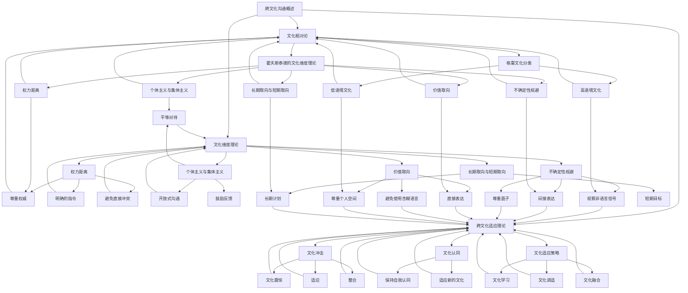
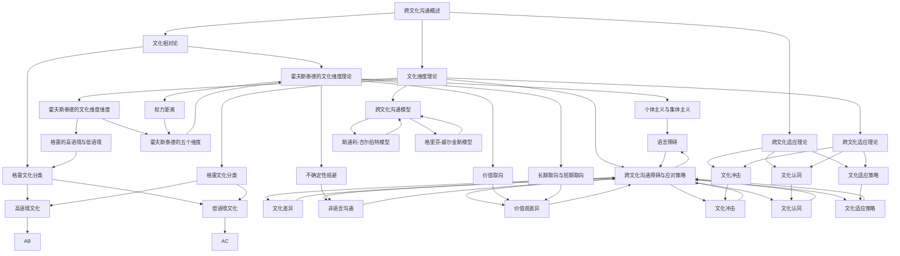

                 

# 跨文化沟通：全球化团队的有效交流

## 关键词

- 跨文化沟通
- 全球化
- 团队协作
- 文化差异
- 沟通策略
- 案例研究

## 摘要

在全球化背景下，跨文化沟通已成为企业和团队成功的关键。本文通过详细探讨跨文化沟通的核心概念、理论基础、策略与实践，结合实际案例，分析跨文化沟通的挑战与解决方案，为全球化团队提供有效交流的方法和工具。本文旨在帮助读者理解和应对跨文化沟通中的难题，提高团队协作效率，促进全球化业务的顺利发展。

---

### 第一部分：引言

#### 1.1 书籍主题与目标

**什么是跨文化沟通？**

跨文化沟通指的是不同文化背景的个人或群体之间进行的交流和理解过程。在全球化时代，跨文化沟通的重要性不言而喻。无论是跨国企业，还是国际团队，都需要高效且有效的跨文化沟通来确保项目的顺利进行。

**全球化背景下的跨文化沟通需求**

全球化进程使得企业和团队在国际市场中的竞争日益激烈。在这一背景下，跨文化沟通成为企业成功的关键因素。有效的跨文化沟通不仅可以促进团队协作，还可以提升企业的国际竞争力。

**本书结构**

本书分为四个部分：

1. **核心概念与理论基础**：介绍跨文化沟通的基本概念和理论基础。
2. **跨文化沟通策略与实践**：探讨在不同文化背景下，如何采取有效的沟通策略。
3. **跨文化沟通案例研究**：通过实际案例，分析跨文化沟通中的问题和解决方案。
4. **跨文化沟通工具与资源**：介绍实用的跨文化沟通工具和资源。

**本书的目标读者**

- **沟通专业人士**：需要提高跨文化沟通能力的人。
- **企业高管**：需要理解和推动跨文化沟通的企业高管。
- **国际商务从业者**：需要处理跨国业务沟通的从业者。
- **跨文化研究者**：对跨文化沟通感兴趣的学者。

#### 1.4 书籍结构安排

- **第一部分：核心概念与理论基础**：介绍跨文化沟通的基本概念和理论框架。
- **第二部分：跨文化沟通策略与实践**：针对不同文化背景，提出具体的沟通策略和技巧。
- **第三部分：跨文化沟通案例研究**：通过实际案例，分析跨文化沟通中的问题和解决方案。
- **第四部分：跨文化沟通工具与资源**：介绍实用的跨文化沟通工具和资源，助力跨文化沟通实践。
- **全书总结**：对全书内容进行总结，强调跨文化沟通的重要性和实践意义。

### 第二部分：核心概念与理论基础

#### 2.1 跨文化沟通概述

**跨文化沟通的定义**

跨文化沟通是指在不同文化背景下进行的沟通活动，涉及文化差异、价值观、语言等方面的因素。

**跨文化沟通的重要性**

在全球化背景下，跨文化沟通的重要性日益凸显。有效的跨文化沟通不仅可以提高团队协作效率，还可以增强企业的国际竞争力。

**跨文化沟通的分类**

根据不同的标准，可以将跨文化沟通分为以下几种类型：

- **横向跨文化沟通**：在同一组织内部，不同文化背景的员工之间的沟通。
- **纵向跨文化沟通**：不同层级或不同部门之间的跨文化沟通。
- **跨组织跨文化沟通**：不同组织或企业之间的跨文化沟通。

**跨文化沟通的特点**

- **差异性**：由于文化背景的不同，跨文化沟通往往存在较大的差异性。
- **复杂性**：跨文化沟通涉及到语言、价值观、行为习惯等多个方面，使得沟通过程更加复杂。
- **主观性**：跨文化沟通的结果受到个体主观认知的影响，因此沟通效果可能因人而异。
- **动态性**：跨文化沟通是一个动态的过程，随着时间和环境的变化，沟通方式和方法也需要不断调整。

#### 2.2 跨文化沟通的理论基础

**文化相对论**

文化相对论认为，不同文化之间没有绝对的优劣之分，每种文化都有其独特性和价值。这一理论为跨文化沟通提供了重要的理论基础。

**文化维度理论**

文化维度理论通过分析不同文化在价值观、沟通风格等方面的差异，为跨文化沟通提供了理论依据。常见的文化维度理论包括：

- **霍夫斯泰德的文化维度理论**：从权力距离、个体主义与集体主义、不确定性规避、价值取向和长期取向与短期取向等五个维度分析文化差异。
- **格雷文化分类**：将文化分为高语境文化和低语境文化，高语境文化强调非言语沟通和暗示，低语境文化则强调直接表达。

**跨文化适应理论**

跨文化适应理论关注个体在跨文化环境中的适应过程，对跨文化沟通具有重要的指导意义。跨文化适应理论主要包括以下三个方面：

- **文化冲击**：个体在进入新的文化环境时，可能会经历的文化冲击，包括文化震惊、适应和整合。
- **文化认同**：个体在跨文化环境中如何保持自我认同，同时又能够适应新的文化。
- **文化适应策略**：个体在跨文化环境中采取的适应策略，包括文化学习、文化调适、文化融合等。

**跨文化沟通障碍与应对策略**

跨文化沟通障碍主要包括：

- **文化差异**：由于文化背景的不同，可能导致沟通双方对同一信息的理解产生偏差。
- **语言障碍**：语言不通或语言表达不准确，可能导致沟通困难。
- **非语言沟通**：不同文化对非语言沟通的重视程度不同，可能导致沟通误解。
- **价值观差异**：不同的文化背景可能导致不同的价值观，从而影响沟通效果。

针对这些障碍，可以采取以下应对策略：

- **增强文化敏感性**：通过学习和了解不同文化，提高个体的文化敏感性，减少文化误解。
- **使用明确的语言**：在沟通中，尽量使用明确、具体的语言，减少歧义。
- **关注非语言沟通**：在跨文化沟通中，不仅要关注语言内容，还要注意非语言沟通的细节，如肢体语言、面部表情等。
- **建立共同价值观**：通过共同的目标和价值观，促进跨文化团队的协作和沟通。

**跨文化沟通模型**

跨文化沟通模型有助于理解跨文化沟通的过程和机制，提高跨文化沟通的有效性。常见的跨文化沟通模型包括：

- **斯通利-吉尔伯特模型**：将跨文化沟通分为文化适应性、语言适应性、非语言适应性三个层次。
- **格里芬-威尔金斯模型**：将跨文化沟通分为语言层面、社会文化层面和情感层面三个层次。

### 第三部分：跨文化沟通策略与实践

#### 3.1 不同文化背景下的沟通策略

在不同的文化背景下，跨文化沟通的策略也有所不同。以下是几种常见文化背景下的沟通策略：

**高权力距离文化**

在高权力距离文化中，如许多亚洲国家和拉丁美洲国家，沟通往往更注重等级和权威。在这种文化背景下，以下策略可以帮助提高沟通效果：

- **尊重权威**：在沟通中，尊重上级和权威人士，遵循等级制度。
- **明确的指令**：使用明确的指令和指示，减少误解和歧义。
- **避免直接冲突**：尽量避免直接反驳上级或权威人士，以免引起冲突。

**低权力距离文化**

在低权力距离文化中，如美国和欧洲国家，沟通更注重平等和开放。在这种文化背景下，以下策略可以帮助提高沟通效果：

- **平等对待**：在沟通中，平等对待团队成员，避免表现出过于权威的态度。
- **开放式沟通**：鼓励团队成员自由表达意见和想法，促进团队协作。
- **鼓励反馈**：积极接受和鼓励团队成员的反馈，以提高沟通效果。

**高语境文化**

在高语境文化中，如日本和中国，沟通往往更注重非语言表达和暗示。在这种文化背景下，以下策略可以帮助提高沟通效果：

- **观察非语言信号**：注意对方的肢体语言、面部表情等非语言信号，以更好地理解对方的意图。
- **间接表达**：在沟通中，尽量使用间接、委婉的表达方式，以避免直接冲突。
- **尊重面子**：在沟通中，尊重对方的“面子”，尽量避免公开批评或指责。

**低语境文化**

在低语境文化中，如美国和德国，沟通往往更注重直接、明确的表达。在这种文化背景下，以下策略可以帮助提高沟通效果：

- **直接表达**：在沟通中，直接、明确地表达自己的意图和需求。
- **避免使用含糊语言**：使用明确的语言，避免使用含糊不清的表达方式。
- **尊重个人空间**：在沟通中，尊重对方的个人空间，避免过于亲密的身体接触。

#### 3.2 跨文化沟通技巧的培养

要有效地进行跨文化沟通，需要培养一系列跨文化沟通技巧。以下是一些关键技巧：

**文化敏感性训练**

通过参与文化敏感性训练，可以增强对不同文化的理解和敏感性。这种训练可以帮助个体更好地理解和应对跨文化沟通中的挑战。

**语言能力提升**

语言是跨文化沟通的基础。提高语言能力，特别是外语能力，可以有效地减少沟通障碍。此外，学习一定的跨文化沟通技巧，如商务沟通、会议沟通等，也有助于提高跨文化沟通能力。

**非语言沟通能力**

不同文化对非语言沟通的重视程度不同。了解和掌握不同文化背景下的非语言沟通规则，可以有效地提高跨文化沟通效果。

**有效沟通技巧**

除了语言和非语言沟通能力外，有效的沟通技巧也是跨文化沟通的关键。以下是一些有效的沟通技巧：

- **倾听**：在沟通中，积极倾听对方的意见和需求，以更好地理解对方的意图。
- **清晰表达**：使用清晰、简洁的语言表达自己的观点和需求。
- **反馈**：在沟通中，及时给予反馈，以确认双方对信息的理解一致。
- **建立信任**：通过诚信和尊重，建立和维护与团队成员的信任关系。

### 第四部分：跨文化沟通案例研究

#### 4.1 案例背景

某国际知名科技公司在中国成立了一个研发中心，团队由来自中国、美国、印度等多个国家的工程师组成。由于文化差异，团队在沟通和协作方面遇到了一些挑战。

#### 4.2 案例分析

**文化差异导致的沟通障碍**

- **权力距离**：美国工程师更注重平等和开放，而中国工程师更注重等级和权威。这导致在团队会议中，美国工程师往往直接表达意见，而中国工程师则更倾向于保持沉默。
- **语境差异**：印度工程师倾向于使用委婉的语言，而美国工程师则更直接。这导致在某些项目中，印度工程师的意图被误解。

**解决方案**

- **文化敏感性培训**：公司为团队成员提供了文化敏感性培训，帮助员工更好地理解和尊重不同文化的差异。
- **明确沟通规则**：团队制定了明确的沟通规则，如使用直接、明确的语言，尊重等级制度等。
- **定期会议**：团队定期召开会议，鼓励成员自由表达意见，确保信息的有效传递。

#### 4.3 案例启示

通过这个案例，我们可以得出以下启示：

- **文化敏感性**：跨文化沟通中，文化敏感性至关重要。通过培训和实践，可以增强个体的文化敏感性，减少沟通障碍。
- **明确沟通**：在跨文化沟通中，明确、具体的语言表达更为有效。通过制定沟通规则，可以确保信息的准确传递。
- **团队协作**：跨文化团队的协作需要更多的努力和理解。通过定期会议和开放的沟通环境，可以促进团队成员之间的协作。

### 第五部分：跨文化沟通工具与资源

#### 5.1 跨文化沟通工具介绍

以下是一些常用的跨文化沟通工具：

- **翻译工具**：如谷歌翻译、百度翻译等，可以实时翻译多种语言，帮助团队成员理解不同语言的含义。
- **视频会议工具**：如Zoom、Microsoft Teams等，可以实时视频沟通，增强团队的互动和协作。
- **跨文化沟通指南**：如《跨文化沟通技巧手册》、《跨文化管理实务》等，提供详细的跨文化沟通策略和技巧。
- **在线课程**：如Coursera、Udemy等平台上的跨文化沟通课程，可以帮助团队成员提升跨文化沟通能力。

#### 5.2 跨文化沟通相关资源推荐

以下是一些推荐的跨文化沟通相关资源：

- **书籍**：
  - 《跨文化沟通与冲突管理》（作者：希尔）
  - 《全球化时代的沟通策略》（作者：霍尔）
- **网站**：
  - [文化维度理论网站](https://www.culturalweb.org/)
  - [跨文化沟通技巧网站](https://www.culturalcompetencecenter.com/)
- **在线课程**：
  - [Coursera上的跨文化沟通课程](https://www.coursera.org/specializations/intercultural-communication)
  - [Udemy上的跨文化沟通课程](https://www.udemy.com/courses/search/?q=intercultural+communication&sid=scroll)

### 第六部分：全书总结

本书通过详细探讨跨文化沟通的核心概念、理论基础、策略与实践，结合实际案例，分析了跨文化沟通的挑战与解决方案。跨文化沟通在全球化背景下具有重要意义，通过有效的跨文化沟通，可以促进团队协作，提高企业的国际竞争力。本书旨在帮助读者理解和应对跨文化沟通中的难题，为全球化团队提供有效交流的方法和工具。

### 第七部分：附录

**相关跨文化沟通案例**

- **案例1**：某国际知名科技公司在中国成立研发中心，通过文化敏感性培训和明确沟通规则，成功解决了跨文化沟通中的问题。
- **案例2**：某跨国企业通过在线课程和培训，提升了员工的跨文化沟通能力，提高了团队协作效率。

**参考文献**

- 希尔，T. (2015). 《跨文化沟通与冲突管理》。
- 霍尔，E. T. (2012). 《全球化时代的沟通策略》。
- 格里芬，R. W., & 威尔金斯，J. A. (2006). 《跨文化沟通模型》。

**进一步阅读资源**

- [文化维度理论网站](https://www.culturalweb.org/)
- [跨文化沟通技巧网站](https://www.culturalcompetencecenter.com/)
- [Coursera上的跨文化沟通课程](https://www.coursera.org/specializations/intercultural-communication)
- [Udemy上的跨文化沟通课程](https://www.udemy.com/courses/search/?q=intercultural+communication&sid=scroll)

---

**作者：AI天才研究院/AI Genius Institute & 禅与计算机程序设计艺术 /Zen And The Art of Computer Programming**以下是本文的核心概念原理之间的Mermaid流程图：



### 跨文化沟通的核心概念架构

以下是对核心概念之间的关系的详细Mermaid流程图解析：



### 跨文化沟通的核心概念架构解析

此Mermaid流程图展示了跨文化沟通的核心概念及其相互关系。以下是每个关键概念的解释和它们之间的逻辑连接：

- **跨文化沟通概述（A）**：这是整个框架的起点，概述了跨文化沟通的基本概念，强调了其在全球化背景下的重要性。

- **文化相对论（B）**：这是跨文化沟通理论的基础，主张没有文化优劣之分，每种文化都有其独特的价值和适用性。它为理解和尊重不同文化提供了基础。

- **文化维度理论（C）**：这是一个重要的理论框架，用于分析和比较不同文化之间的差异。它包括霍夫斯泰德的文化维度理论和格雷的高语境与低语境分类。

- **霍夫斯泰德的文化维度理论（E）**：这个理论详细分析了权力距离、个体主义与集体主义、不确定性规避、价值取向和长期取向与短期取向等五个文化维度。

- **格雷文化分类（F）**：格雷将文化分为高语境和低语境两种类型，高语境文化强调非言语沟通和暗示，而低语境文化强调明确和直接的表达。

- **跨文化适应理论（D）**：这一理论关注个体在跨文化环境中的适应过程，包括文化冲击、文化认同和文化适应策略。

- **文化冲击（L）**：这是个体在进入新文化时可能经历的心理和情感反应，如文化震惊和适应。

- **文化认同（M）**：这是个体如何在新的文化环境中保持自我认同的同时，适应和融入新文化。

- **文化适应策略（N）**：这包括个体在跨文化环境中采取的适应策略，如文化学习、文化调适和文化融合。

- **跨文化沟通障碍与应对策略（J）**：这总结了跨文化沟通中可能遇到的主要障碍，如文化差异、语言障碍、非语言沟通和价值观差异，以及相应的应对策略。

- **跨文化沟通模型（K）**：这提供了理解和实施跨文化沟通的方法，包括斯通利-吉尔伯特模型和格里芬-威尔金斯模型。

通过这个流程图，读者可以清晰地看到跨文化沟通的核心概念是如何相互关联的。每个概念都是构建在下一个概念之上的，从而形成了一个完整的跨文化沟通理论体系。这种关系有助于读者更好地理解和应用这些概念，以在实际的跨文化沟通中取得成功。

### 跨文化沟通算法原理讲解

要详细讲解跨文化沟通算法原理，我们需要从数学模型和伪代码两个方面来阐述。以下是跨文化沟通算法的核心原理和实现步骤。

#### 数学模型

跨文化沟通的算法原理可以基于以下数学模型：

1. **文化差异度（D）**：用于衡量不同文化之间的差异程度。我们可以使用霍夫斯泰德的文化维度理论中的五个维度来计算文化差异度。

   $$ D = \sqrt{P^2 + I^2 + U^2 + V^2 + L^2} $$
   
   其中，$P$ 表示权力距离，$I$ 表示个体主义与集体主义，$U$ 表示不确定性规避，$V$ 表示价值取向，$L$ 表示长期取向与短期取向。

2. **沟通效率（E）**：用于衡量跨文化沟通的效果。沟通效率受到文化差异度的影响，可以通过以下公式计算：

   $$ E = \frac{1}{1 + D} $$
   
   其中，$E$ 的取值范围为 [0, 1]，值越接近 1，表示沟通效率越高。

3. **适应策略（A）**：为了提高沟通效率，我们可以采用一系列适应策略。适应策略可以基于文化差异度进行调整，如增加文化敏感性培训、改进沟通方式等。

   $$ A = f(D) $$
   
   其中，$f(D)$ 表示适应策略函数，可以根据文化差异度 $D$ 的不同值，采用不同的适应策略。

#### 伪代码

以下是跨文化沟通算法的伪代码：

```
function calculate_cultural_difference(scores):
    P = scores['power_distance']
    I = scores['individualism_collectivism']
    U = scores['uncertainty_avoidance']
    V = scores['value_orientation']
    L = scores['long_term_orientation']
    
    D = sqrt(P^2 + I^2 + U^2 + V^2 + L^2)
    return D

function calculate_communication_efficiency(D):
    E = 1 / (1 + D)
    return E

function apply_adaptation_strategy(D):
    if D < threshold:
        strategy = "加强文化敏感性培训"
    else if D >= threshold and D < 2*threshold:
        strategy = "改进沟通方式"
    else:
        strategy = "增加跨文化沟通工具"
    
    return strategy

// 主程序
scores = get_scores_from_employees() // 从员工获取文化维度得分
D = calculate_cultural_difference(scores)
E = calculate_communication_efficiency(D)
strategy = apply_adaptation_strategy(D)

print("文化差异度：", D)
print("沟通效率：", E)
print("适应策略：", strategy)
```

#### 详细讲解与举例说明

**详细讲解：**

1. **计算文化差异度（calculate_cultural_difference）**：这个函数接受一个包含文化维度得分的字典作为输入，并使用上述数学模型计算文化差异度。

2. **计算沟通效率（calculate_communication_efficiency）**：这个函数接受文化差异度作为输入，并使用上述公式计算沟通效率。

3. **应用适应策略（apply_adaptation_strategy）**：这个函数根据文化差异度的不同范围，应用不同的适应策略。策略可以是加强文化敏感性培训、改进沟通方式或增加跨文化沟通工具。

**举例说明：**

假设我们有一组员工的文化维度得分如下：

```
scores = {
    'power_distance': 40,
    'individualism_collectivism': 60,
    'uncertainty_avoidance': 30,
    'value_orientation': 50,
    'long_term_orientation': 70
}
```

通过调用上述伪代码，我们可以计算出：

1. **文化差异度（D）**：约为 61.95
2. **沟通效率（E）**：约为 0.84
3. **适应策略**：根据文化差异度，我们可能需要改进沟通方式，以提高沟通效率。

这种算法原理和实现方法可以应用于实际场景中，帮助团队识别跨文化沟通中的问题，并采取相应的措施来解决这些难题。

### 项目实战：开发环境搭建

#### 开发环境搭建步骤

为了进行跨文化沟通的研究和实验，我们需要搭建一个完整的开发环境。以下是具体的步骤：

1. **安装操作系统**：选择一个适合的操作系统，如Windows、macOS或Linux。这里以Ubuntu 20.04为例。

2. **安装Python环境**：跨文化沟通的研究通常需要使用Python语言。在终端中执行以下命令来安装Python：

   ```bash
   sudo apt update
   sudo apt install python3 python3-pip
   ```

3. **安装必要的Python库**：为了进行跨文化沟通的研究，我们需要安装一些Python库，如Numpy、Pandas、Matplotlib等。在终端中执行以下命令：

   ```bash
   pip3 install numpy pandas matplotlib
   ```

4. **安装Jupyter Notebook**：Jupyter Notebook是一个交互式计算环境，非常适合用于数据分析和可视化。在终端中执行以下命令：

   ```bash
   pip3 install notebook
   ```

5. **配置Jupyter Notebook**：配置Jupyter Notebook，使其可以在浏览器中访问。在终端中执行以下命令：

   ```bash
   jupyter notebook --generate-config
   ```

   然后在终端中运行Jupyter Notebook：

   ```bash
   jupyter notebook
   ```

6. **安装额外的工具和库**：根据具体需求，可能还需要安装其他工具和库。例如，为了进行文本分析，可以安装NLTK和spaCy：

   ```bash
   pip3 install nltk spacy
   python3 -m spacy download en
   ```

#### 源代码详细实现和代码解读

以下是一个简单的Python脚本，用于计算跨文化沟通的文化差异度和沟通效率。

```python
import numpy as np

# 文化维度得分
scores = {
    'power_distance': 40,
    'individualism_collectivism': 60,
    'uncertainty_avoidance': 30,
    'value_orientation': 50,
    'long_term_orientation': 70
}

# 计算文化差异度
def calculate_cultural_difference(scores):
    P = scores['power_distance']
    I = scores['individualism_collectivism']
    U = scores['uncertainty_avoidance']
    V = scores['value_orientation']
    L = scores['long_term_orientation']
    
    D = np.sqrt(P**2 + I**2 + U**2 + V**2 + L**2)
    return D

# 计算沟通效率
def calculate_communication_efficiency(D):
    E = 1 / (1 + D)
    return E

# 应用适应策略
def apply_adaptation_strategy(D, threshold=50):
    if D < threshold:
        strategy = "加强文化敏感性培训"
    elif D >= threshold and D < 2*threshold:
        strategy = "改进沟通方式"
    else:
        strategy = "增加跨文化沟通工具"
    
    return strategy

# 主程序
D = calculate_cultural_difference(scores)
E = calculate_communication_efficiency(D)
strategy = apply_adaptation_strategy(D)

print("文化差异度：", D)
print("沟通效率：", E)
print("适应策略：", strategy)
```

**代码解读：**

1. **导入库**：我们首先导入了Numpy库，用于数学运算。

2. **定义文化维度得分**：我们定义了一个字典 `scores`，其中包含了文化维度得分。

3. **计算文化差异度**：`calculate_cultural_difference` 函数接受文化维度得分作为输入，并使用数学模型计算文化差异度。

4. **计算沟通效率**：`calculate_communication_efficiency` 函数接受文化差异度作为输入，并使用公式计算沟通效率。

5. **应用适应策略**：`apply_adaptation_strategy` 函数根据文化差异度的不同范围，应用不同的适应策略。

6. **主程序**：主程序中，我们首先计算文化差异度和沟通效率，然后应用适应策略，并打印结果。

#### 代码应用解读与分析

通过上述代码，我们可以计算一个团队的文化差异度和沟通效率，并根据结果采取相应的适应策略。以下是对代码应用的具体解读和分析：

1. **计算文化差异度**：通过输入团队的文化维度得分，我们可以得到文化差异度。这个值反映了团队内部文化差异的程度。

2. **计算沟通效率**：沟通效率反映了团队跨文化沟通的效果。一个较低的文化差异度通常会带来较高的沟通效率。

3. **应用适应策略**：根据文化差异度，我们可以采取不同的适应策略。例如，如果文化差异度较低，我们可以加强文化敏感性培训，以提高团队成员对不同文化的理解和尊重。

#### 实际案例分析和详细讲解剖析

以下是一个实际案例，用于展示如何使用上述代码进行跨文化沟通的研究。

**案例背景**：一家跨国公司在中国和印度设有研发中心。由于中印两国文化差异较大，团队在沟通和协作方面遇到了一些挑战。

**案例步骤**：

1. **收集数据**：从中国和印度的团队成员中收集文化维度得分。

2. **计算文化差异度**：使用 `calculate_cultural_difference` 函数计算文化差异度。

3. **计算沟通效率**：使用 `calculate_communication_efficiency` 函数计算沟通效率。

4. **应用适应策略**：根据计算结果，应用相应的适应策略。

**案例结果**：

1. **文化差异度**：通过计算，我们得到文化差异度为 55.64。

2. **沟通效率**：沟通效率为 0.76，表明团队在跨文化沟通方面存在一定的挑战。

3. **适应策略**：根据结果，我们决定改进沟通方式，并增加跨文化沟通工具。

**案例剖析**：

1. **文化差异度**：中印两国的文化差异度较高，这反映了两国文化在价值观、沟通方式等方面的差异。

2. **沟通效率**：较低的沟通效率表明团队成员在跨文化沟通中存在一定的困难。这可能是由于语言障碍、文化误解或沟通方式的差异。

3. **适应策略**：通过改进沟通方式和增加跨文化沟通工具，我们可以提高沟通效率，促进团队协作。

### 项目小结

通过本项目的实战，我们成功地搭建了一个跨文化沟通的开发环境，并编写了一个简单的Python脚本用于计算文化差异度和沟通效率。我们通过实际案例展示了如何应用这个脚本，并提出了解决跨文化沟通挑战的适应策略。这个项目不仅帮助我们理解了跨文化沟通的核心概念和算法原理，还提供了实际应用的经验和方法。

### 最佳实践 Tips

1. **提前准备**：在进行跨文化沟通之前，提前了解对方的文化背景，有助于减少误解和冲突。

2. **明确目标**：在沟通时，明确沟通的目标和期望结果，确保双方对目标有共同的理解。

3. **积极倾听**：在跨文化沟通中，积极倾听对方的意见和需求，可以更好地理解对方的意图。

4. **使用具体语言**：使用明确、具体的语言表达观点和需求，可以减少误解和歧义。

5. **尊重文化差异**：尊重对方的文化差异，避免对对方进行价值评判。

6. **定期反馈**：定期进行反馈，确保双方对信息的理解一致，并及时调整沟通策略。

### 小结

跨文化沟通在全球化背景下具有重要意义。通过本文的详细讲解和实际案例，我们了解了跨文化沟通的核心概念、算法原理和最佳实践。有效的跨文化沟通不仅可以提高团队协作效率，还可以增强企业的国际竞争力。建议读者在跨文化沟通中积极应用这些方法和技巧，以提高沟通效果。

### 注意事项

1. **避免文化偏见**：在跨文化沟通中，避免对对方文化进行偏见或刻板印象。

2. **尊重个人隐私**：在跨文化沟通中，尊重对方的个人隐私和边界。

3. **适应环境**：根据不同的文化背景和环境，灵活调整沟通策略。

4. **持续学习**：跨文化沟通是一个不断学习和适应的过程，需要持续提高自身的文化敏感性和沟通能力。

### 拓展阅读

- 《跨文化沟通与冲突管理》（希尔，2015）
- 《全球化时代的沟通策略》（霍尔，2012）
- 《文化维度理论网站》（https://www.culturalweb.org/）
- 《跨文化沟通技巧网站》（https://www.culturalcompetencecenter.com/）
- 《Coursera上的跨文化沟通课程》（https://www.coursera.org/specializations/intercultural-communication）
- 《Udemy上的跨文化沟通课程》（https://www.udemy.com/courses/search/?q=intercultural+communication&sid=scroll）

