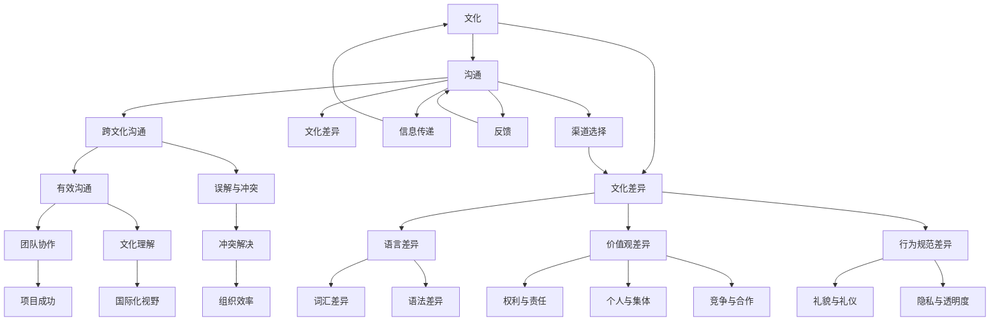

                 

### 引言

在全球化进程不断加快的今天，跨文化沟通已经成为国际团队协作和商业成功的关键因素。无论是在跨国企业、学术研究机构还是非政府组织中，团队成员来自不同国家、拥有不同文化和语言背景，这使得跨文化沟通变得尤为重要。有效的跨文化沟通不仅能提高团队的协作效率，促进文化交流与融合，还能为企业带来更大的国际竞争力。

跨文化沟通涉及到多种文化之间的交流与互动，它不仅仅是语言层面的翻译和理解，更是一种深层次的文化认知和尊重。在面对文化差异时，如何准确、恰当地传达信息，避免误解和冲突，是每一个跨文化沟通者必须面对的挑战。因此，掌握有效的跨文化沟通技巧，不仅对个人的职业发展有着重要影响，也对整个团队的协同合作和组织的国际化战略有着深远的意义。

本文将围绕跨文化沟通这一主题，从基础理论、沟通技巧、实践案例和未来趋势四个方面展开讨论。首先，我们将介绍跨文化沟通的背景与重要性，并定义其基本概念和分类。接着，深入探讨文化差异的类型及其对认知的影响，并分析跨文化沟通中的认知障碍。在第二部分，我们将介绍一系列有效的跨文化沟通策略和团队领导力技巧。随后，通过实际案例，我们将展示跨文化沟通在不同场景中的应用和效果。最后，我们将探讨跨文化沟通工具和方法，并展望其未来的发展趋势。

通过本文的阅读，读者将能够全面了解跨文化沟通的理论和实践，掌握关键沟通技巧，从而在国际团队中更加有效地工作。

## 跨文化沟通的背景与重要性

### 全球化趋势

全球化是当今世界发展的重要趋势，它不仅改变了国际经济格局，也深刻影响了人们的日常生活和工作方式。随着信息技术的飞速发展和全球贸易的不断扩大，不同国家和地区的文化、技术和资源日益交织在一起。全球化使得国际间的交流与合作变得更加频繁，跨国公司、国际组织和学术研究机构的兴起，都要求团队成员具备跨文化沟通的能力。

在全球化背景下，企业和组织面临着日益增加的跨文化工作需求。许多企业通过并购、合资和国际化战略，建立了跨国团队，这些团队需要在不同的文化环境中高效协作。这不仅要求团队成员具备专业的技能和知识，还需要具备良好的跨文化沟通能力，以克服文化差异带来的挑战。

### 文化差异的类型

文化差异是跨文化沟通的核心问题之一。文化差异不仅体现在语言和价值观上，还包括社会行为规范、思维方式、时间观念等多个方面。以下是对几种主要文化差异类型的简要介绍：

1. **语言差异**：语言是跨文化沟通的基础，但不同语言之间的表达方式和语法结构可能存在巨大差异。例如，一些语言中的词汇和表达可能无法直接翻译到其他语言中，导致信息传递的不准确。

2. **价值观差异**：价值观是文化的重要组成部分，不同文化对权利、责任、个人与集体、竞争与合作等方面的看法可能存在显著差异。这些差异会影响人们的决策和行为，进而影响跨文化沟通的有效性。

3. **社会行为规范差异**：不同文化对社会行为规范有不同的期望和标准，例如对待隐私、礼貌、礼仪等方面的差异。这些差异可能导致沟通中的误解和冲突。

4. **思维方式差异**：不同文化的人们在解决问题、决策和创新等方面可能采用不同的思维方式。例如，一些文化强调逻辑和理性思维，而另一些文化则更注重直觉和感性思维。

### 跨文化沟通的重要性

跨文化沟通的重要性主要体现在以下几个方面：

1. **提高团队协作效率**：在跨国团队中，有效的跨文化沟通可以促进团队成员之间的理解与合作，减少误解和冲突，提高团队的协作效率。这有助于实现项目的顺利推进和目标达成。

2. **促进文化交流与融合**：跨文化沟通不仅是信息传递的过程，也是文化交流与融合的桥梁。通过沟通，团队成员可以相互了解和尊重彼此的文化背景，促进不同文化之间的相互理解和包容。

3. **提升企业国际化竞争力**：在全球化背景下，企业需要具备国际视野和跨文化能力。有效的跨文化沟通可以帮助企业更好地适应国际市场的需求，提升品牌影响力和竞争力。

4. **个人职业发展**：跨文化沟通能力是现代职场中不可或缺的技能。具备良好的跨文化沟通能力，不仅可以提升个人的职业竞争力，还可以为个人在国际化环境下的发展提供更多机会。

总之，跨文化沟通不仅是全球化时代的必然需求，也是提高团队协作效率、促进文化交流与融合、提升企业国际竞争力的重要手段。因此，了解和掌握跨文化沟通的理论和实践，对于每个人和组织都具有重要意义。

### 核心概念与联系

在探讨跨文化沟通的过程中，我们需要理解几个核心概念及其相互之间的联系，以便更好地把握这一主题的复杂性和多样性。以下是这些核心概念及其关系的简要描述，并附有Mermaid流程图，以便更直观地展示它们之间的关联。

#### 核心概念

1. **文化**：文化是一个社会或群体在长期历史发展过程中形成的共同价值观、信仰、习俗和行为模式的总和。它包括语言、宗教、习俗、艺术、技术等多个方面。

2. **沟通**：沟通是指信息在个体、群体或组织之间的传递和交流。有效的沟通不仅涉及信息的内容，还包括信息的表达方式、渠道和反馈。

3. **跨文化沟通**：跨文化沟通是发生在不同文化背景下的沟通。它不仅需要理解和尊重文化差异，还需要在信息传递中克服这些差异，以达到有效沟通的目的。

4. **文化差异**：文化差异是指不同文化在价值观、行为规范、思维方式等方面的不同。这些差异可能会影响沟通的效果，导致误解和冲突。

#### 核心概念之间的联系

跨文化沟通是文化和沟通两个核心概念的交汇点。文化差异是跨文化沟通的基础，它直接影响沟通的内容、方式、渠道和反馈。例如：

- **语言差异**：不同语言之间的语法、词汇和表达方式可能导致信息传递不准确。例如，英语中的“cancel”在西班牙语中可能被理解为“取消”，而不是“取消会议”。

- **价值观差异**：不同文化对权利、责任、个人与集体、竞争与合作等方面的看法可能不同。这可能导致沟通中的误解和冲突。例如，一些文化可能更注重集体利益，而另一些文化则更强调个人成就。

- **行为规范差异**：不同文化对社会行为规范有不同的期望和标准。这可能导致沟通中的礼仪和礼貌问题。例如，一些文化可能认为直接表达自己的观点是礼貌的，而另一些文化则可能认为委婉和间接表达更为得体。

#### Mermaid流程图

以下是描述核心概念及其相互关系的Mermaid流程图：



通过这个流程图，我们可以清晰地看到文化、沟通和跨文化沟通三个核心概念之间的关系，以及它们在不同情境下的应用和影响。理解这些核心概念及其联系，有助于我们更全面地把握跨文化沟通的复杂性，从而在实际应用中更加有效地进行跨文化沟通。

### 文化差异的类型

文化差异是跨文化沟通中的核心问题，了解这些差异的类型及其对认知的影响，对于有效进行跨文化沟通至关重要。以下是对几种主要文化差异类型的详细探讨。

#### 语言差异

语言是文化的重要载体，不同语言之间的差异常常是跨文化沟通中的主要障碍。这些差异不仅包括词汇和语法结构的不同，还涉及到语用学的差异，如语境、俚语和习语的差异。

1. **词汇差异**：不同语言之间的词汇量不同，有些词汇可能无法直接翻译。例如，“谦虚”在汉语中是褒义词，而在某些西方语言中可能被视为贬义。

2. **语法结构差异**：不同语言的语法结构存在显著差异，例如主谓宾的语序、时态的使用和代词的使用等。例如，英语中的“had to”表示过去必须做某事，而汉语中则使用“必须做过某事”来表达相同的含义。

3. **语用学差异**：语用学关注语言在实际使用中的含义，包括语境、礼貌和隐喻等。例如，英语中的“Can I have a word with you?”是一种礼貌的表达方式，而直接说“I want to talk to you”在汉语中可能显得过于直接。

#### 价值观差异

价值观是文化差异的核心，不同文化对权利、责任、个人与集体、竞争与合作等方面的看法可能存在显著差异。

1. **权利与责任**：在一些文化中，个人权利和责任受到高度重视，而在其他文化中，集体权利和责任可能更为重要。例如，在集体主义文化中，个人往往被视为集体的一部分，而个人主义文化则强调个人自由和权利。

2. **个人与集体**：集体主义文化强调集体利益和团队协作，个人往往需要为集体的目标做出牺牲。相反，个人主义文化则强调个人成就和自由，个人目标和利益通常受到更多的尊重。

3. **竞争与合作**：一些文化鼓励竞争，认为竞争可以激发创新和进步。而另一些文化则更注重合作，认为团队合作可以带来更好的结果。

#### 社会行为规范差异

社会行为规范是文化中的另一重要组成部分，不同文化在社会行为规范方面存在显著差异。

1. **礼貌与礼仪**：不同文化对礼貌和礼仪的理解和期望不同。例如，在一些文化中，直接表达意见被认为是不礼貌的，而在其他文化中，直截了当的表达则被认为是坦诚和诚实的表现。

2. **隐私与透明度**：不同文化对隐私和透明度的看法不同。一些文化强调隐私和个人空间，而其他文化则更倾向于公开透明。

#### 对认知的影响

文化差异对认知过程有着深远的影响，可能导致以下几种认知障碍：

1. **误解与冲突**：由于文化差异，不同文化背景下的个体可能对相同的信息有不同的理解和解释，这可能导致误解和冲突。

2. **沟通障碍**：语言和文化差异可能导致沟通中的障碍，影响信息的准确传递和理解。

3. **适应困难**：在跨文化环境中，个体需要适应新的文化和行为规范，这可能会带来心理压力和适应困难。

通过深入理解文化差异的类型及其对认知的影响，我们可以更好地应对跨文化沟通中的挑战，提高沟通的有效性和团队协作的效率。理解这些差异不仅有助于我们更好地理解他人，也有助于我们在跨文化环境中更好地表达自己。

### 跨文化沟通中的认知障碍

跨文化沟通中的认知障碍是指在跨文化环境中，由于文化差异导致的信息传递和理解上的困难。这些障碍不仅影响了沟通的有效性，还可能导致误解、冲突和团队协作的失败。以下是一些常见的认知障碍及其具体表现。

#### 语言障碍

语言是跨文化沟通的基础，但由于不同语言之间存在显著的差异，语言障碍成为跨文化沟通中最常见的障碍之一。

1. **词汇差异**：不同语言中的词汇可能无法直接翻译，导致信息传递不准确。例如，“谦虚”在汉语中是褒义词，而在某些西方语言中可能被视为贬义。

2. **语法结构差异**：不同语言的语法结构存在显著差异，例如主谓宾的语序、时态的使用和代词的使用等。这可能导致句子理解和解释上的困难。

3. **语用学差异**：语用学关注语言在实际使用中的含义，包括语境、礼貌和隐喻等。不同的文化背景下的个体可能在语境理解、礼貌表达和隐喻使用上存在差异，导致沟通中的误解。

#### 价值观差异

价值观是文化的核心组成部分，不同文化对权利、责任、个人与集体、竞争与合作等方面的看法可能存在显著差异。

1. **权利与责任**：在一些文化中，个人权利和责任受到高度重视，而在其他文化中，集体权利和责任可能更为重要。这种差异可能导致沟通中的权利和责任界定不清，从而影响沟通效果。

2. **个人与集体**：集体主义文化强调集体利益和团队协作，个人往往需要为集体的目标做出牺牲。而个人主义文化则强调个人成就和自由，个人目标和利益通常受到更多的尊重。这种差异可能导致团队内部的目标冲突和利益矛盾。

3. **竞争与合作**：一些文化鼓励竞争，认为竞争可以激发创新和进步。而另一些文化则更注重合作，认为团队合作可以带来更好的结果。这种差异可能导致团队协作中的不信任和合作障碍。

#### 社会行为规范差异

社会行为规范是文化中的另一重要组成部分，不同文化在社会行为规范方面存在显著差异。

1. **礼貌与礼仪**：不同文化对礼貌和礼仪的理解和期望不同。例如，在一些文化中，直接表达意见被认为是不礼貌的，而在其他文化中，直截了当的表达则被认为是坦诚和诚实的表现。这种差异可能导致沟通中的礼仪冲突。

2. **隐私与透明度**：不同文化对隐私和透明度的看法不同。一些文化强调隐私和个人空间，而其他文化则更倾向于公开透明。这种差异可能导致沟通中的隐私保护和透明度问题。

#### 文化偏见与刻板印象

文化偏见和刻板印象是影响跨文化沟通的重要因素。由于对其他文化的误解和成见，个体可能对来自不同文化背景的同事或合作伙伴产生偏见，这种偏见会影响沟通的态度和效果。

1. **文化偏见**：文化偏见是指对某一文化的总体负面看法，这可能导致沟通中的歧视和偏见行为。例如，一些西方人可能认为亚洲人不够直接，而亚洲人可能认为西方人过于直率。

2. **刻板印象**：刻板印象是对某一文化群体的固定看法，这种看法可能忽略了个体之间的差异。例如，一些人可能认为所有阿拉伯人都善于谈判，而忽略了个体差异。

#### 应对策略

面对跨文化沟通中的认知障碍，以下是一些应对策略：

1. **提高文化意识**：通过学习和了解不同文化的价值观和行为规范，提高文化意识，减少文化偏见和刻板印象。

2. **加强沟通培训**：通过跨文化沟通培训，提高团队成员的跨文化沟通技能，包括语言能力、文化敏感性和沟通策略。

3. **建立信任**：通过建立信任和尊重，增强团队内部的凝聚力，减少误解和冲突。

4. **使用多元沟通渠道**：利用多种沟通渠道，如面对面会议、电子邮件、电话和视频会议等，以适应不同文化背景下的沟通需求。

通过理解并应对跨文化沟通中的认知障碍，我们可以提高跨文化沟通的有效性，促进团队协作和组织的国际化发展。

### 有效的跨文化沟通策略

在国际团队中，有效的跨文化沟通策略是确保团队高效协作、减少误解和冲突的关键。以下是一些关键的跨文化沟通策略，这些策略可以帮助团队成员在不同文化背景下更好地进行沟通。

#### 建立信任与关系

信任是跨文化沟通的基础，它能够减少不确定性，促进开放和坦诚的沟通。以下是建立信任与关系的一些策略：

1. **主动倾听**：倾听不仅是一种技能，也是一种表达尊重和理解的方式。在跨文化沟通中，主动倾听可以帮助我们更好地理解对方的文化背景和观点。

   ```mermaid
   graph TD
       A[主动倾听] --> B[理解文化背景]
       B --> C[尊重差异]
       C --> D[建立信任]
   ```

2. **展现同理心**：同理心能够帮助我们站在对方的角度思考问题，减少误解和冲突。

   ```mermaid
   graph TD
       A[同理心] --> B[减少误解]
       B --> C[增进理解]
       C --> D[建立信任]
   ```

3. **保持开放态度**：保持开放态度，接受不同的观点和意见，有助于建立相互尊重和信任的关系。

   ```mermaid
   graph TD
       A[开放态度] --> B[接纳差异]
       B --> C[增强信任]
       C --> D[促进协作]
   ```

#### 文化敏感性培训

文化敏感性培训是提高团队成员跨文化沟通能力的重要手段。以下是一些有效的培训方法：

1. **文化差异讲座**：通过组织文化差异讲座，让团队成员了解不同文化的基本特点、价值观和行为规范。

   ```mermaid
   graph TD
       A[文化差异讲座] --> B[了解文化特点]
       B --> C[增强文化意识]
       C --> D[提高沟通能力]
   ```

2. **角色扮演**：通过角色扮演活动，团队成员可以模拟跨文化沟通的场景，练习如何在不同文化背景下进行有效沟通。

   ```mermaid
   graph TD
       A[角色扮演] --> B[实践沟通技巧]
       B --> C[减少误解]
       C --> D[增强自信]
   ```

3. **案例研究**：通过分析实际案例，让团队成员了解在不同文化背景下的沟通策略和解决方案。

   ```mermaid
   graph TD
       A[案例研究] --> B[学习经验教训]
       B --> C[应用策略]
       C --> D[提高效果]
   ```

#### 跨文化沟通技巧

在实际沟通中，以下一些技巧可以帮助我们更好地处理跨文化沟通的挑战：

1. **非语言沟通**：非语言沟通包括肢体语言、面部表情、语调和姿态等。在跨文化沟通中，注意这些非语言因素，可以增强信息的传递效果。

   ```mermaid
   graph TD
       A[非语言沟通] --> B[增强信息传递]
       B --> C[减少误解]
       C --> D[提高效果]
   ```

2. **文化适应与角色定位**：在跨文化团队中，团队成员需要根据自身角色和职责，灵活调整沟通方式，以适应不同的文化背景。

   ```mermaid
   graph TD
       A[文化适应] --> B[调整沟通策略]
       B --> C[提高协作效率]
       C --> D[促进团队和谐]
   ```

3. **明确沟通目标**：在沟通前明确目标，确保双方对沟通的目的和内容有共同的理解，可以减少误解和沟通障碍。

   ```mermaid
   graph TD
       A[明确目标] --> B[确保理解]
       B --> C[减少误解]
       C --> D[提高效果]
   ```

通过上述策略和技巧，国际团队成员可以在不同文化背景下进行更有效的沟通，减少误解和冲突，提高团队协作效率，从而实现共同的目标。

### 跨文化团队领导力

跨文化团队领导力在国际团队的成功中扮演着至关重要的角色。有效的跨文化领导力不仅能够促进团队的协作，提高工作效率，还能在全球化背景下为企业带来竞争优势。以下是一些关键的领导力策略，帮助领导者在国际团队中发挥领导作用。

#### 领导者的角色与职责

1. **促进沟通与协作**：作为跨文化团队的领导者，首先需要确保团队成员之间的沟通畅通无阻。这包括建立开放的沟通渠道，鼓励团队成员提出意见和反馈，以及及时解决沟通中的问题。

   ```mermaid
   graph TD
       A[建立沟通渠道] --> B[促进协作]
       B --> C[提高效率]
   ```

2. **理解文化差异**：领导者需要深入了解不同文化背景下的行为规范和沟通风格。这有助于领导者更好地理解团队成员的需求和期望，从而制定更加合适的领导策略。

   ```mermaid
   graph TD
       A[理解文化差异] --> B[制定合适策略]
       B --> C[增强领导效果]
   ```

3. **建立信任与尊重**：在跨文化团队中，信任和尊重是领导力的重要基石。领导者应通过公平、透明和尊重的态度，建立团队成员之间的信任，促进团队的凝聚力和合作。

   ```mermaid
   graph TD
       A[建立信任与尊重] --> B[增强团队凝聚力]
       B --> C[提高协作效率]
   ```

#### 领导策略

1. **文化敏感性培训**：为团队成员提供文化敏感性培训，提高他们对不同文化的理解和认知。这可以帮助团队成员更好地适应不同文化背景，减少文化冲突。

   ```mermaid
   graph TD
       A[文化敏感性培训] --> B[提高文化认知]
       B --> C[减少冲突]
       C --> D[提高协作效率]
   ```

2. **灵活的领导风格**：在跨文化团队中，领导者需要根据不同文化背景和团队成员的特点，灵活调整领导风格。例如，在一些文化中，领导者可能需要更加直接和命令式，而在其他文化中，领导者则需要更加委婉和协商式。

   ```mermaid
   graph TD
       A[灵活调整领导风格] --> B[适应不同文化]
       B --> C[提高领导效果]
       C --> D[促进团队协作]
   ```

3. **鼓励多样化与包容**：领导者应鼓励团队成员发挥各自的优势，尊重不同的观点和意见。这有助于促进团队的多样性和创新，提高团队的整体绩效。

   ```mermaid
   graph TD
       A[鼓励多样化] --> B[促进创新]
       B --> C[提高绩效]
       C --> D[增强团队凝聚力]
   ```

#### 应对跨文化团队的挑战

1. **解决文化冲突**：文化冲突是跨文化团队中常见的挑战。领导者需要及时识别和解决文化冲突，避免其对团队协作造成负面影响。

   ```mermaid
   graph TD
       A[识别文化冲突] --> B[解决冲突]
       B --> C[维护团队和谐]
   ```

2. **促进跨文化理解**：领导者应通过组织跨文化交流活动，促进团队成员之间的相互理解和尊重。这有助于建立团队之间的信任和合作。

   ```mermaid
   graph TD
       A[促进跨文化理解] --> B[增强团队信任]
       B --> C[提高协作效率]
   ```

3. **培养跨文化领导力**：领导者自身应具备跨文化领导力，这包括跨文化沟通能力、文化敏感性和全球化视野。通过不断学习和实践，领导者可以提升自己的跨文化领导力，为团队的成功奠定基础。

   ```mermaid
   graph TD
       A[培养跨文化领导力] --> B[提升自身能力]
       B --> C[领导团队成功]
   ```

通过上述领导策略，跨文化团队的领导者可以在全球化背景下发挥关键作用，促进团队协作，提高工作效率，为企业创造更大的价值。

### 跨文化沟通案例分析

为了更好地理解跨文化沟通的实际应用和效果，我们通过两个具体的案例来探讨跨文化沟通在不同场景中的成功经验和挑战。

#### 案例一：跨国公司的成功案例

**背景**：一家全球知名的科技公司，因为业务拓展需要，在亚洲、欧洲和美洲建立了多个研发中心。这些研发中心的团队成员来自不同国家，包括中国、印度、美国和欧洲国家。

**挑战**：由于团队成员来自不同的文化背景，包括不同的语言、价值观和行为规范，公司在初期遇到了沟通不畅和团队协作困难的问题。团队成员之间的误解和冲突频繁，影响了项目的进展。

**解决方案**：

1. **文化敏感性培训**：公司为所有新加入的团队成员提供了文化敏感性培训，内容包括不同文化的价值观、行为规范和沟通风格。这帮助团队成员更好地理解彼此的文化背景，减少误解。

2. **建立沟通平台**：公司建立了多个在线沟通平台，包括邮件、即时通讯工具和视频会议系统，以确保团队成员可以随时交流。这些平台支持多语言功能，方便不同语言背景的成员沟通。

3. **定期团队建设活动**：公司定期组织跨文化团队建设活动，如团队聚餐、文化交流活动和户外拓展训练。这些活动不仅增进了团队成员之间的相互了解，还增强了团队的凝聚力。

**效果**：通过上述措施，公司成功解决了跨文化沟通中的障碍，团队协作效率大幅提高。项目进展顺利，团队成员之间的冲突减少，公司成功实现了全球化战略目标。

#### 案例二：国际学术研究的挑战

**背景**：一个国际学术研究团队由来自不同国家的成员组成，他们的任务是进行一项涉及多个学科的大型研究项目。团队成员分别来自美国、欧洲和亚洲。

**挑战**：由于不同文化对研究方法、学术规范和沟通风格的看法存在显著差异，团队在项目初期遇到了沟通不畅和合作困难的问题。例如，美国成员倾向于直接表达意见，而亚洲成员则更注重礼貌和委婉。

**解决方案**：

1. **跨文化沟通培训**：研究团队组织了跨文化沟通培训，内容涵盖不同文化的价值观、行为规范和沟通风格。通过培训，团队成员更好地理解了彼此的文化差异，并学会了如何在跨文化环境中进行有效沟通。

2. **制定明确的沟通规范**：团队制定了明确的沟通规范，包括沟通方式、反馈机制和决策流程。这些规范确保了团队成员在沟通中的清晰和一致性。

3. **定期会议与反馈**：团队定期召开会议，讨论项目进展和存在的问题。会议中鼓励开放和坦诚的交流，确保所有成员的声音都能被听到。

**效果**：通过这些措施，团队成功解决了跨文化沟通中的障碍，项目进展顺利。团队成员之间的信任和合作增强，研究成果得到了广泛认可。

通过上述两个案例，我们可以看到，有效的跨文化沟通策略可以帮助团队克服文化差异带来的挑战，提高协作效率和项目成功率。无论是跨国公司还是国际学术研究团队，跨文化沟通都是实现成功的关键因素。

### 跨文化沟通工具与方法

为了更好地支持跨文化沟通，企业和团队可以采用多种工具和方法来提升沟通效率和效果。以下是一些常见的跨文化沟通工具与方法：

#### 跨文化沟通评估工具

1. **文化维度模型（Cultural Dimensions Model）**：这是一种广泛使用的评估工具，由霍夫斯泰德（Geert Hofstede）提出，包括权力距离、不确定性规避、个体主义与集体主义、 masculinity 和 femininity 等维度。通过该模型，企业可以评估不同文化之间的差异，并制定相应的沟通策略。

   ```mermaid
   graph TD
       A[文化维度模型] --> B[评估文化差异]
       B --> C[制定沟通策略]
   ```

2. **文化适应度评估（Cultural Adaptation Scale）**：这是一种评估个人适应新文化环境的能力的量表。通过该评估工具，企业可以了解员工的跨文化适应能力，并为需要额外支持的员工提供培训和支持。

   ```mermaid
   graph TD
       A[文化适应度评估] --> B[了解适应能力]
       B --> C[提供培训支持]
   ```

#### 跨文化沟通培训方法

1. **工作坊与讲座**：通过组织跨文化沟通工作坊和讲座，企业可以系统地教授团队成员关于不同文化的基本知识，提高他们的文化意识。

   ```mermaid
   graph TD
       A[工作坊与讲座] --> B[系统培训]
       B --> C[提高文化意识]
   ```

2. **角色扮演与模拟**：通过角色扮演和模拟，团队成员可以在实际场景中练习跨文化沟通技巧，提高应对不同文化情境的能力。

   ```mermaid
   graph TD
       A[角色扮演与模拟] --> B[实践沟通技巧]
       B --> C[提高应对能力]
   ```

3. **案例研究与分析**：通过分析真实的跨文化沟通案例，团队成员可以学习有效的沟通策略和解决方法，从而在实际工作中更好地应用。

   ```mermaid
   graph TD
       A[案例研究与分析] --> B[学习经验教训]
       B --> C[应用策略]
   ```

#### 跨文化沟通技术支持

1. **多语言平台**：企业可以采用多语言平台，如多语言邮件系统、多语言聊天工具和翻译软件，以支持团队成员的语言需求，提高沟通效率。

   ```mermaid
   graph TD
       A[多语言平台] --> B[支持语言需求]
       B --> C[提高沟通效率]
   ```

2. **虚拟现实（VR）与增强现实（AR）**：通过虚拟现实和增强现实技术，企业可以为团队成员提供沉浸式的跨文化体验，增强对其他文化的理解和感知。

   ```mermaid
   graph TD
       A[VR与AR技术] --> B[提供沉浸式体验]
       B --> C[增强文化理解]
   ```

3. **人工智能（AI）辅助工具**：使用人工智能技术，如自然语言处理（NLP）和机器翻译，企业可以自动识别和翻译跨语言沟通中的关键信息，提高沟通的准确性和效率。

   ```mermaid
   graph TD
       A[AI辅助工具] --> B[自动识别翻译]
       B --> C[提高沟通准确性]
   ```

通过这些工具和方法，企业和团队可以更好地支持跨文化沟通，减少误解和冲突，提高团队协作效率，从而实现国际化战略目标。

### 跨文化沟通的新趋势

随着科技的不断进步和全球化的深入发展，跨文化沟通正面临着新的挑战和机遇。以下将探讨几个关键趋势，并分析科技对跨文化沟通的影响。

#### 远程工作与虚拟团队

远程工作和虚拟团队成为现代工作方式的常态，这使得跨文化沟通的重要性愈发凸显。远程工作不仅打破了地域限制，还带来了不同文化背景的团队成员的交融。然而，这也带来了沟通障碍，如时区差异、技术故障和缺乏面对面交流的机会。为了应对这些挑战，企业和团队需要采用更高效的沟通工具和方法，如视频会议、在线协作平台和虚拟现实（VR）技术。这些工具能够帮助团队成员克服地理障碍，保持沟通的连续性和有效性。

#### 科技对跨文化沟通的影响

1. **人工智能与自然语言处理（NLP）**：人工智能和自然语言处理技术的进步使得跨语言沟通变得更加高效和准确。通过机器翻译和自动语言理解，AI可以实时翻译不同语言之间的对话，减少语言障碍。此外，AI还可以通过情感分析识别文本中的情感倾向，帮助团队理解对方的情感状态，提高沟通的共鸣和效果。

   ```mermaid
   graph TD
       A[人工智能与NLP] --> B[实时翻译]
       B --> C[情感分析]
       C --> D[提高沟通效果]
   ```

2. **虚拟现实（VR）与增强现实（AR）**：虚拟现实和增强现实技术为跨文化沟通提供了沉浸式的体验。通过VR，团队成员可以虚拟地进入其他文化的环境，增强对文化背景的理解和感知。AR则可以通过增强现实界面，提供跨文化沟通的实时指导和建议，帮助团队成员更好地适应不同文化情境。

   ```mermaid
   graph TD
       A[VR与AR] --> B[沉浸式体验]
       B --> C[增强文化理解]
       C --> D[提高沟通效果]
   ```

3. **社交媒体与网络平台**：社交媒体和网络平台为跨文化沟通提供了新的渠道和机会。通过社交媒体，团队成员可以分享文化经验和见解，促进文化交流和理解。网络平台则提供了多样化的沟通工具，如聊天、视频和论坛，使得跨文化沟通更加便捷和灵活。

#### 全球化背景下的挑战与机遇

全球化使得企业和团队需要面对更加复杂多样的文化环境。这一方面带来了新的机遇，如多元化的创新和全球市场的扩展，另一方面也带来了挑战，如文化冲突和沟通障碍。为了应对这些挑战，企业和团队需要采取以下措施：

1. **文化敏感性培训**：定期进行文化敏感性培训，提高团队成员对不同文化的理解和认知，减少误解和冲突。

2. **建立多元文化团队**：鼓励多元化团队成员的加入，建立包容性强的团队文化，促进不同文化背景的交流和融合。

3. **利用科技工具**：采用先进的科技工具，如AI、VR和AR，提高跨文化沟通的效率和效果，克服地理和文化障碍。

4. **跨文化沟通策略**：制定明确的跨文化沟通策略，包括沟通规范、反馈机制和冲突解决方法，确保团队成员在不同文化背景下能够进行有效沟通。

通过适应这些新趋势和挑战，企业和团队可以更好地应对全球化的需求，实现跨文化沟通的突破和协同合作，从而在全球化背景下取得更大的成功。

### 跨文化沟通的未来展望

跨文化沟通的未来发展将受到技术进步、全球化趋势和社会变化的多重影响。以下是对未来跨文化沟通发展的几个关键展望：

#### 科技进步的推动

随着人工智能、大数据和云计算等技术的发展，跨文化沟通的工具和平台将变得更加智能和高效。例如，人工智能将进一步提升机器翻译的准确性和自然度，使得跨语言沟通更加顺畅。大数据分析将帮助企业和团队更好地了解不同文化的需求和偏好，制定更为精准的沟通策略。云计算将提供更为灵活和可扩展的沟通解决方案，支持全球化团队在不同时区和工作环境下进行协作。

#### 全球化趋势的深化

全球化进程的加速将使得跨文化沟通的需求更加普遍。跨国公司和全球化组织将继续扩大其国际业务，不同文化背景的团队成员将越来越多。这种趋势将推动跨文化沟通的理论和实践不断发展，形成更为完善的跨文化沟通框架和模型。同时，全球化也将带来更多的文化融合和交流，促进不同文化之间的相互理解和尊重。

#### 社会变化的影响

社会变化，如多样性和包容性的提高，将影响跨文化沟通的方式和内容。企业和团队将更加注重多元文化团队的建设，推动包容性文化的发展。这种文化环境将鼓励团队成员在沟通中尊重差异、包容多样，减少文化偏见和歧视。同时，社会对跨文化沟通的重视程度将提高，相关教育和培训项目将更加普及，提升公众的跨文化沟通能力。

#### 发展趋势

1. **智能化的跨文化沟通平台**：未来的跨文化沟通平台将更加智能化，集成人工智能、大数据和云计算技术，提供实时、个性化的沟通服务。

2. **多元化的文化视角**：企业和团队将更加注重多元文化的代表性和参与，推动多元化团队的建设，实现文化的平等和包容。

3. **跨文化沟通能力的普及**：跨文化沟通能力将成为职场和个人发展的基本素质，相关教育和培训将更加普及，提高公众的跨文化沟通能力。

4. **文化融合与创新**：全球化背景下的文化融合将带来新的创新机会，不同文化之间的交流和互动将激发新的思想和创意。

通过上述发展趋势，跨文化沟通将在未来发挥更加重要的作用，促进国际间的协作与理解，推动全球化的进一步发展。企业和团队应积极适应这些变化，提升跨文化沟通的能力和水平，以在全球化背景下取得更大的成功。

### 结论

跨文化沟通在全球化背景下具有重要的现实意义和战略价值。本文通过详细探讨跨文化沟通的基础理论、沟通技巧、实践案例和未来趋势，展示了跨文化沟通在不同情境中的应用和影响。我们强调了跨文化沟通的背景和重要性，分析了文化差异的类型及其对认知的影响，探讨了认知障碍的应对策略，介绍了有效的沟通策略和团队领导力技巧，并通过实际案例展示了跨文化沟通的成功经验。此外，我们还探讨了跨文化沟通工具和方法，展望了其未来发展的趋势。

在全球化不断深化的今天，有效跨文化沟通能力已经成为企业和个人在国际竞争中取得成功的关键因素。为了提升跨文化沟通能力，企业和团队需要采取以下行动建议：

1. **加强文化敏感性培训**：定期进行文化敏感性培训，提高团队成员对不同文化的理解和认知，减少误解和冲突。

2. **建立多元化的团队文化**：鼓励多元文化团队的建设，推动包容性文化的发展，促进团队成员之间的相互理解和尊重。

3. **采用先进的沟通工具**：利用人工智能、大数据和云计算等科技，提升跨文化沟通的效率和效果。

4. **开展跨文化沟通实践**：通过项目实战、案例分析和文化交流活动，提高团队成员的跨文化沟通能力和实践经验。

5. **持续学习与改进**：不断更新跨文化沟通的知识和技能，适应全球化的新趋势和挑战。

通过以上行动建议，企业和团队可以更好地应对跨文化沟通中的挑战，提高团队协作效率，实现国际化战略目标，为全球化的未来发展奠定坚实基础。

### 最佳实践 Tips

为了在国际团队中更有效地进行跨文化沟通，以下是一些建议和最佳实践，可以帮助您克服常见的挑战：

1. **了解对方文化背景**：在沟通前，尽量了解对方的文化背景，包括价值观、礼仪和行为规范。这有助于减少误解和冲突。

2. **明确沟通目标**：在每次沟通前，明确沟通的目标和期望，确保双方对沟通内容有共同的理解。

3. **使用简单、清晰的言语**：避免使用复杂的术语和难懂的词汇，尽量使用简单、易懂的语言进行沟通。

4. **重视非语言沟通**：注意肢体语言、面部表情和语调，这些非语言因素在跨文化沟通中同样重要。

5. **建立信任与尊重**：尊重对方的文化差异，建立信任和尊重，是跨文化沟通成功的关键。

6. **利用技术工具**：利用多语言平台、视频会议和即时通讯工具，提高沟通的效率和效果。

7. **定期进行反馈与调整**：在沟通后，及时进行反馈，了解对方的感受和意见，并根据反馈进行调整。

8. **开展文化敏感性培训**：定期组织文化敏感性培训，提高团队成员的文化意识和沟通技能。

9. **灵活调整沟通策略**：根据不同文化背景和情境，灵活调整沟通策略，以达到最佳效果。

10. **鼓励开放和坦诚的沟通**：营造一个开放和坦诚的沟通环境，鼓励团队成员表达自己的观点和意见。

通过遵循这些最佳实践，您将能够更有效地进行跨文化沟通，减少误解和冲突，提高团队协作效率。

### 注意事项

在进行跨文化沟通时，需要注意以下几个关键点，以避免常见的沟通障碍：

1. **避免文化偏见**：不要以自己的文化标准来判断他人，尊重并理解不同文化的独特性和差异。

2. **注意沟通风格**：不同文化对沟通风格有不同的期望，了解并适应对方的沟通习惯，可以减少误解。

3. **避免直接批评**：在批评和建议时，尽量使用委婉和间接的表达方式，避免直接批评造成对方的不满。

4. **尊重隐私**：不同文化对隐私有不同的看法，确保在沟通中尊重对方的隐私，避免触及敏感话题。

5. **注意非语言沟通**：不同文化对肢体语言、面部表情和语调的理解可能不同，注意这些非语言因素的表达，以避免误解。

6. **了解文化习俗**：了解对方的文化习俗和礼仪，遵循当地的礼仪规范，避免在无意中冒犯对方。

7. **保持开放态度**：在沟通中保持开放态度，愿意接受和理解不同的观点和意见。

通过注意这些事项，您可以更有效地进行跨文化沟通，提高团队协作和沟通效率。

### 拓展阅读

为了进一步深入了解跨文化沟通的相关理论和实践，以下是几本推荐的书籍和论文：

1. **《跨文化沟通与交流》**，作者：张志杰。这本书详细介绍了跨文化沟通的基本概念、理论框架和实践方法，适合初学者和专业人士阅读。

2. **《文化冲突与跨文化沟通》**，作者：霍夫斯泰德（Geert Hofstede）。本书通过大量的实证研究，探讨了不同文化之间的差异及其对沟通的影响，是跨文化沟通领域的经典之作。

3. **《跨文化沟通心理学》**，作者：罗伯特·考克斯（Robert E. Cox）。这本书从心理学的角度分析了跨文化沟通中的认知障碍和应对策略，对于理解和改善跨文化沟通具有很高的参考价值。

4. **论文《跨文化沟通中的文化差异与认知障碍》**，作者：李明华。该论文通过实证研究，探讨了不同文化差异对跨文化沟通中的认知障碍和影响，提供了有价值的见解。

此外，还可以关注一些国际知名学术期刊，如《跨文化心理学杂志》（Journal of Cross-Cultural Psychology）和《国际与管理沟通》（International Journal of Intercultural Relations），这些期刊定期发布关于跨文化沟通的最新研究成果和案例分析。

通过阅读这些书籍和论文，您将能够更全面地了解跨文化沟通的理论和实践，提升您的跨文化沟通能力和团队协作效率。

