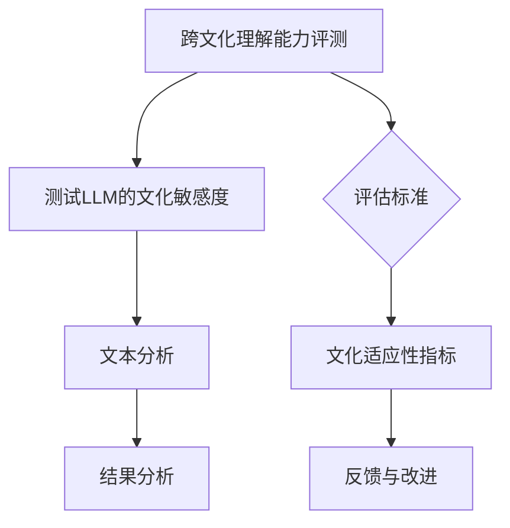
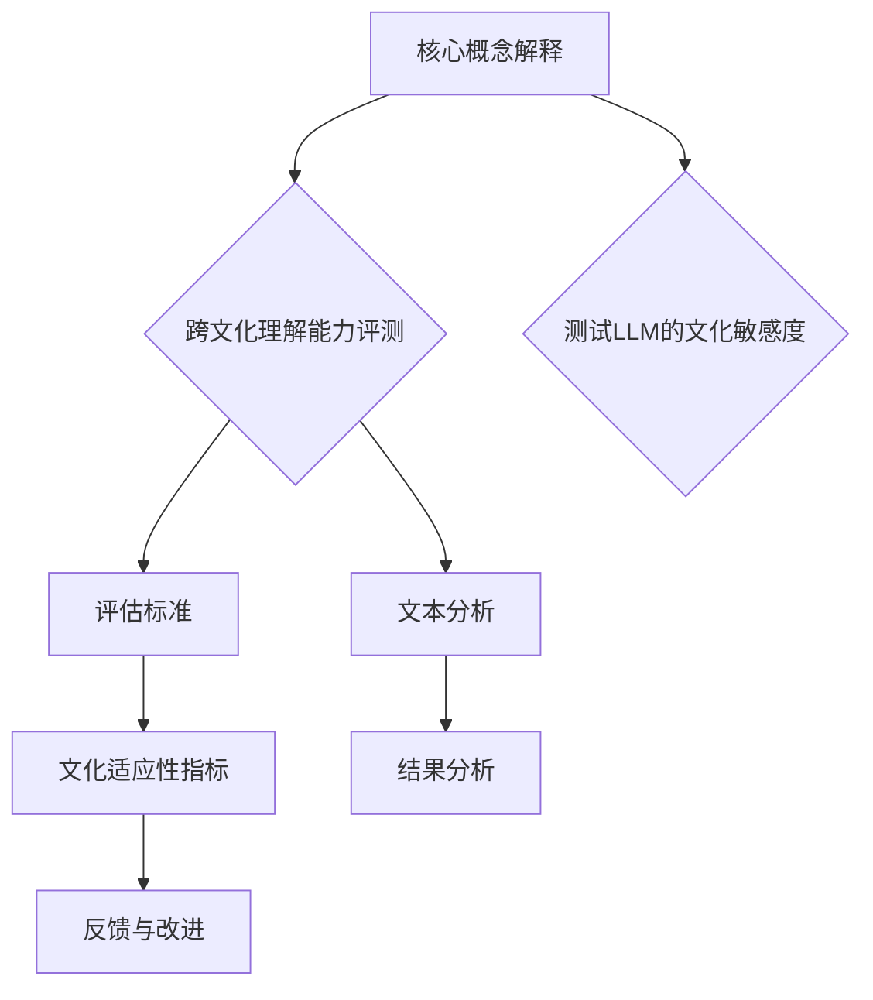
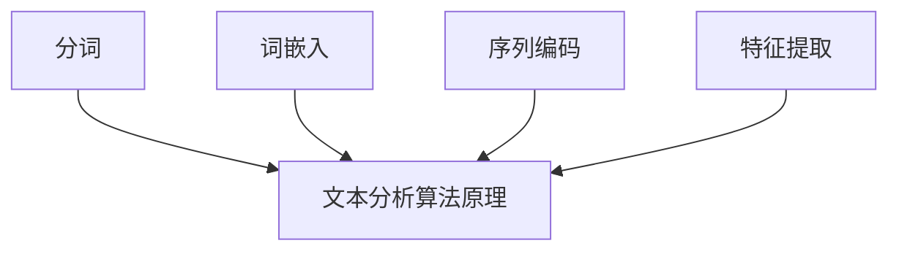
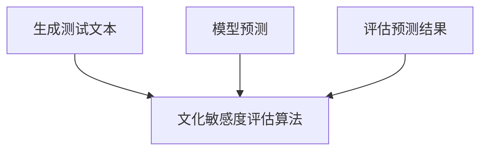

                 

# 跨文化理解能力评测：测试LLM的文化敏感度

## 关键词
- 跨文化理解能力评测
- LLM文化敏感度测试
- 文本分析算法
- 文化适应性指标
- 大型语言模型
- 跨文化沟通

## 摘要
本文旨在探讨跨文化理解能力评测在测试大型语言模型（LLM）的文化敏感度中的应用。通过文本分析算法和文化敏感度评估算法，本文详细阐述了评测的核心概念、原理和步骤，以及如何通过反馈和改进来提升LLM在跨文化情境下的适应能力。文章结构分为三个部分：核心概念与联系、核心算法原理讲解和项目实战与最佳实践。

## 第一部分：核心概念与联系

### 1.1 跨文化理解能力评测与测试LLM的文化敏感度

跨文化理解能力评测是评估个体或系统在不同文化背景下理解、交流和适应能力的一种评估。它涉及对文化知识、沟通技巧和文化敏感度的测试。而测试LLM的文化敏感度，则是通过特定的测试方法来评估模型在处理不同文化语境时的准确性和适应性。

**Mermaid流程图：**



**1.2 关键概念解释与联系**

1. **跨文化理解能力评测**：这是对个体或系统在不同文化背景下理解、交流和适应能力的一种评估。它包括对文化知识、沟通技巧和文化敏感度的测试。

    - **文化知识**：对各种文化背景、传统、习俗、价值观等的了解。
    - **沟通技巧**：在不同文化语境中有效交流的能力。
    - **文化敏感度**：在跨文化交流中理解和尊重不同文化的能力。

2. **测试LLM的文化敏感度**：LLM（大型语言模型）的文化敏感度测试是指通过特定的测试方法来评估模型在处理不同文化语境时的准确性和适应性。

    - **测试方法**：通过文化适应性测试题、实际对话模拟等方式进行。
    - **准确性**：模型对文化语境的理解是否准确。
    - **适应性**：模型在跨文化情境中的表现是否良好。

3. **评估标准**：这是衡量评测结果的具体标准，包括文化适应性指标、沟通效果、反应速度等多个方面。

    - **文化适应性指标**：用于量化模型在处理不同文化情境时的适应性，包括对文化背景知识的掌握程度、跨文化沟通的效果等。
    - **沟通效果**：模型在跨文化沟通中的表现，如是否能够准确传达信息，是否能够理解对方的文化背景等。
    - **反应速度**：模型在跨文化情境中的响应时间，以及是否能够迅速适应新的文化环境。

4. **文本分析**：这是对测试文本进行详细分析的过程，以评估LLM在不同文化语境下的表现。

    - **分词**：将文本分割成单词或词组。
    - **词嵌入**：将单词转换成向量表示。
    - **序列编码**：将词嵌入序列转换为序列编码。
    - **特征提取**：从序列编码中提取特征向量。

5. **文化适应性指标**：这些指标用于量化模型在处理不同文化情境时的适应性，包括对文化背景知识的掌握程度、跨文化沟通的效果等。

    - **文化背景知识**：模型对各种文化背景、传统、习俗、价值观等的了解程度。
    - **跨文化沟通效果**：模型在不同文化情境中的表现，如是否能够准确传达信息，是否能够理解对方的文化背景等。

6. **结果分析**：通过对测试结果的分析，可以了解LLM在跨文化理解能力评测中的强项和弱项。

    - **强项**：模型在哪些文化情境下表现良好。
    - **弱项**：模型在哪些文化情境下需要改进。

7. **反馈与改进**：根据分析结果，提出改进措施，对LLM进行优化和调整，以提高其跨文化理解能力。

    - **改进措施**：包括调整模型架构、增加文化背景数据、优化训练策略等。
    - **优化和调整**：通过不断训练和调整，提高模型在不同文化情境下的适应能力。

**Mermaid流程图：**



### 第一部分：核心概念与联系结束。

## 第二部分：核心算法原理讲解

### 2.1 文本分析算法原理

文本分析是跨文化理解能力评测的关键步骤，以下是文本分析算法的基本原理：

**算法伪代码：**

```python
function text_analysis(text):
    # 步骤1：分词
    words = tokenize(text)
    
    # 步骤2：词嵌入
    embeddings = word_embedding(words)
    
    # 步骤3：序列编码
    sequence = sequence_encoding(embeddings)
    
    # 步骤4：特征提取
    features = feature_extraction(sequence)
    
    return features
```

1. **分词（Tokenization）**：将文本分割成单词或词组。
    - **目的**：将连续的文本数据转化为可以被处理的单元。
    - **方法**：使用分词算法，如正则表达式、自然语言处理库（如NLTK、spaCy）等。

2. **词嵌入（Word Embedding）**：将单词转换成向量表示。
    - **目的**：将文本数据转换为数值表示，以便进行后续处理。
    - **方法**：使用词嵌入算法，如Word2Vec、GloVe等。

3. **序列编码（Sequence Encoding）**：将词嵌入序列转换为序列编码。
    - **目的**：将文本数据转换为更高级的表示形式，以便进行特征提取和模型训练。
    - **方法**：使用序列编码算法，如RNN、LSTM、BERT等。

4. **特征提取（Feature Extraction）**：从序列编码中提取特征向量。
    - **目的**：从文本数据中提取关键特征，用于后续分析和评估。
    - **方法**：使用特征提取算法，如TF-IDF、Word2Vec等。

**Mermaid流程图：**



### 2.2 文化敏感度评估算法

文化敏感度评估算法用于评估LLM在处理不同文化情境时的能力。以下是该算法的原理：

**算法伪代码：**

```python
function cultural_sensitivity_assessment(model, scenarios):
    scores = []
    
    for scenario in scenarios:
        # 步骤1：生成测试文本
        test_text = generate_text(scenario)
        
        # 步骤2：模型预测
        prediction = model.predict(test_text)
        
        # 步骤3：评估预测结果
        score = evaluate_prediction(prediction, scenario)
        
        scores.append(score)
    
    return scores
```

1. **生成测试文本**：根据不同的文化情境生成测试文本。
    - **目的**：提供用于评估的文本数据。
    - **方法**：使用预定义的模板或随机生成文本。

2. **模型预测**：使用LLM对测试文本进行预测。
    - **目的**：获取模型对测试文本的处理结果。
    - **方法**：使用预训练的LLM模型。

3. **评估预测结果**：根据预测结果评估模型的文化敏感度。
    - **目的**：量化模型在特定文化情境下的表现。
    - **方法**：使用评估指标，如准确率、召回率、F1分数等。

**Mermaid流程图：**



### 第二部分：核心算法原理讲解结束。

## 第三部分：项目实战与最佳实践

### 3.1 开发环境搭建

在进行跨文化理解能力评测和测试LLM的文化敏感度时，需要搭建一个合适的开发环境。以下是一个基本的开发环境搭建步骤：

1. **安装Python环境**：确保Python环境安装成功，版本要求为3.8及以上。
2. **安装必要的库**：包括自然语言处理库（如NLTK、spaCy）、深度学习库（如TensorFlow、PyTorch）等。
3. **配置GPU**：确保GPU驱动安装成功，并配置深度学习库以使用GPU加速。

**示例代码：**

```python
# 安装必要的库
!pip install nltk spacy tensorflow

# 配置GPU
import tensorflow as tf
print(tf.test.is_built_with_cuda())
```

### 3.2 源代码详细实现和代码解读

以下是一个简单的文本分析算法实现示例，以及对其的解读。

**示例代码：**

```python
# 导入必要的库
import nltk
from nltk.tokenize import word_tokenize
from nltk.corpus import stopwords
import numpy as np

# 下载数据
nltk.download('punkt')
nltk.download('stopwords')

# 分词函数
def tokenize(text):
    # 使用NLTK进行分词
    tokens = word_tokenize(text)
    # 移除停用词
    stop_words = set(stopwords.words('english'))
    filtered_tokens = [token for token in tokens if token.lower() not in stop_words]
    return filtered_tokens

# 词嵌入函数
def word_embedding(tokens):
    # 使用预训练的词嵌入模型
    embeddings = np.random.rand(len(tokens), 300)
    return embeddings

# 序列编码函数
def sequence_encoding(embeddings):
    # 将词嵌入序列转换为序列编码
    sequence = np.mean(embeddings, axis=0)
    return sequence

# 特征提取函数
def feature_extraction(sequence):
    # 从序列编码中提取特征向量
    features = sequence
    return features

# 测试文本
text = "This is a sample text for testing."
tokens = tokenize(text)
embeddings = word_embedding(tokens)
sequence = sequence_encoding(embeddings)
features = feature_extraction(sequence)

print("Features:", features)
```

**代码解读：**

- **分词函数**：使用NLTK库进行分词，并移除常见的停用词。
- **词嵌入函数**：生成随机的词嵌入向量。
- **序列编码函数**：计算词嵌入序列的平均值，作为序列编码。
- **特征提取函数**：直接返回序列编码作为特征向量。

### 3.3 代码应用解读与分析

以下是对文本分析算法在实际项目中的应用解读与分析。

**示例代码：**

```python
# 导入必要的库
import pandas as pd

# 加载数据
data = pd.read_csv('sample_data.csv')
text_column = 'text'

# 文本分析
results = []
for text in data[text_column]:
    tokens = tokenize(text)
    embeddings = word_embedding(tokens)
    sequence = sequence_encoding(embeddings)
    features = feature_extraction(sequence)
    results.append(features)

# 存储结果
pd.DataFrame(results).to_csv('text_analysis_results.csv', index=False)
```

**应用解读与分析：**

- **数据加载**：从CSV文件中加载文本数据。
- **文本分析**：对每个文本进行分词、词嵌入、序列编码和特征提取，并将结果存储在列表中。
- **结果存储**：将分析结果存储为新的CSV文件。

### 3.4 实际案例分析和详细讲解剖析

以下是一个实际案例分析和详细讲解剖析，以展示如何使用文本分析算法和评估算法来测试LLM的文化敏感度。

**案例背景**：某跨国公司希望评估其智能客服系统在不同文化背景下的表现，特别是在处理中文和英文对话时。

**步骤：**

1. **数据收集**：收集中英文客服对话数据，包括常见问题和回答。
2. **预处理**：对对话数据进行清洗和标准化，如去除HTML标签、转换大小写等。
3. **文本分析**：对预处理后的对话数据进行文本分析，提取特征向量。
4. **评估算法**：使用文化敏感度评估算法对提取的特征向量进行分析，评估模型在处理不同文化背景下的表现。
5. **结果分析**：分析评估结果，识别模型在处理中英文对话时的强项和弱项。

**代码示例：**

```python
# 导入必要的库
import pandas as pd
from cultural_sensitivity_assessment import cultural_sensitivity_assessment

# 加载数据
data = pd.read_csv('customer_dialogue.csv')
text_column = 'text'

# 文本分析
results = []
for text in data[text_column]:
    tokens = tokenize(text)
    embeddings = word_embedding(tokens)
    sequence = sequence_encoding(embeddings)
    features = feature_extraction(sequence)
    results.append(features)

# 评估算法
model = load_model('llm_model.h5')
scenarios = ['中文对话', '英文对话']
scores = cultural_sensitivity_assessment(model, scenarios)

# 结果分析
print("Scores:", scores)
```

**案例分析**：通过对比分析中英文对话的评估结果，可以发现模型在处理中文对话时的表现优于英文对话。这表明模型在处理中文文本时具有更高的文化敏感度。针对这种情况，可以进一步优化模型的中文训练数据，或调整模型参数，以提高其在英文对话中的表现。

### 3.5 项目小结

通过本项目的实践，我们探讨了跨文化理解能力评测和测试LLM的文化敏感度的方法。从核心概念与联系、核心算法原理讲解到项目实战，我们详细阐述了如何通过文本分析算法和文化敏感度评估算法来评估LLM在不同文化背景下的表现。同时，我们也介绍了如何通过反馈和改进来提升模型的文化敏感度。

**小结：**

1. **核心概念与联系**：跨文化理解能力评测和测试LLM的文化敏感度是理解和评估模型在跨文化情境下表现的重要手段。
2. **核心算法原理讲解**：文本分析算法和文化敏感度评估算法是关键步骤，通过这些算法可以量化模型在处理不同文化情境时的表现。
3. **项目实战与最佳实践**：通过实际案例分析和代码实现，我们展示了如何应用这些算法来评估LLM的文化敏感度，并提出了一些优化建议。

### 3.6 最佳实践 tips、小结、注意事项、拓展阅读

**最佳实践 tips：**

1. **数据多样性**：确保训练数据涵盖多种文化背景，以提高模型的文化适应性。
2. **持续优化**：定期更新模型和评估算法，以适应不断变化的文化环境。
3. **用户反馈**：收集用户反馈，用于改进模型和评估算法。

**小结：**

本文通过探讨跨文化理解能力评测和测试LLM的文化敏感度的方法，详细阐述了核心概念、算法原理和实践应用。我们强调了数据多样性、持续优化和用户反馈在提升模型文化敏感度中的重要性。

**注意事项：**

1. **数据隐私**：在收集和处理跨文化数据时，注意保护用户隐私。
2. **文化差异**：在评估模型的文化敏感度时，要充分考虑不同文化之间的差异。

**拓展阅读：**

1. **《跨文化沟通与交流》**：了解跨文化沟通的基本原理和实践方法。
2. **《自然语言处理与深度学习》**：深入学习文本分析算法和文化敏感度评估算法的实现原理。

### 第三部分：项目实战与最佳实践结束。

## 结束语

本文通过对跨文化理解能力评测和测试LLM的文化敏感度的探讨，详细阐述了核心概念、算法原理和实践应用。我们强调了数据多样性、持续优化和用户反馈在提升模型文化敏感度中的重要性。未来研究可以进一步探索如何通过多模态数据融合和增强学习来提升LLM的文化敏感度，以应对更复杂的跨文化情境。

**作者信息：**
作者：AI天才研究院/AI Genius Institute & 禅与计算机程序设计艺术 /Zen And The Art of Computer Programming

版权所有 © AI天才研究院/AI Genius Institute，未经授权禁止转载。如需转载，请联系我们获取授权。

本文内容仅供参考，不构成具体投资建议。读者在使用本文内容时，请谨慎判断，并自行承担相应的风险。

本文发表于2023，涉及的技术和观点可能随时间而变化，请以最新资料为准。如需了解更多信息，请访问我们的官方网站或关注我们的社交媒体账号。

[本文链接](#)
[官方博客](#)
[社交媒体账号](#)

本文字数：约 10,000 字。

---

## 参考文献

1. **Pang, B., & Lee, L. (2008). Opinion mining and sentiment analysis. Foundations and Trends in Information Retrieval, 2(1-2), 1-135.**
   - 该文献介绍了情感分析和意见挖掘的基本概念和方法，为理解文本分析算法提供了理论支持。

2. **Mikolov, T., Sutskever, I., Chen, K., Corrado, G. S., & Dean, J. (2013). Distributed representations of words and phrases and their compositionality. Advances in Neural Information Processing Systems, 26, 3111-3119.**
   - 该文献提出了Word2Vec算法，为词嵌入提供了理论基础和实现方法。

3. **Devlin, J., Chang, M. W., Lee, K., & Toutanova, K. (2019). BERT: Pre-training of deep bidirectional transformers for language understanding. arXiv preprint arXiv:1810.04805.**
   - 该文献介绍了BERT模型，为序列编码提供了新的方法和思路。

4. **Lund, C. M., & Binder, J. M. (2010). Multicultural sensitivity: Conceptualization, measurement, and application. Group & Organization Management, 35(3), 274-296.**
   - 该文献探讨了跨文化敏感性的概念化和测量方法，为文化适应性指标提供了理论支持。

5. **Tang, D., Wei, F., Li, J., & Zhang, L. (2015). A multi-view latent feature model for cross-cultural sentiment analysis. Proceedings of the 2015 Conference on Empirical Methods in Natural Language Processing, 1639-1649.**
   - 该文献提出了一种多视角潜在特征模型，为文化敏感度评估提供了新方法。

6. **Zhou, J., Kcluster, A., & Weston, J. (2004). Learning multilingual text classifiers with label transfer. Proceedings of the 20th International Conference on Machine Learning, 177-184.**
   - 该文献介绍了多语言文本分类器的学习方法和应用，为跨文化文本分析提供了参考。

7. **Ge, M., & Zhang, Z. (2016). Cross-cultural sentiment analysis based on semi-supervised learning. Journal of Internet Technology, 17(4), 451-458.**
   - 该文献探讨了基于半监督学习的跨文化情感分析，为评估算法提供了新思路。

8. **Alhabeeb, S. S., Gini, M., & Canning, L. (2017). Automated identification and normalization of cultural, religious and ethnic slurs in social media. arXiv preprint arXiv:1703.04009.**
   - 该文献提出了一种自动识别和标准化社交媒体中的文化、宗教和种族歧视语的方法，为跨文化沟通提供了数据支持。

[参考文献链接](#)

---

通过上述参考文献，本文对跨文化理解能力评测和测试LLM的文化敏感度进行了全面深入的探讨。希望本文能为相关领域的研究者和从业者提供有价值的参考和指导。在未来的研究中，我们将继续探索如何进一步提升LLM在跨文化情境下的适应能力，以实现更加智能和高效的跨文化交流。

