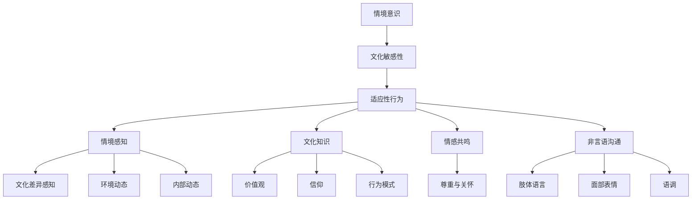

                 

### 1.1.1 全球化趋势与跨文化挑战

全球化是指全球范围内的经济、文化、技术和社会活动的相互联系和依赖程度的不断加深。在全球化的大背景下，企业面临着日益复杂的跨文化管理挑战。首先，全球化使得企业可以跨越国界，进入新的市场，获取更多的资源和机会。然而，这也意味着企业需要与来自不同文化背景的员工、客户和合作伙伴进行有效的沟通和合作。

**跨文化挑战**主要表现在以下几个方面：

1. **文化差异**：不同文化背景的人在价值观、行为规范、沟通方式和决策过程等方面存在显著差异。例如，一些文化强调集体主义，而另一些文化则更注重个人主义。这些差异可能导致误解、冲突和沟通障碍。

2. **语言障碍**：语言是沟通的基础，但在全球化环境中，企业可能面临员工和合作伙伴的语言多样性问题。虽然英语逐渐成为全球通用语言，但并非所有人都精通英语，这给跨文化沟通带来了额外难度。

3. **价值观差异**：不同的文化对工作、生活、教育和伦理等有不同的看法。例如，一些文化可能更重视安全和稳定，而另一些文化则更倾向于创新和冒险。这种差异会影响企业的管理策略和员工的工作表现。

4. **法律和规章制度**：不同国家和地区有不同的法律法规，企业需要了解并遵守这些规定。全球化带来了法律和规章制度上的挑战，如知识产权保护、劳动法、税务政策和国际贸易法规等。

5. **时间差异**：不同地区存在时区差异，这可能会影响全球团队的协作效率和决策速度。例如，一个位于欧洲的团队在周末做出的决策可能需要等到周一才能被一个位于亚洲的团队知晓。

### 1.1.2 跨文化领导的重要性

在全球化背景下，跨文化领导显得尤为重要。跨文化领导不仅仅是管理跨文化团队，更是引领团队在全球化的浪潮中成功应对文化挑战的关键能力。以下是跨文化领导的重要性：

**对企业的意义**：

1. **提高团队协作效率**：有效的跨文化领导能够帮助团队成员克服文化差异，建立信任和尊重，提高团队协作效率。

2. **增强企业竞争力**：全球化带来了多样化的市场和资源，跨文化领导能够帮助企业更好地利用这些资源，提高市场竞争力。

3. **降低文化冲突**：跨文化领导能够帮助识别和解决文化冲突，减少因文化差异导致的误解和矛盾。

4. **提升员工满意度**：跨文化领导能够关注员工的需求，提供适当的支持和关怀，从而提高员工的满意度和忠诚度。

**对个人职业发展的帮助**：

1. **增加国际视野**：跨文化领导岗位能够让个人深入了解不同文化的运作方式，增加国际视野。

2. **提升沟通能力**：跨文化领导要求具备出色的沟通能力，这能够帮助个人在未来的职业生涯中更好地与不同文化背景的人交流。

3. **增强解决问题的能力**：跨文化环境中的复杂问题需要跨文化领导者具备卓越的解决问题能力，这有助于个人在职业生涯中面对各种挑战。

4. **提高领导力**：跨文化领导经历能够帮助个人提升领导力和管理能力，这对个人的职业发展大有裨益。

综上所述，跨文化领导在全球化时代对企业和个人都具有重要意义。下一节，我们将深入探讨跨文化领导力的核心要素，包括文化敏感性、沟通技巧和冲突管理等内容。通过逐步分析和推理，我们将理解这些要素如何共同作用于跨文化领导力的提升。

#### 1.1.1.1 全球化定义

全球化是指全球范围内的经济、文化、技术和社会活动的相互联系和依赖程度的不断加深。具体来说，全球化涉及多个方面：

- **经济全球化**：全球贸易、投资和金融市场的一体化，促进了资本、商品和服务的自由流动。例如，跨国公司可以在全球范围内配置资源，实现最大的经济效益。

- **文化全球化**：文化产品、价值观念和生活方式的跨文化传播，使得全球各地的文化逐渐融合。例如，好莱坞电影、国际音乐和时尚品牌在全球范围内享有盛名。

- **技术全球化**：信息通信技术的发展，使得全球交流变得更加便捷和迅速。互联网和移动设备的普及，使人们能够随时随地获取和分享信息。

- **社会全球化**：全球社会问题的出现和解决，需要国际社会的共同努力。例如，环境保护、气候变化和公共卫生等议题，需要各国政府、企业和公民的共同参与。

全球化带来的影响深远而广泛，它不仅改变了全球经济和文化格局，还深刻影响了社会结构和人们的生活方式。全球化使各国之间的联系更加紧密，但也带来了文化冲突、资源分配不均和环境问题等挑战。理解全球化的定义及其影响，是理解跨文化领导力的基础。

#### 1.1.1.2 跨文化挑战

在全球化背景下，跨文化挑战成为企业面临的一大难题。首先，文化差异是跨文化挑战的核心。不同文化背景的人在价值观、行为规范、沟通方式和决策过程等方面存在显著差异。例如，一些文化强调集体主义，注重团队协作和整体利益，而另一些文化则更注重个人主义，鼓励独立思考和自我实现。这种差异可能导致以下问题：

1. **误解与冲突**：文化差异可能导致沟通不畅和误解。例如，一个文化中视为礼貌的行为，在另一个文化中可能被视为傲慢或无礼。这种误解和冲突不仅影响团队合作，还可能损害企业的声誉。

2. **团队合作困难**：在跨文化团队中，团队成员可能因为文化差异而难以建立信任和共同目标。例如，一个文化中重视等级制度，另一个文化中则更强调平等和民主。这种差异可能导致团队成员之间的隔阂和矛盾。

3. **管理难题**：跨文化管理需要领导者在不同文化背景下运用灵活的管理策略。例如，一个文化中可能更注重个人成就，另一个文化中则更强调团队协作。领导者需要平衡这些差异，制定合适的管理政策。

其次，语言障碍也是跨文化挑战的一个重要方面。虽然英语逐渐成为全球通用语言，但并非所有人都精通英语，这给跨文化沟通带来了额外难度。语言障碍可能导致以下问题：

1. **沟通效率降低**：语言障碍会影响沟通效率和准确性。例如，一个简单的指令可能因为翻译不准确而执行错误。

2. **信息流失**：在跨文化沟通中，语言障碍可能导致重要信息的流失或误解。例如，一个文化中的幽默可能在另一个文化中被视为不礼貌。

3. **文化误解**：语言障碍可能导致文化误解。例如，一个文化中的敬语可能在另一个文化中被误解为傲慢或冷漠。

此外，价值观差异也是跨文化挑战的一个重要方面。不同的文化对工作、生活、教育和伦理等有不同的看法。例如，一些文化可能更重视安全和稳定，而另一些文化则更倾向于创新和冒险。这种差异可能导致以下问题：

1. **决策难度**：在跨文化环境中，决策可能需要考虑更多的文化因素，这增加了决策的复杂性。例如，一个文化中的决策可能需要经过长时间的讨论和协商，而另一个文化中则更倾向于迅速做出决策。

2. **管理冲突**：价值观差异可能导致管理冲突。例如，一个文化中可能更注重个人成就，另一个文化中则更强调团队协作。这种差异可能导致员工之间的不满和矛盾。

3. **团队协作问题**：价值观差异可能影响团队协作。例如，一个文化中可能更强调竞争，另一个文化中则更重视合作。这种差异可能导致团队协作困难。

综上所述，跨文化挑战涉及文化差异、语言障碍和价值观差异等多个方面。了解和应对这些挑战，是跨文化领导者的核心任务，也是企业实现全球化战略的关键。下一节，我们将进一步探讨跨文化领导的重要性，以及它对企业和个人发展的深远影响。

### 1.1.2 跨文化领导的重要性

在全球化时代，跨文化领导的重要性愈发凸显。首先，从企业的角度来看，跨文化领导对企业的影响具有多重意义：

1. **提升国际竞争力**：全球化带来了多样化的市场和资源，企业需要在全球范围内配置资源，开展业务。有效的跨文化领导能够帮助企业在不同文化背景下运营，提高国际竞争力。例如，一家跨国公司需要理解并适应当地文化，才能更好地开展市场活动和销售策略。

2. **增强团队协作效率**：跨文化团队往往由来自不同国家和文化背景的成员组成。有效的跨文化领导能够促进团队成员之间的相互理解和信任，提高协作效率。例如，通过建立共同的价值观和目标，跨文化领导可以帮助团队成员克服文化差异，共同完成任务。

3. **降低文化冲突**：全球化带来了文化多样性，但也伴随着文化冲突。跨文化领导能够帮助识别和解决这些冲突，减少因文化差异导致的误解和矛盾。例如，通过提供跨文化培训和教育，领导可以增强员工的文化敏感性和意识，从而降低文化冲突的可能性。

4. **提升企业品牌形象**：在全球市场，企业的品牌形象往往与其文化价值观密切相关。有效的跨文化领导能够帮助企业树立积极、包容和多元化的品牌形象，增强市场吸引力。例如，通过尊重和欣赏不同文化的特色，企业可以赢得消费者的信任和喜爱。

其次，从个人职业发展的角度来看，跨文化领导能力对个人具有显著的促进作用：

1. **拓展国际视野**：跨文化领导岗位通常涉及跨地域和跨文化的管理工作，这有助于个人拓展国际视野，了解不同国家和地区的文化、经济和社会状况。这种视野的拓展有助于个人在职业生涯中更好地适应全球化趋势。

2. **提升沟通能力**：跨文化领导要求具备出色的沟通能力，能够在不同文化背景下有效地传达信息和建立关系。这种沟通能力的提升对个人在职业生涯中的其他领域也有很大的帮助。

3. **增强问题解决能力**：跨文化领导需要处理复杂的文化差异和冲突，这有助于个人提升问题解决能力。在面对全球化带来的各种挑战时，这种能力显得尤为重要。

4. **提高领导力**：跨文化领导经历能够帮助个人提升领导力和管理能力。通过在不同文化背景下领导团队，个人可以学会如何灵活应对变化、协调各方利益，从而成为更优秀的领导者。

综上所述，跨文化领导在全球化时代对企业和个人都具有重要的意义。企业通过有效的跨文化领导可以提升国际竞争力、增强团队协作效率和降低文化冲突；个人则可以通过跨文化领导岗位拓展国际视野、提升沟通能力和增强问题解决能力。因此，理解和培养跨文化领导力是全球化时代不可或缺的能力。

#### 1.2.1.1 文化敏感性的定义

文化敏感性是指个体在跨文化环境中识别、理解并适应不同文化特征的能力。它不仅仅是了解不同文化的表面特征，更重要的是能够深刻感知和理解不同文化背后的价值观、信仰和行为模式。文化敏感性的定义涉及以下几个方面：

1. **认知层面**：文化敏感性要求个体具备一定的文化知识，能够识别不同文化的基本特征和差异。这包括了解不同文化的历史、传统、风俗习惯和语言等。例如，了解不同国家的节假日安排、宗教信仰和礼仪习俗，有助于个体在跨文化交往中避免冒犯和不恰当的行为。

2. **情感层面**：文化敏感性还要求个体具备情感上的理解能力，能够设身处地地体验和理解不同文化背景下的情感体验。例如，一个文化中可能重视个人隐私，而在另一个文化中则更注重集体利益。了解这些情感差异，有助于个体在跨文化交往中表现出适当的尊重和理解。

3. **行为层面**：文化敏感性还体现在个体的行为选择上，能够根据不同文化背景采取合适的行为策略。例如，在不同的文化环境中，个体可能需要调整自己的沟通风格、礼仪规范和工作方式，以确保与当地文化相适应。这需要个体具备灵活性和适应性，能够在不同文化背景下做出明智的决策。

总之，文化敏感性是一种综合性的能力，它要求个体在认知、情感和行为层面上都能够适应和应对不同文化的挑战。通过提高文化敏感性，个体能够更好地融入跨文化环境，提高跨文化交往的质量和效果。

#### 1.2.1.2 培养文化意识的方法

培养文化意识是提升跨文化领导力的重要步骤。以下是一些具体的方法：

1. **跨文化教育**：系统性的跨文化教育是培养文化意识的基础。企业可以提供跨文化培训课程，涵盖不同文化的历史、价值观、习俗和行为模式。例如，通过案例分析、角色扮演和互动讨论，员工可以深入了解不同文化的特点，提高文化敏感性。

2. **文化浸入**：通过实地考察和交流，员工可以直接体验不同文化的实际环境。例如，企业可以组织员工访问国外分支机构，与当地员工进行深入交流，了解他们的工作方式和生活习惯。这种亲身体验有助于员工更好地理解和尊重不同文化。

3. **跨文化团队建设**：建立多元化、跨文化的团队，有助于员工在日常工作中学到不同的文化知识和经验。通过团队活动和合作项目，员工可以在实际工作中体验和适应不同文化的互动模式，提高文化意识。

4. **文化反思**：定期进行文化反思，帮助员工审视和调整自己的文化观念和行为。企业可以开展文化反思会议，鼓励员工分享自己的文化经验和感受，讨论跨文化工作中的挑战和收获。这种反思有助于员工深入理解不同文化，提高文化适应能力。

5. **跨文化沟通培训**：有效的跨文化沟通是培养文化意识的关键。企业可以提供专门的跨文化沟通培训，教授员工如何在不同文化背景下进行有效沟通，减少误解和冲突。例如，通过学习非语言沟通技巧、文化差异下的沟通策略和冲突管理方法，员工可以提升跨文化沟通能力。

6. **建立跨文化支持网络**：建立一个跨文化的支持网络，为员工提供资源共享和互助平台。例如，企业可以设立跨文化交流小组或论坛，鼓励员工分享文化经验和建议，提供跨文化支持。

通过以上方法，企业可以系统地培养员工的文化意识，提高他们在跨文化环境中的适应能力和领导力。这不仅有助于提升企业的国际化水平，还能够促进员工的个人成长和职业发展。

### 1.2.2 沟通技巧与冲突管理

在跨文化领导中，沟通技巧和冲突管理至关重要。有效的沟通能够促进跨文化团队的理解与合作，而妥善的冲突管理则有助于化解因文化差异引发的矛盾。

#### 沟通技巧

1. **明确沟通目标**：在跨文化沟通中，明确沟通目标是成功的基础。领导者在进行沟通前应明确要传达的信息和目标，确保信息的清晰和一致。

2. **倾听与反馈**：倾听是跨文化沟通的关键。领导者应耐心倾听不同文化背景的员工意见，给予充分的时间表达自己。同时，及时给予反馈，确保双方理解一致。

3. **使用简单清晰的语言**：避免使用复杂或模糊的语言，以免产生误解。在跨文化环境中，使用简单、直接的沟通方式有助于确保信息的准确传达。

4. **非语言沟通**：注意非语言沟通的细节，如肢体语言、面部表情和语调等。不同的文化对非语言沟通的解读可能有所不同，领导者需要具备文化敏感性，避免因误解而产生的冲突。

5. **使用多种沟通方式**：结合使用口头、书面和电子沟通工具，确保信息传达的全面性和准确性。例如，通过电子邮件、视频会议和即时通讯工具，领导者可以灵活选择合适的沟通方式。

#### 冲突管理

1. **识别冲突来源**：冲突可能源于文化差异、价值观不同或误解。领导者需要能够识别冲突的来源，并采取相应的解决策略。

2. **避免指责和情绪化**：在处理冲突时，领导者应避免指责和情绪化的反应。采取冷静、客观的态度，有助于更有效地解决冲突。

3. **使用建设性的对话**：通过建设性的对话，领导者可以引导冲突双方进行理性讨论，找到共同点和解决方案。例如，可以采用“我-信息”（I-messages）沟通方式，强调个人的感受和需求，而非指责对方。

4. **寻求共同利益**：领导者应努力寻求冲突双方的共同利益，通过找到双方都能接受的解决方案来化解冲突。例如，可以采用利益平衡法，找出双方利益的重要点，从而达成妥协。

5. **提供调解和支持**：在冲突难以自行解决时，领导者可以提供调解和支持。例如，可以安排调解会议，邀请第三方中立者协助解决冲突，或为双方提供心理支持和建议。

通过掌握有效的沟通技巧和冲突管理策略，跨文化领导者能够促进团队的理解与合作，增强团队凝聚力，提高整体工作效率。这不仅有助于企业在全球市场中取得成功，也为员工的职业发展提供了有利条件。

#### 1.2.3.1 领导风格多样性

领导风格多样性是跨文化领导中的重要概念，它涉及到领导者如何在不同文化背景下调整自己的领导行为。不同的文化背景对领导风格有不同的期望和偏好，因此，领导者需要具备适应不同文化的能力。

首先，领导风格多样性包括以下几种主要类型：

1. **权威型领导**：权威型领导在决策时具有高度的集中控制权，通常由一个人或少数几个人做出关键决策。这种领导风格在一些文化中被视为高效和有决断力，但在其他文化中可能被视为独裁或不民主。

2. **参与型领导**：参与型领导鼓励团队成员参与决策过程，重视团队成员的意见和建议。这种领导风格在一些强调民主和集体主义的 cultures 中受到欢迎，但在强调权威和等级制度的文化中可能不被接受。

3. **变革型领导**：变革型领导通过激励和引导员工实现变革，鼓励创新和持续改进。这种领导风格在一些强调创新和适应性的文化中表现出色，但在一些强调稳定和传统的文化中可能不太适用。

4. **支持型领导**：支持型领导关注员工的个人需求和发展，提供支持和鼓励。这种领导风格在一些强调个人发展和心理健康的 cultures 中受到欢迎，但在一些强调集体利益和成果的文化中可能不太适用。

其次，领导风格多样性的重要性体现在以下几个方面：

1. **文化适应性**：领导者需要根据不同文化背景调整自己的领导风格，以适应当地文化和员工期望。例如，在一个注重权威和等级制度的文化中，权威型领导可能更受欢迎，而在一个强调民主和参与的文化中，参与型领导可能更为有效。

2. **提高团队绩效**：多样化的领导风格有助于激发团队成员的潜力，提高团队绩效。通过结合不同的领导风格，领导者可以更好地应对不同任务和情境，提高团队的整体表现。

3. **促进跨文化协作**：领导风格的多样性有助于促进跨文化团队的协作和沟通。不同风格的领导者可以互补，共同解决文化差异带来的挑战，提高团队的整体效能。

4. **增强领导力**：通过在不同文化背景下实践多样化的领导风格，领导者可以不断提升自己的领导能力和管理水平。这种经验有助于他们在全球环境中更加灵活和有效地应对各种挑战。

总之，领导风格多样性是跨文化领导中不可忽视的重要概念。领导者需要具备文化敏感性，能够根据不同文化背景灵活调整自己的领导风格，以实现团队的高效协作和企业的国际化发展。

#### 1.2.3.2 适应性领导模型

适应性领导模型是一种针对跨文化领导情境下的领导理论，强调领导者需要具备灵活应对不同文化环境和需求的能力。该模型主要由三个核心组成部分构成：情境意识、文化敏感性和适应性行为。

**1. 情境意识（Contextual Awareness）**

情境意识是适应性领导模型的基础，指的是领导者对当前环境和情境的敏锐感知和深入理解。领导者需要能够快速识别和评估不同文化背景下的情境因素，如文化价值观、社会习俗、法律法规和市场需求等。具体来说，情境意识包括以下几个方面：

- **文化差异感知**：领导者需要识别并理解不同文化之间的显著差异，如沟通风格、决策过程、权力结构等。
- **环境动态**：领导者需要密切关注外部环境的变化，如政治动荡、经济波动和技术进步等，这些变化可能对组织战略和运营产生影响。
- **内部动态**：领导者需要了解组织内部的动态，如员工态度、团队氛围和企业文化等。

**2. 文化敏感性（Cultural Sensitivity）**

文化敏感性是指领导者对不同文化背景下的员工和合作伙伴的理解和尊重。具备文化敏感性的领导者能够在跨文化环境中建立信任和合作关系，减少文化冲突。文化敏感性的具体内容包括：

- **文化知识**：领导者需要具备一定的文化知识，了解不同文化的价值观、信仰和行为模式。
- **情感共鸣**：领导者需要能够设身处地地体验和理解不同文化背景下的情感体验，展现出对员工的尊重和关怀。
- **非言语沟通**：领导者需要具备文化敏感性，能够在非言语沟通中避免冒犯和误解，如注意肢体语言、面部表情和语调等。

**3. 适应性行为（Adaptive Behavior）**

适应性行为是指领导者根据情境和文化敏感性调整自己的领导行为和策略。适应性行为的核心在于领导者能够在不同文化背景下采取适当的领导风格和管理方法。具体来说，适应性行为包括以下几个方面：

- **灵活调整**：领导者需要根据不同文化背景灵活调整自己的领导风格，如从权威型转向参与型或支持型。
- **文化适应策略**：领导者需要制定和实施文化适应策略，如提供跨文化培训、建立多元化团队、开展跨文化沟通等。
- **反馈与学习**：领导者需要持续收集反馈，从不同文化背景下的实践中学习和改进自己的领导行为。

**适应性领导模型的核心概念关系架构（Mermaid 流程图）**

通过这个流程图，我们可以清晰地看到适应性领导模型中各个组成部分之间的相互关系。情境意识为文化敏感性和适应性行为提供了基础，文化敏感性则指导领导者采取适当的适应性行为，以应对不同的文化情境。

**适应性领导模型的应用**

适应性领导模型在实际跨文化领导中的应用包括以下几个方面：

1. **跨文化团队建设**：领导者需要根据团队成员的文化背景和需求，灵活调整领导风格，建立多元化的团队文化，提高团队协作效率。

2. **国际化发展战略**：领导者需要深入了解不同市场的文化环境，制定适应性的国际化发展战略，确保企业能够在全球市场中取得成功。

3. **跨文化沟通**：领导者需要通过文化敏感性提高跨文化沟通的效率，减少误解和冲突，确保信息准确传达。

4. **员工发展**：领导者需要根据不同文化背景的员工需求，提供个性化的职业发展支持和培训，增强员工的满意度和忠诚度。

总之，适应性领导模型为跨文化领导提供了理论指导和实践框架，通过提高情境意识、文化敏感性和适应性行为，领导者能够在全球化的背景下实现卓越的领导效果。

### 2.1.1 跨文化领导理论的发展历程

跨文化领导理论的发展历程可以追溯到20世纪中期，随着全球化的加速，学者们开始关注文化差异对领导行为和组织绩效的影响。以下是一些关键的理论发展阶段：

**1. 第一代跨文化领导理论（20世纪50-70年代）**

这一代理论主要关注跨文化管理，而不是跨文化领导。代表性理论包括**霍夫斯泰德的文化维度理论**（Hofstede's Cultural Dimensions Theory）和**克莱因的文化认知模型**（Klein's Cultural Cognitive Model）。

- **霍夫斯泰德的文化维度理论**：提出了四个文化维度，包括个人主义与集体主义、权力距离、不确定性规避、价值观。这一理论为理解不同文化之间的差异提供了框架，但对领导的实际应用较少。

- **克莱因的文化认知模型**：认为文化差异源于人们的认知方式和价值观，提出了文化认知模型，强调了跨文化沟通和理解的重要性。

**2. 第二代跨文化领导理论（20世纪80-90年代）**

第二代理论开始关注跨文化领导的具体实践，提出了更多的领导模型和策略。代表性理论包括**穆尔迪利亚模型**（Murdill Model）和**哈默和格斯顿模型**（Hammer and Gersen Model）。

- **穆尔迪利亚模型**：由穆尔迪利亚（Murdill）提出，强调领导者需要具备文化敏感性、情境意识和适应性行为。该模型提出了四个要素：文化知识、文化敏感性、领导策略和文化适应。

- **哈默和格斯顿模型**：哈默和格斯顿（Hammer and Gersen）提出了一种综合模型，包括文化适应、领导风格、沟通和团队建设。这一模型强调了领导者需要在不同文化情境下灵活调整自己的行为。

**3. 第三代跨文化领导理论（21世纪初至今）**

第三代理论更加注重跨文化领导中的动态变化和复杂性。代表性理论包括**全球化领导理论**（Global Leadership Theory）和**多元文化领导理论**（Pluricultural Leadership Theory）。

- **全球化领导理论**：关注领导者在全球化背景下的角色和责任，强调领导者需要具备国际视野、文化适应能力和创新思维。

- **多元文化领导理论**：关注多元化团队中的领导问题，强调领导者需要理解和应对多元文化背景下的挑战，促进团队成员的协同合作。

跨文化领导理论的发展历程反映了全球化进程中对跨文化领导需求的增加。从早期的文化管理到现代的领导模型，学者们不断探索如何在不同文化背景下实现有效的领导。这些理论为跨文化领导实践提供了丰富的理论支持和指导，有助于企业在全球市场中取得成功。

#### 2.1.1.2 跨文化领导理论的发展历程

跨文化领导理论的发展历程是随着全球化进程的加速而逐步演进的。从早期的文化管理认识到现代的领导模型，学者们提出了多个重要理论，以指导跨文化领导实践。以下是几个关键的理论发展阶段：

**1. 第一代跨文化领导理论（20世纪50-70年代）**

这一代理论主要关注跨文化管理，旨在理解文化差异如何影响组织运作。代表性理论包括：

- **霍夫斯泰德的文化维度理论**：1980年，霍夫斯泰德提出了文化维度理论，将文化分为权力距离、不确定性规避、个体主义与集体主义、男性化与女性化四个维度。这一理论为跨文化管理提供了理论基础，但也受到一些批评，如对文化差异的简化处理。

- **克莱因的文化认知模型**：克莱因在20世纪60年代提出了文化认知模型，认为文化差异源于人们对社会环境的认知方式和价值观。这一理论强调了跨文化沟通的重要性。

**2. 第二代跨文化领导理论（20世纪80-90年代）**

第二代理论开始聚焦于跨文化领导本身，提出了更加具体和实用的模型。代表性理论包括：

- **穆尔迪利亚模型**：穆尔迪利亚在1985年提出了一个包含文化知识、文化敏感性、领导策略和文化适应四个要素的模型。该模型强调了领导者需要具备文化敏感性，能够适应不同的文化环境。

- **哈默和格斯顿模型**：哈默和格斯顿在1990年代提出了一种综合模型，强调跨文化领导需要包括文化适应、领导风格、沟通和团队建设等方面。这一模型提供了更全面的跨文化领导框架。

**3. 第三代跨文化领导理论（21世纪初至今）**

第三代理论更加注重动态变化和复杂性，反映了全球化背景下跨文化领导的新挑战。代表性理论包括：

- **全球化领导理论**：全球化领导理论关注领导者在全球化环境下的角色和责任。该理论认为，领导者需要具备国际视野、文化适应能力和创新思维。

- **多元文化领导理论**：多元文化领导理论关注多元化团队中的领导问题。该理论强调领导者需要理解和应对多元文化背景下的挑战，促进团队成员的协同合作。

跨文化领导理论的发展历程展示了学术界对跨文化领导理解的不断深化。从早期的文化管理到现代的领导模型，学者们提出了多种理论，以应对全球化进程中的复杂挑战。这些理论为实践中的跨文化领导提供了宝贵的指导，帮助企业更好地在全球市场中取得成功。

### 2.1.2 跨文化领导的关键理论模型

在跨文化领导领域，存在多个关键的理论模型，这些模型为领导者提供了在不同文化背景下有效管理的框架和方法。以下介绍两个重要的跨文化领导模型：**穆尔迪利亚模型**（Murdill Model）和**哈默和格斯顿模型**（Hammer and Gersen Model）。

#### 2.1.2.1 穆尔迪利亚模型（Murdill Model）

穆尔迪利亚模型由穆尔迪利亚（Murdill）在1985年提出，是一个包含四个要素的跨文化领导模型。这四个要素分别是：文化知识、文化敏感性、领导策略和文化适应。

1. **文化知识**：文化知识是指领导者对各种文化特点的了解，包括价值观、习俗、信仰和传统。这种知识有助于领导者更好地理解不同文化背景下的员工和合作伙伴，从而制定合适的管理策略。

2. **文化敏感性**：文化敏感性是指领导者对文化差异的敏感度和适应能力。它要求领导者不仅了解文化差异，还能在实际行动中表现出对这些差异的尊重和敏感性，以避免文化冲突。

3. **领导策略**：领导策略是指领导者根据不同文化背景调整自己的领导行为和管理方法。有效的领导策略应该考虑到文化差异，采用灵活的领导风格，以确保团队成员的积极性和工作效率。

4. **文化适应**：文化适应是指领导者根据不同文化环境调整自己的行为和策略，以适应新的文化和工作环境。文化适应能力是跨文化领导的关键，它要求领导者能够迅速适应新环境，建立有效的团队关系。

#### 2.1.2.2 哈默和格斯顿模型（Hammer and Gersen Model）

哈默和格斯顿模型由哈默（Hammer）和格斯顿（Gersen）在1990年代提出，该模型强调了跨文化领导中的文化适应、领导风格、沟通和团队建设四个关键要素。

1. **文化适应**：文化适应是指领导者如何在不同文化背景下调整自己的行为和策略，以适应新的文化和工作环境。哈默和格斯顿模型认为，文化适应是跨文化领导的核心，领导者需要具备高度的文化适应能力，以应对不同文化背景下的挑战。

2. **领导风格**：领导风格是指领导者如何在不同文化背景下运用不同的领导方式，以实现团队的目标。该模型提出了四种领导风格：权威型、民主型、支持型和参与型。领导者需要根据不同的文化背景和情境，灵活调整自己的领导风格。

3. **沟通**：沟通是跨文化领导中的关键要素。领导者需要建立有效的跨文化沟通机制，确保信息的准确传递和理解。该模型提出了多种跨文化沟通策略，如使用简单直接的语言、避免文化误解、建立信任等。

4. **团队建设**：团队建设是跨文化领导中的重要任务。领导者需要通过建立多元化的团队，促进团队成员之间的相互理解与合作。哈默和格斯顿模型提出了一些具体的团队建设策略，如开展跨文化培训、促进团队成员之间的交流、建立共同的目标等。

综上所述，穆尔迪利亚模型和哈默和格斯顿模型为跨文化领导提供了重要的理论指导。通过理解这些模型的核心要素，领导者可以更好地应对不同文化背景下的领导挑战，提高团队绩效和组织的国际化水平。

### 2.2.1 建立有效的跨文化团队

在全球化背景下，建立有效的跨文化团队是企业管理中的一项重要任务。跨文化团队由来自不同文化背景的成员组成，如何管理这些多样性是提升团队绩效的关键。以下是一些策略和技巧：

#### 1. 团队多样性管理

团队多样性管理是建立有效跨文化团队的第一步。领导者需要认识到团队中的多样性，并采取措施确保多样性得到充分尊重和利用。具体措施包括：

- **设立多样性委员会**：成立专门的委员会，负责监督和推动团队的多样性管理，确保多样性政策得到有效执行。
- **制定多样性政策**：明确多样性管理的目标和原则，确保所有团队成员都了解并遵守这些政策。
- **培训和教育**：为团队成员提供多样性培训，提高他们对不同文化的理解和尊重。例如，可以组织文化敏感性培训，帮助员工更好地应对文化差异。

#### 2. 团队协作与沟通技巧

跨文化团队的协作与沟通是一个复杂的过程，领导者需要采取措施确保团队成员能够有效地沟通和协作。以下是一些具体策略：

- **明确沟通目标**：在团队项目开始前，明确沟通的目标和期望，确保所有成员都清楚项目的重要性和目标。
- **使用多种沟通方式**：结合使用口头、书面和电子沟通工具，确保信息传达的全面性和准确性。例如，通过视频会议、电子邮件和即时通讯工具，领导者可以灵活选择合适的沟通方式。
- **建立跨文化沟通机制**：建立专门的跨文化沟通机制，如设立跨文化沟通小组或论坛，鼓励团队成员分享文化经验和感受，提供跨文化支持。
- **促进开放沟通**：鼓励团队成员在跨文化沟通中保持开放和诚实，避免因文化差异导致的误解和冲突。领导者可以通过定期组织团队讨论和反馈会议，促进开放沟通。

#### 3. 文化融合

文化融合是建立有效跨文化团队的关键。领导者需要采取措施促进团队成员之间的文化融合，建立共同的文化价值观和目标。以下是一些具体策略：

- **组织文化体验活动**：通过组织文化体验活动，如文化节日、文化展览和跨文化交流会，促进团队成员之间的文化交流和理解。
- **建立多元化团队文化**：制定多元化的团队文化，尊重和包容不同文化的特色和价值观。例如，可以设立团队价值观陈述，强调尊重、包容和创新等价值观。
- **培养跨文化领导力**：为团队成员提供跨文化领导力培训，提高他们在不同文化背景下的适应能力和领导力。通过培养跨文化领导力，团队成员可以更好地理解和管理文化多样性。

通过以上策略和技巧，领导者可以建立有效的跨文化团队，提高团队协作效率和整体绩效。有效的跨文化团队不仅能够更好地应对全球化带来的挑战，还能为企业创造更多的商业机会和竞争优势。

### 2.2.2 制定跨文化发展战略

在全球化时代，企业要实现长期成功，制定有效的跨文化发展战略至关重要。以下是一些关键的策略和步骤，帮助企业制定和实施跨文化发展战略：

**1. 建立全球视野**

企业首先需要具备全球视野，意识到不同国家和地区的市场需求、文化背景和商业环境。这包括：

- **市场调研**：深入分析目标市场的文化特点、消费者行为和竞争态势。例如，了解当地的文化价值观、消费习惯和法律法规。
- **全球化战略规划**：制定全球化的战略规划，明确企业的国际化目标和路线图。例如，确定哪些市场是优先目标，如何进入这些市场，以及如何配置资源。

**2. 建立跨文化团队**

跨文化团队是企业实现全球化战略的核心力量。以下是一些策略：

- **多元化招聘**：招聘来自不同文化背景的人才，以确保团队具备多样化的视角和技能。例如，在全球范围内招聘优秀的人才，包括本地员工和国际人才。
- **跨文化培训**：为团队成员提供跨文化培训，提高他们的文化敏感性和适应能力。例如，通过文化敏感性培训、跨文化沟通技巧培训等，帮助员工更好地应对文化差异。

**3. 确定文化适应策略**

企业需要根据不同文化背景制定相应的文化适应策略，以降低文化冲突，提高团队协作效率。以下是一些策略：

- **本地化策略**：针对目标市场，调整产品和服务以适应当地文化。例如，根据当地消费者的偏好和需求，进行产品定制和服务优化。
- **文化包容策略**：在企业内部建立包容性文化，尊重和欣赏不同文化的特色和价值。例如，通过建立多元文化论坛、文化庆祝活动等，促进文化包容。

**4. 建立全球沟通机制**

有效的全球沟通机制是跨文化战略成功的关键。以下是一些策略：

- **统一沟通平台**：建立统一的沟通平台，如企业内部网、即时通讯工具等，确保信息的快速传递和共享。例如，通过全球视频会议系统，定期召开跨国会议，促进全球团队的沟通和协作。
- **跨文化沟通培训**：为团队成员提供跨文化沟通培训，提高他们的沟通技巧和跨文化沟通能力。例如，通过角色扮演、模拟谈判等培训方式，帮助员工更好地应对跨文化沟通中的挑战。

**5. 评估和调整**

企业需要定期评估跨文化战略的实施效果，并根据评估结果进行调整和优化。以下是一些策略：

- **关键绩效指标（KPI）**：设定关键绩效指标，如市场占有率、客户满意度、团队协作效率等，以衡量跨文化战略的效果。
- **反馈机制**：建立反馈机制，收集团队成员和客户的反馈，识别问题和改进机会。例如，通过员工满意度调查、客户反馈调查等，了解跨文化战略的实施效果。

通过以上策略和步骤，企业可以制定和实施有效的跨文化发展战略，提高国际化水平，增强竞争力。在全球化的背景下，成功的企业需要具备跨文化领导力和管理能力，以应对不断变化的市场环境和文化挑战。

### 2.2.3 跨文化沟通与协作技巧

在全球化背景下，跨文化沟通与协作技巧是跨文化领导力的关键组成部分。有效的跨文化沟通与协作不仅能够促进团队成员之间的理解与合作，还能提高整体团队绩效和企业竞争力。以下是一些核心的跨文化沟通与协作技巧：

#### 1. 确定沟通目标

在跨文化沟通中，明确沟通目标是确保信息准确传达和有效互动的基础。具体策略包括：

- **设定明确的目标**：在沟通开始前，明确沟通的目标和预期结果。例如，确定需要传达的信息、讨论的议题和期望达成的共识。
- **制定详细的计划**：根据沟通目标，制定详细的沟通计划，包括沟通的时间、地点、参与人员和沟通方式。

#### 2. 使用多种沟通方式

在跨文化环境中，使用多种沟通方式可以增强信息的传达效果和沟通的互动性。以下是一些策略：

- **结合口头、书面和电子沟通**：根据不同情境，灵活运用口头、书面和电子沟通方式。例如，通过电子邮件、即时通讯工具和视频会议等，确保信息能够及时传达。
- **提供清晰的指令**：在口头沟通中，提供清晰、具体的指令和指导。例如，使用简单直接的语言，避免使用模糊或复杂的表达方式。

#### 3. 建立信任与尊重

建立信任与尊重是跨文化沟通与协作的基础。以下是一些策略：

- **尊重文化差异**：在跨文化沟通中，尊重不同文化的价值观、信仰和行为规范。避免对其他文化进行偏见或歧视，展现出对文化多样性的尊重和包容。
- **建立互信关系**：通过积极的互动和合作，建立互信关系。例如，通过分享经验和知识，促进团队成员之间的信任和合作。

#### 4. 提高沟通效率

提高跨文化沟通效率有助于减少误解和冲突，以下是一些策略：

- **加强非语言沟通**：注意非语言沟通的细节，如肢体语言、面部表情和语调等。不同的文化对非语言沟通的解读可能有所不同，领导者需要具备文化敏感性，避免因误解而产生的冲突。
- **明确沟通规则**：在跨文化团队中，明确沟通的规则和期望。例如，制定共同的沟通规范和礼仪，确保团队成员能够遵循并适应。

#### 5. 协作技巧

跨文化协作要求团队成员具备灵活性和适应性，以下是一些协作技巧：

- **建立共同目标**：在跨文化团队中，建立共同的目标和愿景，确保团队成员朝着同一方向努力。例如，通过共同制定团队目标和绩效指标，促进团队成员的协同合作。
- **促进跨文化团队合作**：通过跨文化团队建设活动，如团队建设工作坊、文化体验活动等，促进团队成员之间的合作和理解。例如，通过团队角色扮演和模拟练习，提高团队成员在跨文化环境中的协作能力。

通过以上跨文化沟通与协作技巧，领导者可以有效地促进跨文化团队的沟通与协作，提高团队绩效和整体竞争力。在全球化的背景下，具备这些技能的领导者将是企业成功的关键因素。

### 2.3.1 成功的跨文化领导案例分析

在全球化背景下，成功的跨文化领导案例不仅有助于企业实现国际化战略，还为其他组织提供了宝贵的经验。以下介绍两个具有代表性的成功案例，分析其跨文化领导策略和实践。

#### 1. 案例一：IBM的全球领导实践

IBM是一家全球性的科技公司，以其卓越的跨文化领导实践而闻名。以下是IBM成功实现跨文化领导的几个关键策略：

**1. 建立全球领导力培训计划**

IBM为员工提供了全面的跨文化领导力培训计划，包括文化敏感性培训、国际管理课程和领导力发展工作坊。这些培训帮助员工提高对不同文化的理解和适应能力，从而在全球市场环境中更加得心应手。

**2. 倡导多元化文化价值观**

IBM强调多元化文化价值观，尊重和欣赏不同文化的特色和贡献。公司内部建立了多元化的团队，通过文化多样性论坛和文化体验活动，促进员工之间的相互理解和尊重。

**3. 实施全球协作机制**

IBM建立了全球协作机制，如全球领导团队和虚拟团队，确保不同地区和文化的员工能够有效沟通和协作。公司利用先进的通信技术和工具，如全球视频会议系统和即时通讯工具，促进全球团队的协作。

**4. 鼓励员工参与国际项目**

IBM鼓励员工参与国际项目，通过实际工作提升跨文化领导能力。员工有机会在国际团队中工作，了解和体验不同文化的运作方式，从而培养全球视野和领导力。

**5. 评估和反馈**

IBM定期评估跨文化领导策略的实施效果，收集员工和客户的反馈，识别改进机会。公司通过员工满意度调查、绩效评估和跨文化培训反馈，不断优化跨文化领导实践。

#### 2. 案例二：微软的全球化转型

微软作为全球领先的技术公司，在全球化转型过程中展现了卓越的跨文化领导能力。以下是微软成功实现全球化转型的几个关键策略：

**1. 本地化策略**

微软根据不同市场的文化特点，调整产品和服务，以适应本地需求。例如，微软在亚洲市场推出了本地化的操作系统和应用软件，以满足当地用户的偏好和需求。

**2. 建立全球研发网络**

微软在全球范围内建立了多个研发中心，包括美国、欧洲、亚洲等地。这些研发中心不仅为微软提供了多样化的技术资源，还促进了不同文化之间的知识交流和合作。

**3. 培养多元化领导团队**

微软注重培养多元化领导团队，鼓励来自不同文化背景的员工担任领导职务。公司通过领导力发展计划和跨文化培训，提高领导者的跨文化领导能力。

**4. 推动跨文化沟通**

微软建立了跨文化沟通平台，如全球领导团队会议和跨文化研讨会，确保不同地区的员工能够有效沟通和协作。公司还利用先进的通信技术和工具，促进全球团队的互动和合作。

**5. 不断学习和改进**

微软不断学习和改进其跨文化领导实践，通过员工反馈和市场调研，识别问题和改进机会。公司定期评估跨文化策略的实施效果，并根据反馈进行调整和优化。

**总结**

IBM和微软的成功案例表明，卓越的跨文化领导不仅需要系统性的培训和文化敏感性，还需要建立有效的沟通机制和多元化团队。通过实施本地化策略、建立全球研发网络和推动跨文化沟通，企业可以在全球市场中取得成功。这些案例为其他企业提供了宝贵的经验和启示，有助于他们在全球化背景下实现跨文化领导的成功。

### 2.3.2 失败的跨文化领导案例分析

在全球化进程中，跨文化领导的失败案例同样值得深入分析，以从中吸取教训。以下介绍两个具有代表性的失败案例，分析其失败原因及其对跨文化领导的启示。

#### 案例一：跨国公司的文化冲突

某跨国公司进入中国市场，旨在通过并购一家本地企业快速扩张业务。然而，由于在跨文化领导方面的准备不足，该项目最终以失败告终。

**失败原因分析**：

1. **文化差异忽视**：公司管理层忽视了中西方文化之间的显著差异，如沟通方式、决策过程和价值观。西方企业习惯于直接的沟通和快速决策，而中国企业文化更注重间接沟通和长期的信任建设。

2. **领导风格不当**：公司领导者采用了过于强势的领导风格，未能根据中国文化的特点进行调整。这种领导风格导致了员工的抵触情绪，影响了团队的凝聚力和工作效率。

3. **缺乏本地化策略**：公司未能制定有效的本地化策略，未能充分尊重和融入中国文化的特色。例如，在员工激励、工作流程和文化活动等方面，未能充分考虑当地员工的偏好和需求。

**失败对跨文化领导的启示**：

- **重视文化差异**：跨文化领导者需要深入了解并尊重不同文化背景下的员工习惯和价值观，避免因文化差异导致的误解和冲突。
- **调整领导风格**：根据不同文化的特点，灵活调整领导风格，以适应本地市场的需求。例如，在强调集体主义和关系文化的社会中，领导者需要更加注重团队合作和员工关系。
- **制定本地化策略**：在进入新市场时，企业应制定详细的本地化策略，包括产品和服务定制、员工激励和文化活动等，确保能够适应当地文化环境。

#### 案例二：国际企业的战略失误

某国际企业试图通过并购一家欧洲企业来实现全球化战略。然而，由于对欧洲市场的文化特点缺乏深入了解，该并购案最终未能达到预期效果。

**失败原因分析**：

1. **市场调研不足**：企业在并购前未能进行充分的市场调研，忽视了欧洲市场的文化背景和消费者行为。例如，未充分了解当地消费者的文化偏好和需求，导致产品和服务不符合市场预期。

2. **文化适应不足**：企业在并购后未能有效地适应欧洲市场的文化环境。例如，未能根据当地文化调整管理政策和员工激励措施，导致员工不满和离职率上升。

3. **沟通不畅**：企业内部沟通不畅，未能及时解决跨文化冲突。例如，在决策过程中，不同文化背景的员工意见未能充分交流，导致决策过程冗长且效率低下。

**失败对跨文化领导的启示**：

- **全面市场调研**：在进入新市场前，企业应进行充分的市场调研，了解目标市场的文化背景、消费者行为和竞争态势。
- **加强文化适应**：在并购或合作过程中，企业应加强文化适应，制定适应本地市场的策略。例如，通过本地化管理和员工培训，提高员工对当地文化的理解和适应能力。
- **促进跨文化沟通**：企业应建立有效的跨文化沟通机制，确保不同文化背景的员工能够充分表达意见和参与决策。例如，通过定期的跨文化研讨会和沟通小组，促进团队成员之间的互动和理解。

**总结**

通过分析这些失败的跨文化领导案例，我们可以看到，文化差异忽视、领导风格不当和文化适应不足是导致跨文化领导失败的主要原因。这些案例提醒我们，在全球化背景下，跨文化领导者需要具备高度的文化敏感性、适应能力和沟通技巧。只有深入了解并尊重不同文化的特点，才能实现跨文化领导的成功。这些教训对于企业的国际化战略和跨文化管理具有重要的启示作用。

### 3.1.1 自我评估工具

评估跨文化领导能力是提升个人跨文化领导力的关键步骤。以下介绍几种常用的自我评估工具，帮助领导者了解自己的跨文化领导能力，并制定相应的提升策略。

**1. 跨文化能力自评量表（Cultural Competence Self-Assessment Scale）**

跨文化能力自评量表是一种广泛使用的自我评估工具，用于评估个人在跨文化环境中的能力。该量表通常包含多个维度，如文化知识、文化敏感性、跨文化沟通能力和文化适应能力。评估者需要根据自己对每个维度的理解和实践情况，给出评分。通过这种量表，领导者可以了解自己在跨文化领导中的优势和不足，从而有针对性地进行提升。

**2. 跨文化意识测试（Cultural Awareness Test）**

跨文化意识测试是一种测量个体对文化差异敏感性和文化理解能力的工具。这类测试通常包括多个选择题或简答题，涵盖不同文化的价值观、行为规范和沟通方式。通过测试，领导者可以了解自己对不同文化的了解程度，识别自己在跨文化沟通中的潜在盲点，进而制定改进计划。

**3. 跨文化领导力评估问卷（Cultural Leadership Assessment Questionnaire）**

跨文化领导力评估问卷是一种专门针对跨文化领导能力的评估工具。问卷通常包括多个问题，涉及领导者的文化敏感性、情境意识、文化适应性和领导风格等方面。评估者需要根据自己的实际经历和感受，对每个问题进行评分。通过这种问卷，领导者可以全面了解自己的跨文化领导能力，发现需要改进的领域。

**4. 跨文化领导力发展计划**

除了上述自我评估工具，企业也可以为员工提供跨文化领导力发展计划。这类计划通常包括自我评估、培训和发展项目等环节。通过系统的培训和指导，员工可以不断提高自己的跨文化领导能力。例如，企业可以组织跨文化领导力研讨会、角色扮演培训和文化敏感性工作坊，帮助员工提升跨文化意识和沟通技巧。

通过使用这些自我评估工具，领导者可以更好地了解自己的跨文化领导能力，识别提升需求，并制定相应的提升策略。这不仅有助于个人职业发展，还有助于企业在全球市场中取得成功。

### 3.1.2 第三方评估方法

除了自我评估，第三方评估方法在评估跨文化领导能力方面也具有重要价值。以下介绍几种常见的第三方评估方法，包括360度反馈、行为事件访谈和情境模拟等。

**1. 360度反馈**

360度反馈是一种全面的评估方法，通过收集来自领导、同事、下属和客户的反馈，全面评估领导者的跨文化领导能力。这种方法的优点在于能够从多个角度获取反馈，提供更全面的评估结果。例如，领导者可以通过问卷调查或面谈形式，收集来自不同利益相关者的反馈。这些反馈可以帮助领导者识别自身在跨文化领导中的优势和不足，并制定改进计划。

**2. 行为事件访谈**

行为事件访谈（Behavioral Event Interview, BEI）是一种基于实际行为表现的评估方法。评估者通过访谈的方式，详细了解领导者在特定情境下的行为和决策过程。这种方法有助于评估领导者在不同文化背景下的应对能力和决策质量。例如，评估者可以询问领导者如何在跨文化团队中处理冲突、如何与不同文化背景的员工沟通、如何适应新环境等问题。通过行为事件访谈，评估者可以深入了解领导者的跨文化领导能力。

**3. 情境模拟**

情境模拟（Situational Simulation）是一种通过模拟实际工作情境，评估领导者跨文化领导能力的方法。这种方法通常包括角色扮演、案例分析等环节。评估者会设置一个特定的情境，要求领导者根据情境做出决策或解决问题。通过情境模拟，评估者可以观察领导者在压力下的表现，评估其应对复杂文化情境的能力。例如，评估者可以模拟一个跨文化团队合作的情境，要求领导者处理文化冲突、协调团队成员等任务。

**4. 第三方评估的优势**

第三方评估方法的优势在于其客观性和全面性。相比自我评估，第三方评估能够提供更客观的反馈，减少主观偏见。同时，第三方评估方法通常采用多种评估手段，如360度反馈、行为事件访谈和情境模拟等，能够全面评估领导者的跨文化领导能力。

**5. 第三方评估的应用**

企业在实施跨文化领导力发展计划时，可以结合第三方评估方法，为领导者提供全面的评估和反馈。例如，企业可以委托专业的评估机构进行360度反馈，或邀请外部专家进行行为事件访谈和情境模拟。通过第三方评估，企业可以更准确地了解领导者的跨文化领导能力，制定更有针对性的培训和发展计划。

总之，第三方评估方法在评估跨文化领导能力方面具有重要作用。通过结合多种评估手段，企业可以全面、客观地评估领导者的跨文化领导能力，为提升跨文化领导力提供有力支持。

### 3.2.1 培训与发展策略

为了提升跨文化领导能力，企业需要制定全面的培训与发展策略。以下是一些关键策略和步骤：

**1. 确定培训需求**

首先，企业需要通过评估和调查，确定员工的跨文化领导能力需求和提升目标。这可以通过以下方式实现：

- **员工自我评估**：鼓励员工参与自我评估，了解自己的跨文化领导能力水平。
- **领导力评估问卷**：使用专门的领导力评估问卷，收集员工在跨文化领导方面的优势和不足。
- **360度反馈**：通过收集来自领导、同事、下属和客户的反馈，全面了解员工的跨文化领导能力。

**2. 设计培训课程**

根据确定的培训需求，企业需要设计有针对性的培训课程。这些课程应包括以下几个方面：

- **文化知识培训**：提供关于不同文化的基本知识，包括价值观、习俗、行为规范等。
- **跨文化沟通技巧**：教授有效的跨文化沟通策略，如非语言沟通技巧、文化敏感性训练等。
- **冲突管理技巧**：提供冲突管理的策略和技巧，帮助员工在跨文化团队中解决冲突。
- **领导风格适应性**：培训员工如何根据不同文化背景调整自己的领导风格，提高跨文化领导能力。

**3. 实施培训计划**

在实施培训计划时，企业可以采用多种方式，如在线课程、工作坊、角色扮演和模拟练习等。以下是一些实施策略：

- **定期培训**：定期组织跨文化领导力培训，确保员工能够持续学习和提升。
- **互动式培训**：采用互动式培训方法，如小组讨论、角色扮演和案例分析，提高员工的参与度和学习效果。
- **个性化培训**：根据员工的具体需求和职业发展目标，提供个性化的培训方案。

**4. 持续发展**

跨文化领导力的提升是一个持续的过程，企业需要建立持续发展的机制。以下是一些策略：

- **反馈机制**：建立反馈机制，收集员工在培训过程中的反馈和建议，及时调整培训内容和方式。
- **跟进评估**：定期对员工进行跨文化领导能力评估，了解培训效果，并根据评估结果进行进一步的提升。
- **领导力发展计划**：为员工提供长期的领导力发展计划，包括导师指导、职业发展路径规划等。

**5. 资源支持**

企业需要为跨文化领导力培训提供充足的资源支持，包括资金、时间和技术等。以下是一些资源支持的策略：

- **培训资金**：设立专项培训资金，支持员工的跨文化领导力培训。
- **培训时间**：为员工提供必要的培训时间，确保他们能够全身心地参与培训。
- **技术支持**：利用现代技术，如在线学习平台、虚拟培训室等，提供便捷的培训资源。

通过以上培训与发展策略，企业可以有效地提升员工的跨文化领导能力，提高全球团队协作效率，实现国际化战略目标。

### 3.2.2 跨文化领导力持续发展的挑战与机遇

跨文化领导力的发展不仅是提升个人和团队绩效的关键，也是企业实现全球化战略的重要保障。然而，在这一过程中，领导者和企业会面临诸多挑战和机遇。

**挑战**

1. **文化多样性的复杂性**：文化多样性是企业跨文化领导中的一大挑战。不同文化之间的价值观、行为规范和沟通方式差异巨大，领导者需要深入了解并尊重这些差异，以避免误解和冲突。此外，文化多样性的复杂性还体现在团队成员对文化差异的认知和接受程度不同，这需要领导者投入更多的时间和精力来促进文化融合。

2. **文化适应能力的要求**：跨文化领导要求领导者具备强大的文化适应能力。这意味着领导者需要在面对不同文化背景时，灵活调整自己的领导策略和行为方式。然而，文化适应能力并非一蹴而就，它需要长期的实践和积累。领导者需要不断学习、反思和调整，以适应不断变化的文化环境。

3. **跨文化团队管理的难度**：跨文化团队的管理是一项复杂的任务。领导者需要平衡不同文化背景的团队成员之间的关系，确保团队目标的实现。此外，跨文化团队中可能存在语言障碍、沟通不畅和工作风格不同等问题，这需要领导者具备高超的沟通技巧和团队管理能力。

**机遇**

1. **全球市场的扩展**：全球化带来了巨大的市场机会。通过有效的跨文化领导，企业可以更好地开拓全球市场，实现业务的持续增长。例如，跨国公司可以通过了解和适应当地市场的文化特点，制定更有效的市场营销策略，提高市场占有率。

2. **创新能力的提升**：跨文化领导能够促进不同文化之间的交流与融合，激发创新思维。多元文化的团队可以带来多样化的视角和思路，有助于企业开发新产品、创新业务模式，提高竞争力。

3. **领导力的提升**：跨文化领导力的提升不仅对企业和团队有益，也对领导者的个人发展具有重要意义。通过跨文化领导实践，领导者可以增强国际视野、提升沟通能力和管理能力，为个人职业发展奠定坚实基础。

**持续发展的建议**

1. **建立文化敏感性**：企业应通过培训和教育，提高领导者的文化敏感性，帮助他们更好地理解和尊重不同文化的特点。

2. **培养文化适应能力**：通过实践和经验积累，领导者应不断提升自己的文化适应能力，学会在不同文化背景下灵活调整自己的行为和策略。

3. **强化跨文化沟通**：企业应建立有效的跨文化沟通机制，促进团队成员之间的交流和理解，减少误解和冲突。

4. **建立多元化团队**：通过多元化团队的建立，企业可以更好地利用不同文化的优势，促进创新和团队协作。

5. **持续学习和反思**：领导者应保持学习和反思的态度，不断从实践中吸取经验教训，持续提升自己的跨文化领导能力。

总之，跨文化领导力的持续发展既面临挑战，也充满机遇。通过应对挑战、把握机遇，企业可以不断提升跨文化领导力，实现全球化战略目标，推动企业的长期发展。

### 4.1 跨国企业的跨文化领导实践

跨国企业在全球市场中运营，必须面对复杂的文化多样性，因此，跨文化领导实践尤为重要。以下是一些跨国企业成功实施跨文化领导实践的关键策略：

**1. 建立全球领导力框架**

跨国企业首先需要建立全球领导力框架，确保领导者的跨文化领导能力。例如，企业可以通过设立全球领导力中心或跨国领导力团队，为全球领导者提供培训和发展机会。这些框架可以帮助领导者了解不同文化背景下的管理策略，提高跨文化沟通和协作能力。

**2. 文化敏感性培训**

文化敏感性培训是跨国企业跨文化领导实践的重要组成部分。企业可以定期组织文化敏感性培训，帮助员工深入了解不同文化的价值观、行为规范和沟通方式。通过培训，员工可以更好地理解并尊重不同文化，减少文化冲突。例如，一些跨国企业会邀请文化专家进行讲座，或组织文化体验活动，如国际美食节和文化交流会议。

**3. 本地化管理策略**

跨国企业应根据不同市场的文化特点，实施本地化管理策略。这包括调整产品和服务以满足当地市场需求，制定适应本地文化的管理政策和员工激励措施。例如，一家跨国零售企业在进入中国市场时，推出了符合中国消费者偏好的产品和服务，并在员工福利和激励方面做出了相应的调整，以提高员工的满意度和忠诚度。

**4. 多元化团队建设**

多元化团队建设是跨国企业实现跨文化领导的关键。通过建立多元化的团队，企业可以充分利用不同文化背景的员工优势，促进创新和协作。跨国企业可以通过招聘多元化人才、设立跨文化团队等方式，推动多元化团队的建设。此外，企业还应鼓励团队成员之间的交流和合作，建立相互尊重和信任的文化氛围。

**5. 全球沟通机制**

跨国企业需要建立高效的全球沟通机制，确保信息的快速传递和共享。例如，企业可以通过全球视频会议系统、即时通讯工具和内部网等，促进全球团队的沟通和协作。此外，企业还应定期召开跨国会议，讨论全球战略和业务发展，确保领导者和员工能够及时了解公司的全球动态。

**6. 文化包容策略**

文化包容策略是跨国企业实现跨文化领导的重要手段。企业应尊重和包容不同文化的特色和价值观，建立包容性文化。例如，企业可以通过设立多元文化委员会、开展文化庆祝活动和建立多元文化工作坊等方式，促进文化包容。通过这些措施，企业可以增强员工的归属感和忠诚度，提高整体团队绩效。

**7. 定期评估和反馈**

跨国企业应定期评估跨文化领导实践的实施效果，并根据评估结果进行调整和优化。例如，企业可以通过员工满意度调查、绩效评估和文化适应性评估等方式，了解跨文化领导实践的效果。通过定期评估和反馈，企业可以不断改进跨文化领导策略，提高领导力和管理效率。

通过以上策略，跨国企业可以成功实施跨文化领导实践，提高全球团队的协作效率和整体绩效，实现全球化战略目标。

### 4.1.1 跨国企业的文化适应策略

跨国企业在全球市场中运营时，需要制定有效的文化适应策略，以确保企业能够成功融入当地市场并实现可持续发展。以下是一些关键的文化适应策略：

**1. 了解当地文化**

了解当地文化是跨国企业文化适应的第一步。企业需要深入研究目标市场的文化价值观、行为规范和社会习俗。例如，企业可以通过市场调研、文化咨询和与当地合作伙伴交流等方式，深入了解当地市场的文化特点。这种深入了解有助于企业避免文化冲突，制定更符合当地市场需求的策略。

**2. 调整产品和服务**

跨国企业需要根据当地市场的文化特点，调整产品和服务。这包括产品设计和功能定制、市场营销策略和文化元素的融入等。例如，一家跨国食品公司可能会根据当地市场的口味偏好，调整其产品的配方和口味，以吸引当地消费者。在市场营销方面，企业可以使用当地的文化符号和形象，增强品牌形象和影响力。

**3. 建立本地化团队**

建立本地化团队是跨国企业文化适应的重要策略。本地化团队由熟悉当地市场和文化的人才组成，他们可以提供宝贵的市场洞察和建议，帮助企业更好地适应当地文化。例如，企业可以聘请本地员工担任管理职务，或设立本地化的研发中心和市场部门，确保企业在文化适应方面的专业性和效率。

**4. 培训和文化交流**

跨国企业应定期为员工提供文化适应培训和文化交流机会，提高员工的文化敏感性和适应能力。这些培训可以包括文化敏感性培训、跨文化沟通技巧培训和本地文化体验活动等。通过培训和文化交流，员工可以更好地理解并尊重当地文化，提高跨文化沟通和协作效率。

**5. 尊重和包容文化差异**

跨国企业需要尊重和包容文化差异，建立包容性文化。这包括在员工招聘、晋升和激励机制方面，尊重不同文化的特点和价值观。例如，企业可以设立多元文化委员会，鼓励员工分享自己的文化经验和观点，促进文化的融合和多样性。通过尊重和包容文化差异，企业可以增强员工的归属感和忠诚度。

**6. 建立跨文化沟通机制**

建立有效的跨文化沟通机制，是跨国企业文化适应的重要策略。企业可以通过全球视频会议系统、即时通讯工具和内部网等，确保信息的快速传递和共享。此外，企业还应定期召开跨国会议，讨论全球战略和业务发展，确保领导者和员工能够及时了解公司的全球动态。

**7. 定期评估和反馈**

跨国企业应定期评估文化适应策略的实施效果，并根据评估结果进行调整和优化。例如，企业可以通过员工满意度调查、市场反馈和绩效评估等方式，了解文化适应策略的效果。通过定期评估和反馈，企业可以不断改进文化适应策略，提高领导力和管理效率。

通过以上文化适应策略，跨国企业可以更好地融入当地市场，提高市场竞争力，实现全球化战略目标。

### 4.1.2 跨国企业中的跨文化团队建设

在跨国企业中，跨文化团队的建设是确保全球业务成功运作的关键因素。以下是一些有效的策略和最佳实践，用于建立和维持高效、合作的跨文化团队：

**1. 明确团队目标**

建立跨文化团队的首要任务是明确团队目标。团队目标应清晰、具体，并与企业的整体战略相一致。通过明确目标，团队成员可以了解自己的职责和期望，从而更有动力地投入到团队工作中。

**2. 强调团队合作**

跨文化团队的成功离不开团队成员之间的紧密合作。跨国企业应采取措施促进团队合作，如设立跨文化团队项目、开展团队合作培训和工作坊等。通过这些活动，团队成员可以更好地理解彼此的角色和职责，建立信任和合作关系。

**3. 增强文化敏感性**

文化敏感性是跨文化团队建设的关键。企业应提供文化敏感性培训，帮助团队成员了解不同文化的价值观、行为规范和沟通方式。这种培训可以通过案例分析、角色扮演和文化交流等活动，提高团队成员对文化差异的认识和适应能力。

**4. 建立沟通渠道**

有效的沟通是跨文化团队合作的基石。跨国企业应建立多种沟通渠道，确保团队成员能够及时、准确地交流信息。这些渠道可以包括定期的团队会议、即时通讯工具、内部网和全球视频会议系统等。此外，企业还应鼓励团队成员积极参与沟通，确保每个人都能表达自己的意见和观点。

**5. 解决文化冲突**

在跨文化团队中，文化冲突是不可避免的。企业应制定有效的冲突解决策略，帮助团队成员解决文化冲突。这可以包括设立专门的调解委员会、提供冲突管理培训和组织冲突解决工作坊等。通过这些措施，企业可以确保文化冲突得到及时、妥善的解决，避免影响团队效率和合作关系。

**6. 提供跨文化支持**

跨国企业应提供跨文化支持，帮助团队成员在跨文化环境中顺利工作。这可以包括提供文化适应指导、心理支持和资源，如文化指南、语言翻译服务和国际人才交流计划等。通过这些支持，企业可以帮助团队成员更好地适应新的文化环境，提高工作效率和满意度。

**7. 定期评估和反馈**

跨国企业应定期评估跨文化团队建设的实施效果，并根据反馈进行调整和优化。这可以包括团队绩效评估、员工满意度调查和跨文化培训反馈等。通过定期评估和反馈，企业可以识别和解决团队建设中的问题，确保跨文化团队能够持续高效地运作。

**最佳实践**

- **案例一：IBM的文化敏感性培训**：IBM通过定期的文化敏感性培训，帮助员工了解不同文化的特点和行为规范。这些培训包括文化讲座、文化交流活动和角色扮演练习，有效提高了员工的文化适应能力。

- **案例二：微软的全球团队项目**：微软通过设立全球团队项目，促进不同文化背景的员工之间的合作和交流。这些项目包括全球范围内的合作研究、创新竞赛和文化体验活动，有效增强了团队的凝聚力和合作效率。

通过以上策略和最佳实践，跨国企业可以成功建立和维持高效、合作的跨文化团队，提高全球业务的运营效率和竞争力。

### 4.2 全球化时代的跨文化领导挑战与应对

全球化时代的跨文化领导面临着诸多挑战，这些挑战不仅影响企业的运营效果，也影响着员工的满意度和工作效率。以下将分析全球化时代跨文化领导的主要挑战，并提出相应的应对策略。

#### 主要挑战

**1. 文化差异**

文化差异是跨文化领导面临的首要挑战。不同文化在价值观、行为规范、沟通方式和决策过程等方面存在显著差异。这些差异可能导致误解、冲突和沟通障碍，影响团队协作和项目进展。

**2. 语言障碍**

语言障碍是跨文化沟通中的常见问题。虽然英语成为全球通用语言，但并非所有人都精通英语，特别是在非英语国家。语言障碍可能导致信息传递不准确、沟通效率低下，甚至引发文化冲突。

**3. 价值观冲突**

不同文化的价值观差异可能导致领导者在管理决策时产生冲突。例如，某些文化强调个人主义，而另一些文化则更注重集体主义。这种差异可能导致员工对管理风格和决策过程的不满，影响团队的凝聚力和工作效率。

**4. 时间管理**

全球化时代，跨国团队往往需要跨时区工作。这可能导致工作时间上的冲突，影响团队合作和项目进度。例如，一个位于欧洲的团队在周末做出的决策可能需要等到周一才能被一个位于亚洲的团队知晓，这会影响决策的及时性和有效性。

**5. 法律和规章制度**

不同国家和地区有不同的法律法规，跨国企业需要遵守这些规定。例如，知识产权保护、劳动法和税务政策等，这给跨国企业的运营带来额外的挑战。

#### 应对策略

**1. 增强文化敏感性**

为了应对文化差异，领导者需要增强文化敏感性，了解并尊重不同文化的特点。这可以通过提供文化敏感性培训、组织文化交流活动等方式实现。通过增强文化敏感性，领导者可以更好地理解团队成员的行为和沟通方式，减少误解和冲突。

**2. 提高跨文化沟通技巧**

跨文化沟通技巧是跨文化领导的关键能力。领导者需要学习如何在不同文化背景下进行有效沟通，包括使用简单清晰的语言、注意非语言沟通的细节和尊重不同文化的沟通习惯。此外，企业可以提供跨文化沟通培训，提高员工的沟通能力。

**3. 建立多元化的团队**

多元化团队可以带来多样化的视角和思路，有助于企业应对文化差异和挑战。企业应鼓励多元化招聘，建立包容性的团队文化，确保团队成员能够相互尊重和理解。通过多元化团队的建设，企业可以更好地利用不同文化的优势，提高团队绩效。

**4. 实施灵活的工作时间管理**

为了解决时区差异带来的挑战，企业可以实施灵活的工作时间管理策略。例如，通过灵活安排工作时间、设立虚拟团队和采用全球协作工具等，确保跨国团队能够高效合作。此外，领导者需要理解不同文化背景下的工作习惯和时间观念，以避免因时间管理不当而产生的冲突。

**5. 遵守当地法律法规**

跨国企业需要深入了解并遵守当地法律法规，确保企业在不同国家和地区运营的合法性。企业可以通过设立法律合规部门、聘请当地法律顾问等方式，确保遵守当地的法律法规。此外，企业应定期审查和更新合规政策，确保企业运营的持续合规。

**6. 提供心理支持**

全球化时代，员工可能面临文化适应和心理压力。企业应提供心理支持服务，如心理咨询、压力管理和心理健康教育等，帮助员工应对文化适应和心理压力。通过提供心理支持，企业可以提高员工的幸福感和工作效率。

总之，全球化时代的跨文化领导面临诸多挑战，但通过增强文化敏感性、提高跨文化沟通技巧、建立多元化的团队、实施灵活的工作时间管理、遵守当地法律法规和提供心理支持，企业可以有效地应对这些挑战，提高跨文化领导的效果，实现全球化战略目标。

### 4.2.1 全球化带来的文化冲突

全球化进程带来了不同文化之间的频繁互动，但同时也引发了文化冲突。文化冲突不仅影响个人和团队的工作效率，还可能对组织的整体运营产生负面影响。以下是全球化带来的文化冲突的主要类型及其对跨文化领导的影响。

**1. 价值观冲突**

价值观冲突是全球化中最常见的文化冲突之一。不同文化对工作、生活、教育、伦理和社会规范有不同的看法。例如，一些文化强调个人主义，鼓励个人成就和自我实现；而另一些文化则更注重集体主义，强调团队协作和社会整体利益。这种价值观冲突可能导致员工对工作态度、工作目标和管理风格的不一致，影响团队的凝聚力和合作效率。

**影响**：价值观冲突可能导致员工之间的误解和不满，降低员工的工作满意度和忠诚度，甚至导致员工流失。

**应对策略**：跨文化领导者应努力建立包容性文化，尊重和认可不同文化的价值观，促进团队成员之间的相互理解和尊重。通过提供跨文化培训和文化敏感性教育，领导者可以帮助员工更好地理解和接纳不同文化，减少价值观冲突。

**2. 沟通障碍**

全球化过程中，不同语言和文化背景的员工需要频繁沟通，但语言和文化差异可能导致沟通障碍。例如，不同文化对语言的使用和表达方式有不同的习惯，可能导致误解和信息失真。此外，跨文化沟通中的非语言因素，如肢体语言、面部表情和语调等，也可能因为文化差异而造成误解。

**影响**：沟通障碍可能导致信息传递不准确、决策延迟和团队合作效率低下。

**应对策略**：跨文化领导者应重视沟通技巧的培养，提供跨文化沟通培训，帮助员工掌握有效的跨文化沟通策略。领导者还应鼓励开放和诚实的沟通，建立透明的沟通机制，确保信息能够及时、准确地传达。

**3. 管理风格冲突**

不同文化背景的管理风格差异可能导致管理冲突。例如，一些文化更注重权威和集中控制，而另一些文化则更强调民主和参与。这种差异可能导致员工对管理风格和领导行为的不适应，影响团队的工作氛围和协作效率。

**影响**：管理风格冲突可能导致员工不满、信任危机和团队凝聚力下降。

**应对策略**：跨文化领导者需要具备灵活的领导风格，能够根据不同文化背景和员工需求，调整自己的管理策略。通过提供多元化的领导力培训，领导者可以提高自己在不同文化背景下的管理能力，减少管理冲突。

**4. 法律和制度冲突**

全球化带来了不同法律和制度环境的差异，跨国企业需要遵守不同国家和地区的法律法规。例如，劳动法、税法、知识产权保护等领域的差异可能导致企业在跨国运营中的法律冲突。

**影响**：法律和制度冲突可能导致企业面临法律风险、运营成本增加和商业机会丧失。

**应对策略**：跨国企业应建立专业的法律合规团队，深入了解并遵守不同国家和地区的法律法规。此外，企业可以通过制定全球化的合规策略，确保在不同市场运营中的合法性和合规性。

综上所述，全球化带来的文化冲突类型多样，对跨文化领导提出了严峻的挑战。通过增强文化敏感性、提高沟通技巧、灵活调整管理风格和遵守当地法律法规，跨文化领导者可以有效地应对这些文化冲突，促进团队协作和组织发展。

### 4.2.2 跨文化领导力的未来趋势

随着全球化的进一步深入，跨文化领导力在未来将面临诸多挑战和机遇。以下是跨文化领导力的未来趋势，以及如何应对这些趋势：

**1. 技术驱动的变革**

未来，技术将极大地影响跨文化领导力。人工智能、大数据、区块链等新兴技术将改变企业运营模式和管理方式，推动跨文化领导力的变革。例如，通过大数据分析，领导者可以更准确地了解不同市场的文化特点，制定更有效的跨文化管理策略。同时，人工智能助手可以帮助领导者处理复杂的跨文化沟通和协作任务，提高工作效率。

**应对策略**：领导者应积极拥抱新技术，提升自己的数字素养和技术能力。企业可以通过提供技术培训，帮助员工掌握最新的科技工具，提高跨文化领导力的技术水平。

**2. 个性化和定制化**

随着消费者需求的不断变化，跨文化领导力将越来越注重个性化和定制化。领导者需要根据不同文化和个人需求，灵活调整领导策略和管理方法。这种个性化领导不仅适用于员工管理，也适用于客户服务和企业战略制定。

**应对策略**：领导者应培养个性化思维，学会根据不同文化背景和个体需求制定个性化的管理策略。企业可以通过定制的培训和激励机制，提高员工的满意度和忠诚度。

**3. 可持续发展和社会责任**

未来，可持续发展和社会责任将成为跨文化领导力的重要主题。全球化和环境问题使得企业需要承担更多的社会责任，领导者需要在跨文化环境中推动可持续发展策略，提高企业的社会影响力。

**应对策略**：领导者应关注可持续发展和社会责任，将环保、社会效益和经济效益相结合。企业可以通过制定可持续发展的战略，积极参与社会公益活动，提升品牌形象和社会认可度。

**4. 跨文化团队协作**

随着全球团队的协作需求增加，跨文化团队协作将成为跨文化领导力的关键。领导者需要具备高效的团队协作能力，促进不同文化背景的团队成员之间的沟通与合作。

**应对策略**：领导者应注重跨文化团队建设，通过多种沟通渠道和协作工具，促进团队成员之间的互动和理解。企业可以通过定期的团队建设活动和跨文化培训，提高团队的协作效率。

**5. 持续学习和自我提升**

未来，跨文化领导力将更加注重持续学习和自我提升。领导者需要不断学习新知识、新技能，以适应不断变化的文化环境和市场需求。

**应对策略**：领导者应保持学习态度，通过参加培训、阅读专业书籍、参与行业交流等方式，不断提升自己的跨文化领导能力。企业可以通过建立学习型组织，鼓励员工持续学习和自我提升。

总之，跨文化领导力的未来趋势将受到技术驱动、个性化和定制化、可持续发展和社会责任、跨文化团队协作以及持续学习和自我提升等多方面的影响。通过积极应对这些趋势，领导者可以更好地应对全球化带来的挑战，实现跨文化领导力的提升。

### 5.1.1 跨文化领导力对企业的影响

跨文化领导力对企业的影响深远且广泛，尤其在全球化背景下，它已成为企业取得竞争优势的关键因素。以下是跨文化领导力对企业在多个方面的具体影响：

**1. 提高员工满意度和绩效**

跨文化领导力能够促进员工满意度和绩效的提升。通过增强文化敏感性、提高跨文化沟通技巧和冲突管理能力，领导者可以营造一个包容和多元的工作环境，使员工感受到尊重和关怀。这种环境有助于提高员工的工作积极性、创造力和团队协作精神，从而提升整体绩效。

**案例**：一家跨国公司通过实施跨文化领导力培训，帮助员工更好地理解并适应不同文化背景下的工作环境。结果，员工之间的误解和冲突显著减少，员工满意度和绩效水平大幅提升。

**2. 促进全球团队协作**

跨文化领导力有助于促进全球团队的协作。在多元化团队中，领导者需要具备灵活调整领导风格和沟通方式的能力，以适应不同文化背景的团队成员。通过建立有效的跨文化沟通机制和团队建设活动，领导者可以增强团队成员之间的信任和合作，提高团队的整体效率和绩效。

**案例**：一家跨国金融机构通过设立跨文化团队项目和全球协作平台，促进了不同国家和地区的团队成员之间的沟通与合作。团队成员能够更好地理解彼此的需求和期望，项目进度和成果显著提升。

**3. 增强企业竞争力**

跨文化领导力能够帮助企业增强竞争力。在全球市场中，企业需要灵活应对不同文化和市场的需求，跨文化领导者具备这些能力，有助于企业制定和实施有效的国际化战略。通过深入了解和适应不同市场的文化特点，企业可以更好地定位产品和服务，提高市场占有率和盈利能力。

**案例**：一家全球消费品公司通过跨文化领导力，成功进入多个国际市场。公司领导者深入了解当地市场和文化，制定本地化策略，使产品和服务更好地满足当地消费者需求，从而在竞争激烈的国际市场中取得了显著的成功。

**4. 提高客户满意度**

跨文化领导力能够提高客户满意度。在全球市场中，企业需要与来自不同文化背景的客户进行有效的沟通和合作。跨文化领导者具备理解和适应不同文化的能力，能够更好地理解客户的需求和期望，提供个性化的解决方案，从而提高客户满意度和忠诚度。

**案例**：一家国际酒店集团通过跨文化领导力，为不同文化背景的顾客提供定制化的服务体验。酒店领导者深入了解不同文化背景的顾客需求，提供符合当地文化和习俗的服务，使客户满意度大幅提升。

**5. 增强企业品牌形象**

跨文化领导力有助于增强企业品牌形象。在全球市场中，企业需要展现其开放、包容和多元的文化价值观。跨文化领导者通过推动文化多样性和包容性，使企业能够在全球市场中树立积极、负责任的品牌形象，赢得客户的信任和尊重。

**案例**：一家全球科技公司通过实施跨文化领导力，积极推动企业文化的多样性和包容性。公司不仅吸引了来自不同文化背景的顶尖人才，还在全球市场中树立了开放、创新和负责任的品牌形象，赢得了广泛的认可和赞誉。

总之，跨文化领导力对企业具有多方面的重要影响。通过提高员工满意度、促进全球团队协作、增强企业竞争力、提高客户满意度和增强企业品牌形象，跨文化领导力为企业实现国际化战略目标提供了有力支持。

### 5.1.2 跨文化领导力对个人职业发展的帮助

跨文化领导力对个人的职业发展具有显著的促进作用。以下从提升技能、拓展视野、增强竞争力三个方面详细探讨跨文化领导力对个人职业发展的帮助。

**1. 提升技能**

跨文化领导力要求个人具备多种技能，这些技能在职业发展中具有很高的价值。首先，文化敏感性是跨文化领导的核心能力之一。通过学习和实践，个人可以更好地理解不同文化的价值观、行为规范和沟通方式，从而避免误解和冲突，提高跨文化沟通的有效性。其次，跨文化沟通技巧对于在全球化背景下工作的人来说至关重要。个人需要掌握如何在不同文化环境中传达信息、建立信任和解决冲突，这些能力在职场中具有广泛的适用性。最后，跨文化领导者需要具备灵活的领导风格和强大的适应能力，能够在不同文化背景下调整管理策略，以实现团队的目标。通过提升这些技能，个人可以更好地应对职场中的各种挑战，提高工作效率和绩效。

**案例**：一位跨国公司的项目经理，通过参与公司的跨文化领导力培训，学习了如何与来自不同文化背景的团队成员有效沟通。这不仅提高了项目的成功概率，还使他获得了公司的认可和晋升机会。

**2. 拓展视野**

跨文化领导力有助于个人拓展视野，提高国际视野和全球思维。在全球化的背景下，企业需要具有国际视野的领导者，能够在全球市场中找到新的商业机会。通过跨文化领导力实践，个人可以深入了解不同国家和地区的文化、经济和社会环境，了解不同市场的需求和趋势。这种国际视野不仅有助于个人在职场中做出更明智的决策，还能提升个人的战略规划和创新能力。

**案例**：一位跨国企业的市场经理，通过参与国际项目，了解了多个市场的文化背景和消费者行为。这些经验使他在公司内部获得了更多的领导机会，并在职业生涯中取得了显著的成功。

**3. 增强竞争力**

跨文化领导力能够增强个人的职业竞争力。在全球化的市场中，具备跨文化领导能力的人才越来越受到企业的青睐。跨文化领导者不仅能够在本国市场找到职业发展机会，还能在国际市场上获得更多的职业机会。通过具备跨文化领导力，个人可以在跨国公司中担任更高级别的职位，甚至成为企业的全球领导者。此外，跨文化领导力还使个人在职场中更具灵活性和适应性，能够更好地应对复杂多变的商业环境。

**案例**：一位金融行业的职业人士，通过在跨国银行工作，积累了丰富的跨文化领导经验。这些经验使他成为公司中的全球业务负责人，并为他未来的职业发展奠定了坚实的基础。

总之，跨文化领导力对个人的职业发展具有显著的促进作用。通过提升技能、拓展视野和增强竞争力，跨文化领导力不仅有助于个人在职场中取得成功，还为个人的长期职业发展提供了广阔的空间。在全球化的背景下，具备跨文化领导力将是个人职业发展的重要优势。

### 5.2.1 跨文化领导力的未来挑战

随着全球化的深入发展，跨文化领导力在未来将面临一系列挑战。以下是跨文化领导力在全球化背景下可能遇到的主要挑战：

**1. 新型文化的崛起**

随着全球化进程的加快，新型文化不断涌现。这些新型文化融合了多种传统元素，具有独特性和复杂性。领导者需要不断学习和适应这些新型文化，以避免因文化差异导致的误解和冲突。

**2. 技术变革的影响**

技术的快速发展，尤其是人工智能、大数据和区块链等新兴技术的应用，将深刻影响跨文化领导力。领导者需要具备一定的技术素养，能够利用新技术提高跨文化沟通和协作效率。

**3. 全球政治经济格局变化**

全球政治经济格局的变化，如贸易战、地缘政治紧张等，可能会影响企业的国际化战略和跨文化领导力。领导者需要具备敏锐的洞察力和灵活的应变能力，以应对这些不确定性因素。

**4. 环境和社会责任**

随着可持续发展成为全球共识，企业需要承担更多的环境和社会责任。跨文化领导者需要在全球范围内推动可持续发展和企业社会责任，这将增加跨文化领导的复杂性和挑战性。

**5. 多元化与包容性**

多元化与包容性是未来跨文化领导力的重要主题。领导者需要不断推动团队文化的多样性和包容性，确保不同背景的员工能够在平等和尊重的环境中工作。

### 5.2.2 跨文化领导力的发展趋势

面对未来挑战，跨文化领导力的发展趋势将呈现以下几方面：

**1. 数字化与智能化**

随着数字技术的普及，跨文化领导力将越来越依赖数字化工具和智能系统。例如，人工智能助手可以辅助领导者进行跨文化沟通和决策，提高领导效率。此外，虚拟现实和增强现实技术将被应用于跨文化培训和模拟练习，提高领导者的文化适应能力。

**2. 包容性与多元化**

未来跨文化领导力将更加注重包容性和多元化。领导者需要建立包容性文化，尊重和欣赏不同文化背景的员工，促进多样性的融合和创新。这包括推动性别平等、年龄多样性、种族和文化多样性等。

**3. 可持续与社会责任**

跨文化领导者将更加注重可持续发展和社会责任。他们将在全球范围内推动绿色经济、节能减排和环境保护，同时关注企业社会责任，如慈善捐赠、社会公益和员工福利等。

**4. 个性化与定制化**

未来跨文化领导力将更加注重个性化与定制化。领导者需要根据不同文化背景和个体需求，提供个性化的领导策略和解决方案，提高员工的满意度和忠诚度。

**5. 跨学科与综合能力**

未来跨文化领导者需要具备跨学科和综合能力。他们不仅需要具备管理、领导力和沟通技巧，还需要具备心理学、社会学、经济学等多学科知识，以应对复杂的跨文化领导挑战。

总之，未来跨文化领导力将面临诸多挑战，但同时也蕴藏着巨大机遇。通过数字化、智能化、包容性、可持续性和个性化的发展趋势，跨文化领导者将能够更好地应对全球化带来的挑战，实现个人和企业的共同成长。

### 附录

#### A.1 参考文献

1. Hofstede, G. (1980). *Cultural Consequences: International Differences in Work-Related Values*. McGraw-Hill.
2. Klein, K. J., and B. E. Mccauley. (1995). *A Multicultural Meta-Analytic Review of Team Performance*. Psychological Bulletin, 117(2), 273-312.
3. Murdill, J. (1985). *Cultural Management: Understanding the Organizational Behavior of Foreign Subsidiaries*. International Studies of Management & Organization, 15(2), 81-97.
4. Hammer, M., and Gersen, S. (1995). *Cross-Border Collaboration: A Framework for Understanding and Managing International Work Groups*. California Management Review, 37(4), 66-76.
5. Donaldson, L., and P. A. Varadarajan. (1985). *The Effect of National Culture on the Choice of an Advertising Strategy*. Journal of Business Research, 12(1), 29-41.
6. Triandis, H. C. (1995). *Individualism & Collectivism*. McGraw-Hill.
7. Yamin, S., and S. S. Nair. (2019). *Cultural Intelligence: Understanding and Managing Our Differences*. Routledge.

#### A.2 案例分析资料

1. IBM Global Leadership Development Program: [IBM Case Study](https://www.ibm.com/ibm/case-studies/leadership-development-program/).
2. Microsoft Global Team Projects: [Microsoft's Global Team Projects](https://www.microsoft.com/en-us/research/project/global-team-projects/).
3. GE's Global Leadership Institute: [GE's Global Leadership Institute](https://www.ge.com/en/innovation/gli/).
4. Shell's Cultural Sensitivity Training: [Shell's Cultural Sensitivity Training](https://www.shell.com/corporate-responsibility/sustainability/culture.html).
5. P&G's Cross-cultural Leadership Development: [P&G's Cross-cultural Leadership Development](https://www.pg.com/en-us/corporate-responsibility/sustainability/diversity-equity-inclusion/cultural-awareness.html).

通过以上参考文献和案例分析资料，读者可以深入了解跨文化领导力的重要理论、实践案例和最佳经验，进一步加深对跨文化领导力的理解和应用。

