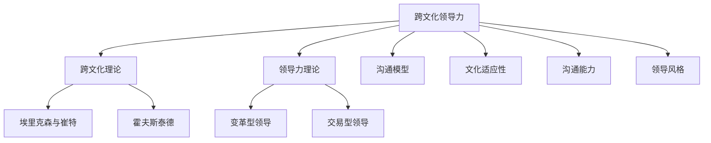

                 

# 跨文化领导力：在全球化环境中的成功之道

## 关键词
跨文化领导力、全球化、文化适应、领导力模型、国际企业、成功案例、策略与工具

## 摘要
在全球化不断推进的背景下，跨文化领导力成为企业和组织中不可或缺的能力。本文旨在探讨跨文化领导力的核心概念、实践方法、成功案例和策略工具，以帮助读者理解和掌握这一关键技能。首先，我们将回顾跨文化领导力的背景，然后深入分析核心概念与联系，通过具体案例解析成功和失败的原因，最后提出有效的策略与工具，为读者提供实用的指导。

## 引言
### 全球化背景下的跨文化挑战
随着全球化的加速，企业面对的文化多样性越来越显著。这不仅带来了市场机遇，也带来了领导力方面的挑战。跨文化领导力成为了企业能否在全球市场中立足的关键因素。

- **多元化工作团队的挑战**：团队成员来自不同文化背景，可能导致沟通障碍、合作困难和冲突。
- **跨国并购和文化整合**：企业在跨国并购过程中，如何整合不同文化成为关键问题。
- **全球市场战略的制定**：企业需要理解不同市场的文化特点，以制定更为有效的市场策略。

### 跨文化领导力的意义
跨文化领导力不仅有助于提升企业的国际竞争力，还能促进团队合作和创新。以下是其重要性：

- **促进团队协作**：通过理解和尊重不同文化，可以有效减少文化冲突，提高团队凝聚力。
- **提升决策质量**：跨文化领导力有助于从多角度思考问题，提高决策的科学性和全面性。
- **增强企业创新能力**：多元化团队能够带来不同的思维方式和创新理念，促进企业的持续创新。

## 核心概念与联系
### 跨文化理论与模型
#### 埃里克森与崔特的文化维度理论
埃里克森与崔特提出的文化维度理论，从权力距离、个体主义与集体主义、不明确性规避等六个维度分析了文化的差异。

- **权力距离**：指社会对权力分配公平性的接受程度。
- **个体主义与集体主义**：个体主义强调个人主义，集体主义强调集体利益。
- **不明确性规避**：指文化对不确定性容忍的程度。

#### 霍夫斯泰德的价值观维度理论
霍夫斯泰德提出四个主要价值观维度：个人主义与集体主义、权力距离、男性主义与女性主义、长期取向与短期取向。

- **个人主义与集体主义**：与埃里克森与崔特的理论相似，集体主义文化更强调整体性。
- **权力距离**：权力在社会结构中的分布。
- **男性主义与女性主义**：价值观的性别取向。
- **长期取向与短期取向**：对未来与即时的价值观态度。

#### 跨文化沟通模型
跨文化沟通模型强调了理解不同文化背景下的沟通方式。

- **信息传递**：不同文化对信息传递的方式有不同的偏好，如直接与间接沟通。
- **非语言沟通**：肢体语言、面部表情等非语言沟通在不同文化中的含义可能截然不同。
- **文化差异**：语言、习俗、宗教信仰等文化差异对沟通的影响。

### 领导力理论
#### 变革型领导与交易型领导
变革型领导强调领导者的远见和激励能力，而交易型领导则侧重于奖励和惩罚。

- **变革型领导**：通过激发团队成员的内在动机，推动团队实现创新和变革。
- **交易型领导**：通过明确的行为准则和奖惩制度来管理团队。

#### 跨文化领导力模型
跨文化领导力模型结合了跨文化理论与领导力理论，强调了领导者在多元文化环境中的角色。

- **文化适应性**：领导者需要具备适应不同文化的能力。
- **沟通能力**：领导者需要理解并使用有效的跨文化沟通技巧。
- **领导风格**：领导者应根据不同文化背景调整领导风格，以达到最佳效果。

#### 跨文化领导者的特质与能力
- **文化敏感性**：理解并尊重不同文化的差异。
- **跨文化沟通技巧**：能够有效地进行跨文化沟通。
- **适应能力**：在不同文化环境中迅速适应并有效工作。
- **领导能力**：能够激励并管理多元化团队。

## 方法论
### 跨文化领导力实践
#### 文化感知与适应策略
领导者需要通过以下策略来感知和适应不同文化：

- **文化学习**：通过阅读、课程、交流等方式，加深对目标文化的理解。
- **角色扮演**：模拟不同文化环境下的行为，以提高适应性。
- **反馈机制**：定期收集团队成员的反馈，了解自己在文化适应方面的表现。

#### 跨文化团队建设
建设有效的跨文化团队需要以下策略：

- **建立共同目标**：确保团队成员都理解并认同团队的目标。
- **促进沟通**：建立开放的沟通渠道，鼓励团队成员表达意见。
- **文化融合**：通过团队活动，促进不同文化之间的融合。

#### 跨文化冲突管理
冲突管理策略包括：

- **识别冲突源**：明确冲突的根本原因。
- **倾听与理解**：倾听不同文化的观点，增进理解。
- **协商与解决**：通过协商找到双方都能接受的解决方案。

### 领导力发展方法
#### 领导力培养体系
企业可以通过以下方法培养领导力：

- **培训与教育**：提供定期的领导力培训，提升领导者的知识和技能。
- **导师制**：通过导师指导，帮助领导者发展个人能力。
- **实践与反馈**：鼓励领导者参与实践项目，通过反馈不断改进。

#### 领导力评估与反馈
评估和反馈是领导力发展的重要环节：

- **360度评估**：通过多角度评估领导者的能力。
- **定期反馈**：定期与领导者进行一对一的反馈会议，帮助其改进。
- **发展计划**：根据评估结果，制定个人发展计划。

#### 领导力发展的持续学习
领导力发展是一个持续的过程：

- **持续学习**：鼓励领导者不断学习新知识，跟上时代变化。
- **职业规划**：帮助领导者规划职业发展路径，提升职业竞争力。
- **自我反思**：鼓励领导者定期进行自我反思，提升自我意识。

## 案例分析
### 成功的跨文化领导案例
#### 案例一：谷歌在全球化中的领导力实践
谷歌通过以下策略成功实现了跨文化领导：

- **文化多样性计划**：谷歌鼓励员工多元化和多样性，并通过多元化的项目组促进团队合作。
- **全球领导力培训**：谷歌提供全球领导力培训，帮助领导者理解不同文化。
- **跨文化沟通**：谷歌通过跨文化沟通工具，如国际会议和远程协作，提高全球团队的沟通效率。

#### 案例二：诺基亚的跨文化领导挑战与转型
诺基亚在面对全球市场挑战时，采取了以下措施：

- **文化适应策略**：诺基亚通过本土化策略，适应不同市场的文化需求。
- **领导力转型**：诺基亚通过领导力转型，提升领导者在全球市场中的竞争力。
- **国际化团队**：诺基亚建立了国际化团队，确保团队成员来自不同文化背景。

#### 案例三：华为的国际化之路
华为在国际化过程中展现了卓越的跨文化领导力：

- **本地化管理**：华为在不同市场采取本地化管理策略，尊重当地文化。
- **领导力发展**：华为通过领导力发展计划，提升领导者在全球市场中的适应能力。
- **全球化战略**：华为制定了全球化战略，确保在全球市场中的竞争力。

### 跨文化领导力失败的案例分析
#### 案例一：麦当劳在日本的失败
麦当劳在日本市场上的失败主要由于以下原因：

- **文化误解**：麦当劳没有充分理解日本文化，导致运营策略失败。
- **缺乏本地化**：麦当劳缺乏针对日本市场的本地化策略，未能适应当地消费者需求。
- **沟通障碍**：麦当劳在日本市场上的沟通策略失败，未能有效传达品牌信息。

#### 案例二：美国企业在中国市场的挑战
美国企业在中国的市场挑战主要源于：

- **文化冲突**：美国企业的管理方式与中国文化存在冲突，导致员工不满。
- **政策不了解**：美国企业对中国政策和法规了解不足，导致运营困难。
- **市场适应能力不足**：美国企业在中国市场上的本地化策略不足，未能适应中国市场特点。

#### 案例三：文化冲突下的企业重组案例
在文化冲突下，企业重组可能面临以下挑战：

- **文化差异**：不同文化背景的员工在企业重组过程中可能产生冲突。
- **领导力不足**：缺乏跨文化领导力，可能导致重组过程中出现沟通和协调问题。
- **管理混乱**：文化冲突可能导致企业管理混乱，影响重组效果。

## 策略与工具
### 跨文化领导力培训策略
企业可以通过以下策略提升跨文化领导力：

- **定制化培训计划**：根据企业特点和需求，设计定制化的跨文化领导力培训计划。
- **多元化培训方法**：结合线上与线下培训，提供多样化的培训方式。
- **实践与反思**：通过实践项目和反思会议，提升领导者的实际能力。

### 跨文化领导力工具箱
企业可以使用以下工具来提升跨文化领导力：

- **文化适应量表**：评估领导者对不同文化的适应程度。
- **跨文化沟通技巧**：提供有效的跨文化沟通技巧培训。
- **领导力发展工具**：如360度评估、导师制等，帮助领导者发展个人能力。

## 结论
### 跨文化领导力的未来趋势
随着全球化的不断深入，跨文化领导力将在未来变得更加重要。以下是其发展趋势：

- **数字化领导力**：随着数字化技术的发展，跨文化领导力将更加依赖数字工具和平台。
- **个性化领导**：领导者将更加注重个性化领导，根据团队成员的不同文化背景进行管理。
- **全球化与本地化融合**：企业将在全球化和本地化之间找到更好的平衡，以适应不同市场的需求。

### 企业如何构建有效的跨文化领导力
企业可以通过以下方法构建有效的跨文化领导力：

- **建立跨文化团队**：通过多元化招聘，建立具有不同文化背景的团队。
- **提供跨文化培训**：定期提供跨文化领导力培训，提升领导者的能力。
- **鼓励文化学习**：鼓励领导者和文化多元性团队成员进行文化学习和交流。
- **建立跨文化沟通机制**：建立有效的跨文化沟通机制，确保团队之间的有效沟通。

### 个人跨文化领导力发展建议
个人可以通过以下方法提升跨文化领导力：

- **主动学习**：通过阅读、课程和实践，主动学习跨文化知识。
- **反思与总结**：在跨文化实践过程中，不断反思和总结经验。
- **建立人际关系网**：与来自不同文化背景的人建立良好的关系，以增强跨文化沟通能力。
- **积极参与跨文化项目**：主动参与跨文化项目，提升实际操作能力。

## 附录
### 7.1 参考文献
- Hofstede, G. (1980). Culture's consequences: International differences in work-related values. Sage Publications.
- Trompenaars, F., & Hampden-Turner, C. (1998). Riding the Waves of Culture: Understanding Cultural Diversity in Global Business. McGraw-Hill.
- Erhard, L. (2006). Leading Across Cultures: Global Perspectives, Insights and Strategies for Succeeding Across Borders. Pearson Education.

### 7.2 进一步阅读材料
- Kim, H. (2013). Global leadership: The next agenda. Wiley-Blackwell.
- Northouse, P. G. (2018). Leadership: Theory and Practice (8th ed.). Sage Publications.

### 7.3 跨文化领导力实践指南
- **文化适应量表**：使用霍夫斯泰德的文化维度量表，评估自身对目标文化的适应程度。
- **跨文化沟通技巧**：学习非语言沟通技巧，如肢体语言、面部表情等，提高跨文化沟通效果。
- **领导力发展工具**：使用360度评估和导师制，不断提升个人领导力。

### 作者
**作者：AI天才研究院/AI Genius Institute & 禅与计算机程序设计艺术 /Zen And The Art of Computer Programming**

## 背景介绍

在当今全球化的时代，跨文化领导力的重要性愈发凸显。全球化不仅带来了市场的扩展，也带来了文化的交融和碰撞。企业需要在全球范围内运营，这意味着领导者必须具备跨文化沟通、适应和管理的技能，以便在多元文化环境中取得成功。跨文化领导力不仅仅是一个企业的战略需求，更是领导者个人发展的必备素质。

### 跨文化领导力的定义

跨文化领导力是指领导者在不同文化背景下，通过有效的沟通、管理、决策和激励，引导和影响团队成员，实现组织目标的能力。这种能力不仅要求领导者具备深厚的文化知识和敏感度，还需要他们在实际工作中能够灵活应用这些知识，以实现高效领导。

### 跨文化领导力的要素

跨文化领导力包括以下几个关键要素：

1. **文化适应能力**：领导者需要能够快速适应不同文化环境，理解并尊重当地的文化习俗和价值观。
2. **沟通技巧**：有效的跨文化沟通是跨文化领导力的核心，领导者需要掌握不同文化背景下的沟通方式，以避免误解和冲突。
3. **团队建设**：在多元文化团队中，领导者需要建立共同目标，促进团队成员之间的合作与沟通。
4. **冲突管理**：跨文化团队中难免出现冲突，领导者需要具备有效的冲突管理能力，以化解潜在的矛盾。
5. **领导风格**：领导者需要根据不同文化背景调整领导风格，以适应团队成员的需求和期望。

### 跨文化领导力的重要性

1. **提升团队绩效**：跨文化领导力有助于提升团队绩效，通过有效的沟通和团队合作，实现组织目标。
2. **增强创新能力**：多元文化的团队能够带来不同的思维方式和创新理念，促进企业的持续创新。
3. **提高员工满意度**：尊重和理解不同文化的领导者能够提高员工的满意度，减少员工流失率。
4. **增强企业竞争力**：在全球市场中，具备跨文化领导力的企业能够更好地适应不同市场的需求，提高竞争力。

### 当前跨文化领导力面临的主要挑战

1. **文化差异**：不同文化之间存在显著的差异，可能导致误解和冲突。
2. **沟通障碍**：跨文化沟通中的语言、非语言和行为差异可能导致沟通不畅。
3. **领导风格差异**：不同文化背景下的领导风格可能存在较大差异，领导者需要适应并调整。
4. **政策法规**：不同国家和地区的政策法规可能对企业运营产生影响，领导者需要了解并遵守。
5. **市场环境**：全球市场的动态变化对领导者提出了更高的要求，需要具备快速适应和调整能力。

综上所述，跨文化领导力在全球化背景下具有重要意义。领导者需要不断提升自身的跨文化能力，以应对全球化带来的挑战和机遇。本文将进一步探讨跨文化领导力的核心概念、方法论、成功案例和策略工具，为读者提供实用的指导。

## 核心概念与联系

在深入探讨跨文化领导力之前，我们需要理解其核心概念与联系。跨文化领导力不仅涉及到领导力本身的内涵，还包括对文化的深刻认知和适应。以下将详细讨论跨文化理论与模型、领导力理论，并通过Mermaid流程图展示核心概念之间的联系。

### 跨文化理论与模型

#### 埃里克森与崔特的文化维度理论

埃里克森与崔特的文化维度理论是一种广泛接受的文化分类模型，该理论从权力距离、个体主义与集体主义、不明确性规避等六个维度分析了文化的差异。

- **权力距离**：指社会对权力分配公平性的接受程度。高权力距离的文化（如某些亚洲国家）倾向于权力集中和等级制度，而低权力距离的文化（如北欧国家）更倾向于平等和民主。
- **个体主义与集体主义**：个体主义强调个人主义，集体主义强调集体利益。在个体主义文化中（如美国），个人自主性和独立性受到重视，而在集体主义文化中（如日本），团队协作和集体利益更为重要。
- **不明确性规避**：指文化对不确定性的容忍程度。低不明确性规避的文化（如美国）倾向于追求明确性和确定性，而高不明确性规避的文化（如阿拉伯国家）则更愿意接受不确定性和模糊性。

#### 霍夫斯泰德的价值观维度理论

霍夫斯泰德提出四个主要价值观维度：个人主义与集体主义、权力距离、男性主义与女性主义、长期取向与短期取向。

- **个人主义与集体主义**：与埃里克森与崔特的理论相似，集体主义文化更强调整体性，而个人主义文化更强调个人自主性。
- **权力距离**：权力在社会结构中的分布。
- **男性主义与女性主义**：价值观的性别取向。男性主义文化强调成就、竞争和权力，而女性主义文化强调人际和谐、关怀和合作。
- **长期取向与短期取向**：对未来与即时的价值观态度。长期取向的文化（如日本）倾向于长远规划和延迟满足，而短期取向的文化（如美国）更注重即时的满足和享受。

#### 跨文化沟通模型

跨文化沟通模型强调了理解不同文化背景下的沟通方式。

- **信息传递**：不同文化对信息传递的方式有不同的偏好，如直接与间接沟通。
- **非语言沟通**：肢体语言、面部表情等非语言沟通在不同文化中的含义可能截然不同。
- **文化差异**：语言、习俗、宗教信仰等文化差异对沟通的影响。

### 领导力理论

#### 变革型领导与交易型领导

变革型领导强调领导者的远见和激励能力，而交易型领导则侧重于奖励和惩罚。

- **变革型领导**：通过激发团队成员的内在动机，推动团队实现创新和变革。
- **交易型领导**：通过明确的行为准则和奖惩制度来管理团队。

#### 跨文化领导力模型

跨文化领导力模型结合了跨文化理论与领导力理论，强调了领导者在多元文化环境中的角色。

- **文化适应性**：领导者需要具备适应不同文化的能力。
- **沟通能力**：领导者需要理解并使用有效的跨文化沟通技巧。
- **领导风格**：领导者应根据不同文化背景调整领导风格，以达到最佳效果。

### 跨文化领导力的核心概念与联系

为了更好地理解跨文化领导力的核心概念与联系，我们可以使用Mermaid流程图来展示这些概念之间的关系。以下是一个简化的Mermaid流程图示例：

在这个流程图中，A代表跨文化领导力，它通过不同的分支与跨文化理论（B）、领导力理论（E）和沟通模型（H）相连接。每个分支又进一步连接到具体的理论或概念，如埃里克森与崔特的文化维度理论（C）、霍夫斯泰德的价值观维度理论（D）、变革型领导（F）和交易型领导（G）等。这种结构清晰地展示了跨文化领导力的核心概念与联系，帮助我们更好地理解这一复杂领域。

通过这种Mermaid流程图，我们可以更直观地看到跨文化领导力如何综合各种理论和模型，形成一个完整的体系。这为领导者提供了系统的理论框架，帮助他们更好地应对全球化带来的挑战。

## 方法论

在探讨跨文化领导力的方法论时，我们需要理解领导者在跨文化环境中的实际操作步骤和策略。以下将详细讨论跨文化领导力的实践方法，包括文化感知与适应策略、跨文化团队建设以及跨文化冲突管理。

### 文化感知与适应策略

#### 文化学习

文化学习是跨文化领导力的基础。领导者需要通过多种途径深入了解目标文化的价值观、习俗、沟通方式等。以下是一些有效的文化学习策略：

1. **阅读文化资料**：通过阅读相关书籍、研究报告和文化指南，了解目标文化的背景和特点。
2. **参加文化课程**：报名参加跨文化培训课程，通过专家的讲解和案例分析，提高对文化差异的认识。
3. **文化交流**：参与文化交流活动，与来自不同文化背景的人直接交流，了解他们的生活和工作方式。

#### 角色扮演

角色扮演是一种有效的文化适应策略，通过模拟不同文化环境下的行为，领导者可以更好地理解文化差异，并提高自身的适应能力。以下是一些角色扮演的实践方法：

1. **模拟情境**：设计不同的文化情境，领导者扮演不同的角色，体验文化差异带来的影响。
2. **反馈与改进**：在角色扮演后，领导者可以反思自己的行为，并从他人的反馈中获取改进建议。

#### 反馈机制

定期收集团队成员的反馈是文化感知与适应的重要手段。以下是一些反馈机制的实践方法：

1. **定期会议**：定期组织团队会议，听取团队成员对文化适应的建议和意见。
2. **匿名反馈**：提供匿名反馈渠道，鼓励团队成员坦诚表达他们的感受和困惑。
3. **行动改进**：根据反馈结果，制定具体的行动计划，以改进文化适应策略。

### 跨文化团队建设

#### 建立共同目标

在跨文化团队中，建立共同目标是团队建设的关键。以下是一些实践方法：

1. **明确目标**：确保所有团队成员都清楚团队的目标和期望，并理解这些目标与个人目标的关系。
2. **共识达成**：通过讨论和协商，达成团队目标的共识，确保团队成员都认同并愿意为之努力。
3. **目标跟踪**：定期检查团队目标的实现情况，及时调整策略和行动，以确保目标的达成。

#### 促进沟通

有效的沟通是跨文化团队成功的关键。以下是一些促进沟通的方法：

1. **开放沟通**：鼓励团队成员自由表达意见和想法，建立开放的沟通氛围。
2. **明确信息**：在沟通时，确保信息表达清晰、明确，避免歧义和误解。
3. **跨文化沟通技巧**：领导者需要具备跨文化沟通技巧，能够理解和尊重不同文化的沟通方式。

#### 文化融合

文化融合是通过各种活动，促进不同文化背景的团队成员之间的相互理解和尊重。以下是一些文化融合的方法：

1. **团队建设活动**：组织团队建设活动，如户外拓展、文化体验等，增强团队成员之间的互动和合作。
2. **文化交流活动**：定期举办文化交流活动，如文化展示、庆祝活动等，让团队成员了解和体验不同文化的魅力。
3. **跨文化培训**：为团队成员提供跨文化培训，提高他们的文化适应能力和沟通技巧。

### 跨文化冲突管理

#### 识别冲突源

有效管理跨文化冲突的第一步是识别冲突源。以下是一些识别冲突源的实践方法：

1. **观察行为**：通过观察团队成员的行为，识别潜在的冲突源，如沟通障碍、文化误解等。
2. **倾听声音**：定期与团队成员交流，倾听他们的心声，了解他们面临的挑战和困惑。
3. **调查问卷**：通过调查问卷，收集团队成员对团队运作和文化适应的反馈，识别冲突源。

#### 倾听与理解

倾听和理解是解决跨文化冲突的重要步骤。以下是一些倾听与理解的实践方法：

1. **开放心态**：领导者需要保持开放的心态，愿意倾听不同文化的观点，增进理解。
2. **同理心**：尝试站在对方的角度思考问题，理解他们的文化背景和立场。
3. **提问与澄清**：通过提问和澄清，确保自己对对方观点的理解是正确的。

#### 协商与解决

协商与解决是解决跨文化冲突的核心。以下是一些协商与解决的方法：

1. **多方参与**：在解决冲突时，确保所有相关方都参与其中，包括受冲突影响的团队成员。
2. **协商策略**：采用协商策略，通过讨论和妥协，找到双方都能接受的解决方案。
3. **反馈与确认**：在冲突解决后，及时给予反馈，确认解决方案的实施效果，并根据反馈进行必要的调整。

通过上述方法，跨文化领导者可以有效地管理跨文化团队，提高团队的凝聚力和工作效率，实现组织的战略目标。

### 领导力发展方法

在跨文化领导力的培养过程中，领导力发展方法扮演着至关重要的角色。以下将详细探讨企业如何通过培训与教育、导师制、实践与反馈等方式，提升领导者的跨文化领导力。

#### 培训与教育

有效的培训与教育是提升领导者跨文化领导力的关键。企业可以通过以下方法进行跨文化领导力培训：

1. **内部培训**：企业可以内部开展跨文化领导力培训课程，邀请专业讲师进行讲解，内容涵盖文化差异、跨文化沟通技巧、冲突管理等。
2. **外部培训**：领导者可以参加外部专业机构的跨文化领导力培训，如国际知名管理学院提供的跨文化领导力课程。
3. **在线学习**：企业可以利用在线学习平台，提供丰富的跨文化领导力学习资源，如视频讲座、电子书籍等。

#### 导师制

导师制是一种有效的领导力发展方法，通过导师的指导，领导者可以快速提升自身的跨文化领导能力。以下是一些具体的实施方法：

1. **内部导师**：企业可以指定有经验的领导者作为导师，为新晋升的领导者提供指导和支持。
2. **外部导师**：企业可以聘请外部专家或顾问作为导师，提供专业知识和实践经验。
3. **导师与学员的匹配**：根据领导者的个人需求和职业发展目标，为企业与导师之间的匹配提供指导，确保导师能够针对性地提供指导。

#### 实践与反馈

通过实践与反馈，领导者可以将理论知识应用到实际工作中，不断改进和提升自身的跨文化领导力。以下是一些实践与反馈的方法：

1. **实践项目**：企业可以设计跨文化领导力实践项目，让领导者在实际工作中应用所学知识，如跨文化团队管理、国际项目协调等。
2. **定期反馈**：领导者可以定期与上级、导师和团队成员进行一对一的反馈会议，了解自己的表现和改进方向。
3. **360度评估**：通过360度评估，收集来自上级、下属、同事和外部专家的反馈，全面了解领导者的跨文化领导力水平。

#### 持续学习

跨文化领导力的发展是一个持续的过程，领导者需要不断学习和适应。以下是一些持续学习的方法：

1. **自我反思**：领导者需要定期进行自我反思，总结经验教训，找出改进点。
2. **行业交流**：参加行业会议、论坛等活动，与同行交流，了解最新的跨文化领导力实践和趋势。
3. **跨文化学习**：领导者可以主动学习目标市场的文化知识，提高对目标文化的理解和适应能力。

通过上述方法，企业可以系统地培养领导者的跨文化领导力，帮助他们在全球化环境中取得成功。

### 跨文化领导力评估与反馈

在跨文化领导力的培养过程中，有效的评估与反馈机制至关重要。这不仅能够帮助领导者了解自身的表现，还能够为他们提供改进的方向。以下将详细探讨如何通过360度评估、定期反馈和发展计划，评估和提升领导者的跨文化领导力。

#### 360度评估

360度评估是一种全面、多角度的评估方法，通过收集来自上级、下属、同事和外部专家的反馈，为领导者提供全面的评估结果。以下是实施360度评估的步骤：

1. **评估指标**：制定明确的评估指标，涵盖跨文化领导力的各个方面，如文化敏感性、沟通能力、团队建设、冲突管理等。
2. **反馈收集**：通过问卷、访谈等形式，收集来自不同角度的反馈。确保反馈过程匿名，以保障反馈的真实性和有效性。
3. **数据分析**：对收集到的反馈进行数据分析，识别领导者在跨文化领导力方面的优点和不足。
4. **评估报告**：根据数据分析结果，生成评估报告，为领导者提供详细的评估结果和建议。

#### 定期反馈

定期反馈是跨文化领导力培养的重要环节，通过持续、及时的反馈，领导者可以及时了解自己的表现和改进方向。以下是实施定期反馈的方法：

1. **定期会议**：定期组织反馈会议，领导者可以与上级、导师和团队成员面对面交流，了解他们的看法和建议。
2. **开放式沟通**：在反馈会议中，鼓励领导者开放地表达自己的想法和困惑，确保沟通渠道的畅通。
3. **行为改进**：根据反馈结果，制定具体的行动计划，以改进领导行为。确保行动计划的实施和跟踪，以评估改进效果。

#### 发展计划

为了进一步提升领导者的跨文化领导力，制定个人发展计划至关重要。以下是制定发展计划的步骤：

1. **个人目标**：根据评估结果，设定具体的个人发展目标，如提高文化敏感性、提升沟通能力等。
2. **培训与学习**：根据个人目标，制定相应的培训和学习计划，如参加跨文化领导力课程、阅读相关书籍等。
3. **实践机会**：提供跨文化实践机会，如国际项目协调、跨文化团队管理等，帮助领导者将所学知识应用到实际工作中。
4. **跟踪与评估**：定期跟踪和评估发展计划的实施情况，根据反馈进行必要的调整。

#### 持续学习

跨文化领导力是一个不断发展的过程，领导者需要持续学习和适应。以下是持续学习的方法：

1. **自我反思**：定期进行自我反思，总结经验教训，找出改进点。
2. **行业交流**：参加行业会议、论坛等活动，与同行交流，了解最新的跨文化领导力实践和趋势。
3. **跨文化学习**：主动学习目标市场的文化知识，提高对目标文化的理解和适应能力。

通过有效的评估与反馈机制，企业可以系统地培养和提升领导者的跨文化领导力，帮助他们在全球化环境中取得成功。

### 跨文化领导力的未来趋势

随着全球化的不断深入，跨文化领导力的重要性将愈发凸显。未来，跨文化领导力将呈现出以下几大趋势：

#### 数字化领导力

数字化技术的发展为跨文化领导力带来了新的机遇和挑战。领导者需要掌握数字工具和平台，以提高跨文化沟通和协作的效率。例如，通过视频会议、即时通讯工具和协作平台，领导者可以更便捷地与全球团队成员保持联系，推动项目进展。

#### 个性化领导

在多元化团队中，领导者需要更加关注个体差异，采取个性化领导方式。这意味着领导者需要根据团队成员的不同文化背景、工作风格和需求，制定个性化的管理策略。例如，针对不同文化背景的员工，领导者可以提供定制化的培训和发展计划，以提高他们的工作满意度和绩效。

#### 全球化与本地化融合

在全球化背景下，企业需要在全球化战略与本地化策略之间找到平衡。全球化战略关注企业整体的战略目标和资源配置，而本地化策略则关注如何根据当地市场和文化特点进行调整。未来，领导者需要具备全球化视野和本地化操作能力，以适应不同市场的需求。

#### 跨文化领导力的专业化

随着跨文化领导力的需求不断增加，相关培训和认证体系也将逐渐完善。未来，企业可能会更加重视跨文化领导力的专业化，通过系统的培训和认证，提升领导者的专业能力和素养。

### 企业如何构建有效的跨文化领导力

为了在全球市场中取得成功，企业需要构建有效的跨文化领导力。以下是一些建议：

#### 建立多元化团队

企业可以通过多元化招聘，建立具有不同文化背景的团队。多元化团队不仅能够带来不同的思维方式和创新理念，还能帮助企业更好地适应全球市场。

#### 提供跨文化培训

企业应定期提供跨文化领导力培训，帮助领导者了解不同文化的特点和沟通方式。培训内容可以包括文化差异、跨文化沟通技巧、国际市场战略等。

#### 鼓励文化学习

企业应鼓励领导者和文化多元性团队成员进行文化学习。通过阅读书籍、参加课程和实践项目，领导者可以不断提升对目标文化的理解和适应能力。

#### 建立有效的沟通机制

企业需要建立开放的沟通机制，确保团队成员之间的有效沟通。通过定期的团队会议、反馈会议和跨文化交流活动，领导者可以及时了解团队成员的需求和困惑，并提供帮助和支持。

#### 鼓励跨文化合作

企业应鼓励跨文化合作，通过跨文化项目和国际合作，促进团队成员之间的相互了解和信任。跨文化合作不仅能够提高团队绩效，还能培养领导者的跨文化领导力。

### 个人跨文化领导力发展建议

个人在提升跨文化领导力时，可以采取以下策略：

#### 主动学习

个人可以通过阅读相关书籍、参加培训课程和实践项目，主动学习跨文化知识和技能。此外，可以参加国际交流活动，与来自不同文化背景的人直接交流，提高自身的跨文化适应能力。

#### 反思与总结

个人应在跨文化实践中不断反思和总结经验。通过分析成功和失败的原因，找到改进的方向。此外，可以定期撰写反思日志，记录自己的学习和成长过程。

#### 建立人际关系网

个人应积极建立人际关系网，与来自不同文化背景的人建立良好的关系。这不仅有助于跨文化沟通，还能提供宝贵的信息和资源。

#### 参与跨文化项目

个人应主动参与跨文化项目，将所学知识应用到实际工作中。通过实践，个人可以不断提升自身的跨文化领导力，为企业的全球化发展贡献力量。

### 总结

跨文化领导力在全球化环境中具有重要意义。通过理解跨文化理论、掌握领导力模型、实施有效的策略和工具，领导者可以更好地管理多元文化团队，实现组织目标。未来，随着全球化的深入，跨文化领导力将面临新的挑战和机遇。企业和个人都应积极应对，不断提升自身的跨文化领导力，以在全球市场中取得成功。

### 附录

#### 7.1 参考文献

- Hofstede, G. (1980). Culture's consequences: International differences in work-related values. Sage Publications.
- Trompenaars, F., & Hampden-Turner, C. (1998). Riding the Waves of Culture: Understanding Cultural Diversity in Global Business. McGraw-Hill.
- Erhard, L. (2006). Leading Across Cultures: Global Perspectives, Insights and Strategies for Succeeding Across Borders. Pearson Education.

#### 7.2 进一步阅读材料

- Kim, H. (2013). Global leadership: The next agenda. Wiley-Blackwell.
- Northouse, P. G. (2018). Leadership: Theory and Practice (8th ed.). Sage Publications.

#### 7.3 跨文化领导力实践指南

- **文化适应量表**：使用霍夫斯泰德的文化维度量表，评估自身对目标文化的适应程度。
- **跨文化沟通技巧**：学习非语言沟通技巧，如肢体语言、面部表情等，提高跨文化沟通效果。
- **领导力发展工具**：使用360度评估和导师制，不断提升个人领导力。

### 作者

**作者：AI天才研究院/AI Genius Institute & 禅与计算机程序设计艺术 /Zen And The Art of Computer Programming**

