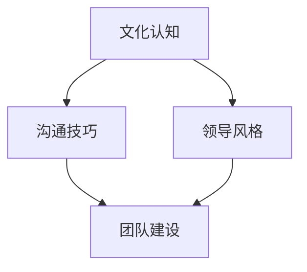

                 


### 文章标题：跨文化领导力：管理全球化团队的技巧

#### 关键词：跨文化领导力，全球化团队，管理策略，文化适应，领导风格

#### 摘要：
随着全球化的深入发展，企业越来越重视跨文化领导力，以有效管理多元化团队。本文将深入探讨跨文化领导力的核心概念、管理策略以及实践技巧，旨在为读者提供一套系统的指导，帮助他们在全球化背景下提升领导力。

## 第1章：跨文化领导力概述

### 1.1 跨文化领导力的重要性

**背景介绍**：
在全球化的今天，跨国企业越来越多，团队成员来自不同的国家，拥有不同的文化背景。跨文化领导力因此成为企业成功的关键因素之一。

**核心概念与联系**：
跨文化领导力不仅仅是理解不同文化，更涉及到如何在不同文化背景下有效领导和激励团队。以下是一个简化的 Mermaid 流程图，展示了跨文化领导力的核心概念和它们之间的联系：



**全球团队构成**：
全球化团队通常由以下几部分构成：
- **本地团队**：主要成员来自公司总部所在国家。
- **海外团队**：成员来自其他国家和地区。
- **虚拟团队**：通过互联网协作，成员可能分布在全球各地。

## 第2章：跨文化知识

### 2.1 文化多样性概述

**核心算法原理讲解**：
文化多样性可以通过以下伪代码进行抽象：

```python
def cultural_diversity(team_members):
    cultural Differences = []
    for member in team_members:
        cultural Differences.append(member.culture)
    return cultural_Differences
```

**文化识别与理解**：
为了更好地识别和理解不同文化，领导者需要采取以下步骤：
- **调查文化背景**：了解团队成员的文化背景，包括价值观、习俗、语言等。
- **建立文化图谱**：创建一个文化图谱，帮助团队成员了解彼此的文化差异。

### 2.2 跨文化沟通技巧

**核心算法原理讲解**：
跨文化沟通可以通过以下算法来优化：

```python
def effective_communication(message, culture):
    message = translate_to_culture(message, culture)
    message = adapt_tone_to_culture(message, culture)
    return message
```

**有效沟通策略**：
为了实现有效的跨文化沟通，领导者可以采取以下策略：
- **主动倾听**：在沟通过程中，积极倾听对方的观点和感受。
- **避免误解**：通过明确表达和确认理解，减少误解的发生。
- **建立信任**：通过共同目标和价值观的建立，增强团队内部的信任。

## 第3章：跨文化管理策略

### 3.1 文化适应与融合

**文化适应**：
文化适应是指领导者如何帮助团队成员适应新的文化环境。以下是一个简化的伪代码，展示了文化适应的策略：

```python
def cultural_adaptation(team_member, new_culture):
    team_member.learn_culture(new_culture)
    team_member.practice_culture(new_culture)
    return team_member
```

**文化融合**：
文化融合是指如何将不同的文化整合到一个团队中。以下是一个简化的数学模型，展示了文化融合的过程：

$$
\text{文化融合} = \frac{\sum_{i=1}^{n} \text{文化贡献}}{n}
$$

其中，$n$ 是团队成员的数量，每个团队成员的文化贡献取决于他们的文化适应度和参与度。

## 第4章：全球化项目管理

### 4.1 项目管理框架

**核心算法原理讲解**：
项目管理可以通过以下算法进行优化：

```python
def project_management(project, team):
    project.plan_project()
    project.execute_project()
    project.monitor_project()
    project.review_project()
    return project.success
```

**项目管理方法**：
为了实现有效的项目管理，领导者可以采取以下方法：
- **项目计划**：明确项目目标、时间表和资源分配。
- **执行监控**：确保项目按照计划进行，及时调整计划。
- **项目评估**：项目完成后进行评估，总结经验教训。

### 第5章：个人成长与领导力提升

### 5.1 自我认知与反思

**核心算法原理讲解**：
自我认知可以通过以下算法进行：

```python
def self_awareness():
    reflections = []
    for experience in experiences:
        reflections.append(reflect_on_experience(experience))
    return reflections
```

**反思与改进**：
领导者需要定期进行反思，以识别自身的不足和改进方向。以下是一个简化的模型：

$$
\text{反思} = \frac{\sum_{i=1}^{n} \text{经验反思}}{n}
$$

其中，$n$ 是领导者的经验数量。

## 总结

跨文化领导力是企业全球化发展的关键。领导者需要深入了解跨文化知识，掌握有效的沟通技巧和管理策略，同时不断进行自我反思和提升。通过本文的讨论，我们希望为读者提供一套系统的跨文化领导力实践指南。作者：AI天才研究院/AI Genius Institute & 禅与计算机程序设计艺术 /Zen And The Art of Computer Programming。

