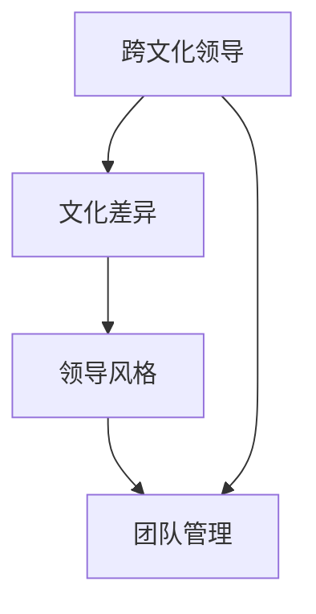

                 

### 文章标题

# 跨文化领导：全球化时代的必备技能

> 关键词：跨文化领导、全球化、领导力、文化差异、沟通技巧

> 摘要：本文深入探讨了跨文化领导在全球化时代的重要性，分析了跨文化领导的核心概念、理论框架和实际应用。文章通过详细的案例分析和策略建议，为领导者提供了在多元文化环境中提升领导力的实用指南。

## 设计《跨文化领导：全球化时代的必备技能》书籍目录大纲

### 第一步：确定整体结构和核心内容

1. **引言**：介绍跨文化领导的重要性及本书目的。
2. **核心概念与联系**：通过Mermaid流程图展示跨文化领导的核心概念和它们之间的联系。
3. **跨文化领导理论**：详细讲解跨文化领导的理论基础，包括相关模型和框架。
4. **文化差异分析**：探讨不同文化之间的差异，以及这些差异如何影响领导行为。
5. **跨文化沟通技巧**：介绍有效的跨文化沟通方法和策略。
6. **跨文化团队管理**：讨论如何管理多元化的团队，包括团队构建和冲突解决。
7. **跨文化领导实践**：提供跨文化领导的实际案例，分析成功和失败的经验。
8. **跨文化领导者的自我发展**：探讨领导者如何提升自身的跨文化能力。
9. **结论与展望**：总结全书内容，并对未来跨文化领导的发展趋势进行展望。
10. **参考文献**：列出本书引用的主要参考文献。

### 第二步：细化各章节内容

**第1章: 引言**

- **1.1 引言**
  - 跨文化领导的重要性
  - 全球化时代对领导者的需求
  - 本书的目的和结构

**第2章: 核心概念与联系**

- **2.1 跨文化领导的概念**
  - 定义
  - 特点
- **2.2 跨文化领导与全球化**
  - 全球化对领导的影响
  - 跨文化领导在全球化中的角色
- **2.3 Mermaid流程图展示核心概念联系**
  - 使用的Mermaid流程图

**第3章: 跨文化领导理论**

- **3.1 跨文化领导理论基础**
  - 主要理论模型
  - 文化维度理论
- **3.2 跨文化领导框架**
  - 领导风格适应模型
  - 多元文化团队管理框架

**第4章: 文化差异分析**

- **4.1 文化差异的类型**
  - 国别文化差异
  - 组织文化差异
- **4.2 文化差异对领导行为的影响**
  - 案例分析
  - 理论解析

**第5章: 跨文化沟通技巧**

- **5.1 跨文化沟通的原则**
  - 尊重与理解
  - 明确与简洁
  - 谦虚与开放
- **5.2 跨文化沟通的策略**
  - 倾听与反馈
  - 非言语沟通
  - 文化敏感性培训

**第6章: 跨文化团队管理**

- **6.1 多元化团队的构建**
  - 团队组建策略
  - 多元文化团队的挑战
- **6.2 团队冲突的解决**
  - 冲突类型
  - 解决策略
- **6.3 跨文化领导者的角色**
  - 引导与协调
  - 激励与支持

**第7章: 跨文化领导实践**

- **7.1 跨文化领导案例研究**
  - 成功案例分析
  - 失败案例分析
- **7.2 跨文化领导的经验教训**
  - 成功要素
  - 改进策略

**第8章: 跨文化领导者的自我发展**

- **8.1 自我认知与反思**
  - 自我评估工具
  - 反思与改进
- **8.2 跨文化能力提升**
  - 学习与培训
  - 经验分享与网络建设

**第9章: 结论与展望**

- **9.1 全书总结**
  - 跨文化领导的核心观点
  - 对领导者的建议
- **9.2 未来发展趋势**
  - 全球化对跨文化领导的影响
  - 新兴技术与跨文化领导

### 第三步：确保大纲简洁且完整

- 在2000字的限制内，确保大纲内容的简洁性，同时保证大纲的完整性。
- 根据实际需要，可以在某些章节中加入更多的细节，但总体结构要保持清晰。

### 最终输出

根据上述设计，以下是《跨文化领导：全球化时代的必备技能》的目录大纲：

```
# 《跨文化领导：全球化时代的必备技能》书籍目录大纲

## 第1章 引言
### 1.1 跨文化领导的重要性
### 1.2 全球化时代对领导者的需求
### 1.3 本书的目的和结构

## 第2章 核心概念与联系
### 2.1 跨文化领导的概念
#### 2.1.1 定义
#### 2.1.2 特点
### 2.2 跨文化领导与全球化
#### 2.2.1 全球化对领导的影响
#### 2.2.2 跨文化领导在全球化中的角色
### 2.3 Mermaid流程图展示核心概念联系

## 第3章 跨文化领导理论
### 3.1 跨文化领导理论基础
#### 3.1.1 主要理论模型
#### 3.1.2 文化维度理论
### 3.2 跨文化领导框架
#### 3.2.1 领导风格适应模型
#### 3.2.2 多元文化团队管理框架

## 第4章 文化差异分析
### 4.1 文化差异的类型
#### 4.1.1 国别文化差异
#### 4.1.2 组织文化差异
### 4.2 文化差异对领导行为的影响
#### 4.2.1 案例分析
#### 4.2.2 理论解析

## 第5章 跨文化沟通技巧
### 5.1 跨文化沟通的原则
#### 5.1.1 尊重与理解
#### 5.1.2 明确与简洁
#### 5.1.3 谦虚与开放
### 5.2 跨文化沟通的策略
#### 5.2.1 倾听与反馈
#### 5.2.2 非言语沟通
#### 5.2.3 文化敏感性培训

## 第6章 跨文化团队管理
### 6.1 多元化团队的构建
#### 6.1.1 团队组建策略
#### 6.1.2 多元文化团队的挑战
### 6.2 团队冲突的解决
#### 6.2.1 冲突类型
#### 6.2.2 解决策略
### 6.3 跨文化领导者的角色
#### 6.3.1 引导与协调
#### 6.3.2 激励与支持

## 第7章 跨文化领导实践
### 7.1 跨文化领导案例研究
#### 7.1.1 成功案例分析
#### 7.1.2 失败案例分析
### 7.2 跨文化领导的经验教训
#### 7.2.1 成功要素
#### 7.2.2 改进策略

## 第8章 跨文化领导者的自我发展
### 8.1 自我认知与反思
#### 8.1.1 自我评估工具
#### 8.1.2 反思与改进
### 8.2 跨文化能力提升
#### 8.2.1 学习与培训
#### 8.2.2 经验分享与网络建设

## 第9章 结论与展望
### 9.1 全书总结
#### 9.1.1 跨文化领导的核心观点
#### 9.1.2 对领导者的建议
### 9.2 未来发展趋势
#### 9.2.1 全球化对跨文化领导的影响
#### 9.2.2 新兴技术与跨文化领导
```

### 背景介绍

在当今全球化时代，企业组织越来越多元化和国际化，跨文化领导变得至关重要。跨文化领导不仅仅涉及不同国家和地区的文化差异，还包括来自不同组织背景、教育程度和职业经验的员工之间的沟通与协作。这种多元文化的环境对领导者的要求日益提高，他们需要具备更高的适应性、沟通能力和团队管理技巧。

### 核心概念与联系

为了更好地理解跨文化领导，我们需要明确一些核心概念，并分析它们之间的联系。以下是几个关键概念及其相互关系：

1. **跨文化领导**：指在多元文化背景下，领导者如何引导和激励团队，实现组织目标。
2. **文化差异**：不同国家和地区在价值观、沟通方式、工作习惯等方面的差异。
3. **领导风格**：领导者在不同文化背景下采取的领导方式，如权威型、民主型、参与型等。
4. **团队管理**：在多元文化团队中，如何有效地组织、协调和激励团队成员。

这些概念之间的联系可以用Mermaid流程图表示：



### 核心算法原理讲解

跨文化领导的核心算法原理主要包括以下几个部分：

1. **文化适应模型**：根据不同文化背景，调整领导风格和沟通方式。
2. **团队建设模型**：构建多元文化团队，促进团队成员之间的沟通与合作。
3. **冲突解决模型**：在多元文化团队中，有效解决文化差异导致的冲突。

以下是这些模型的基本原理和伪代码：

#### 文化适应模型

```plaintext
function 文化适应模型(领导风格，文化背景) {
    if 文化背景 == "高权力距离文化" {
        领导风格 = 权威型
    } else if 文化背景 == "低权力距离文化" {
        领导风格 = 参与型
    } else {
        领导风格 = 民主型
    }
    return 领导风格
}
```

#### 团队建设模型

```plaintext
function 团队建设模型(团队成员) {
    for 每个团队成员 do {
        了解团队成员的文化背景和价值观
        促进团队成员之间的沟通与协作
        解决文化差异导致的冲突
    }
    return 多元文化团队
}
```

#### 冲突解决模型

```plaintext
function 冲突解决模型(冲突类型，解决方案) {
    if 冲突类型 == "文化差异冲突" {
        解决方案 = 双方协商 + 文化敏感性培训
    } else if 冲突类型 == "个人利益冲突" {
        解决方案 = 利益平衡 + 沟通调解
    } else {
        解决方案 = 快速响应 + 现场解决
    }
    return 解决方案
}
```

### 数学模型和公式

在跨文化领导中，一些数学模型和公式可以帮助我们更深入地理解文化差异和领导行为：

#### 文化差异度测量公式

$$
文化差异度 = (V_1 - V_2)^2 + (C_1 - C_2)^2 + (W_1 - W_2)^2
$$

其中，$V$代表价值观差异，$C$代表沟通方式差异，$W$代表工作习惯差异。

#### 领导风格适应度测量公式

$$
领导风格适应度 = \frac{(S_1 - S_{目标})^2 + (C_1 - C_{目标})^2}{2}
$$

其中，$S$代表领导风格，$C$代表文化背景。

### 详细讲解和举例说明

#### 文化适应模型

例如，一位来自中国的高层管理者在领导一个国际团队时，应该了解团队成员来自不同国家的文化背景。根据文化适应模型，他可能会采取以下步骤：

1. **了解文化背景**：通过调查和访谈，了解团队成员的文化差异。
2. **调整领导风格**：根据文化背景，采取适当的领导风格，如权威型或参与型。
3. **沟通与反馈**：与团队成员保持良好的沟通，及时反馈和解决文化差异导致的冲突。

#### 团队建设模型

假设一个跨国团队中有来自美国、中国、德国和印度的成员，根据团队建设模型，领导者可以采取以下措施：

1. **文化培训**：为团队成员提供文化敏感性培训，提高他们的文化认知和沟通能力。
2. **促进沟通**：定期组织团队会议和活动，鼓励团队成员分享观点和经验。
3. **解决冲突**：及时发现和解决文化差异导致的冲突，避免影响团队协作。

#### 冲突解决模型

在一个多元文化团队中，如果发生文化差异冲突，领导者可以采取以下步骤：

1. **识别冲突类型**：通过调查和分析，确定冲突的类型和原因。
2. **协商解决方案**：与冲突双方进行沟通和协商，寻求双方都能接受的解决方案。
3. **文化敏感性培训**：针对冲突原因，为团队成员提供文化敏感性培训，提高他们的文化适应能力。

### 项目实战

在项目实战中，跨文化领导的重要性体现在以下几个方面：

1. **国际化项目团队**：如何组建和管理一个多元文化项目团队。
2. **跨文化沟通**：如何进行有效的跨文化沟通，提高项目协作效率。
3. **文化冲突解决**：如何解决项目中的文化冲突，确保项目顺利进行。

以下是一个国际化项目团队的实战案例：

#### 项目背景

某国际知名企业计划在印度市场推出一款新产品，项目团队由来自中国、美国、印度和德国的成员组成。

#### 项目实战

1. **团队组建**：
   - 项目经理与中国成员沟通，了解中国市场需求和竞争情况。
   - 项目经理与印度成员沟通，了解印度市场的文化和商业环境。
   - 项目经理与德国成员沟通，了解德国的技术和产品标准。

2. **跨文化沟通**：
   - 项目经理定期组织团队会议，确保团队成员之间的沟通畅通。
   - 项目经理使用在线协作工具，如Microsoft Teams和Google Docs，提高团队协作效率。

3. **文化冲突解决**：
   - 当发生文化冲突时，项目经理通过协商和调解，找到双方都能接受的解决方案。
   - 项目经理为团队成员提供文化敏感性培训，提高他们的文化适应能力。

#### 项目小结

通过有效的跨文化领导和沟通，该国际化项目团队成功地在印度市场推出了新产品。项目过程中，团队成员之间建立了深厚的信任和合作关系，为企业的国际化发展奠定了基础。

### 最佳实践 tips

1. **深入了解文化差异**：领导者需要深入了解不同文化背景，了解团队成员的价值观、沟通方式和行为习惯。
2. **注重文化敏感性培训**：为团队成员提供文化敏感性培训，提高他们的文化适应能力。
3. **建立信任和合作关系**：通过有效的沟通和合作，建立团队成员之间的信任和合作关系。
4. **灵活调整领导风格**：根据不同文化背景，灵活调整领导风格，以适应团队的需求。

### 小结

跨文化领导在全球化时代具有重要意义。领导者需要具备跨文化能力，以应对多元文化团队的挑战。通过有效的沟通和团队管理，领导者可以推动团队协作，实现组织目标。本书为领导者提供了实用的跨文化领导方法和策略，帮助他们在全球化的环境中取得成功。

### 拓展阅读

1. **《跨文化管理》**：探讨跨文化管理的基本原理和实践方法。
2. **《领导力与跨文化管理》**：分析领导力在跨文化管理中的角色和作用。
3. **《全球化与跨文化领导》**：探讨全球化对跨文化领导的影响和挑战。

作者：AI天才研究院/AI Genius Institute & 禅与计算机程序设计艺术 /Zen And The Art of Computer Programming

