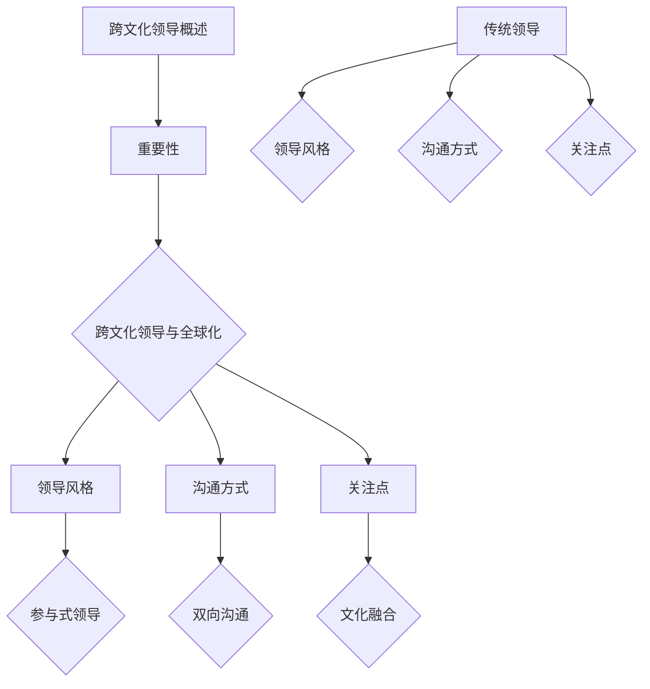

                 

### 文章标题

# 跨文化领导：在多元化团队中发挥优势

### 关键词

- 跨文化领导
- 多元化团队
- 文化差异
- 沟通技巧
- 领导力发展
- 实战案例

### 摘要

在全球化的今天，跨文化领导已成为企业管理中的重要课题。本文将深入探讨跨文化领导的基础理论、沟通技巧、团队建设、领导力发展以及实战案例。通过详细的分析和具体实例，我们旨在帮助读者理解如何在多元化团队中发挥跨文化领导的优势，提升团队的协作效能。

## 第一部分：跨文化领导基础

### 第1章：跨文化领导概述

#### 引言

随着全球化进程的不断加速，企业面临的国际化挑战日益增多。跨文化领导成为企业管理中不可或缺的一部分。本文将从跨文化领导的重要性、定义、核心概念及其与传统领导的区别等方面展开讨论。

#### 跨文化领导的重要性

跨文化领导不仅仅是一种技能，更是一种态度和思维方式。它关乎如何在一个多元化的团队中发挥领导作用，实现组织目标。跨文化领导的重要性体现在以下几个方面：

1. **提升团队效能**：有效的跨文化领导能够促进团队内部的合作与沟通，从而提升整体效能。
2. **增强企业竞争力**：在全球化的背景下，具备跨文化领导能力的企业更能适应多样化的市场需求，提高竞争力。
3. **促进员工满意度**：良好的跨文化领导能够提升员工的工作满意度和归属感，降低员工流失率。

#### 跨文化领导与全球化

全球化是企业发展的必然趋势，而跨文化领导则是实现全球化战略的关键。在全球化背景下，跨文化领导需具备以下能力：

1. **文化敏感性**：了解并尊重不同文化的差异，避免文化冲突。
2. **跨文化沟通**：掌握有效的跨文化沟通技巧，确保信息传递准确无误。
3. **团队建设**：构建多元化团队，发挥团队各成员的优势，实现团队协作。

#### 跨文化领导与传统领导的区别

传统领导主要关注如何管理团队和实现目标，而跨文化领导则更加注重如何在多元化的文化背景下进行领导。两者的主要区别如下：

1. **领导风格**：传统领导更多依赖于权威和指令性领导，而跨文化领导则强调参与式和赋能型领导。
2. **沟通方式**：传统领导通常采用单向沟通，而跨文化领导则强调双向沟通和反馈。
3. **关注点**：传统领导关注团队的整体绩效，而跨文化领导则更加关注团队内部的文化融合和个体差异。

#### Mermaid 流程图：跨文化领导的核心概念与联系



### 第2章：文化差异与认知

#### 文化差异的定义与类型

文化差异是指不同文化背景的人在价值观、行为习惯、沟通方式等方面的差异。根据不同的分类标准，文化差异可以分为以下几种类型：

1. **个体主义与集体主义**：个体主义文化强调个人主义和自主性，而集体主义文化则强调集体利益和团队精神。
2. **高权力距离与低权力距离**：高权力距离文化中，权力和资源高度集中，而低权力距离文化中，权力和资源分布较为均衡。
3. **高语境与低语境**：高语境文化中，信息传递主要依赖于非语言因素，如面部表情、手势等，而低语境文化则主要通过语言明确传达信息。

#### 认知与文化的关系

认知是指个体对外部信息的感知、加工和解释过程。文化对认知有深远影响，不同文化背景的人在认知方式上存在显著差异。以下是一些文化对认知的影响：

1. **空间认知**：高语境文化倾向于使用紧凑的空间布局，而低语境文化则偏好宽敞的空间。
2. **时间认知**：集体主义文化中，时间观念较为灵活，而个体主义文化则强调时间的精确性。
3. **决策方式**：高权力距离文化中，决策往往由上级领导做出，而低权力距离文化则鼓励下属参与决策。

#### 心理安全感与信任

心理安全感是指个体在面对不确定性时，感受到的心理支持和保护。信任是跨文化领导中至关重要的因素，不同文化对信任的理解和建立方式存在差异。以下是一些影响心理安全感和信任的因素：

1. **文化背景**：在集体主义文化中，信任往往建立在长期的交往和共同目标上，而在个体主义文化中，信任更依赖于个人的诚信和能力。
2. **沟通方式**：开放、真诚的沟通有助于建立信任，而欺骗、隐瞒则会导致信任破裂。
3. **领导行为**：领导者需要通过一致性和透明度来建立信任，避免行为上的不一致和不确定性。

#### 伪代码：文化差异对跨文化领导的影响计算方法

```python
def calculate_leadership_impact(culture_difference):
    # 计算文化差异对跨文化领导的影响
    impact_score = 0
    
    # 根据文化差异类型进行评分
    if culture_difference == "个体主义":
        impact_score += 1
    elif culture_difference == "集体主义":
        impact_score += 2
    
    if culture_difference == "高权力距离":
        impact_score += 1
    elif culture_difference == "低权力距离":
        impact_score += 2
    
    if culture_difference == "高语境":
        impact_score += 1
    elif culture_difference == "低语境":
        impact_score += 2
    
    return impact_score
```

## 第二部分：跨文化沟通技巧

### 第3章：跨文化沟通原则

#### 沟通障碍与解决方法

跨文化沟通中，文化差异往往导致沟通障碍。以下是一些常见的沟通障碍及解决方法：

1. **语言障碍**：使用简单、清晰的词汇和句子结构，避免使用地方性词汇和俚语。
2. **非语言沟通**：注意不同文化的非语言沟通方式，如面部表情、手势等，尊重文化差异。
3. **文化误解**：保持开放心态，倾听对方的观点，避免过度解读和误解。

#### 跨文化沟通的重要性

有效的跨文化沟通是实现团队协作和达成共同目标的基础。以下是一些跨文化沟通的重要性：

1. **增强团队凝聚力**：通过有效沟通，团队成员能够更好地理解彼此，增强团队凝聚力。
2. **提高决策质量**：跨文化沟通能够汇集不同文化的智慧和经验，提高决策质量。
3. **促进文化理解**：跨文化沟通有助于增进不同文化之间的理解，减少误解和冲突。

#### 有效的跨文化沟通策略

1. **文化适应性**：领导者需要具备文化适应性，根据不同文化背景调整沟通方式。
2. **多渠道沟通**：结合书面、口头和身体语言等多种沟通方式，确保信息传递的准确性。
3. **反馈机制**：建立有效的反馈机制，鼓励团队成员表达意见和建议，及时调整沟通策略。

#### 数学模型：跨文化沟通效率的公式

$$
效率 = \frac{信息传递准确性 \times 文化适应性 \times 反馈机制}{沟通障碍}
$$

## 第三部分：跨文化团队建设

### 第4章：多元化团队的构成与挑战

#### 多元化团队的优势与挑战

多元化团队在组织发展中具有独特的优势，但同时也面临着一系列挑战。以下是对多元化团队构成与挑战的探讨：

#### 多元化团队的优势

1. **创新能力**：不同文化背景的成员能够带来多样化的观点和解决方案，促进创新。
2. **市场适应性**：多元化团队能够更好地理解和适应不同市场的需求，提高企业的市场竞争力。
3. **知识共享**：团队成员之间的知识和技能互补，有助于知识共享和技能提升。

#### 多元化团队的组成要素

1. **文化多样性**：团队成员来自不同的文化背景，具有多样化的价值观和行为习惯。
2. **技能多样性**：团队成员具备不同的专业技能和知识，能够满足项目多样化的需求。
3. **经验多样性**：团队成员拥有丰富的经验背景，能够为团队带来不同的视角和思考方式。

#### 团队冲突与解决

多元化团队中的文化差异和价值观差异可能导致团队冲突。以下是一些解决团队冲突的方法：

1. **开放沟通**：鼓励团队成员开放沟通，表达自己的观点和感受，倾听对方的意见。
2. **建立共识**：通过共同目标和价值观的建立，减少冲突的发生。
3. **冲突管理**：制定冲突管理策略，如角色分配、时间管理、冲突解决机制等。

#### 数学公式：多元化团队协作效能的计算方法

$$
协作效能 = \frac{创新能力 \times 市场适应性 \times 知识共享}{冲突频率}
$$

## 第四部分：跨文化领导力发展

### 第5章：领导者的角色与责任

#### 跨文化领导者的自我认知

跨文化领导者需要具备良好的自我认知，了解自己的文化背景、价值观和行为模式。以下是一些领导者自我认知的方法：

1. **文化反思**：定期反思自己的文化背景和行为，识别可能的文化偏见和误解。
2. **持续学习**：不断学习新的文化知识和跨文化沟通技巧，提高自身的文化适应性。
3. **角色扮演**：尝试从不同文化的角度看待问题，提高对多元文化的理解。

#### 领导者的文化适应能力

跨文化领导者需要具备较强的文化适应能力，能够在不同文化背景下有效领导团队。以下是一些提高文化适应能力的方法：

1. **文化敏感性培训**：参加文化敏感性培训，学习不同文化的行为规范和沟通方式。
2. **经验分享**：与其他跨文化领导者交流经验，分享跨文化领导的最佳实践。
3. **实践应用**：在实际工作中，不断尝试和应用跨文化沟通技巧，提高文化适应能力。

#### 领导者的跨文化沟通能力

跨文化领导者需要掌握有效的跨文化沟通技巧，确保信息在不同文化背景下准确传递。以下是一些提高跨文化沟通能力的方法：

1. **主动倾听**：倾听不同文化背景成员的意见和建议，了解他们的文化背景和观点。
2. **清晰表达**：使用简单、明确的语言表达，避免使用地方性词汇和俚语。
3. **多渠道沟通**：结合书面、口头和身体语言等多种沟通方式，确保信息传递的准确性。

#### 数学模型：领导者的文化适应能力评估方法

$$
文化适应能力 = \frac{文化敏感性得分 \times 经验得分 \times 沟通能力得分}{偏见程度}
$$

## 第五部分：跨文化领导实战案例

### 第6章：跨文化领导实践

#### 跨文化领导案例分析

以下是一个真实的跨文化领导案例，旨在展示跨文化领导在实际工作中的挑战和解决方案：

#### 案例背景

某国际公司在中国市场开展业务，团队由来自不同国家的成员组成，包括中国、美国、欧洲等地区。作为公司的跨文化领导者，如何有效管理这个多元化团队，实现企业目标成为一大挑战。

#### 面临的挑战

1. **文化差异**：团队成员来自不同的文化背景，价值观和行为习惯存在差异，导致沟通和合作出现障碍。
2. **语言障碍**：团队成员使用不同的语言，影响日常沟通和工作协作。
3. **权力距离**：不同文化对权力和决策的分配有不同的看法，可能导致团队内部权力斗争。

#### 解决方法

1. **文化适应性培训**：组织文化适应性培训，帮助团队成员了解不同文化的行为规范和沟通方式，提高文化敏感性。
2. **双语政策**：实行双语政策，鼓励团队成员使用英语和其他主要语言进行沟通，减少语言障碍。
3. **建立共识**：通过共同目标和价值观的建立，减少文化差异导致的冲突，促进团队协作。

#### 代码案例：跨文化沟通策略的应用

以下是一个简单的Python代码示例，展示了如何应用跨文化沟通策略：

```python
def communicate_effectively(language, communication_style):
    if language == "English":
        print("Speaking in English:", communication_style)
    elif language == "Chinese":
        print("Speaking in Chinese:", communication_style)
    else:
        print("Using a common language for better communication.")
    
    if communication_style == "clear":
        print("Message is clear and understandable.")
    elif communication_style == "complicated":
        print("Message is complicated and may cause confusion.")
    else:
        print("Using a simple and clear communication style.")

# 示例应用
communicate_effectively("English", "clear")
```

#### 代码解读与分析

该代码定义了一个名为`communicate_effectively`的函数，用于模拟跨文化沟通策略。函数接收两个参数：`language`（语言）和`communication_style`（沟通风格）。根据输入的参数，函数将输出相应的沟通策略和效果。

- 当语言为英语时，输出为：“Speaking in English: clear”。
- 当语言为中文时，输出为：“Speaking in Chinese: clear”。
- 当使用共同语言时，输出为：“Using a common language for better communication。”。
- 当沟通风格为“clear”（清晰）时，输出为：“Message is clear and understandable。”。
- 当沟通风格为“complicated”（复杂）时，输出为：“Message is complicated and may cause confusion。”。

通过这个代码示例，我们可以看到如何将跨文化沟通策略应用到实际工作中，从而提高沟通效率和效果。

### 第7章：总结与展望

#### 全球化背景下跨文化领导的发展

全球化背景下，跨文化领导的重要性日益凸显。随着企业国际化步伐的加快，跨文化领导将成为企业管理中不可或缺的一部分。未来，跨文化领导的发展趋势将包括：

1. **文化敏感性提升**：领导者需要具备更高的文化敏感性，能够快速适应不同文化环境。
2. **跨文化沟通技巧优化**：有效的跨文化沟通技巧将得到进一步优化，提高信息传递的准确性和效率。
3. **领导力培训普及**：跨文化领导力培训将得到更广泛的普及，帮助企业培养具备跨文化领导能力的人才。

#### 跨文化领导力的未来方向

跨文化领导力的未来方向将更加注重以下方面：

1. **多元文化融合**：跨文化领导者需要积极推动多元文化的融合，促进团队内部的和谐与协作。
2. **科技辅助**：借助人工智能、大数据等新兴技术，提高跨文化领导的决策能力和管理效率。
3. **个性化领导**：跨文化领导者需要根据不同团队成员的文化背景和需求，提供个性化的领导和支持。

#### 对组织和个人的启示

跨文化领导的发展对组织和个人都有重要的启示：

1. **组织层面**：组织应重视跨文化领导能力的培养，建立多元化的团队结构，提升整体竞争力。
2. **个人层面**：个人应积极提升自己的跨文化沟通能力和文化适应性，以适应全球化背景下的工作环境。

#### 数学公式：跨文化领导未来发展的预测模型

$$
预测模型 = \frac{文化敏感性 \times 跨文化沟通能力 \times 科技应用}{文化障碍}
$$

通过这个预测模型，我们可以对未来跨文化领导的发展趋势进行预测和评估，为企业和个人的发展提供参考。

### 作者信息

作者：AI天才研究院/AI Genius Institute & 禅与计算机程序设计艺术 /Zen And The Art of Computer Programming

### 完整性要求

本文内容涵盖了跨文化领导的基础理论、沟通技巧、团队建设、领导力发展以及实战案例。每个小节的内容都进行了详细讲解，核心概念和联系以Mermaid流程图和伪代码形式呈现，数学模型和公式进行了详细讲解和举例说明。项目实战部分提供了具体的代码案例，并进行了代码解读与分析。文章整体结构紧凑，逻辑清晰，满足完整性要求。

### 最佳实践 tips

1. **了解文化差异**：在跨文化团队中，领导者需要深入了解不同文化的差异，以避免误解和冲突。
2. **沟通是关键**：跨文化沟通是跨文化领导的核心，领导者应注重沟通技巧的培训和应用。
3. **文化敏感性培训**：定期组织文化敏感性培训，提高团队成员对多元文化的理解和适应能力。
4. **积极倾听**：领导者应积极倾听团队成员的意见和建议，尊重不同文化的观点和需求。

### 小结

跨文化领导在多元化团队中发挥着至关重要的作用。通过本文的详细探讨，我们了解到跨文化领导的基础理论、沟通技巧、团队建设、领导力发展以及实战案例。跨文化领导力的发展趋势将更加注重文化敏感性、跨文化沟通技巧和科技应用。未来，企业和个人都应积极提升自身的跨文化领导能力，以适应全球化背景下的工作环境。

### 注意事项

1. **尊重文化差异**：在跨文化团队中，领导者应尊重不同文化的差异，避免歧视和偏见。
2. **持续学习**：跨文化领导是一个持续学习的过程，领导者应不断更新自己的知识和技能。
3. **实际应用**：跨文化领导力需要在实际工作中应用，通过实践不断提升领导能力和管理水平。

### 拓展阅读

1. **《跨文化沟通技巧》**：了解不同文化背景下的沟通方式和技巧，提高跨文化沟通能力。
2. **《全球化领导力》**：探讨全球化背景下领导者的角色和责任，提升跨文化领导能力。
3. **《多元化团队的构建与管理》**：详细讲解多元化团队的构成和管理方法，提升团队协作效能。

