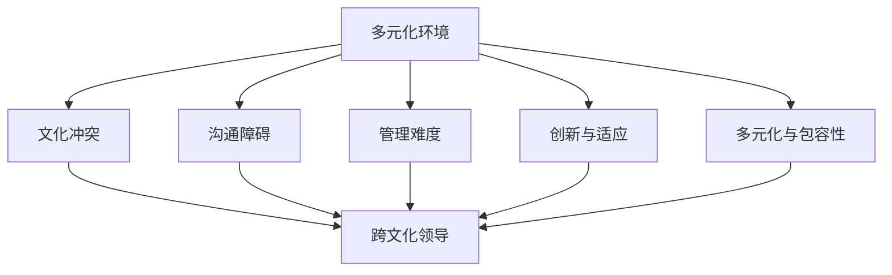
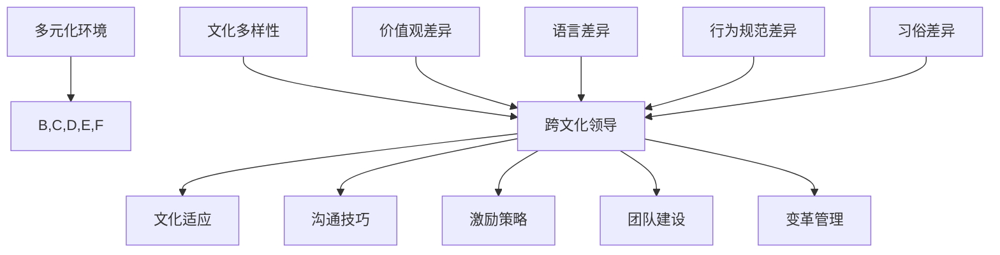
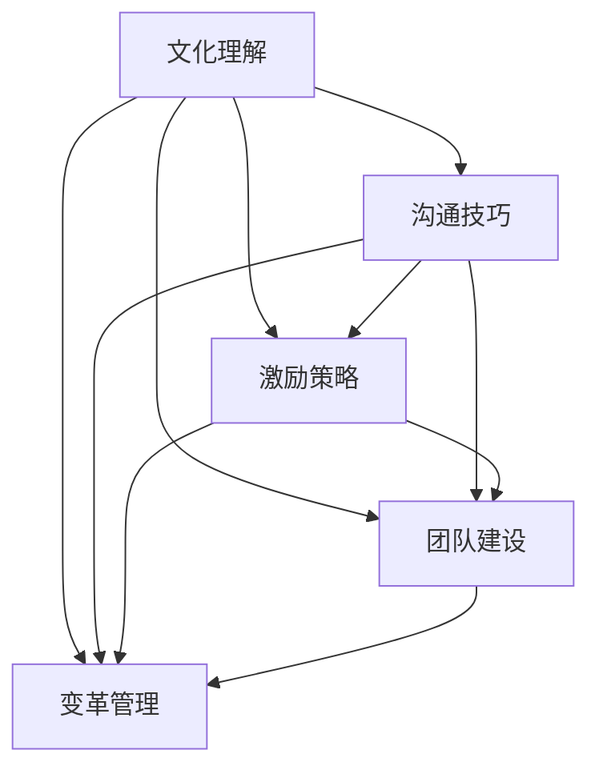

                 

### 文章标题：跨文化领导：在多元化环境中取得成功

在全球化迅速发展的今天，多元化环境已经成为许多企业运营的常态。不同文化背景的员工在一起工作，不仅带来了多样性的视角和想法，同时也为领导者带来了新的挑战。跨文化领导的重要性不言而喻，如何在多元化环境中取得成功，成为每一个领导者都需要深入思考的问题。

本文将围绕跨文化领导这一主题，从基础、实践到成功之路三个部分进行探讨。首先，我们将介绍跨文化领导的基础知识，包括其重要性、多元化环境的特点以及跨文化领导与多元化环境的关系。接着，我们将深入分析跨文化沟通策略、领导力发展的方法以及适应多元化环境的策略。随后，文章将探讨多元化团队管理、跨文化领导力发展、跨文化沟通技巧以及国际化企业战略与跨文化领导等方面的实践。最后，通过成功案例分析，我们将总结跨文化领导的实践经验，并探讨其未来趋势与挑战。

通过这篇文章，我们希望能够为读者提供一套完整的跨文化领导知识体系，帮助他们在多元化环境中取得成功。

## 文章关键词

- **跨文化领导**：指在不同文化背景下，领导者如何影响和引导团队。
- **多元化环境**：指包含多种文化背景、价值观和习惯的工作环境。
- **领导力发展**：领导者如何提升自身的能力和素质，以更好地适应多元化环境。
- **沟通策略**：在跨文化沟通中，领导者如何有效地传达信息和建立关系。
- **国际化企业**：指在全球范围内运营的企业，其员工和业务涉及多个国家。
- **成功案例**：通过实际案例，展示跨文化领导如何在不同场景中取得成功。
- **未来趋势与挑战**：探讨跨文化领导在未来的发展方向和面临的挑战。

### 文章摘要

本文旨在探讨如何在多元化环境中实现跨文化领导的成功。首先，文章介绍了跨文化领导和多元化环境的基本概念，分析了它们之间的联系。接着，文章深入讨论了跨文化沟通策略、领导力发展的方法以及适应多元化环境的策略。随后，文章探讨了多元化团队管理、跨文化领导力发展、跨文化沟通技巧以及国际化企业战略与跨文化领导等方面的实践。通过成功案例分析，文章总结了跨文化领导的实践经验，并探讨了其未来趋势与挑战。通过这篇文章，读者可以全面了解跨文化领导的知识体系，掌握在多元化环境中取得成功的方法和策略。

## 第一部分：跨文化领导基础

### 第1章：跨文化领导概述

#### 1.1 跨文化领导的重要性

在全球化背景下，跨文化领导变得尤为重要。随着企业国际化步伐的加快，越来越多的组织需要在多元化的工作环境中运营。这种环境不仅包括不同国籍的员工，还涵盖了不同的文化、价值观和工作习惯。跨文化领导的核心任务是确保这些多样性能够转化为组织的竞争优势，而不是成为阻碍企业发展的障碍。

跨文化领导的重要性主要体现在以下几个方面：

1. **提高团队绩效**：多元化的团队能够带来不同视角和思维方式，通过有效的跨文化领导，可以激发这些多样性，提高团队的整体绩效。
   
2. **增强组织适应能力**：在全球化市场中，企业需要快速适应不同国家和地区的市场环境。跨文化领导能够帮助组织更好地理解并适应这些变化，提高其市场竞争力。

3. **促进员工满意度和留存率**：良好的跨文化领导能够提升员工的满意度和归属感，从而降低员工流失率，提高组织的稳定性。

4. **提升品牌形象**：在多元化市场中，具有良好跨文化领导能力的组织通常更受消费者和合作伙伴的认可，从而提升品牌形象。

#### 1.2 多元化环境的特点

多元化环境具有以下几个显著特点：

1. **文化多样性**：不同国家的员工带来了各自的文化背景、价值观和行为模式。

2. **语言多样性**：多种语言的使用可能导致沟通障碍，需要有效的跨文化沟通策略。

3. **价值观差异**：不同的文化背景可能导致价值观的冲突，领导者需要理解和尊重这些差异。

4. **工作习惯不同**：不同文化对工作的时间观念、团队协作方式和工作效率有不同的期望。

#### 1.3 跨文化领导与多元化环境的联系

跨文化领导与多元化环境之间存在着密切的联系。跨文化领导不仅是为了适应多元化环境，更是为了在这种环境中实现卓越的领导。以下是跨文化领导与多元化环境之间的几个关键联系：

1. **文化理解与适应**：跨文化领导需要领导者具备较强的文化理解能力，能够适应并融合不同文化的特点和需求。

2. **沟通与协作**：跨文化领导强调有效的沟通和协作，通过建立信任和共识来克服文化障碍。

3. **多元视角的整合**：跨文化领导能够充分利用多元化团队的多样性，将不同文化和视角融合，形成创新的解决方案。

4. **领导力发展**：跨文化领导不仅要求领导者自身具备跨文化能力，还需要帮助团队成员发展跨文化素养，从而提高整个组织的跨文化领导水平。

通过以上分析，我们可以看出，跨文化领导在多元化环境中具有不可替代的重要性。只有通过有效的跨文化领导，组织才能充分利用多元化环境的优势，实现可持续发展。

#### 1.4 跨文化领导的必要性

在全球化进程不断加速的今天，企业的多元化环境已经成为一种常态。不同国家和地区的员工、客户和合作伙伴带来了不同的文化背景、价值观和工作习惯。这种多元化环境为组织提供了丰富的资源，但也带来了前所未有的挑战。跨文化领导的必要性主要体现在以下几个方面：

1. **解决文化冲突**：在多元化环境中，不同文化之间的差异可能导致误解和冲突。有效的跨文化领导能够帮助员工理解和尊重彼此的文化，从而减少冲突，提高团队协作效率。

2. **提升组织适应能力**：全球化市场环境瞬息万变，企业需要具备快速适应不同市场环境的能力。跨文化领导能够帮助组织更好地理解并适应这些变化，从而在竞争激烈的市场中保持优势。

3. **促进创新和创造力**：多元化的团队通常能够带来不同的视角和思维方式，通过有效的跨文化领导，这些多样性可以转化为组织的创新动力，推动组织不断进步。

4. **提高员工满意度和留存率**：良好的跨文化领导能够提升员工的满意度和归属感，从而降低员工流失率，提高组织的稳定性。

5. **增强品牌影响力**：在全球市场中，具有良好跨文化领导能力的组织通常更受消费者和合作伙伴的认可，从而提升品牌形象和市场竞争力。

通过以上分析，我们可以看到，跨文化领导在多元化环境中具有极其重要的必要性。只有通过有效的跨文化领导，企业才能充分利用多元化环境的优势，实现可持续发展。

#### 1.5 多元化环境下的挑战

在多元化环境中，领导者面临着一系列独特的挑战，这些挑战不仅影响着组织的日常运营，也可能对其长期发展产生深远的影响。以下是一些主要的挑战及其应对策略：

1. **文化冲突**：不同文化背景的员工可能会在工作中产生误解和矛盾。这种冲突可能源于价值观、沟通风格和工作习惯的差异。应对策略包括：
   - **促进文化理解**：通过文化培训和工作坊，帮助员工了解不同文化的特点和习惯。
   - **建立共同价值观**：通过制定共同的目标和价值观，减少文化冲突，增强团队凝聚力。

2. **沟通障碍**：多种语言的使用可能会导致信息传递不准确或误解。此外，文化差异也可能影响沟通的效果。应对策略包括：
   - **建立跨文化沟通机制**：明确沟通的规则和标准，确保信息传递的准确性。
   - **使用多种沟通方式**：结合口头、书面和肢体语言，以适应不同文化背景的员工。

3. **管理难度增加**：多元化环境中的员工可能来自不同的背景，其职业发展需求、工作期望和激励方式也可能不同。应对策略包括：
   - **个性化管理**：根据不同员工的背景和需求，制定个性化的职业发展计划。
   - **建立多元化的领导团队**：吸纳不同文化背景的领导者，以更好地理解和应对多元化团队的需求。

4. **创新与适应能力**：多元化环境中的创新和适应能力尤为重要。领导者需要能够迅速适应变化，并激发团队的创新能力。应对策略包括：
   - **鼓励创新思维**：创建一个支持创新和实验的环境，鼓励员工提出新的想法。
   - **建立灵活的决策机制**：通过快速决策和灵活调整，以应对市场变化和竞争压力。

5. **多元化与包容性**：领导者需要确保组织的多元化不仅仅是表面现象，而是真正融入到组织的文化和管理实践中。应对策略包括：
   - **加强包容性文化**：通过政策和文化建设，确保所有员工都感受到被尊重和认可。
   - **建立多元化指标**：将多元化作为评估领导者和组织绩效的重要指标，以推动多元化文化的落实。

通过有效的策略和措施，领导者可以克服多元化环境中的挑战，将多元化转化为组织的竞争优势。这不仅是跨文化领导的核心任务，也是实现组织长期成功的关键。

#### 1.6 跨文化领导与多元化环境的关系图

为了更好地理解跨文化领导与多元化环境之间的相互作用，我们可以借助Mermaid流程图来展示两者之间的关系。以下是跨文化领导与多元化环境的Mermaid流程图：



在这个流程图中，多元化环境（A）与跨文化领导（G）之间存在双向箭头，表示跨文化领导既是应对多元化环境挑战的手段，也是从多元化环境中获取资源和支持的过程。具体关系如下：

- **文化冲突**（B）：跨文化领导通过促进文化理解和尊重，减少文化冲突。
- **沟通障碍**（C）：跨文化领导通过建立有效的跨文化沟通机制，克服沟通障碍。
- **管理难度**（D）：跨文化领导通过个性化管理和多元化领导团队的建立，应对管理挑战。
- **创新与适应**（E）：跨文化领导通过鼓励创新思维和灵活的决策机制，提高组织的适应能力。
- **多元化与包容性**（F）：跨文化领导通过加强包容性文化和建立多元化指标，推动多元化文化的落实。

通过这个关系图，我们可以更清晰地看到跨文化领导在多元化环境中的关键作用和影响。

### 第2章：核心概念与联系

#### 2.1 跨文化概念解析

跨文化是指在不同文化背景之间进行交流、互动和合作的过程。文化是一个社会共同体的价值观念、行为规范和生活方式的综合体现，涵盖了语言、宗教、习俗、价值观等多个方面。跨文化概念的核心在于理解和尊重不同文化之间的差异，并找到有效的方式来进行沟通和合作。

在跨文化背景下，文化差异通常表现为以下几个方面：

1. **语言差异**：不同语言的表达方式和语法结构可能导致沟通障碍，需要通过翻译或共同语言来克服。
   
2. **价值观差异**：不同文化对个人主义与集体主义、权力距离、时间观念等有不同的看法，这可能导致工作习惯和行为模式上的冲突。

3. **行为规范差异**：不同文化对礼仪、社会交往和工作方式有不同的期望，需要通过文化适应来减少误解。

4. **习俗差异**：不同文化的节日、仪式和禁忌可能影响工作和生活的安排，需要尊重和适应。

#### 2.2 领导力概念解析

领导力是指领导者通过影响和激励他人来实现共同目标的能力。领导力不仅仅是一种技术或技能，更是一种态度和行为。有效的领导力需要领导者具备以下几个方面的能力：

1. **沟通能力**：领导者需要能够清晰、准确地表达自己的想法，并倾听和理解他人的观点。

2. **决策能力**：领导者需要能够做出明智的决策，并在不确定和复杂的环境中保持冷静和判断力。

3. **激励能力**：领导者需要能够激发团队成员的积极性和创造力，使其为实现组织目标而努力。

4. **团队建设能力**：领导者需要能够建立高效的团队，促进团队成员之间的协作和信任。

5. **变革管理能力**：领导者需要能够引导团队适应变化，推动组织实现持续改进和成长。

#### 2.3 跨文化领导与多元化环境的关系图

为了更直观地展示跨文化领导与多元化环境之间的关系，我们可以使用Mermaid流程图来构建一个概念架构。以下是跨文化领导与多元化环境的Mermaid流程图：



在这个流程图中，多元化环境（A）与跨文化领导（G）之间通过多个文化差异（B、C、D、E、F）连接，表明多元化环境中的文化差异是跨文化领导需要面对和解决的问题。跨文化领导（G）通过不同的策略（H、I、J、K、L）来应对这些文化差异，从而实现有效的领导。

- **文化适应**（H）：通过文化理解和文化适应，减少文化冲突和误解。
- **沟通技巧**（I）：通过有效的跨文化沟通技巧，确保信息传递的准确性和效率。
- **激励策略**（J）：通过理解和尊重不同文化背景下的激励方式，激发团队成员的积极性。
- **团队建设**（K）：通过建设多元文化团队，促进团队成员之间的协作和信任。
- **变革管理**（L）：通过跨文化领导，帮助组织适应全球化市场的变化和挑战。

通过这个关系图，我们可以清晰地看到跨文化领导在多元化环境中的核心作用和具体实施策略。

#### 2.4 跨文化领导的核心概念与联系

在多元化环境中，跨文化领导的核心概念包括文化理解、沟通技巧、激励策略、团队建设和变革管理。这些概念相互联系，共同构成了跨文化领导的理论框架。

1. **文化理解**：文化理解是跨文化领导的基础。领导者需要具备对不同文化的敏感性和理解能力，能够识别并尊重不同文化背景下的价值观和行为模式。通过文化理解，领导者可以减少误解和冲突，建立有效的跨文化沟通基础。

2. **沟通技巧**：沟通技巧是跨文化领导的关键。在多元化环境中，领导者需要能够使用适当的沟通方式和语言，确保信息传递的准确性和有效性。这包括使用共同语言、采用非语言沟通方式以及尊重文化差异。

3. **激励策略**：激励策略是跨文化领导的重要部分。领导者需要理解不同文化背景下的激励方式，采用符合员工需求和价值观的激励措施。这可以通过个性化激励、文化适应性激励和团队激励等方式实现。

4. **团队建设**：团队建设是跨文化领导的核心任务之一。领导者需要建立多元化的团队，促进团队成员之间的协作和信任。这包括培养文化包容性、建立共同目标以及提供培训和发展机会。

5. **变革管理**：变革管理是跨文化领导的重要挑战。在全球化市场中，企业需要不断适应变化。领导者需要具备变革管理能力，能够引导团队应对市场变化和内部调整，实现持续改进和成长。

这些核心概念相互关联，共同构成了跨文化领导的理论框架。文化理解是基础，沟通技巧是桥梁，激励策略是动力，团队建设是保障，变革管理是目标。通过这些概念的有效结合，领导者可以在多元化环境中实现卓越的领导。

为了更直观地展示这些概念之间的联系，我们可以使用Mermaid流程图来构建跨文化领导的核心概念架构。以下是跨文化领导核心概念与联系的Mermaid流程图：



在这个流程图中，文化理解（A）作为基础，连接到沟通技巧（B）、激励策略（C）、团队建设（D）和变革管理（E），形成了一个闭环。这表明跨文化领导中的每一个核心概念都是相互依存和相互促进的，共同构成了一套完整的领导框架。

通过这个流程图，我们可以更清晰地理解跨文化领导的核心概念及其相互关系，从而在实际领导工作中更好地应用这些概念，实现多元化环境中的成功领导。

### 第3章：核心算法原理讲解

在探讨跨文化领导的核心算法原理时，我们可以从跨文化沟通策略、领导力发展的方法以及适应多元化环境的策略三个主要方面进行详细阐述。通过这些核心算法，领导者可以更有效地在多元化环境中进行领导，从而实现团队的高效协作和组织的持续发展。

#### 3.1 跨文化沟通策略

跨文化沟通是跨文化领导的重要组成部分，其核心在于确保信息在不同文化背景下能够准确、有效地传达。以下是几个关键的跨文化沟通策略：

1. **文化敏感度培训**：首先，领导者需要通过培训提高自身的文化敏感度，了解不同文化背景下的沟通习惯和偏好。这包括学习不同文化的礼仪、语言风格、非语言沟通方式等。

2. **使用共同语言**：在多元文化团队中，使用共同语言可以减少语言障碍，提高沟通效率。如果团队成员的语言不一致，可以采用英语等国际通用语言作为工作语言。

3. **明确沟通目标**：在跨文化沟通中，明确沟通的目标和预期结果非常重要。领导者需要确保所有团队成员都清楚了解沟通的目的和期望。

4. **建立信任和共识**：通过建立信任和共识，可以有效减少跨文化沟通中的误解和冲突。领导者可以通过定期团队会议、小组讨论和合作项目等方式来促进团队成员之间的信任建设。

5. **使用非语言沟通**：非语言沟通在跨文化沟通中扮演着重要角色。领导者需要善于使用肢体语言、面部表情和空间距离等非语言方式来传达信息。

以下是一个简单的伪代码示例，展示如何设计一个跨文化沟通策略：

```python
def cross-cultural_communication_strategy(team_members):
    # 文化敏感度培训
    for member in team_members:
        train_member_on_cultural_sensitivity(member)
    
    # 使用共同语言
    common_language = "English"
    for member in team_members:
        set_common_language(member, common_language)
    
    # 明确沟通目标
    set_clear_communication_objectives(team_members)
    
    # 建立信任和共识
    build_trust_and_consensus(team_members)
    
    # 使用非语言沟通
    use_nonverbal_communication(team_members)
    
    return "Communication strategy successfully implemented"
```

#### 3.2 领导力发展的方法

在多元化环境中，领导者需要不断提升自身的领导力，以适应不断变化的市场和团队需求。以下是几个关键的领导力发展方法：

1. **自我认知与提升**：领导者需要深入反思自己的价值观、行为模式和管理风格，识别自身的优势和劣势，并通过培训、阅读和实践等方式不断提升自我认知。

2. **多样化领导风格**：领导者需要根据不同文化背景和团队成员的特点，灵活调整自己的领导风格。例如，对于注重集体主义的团队，领导者可以采用参与式领导风格；对于注重个人主义的团队，领导者可以采用授权式领导风格。

3. **跨文化培训**：领导者可以通过参加跨文化培训课程，深入了解不同文化的特点和管理技巧，从而提升自己的跨文化领导能力。

4. **建立多元文化团队**：领导者需要积极建立多元文化团队，吸引并保留不同文化背景的精英人才，通过多样性实现团队的创新和创造力。

以下是一个简单的伪代码示例，展示如何设计一个领导力发展计划：

```python
def leadership_development_plan(leader):
    # 自我认知与提升
    leader.reflect_on_values_and_behavior()
    leader.improve_self_awareness()
    
    # 多样化领导风格
    leader.adjust_leadership_style_based_on_culture()
    
    # 跨文化培训
    leader.attend_cross-cultural_training_courses()
    
    # 建立多元文化团队
    leader.build_diverse_team()
    
    return "Leadership development plan successfully implemented"
```

#### 3.3 适应多元化环境的策略

在多元化环境中，领导者需要采取一系列策略来适应不断变化的环境，确保组织的稳定和发展。以下是几个关键的适应策略：

1. **文化适应策略**：领导者需要根据不同文化的特点，调整组织的政策和流程，确保文化适应。例如，在尊重宗教习俗和节日的方面进行调整。

2. **沟通策略**：领导者需要建立有效的跨文化沟通机制，确保信息在不同文化背景下能够准确传达。例如，通过建立多语言沟通团队和定期沟通会议。

3. **激励策略**：领导者需要根据不同文化背景下的激励方式，设计个性化的激励策略。例如，对于注重个人成就的员工，可以采用奖金和晋升等激励措施。

4. **团队建设策略**：领导者需要通过团队建设活动，增强团队成员之间的信任和合作。例如，通过组织团队培训、团队合作项目和团队建设活动。

以下是一个简单的伪代码示例，展示如何设计一个适应多元化环境的策略：

```python
def adapt_to_diversity_environment(organization):
    # 文化适应策略
    adjust_organization_policies_and_processes_to_culture()
    
    # 沟通策略
    establish_effective_cross-cultural_communication_mechanisms()
    
    # 激励策略
    design个性化的激励策略()
    
    # 团队建设策略
    enhance_trust_and_cooperation_through_team_building_activities()
    
    return "Diversity environment adaptation strategy successfully implemented"
```

通过以上核心算法原理的讲解，我们可以看到，跨文化领导不仅仅是关于文化和沟通的，更涉及到领导力的提升和环境的适应。这些算法原理为领导者提供了一套系统的框架和方法，帮助他们更好地在多元化环境中进行领导，实现组织的成功。

### 3.4 跨文化沟通策略的详细解释与实例

跨文化沟通策略在跨文化领导中扮演着至关重要的角色。有效的跨文化沟通不仅能够减少误解和冲突，还能促进团队协作和组织的整体绩效。以下是对几个关键跨文化沟通策略的详细解释，并辅以具体实例。

#### 3.4.1 文化敏感度培训

文化敏感度培训是跨文化沟通策略的基础。通过培训，领导者可以提升对不同文化背景的理解和敏感度，从而减少文化冲突和误解。以下是一个具体的实例：

**实例：文化敏感度培训**

在一次跨国项目中，一家美国公司与中国团队合作。项目初期，由于文化差异，双方在沟通中频繁出现误解和冲突。为了改善这种情况，公司安排了为期一周的文化敏感度培训。

培训内容包括：
- **中国文化的价值观**：如尊重权威、重视人际关系和集体主义。
- **中国的工作习惯**：如时间观念、会议礼仪和沟通风格。
- **跨文化沟通技巧**：如如何使用非语言沟通、避免文化偏见等。

通过这次培训，团队成员对彼此的文化有了更深入的了解，沟通障碍显著减少，项目进展顺利。

#### 3.4.2 使用共同语言

在多元文化团队中，使用共同语言可以减少语言障碍，提高沟通效率。对于跨国团队，通常会选择一种国际通用语言，如英语，作为工作语言。以下是一个具体实例：

**实例：使用共同语言**

一家跨国公司在全球范围内运营，团队成员来自不同的国家，包括美国、英国、德国、法国等。为了确保沟通的流畅性，公司规定英语作为公司内部的工作语言。

具体措施：
- **语言培训**：为非英语母语的员工提供英语培训，提高其沟通能力。
- **多语言支持**：在关键沟通场合，如国际会议和项目讨论中，提供翻译服务。

通过这些措施，团队成员能够使用共同语言进行沟通，有效降低了语言障碍，提高了团队协作效率。

#### 3.4.3 明确沟通目标

在跨文化沟通中，明确沟通的目标和预期结果非常重要。这有助于确保所有团队成员都清楚了解沟通的目的和期望。以下是一个具体实例：

**实例：明确沟通目标**

在一次国际项目中，团队需要制定项目计划。为了确保沟通的清晰和有效，项目负责人组织了一次沟通会议，明确了以下目标：
- **项目目标**：确保所有团队成员都了解项目的总体目标。
- **任务分配**：明确每个团队成员的任务和职责。
- **时间安排**：制定详细的时间表和进度计划。

通过明确沟通目标，团队成员在项目执行过程中能够更好地协作，减少了误解和冲突。

#### 3.4.4 建立信任和共识

建立信任和共识是跨文化沟通的关键。通过建立信任和共识，可以有效减少跨文化沟通中的误解和冲突。以下是一个具体实例：

**实例：建立信任和共识**

在一次跨文化团队合作中，团队成员来自不同文化背景，包括美国、日本和印度。为了建立信任和共识，团队采取以下措施：
- **团队建设活动**：组织团队建设活动，如户外拓展训练和团队聚餐，增进团队成员之间的了解和信任。
- **定期会议**：通过定期团队会议，讨论项目进展和面临的挑战，确保团队成员之间的沟通畅通。
- **共同决策**：在项目决策过程中，鼓励团队成员参与讨论，共同达成共识。

通过这些措施，团队成员之间的信任和共识逐步建立，项目进展顺利。

#### 3.4.5 使用非语言沟通

非语言沟通在跨文化沟通中同样重要。通过使用非语言沟通，如肢体语言、面部表情和空间距离，可以增强沟通的效果。以下是一个具体实例：

**实例：使用非语言沟通**

在一次跨国会议中，团队成员来自不同的国家，包括美国、德国和巴西。为了确保沟通的效果，会议采取了以下非语言沟通策略：
- **肢体语言**：鼓励团队成员使用开放的肢体语言，如点头、微笑和手势，以表达理解和支持。
- **面部表情**：鼓励团队成员展示真诚和积极的面部表情，以增强沟通的情感连接。
- **空间距离**：根据不同文化的空间距离偏好，调整会议座位布局，确保所有团队成员都能舒适地参与讨论。

通过这些非语言沟通策略，会议的沟通效果得到了显著提升。

总之，跨文化沟通策略的有效实施对于跨文化领导的成功至关重要。通过文化敏感度培训、使用共同语言、明确沟通目标、建立信任和共识以及使用非语言沟通，领导者可以显著改善跨文化团队的沟通效果，促进团队协作和组织的整体发展。

### 3.5 领导力发展的方法详细解释与实例

领导力发展是跨文化领导成功的关键因素之一。领导者需要不断提升自身的领导力，以适应多元化环境中的挑战。以下是对几个关键领导力发展方法的详细解释，并辅以具体实例。

#### 3.5.1 自我认知与提升

自我认知是领导力发展的基础。领导者需要深入反思自己的价值观、行为模式和管理风格，识别自身的优势和劣势，并通过培训、阅读和实践等方式不断提升自我认知。

**实例：自我认知与提升**

一名跨国企业的项目经理，意识到自己在决策过程中存在过于依赖数据和事实的问题，而忽视了团队成员的情感和需求。为了提升自我认知，他采取了以下措施：
- **反思日记**：每天记录自己的工作经历，反思自己在决策过程中的表现和影响。
- **360度反馈**：邀请团队成员、上级和同事提供反馈，了解自己在领导力方面的优点和不足。
- **领导力培训**：参加领导力培训课程，学习如何更好地平衡数据与情感，提升决策质量。

通过这些措施，项目经理的自我认知得到了显著提升，决策过程中更加注重团队成员的情感和需求。

#### 3.5.2 多样化领导风格

在多元化环境中，领导者需要根据不同文化背景和团队成员的特点，灵活调整自己的领导风格。例如，对于注重集体主义的团队，领导者可以采用参与式领导风格；对于注重个人主义的团队，领导者可以采用授权式领导风格。

**实例：多样化领导风格**

一家跨国公司的销售团队，团队成员来自不同国家，包括美国、日本和墨西哥。为了更好地激励和管理团队成员，销售经理采取了以下多样化领导风格：
- **参与式领导**：在日本团队中，销售经理鼓励团队成员参与决策过程，共同制定销售目标，增强团队凝聚力。
- **授权式领导**：在墨西哥团队中，销售经理给予团队成员更多的自主权，让他们根据自己的经验和判断进行销售策略的调整，提高销售业绩。

通过多样化领导风格，销售经理能够更好地激励和管理团队成员，提高了团队的整体绩效。

#### 3.5.3 跨文化培训

领导者可以通过参加跨文化培训课程，深入了解不同文化的特点和管理技巧，从而提升自己的跨文化领导能力。

**实例：跨文化培训**

一名跨国企业的运营经理，为了提升自己的跨文化领导能力，参加了为期两周的跨文化培训课程。课程内容包括：
- **文化理解**：学习不同文化的价值观、行为规范和工作习惯。
- **沟通技巧**：学习如何在跨文化团队中有效沟通，减少误解和冲突。
- **管理实践**：探讨如何在不同文化背景下进行团队管理和决策。

通过这次跨文化培训，运营经理的跨文化领导能力得到了显著提升，能够更好地管理和激励多元化团队。

#### 3.5.4 建立多元文化团队

领导者需要积极建立多元文化团队，吸引并保留不同文化背景的精英人才，通过多样性实现团队的创新和创造力。

**实例：建立多元文化团队**

一家跨国科技公司，为了提升团队的创新能力和竞争力，采取了以下措施建立多元文化团队：
- **多元化招聘**：在全球范围内招聘不同文化背景的员工，确保团队具有多样性。
- **团队培训**：定期组织团队培训，提高团队成员的跨文化沟通能力和合作意识。
- **鼓励多样性**：在团队项目中，鼓励团队成员提出不同的意见和建议，促进创新和创造力。

通过建立多元文化团队，公司能够吸引和保留不同文化背景的优秀人才，提高了团队的整体绩效和市场竞争力。

总之，领导力发展是一个持续的过程，领导者需要通过自我认知与提升、多样化领导风格、跨文化培训和建立多元文化团队等方法，不断提升自己的领导力。这些方法不仅有助于领导者更好地适应多元化环境，还能促进团队的协作和组织的持续发展。

### 3.6 适应多元化环境的策略详细解释与实例

适应多元化环境是跨文化领导的关键任务之一，领导者需要采取一系列策略来确保组织在多元化环境中能够有效地运营和取得成功。以下是几个关键适应策略的详细解释，并辅以具体实例。

#### 3.6.1 文化适应策略

文化适应策略是指领导者根据不同文化的特点，调整组织的政策和流程，以确保组织能够适应多元化环境。这包括尊重员工的宗教信仰、节日习俗和工作习惯等。

**实例：文化适应策略**

一家跨国银行在全球范围内运营，其员工来自不同的国家和地区。为了适应多元化的环境，银行采取了以下文化适应策略：
- **灵活的工作时间安排**：根据不同地区的时区和工作习惯，调整工作时间表，确保员工能够平衡工作和生活。
- **宗教假期安排**：为员工提供宗教假期的支持，允许他们在特定节日时请假，并确保工作安排不会对他们的信仰造成冲突。
- **培训与指导**：为所有员工提供关于多元文化的培训，帮助他们了解不同文化的特点，减少误解和冲突。

通过这些文化适应策略，银行能够更好地满足员工的个性化需求，增强员工的满意度和忠诚度。

#### 3.6.2 沟通策略

有效的沟通策略是跨文化领导的核心。领导者需要建立有效的跨文化沟通机制，确保信息在不同文化背景下能够准确传达，从而避免误解和冲突。

**实例：沟通策略**

一家跨国制造企业在全球范围内运营，其员工使用不同的语言。为了确保沟通的有效性，企业采取了以下沟通策略：
- **共同工作语言**：确定一种共同工作语言，如英语，以确保所有员工都能够理解和交流。
- **翻译服务**：在关键会议和沟通场合，提供翻译服务，确保不同语言背景的员工能够相互理解。
- **沟通平台**：使用多种沟通工具，如电子邮件、即时通讯和视频会议，确保信息能够迅速传达。

通过这些沟通策略，企业能够有效减少语言障碍，提高沟通效率，确保信息的准确传达。

#### 3.6.3 激励策略

在多元化环境中，领导者需要根据不同文化背景下的激励方式，设计个性化的激励策略，以激发员工的积极性和创造力。

**实例：激励策略**

一家跨国科技公司，其员工来自不同的国家和地区。为了激发员工的积极性和创造力，公司采取了以下激励策略：
- **个性化奖励**：根据员工的个人需求和价值观，设计个性化的奖励方案，如奖金、股权和晋升机会。
- **文化适应性激励**：尊重员工的节日和传统，提供与当地文化相关的激励措施，如节日礼品和庆祝活动。
- **职业发展计划**：为员工提供多样化的职业发展机会，根据员工的兴趣和潜力，制定个性化的职业发展计划。

通过这些激励策略，公司能够更好地满足员工的个性化需求，提高员工的满意度和忠诚度。

#### 3.6.4 团队建设策略

团队建设策略是适应多元化环境的重要手段。通过团队建设活动，领导者可以增强团队成员之间的信任和合作，提高团队的凝聚力。

**实例：团队建设策略**

一家跨国银行在多元文化团队中推行了以下团队建设策略：
- **团队培训**：定期组织团队培训，提高员工的跨文化沟通能力和团队合作意识。
- **团队活动**：组织定期的团队活动，如户外拓展训练、团队聚餐和体育比赛，增强团队成员之间的互动和信任。
- **共享平台**：建立共享平台，鼓励团队成员分享经验和知识，促进团队成员之间的交流和学习。

通过这些团队建设策略，银行能够建立更加团结和高效的多元文化团队，提高整体绩效。

总之，适应多元化环境的策略包括文化适应策略、沟通策略、激励策略和团队建设策略。通过这些策略的有效实施，领导者可以确保组织在多元化环境中能够有效地运营和取得成功。这些实例展示了如何在具体场景中应用这些策略，为领导者提供了实用的指导。

### 第二部分：多元化环境中的跨文化领导实践

在多元化环境中，跨文化领导实践是确保组织成功的关键。本部分将深入探讨多元化团队管理、跨文化领导力发展、跨文化沟通技巧以及国际化企业战略与跨文化领导等方面的实践。通过这些具体实践，领导者可以更好地应对多元化环境中的挑战，实现组织的长期成功。

#### 第4章：多元化团队管理

多元化团队管理是跨文化领导实践中的重要一环。在一个多元化团队中，领导者需要有效地管理不同文化背景的员工，确保团队的高效运作和协同合作。

##### 4.1 多元化团队的挑战

多元化团队在带来多样性和创新机会的同时，也面临着一系列挑战：

1. **文化冲突**：不同文化背景的员工可能持有不同的价值观和工作习惯，这可能导致沟通障碍和冲突。

2. **沟通障碍**：多种语言的使用可能导致信息传递不准确，进而影响团队协作。

3. **管理难度增加**：领导者需要具备更高的管理能力和跨文化素养，以应对多元化团队的管理挑战。

4. **员工满意度和留存率**：文化差异可能导致员工不满和流失，需要特别的关注和策略。

##### 4.2 多元化团队的管理策略

为了有效管理多元化团队，领导者可以采取以下策略：

1. **文化理解与尊重**：通过培训和文化交流活动，提高团队成员对彼此文化的理解，减少文化冲突。

2. **沟通机制建设**：建立有效的跨文化沟通机制，确保信息的准确传达。例如，使用共同语言和提供翻译服务。

3. **个性化管理**：根据不同员工的文化背景和需求，制定个性化的职业发展计划和激励机制。

4. **团队建设**：通过团队建设活动，增强团队成员之间的信任和合作，提高团队的凝聚力。

**实例**：一家跨国科技公司在其多元化团队管理中采取了以下策略：
- **文化理解培训**：定期组织文化理解培训，帮助员工了解彼此的文化背景和价值观。
- **沟通平台**：建立多语言沟通平台，确保所有员工都能轻松交流。
- **个性化职业发展计划**：根据员工的兴趣和能力，制定个性化的职业发展计划。
- **团队建设活动**：组织定期的团队建设活动，如团队旅行和团队拓展训练，增强团队凝聚力。

通过这些策略，这家公司成功地管理了多元化团队，提高了团队绩效和员工满意度。

#### 第5章：跨文化领导力发展

跨文化领导力发展是多元化环境中领导者的核心任务。领导者需要不断提升自身的跨文化领导能力，以应对多元化环境中的各种挑战。

##### 5.1 自我认知与提升

领导者需要深入反思自己的价值观、行为模式和管理风格，识别自身的优势和劣势，并通过培训、阅读和实践等方式不断提升自我认知。

**实例**：一名跨国企业的区域经理，为了提升自我认知，采取了以下措施：
- **反思日记**：每天记录自己的工作经历，反思自己在决策过程中的表现和影响。
- **360度反馈**：定期与团队成员、上级和同事进行沟通，获取反馈，识别自己的不足。
- **领导力培训**：参加领导力培训课程，学习如何更好地平衡数据与情感，提升决策质量。

通过这些措施，该经理的自我认知得到了显著提升，决策过程中更加注重团队成员的情感和需求。

##### 5.2 领导风格与适应

领导者需要根据不同文化背景和团队成员的特点，灵活调整自己的领导风格。例如，对于注重集体主义的团队，领导者可以采用参与式领导风格；对于注重个人主义的团队，领导者可以采用授权式领导风格。

**实例**：一名跨国公司的项目经理，在管理一个多元化团队时，采取了以下领导风格：
- **参与式领导**：在日本团队中，项目经理鼓励团队成员参与决策过程，共同制定项目计划，增强团队凝聚力。
- **授权式领导**：在墨西哥团队中，项目经理给予团队成员更多的自主权，让他们根据自己的经验和判断进行项目实施，提高项目效率。

通过灵活调整领导风格，项目经理成功地管理了多元化团队，提高了项目成功率。

##### 5.3 跨文化领导力的评估

为了确保跨文化领导力的发展，领导者需要定期进行自我评估和反馈。以下是一个简单的跨文化领导力评估模型：

1. **文化理解能力**：评估领导者对不同文化的理解和敏感度。
2. **沟通能力**：评估领导者在跨文化沟通中的有效性和准确性。
3. **激励策略**：评估领导者在不同文化背景下激励团队成员的能力。
4. **团队建设能力**：评估领导者在建设多元文化团队方面的表现。

通过这些评估指标，领导者可以了解自己的优势和不足，有针对性地进行提升。

总之，跨文化领导力发展是一个持续的过程，领导者需要通过自我认知与提升、领导风格适应和跨文化领导力评估，不断提升自身的跨文化领导能力。这些实践不仅有助于领导者更好地适应多元化环境，还能促进团队的协作和组织的持续发展。

#### 第6章：跨文化沟通技巧

跨文化沟通技巧在多元化环境中至关重要。有效的跨文化沟通不仅能够减少误解和冲突，还能促进团队协作和组织的整体绩效。以下将详细介绍几种关键的跨文化沟通技巧，并提供具体实例。

##### 6.1 非语言沟通的重要性

非语言沟通在跨文化沟通中扮演着重要角色。通过肢体语言、面部表情和空间距离等非语言方式，可以增强沟通的效果，弥补语言障碍。以下是几个关键的非语言沟通技巧：

1. **肢体语言**：使用开放的肢体语言，如微笑、点头和手势，可以传递积极的信号，增进双方的理解和信任。

2. **面部表情**：保持真诚和积极的表情，可以表达尊重和理解，减少误解。

3. **空间距离**：尊重不同文化背景下的空间距离偏好，避免侵犯对方的个人空间。

**实例**：在一次跨国会议中，来自不同文化背景的团队成员参加。会议期间，主持人注意到了不同成员在肢体语言和空间距离方面的差异。为了确保沟通的有效性，主持人采取了以下措施：
- **肢体语言**：鼓励所有成员使用开放的肢体语言，如微笑和点头，以增强互动。
- **空间距离**：根据不同文化背景，调整座位布局，确保每位成员都能舒适地参与讨论。

通过这些措施，会议的沟通效果得到了显著提升。

##### 6.2 跨文化沟通的障碍与解决方案

在跨文化沟通中，障碍是不可避免的。以下是一些常见的跨文化沟通障碍及其解决方案：

1. **语言障碍**：多种语言的使用可能导致信息传递不准确。解决方案是使用共同语言，提供翻译服务，并确保信息传达的准确性。

2. **文化差异**：不同文化对礼仪、价值观和工作习惯有不同的期望，可能导致误解和冲突。解决方案是通过文化培训，提高团队成员对彼此文化的理解和尊重。

3. **非语言沟通差异**：不同文化对肢体语言、面部表情和空间距离有不同的理解。解决方案是了解和尊重不同文化的非语言沟通习惯，避免造成误解。

**实例**：在一次跨国项目中，团队成员来自不同国家。由于文化差异，项目初期出现了沟通障碍。为了解决这一问题，项目经理采取了以下措施：
- **共同语言**：确定英语为项目工作语言，确保所有成员都能理解。
- **文化培训**：组织文化培训，帮助团队成员了解彼此的文化背景和工作习惯。
- **沟通反馈**：建立沟通反馈机制，鼓励成员及时表达和理解对方的意见。

通过这些措施，项目团队成功克服了沟通障碍，项目进展顺利。

##### 6.3 跨文化沟通技巧案例分享

以下是一个具体的跨文化沟通技巧案例分享，展示了如何在实际工作中应用这些技巧：

**案例**：一家跨国公司在全球范围内运营，其中国区团队与总部团队之间的沟通存在语言和文化差异。为了改善沟通效果，公司采取了以下措施：

1. **多语言支持**：在关键沟通场合，提供中英双语翻译服务，确保信息传达的准确性。

2. **文化理解**：定期组织文化交流活动，增进双方对彼此文化的了解和尊重。

3. **沟通平台**：建立多语言沟通平台，如即时通讯工具和视频会议系统，方便成员之间的沟通和协作。

通过这些措施，公司成功改善了中总部团队之间的沟通效果，提高了项目效率。

总之，跨文化沟通技巧在多元化环境中至关重要。通过非语言沟通、解决沟通障碍和实际案例分享，领导者可以提升跨文化沟通能力，促进团队的协作和组织的整体绩效。

#### 第7章：国际化企业战略与跨文化领导

国际化企业战略的制定与实施是跨文化领导的重要实践之一。在全球化背景下，企业需要具备跨文化领导能力，以适应不同国家和地区的市场环境。以下是关于国际化企业战略与跨文化领导的关键要点和案例分析。

##### 7.1 国际化战略的制定

国际化战略是指企业为了进入和拓展国际市场而制定的长期规划。一个成功的国际化战略需要考虑以下几个关键因素：

1. **市场调研**：深入了解目标市场的需求、竞争环境和法规政策，为战略制定提供数据支持。

2. **文化适应**：根据不同市场的文化特点，调整企业的产品、服务和管理策略，以更好地适应当地市场。

3. **资源整合**：合理配置企业资源，包括资金、人才和技术，确保国际化战略的有效实施。

4. **风险控制**：评估和应对国际化过程中的风险，如汇率波动、政策变化和市场不确定性。

**实例**：某知名电子产品公司制定国际化战略时，采取了以下步骤：
- **市场调研**：通过深入调研，了解不同市场的消费习惯、需求特点和法规要求。
- **文化适应**：针对不同市场的文化特点，推出符合当地需求的定制化产品，并调整营销策略。
- **资源整合**：在全球范围内招募优秀人才，建立国际化的研发、生产和销售团队。
- **风险控制**：建立风险控制机制，对市场变化和政策调整做出快速反应。

通过这些步骤，该公司成功实现了全球化战略，并在多个国际市场取得了显著业绩。

##### 7.2 跨文化领导在国际业务中的角色

跨文化领导在国际业务中扮演着至关重要的角色。领导者需要具备跨文化素养，能够有效管理和激励来自不同文化背景的员工。以下是跨文化领导在国际业务中的几个关键角色：

1. **文化桥梁**：跨文化领导作为文化桥梁，帮助不同文化背景的员工相互理解和合作。

2. **沟通协调**：跨文化领导需要具备有效的跨文化沟通技巧，确保信息的准确传达和团队协作。

3. **冲突解决**：在跨文化环境中，领导者需要能够有效解决文化冲突，维护团队的稳定和和谐。

4. **创新能力**：跨文化领导鼓励创新思维，充分利用多元化团队的多样性，推动企业持续发展。

**实例**：某跨国公司在拓展亚洲市场时，其中国区总经理作为跨文化领导发挥了重要作用：
- **文化桥梁**：总经理深入了解中国的商业文化和社会习俗，帮助外国员工更好地融入当地市场。
- **沟通协调**：总经理定期组织跨文化团队会议，确保国际团队和当地团队之间的沟通畅通。
- **冲突解决**：总经理通过建立冲突解决机制，及时解决团队中的文化冲突，维护团队和谐。
- **创新能力**：总经理鼓励员工提出创新建议，推动企业在亚洲市场的创新和竞争力。

通过这些实践，该总经理成功推动了公司的国际化业务发展。

##### 7.3 国际化企业的成功案例分析

以下是几个国际化企业的成功案例分析，展示了跨文化领导在国际业务中的重要作用。

**案例一：某跨国科技公司**

该公司在全球化过程中，通过以下措施实现了成功：
- **多元化团队**：公司建立了多元化的研发团队，吸引了来自不同国家和地区的优秀人才。
- **跨文化培训**：公司定期组织跨文化培训，提高员工的文化素养和沟通技巧。
- **文化适应**：公司根据不同市场的文化特点，推出定制化产品和服务。
- **领导力发展**：公司注重领导力发展，培养了一批具有跨文化领导能力的领导者。

通过这些措施，该公司在多个国际市场取得了成功，成为全球科技行业的领军企业。

**案例二：某国际零售巨头**

该零售巨头在国际化过程中，通过以下策略实现了成功：
- **全球供应链管理**：公司建立了全球供应链管理体系，确保产品在不同市场的及时供应。
- **本地化策略**：公司在不同市场采用本地化策略，根据当地文化特点调整产品和服务。
- **跨文化领导**：公司培养了一批具有跨文化领导能力的区域经理，有效管理多元化团队。
- **品牌建设**：公司通过有效的品牌建设，提升了品牌在全球市场的知名度和认可度。

通过这些措施，该公司成功拓展了国际市场，实现了全球业务的快速发展。

**案例三：某国际金融机构**

该金融机构在国际化过程中，通过以下措施实现了成功：
- **全球化金融网络**：公司建立了全球化的金融网络，提供全方位的金融服务。
- **文化融合**：公司注重文化融合，鼓励员工相互学习和尊重，减少文化冲突。
- **风险控制**：公司建立了有效的风险控制机制，应对国际业务中的各种风险。
- **客户关系管理**：公司注重客户关系管理，提供个性化的金融服务，提升客户满意度。

通过这些措施，该金融机构成功实现了国际化，并在全球金融市场中占据了重要地位。

总之，国际化企业战略的制定与实施离不开跨文化领导。通过多元化团队管理、跨文化培训、文化适应和领导力发展，企业可以更好地应对全球化带来的挑战，实现国际业务的持续成功。

### 第三部分：跨文化领导成功之路

在全球化背景下，跨文化领导成为企业成功的关键因素之一。本部分将通过跨文化领导成功案例分析，探讨在不同场景中跨文化领导如何实现成功，并总结跨文化领导的最佳实践。

#### 第8章：跨文化领导成功案例分析

**案例一：跨国公司成功经验**

某全球知名跨国公司在全球范围内运营，拥有来自不同国家和地区的员工。该公司通过以下措施实现了跨文化领导的成功：

1. **多元化招聘**：公司注重多元化招聘，吸引来自不同文化背景的人才，以丰富团队的多样性和创造力。

2. **跨文化培训**：公司定期组织跨文化培训，提高员工的文化素养和跨文化沟通能力，减少文化冲突。

3. **共同价值观**：公司制定共同的价值观，强调尊重和包容，建立和谐的工作氛围。

4. **领导力发展**：公司注重领导力发展，培养跨文化领导能力，确保领导者能够有效管理多元化团队。

通过这些措施，该公司成功实现了跨国团队的协作和高效运作，提升了公司的全球竞争力。

**案例二：中小企业跨文化领导实践**

某中小企业在开拓国际市场的过程中，面临着跨文化领导挑战。以下是其成功实践：

1. **文化适应**：公司深入了解目标市场的文化特点，调整产品和服务策略，以适应当地市场。

2. **本地化管理**：公司在目标市场设立本地化团队，由当地员工领导，确保业务运营的本地化。

3. **灵活管理**：公司采用灵活的管理模式，尊重当地员工的工作习惯和文化价值观，提高员工满意度。

4. **合作伙伴关系**：公司与当地合作伙伴建立紧密的合作关系，共同推动业务发展。

通过这些措施，该中小企业成功开拓了国际市场，实现了业务的持续增长。

**案例三：非盈利组织的跨文化领导**

某非盈利组织在全球范围内开展人道主义援助项目，以下是其跨文化领导成功经验：

1. **文化敏感度**：组织注重文化敏感度培训，提高员工对目标文化的理解和尊重。

2. **跨文化团队**：组织组建跨文化团队，由不同文化背景的成员组成，确保项目能够充分考虑不同文化需求。

3. **沟通机制**：组织建立有效的跨文化沟通机制，确保信息在不同文化背景下准确传达。

4. **文化融合**：组织鼓励文化融合，通过文化交流活动，增进团队成员之间的了解和信任。

通过这些措施，该非盈利组织成功实现了跨文化项目的高效运作，提升了组织的影响力和声誉。

#### 8.4 跨文化领导的最佳实践

1. **多元化招聘**：注重多元化招聘，吸引不同文化背景的人才，以丰富团队的多样性和创造力。

2. **跨文化培训**：定期组织跨文化培训，提高员工的文化素养和跨文化沟通能力，减少文化冲突。

3. **共同价值观**：建立共同的价值观，强调尊重和包容，建立和谐的工作氛围。

4. **领导力发展**：注重领导力发展，培养跨文化领导能力，确保领导者能够有效管理多元化团队。

5. **文化适应**：深入了解目标市场的文化特点，调整产品和服务策略，以适应当地市场。

6. **本地化管理**：在目标市场设立本地化团队，由当地员工领导，确保业务运营的本地化。

7. **灵活管理**：采用灵活的管理模式，尊重当地员工的工作习惯和文化价值观，提高员工满意度。

8. **沟通机制**：建立有效的跨文化沟通机制，确保信息在不同文化背景下准确传达。

9. **文化融合**：鼓励文化融合，通过文化交流活动，增进团队成员之间的了解和信任。

10. **合作伙伴关系**：与当地合作伙伴建立紧密的合作关系，共同推动业务发展。

通过以上最佳实践，领导者可以更好地在多元化环境中进行跨文化领导，实现组织的长期成功。

#### 第9章：跨文化领导未来趋势与挑战

在全球化不断深入发展的今天，跨文化领导面临着新的趋势和挑战。以下是未来跨文化领导可能的发展方向以及应对策略。

##### 9.1 跨文化领导的发展趋势

1. **数字化时代的跨文化领导**：随着数字技术的快速发展，跨文化领导将更多地依赖于数字工具和平台。例如，通过虚拟会议和在线协作工具，跨文化团队可以更高效地进行沟通和协作。

2. **全球化的进一步深化**：随着全球贸易和经济一体化的推进，企业的跨文化领导能力将更加重要。领导者需要具备全球视野，能够应对不同市场的挑战和机遇。

3. **文化多样性的增加**：随着全球化进程的加快，企业将面对越来越多的文化多样性。这不仅包括不同国家的文化差异，还包括文化内部的多样性，如性别、年龄和宗教信仰等。

4. **可持续发展的跨文化领导**：在可持续发展成为全球关注焦点的背景下，跨文化领导需要将可持续发展理念融入到企业战略和文化中，推动企业在全球范围内实现可持续发展目标。

##### 9.2 未来跨文化领导面临的挑战

1. **文化冲突加剧**：在全球化过程中，不同文化之间的冲突可能加剧。领导者需要具备更高的文化敏感度和冲突解决能力，以减少文化冲突对企业运营的影响。

2. **沟通障碍增加**：随着文化多样性的增加，沟通障碍也会随之增加。领导者需要不断创新沟通策略，确保信息在不同文化背景下准确传达。

3. **领导力需求的多样化**：不同文化背景的员工对领导者的期望不同，领导者需要具备多样化的领导风格和策略，以适应不同文化背景的员工需求。

4. **国际法规和政策的变化**：国际法规和政策的变化可能对企业的跨国运营产生影响。领导者需要密切关注国际法规和政策的变化，及时调整企业战略和运营策略。

##### 9.3 应对策略

1. **培养跨文化素养**：领导者需要不断提升自身的跨文化素养，包括文化理解、沟通技巧和领导能力。这可以通过跨文化培训、国际交流和实践来培养。

2. **建立多元化的团队**：多元化团队能够更好地适应不同的市场和文化环境。领导者需要注重多元化招聘，吸引不同文化背景的人才，以丰富团队的多样性和创造力。

3. **创新沟通策略**：领导者需要不断创新沟通策略，确保信息在不同文化背景下准确传达。例如，采用共同语言、多语言支持和跨文化沟通工具等。

4. **文化融合与包容**：领导者需要鼓励文化融合和包容，建立和谐的工作氛围。通过文化交流活动和文化敏感性培训，增进团队成员之间的了解和信任。

5. **国际法规和政策遵循**：领导者需要密切关注国际法规和政策的变化，确保企业运营符合当地法规要求。同时，企业可以通过参与国际组织和行业协会，积极参与国际法规的制定和讨论。

通过以上应对策略，领导者可以更好地应对未来跨文化领导中的趋势和挑战，实现组织的长期成功。

#### 9.4 跨文化领导能力的培养

跨文化领导能力的培养是一个持续的过程，需要从以下几个方面进行：

1. **文化理解**：领导者需要深入了解不同文化的特点、价值观和行为规范。可以通过阅读相关书籍、参加文化培训课程和实地调研等方式来提升文化理解能力。

2. **跨文化沟通技巧**：领导者需要掌握有效的跨文化沟通技巧，包括语言能力、非语言沟通和文化适应性沟通。可以通过多语言培训、跨文化沟通练习和实际沟通情境演练来提高沟通技巧。

3. **领导力发展**：领导者需要具备多样化的领导风格和策略，以适应不同文化背景的员工需求。可以通过领导力培训、案例研究和实际领导经验来提升领导力。

4. **实践经验**：领导者需要通过实际工作经历，不断积累跨文化领导的经验。可以通过参与跨国项目、担任国际团队领导或参与国际交流活动来获得实践经验。

通过以上方法和途径，领导者可以不断提升自己的跨文化领导能力，更好地应对多元化环境中的挑战。

### 总结

本文围绕跨文化领导这一主题，从基础、实践到成功之路三个部分进行了深入探讨。首先，我们介绍了跨文化领导的重要性、多元化环境的特点及其相互关系。接着，我们详细分析了跨文化沟通策略、领导力发展的方法以及适应多元化环境的策略。随后，文章探讨了多元化团队管理、跨文化领导力发展、跨文化沟通技巧以及国际化企业战略与跨文化领导等方面的实践。最后，通过成功案例分析，我们总结了跨文化领导的实践经验，并探讨了其未来趋势与挑战。

通过这篇文章，我们希望读者能够全面了解跨文化领导的知识体系，掌握在多元化环境中取得成功的方法和策略。在全球化不断深入的今天，跨文化领导能力已成为企业领导者必备的素质。只有通过有效的跨文化领导，企业才能充分利用多元化环境的优势，实现可持续发展。

#### 作者信息

作者：AI天才研究院/AI Genius Institute & 禅与计算机程序设计艺术 /Zen And The Art of Computer Programming

AI天才研究院致力于推动人工智能技术的创新和发展，为全球企业提供领先的人工智能解决方案。禅与计算机程序设计艺术则专注于将哲学思维与计算机编程相结合，提升编程人员的思维深度和创造力。本文由AI天才研究院和禅与计算机程序设计艺术的专家团队共同撰写，旨在为读者提供具有深度和实用性的跨文化领导知识。

