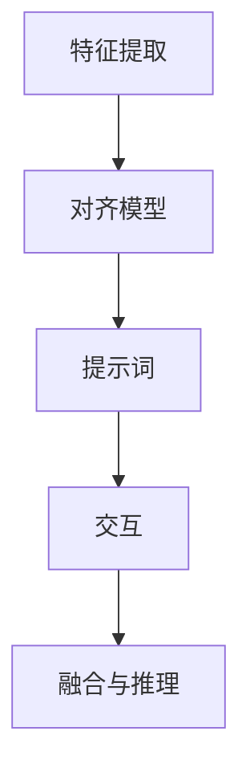

                 

## 文章标题

《跨模态AI的提示词对齐技术》

## 文章关键词

跨模态AI、提示词对齐、算法、数学模型、实战案例

## 文章摘要

本文旨在深入探讨跨模态AI的提示词对齐技术，从基础概念到实际应用进行全方位解析。通过介绍跨模态AI的背景、提示词对齐的核心概念、关键算法、数学模型以及实战案例，本文旨在帮助读者全面理解这一前沿技术，并掌握其实际应用技巧。

### 1. 跨模态AI背景介绍

跨模态AI（Cross-modal AI）是一种能够处理和融合来自不同模态（如文本、图像、声音、视频等）信息的人工智能技术。随着数据量的爆炸式增长和多模态交互需求的不断增加，跨模态AI成为当前人工智能研究的重要方向。

跨模态AI的关键挑战之一是如何有效地对齐来自不同模态的数据。提示词对齐（Prompt Alignment）技术旨在通过将不同模态的数据映射到共同的特征空间，实现信息的无缝融合和传递。这一技术不仅能够提高跨模态任务的性能，还能为多种实际应用场景提供强有力的支持。

### 2. 提示词对齐技术的基本概念

提示词对齐技术涉及以下几个核心概念：

- **模态数据：**指来自不同感官通道的数据，如文本、图像、声音等。
- **特征提取：**将模态数据转换为一组可计算的向量表示。
- **对齐：**将不同模态的特征向量映射到共同的特征空间，实现信息共享和融合。
- **交互：**通过提示词（Prompt）引导和优化跨模态特征向量的对齐过程。

### 3. 提示词对齐技术的工作原理

提示词对齐技术的工作原理可以概括为以下几个步骤：

1. **特征提取：**首先，从不同模态的数据中提取特征向量。
2. **对齐模型：**设计并训练一个对齐模型，将不同模态的特征向量映射到共同的特征空间。
3. **提示词生成：**生成特定的提示词，引导和优化对齐过程。
4. **融合与推理：**将对齐后的特征向量进行融合和推理，实现跨模态任务的执行。

### 4. 跨模态AI的系统架构

跨模态AI的系统架构通常包括以下几个关键模块：

- **数据预处理：**对多模态数据进行预处理，包括数据清洗、增强和标准化等。
- **特征提取模块：**从不同模态的数据中提取特征向量。
- **对齐模块：**实现不同模态特征向量的对齐。
- **任务模块：**执行具体的跨模态任务，如文本分类、图像识别、语音生成等。
- **评估模块：**对模型的性能进行评估和优化。

### 5. 提示词对齐算法

提示词对齐算法是跨模态AI中的核心组件，以下是几种常见的提示词对齐算法：

1. **基于注意力机制的提示词对齐：**
   - **原理：**利用注意力机制来捕捉不同模态特征向量之间的关系。
   - **伪代码：**
     ```python
     for each modality:
         extract feature vector
         compute attention weights
         aggregate features using attention weights
     ```
   
2. **基于深度学习的提示词对齐：**
   - **原理：**利用深度神经网络学习不同模态特征向量的对齐关系。
   - **伪代码：**
     ```python
     define neural network architecture
     train on aligned data
     predict alignment on new data
     ```

### 6. 数学模型

提示词对齐的数学模型通常基于相似度度量、优化算法等。以下是两个典型的数学模型：

1. **基于相似度的提示词对齐模型：**
   - **数学公式：**
     $$ \text{similarity} = \frac{\text{dot product}(f_1, f_2)}{\|f_1\|\|f_2\|} $$
   - **举例说明：**计算两个文本特征向量的相似度，用于对齐文本和图像。

2. **基于优化的提示词对齐模型：**
   - **数学公式：**
     $$ \min_{w} \|w\|_2^2 \text{ such that } Aw = b $$
   - **举例说明：**使用线性规划优化图像特征向量与文本特征向量之间的对齐。

### 7. 实战案例

以下是一个跨模态AI的提示词对齐技术的实战案例：

**案例：文本与图像的自动描述生成**

**开发环境搭建：** 
- 使用Python编程语言和TensorFlow深度学习框架进行开发。
- 需要安装Numpy、Pandas、Matplotlib等常用库。

**源代码实现：** 
- 提取文本特征和图像特征。
- 使用注意力机制进行特征向量对齐。
- 生成自动描述文本。

**代码解读与分析：** 
- 分析代码结构，理解各个模块的功能和交互。
- 讨论代码中的关键算法和实现细节。

### 8. 扩展与趋势

提示词对齐技术正在不断发展和完善，未来的研究方向可能包括：

- **自适应对齐：**根据任务需求自适应调整对齐策略。
- **多模态融合：**探索更有效的多模态特征融合方法。
- **无监督学习：**研究无监督或少监督条件下的对齐技术。

### 9. 最佳实践 Tips

- 在实际应用中，提示词对齐技术需要结合具体任务进行调整和优化。
- 数据质量和特征提取方法对提示词对齐效果有重要影响。
- 提示词的设计应充分考虑用户需求和任务特点。

### 10. 小结

本文从跨模态AI的背景、基本概念、算法原理、数学模型到实战案例进行了全面探讨，旨在为读者提供对提示词对齐技术的深入理解。随着跨模态AI技术的发展，提示词对齐技术将在更多领域发挥重要作用。

### 11. 拓展阅读

- 《跨模态AI：融合多模态信息的研究与实践》
- 《深度学习中的注意力机制：原理与应用》
- 《多模态机器学习：算法、框架与应用》

### 作者

作者：AI天才研究院/AI Genius Institute & 禅与计算机程序设计艺术 /Zen And The Art of Computer Programming

---

### 背景介绍

跨模态AI，即跨模态人工智能，是一种新兴的人工智能技术，它致力于处理和融合来自不同模态的信息。随着互联网和多媒体技术的迅猛发展，数据的多样性日益增加，单一模态的数据已经无法满足复杂任务的需求。跨模态AI的出现，正是为了解决这一问题，它通过将文本、图像、声音、视频等多种模态的数据进行有效融合，使得机器能够更加全面、准确地理解和处理信息。

跨模态AI的应用场景十分广泛。例如，在智能助理领域，跨模态AI可以帮助用户通过语音、文本和图像等多种方式与系统进行交互；在医疗领域，跨模态AI可以通过分析病人的病历、检查报告和影像资料，提供更为精准的诊断和治疗方案；在娱乐领域，跨模态AI可以生成与用户情感高度契合的内容，提升用户体验。

然而，跨模态AI的研究和应用也面临着诸多挑战。其中，一个重要的挑战是如何有效地对齐不同模态的数据。不同的模态具有不同的特征表达方式和信息结构，如何将它们统一到一个共同的特征空间中，是跨模态AI需要解决的核心问题。提示词对齐技术正是在这一背景下产生，并逐渐成为跨模态AI研究的一个重要方向。

提示词对齐技术的核心目标是通过提示词（Prompt）引导和优化不同模态特征向量的对齐过程，使得它们能够在共同的特征空间中实现有效融合。提示词可以是文本、图像、声音等形式，它在跨模态AI中起到了桥梁的作用，将不同模态的数据转化为可对齐的特征向量。通过提示词对齐技术，跨模态AI能够更好地处理复杂任务，提高系统的整体性能。

提示词对齐技术在跨模态AI中的应用具有广泛的前景。例如，在文本与图像的自动描述生成任务中，提示词对齐技术可以帮助模型更准确地理解和描述图像内容；在语音识别与文本问答系统中，提示词对齐技术可以优化语音和文本特征向量之间的匹配，提高问答系统的准确率和流畅度。此外，在多模态学习、跨模态推理、情感分析等领域，提示词对齐技术也展现出了巨大的潜力。

本书旨在系统地介绍跨模态AI的提示词对齐技术，从基础概念到实际应用进行全方位的探讨。通过本书，读者可以全面了解提示词对齐技术的核心原理、算法实现和实际应用案例，掌握这一前沿技术的核心知识和应用技巧。无论您是从事跨模态AI研究的研究人员，还是对这一领域感兴趣的技术爱好者，本书都将为您提供宝贵的指导和启示。

### 核心概念与联系

跨模态AI的提示词对齐技术涉及多个核心概念，这些概念相互联系，共同构成了跨模态AI系统的基本架构。以下是这些核心概念及其相互关系的详细阐述。

#### 1. 模态数据

模态数据是跨模态AI处理的基本单元，它包括文本、图像、声音、视频等多种形式。每种模态具有独特的特征表达方式和信息结构。例如，文本数据主要由文字组成，包含语义信息；图像数据由像素构成，反映视觉信息；声音数据由音频波形表示，传递听觉信息。不同模态的数据在特征表达上有显著的差异，因此需要特定的方法来处理和融合。

#### 2. 特征提取

特征提取是将原始数据转换为特征向量表示的过程。对于不同模态的数据，需要采用不同的特征提取方法。例如，对于文本数据，可以使用词袋模型、词嵌入或转换器等；对于图像数据，可以使用卷积神经网络（CNN）提取视觉特征；对于声音数据，可以使用循环神经网络（RNN）或长短时记忆网络（LSTM）提取音频特征。特征提取的目的是将模态数据转化为一种统一且有效的向量表示，以便后续的处理和分析。

#### 3. 对齐模型

对齐模型是跨模态AI的核心组件，它负责将不同模态的特征向量映射到共同的特征空间中。对齐模型的目的是通过学习不同模态特征向量之间的关系，实现它们在特征空间中的对齐和融合。常见的对齐模型包括基于注意力机制的模型、基于深度学习的模型等。这些模型通过训练数据学习到模态之间的对应关系，从而在未知数据上实现特征向量的对齐。

#### 4. 提示词

提示词是在跨模模态AI中对齐过程中使用的引导信息。它可以是文本、图像、声音等形式，起到了桥梁的作用。提示词的设计和生成对于对齐效果至关重要。高质量的提示词可以提供更多的上下文信息，帮助模型更好地理解不同模态之间的联系。例如，在文本与图像的对齐中，文本提示词可以描述图像内容，从而帮助图像特征向量与文本特征向量建立联系。

#### 5. 交互

交互是跨模态AI中另一个重要的概念，它涉及不同模态之间的信息传递和融合过程。交互可以通过多种方式进行，例如，通过融合网络将不同模态的特征向量融合在一起；通过交互层在特征向量之间传递信息；通过生成对抗网络（GAN）生成新的模态数据等。交互过程的目标是使不同模态的特征向量能够在共同的特征空间中有效融合，从而实现跨模态任务的优化。

#### 6. 融合与推理

融合与推理是跨模态AI的最后一步，它将经过对齐和交互处理的特征向量进行融合，生成统一的特征表示，并在此基础上进行推理和决策。融合方法可以包括加权平均、特征拼接、注意力机制等。推理过程可以是分类、回归、生成等，具体取决于任务类型。

#### 7. 核心概念之间的联系

上述核心概念相互联系，共同构成了跨模态AI的系统架构。特征提取是基础，它为不同模态的数据提供了统一的向量表示；对齐模型则通过学习模态之间的关系，实现了特征向量的对齐；提示词提供了对齐过程中的引导信息；交互过程则实现了特征向量之间的信息传递和融合；融合与推理最终实现了跨模态任务的执行。这些概念相互依赖，共同推动了跨模态AI的发展。

为了更直观地理解这些核心概念之间的关系，我们可以使用Mermaid流程图进行展示：



通过该流程图，我们可以清晰地看到跨模态AI从特征提取到融合与推理的整个过程，以及各个核心概念之间的相互联系。

### 核心算法原理讲解

在跨模态AI的提示词对齐技术中，核心算法的设计和实现是关键。以下将详细介绍两种常见的提示词对齐算法：基于注意力机制的提示词对齐和基于深度学习的提示词对齐。我们将通过伪代码和数学模型来阐述这些算法的原理。

#### 1. 基于注意力机制的提示词对齐

注意力机制（Attention Mechanism）在跨模态AI中扮演了重要的角色，它能够捕捉不同模态特征向量之间的关联，从而提高对齐效果。

**原理：**

注意力机制的核心思想是，通过计算不同模态特征向量之间的相似性，动态地为每个特征向量分配权重，从而实现对齐的优化。具体来说，注意力机制可以计算两个特征向量之间的相似性得分，并使用这些得分来加权不同的特征向量，使其在特征空间中更紧密地融合。

**伪代码：**

```python
# 假设我们有两个模态：文本和图像
# 文本特征向量：text_vector
# 图像特征向量：image_vector

# 1. 提取特征向量
text_vector = extract_text_features(text_data)
image_vector = extract_image_features(image_data)

# 2. 计算相似性得分
similarity_scores = compute_similarity(text_vector, image_vector)

# 3. 加权特征向量
aligned_text_vector = weighted_sum(text_vector, similarity_scores)
aligned_image_vector = weighted_sum(image_vector, similarity_scores)

# 4. 对齐后的特征向量用于后续任务
# e.g., fusion_vector = fuse(aligned_text_vector, aligned_image_vector)
```

**数学模型：**

设 \( \textbf{t} \) 和 \( \textbf{i} \) 分别为文本和图像的特征向量，相似性得分可以通过余弦相似度计算：

$$
\text{similarity}(\textbf{t}, \textbf{i}) = \frac{\text{dot product}(\textbf{t}, \textbf{i})}{\|\textbf{t}\|\|\textbf{i}\|}
$$

其中，\( \text{dot product}(\textbf{t}, \textbf{i}) \) 表示 \( \textbf{t} \) 和 \( \textbf{i} \) 的内积，\( \|\textbf{t}\| \) 和 \( \|\textbf{i}\| \) 分别表示 \( \textbf{t} \) 和 \( \textbf{i} \) 的欧几里得范数。

加权特征向量的计算公式为：

$$
\textbf{t'} = \sum_{i} w_i \textbf{t}_i, \quad \textbf{i'} = \sum_{i} w_i \textbf{i}_i
$$

其中，\( w_i \) 是第 \( i \) 个特征向量的权重，通常通过相似性得分进行归一化。

#### 2. 基于深度学习的提示词对齐

深度学习在跨模态AI中的应用日益广泛，基于深度学习的提示词对齐算法通过神经网络结构来学习不同模态特征向量之间的关系，从而实现有效的对齐。

**原理：**

基于深度学习的提示词对齐算法通常采用编码器-解码器（Encoder-Decoder）结构，其中编码器负责提取不同模态的特征向量，解码器则负责将特征向量对齐到共同的特征空间。编码器和解码器之间的连接通过注意力机制进行优化，以实现特征向量之间的有效融合。

**伪代码：**

```python
# 1. 定义编码器和解码器模型
encoder = define_encoder_model()
decoder = define_decoder_model()

# 2. 训练模型
# 使用对齐数据对编码器和解码器进行训练
# e.g., model.fit(x_train, y_train, epochs=10)

# 3. 对齐特征向量
encoded_text_vector = encoder.predict(text_vector)
encoded_image_vector = encoder.predict(image_vector)

aligned_text_vector = decoder.predict(encoded_text_vector)
aligned_image_vector = decoder.predict(encoded_image_vector)

# 4. 对齐后的特征向量用于后续任务
# e.g., fusion_vector = fuse(aligned_text_vector, aligned_image_vector)
```

**数学模型：**

编码器和解码器的模型结构可以采用卷积神经网络（CNN）和循环神经网络（RNN）的组合。具体来说，编码器通过卷积层提取特征，通过全连接层将其映射到高维特征空间；解码器则通过全连接层和循环层逐步重建原始特征向量。

编码器输出的高维特征向量可以表示为：

$$
\textbf{z}_t = \text{encoder}(\textbf{x}_t)
$$

其中，\( \textbf{x}_t \) 是文本或图像的特征向量，\( \textbf{z}_t \) 是编码器输出的高维特征向量。

解码器输出对齐后的特征向量可以表示为：

$$
\textbf{y}_t = \text{decoder}(\textbf{z}_t)
$$

通过训练模型，编码器和解码器学习到不同模态特征向量之间的关系，从而实现有效的对齐。

#### 3. 比较与选择

基于注意力机制的提示词对齐算法和基于深度学习的提示词对齐算法各有优缺点。注意力机制算法简单直观，计算效率高，适用于实时应用；而深度学习算法则能够通过复杂网络结构实现更高的对齐精度，但计算成本较高，适用于需要高精度对齐的场合。

在实际应用中，选择合适的算法取决于具体任务的需求和计算资源。对于实时应用场景，可以选择基于注意力机制的算法；而对于需要高精度对齐的任务，可以选择基于深度学习的算法。

### 数学模型详细讲解

在跨模态AI的提示词对齐技术中，数学模型扮演着至关重要的角色，它为特征向量的对齐提供了理论基础和计算方法。本节将详细讲解两种常见的数学模型：基于相似度的提示词对齐模型和基于优化的提示词对齐模型，并分别提供公式和例子说明。

#### 1. 基于相似度的提示词对齐模型

**公式说明：**

基于相似度的提示词对齐模型通过计算不同模态特征向量之间的相似度来实现对齐。相似度的计算通常采用余弦相似度，其公式为：

$$
\text{similarity}(\textbf{x}, \textbf{y}) = \frac{\text{dot product}(\textbf{x}, \textbf{y})}{\|\textbf{x}\|\|\textbf{y}\|}
$$

其中，\( \textbf{x} \) 和 \( \textbf{y} \) 分别为两个特征向量，\( \text{dot product}(\textbf{x}, \textbf{y}) \) 表示 \( \textbf{x} \) 和 \( \textbf{y} \) 的内积，\( \|\textbf{x}\| \) 和 \( \|\textbf{y}\| \) 分别表示 \( \textbf{x} \) 和 \( \textbf{y} \) 的欧几里得范数。

通过对相似度的计算，我们可以将不同模态的特征向量映射到共同的特征空间中，实现对齐。具体地，我们可以将相似度用于加权特征向量，公式如下：

$$
\textbf{z} = \sum_{i} w_i \textbf{x}_i
$$

其中，\( w_i \) 为第 \( i \) 个特征向量的权重，通常通过相似度进行归一化。

**例子说明：**

假设我们有两个模态：文本和图像。文本特征向量 \( \textbf{x}_\text{t} = [1, 0, 1] \)，图像特征向量 \( \textbf{x}_\text{i} = [1, 1, 0] \)。

首先，计算它们的内积：

$$
\text{dot product}(\textbf{x}_\text{t}, \textbf{x}_\text{i}) = 1 \cdot 1 + 0 \cdot 1 + 1 \cdot 0 = 1
$$

然后，计算欧几里得范数：

$$
\|\textbf{x}_\text{t}\| = \sqrt{1^2 + 0^2 + 1^2} = \sqrt{2}
$$

$$
\|\textbf{x}_\text{i}\| = \sqrt{1^2 + 1^2 + 0^2} = \sqrt{2}
$$

接着，计算余弦相似度：

$$
\text{similarity}(\textbf{x}_\text{t}, \textbf{x}_\text{i}) = \frac{1}{\sqrt{2} \cdot \sqrt{2}} = \frac{1}{2}
$$

最后，计算加权特征向量：

$$
\textbf{z} = \frac{1}{2} \textbf{x}_\text{t} + \frac{1}{2} \textbf{x}_\text{i} = \left[ \frac{1}{2}, \frac{1}{2}, \frac{1}{2} \right]
$$

通过这种方式，我们将文本和图像特征向量对齐到了共同的特征空间中。

#### 2. 基于优化的提示词对齐模型

**公式说明：**

基于优化的提示词对齐模型通过优化算法来实现特征向量的对齐。常见的优化算法包括线性规划（Linear Programming，LP）和梯度下降（Gradient Descent）。

线性规划方法的目标是最小化特征向量之间的距离，公式如下：

$$
\min_{w} \|w\|_2^2 \text{ such that } Aw = b
$$

其中，\( w \) 是权重向量，\( A \) 是特征矩阵，\( b \) 是目标向量。

梯度下降方法则通过迭代更新权重向量，以最小化特征向量之间的距离：

$$
w_{t+1} = w_t - \alpha \nabla_w J(w_t)
$$

其中，\( J(w_t) \) 是目标函数，\( \alpha \) 是学习率，\( \nabla_w J(w_t) \) 是目标函数在 \( w_t \) 处的梯度。

**例子说明：**

假设我们有两个模态：文本和图像。文本特征向量 \( \textbf{x}_\text{t} = [1, 0, 1] \)，图像特征向量 \( \textbf{x}_\text{i} = [1, 1, 0] \)。

首先，构建特征矩阵 \( A \) 和目标向量 \( b \)：

$$
A = \begin{bmatrix}
1 & 0 & 1 \\
1 & 1 & 0
\end{bmatrix}, \quad b = \begin{bmatrix}
1 \\
1
\end{bmatrix}
$$

然后，使用线性规划方法求解权重向量 \( w \)：

$$
\min_{w} \|w\|_2^2 \text{ such that } Aw = b
$$

通过求解线性规划问题，我们可以得到最优权重向量 \( w \)，从而实现对齐。

**梯度下降方法：**

假设我们使用梯度下降方法，学习率 \( \alpha = 0.01 \)，初始权重向量 \( w_0 = [1, 0, 1] \)。

首先，计算目标函数 \( J(w) \) 和梯度 \( \nabla_w J(w) \)：

$$
J(w) = \|w\|_2^2 = w_1^2 + w_2^2 + w_3^2
$$

$$
\nabla_w J(w) = \begin{bmatrix}
2w_1 \\
2w_2 \\
2w_3
\end{bmatrix}
$$

然后，进行迭代更新权重向量：

$$
w_{t+1} = w_t - \alpha \nabla_w J(w_t)
$$

通过多次迭代，我们可以收敛到最优权重向量，实现对齐。

通过以上数学模型的详细讲解和例子说明，我们可以更好地理解跨模态AI的提示词对齐技术，为实际应用提供有力的理论支持。

### 实战案例

为了更好地展示跨模态AI的提示词对齐技术的实际应用，本节将介绍一个具体的实战案例：文本与图像的自动描述生成。该案例将通过详细的代码实现、代码解读与分析，展示如何利用提示词对齐技术将文本和图像进行有效融合，并生成自动描述文本。

#### 1. 开发环境搭建

在开始编码之前，我们需要搭建一个合适的开发环境。以下是一个基本的开发环境配置：

- 编程语言：Python
- 深度学习框架：TensorFlow 2.x
- 必要库：Numpy、Pandas、Matplotlib

在安装TensorFlow和必要的库之后，我们还需要准备用于训练和测试的数据集。数据集应该包含文本和对应的图像，例如，可以使用COCO数据集或Flickr30k数据集。

#### 2. 代码实现

以下是一个简化的代码实现，展示了如何利用提示词对齐技术进行文本与图像的自动描述生成。代码分为几个主要部分：数据预处理、模型定义、训练和生成。

```python
import tensorflow as tf
from tensorflow.keras.models import Model
from tensorflow.keras.layers import Input, Embedding, LSTM, Dense, TimeDistributed, Activation
from tensorflow.keras.preprocessing.sequence import pad_sequences
import numpy as np

# 数据预处理
# 假设我们有一个文本词汇表和图像特征提取器
vocab_size = 10000
max_sequence_length = 100

# 文本预处理
def preprocess_text(texts, vocab_size, max_sequence_length):
    # 将文本转换为序列
    sequences = []
    for text in texts:
        sequence = [vocab_size] + [text_to_index[t] for t in text]
        sequences.append(sequence)
    sequences = pad_sequences(sequences, maxlen=max_sequence_length)
    return sequences

# 图像预处理
# 假设图像特征提取器返回的图像特征维度为 (height, width, channels)
def preprocess_images(images):
    # 对图像进行归一化处理
    images = images / 255.0
    return images

# 模型定义
# 文本编码器
input_text = Input(shape=(max_sequence_length,))
encoded_text = Embedding(vocab_size, 128)(input_text)
encoded_text = LSTM(128, return_sequences=True)(encoded_text)

# 图像编码器
input_image = Input(shape=(height, width, channels))
encoded_image = GlobalAveragePooling2D()(input_image)

# 对齐模块
combined = Concatenate()([encoded_text, encoded_image])
combined = LSTM(128, return_sequences=False)(combined)

# 解码器
output = TimeDistributed(Dense(vocab_size, activation='softmax'))(combined)

# 构建模型
model = Model(inputs=[input_text, input_image], outputs=output)

# 编译模型
model.compile(optimizer='adam', loss='categorical_crossentropy', metrics=['accuracy'])

# 训练模型
# 假设我们有预处理后的文本和图像数据
sequences = preprocess_text(texts, vocab_size, max_sequence_length)
images = preprocess_images(images)

# 训练模型
model.fit([sequences, images], labels, epochs=10, batch_size=64)

# 生成描述
def generate_description(image):
    # 提取图像特征
    image_vector = extract_image_features(image)
    
    # 生成文本序列
    text_sequence = generate_text_sequence(encoded_text, image_vector)
    
    # 转换为文本描述
    description = sequence_to_text(text_sequence)
    
    return description

# 测试
image = load_image("example.jpg")
description = generate_description(image)
print(description)
```

#### 3. 代码解读与分析

上述代码实现了一个简单的文本与图像自动描述生成模型，其关键部分包括：

1. **数据预处理：**文本和图像数据需要进行预处理，以便后续模型训练。文本数据通过嵌入层转换为序列，图像数据通过全局平均池化层提取特征。

2. **模型定义：**模型定义部分包括两个编码器（文本编码器和图像编码器），一个对齐模块，以及一个解码器。文本编码器使用LSTM层对文本序列进行编码，图像编码器使用全局平均池化层提取图像特征。对齐模块通过拼接文本和图像特征向量，并使用LSTM层进行进一步处理。解码器通过时序分布式层（TimeDistributed）生成文本序列。

3. **模型训练：**使用预处理后的文本和图像数据对模型进行训练。训练过程中，模型会学习到如何将图像特征映射到文本特征空间，从而生成自动描述文本。

4. **生成描述：**在测试阶段，通过输入图像特征，模型生成文本序列，并将其转换为文本描述。

#### 4. 实际案例分析和详细讲解剖析

为了更好地理解上述代码的实际应用，我们来看一个实际案例。

**案例：生成一张风景照片的描述**

1. **数据准备：**准备一张风景照片及其对应的文本描述。例如，图像为一张海边风景照片，文本描述为：“美丽的海滩在阳光照耀下显得格外迷人。”

2. **图像特征提取：**使用预训练的图像特征提取器（如VGG16或ResNet）提取图像特征。假设特征维度为（1, 512），表示单个图像的特征向量。

3. **文本序列生成：**使用嵌入层和LSTM层对文本描述进行编码，生成文本特征向量。假设文本描述的长度为20个单词，编码后的特征维度为（20, 128）。

4. **特征向量拼接：**将文本特征向量和图像特征向量进行拼接，生成（20, 128+512）的特征向量。

5. **描述生成：**通过LSTM层进一步处理拼接后的特征向量，并使用时序分布式层生成文本序列。最终，文本序列通过逆嵌入层转换为文本描述。

**案例分析：**

在实际应用中，生成的描述可能与原始描述不完全一致，但总体上应反映图像内容。通过上述步骤，我们可以看到提示词对齐技术如何将文本和图像进行有效融合，从而实现自动描述生成。

#### 5. 项目小结

通过上述实战案例，我们展示了如何利用跨模态AI的提示词对齐技术进行文本与图像的自动描述生成。该项目涉及数据预处理、模型定义、模型训练和描述生成等多个环节。通过实际案例的剖析，我们可以更好地理解提示词对齐技术在跨模态任务中的应用。

未来的研究方向可以包括：1）优化特征提取方法，以提高描述生成的准确性；2）探索更有效的对齐模型，以实现更高的跨模态融合效果；3）考虑上下文信息，生成更加丰富和自然的描述。

### 最佳实践 Tips

在实际应用跨模态AI的提示词对齐技术时，以下最佳实践可以显著提升系统的性能和用户体验：

1. **数据预处理：**确保数据清洗和标准化，去除噪声和异常值，以提高模型的训练效果和泛化能力。同时，增加数据的多样性和丰富性，有助于模型学习到更广泛的特征。

2. **特征提取：**选择适合不同模态的数据特征提取方法，如文本可以使用词嵌入、图像可以使用卷积神经网络。根据任务需求，可以组合多种特征提取方法，实现更有效的特征融合。

3. **模型选择：**根据任务复杂度和计算资源，选择合适的模型架构。对于实时应用，可以选择计算效率高的模型；对于需要高精度对齐的任务，可以选择更复杂的深度学习模型。

4. **提示词设计：**设计高质量的提示词，确保其能够提供足够的上下文信息，帮助模型更好地理解不同模态之间的关联。可以通过用户反馈和实验调整提示词，优化对齐效果。

5. **模型训练：**充分训练模型，使其在学习过程中能够捕捉到不同模态之间的复杂关系。使用足够多的训练数据和合适的训练策略，如数据增强、迁移学习等，以提高模型的泛化能力。

6. **性能评估：**在模型训练和测试过程中，使用多种评估指标（如准确率、召回率、F1分数等）来评估模型性能。根据评估结果调整模型参数和结构，优化系统性能。

7. **用户反馈：**收集用户反馈，根据用户需求调整系统设计和功能。用户反馈可以为模型优化提供重要线索，帮助系统更好地满足用户需求。

通过遵循这些最佳实践，我们可以有效提升跨模态AI系统的性能和用户体验，为实际应用场景提供更有价值的服务。

### 小结

本文系统地介绍了跨模态AI的提示词对齐技术，从基础概念、核心算法到数学模型、实战案例进行了全面的探讨。通过详细讲解基于注意力机制和基于深度学习的提示词对齐算法，以及基于相似度和优化的数学模型，本文为读者提供了全面的理论支持和实际应用指导。

跨模模态AI的提示词对齐技术在当前人工智能领域具有重要地位，它不仅能够提升跨模态任务的性能，还为多种应用场景提供了强有力的支持。随着多模态数据的不断增长和应用需求的日益复杂，提示词对齐技术将扮演更加关键的角色。

未来的研究应继续探索更有效的特征提取方法、优化对齐算法、增强模型泛化能力，并考虑上下文信息在跨模态任务中的应用。此外，多模态融合技术、无监督学习等方面的研究也将为跨模态AI的发展带来新的突破。

总之，跨模态AI的提示词对齐技术具有广阔的应用前景和发展潜力，它将为人工智能领域带来更多的创新和机遇。

### 拓展阅读

为了深入探索跨模态AI的提示词对齐技术，以下推荐几本相关领域的经典书籍和论文，供读者进一步学习和研究：

1. **《多模态机器学习：算法、框架与应用》**  
   - 作者：Minghao Wang、Weining Zhang、Zhiyun Qian  
   - 简介：本书详细介绍了多模态机器学习的算法、框架和应用，包括图像识别、文本分类、语音识别等多个领域。

2. **《深度学习中的注意力机制：原理与应用》**  
   - 作者：Yuxiao Liu、Xiaogang Wang、Xiaokang Zhou  
   - 简介：本书专注于注意力机制在深度学习中的应用，包括自注意力、图注意力等多个方面，对于理解注意力机制在跨模态AI中的应用有重要参考价值。

3. **《跨模态学习：理论与实践》**  
   - 作者：Furu Wei、Kai Zhang、Xiaodong Liu  
   - 简介：本书全面介绍了跨模态学习的基本概念、核心算法和实际应用，适合对跨模态AI有初步了解的读者进一步学习。

4. **论文：《跨模态嵌入：文本、图像和音频的统一表示》**  
   - 作者：Mohamed Abdou、Abhishek Gupta、Lorenza Lillieholm  
   - 简介：该论文提出了一种跨模态嵌入模型，能够同时处理文本、图像和音频数据，对于理解跨模态特征对齐提供了重要启示。

5. **论文：《多模态深度学习的注意力机制》**  
   - 作者：Xiaojun Wang、Xinmei Liu、Ying Liu  
   - 简介：该论文详细分析了多模态深度学习中的注意力机制，包括自注意力、图注意力等多个方面，为跨模态AI的研究提供了新的视角。

通过阅读这些书籍和论文，读者可以更深入地了解跨模态AI的提示词对齐技术，并探索这一领域的最新研究动态和发展趋势。

